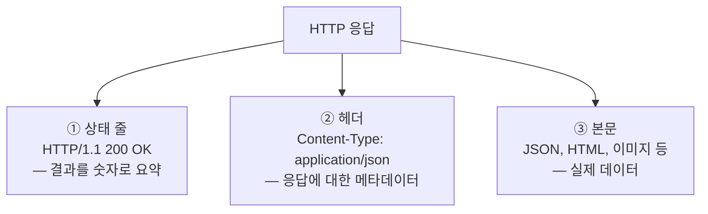
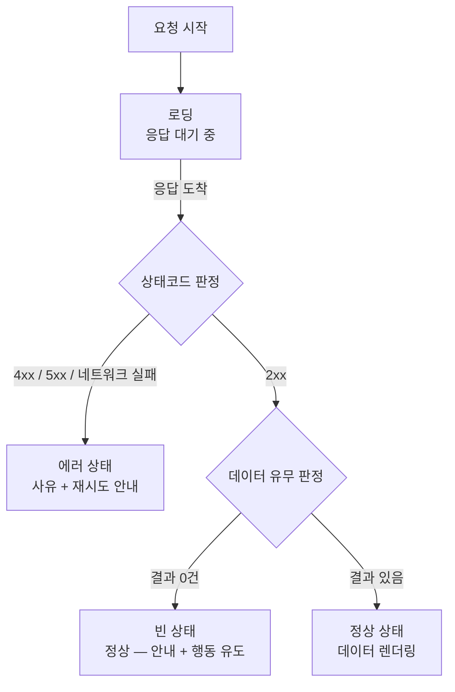

<Callout type="info">
  **이번 문서의 목표:** 서버 응답을 받았을 때 "이건 성공인가, 실패인가, 성공인데 비어 있는 건가"를 상태코드와 응답 본문 구조로 정확히 판정하고, 화면에 로딩·에러·빈 상태 중 무엇을 보여줄지 스스로 결정할 수 있게 된다. 이 판정 기준은 03편부터 배울 TanStack Query의 에러 처리, 07편의 서버 에러 매핑, 09편의 테스트 시나리오 설계 전부의 재료가 된다.
</Callout>

## 왜 도구보다 "서버의 말"부터 배우는가

01편에서 서버 상태는 전용 도구에 맡기자고 결론 내렸습니다. 그런데 도구를 배우기 전에 한 가지 관문이 있습니다 — **서버가 보내오는 응답을 읽을 줄 알아야** 도구를 제대로 설정할 수 있다는 점입니다.

실무에서 이런 코드를 정말 자주 봅니다.

```js
fetch("/api/posts")
  .then((res) => res.json())
  .then((data) => setPosts(data))
  .catch(() => alert("에러!"));
```

겉보기엔 멀쩡하지만 이 코드에는 치명적인 오해가 숨어 있습니다. **서버가 404나 500을 응답해도 `catch`로 가지 않습니다.** `fetch`는 네트워크 연결 자체가 실패했을 때만 거부(reject)되고, 서버가 "실패했다"고 답한 것은 응답을 받은 것이므로 성공으로 취급하기 때문입니다. 즉 이 코드는 서버가 에러 페이지 HTML을 보내와도 그걸 JSON으로 파싱하려다 엉뚱한 곳에서 터집니다.

이런 오해가 생기는 이유는 단 하나 — HTTP 응답의 구조를 배운 적이 없기 때문입니다. 이 편에서 그 구조를 바닥부터 세웁니다.

## 1. HTTP 응답의 해부 — 상태코드, 헤더, 본문

**HTTP**(HyperText Transfer Protocol)는 웹의 통신 규약입니다. 이름을 쪼개 보면 Hyper(초월한)·Text(문서)·Transfer(전송)·Protocol(규약) — 원래 "링크로 연결된 문서를 주고받는 약속"으로 태어났고, 지금은 JSON 데이터를 나르는 API 통신의 표준이 되었습니다. HTTP는 01편에서 본 대로 **요청-응답**(request-response) 모델입니다: 클라이언트가 물으면 서버가 답합니다.

서버의 답, 즉 **응답**(response)은 항상 세 부분으로 구성됩니다.



> **쉽게 말하면:** 택배 상자와 같습니다. 상태코드는 상자에 붙은 "배송 완료/반송" 스탬프, 헤더는 송장(보낸 사람, 내용물 종류, 무게), 본문은 상자 안의 실제 물건입니다. 스탬프를 안 읽고 상자부터 뜯으면 반송된 빈 상자를 뜯게 됩니다.

- **상태코드**(status code): 요청 처리 결과를 요약한 세 자리 숫자. 아래에서 깊게 다룹니다.
- **헤더**(header): 응답에 대한 부가 정보. 예를 들어 `Content-Type: application/json`은 "본문이 JSON 형식이다"라는 뜻입니다. 이 헤더가 `text/html`인데 `res.json()`을 호출하면 파싱 에러가 납니다 — 위 함정 코드가 터지는 지점이 바로 여기입니다.
- **본문**(body): 실제 데이터. API에서는 대부분 **JSON**(JavaScript Object Notation, 자바스크립트 객체 표기법에서 온 데이터 형식)입니다.

## 2. 상태코드 — 세 자리 숫자에 담긴 서버의 판정

> **쉽게 말하면:** 상태코드의 첫 자리는 "누구 책임인가"를 말해줍니다. 2는 성공, 4는 **요청한 쪽**(클라이언트) 잘못, 5는 **응답하는 쪽**(서버) 잘못.

상태코드는 첫 자리 숫자로 다섯 부류로 나뉩니다. 부류를 영어로 클래스(class)라고 부르며, `4xx`처럼 표기하면 "400번대 전체"를 뜻합니다.

| 부류 | 의미 | 대표 코드 | 클라이언트가 할 일 |
|------|------|-----------|-------------------|
| `1xx` | 정보 — 처리 중 | 100 Continue | 실무 API에서 볼 일 거의 없음 |
| `2xx` | 성공 | 200, 201, 204 | 본문을 신뢰하고 화면에 반영 |
| `3xx` | 리다이렉션 — 다른 곳으로 가라 | 301, 302, 304 | 대부분 브라우저·fetch가 자동 처리 |
| `4xx` | 클라이언트 에러 — 요청이 잘못됨 | 400, 401, 403, 404, 422 | **요청을 고쳐야** 함 — 재시도해도 같은 결과 |
| `5xx` | 서버 에러 — 서버가 처리 실패 | 500, 502, 503 | 요청은 정상일 수 있음 — **재시도 가치 있음** |

여기서 실무 설계에 직결되는 통찰이 하나 나옵니다. **4xx와 5xx는 "누구 잘못인가"만 다른 게 아니라 "재시도할 가치가 있는가"가 다릅니다.** 존재하지 않는 글을 요청한 404는 백 번 다시 보내도 404입니다. 반면 서버가 일시적으로 과부하였던 503은 잠시 후 다시 보내면 성공할 수 있습니다. 03편에서 TanStack Query의 `retry` 옵션을 설계할 때 이 구분이 그대로 기준이 됩니다.

### 자주 만나는 코드 하나씩 깊게

- **200 OK**: 가장 평범한 성공. GET 요청의 결과 데이터가 본문에 담깁니다.
- **201 Created**: 생성 성공. POST로 새 글을 만들었을 때의 정석 응답이며, 본문에 방금 생성된 리소스(id가 채워진 글 객체)를 담아주는 것이 관례입니다. 04편의 뮤테이션 성공 처리에서 이 본문을 활용합니다.
- **204 No Content**: 성공했고 **본문이 없음**. 삭제(DELETE) 성공 응답으로 흔합니다. 주의 — 본문이 없으므로 `res.json()`을 호출하면 파싱 에러가 납니다. "성공인데 json()에서 터진다"는 미스터리 버그의 단골 원인입니다.
- **400 Bad Request**: 요청 형식 자체가 잘못됨 — 필수 필드 누락, 타입 오류 등.
- **401 Unauthorized**: **인증**(authentication, 너 누구야?) 실패. 로그인이 안 됐거나 토큰이 만료된 상태입니다. 이름은 Unauthorized지만 실제 의미는 "Unauthenticated(인증 안 됨)"에 가깝다는 점이 유명한 명명 실수입니다.
- **403 Forbidden**: **인가**(authorization, 너 이거 해도 돼?) 실패. 로그인은 했지만 권한이 없는 경우 — 예: 일반 회원이 관리자 페이지 요청. 401은 "로그인 화면으로 보내라", 403은 "권한 없음 안내를 보여라"로 클라이언트의 대응이 갈립니다.
- **404 Not Found**: 요청한 리소스가 없음. 뒤에서 "빈 목록"과의 구분을 깊게 다룹니다.
- **422 Unprocessable Entity**: 형식은 맞는데 **내용이 검증에 실패**함 — 예: 이메일 필드에 이메일 아닌 값. 폼 제출 시 필드별 검증 에러를 담아 보내는 코드로 자주 쓰이며, 07편의 서버 에러 → 필드 매핑에서 주인공이 됩니다.
- **500 Internal Server Error**: 서버 코드가 터짐. 클라이언트가 고칠 수 있는 게 없습니다.
- **503 Service Unavailable**: 서버가 일시적으로 응답 불가(점검·과부하). 잠시 후 재시도가 유효한 대표 사례입니다.

<Callout type="warning">
  **자주 틀리는 점:** 401과 403을 혼동하면 UX가 망가집니다. 401에서 "권한이 없습니다"를 보여주면 사용자는 로그인하면 해결될 일을 포기하고, 403에서 로그인 화면으로 보내면 이미 로그인한 사용자가 무한 루프에 빠집니다. 인증은 신분 확인, 인가는 권한 확인 — 반드시 구분하세요.
</Callout>

### fetch는 4xx·5xx를 실패로 취급하지 않는다

서두의 함정을 이제 정확히 해부할 수 있습니다. `fetch`의 Promise는 **네트워크 계층의 성패**만 봅니다. 서버에 연결조차 못 했을 때(인터넷 끊김, DNS 실패, CORS 차단)만 reject되고, 서버가 뭐라도 응답하면 — 그게 500이어도 — resolve됩니다. 응답 객체의 `res.ok`(상태코드가 200–299면 true)와 `res.status`를 **개발자가 직접 검사**해야 합니다.

```js
async function fetchPosts() {
  const res = await fetch("/api/posts");

  if (!res.ok) {
    // 서버가 4xx/5xx로 답함 — 여기서 명시적으로 에러로 승격시킨다
    throw new Error("요청 실패: " + res.status);
  }
  return res.json(); // 2xx일 때만 본문 파싱
}
```

이렇게 "HTTP 에러를 자바스크립트 에러로 승격"시켜 던져야, 이를 받아 쓰는 쪽(그리고 03편의 TanStack Query)이 에러 상태로 인식할 수 있습니다. 참고로 axios 같은 라이브러리는 4xx/5xx를 자동으로 reject해 주지만, 그 편리함도 결국 내부에서 이 검사를 대신해 주는 것뿐입니다 — 원리를 알아야 도구의 동작을 예측할 수 있습니다.

## 3. REST API 응답 패턴 — 본문 안의 구조 읽기

**REST**(REpresentational State Transfer)는 API를 설계하는 스타일입니다. 핵심 아이디어만 요약하면 — 서버의 데이터를 **리소스**(resource, 자원)라는 단위로 보고, URL로 리소스를 가리키고, HTTP **메서드**(method, 동사 역할)로 행위를 표현합니다.

| 메서드 | 행위 | 예시 | 성공 시 관례 |
|--------|------|------|--------------|
| GET | 조회 | GET /posts/3 | 200 + 리소스 본문 |
| POST | 생성 | POST /posts | 201 + 생성된 리소스 |
| PUT | 전체 교체 | PUT /posts/3 | 200 또는 204 |
| PATCH | 부분 수정 | PATCH /posts/3 | 200 + 수정된 리소스 |
| DELETE | 삭제 | DELETE /posts/3 | 204 (본문 없음) |

> **쉽게 말하면:** URL은 명사(무엇을), 메서드는 동사(어떻게)입니다. "GET /posts/3"은 "3번 글을 **조회**하라", "DELETE /posts/3"은 "3번 글을 **삭제**하라" — 문장처럼 읽힙니다.

### 응답 본문의 세 구성원 — 데이터, 에러, 메타

REST에 "본문은 반드시 이 모양이어야 한다"는 표준은 없습니다. 하지만 실무 API들은 대체로 세 종류의 정보를 담으며, 이 구조를 읽을 줄 알면 처음 보는 API도 금방 파악됩니다.

**① 데이터**(data) — 요청한 리소스 그 자체입니다. 리소스를 바로 최상위에 두는 API도 있고, `data`라는 봉투(envelope, 엔벨로프)로 감싸는 API도 있습니다.

```json
{
  "data": [
    { "id": 1, "title": "첫 번째 글", "author": "kim" },
    { "id": 2, "title": "두 번째 글", "author": "lee" }
  ]
}
```

**② 메타**(meta) — 데이터에 대한 데이터입니다. 대표가 **페이지네이션**(pagination, 데이터를 페이지 단위로 잘라 주는 것) 정보입니다. 글이 10만 개라면 한 번에 다 줄 수 없으니 서버는 "이번엔 1페이지, 20개씩, 전체 5,000페이지"라는 안내를 함께 보냅니다.

```json
{
  "data": [ ... ],
  "meta": {
    "page": 1,
    "perPage": 20,
    "totalItems": 100000,
    "totalPages": 5000
  }
}
```

이 메타가 있어야 클라이언트는 "다음 페이지 버튼을 보여줄지"를 결정할 수 있습니다. 05편의 페이지네이션·무한 스크롤 캐시 설계에서 이 구조를 그대로 사용합니다.

**③ 에러**(error) — 실패했을 때 "왜, 어떤 필드가" 실패했는지를 담습니다. 좋은 API의 에러 본문은 사람용 메시지와 기계용 코드, 그리고 필드 단위 상세를 함께 줍니다.

```json
{
  "error": {
    "code": "VALIDATION_FAILED",
    "message": "입력값을 확인해 주세요.",
    "fieldErrors": {
      "email": "올바른 이메일 형식이 아닙니다.",
      "password": "8자 이상이어야 합니다."
    }
  }
}
```

- `code`: 기계가 분기하기 위한 식별자. 메시지 문구는 바뀌어도 코드는 유지되므로, 클라이언트 로직은 반드시 `code`로 분기해야 합니다(메시지 문자열 비교는 서버가 문구만 고쳐도 깨집니다).
- `message`: 사람에게 보여줄 전체 메시지.
- `fieldErrors`: 폼의 어느 필드가 왜 틀렸는지. 이 객체를 react-hook-form의 필드 에러로 옮겨 심는 작업이 07편의 핵심입니다.

<Callout type="warning">
  **자주 틀리는 점:** 상태코드만 보고 본문을 버리거나, 본문만 보고 상태코드를 무시하는 것 — 둘 다 반쪽입니다. 판정의 1차 기준은 상태코드(성공/실패의 부류), 상세 사유는 본문(무엇이 왜)입니다. 특히 일부 레거시 API는 항상 200을 주고 본문의 success 필드로 성패를 표현하기도 하는데, 이런 API를 만나면 요청 함수 안에서 본문 검사 후 직접 throw하여 "상태코드 방식"으로 정규화해 두는 것이 이후 모든 코드를 단순하게 만듭니다.
</Callout>

## 4. 로딩·에러·빈 상태 — 화면 분기의 판정 기준

이제 이 편의 최종 목표인 화면 분기 기준을 세웁니다. 서버 상태를 보여주는 화면은 언제나 네 가지 모습 중 하나입니다.



핵심은 판정이 **두 단계**라는 점입니다. 먼저 상태코드로 성공/실패를 가르고, 성공일 때만 데이터 유무로 정상/빈 상태를 가릅니다. 이 순서를 지키지 않으면 아래 함정들에 빠집니다.

### 404 vs 빈 목록 — 가장 많이 헷갈리는 경계

"글이 하나도 없다"를 서버가 표현하는 방법은 상황에 따라 다릅니다.

- **GET /posts** 의 결과가 0건 → **200 + 빈 배열** `[]` 이 정석입니다. "글 목록"이라는 리소스 자체는 존재하고, 그 내용이 비었을 뿐이기 때문입니다.
- **GET /posts/999** 인데 999번 글이 없음 → **404** 가 정석입니다. 가리킨 리소스 자체가 존재하지 않기 때문입니다.

> **쉽게 말하면:** 도서관에서 "소설 코너에 책이 한 권도 없네요"는 정상 상황(빈 상태)이고, "이 도서관에 소설 코너 자체가 없는데요"는 잘못 찾아온 상황(404)입니다.

이 구분이 UX를 가릅니다. 빈 목록에 "오류가 발생했습니다"를 띄우면 사용자는 멀쩡한 앱을 고장 났다고 오해하고, 404에 텅 빈 화면만 보여주면 사용자는 무엇이 잘못됐는지 모릅니다. 올바른 대응은 —

| 상황 | 화면 |
|------|------|
| 로딩 | 스피너 또는 스켈레톤 — 단, 짧은 요청엔 깜빡임 방지 고려 |
| 에러 4xx | 사유 안내 — 요청이 잘못됐으므로 재시도 버튼은 대개 무의미 |
| 에러 5xx·네트워크 | "일시적 문제" 안내 + **재시도 버튼** |
| 빈 상태 | "아직 글이 없어요" + 첫 글 쓰기 버튼 등 **행동 유도** |
| 정상 | 데이터 렌더링 |

빈 상태는 에러가 아니라 **기획의 영역**입니다. 좋은 서비스일수록 빈 화면에 다음 행동(글쓰기, 검색 조건 완화)을 제안합니다.

### 판정 로직을 직접 만져보기

아래 예제는 서버 응답을 시뮬레이션해 네 상태의 분기를 한눈에 보여줍니다. 버튼을 눌러 각 응답 시나리오가 어떤 화면으로 이어지는지 관찰해 보세요. `classify` 함수의 판정 순서(상태코드 먼저, 데이터 유무 나중)가 이 편 전체의 요약입니다.

<CodePlayground
  template="react"
  activeFile="/App.js"
  showConsole
  label="응답 시나리오별 화면 분기 — 상태코드 먼저, 데이터 유무는 그다음"
  files={{
    '/App.js': `import { useState } from "react";

// 가짜 서버: 시나리오별 응답을 0.8초 후 돌려준다
function fakeRequest(scenario) {
  const responses = {
    ok: { status: 200, body: [{ id: 1, title: "첫 글" }, { id: 2, title: "둘째 글" }] },
    empty: { status: 200, body: [] },
    notFound: { status: 404, body: { error: { code: "NOT_FOUND", message: "리소스가 없습니다." } } },
    serverError: { status: 500, body: { error: { code: "INTERNAL", message: "서버 내부 오류" } } },
  };
  return new Promise((resolve, reject) => {
    setTimeout(() => {
      if (scenario === "network") reject(new Error("네트워크 연결 실패"));
      else resolve(responses[scenario]);
    }, 800);
  });
}

// 판정 함수: ① 상태코드 → ② 데이터 유무 순서
function classify(res) {
  if (res.status >= 400) {
    const retryable = res.status >= 500; // 5xx만 재시도 가치 있음
    return { kind: "error", message: res.body.error.message, retryable };
  }
  if (Array.isArray(res.body) && res.body.length === 0) {
    return { kind: "empty" };
  }
  return { kind: "success", data: res.body };
}

export default function App() {
  const [view, setView] = useState({ kind: "idle" });

  const run = (scenario) => {
    setView({ kind: "loading" });
    fakeRequest(scenario)
      .then((res) => setView(classify(res)))
      .catch((err) => setView({ kind: "error", message: err.message, retryable: true }));
  };

  return (
    <div>
      <p>시나리오 선택:</p>
      <button onClick={() => run("ok")}>200+데이터</button>{" "}
      <button onClick={() => run("empty")}>200+빈 배열</button>{" "}
      <button onClick={() => run("notFound")}>404</button>{" "}
      <button onClick={() => run("serverError")}>500</button>{" "}
      <button onClick={() => run("network")}>네트워크 실패</button>
      <hr />
      {view.kind === "idle" && <p>버튼을 눌러 요청을 보내세요.</p>}
      {view.kind === "loading" && <p>불러오는 중…</p>}
      {view.kind === "error" && (
        <div>
          <p>문제 발생: {view.message}</p>
          {view.retryable && <button onClick={() => run("serverError")}>다시 시도</button>}
        </div>
      )}
      {view.kind === "empty" && <p>아직 글이 없어요. 첫 글을 써보세요!</p>}
      {view.kind === "success" && (
        <ul>
          {view.data.map((post) => <li key={post.id}>{post.title}</li>)}
        </ul>
      )}
    </div>
  );
}`,
  }}
/>

이 판정 로직을 매 화면 손으로 짜는 것이 얼마나 반복적인지 01편에서 이미 봤습니다. 03편부터는 TanStack Query가 로딩·에러 판정을 `isPending`, `isError` 같은 상태로 자동 제공하지만 — **무엇이 에러인가**(throw 기준)와 **빈 상태의 처리**(2xx + 0건은 에러가 아님)는 여전히 이 편의 기준대로 개발자가 설계해야 합니다. 도구는 판정을 대신해 주는 게 아니라, 판정 결과를 관리해 줄 뿐입니다.

## 핵심 정리

- HTTP 응답은 상태코드·헤더·본문의 3층 구조 — 판정의 1차 기준은 상태코드, 상세 사유는 본문이다.
- 상태코드 첫 자리가 책임 소재를 말한다: 4xx는 요청 잘못이라 재시도 무의미, 5xx는 서버 잘못이라 재시도 가치가 있다. 401은 인증(누구인가), 403은 인가(권한 있는가)로 대응이 다르다.
- `fetch`는 4xx/5xx에도 resolve된다 — `res.ok`를 검사해 직접 throw로 승격해야 에러 상태로 다룰 수 있다.
- REST 응답 본문은 데이터·메타·에러로 읽는다. 에러 본문의 `code`로 분기하고, `fieldErrors`는 폼 필드로 매핑한다(07편).
- 화면 분기는 두 단계: 상태코드로 성공/실패 → 성공일 때만 데이터 유무로 정상/빈 상태. 200 + 빈 배열은 에러가 아니라 행동을 유도할 기획의 영역이다.

## 마무리 복습

<Quiz
  questionNumber={1}
  question="fetch로 요청했는데 서버가 500을 응답했다. 이때 일어나는 일로 옳은 것은?"
  options={['Promise가 reject되어 catch 블록이 실행된다', 'Promise는 resolve되며 res.ok가 false인 응답 객체를 받는다', '브라우저가 자동으로 재시도한다', 'res.json()이 항상 에러 객체를 반환한다']}
  correctAnswer={2}
  explanation="fetch는 네트워크 계층의 성패만 판단한다. 서버가 500으로라도 응답하면 resolve되며, res.ok가 false이므로 개발자가 직접 검사해 throw로 승격해야 한다."
  optionExplanations={['reject는 네트워크 연결 자체가 실패했을 때만 일어난다', '정답 — 응답을 받은 것이므로 resolve되고, 성패는 res.ok로 직접 검사해야 한다', 'fetch에 자동 재시도 기능은 없다', '본문 형식은 서버 마음이라 json 파싱이 실패할 수도 있다']}
/>

<Quiz
  questionNumber={2}
  question="4xx 에러와 5xx 에러의 실무적 차이를 가장 잘 설명한 것은?"
  options={['4xx는 심각하고 5xx는 가벼운 에러다', '4xx는 요청을 고쳐야 하므로 재시도가 무의미하고, 5xx는 일시적일 수 있어 재시도 가치가 있다', '4xx는 본문이 없고 5xx는 본문이 있다', '4xx는 GET에서만, 5xx는 POST에서만 발생한다']}
  correctAnswer={2}
  explanation="4xx는 클라이언트의 요청 자체가 잘못된 것이라 같은 요청을 반복해도 결과가 같다. 5xx는 서버 측 문제이므로 잠시 후 재시도하면 성공할 수 있다. 이 구분이 재시도 정책 설계의 기준이 된다."
  optionExplanations={['심각도가 아니라 책임 소재와 재시도 가치의 차이다', '정답 — 404는 백 번 보내도 404지만 503은 잠시 후 성공할 수 있다', '본문 유무는 부류와 무관하다', '에러 부류는 메서드와 무관하게 발생한다']}
/>

<Quiz
  questionNumber={3}
  question="로그인은 되어 있지만 관리자 전용 API를 일반 회원이 호출했다. 정석적인 상태코드는?"
  options={['400', '401', '403', '404']}
  correctAnswer={3}
  explanation="신분은 확인되었으나(인증 성공) 권한이 없는(인가 실패) 상황이므로 403 Forbidden이 정석이다. 401은 인증 자체가 안 된 경우에 쓴다."
  optionExplanations={['400은 요청 형식 자체가 잘못된 경우다', '401은 로그인이 안 됐거나 토큰이 만료된 인증 실패다', '정답 — 인가 실패는 403이며, 로그인 화면이 아니라 권한 안내를 보여줘야 한다', '404는 리소스가 존재하지 않는 경우다']}
/>

<Quiz
  questionNumber={4}
  question="GET /posts 요청에 서버가 200과 빈 배열을 응답했다. 화면에 보여줄 올바른 상태는?"
  options={['에러 상태 — 데이터를 받지 못했으므로', '로딩 상태 — 데이터가 올 때까지 대기', '빈 상태 — 정상 응답이므로 안내와 행동 유도를 보여준다', '404 페이지로 이동시킨다']}
  correctAnswer={3}
  explanation="200 + 빈 배열은 리소스는 존재하나 내용이 0건인 정상 상황이다. 에러가 아니라 빈 상태로 분류하고, 첫 글 쓰기 같은 다음 행동을 제안하는 것이 좋은 UX다."
  optionExplanations={['2xx는 성공이므로 에러로 취급하면 안 된다', '응답은 이미 도착했으므로 로딩이 아니다', '정답 — 상태코드로 성공 판정 후 데이터 유무로 빈 상태를 가린다', '404는 서버가 보낸 것이 아니므로 이동할 이유가 없다']}
/>

<Quiz
  questionNumber={5}
  question="DELETE 요청 성공 후 res.json()을 호출했더니 파싱 에러가 났다. 가장 유력한 원인은?"
  options={['서버가 500을 응답했다', '서버가 204 No Content로 응답해 본문이 없다', 'DELETE 메서드는 응답을 받을 수 없다', 'JSON 대신 XML만 지원하는 서버다']}
  correctAnswer={2}
  explanation="삭제 성공의 관례적 응답인 204는 본문이 없다. 본문이 없는 응답에 json()을 호출하면 파싱 에러가 나므로, 상태코드가 204면 파싱을 건너뛰어야 한다."
  optionExplanations={['500이면 파싱 이전에 res.ok 검사에서 걸러야 한다', '정답 — 성공인데 본문이 없는 204가 이 미스터리 버그의 단골 원인이다', 'DELETE도 정상적으로 응답을 받는다', '가능성은 있지만 삭제 성공 직후라면 204가 훨씬 유력하다']}
/>

<Quiz
  questionNumber={6}
  question="에러 응답 본문에서 클라이언트 분기 로직의 기준으로 삼아야 하는 필드는?"
  options={['message — 사용자에게 보여줄 문구이므로', 'code — 문구가 바뀌어도 유지되는 기계용 식별자이므로', 'fieldErrors — 항상 존재하는 필드이므로', '상태코드만 보고 본문은 무시한다']}
  correctAnswer={2}
  explanation="message는 사람용 문구라 서버가 언제든 바꿀 수 있다. 분기는 안정적인 기계용 식별자인 code로 해야 하며, message 문자열 비교로 분기하면 문구 수정만으로 로직이 깨진다."
  optionExplanations={['message는 표시용이지 분기용이 아니다', '정답 — 코드 분기는 code, 화면 표시는 message로 역할을 나눈다', 'fieldErrors는 검증 실패 시에만 존재하는 선택적 필드다', '상태코드는 부류 판정용이고 상세 사유는 본문에서 읽어야 한다']}
/>

<Quiz
  questionNumber={7}
  question="목록 조회 결과가 0건일 때 서버가 200 + 빈 배열을 주고, 존재하지 않는 단건 조회에 404를 주는 이유는?"
  options={['빈 배열이 404보다 전송량이 적기 때문', '목록 리소스 자체는 존재하고 내용만 빈 것이지만, 없는 id는 가리킨 리소스 자체가 없기 때문', '404는 목록 API에서 기술적으로 불가능하기 때문', 'GET 요청은 항상 200만 반환해야 하기 때문']}
  correctAnswer={2}
  explanation="상태코드는 가리킨 리소스의 존재 여부를 말한다. 목록은 존재하되 비어 있을 수 있는 리소스이고, 특정 id의 글이 없다는 것은 리소스 자체의 부재이므로 404가 정석이다."
  optionExplanations={['전송량은 이 설계와 무관하다', '정답 — 소설 코너가 비어 있는 것과 소설 코너 자체가 없는 것의 차이다', '목록 API도 경로가 잘못되면 404를 반환할 수 있다', 'GET도 404, 401 등 다양한 코드를 반환한다']}
/>

## 참고 자료

- [MDN - HTTP 응답 상태 코드](https://developer.mozilla.org/ko/docs/Web/HTTP/Status)
- [MDN - HTTP 개요](https://developer.mozilla.org/ko/docs/Web/HTTP/Overview)
- [MDN - Fetch API 사용하기](https://developer.mozilla.org/ko/docs/Web/API/Fetch_API/Using_Fetch)
- [TanStack Query 공식 문서 - Overview (서버 상태와 에러 처리의 배경)](https://tanstack.com/query/latest/docs/framework/react/overview)
