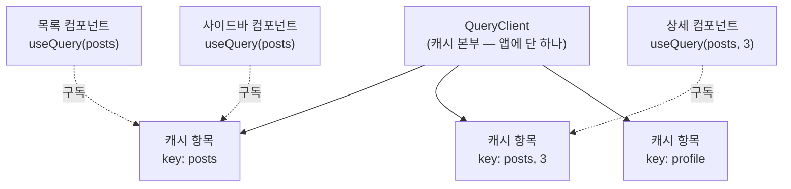
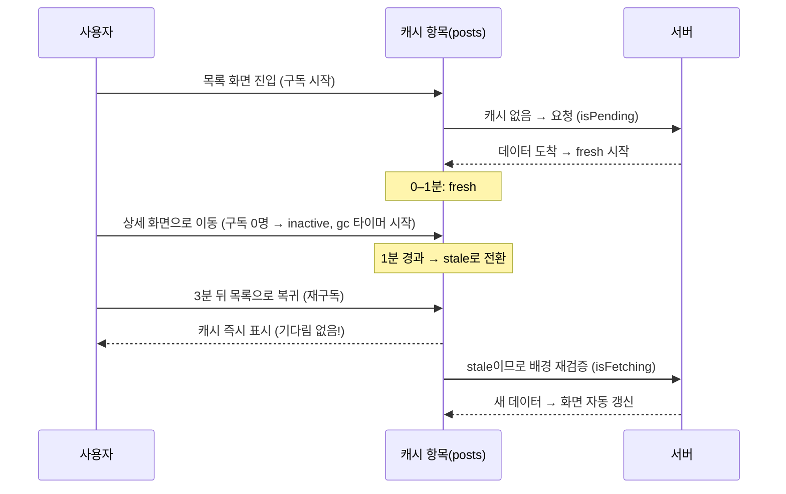

<Callout type="info">
  **이번 문서의 목표:** TanStack Query의 캐시가 어디에 살고(QueryClient), 컴포넌트가 캐시를 어떻게 구독하며(useQuery), 캐시 항목이 무엇으로 식별되고(query key), 언제 신선하고 언제 낡으며 언제 버려지는지(staleTime/gcTime)를 그림으로 그릴 수 있게 된다. 이 정신 모델이 서면 04·05편의 무효화·낙관적 업데이트는 응용일 뿐이다.
</Callout>

## 왜 "사용법"보다 "모델"부터 배우는가

TanStack Query는 따라 하기 쉬운 라이브러리입니다. 공식 예제를 복사하면 5분 만에 돌아갑니다. 그런데 실무에서는 이런 질문들이 곧바로 날아옵니다.

- "화면을 이동했다 돌아왔는데 왜 요청이 또 나가죠? 캐시 쓴다면서요."
- "반대로, 데이터가 바뀌었는데 왜 옛날 걸 보여주죠? 캐시 때문인가요?"
- "탭을 클릭만 했는데 네트워크 탭에 요청이 우수수 찍혀요. 버그인가요?"

전부 버그가 아니라 **설계된 기본 동작**입니다. 하지만 캐시의 생명주기 모델 없이 사용법만 외우면 이 동작들이 전부 미스터리가 되고, 미스터리를 끄는 옵션(`staleTime: Infinity` 남발 같은)을 아무 데나 붙이다 진짜 버그를 만듭니다. 그래서 이 편은 코드보다 모델에 지면을 씁니다.

참고로 이 과목은 집필 시점의 안정판인 **TanStack Query v5** 기준입니다. 구버전 v4와의 문법 차이는 이 편 끝에서 짧게 정리합니다. 라이브러리의 옛 이름이 React Query여서 지금도 두 이름이 혼용되는데, 같은 것을 가리킵니다(React 외에 Vue·Svelte 등도 지원하게 되면서 TanStack Query로 개명했습니다).

## 1. 전체 그림 — 캐시 본부와 구독 창구

TanStack Query의 구조는 두 축으로 이해하면 됩니다.



- **QueryClient**는 앱 전체에서 단 하나 존재하는 **캐시 본부**입니다. 모든 서버 데이터 사본이 여기 보관됩니다.
- **useQuery**는 컴포넌트가 캐시 본부의 특정 항목을 **구독**(subscribe, 변화를 지켜보다가 바뀌면 알려달라고 등록하는 것)하는 창구입니다.
- 캐시 항목의 **신원**은 query key가 결정합니다. 그림의 목록 컴포넌트와 사이드바 컴포넌트처럼 **같은 key를 구독하면 같은 캐시 항목을 공유**합니다 — 요청도 한 번만 나가고, 데이터가 갱신되면 두 컴포넌트가 동시에 리렌더링됩니다. 01편에서 본 "사본이 여러 개 생겨 어긋나는" 정합성 문제가 구조적으로 사라지는 지점이 바로 여기입니다.

> **쉽게 말하면:** QueryClient는 도서관, 캐시 항목은 서가의 책, query key는 청구기호, useQuery는 "이 청구기호 책이 갱신되면 알려주세요"라는 구독 신청입니다. 같은 청구기호를 신청한 사람 모두가 같은 책의 개정판 소식을 동시에 받습니다.

## 2. 설치와 배선 — QueryClient와 QueryClientProvider

설치는 패키지 하나(개발 편의를 위한 Devtools까지 두 개)입니다.

```bash
npm install @tanstack/react-query
npm install -D @tanstack/react-query-devtools
```

배선은 앱 최상단에서 한 번만 합니다.

```jsx
// main.jsx
import { QueryClient, QueryClientProvider } from "@tanstack/react-query";
import { ReactQueryDevtools } from "@tanstack/react-query-devtools";

// ① 캐시 본부를 하나 만든다 — 반드시 컴포넌트 바깥(모듈 스코프)에서
const queryClient = new QueryClient();

ReactDOM.createRoot(document.getElementById("root")).render(
  // ② Provider로 앱을 감싸 어디서든 본부에 접근 가능하게 한다
  <QueryClientProvider client={queryClient}>
    <App />
    <ReactQueryDevtools initialIsOpen={false} />
  </QueryClientProvider>
);
```

두 가지를 뜯어봅시다.

**① queryClient를 컴포넌트 바깥에서 만드는 이유** — 컴포넌트 안에서 `new QueryClient()`를 호출하면 그 컴포넌트가 리렌더링될 때마다 새 본부가 생기고, **캐시가 통째로 증발**합니다. 캐시는 앱의 생애 동안 하나로 유지되어야 하므로 모듈 스코프(파일 최상단)에 둡니다.

**② QueryClientProvider의 정체** — react_2에서 배운 Context Provider입니다. queryClient 인스턴스를 Context에 실어 트리 전체에 내려보내고, `useQuery`가 내부에서 이 Context를 읽어 본부에 접속합니다. Provider 바깥에서 `useQuery`를 호출하면 "No QueryClient set" 에러가 나는 이유가 이것입니다.

**Devtools**는 화면 구석에 떠서 현재 캐시에 어떤 key가 있고 각각 fresh인지 stale인지, 구독자가 몇 명인지 실시간으로 보여주는 개발 전용 도구입니다. 이 편에서 배우는 생명주기를 눈으로 확인하는 최고의 교보재이니 반드시 켜두고 실습하세요(프로덕션 빌드에서는 자동으로 제외됩니다).

## 3. useQuery — 요청 하나를 선언 한 줄로

01편에서 `useState` 3개 + `useEffect`로 짰던 목록 요청을 useQuery로 다시 쓰면 이렇게 됩니다.

```jsx
import { useQuery } from "@tanstack/react-query";

async function fetchPosts() {
  const res = await fetch("/api/posts");
  if (!res.ok) throw new Error("요청 실패: " + res.status); // 02편의 승격 패턴
  return res.json();
}

function PostList() {
  const { data, isPending, isError, error } = useQuery({
    queryKey: ["posts"],   // 이 데이터의 신원(청구기호)
    queryFn: fetchPosts,   // 데이터를 가져오는 방법
  });

  if (isPending) return <p>불러오는 중…</p>;
  if (isError) return <p>문제 발생: {error.message}</p>;
  if (data.length === 0) return <p>아직 글이 없어요.</p>;

  return (
    <ul>
      {data.map((post) => <li key={post.id}>{post.title}</li>)}
    </ul>
  );
}
```

`useEffect`도, 로딩·에러 `useState`도 없습니다. 몇 가지 핵심을 해부합니다.

### 필수 옵션은 단 둘 — queryKey와 queryFn

- **queryKey**: 이 데이터의 신원. 반드시 배열이며, 아래 4절에서 깊게 다룹니다.
- **queryFn**: 데이터를 가져와 **Promise를 반환하는 함수**. TanStack Query는 fetch·axios 같은 통신 수단을 전혀 강제하지 않습니다 — Promise만 돌려주면 뭐든 됩니다. 대신 두 가지 계약을 지켜야 합니다.
  1. 성공 시 데이터를 resolve한다.
  2. 실패 시 **반드시 throw**(또는 reject)**한다.** 02편에서 배운 대로 fetch는 4xx/5xx에 throw하지 않으므로, `res.ok` 검사 후 직접 던지는 승격 코드가 필수입니다. 이걸 빼먹으면 서버가 500을 줘도 isError가 영원히 false인 — "에러 화면이 안 뜨는" 버그가 됩니다.

### 반환값 — 판정이 끝난 상태들

useQuery가 돌려주는 객체에는 02편에서 손으로 만들던 판정 결과가 이미 들어 있습니다.

| 반환값 | 의미 |
|--------|------|
| `data` | 성공 시 queryFn이 resolve한 데이터 (성공 전엔 undefined) |
| `isPending` | 캐시에 **데이터가 아직 없고** 가져오는 중 — 첫 로딩 |
| `isError` / `error` | queryFn이 throw함 — 에러 상태와 그 원인 |
| `isSuccess` | 데이터 확보 완료 |
| `isFetching` | 지금 이 순간 요청이 나가 있는가 — **첫 로딩이든 배경 갱신이든** |
| `status` | pending / error / success 세 값 중 하나 (위 불리언들의 원본) |

<Callout type="warning">
  **자주 틀리는 점:** `isPending`과 `isFetching`은 다릅니다. isPending은 "보여줄 데이터가 아예 없는 첫 로딩"에만 true입니다. 이미 캐시가 있는 상태에서 뒤로 재검증 요청이 나갈 때는 isPending은 false, isFetching만 true입니다 — 이 덕분에 배경 갱신 중에도 화면은 캐시를 계속 보여줍니다. 배경 갱신마다 스피너를 띄우고 싶지 않다면 로딩 분기는 isPending으로 해야 합니다.
</Callout>

빈 상태 판정(`data.length === 0`)이 여전히 개발자 몫이라는 점도 확인하세요. 02편에서 말한 대로 200 + 빈 배열은 에러가 아니므로, 도구는 이를 성공으로 취급하고 빈 상태의 UX는 우리가 설계합니다.

## 4. query key — 캐시의 신원이자 의존성

### key는 왜 배열인가

query key는 캐시 항목을 식별하는 **유일한 열쇠**입니다. 배열인 이유는 계층과 매개변수를 자연스럽게 표현하기 위해서입니다.

```js
["posts"]                          // 글 목록 전체
["posts", 3]                       // 3번 글 상세
["posts", { page: 2 }]             // 글 목록의 2페이지
["posts", 3, "comments"]           // 3번 글의 댓글
["profile", userId]                // 특정 사용자의 프로필
```

키 비교는 **내용 기준**입니다. 배열이 매번 새로 만들어져도 내용이 같으면 같은 키로 취급합니다(내부적으로 결정적 직렬화를 거치므로, 객체 안 프로퍼티 순서가 달라도 — `{ page: 2, size: 10 }`과 `{ size: 10, page: 2 }` — 같은 키입니다). 그래서 서로 다른 컴포넌트가 각자 `["posts"]`를 써도 정확히 같은 캐시 항목을 공유합니다.

> **쉽게 말하면:** query key는 집 주소입니다. 목록 전체는 "서울시", 3번 글은 "서울시 3번지"처럼 넓은 범위에서 좁은 범위 순으로 씁니다. 이렇게 계층적으로 지어두면 나중에 "서울시로 시작하는 모든 주소"를 한꺼번에 지목할 수 있는데 — 이것이 04편에서 배울 무효화의 핵심 기술입니다.

### key는 의존성 배열이기도 하다

queryFn이 사용하는 **모든 변수는 key에 들어가야** 합니다. 이것이 key 설계의 제1원칙입니다.

```jsx
function PostDetail({ postId }) {
  const { data } = useQuery({
    queryKey: ["posts", postId],           // postId가 key에 포함됨
    queryFn: () => fetchPost(postId),      // queryFn이 postId를 사용
  });
  // ...
}
```

postId가 3에서 5로 바뀌면 key가 `["posts", 3]`에서 `["posts", 5]`로 바뀌고, TanStack Query는 **다른 데이터를 원하는구나**라고 인식해 새 캐시 항목을 만들거나 기존 항목을 찾아 보여줍니다. `useEffect`의 의존성 배열과 정확히 같은 정신입니다 — 그래서 key를 "쿼리의 의존성 배열"이라고도 부릅니다.

이 원칙을 어기면 어떻게 될까요? postId를 key에서 빼면 — `["posts"]` 하나의 캐시 항목에 3번 글이 저장되고, postId가 5로 바뀌어도 key가 그대로라 **3번 글이 계속 보입니다.** "props는 바뀌었는데 화면이 안 바뀌는" 버그의 대표 원인입니다.

### 캐시 항목의 실제 모습

Devtools를 열면 캐시 본부의 내부가 보입니다. 캐시 항목 하나(공식 용어로 Query 인스턴스)는 대략 이런 정보를 품고 있습니다.

- 데이터 본체와 **마지막으로 성공한 시각**(dataUpdatedAt)
- 신선도 상태: fresh / stale
- 활동 상태: 현재 구독자 수, 구독자가 없으면 inactive
- 진행 상태: fetching 여부, 에러, 재시도 횟수

이 중 신선도와 활동 상태가 다음 절의 주인공입니다.

## 5. 캐시 생명주기 — staleTime과 gcTime

01편에서 캐시의 핵심 전략이 stale-while-revalidate — "일단 캐시를 보여주고 뒤에서 재검증" — 라고 했습니다. TanStack Query는 이 전략을 두 개의 타이머로 구현합니다.

### staleTime — 신선 유통기한

**staleTime**은 "데이터를 받아온 뒤 얼마 동안 신선(fresh)하다고 믿을 것인가"입니다. 기본값은 **0** — 받아오는 순간부터 이미 stale로 취급합니다.

- **fresh인 동안**: 같은 key의 useQuery가 아무리 많이 마운트되어도 **요청이 나가지 않습니다.** 캐시를 그대로 씁니다.
- **stale이 된 뒤**: 캐시를 일단 보여주되, 특정 계기가 오면 **뒤에서 재검증 요청**을 보냅니다.

재검증을 일으키는 기본 계기는 네 가지입니다.

1. 같은 key의 새 구독자가 마운트될 때 (refetchOnMount)
2. 브라우저 창이 다시 포커스를 받을 때 (refetchOnWindowFocus)
3. 네트워크가 끊겼다 다시 연결될 때 (refetchOnReconnect)
4. 명시적 무효화·refetch 호출 (04편)

서두의 미스터리 — "탭만 클릭했는데 요청이 우수수" — 의 정체가 바로 2번입니다. 기본 staleTime이 0이므로 모든 데이터가 항상 stale이고, 창 포커스마다 성실하게 재검증하는 겁니다. 버그가 아니라 "사용자가 돌아왔으니 최신 데이터를 보여주자"는 설계 철학입니다. 다만 실무에서는 데이터 성격에 따라 조정합니다.

```jsx
useQuery({
  queryKey: ["notice"],
  queryFn: fetchNotice,
  staleTime: 1000 * 60 * 5, // 5분간 fresh — 공지는 분 단위로 안 바뀌니까
});
```

| 데이터 성격 | staleTime 감각 |
|-------------|----------------|
| 채팅·알림·재고처럼 초 단위로 변함 | 0 (기본값) — 늘 재검증 |
| 게시글 목록처럼 분 단위로 변함 | 30초 – 5분 |
| 카테고리 목록·설정처럼 거의 안 변함 | 수십 분 또는 Infinity |

### gcTime — 창고 보관 기한

**gcTime**은 전혀 다른 질문에 답합니다 — "**아무도 구독하지 않는** 캐시를 얼마나 보관했다가 버릴 것인가." gc는 Garbage Collection(가비지 컬렉션, 쓰레기 수거 — 안 쓰는 메모리를 자동 회수하는 것)의 약자입니다. 기본값은 **5분**입니다.

컴포넌트가 언마운트되어 어떤 캐시 항목의 구독자가 0명이 되면, 그 항목은 inactive 상태가 되고 gcTime 타이머가 돌기 시작합니다. 타이머가 끝나기 전에 누군가 다시 구독하면(그 화면으로 돌아오면) 캐시가 살아 있으므로 **화면이 즉시 뜨고**, 타이머가 끝나면 캐시가 메모리에서 삭제되어 다음 방문은 첫 로딩부터 다시 시작합니다.

> **쉽게 말하면:** staleTime은 우유의 **유통기한**이고 gcTime은 **냉장고 보관 기한**입니다. 유통기한이 지난 우유(stale)도 일단 냉장고에 있으면 꺼내 보여주면서 새 우유를 사러 갑니다. 하지만 아무도 안 마시는 우유를 냉장고에 영원히 둘 수는 없으니, 오래 방치되면(gcTime 경과) 버립니다.

### 두 타이머를 한 장면으로

화면 이동 시나리오로 전체 생명주기를 따라가 봅시다. staleTime 1분, gcTime 5분이라고 합시다.



돌아온 순간 **화면은 즉시 뜨고**(캐시), **데이터는 곧 최신이 됩니다**(배경 재검증). 이것이 stale-while-revalidate의 실제 구현입니다. 만약 사용자가 6분 뒤에 돌아왔다면 gcTime 5분이 지나 캐시가 삭제됐으므로 isPending부터 다시 시작합니다.

<Callout type="warning">
  **자주 틀리는 점:** "캐시가 있는데 왜 요청이 또 나가요?"와 "요청이 나갔는데 왜 스피너가 안 떠요?"는 같은 현상의 양면입니다. stale 캐시가 있으면 화면은 캐시로 채우고(isPending false) 요청은 배경으로 나갑니다(isFetching true). 이것은 결함이 아니라 목적입니다. 재검증 요청 자체를 줄이고 싶은 것이라면 스피너 로직이 아니라 staleTime을 조정해야 합니다.
</Callout>

### 흔한 오해 — staleTime과 gcTime의 관계

둘은 독립적인 타이머입니다. "stale이 되면 캐시가 지워진다"는 오해가 정말 많은데, **stale은 삭제가 아니라 재검증 대상 표시**일 뿐입니다. stale 데이터도 gcTime이 남아 있는 한 캐시에 살아서 즉시 표시에 쓰입니다. 삭제를 결정하는 것은 오직 gcTime이며, 그마저도 구독자가 0명일 때만 타이머가 돕니다.

## 6. 실패에 대한 기본기 — retry

queryFn이 throw하면 곧바로 isError가 되는 게 아닙니다. TanStack Query는 기본으로 **3회 재시도**(retry)하고, 재시도 간격은 점점 벌어집니다(exponential backoff, 지수 백오프 — 1초, 2초, 4초처럼 간격을 배로 늘려 서버에 몰리는 부담을 줄이는 전략). 4번 모두 실패해야 isError가 true가 됩니다.

02편의 기준을 여기 적용할 수 있습니다 — 4xx는 재시도해도 같은 결과이므로 재시도에서 제외하는 것이 실무 정석입니다.

```jsx
useQuery({
  queryKey: ["posts"],
  queryFn: fetchPosts,
  retry: (failureCount, error) => {
    if (error.status >= 400 && error.status < 500) return false; // 4xx는 즉시 포기
    return failureCount < 3;                                     // 그 외 3회까지
  },
});
```

(이 코드가 동작하려면 queryFn에서 throw하는 에러 객체에 status를 실어 보내야 합니다 — `const err = new Error("실패"); err.status = res.status; throw err;` 패턴.) 재시도 정책을 앱 전역 기본값으로 두고 싶다면 `new QueryClient({ defaultOptions: { queries: { retry: ... } } })`로 본부 설정에 넣습니다.

## 7. v4를 만났을 때 — 딱 두 가지만 기억

현장 코드나 오래된 블로그에서 v4 문법을 만날 수 있습니다. 차이의 핵심은 두 가지입니다.

- **인자 형태**: v4는 `useQuery(["posts"], fetchPosts, options)`처럼 여러 인자를 받는 형태도 허용했지만, v5는 **단일 객체 인자만** 받습니다 — `useQuery({ queryKey, queryFn, ...options })`.
- **이름 변경**: v4의 `cacheTime`이 v5에서 **gcTime**으로, 첫 로딩을 뜻하던 `isLoading`이 **isPending**으로 바뀌었습니다(v5의 isLoading은 isPending과 isFetching이 동시에 true인 상태의 별칭으로 남아 있습니다). 옛 자료의 cacheTime을 보면 gcTime으로 읽으면 됩니다.

## 핵심 정리

- 구조는 세 기둥: QueryClient는 앱에 하나뿐인 캐시 본부, QueryClientProvider는 그것을 트리에 내려보내는 배선, useQuery는 캐시 항목을 구독하는 창구다.
- query key는 캐시의 신원이자 쿼리의 의존성 배열 — queryFn이 쓰는 모든 변수는 key에 포함하고, 넓은 범위에서 좁은 범위 순의 배열로 계층을 표현한다.
- queryFn은 Promise를 반환하고 실패 시 반드시 throw해야 한다 — fetch는 4xx/5xx에 throw하지 않으므로 res.ok 검사로 승격한다.
- staleTime은 신선 유통기한(지나면 재검증 대상), gcTime은 무구독 캐시의 보관 기한(지나면 삭제) — stale은 삭제가 아니다.
- stale 캐시는 즉시 보여주고 배경에서 재검증한다(isPending은 첫 로딩만, isFetching은 모든 요청). 재검증 빈도는 스피너가 아니라 staleTime으로 조절한다.

## 마무리 복습

<Quiz
  questionNumber={1}
  question="QueryClient 인스턴스를 컴포넌트 함수 안에서 new로 생성하면 안 되는 이유는?"
  options={['컴포넌트 안에서는 클래스 생성이 문법적으로 금지되어서', '리렌더링마다 새 인스턴스가 만들어져 캐시가 통째로 사라지기 때문', 'Provider가 컴포넌트 안의 인스턴스를 인식하지 못해서', '메모리 누수로 브라우저가 멈추기 때문']}
  correctAnswer={2}
  explanation="캐시 본부는 앱 생애 동안 하나로 유지되어야 한다. 컴포넌트 안에서 만들면 리렌더링 시 새 본부가 생기며 기존 캐시가 전부 증발하므로, 모듈 스코프에서 한 번만 생성한다."
  optionExplanations={['문법적으로는 가능하다 — 문제는 생명주기다', '정답 — 리렌더링마다 캐시가 초기화되는 치명적 문제가 생긴다', 'Provider는 어떤 인스턴스든 전달할 수 있다 — 문제는 인스턴스가 계속 바뀌는 것이다', '주된 문제는 누수가 아니라 캐시 증발이다']}
/>

<Quiz
  questionNumber={2}
  question="queryFn이 지켜야 할 계약으로 옳은 것은?"
  options={['반드시 fetch API만 사용해야 한다', '성공 시 데이터를 resolve하고 실패 시 반드시 throw해야 한다', '항상 배열만 반환해야 한다', 'async 함수로는 작성할 수 없다']}
  correctAnswer={2}
  explanation="TanStack Query는 통신 수단을 강제하지 않으며 Promise 계약만 요구한다. 특히 fetch는 4xx/5xx에도 resolve되므로 res.ok 검사 후 직접 throw해야 isError가 제대로 동작한다."
  optionExplanations={['axios든 뭐든 Promise만 반환하면 된다', '정답 — throw를 빼먹으면 서버 에러에도 에러 화면이 뜨지 않는 버그가 된다', '객체든 배열이든 어떤 데이터든 가능하다', 'async 함수는 Promise를 반환하므로 오히려 가장 자연스러운 형태다']}
/>

<Quiz
  questionNumber={3}
  question="상세 화면에서 queryKey를 [posts]로 두고 queryFn에서만 postId를 사용했다. 어떤 버그가 생기는가?"
  options={['빌드 에러가 발생한다', 'postId가 바뀌어도 key가 같아 이전 글이 계속 표시된다', '요청이 무한 반복된다', '캐시가 즉시 삭제된다']}
  correctAnswer={2}
  explanation="key는 캐시의 신원이자 의존성 배열이다. queryFn이 쓰는 변수가 key에 없으면 변수가 바뀌어도 같은 캐시 항목으로 취급되어 이전 데이터가 계속 보인다. postId를 key에 포함해야 한다."
  optionExplanations={['빌드는 정상 통과하는 논리 버그라 더 위험하다', '정답 — props는 바뀌었는데 화면이 안 바뀌는 대표적 원인이다', '무한 요청은 다른 종류의 실수(렌더 중 상태 변경 등)에서 나온다', 'key 설계와 캐시 삭제 시점은 무관하다']}
/>

<Quiz
  questionNumber={4}
  question="staleTime이 지난 캐시 데이터의 운명으로 옳은 것은?"
  options={['즉시 메모리에서 삭제된다', '화면 표시에는 계속 쓰이되 재검증 계기가 오면 배경에서 다시 가져온다', '구독자에게 undefined가 전달된다', '자동으로 서버에 삭제 요청을 보낸다']}
  correctAnswer={2}
  explanation="stale은 삭제가 아니라 재검증 대상 표시다. stale 캐시도 즉시 표시에 쓰이며, 마운트·창 포커스·재연결 등의 계기에 배경 재검증이 일어난다. 삭제는 gcTime이 결정한다."
  optionExplanations={['삭제를 결정하는 것은 staleTime이 아니라 gcTime이다', '정답 — 이것이 stale-while-revalidate 전략의 구현이다', '캐시가 살아 있는 한 데이터는 계속 전달된다', '클라이언트 캐시 상태는 서버에 아무 요청도 보내지 않는다']}
/>

<Quiz
  questionNumber={5}
  question="isPending과 isFetching의 차이를 바르게 설명한 것은?"
  options={['완전히 같은 값의 별칭이다', 'isPending은 보여줄 캐시가 없는 첫 로딩, isFetching은 배경 재검증을 포함한 모든 진행 중 요청이다', 'isFetching은 에러 발생 시에만 true가 된다', 'isPending은 뮤테이션 전용 상태다']}
  correctAnswer={2}
  explanation="캐시가 있는 상태의 배경 재검증에서는 isPending이 false, isFetching만 true다. 그래서 로딩 스피너 분기는 isPending으로 해야 배경 갱신 때 화면이 스피너로 덮이지 않는다."
  optionExplanations={['다른 상황에서 다른 값을 가진다', '정답 — 배경 갱신 중에도 캐시를 계속 보여주는 것이 이 구분의 목적이다', '에러와는 무관한 진행 상태다', 'useQuery의 반환값이며 첫 로딩을 뜻한다']}
/>

<Quiz
  questionNumber={6}
  question="구독자가 0명이 된 캐시 항목에 일어나는 일은?"
  options={['즉시 삭제된다', 'inactive 상태가 되고 gcTime 타이머가 끝나면 삭제된다', 'fresh 상태로 되돌아간다', '서버로 반환된다']}
  correctAnswer={2}
  explanation="구독자가 0명이면 inactive가 되어 gcTime(기본 5분) 타이머가 시작된다. 그 안에 재구독하면 캐시로 화면이 즉시 뜨고, 타이머가 끝나면 삭제되어 다음 방문은 첫 로딩부터다."
  optionExplanations={['gcTime만큼 유예를 두는 것이 캐시의 가치다', '정답 — 냉장고 보관 기한의 비유가 이 동작이다', '신선도는 구독자 수와 무관하게 staleTime이 결정한다', '캐시는 클라이언트 메모리의 일이며 서버와 무관하다']}
/>

<Quiz
  questionNumber={7}
  question="브라우저 탭을 다른 곳에 갔다가 돌아올 때마다 네트워크 요청이 나간다. 원인과 올바른 대처는?"
  options={['버그이므로 라이브러리를 교체해야 한다', '기본 staleTime 0으로 모든 데이터가 stale이라 포커스 재검증이 도는 것 — 데이터 성격에 맞게 staleTime을 늘린다', '캐시가 삭제된 것이므로 gcTime을 늘린다', 'useEffect 의존성 배열을 비워야 한다']}
  correctAnswer={2}
  explanation="창 포커스 재검증은 사용자가 돌아왔을 때 최신 데이터를 보장하는 설계된 동작이다. 기본 staleTime이 0이라 항상 재검증되는 것이며, 자주 안 바뀌는 데이터라면 staleTime을 늘려 fresh 기간을 확보하면 요청이 사라진다."
  optionExplanations={['설계된 기본 동작이지 버그가 아니다', '정답 — 재검증 빈도는 staleTime으로 조절하는 것이 정석이다', 'gcTime은 무구독 캐시의 보관 기한이라 이 현상과 무관하다', 'useQuery 사용 시 useEffect는 관여하지 않는다']}
/>

<Quiz
  questionNumber={8}
  question="v4 코드를 v5로 옮길 때 바뀌는 것으로 옳은 것은?"
  options={['queryKey가 배열에서 문자열로 바뀐다', 'useQuery가 단일 객체 인자만 받게 되고 cacheTime이 gcTime으로 이름이 바뀐다', 'QueryClientProvider가 더 이상 필요 없다', 'queryFn이 동기 함수만 허용된다']}
  correctAnswer={2}
  explanation="v5의 대표 변경은 모든 훅이 단일 객체 인자로 통일된 것과 cacheTime → gcTime, isLoading → isPending의 이름 변경이다. 옛 자료의 cacheTime은 gcTime으로 읽으면 된다."
  optionExplanations={['key는 v4·v5 모두 배열이다', '정답 — 단일 객체 인자 통일과 이름 변경이 핵심 차이다', 'Provider 배선은 v5에서도 동일하게 필요하다', 'queryFn은 여전히 Promise를 반환하는 비동기 함수다']}
/>

## 참고 자료

- [TanStack Query v5 - Quick Start](https://tanstack.com/query/v5/docs/framework/react/quick-start)
- [TanStack Query v5 - useQuery API Reference](https://tanstack.com/query/v5/docs/framework/react/reference/useQuery)
- [TanStack Query - Overview](https://tanstack.com/query/latest/docs/framework/react/overview)
- [Announcing TanStack Query v5 (v4와의 변경점)](https://tanstack.com/blog/announcing-tanstack-query-v5)
