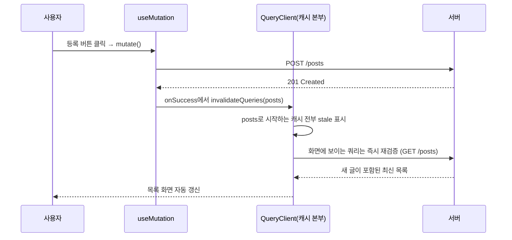

<Callout type="info">
  **이번 문서의 목표:** 글을 생성·수정·삭제하는 쓰기 작업을 useMutation으로 다루고, 쓰기 성공 후 invalidateQueries로 관련 캐시를 정확히 골라 되살리는 "쓰기 → 무효화 → 재검증" 사이클을 설계할 수 있게 된다. 여기에 의존 쿼리와 로딩·에러 UI 패턴까지 더하면 읽기·쓰기가 있는 화면 하나를 완결성 있게 만들 수 있다.
</Callout>

## 왜 "쓰기"는 별도의 훅인가

03편의 useQuery는 **읽기** 전용 도구였습니다. 그런데 실무 앱은 읽기만 하지 않습니다 — 글을 쓰고, 수정하고, 삭제합니다. 이런 쓰기 작업을 **뮤테이션**(mutation, 변이 — 서버의 원본 데이터를 바꾸는 작업)이라고 부릅니다.

"쓰기도 그냥 useQuery로 하면 안 되나?"라는 질문이 자연스럽게 나오는데, 안 됩니다. 읽기와 쓰기는 성격이 정반대이기 때문입니다.

| 구분 | 읽기 — useQuery | 쓰기 — useMutation |
|------|-----------------|---------------------|
| 실행 시점 | 마운트되면 **자동** 실행 | 사용자가 버튼을 눌러야 — **수동** 실행 |
| 여러 번 실행 | 몇 번을 다시 해도 무해 — 재시도·재검증 자유 | 다시 하면 **글이 두 개** 생길 수 있음 |
| 캐시 | 결과를 캐시에 보관·공유 | 결과를 캐시하지 않음 |
| 신원 | queryKey 필수 | key 없음 |

핵심은 두 번째 줄입니다. 같은 요청을 반복해도 결과가 같은 성질을 **멱등성**(idempotency, 아이덤포턴시)이라고 하는데, GET은 멱등하지만 POST는 아닙니다. 그래서 useQuery의 자랑거리였던 자동 실행·자동 재시도·창 포커스 재검증은 쓰기에서는 전부 **재앙**이 됩니다 — 창을 클릭할 때마다 글이 하나씩 등록되는 앱을 상상해 보세요. useMutation은 이 모든 자동 동작을 끄고, 오직 명시적 호출에만 실행되는 별도의 도구입니다.

> **쉽게 말하면:** useQuery는 도서관에서 책을 열람하는 것 — 백 번 봐도 책은 그대로입니다. useMutation은 도서관 장서에 책을 기증하거나 폐기하는 것 — 실수로 두 번 하면 장서가 실제로 달라집니다. 그래서 열람은 자동문이지만, 기증·폐기는 반드시 사서에게 직접 신청해야 합니다.

## 1. useMutation — 쓰기 작업의 기본형

글 생성을 예로 전체 모양을 봅니다.

```jsx
import { useMutation } from "@tanstack/react-query";

async function createPost(newPost) {
  const res = await fetch("/api/posts", {
    method: "POST",
    headers: { "Content-Type": "application/json" },
    body: JSON.stringify(newPost),
  });
  if (!res.ok) throw new Error("생성 실패: " + res.status); // 02편의 승격 패턴
  return res.json(); // 201 응답의 본문 — id가 채워진 새 글
}

function NewPostForm() {
  const createMutation = useMutation({
    mutationFn: createPost,
  });

  const handleSubmit = (event) => {
    event.preventDefault();
    const title = event.target.elements.title.value;
    createMutation.mutate({ title }); // ← 이 호출 전까지 아무 일도 안 일어남
  };

  return (
    <form onSubmit={handleSubmit}>
      <input name="title" placeholder="제목" />
      <button type="submit" disabled={createMutation.isPending}>
        {createMutation.isPending ? "등록 중…" : "등록"}
      </button>
      {createMutation.isError && <p>실패: {createMutation.error.message}</p>}
    </form>
  );
}
```

해부해 봅시다.

- **mutationFn**: queryFn과 같은 계약 — Promise를 반환하고 실패 시 throw. 다른 점은 **인자를 받는다**는 것입니다. 무엇을 쓸지는 실행 시점에 정해지기 때문입니다.
- **mutate**(변수): 뮤테이션을 실제로 발사하는 방아쇠. 여기 넘긴 인자가 mutationFn의 인자로 전달됩니다.
- **isPending / isError / isSuccess / data / error**: useQuery와 같은 이름의 상태들이 뮤테이션의 진행 상황을 알려줍니다. 위 코드의 `disabled={createMutation.isPending}`는 중요한 실무 패턴입니다 — 등록 중에 버튼을 다시 누르면 **중복 제출**(같은 글 두 개)이 되므로, 진행 중엔 버튼을 잠급니다.

`mutateAsync`라는 형제도 있습니다. mutate는 결과를 반환하지 않고 콜백(아래 절)으로 후속 처리를 하는 반면, mutateAsync는 Promise를 반환해 `await`로 받을 수 있습니다. 흐름 제어가 필요한 특수한 경우(순차 실행 등)가 아니면 mutate + 콜백이 정석입니다 — mutateAsync는 에러를 직접 try/catch로 잡아야 해서 빼먹기 쉽습니다.

## 2. 성공·실패 핸들러 — 쓰기가 끝난 뒤의 일

쓰기가 끝나면 후속 작업이 따라옵니다 — 성공하면 입력창을 비우고 목록으로 이동, 실패하면 알림. useMutation은 이를 위한 콜백 자리를 제공합니다.

```jsx
const createMutation = useMutation({
  mutationFn: createPost,
  onSuccess: (data, variables) => {
    // data: mutationFn이 resolve한 값(생성된 글), variables: mutate에 넘긴 인자
    console.log(data.id + "번 글 생성됨");
  },
  onError: (error, variables) => {
    console.log("실패 원인: " + error.message);
  },
  onSettled: (data, error, variables) => {
    // 성공이든 실패든 마지막에 항상 실행 — try/catch/finally의 finally 격
  },
});
```

콜백은 **훅 옵션 자리**뿐 아니라 **mutate 호출 자리**에도 둘 수 있습니다.

```jsx
createMutation.mutate(
  { title },
  { onSuccess: () => navigate("/posts") } // 이 호출에만 적용되는 콜백
);
```

역할 분담의 실무 관례는 이렇습니다 — **로직**(캐시 무효화 등 어디서 호출하든 항상 필요한 일)은 훅 옵션에, **UI 반응**(페이지 이동, 특정 화면에서만 띄우는 토스트)은 호출 자리에 둡니다. 둘 다 지정하면 훅 옵션 콜백이 먼저, 호출 자리 콜백이 나중에 실행됩니다. 단 주의할 점 — 호출 자리 콜백은 뮤테이션이 끝나기 전에 컴포넌트가 언마운트되면 실행되지 않습니다. 반드시 실행되어야 하는 일은 훅 옵션 쪽에 두세요.

## 3. 무효화 — 쓰기 성공 후 낡아진 캐시 되살리기

여기서부터가 이 편의 심장입니다. 글 생성이 성공했다고 합시다. 그런데 목록 화면으로 돌아가 보면 — **새 글이 없습니다.** 목록 캐시 `["posts"]`는 여전히 글을 쓰기 전의 스냅샷이기 때문입니다. 서버 원본은 바뀌었는데 내 캐시는 그 사실을 모릅니다. 01편에서 본 "사본이 낡는" 문제를, 이번엔 **내가 직접 낡게 만든** 셈입니다.

다행히 이번엔 결정적 단서가 있습니다 — **누가 언제 낡게 했는지 내가 압니다**(방금 내 뮤테이션이!). 이 단서를 캐시 본부에 알려주는 것이 **무효화**(invalidation, 인밸리데이션)입니다.

```jsx
import { useMutation, useQueryClient } from "@tanstack/react-query";

function NewPostForm() {
  const queryClient = useQueryClient(); // Provider에 배선된 캐시 본부를 가져온다

  const createMutation = useMutation({
    mutationFn: createPost,
    onSuccess: () => {
      // "posts로 시작하는 캐시는 전부 낡았다"고 본부에 신고
      queryClient.invalidateQueries({ queryKey: ["posts"] });
    },
  });
  // ...
}
```

`invalidateQueries`가 하는 일은 정확히 두 가지입니다.

1. queryKey가 일치하는 캐시 항목을 전부 **즉시 stale로 표시**한다 (staleTime이 얼마나 남았든 무시).
2. 그중 **지금 화면에서 구독 중인**(active) 항목은 **즉시 재검증 요청**을 보낸다. 구독자 없는 항목은 표시만 해두고, 나중에 누가 구독하는 순간 재검증한다.

> **쉽게 말하면:** 무효화는 도서관 사서에게 "이 청구기호 책들, 개정판 나왔대요"라고 신고하는 것입니다. 사서는 지금 열람 중인 책은 즉시 개정판으로 바꿔다 주고, 서가에 꽂힌 책에는 "낡음" 딱지만 붙여뒀다가 다음 열람자가 오면 바꿔다 줍니다.

이 "쓰기 → 무효화 → 재검증" 사이클이 TanStack Query 실무의 기본 리듬입니다.



### 계층 키가 빛나는 순간 — 무효화의 범위 지정

03편에서 key를 "넓은 범위 → 좁은 범위" 배열로 지으라고 한 이유가 여기서 드러납니다. invalidateQueries의 key 매칭은 **앞부분 일치**(prefix match)입니다.

```js
// 현재 캐시에 있는 key들
["posts"]                 // 목록
["posts", { page: 2 }]    // 2페이지
["posts", 3]              // 3번 글 상세
["profile"]               // 프로필

queryClient.invalidateQueries({ queryKey: ["posts"] });
// → 위 세 개 전부 무효화. profile은 무사.

queryClient.invalidateQueries({ queryKey: ["posts", 3] });
// → 3번 글 상세만 무효화.
```

3번 글을 **수정**했다면 어디까지 무효화해야 할까요? 3번 글 상세는 당연하고, 목록에도 그 글의 제목이 보이므로 목록도 낡았습니다. 답은 `["posts"]` 하나로 전부 쓸어 담는 것 — 계층 키를 잘 지었다면 무효화 코드가 한 줄이 됩니다. 반대로 key를 `["postList"]`, `["postDetail3"]`처럼 평평하게 지었다면 무효화를 하나하나 나열해야 하고, 새 화면이 추가될 때마다 빼먹는 사고가 납니다. **key 설계가 곧 무효화 설계입니다.**

정확히 일치하는 것만 무효화하고 싶다면 `exact: true` 옵션을 씁니다 — `invalidateQueries({ queryKey: ["posts"], exact: true })`는 `["posts"]`만 건드리고 `["posts", 3]`은 남깁니다.

### invalidate vs refetch — 신고와 강제 집행

비슷해 보이는 `refetchQueries`와의 차이를 알아둡시다. invalidate는 "낡았다고 표시 + 화면에 있는 것만 즉시 재검증"이라는 **영리한 신고**입니다. refetch는 표시 없이 **무조건 다시 가져오는 강제 집행**으로, 구독자 없는 쿼리까지 전부 요청을 보냅니다. 실무 기본기는 invalidate입니다 — 보이지도 않는 화면의 데이터를 미리 가져오는 낭비를 피하고, 필요한 시점에 알아서 재검증되게 두는 쪽이 거의 항상 옳습니다. useQuery가 반환하는 `refetch` 함수도 있는데, 이는 "새로고침 버튼"처럼 그 쿼리 하나를 사용자가 명시적으로 다시 부르는 자리에 씁니다.

<Callout type="warning">
  **자주 틀리는 점:** 뮤테이션의 응답(생성된 글)을 받아서 화면의 상태에 직접 setState로 넣는 패턴 — 예를 들어 onSuccess에서 목록 배열에 push — 은 01편의 수동 동기화 지옥으로 돌아가는 길입니다. 원칙은 "쓰기는 서버에, 읽기는 캐시 재검증으로"입니다. 응답 데이터로 캐시를 직접 다듬는 고급 기법(setQueryData)도 있지만, 그것은 캐시 본부를 통해서 하는 것이며 05편에서 다룹니다.
</Callout>

## 4. 의존 쿼리와 조건부 쿼리 — enabled

실무에서는 "A를 받아온 다음에야 B를 요청할 수 있는" 순서 의존이 흔합니다. 예 — 사용자 이름으로 사용자를 찾고, 그 id로 프로젝트 목록을 가져오는 경우. useQuery는 마운트되면 자동 실행되는데, 아직 id가 없는 시점엔 어떻게 할까요?

**enabled** 옵션이 답입니다. false인 동안 쿼리는 대기(자동 실행·재검증 전부 정지)합니다.

```jsx
function UserProjects({ email }) {
  // 1단계: 이메일로 사용자 조회
  const userQuery = useQuery({
    queryKey: ["user", email],
    queryFn: () => fetchUserByEmail(email),
  });

  const userId = userQuery.data?.id;

  // 2단계: 사용자 id가 생긴 뒤에야 실행
  const projectsQuery = useQuery({
    queryKey: ["projects", userId],
    queryFn: () => fetchProjectsByUser(userId),
    enabled: !!userId, // userId가 undefined인 동안 대기
  });
  // ...
}
```

`!!userId`는 값을 불리언으로 강제 변환하는 관용구입니다(undefined → false, 3 → true). userQuery가 성공해 userId가 생기는 순간 enabled가 true가 되고 2단계가 자동 발사됩니다 — 이런 체인을 **의존 쿼리**(dependent query)라고 부릅니다.

같은 원리로 **조건부 쿼리**도 만듭니다. 검색어가 비어 있으면 요청하지 않기 —

```jsx
const searchQuery = useQuery({
  queryKey: ["search", keyword],
  queryFn: () => searchPosts(keyword),
  enabled: keyword.length > 0,
});
```

주의할 점 하나 — enabled가 false인 쿼리는 isPending이 true입니다(데이터가 없으니까). "대기 중"과 "로딩 중"을 화면에서 구분하려면 `isLoading`(= isPending이면서 isFetching인 상태 — 실제로 요청이 나가 있는 첫 로딩)을 쓰면 됩니다.

<Callout type="warning">
  **자주 틀리는 점:** 의존 쿼리가 두 단계를 넘어 줄줄이 이어지면 요청이 순차 실행되어 화면이 단계 수만큼 느려집니다 — 이를 요청 폭포(request waterfall)라고 합니다. 정말 순서 의존인지, 아니면 서버 API를 한 번에 주도록 바꾸거나 병렬로 요청할 수 있는지 먼저 의심하세요. enabled는 진짜 의존 관계에만 씁니다.
</Callout>

## 5. 로딩·에러 UI 패턴 — 상태를 화면 언어로 번역하기

02편의 4분기(로딩/에러/빈/정상)를 TanStack Query의 상태와 연결해 실무 패턴으로 정리합니다.

### 읽기 화면의 표준 골격

```jsx
function PostList() {
  const { data, isPending, isError, error, refetch, isFetching } = useQuery({
    queryKey: ["posts"],
    queryFn: fetchPosts,
  });

  if (isPending) return <PostListSkeleton />;          // ① 첫 로딩: 스켈레톤

  if (isError) return (                                 // ② 에러: 사유 + 재시도
    <div role="alert">
      <p>목록을 불러오지 못했어요: {error.message}</p>
      <button onClick={() => refetch()}>다시 시도</button>
    </div>
  );

  if (data.length === 0) return (                       // ③ 빈 상태: 행동 유도
    <p>아직 글이 없어요. 첫 글을 써보세요!</p>
  );

  return (                                              // ④ 정상 + 배경 갱신 표시
    <div>
      {isFetching && <span>최신 데이터 확인 중…</span>}
      <ul>
        {data.map((post) => <li key={post.id}>{post.title}</li>)}
      </ul>
    </div>
  );
}
```

- ① **스켈레톤**(skeleton, 실제 콘텐츠 모양의 회색 뼈대)은 스피너보다 좋은 첫 로딩 UI입니다 — 어떤 모양의 콘텐츠가 올지 예고해 체감 대기를 줄입니다.
- ② 에러 분기에서 `refetch`를 재시도 버튼에 연결합니다. 02편 기준대로 5xx·네트워크 에러에 특히 의미가 있습니다.
- ④ 배경 재검증(isFetching)은 화면을 덮지 않고 **작은 표시**로만 알립니다. isPending 분기 덕에 스켈레톤은 첫 로딩에만 나옵니다.

### 쓰기 UI의 3원칙

1. **진행 중 잠금**: `disabled={mutation.isPending}` — 중복 제출 방지.
2. **결과는 반드시 알림**: 성공 토스트/이동, 실패 사유 표시. 침묵하는 버튼은 사용자를 연타하게 만듭니다.
3. **실패해도 입력은 보존**: 실패 시 폼을 비우지 않습니다. 사용자가 쓴 긴 글이 날아가는 것이 최악의 UX입니다(폼 상태 관리는 06편에서 본격적으로).

## 6. 전체 흐름을 한 컴포넌트로

이 편의 모든 조각 — 쿼리, 뮤테이션, 콜백, 무효화, UI 패턴 — 을 한 화면에 모으면 이렇게 됩니다. 실무 화면의 최소 완전체로 기억해 두세요.

```jsx
function PostBoard() {
  const queryClient = useQueryClient();

  // 읽기
  const postsQuery = useQuery({
    queryKey: ["posts"],
    queryFn: fetchPosts,
    staleTime: 1000 * 30,
  });

  // 쓰기: 생성
  const createMutation = useMutation({
    mutationFn: createPost,
    onSuccess: () => queryClient.invalidateQueries({ queryKey: ["posts"] }),
  });

  // 쓰기: 삭제
  const deleteMutation = useMutation({
    mutationFn: deletePost,
    onSuccess: () => queryClient.invalidateQueries({ queryKey: ["posts"] }),
  });

  if (postsQuery.isPending) return <p>불러오는 중…</p>;
  if (postsQuery.isError) return <p>오류: {postsQuery.error.message}</p>;

  return (
    <div>
      <button
        onClick={() => createMutation.mutate({ title: "새 글" })}
        disabled={createMutation.isPending}
      >
        {createMutation.isPending ? "등록 중…" : "글 등록"}
      </button>

      {postsQuery.data.length === 0 ? (
        <p>아직 글이 없어요.</p>
      ) : (
        <ul>
          {postsQuery.data.map((post) => (
            <li key={post.id}>
              {post.title}
              <button
                onClick={() => deleteMutation.mutate(post.id)}
                disabled={deleteMutation.isPending}
              >
                삭제
              </button>
            </li>
          ))}
        </ul>
      )}
    </div>
  );
}
```

삭제 버튼을 누르면 — DELETE 요청 → 204 → onSuccess → `["posts"]` 무효화 → 목록 재검증 → 지워진 글이 화면에서 사라짐. 다만 이 흐름에는 아직 아쉬움이 하나 있습니다. 삭제를 눌러도 재검증이 끝날 때까지 글이 화면에 **남아** 있다는 점 — 네트워크 왕복 두 번(DELETE + GET)만큼의 지연입니다. 이 지연을 0으로 만드는 기법이 다음 편의 낙관적 업데이트입니다.

## 핵심 정리

- 읽기는 useQuery(자동·멱등·캐시 공유), 쓰기는 useMutation(수동·비멱등·캐시 없음) — 쓰기에 자동 실행·재시도가 붙으면 재앙이므로 도구가 분리되어 있다.
- mutationFn은 인자를 받는 Promise 함수이고, mutate(변수)로 발사하며, isPending으로 버튼을 잠가 중복 제출을 막는다.
- 쓰기 성공 후에는 invalidateQueries로 관련 캐시를 무효화한다 — stale 표시 + 화면에 보이는 쿼리만 즉시 재검증하는 영리한 신고다.
- 무효화는 key 앞부분 일치로 매칭된다 — 계층적 key 설계가 곧 무효화 설계다. 항상 필요한 무효화 로직은 훅 옵션 onSuccess에 둔다.
- enabled로 의존·조건부 쿼리를 만들되 요청 폭포를 경계하고, 화면은 isPending(스켈레톤) → isError(재시도) → 빈 상태(행동 유도) → 정상(+isFetching 표시) 순으로 분기한다.

## 마무리 복습

<Quiz
  questionNumber={1}
  question="쓰기 작업에 useQuery를 쓰면 안 되는 근본 이유는?"
  options={['useQuery는 POST 메서드를 지원하지 않아서', '쓰기는 멱등하지 않은데 useQuery의 자동 실행·재시도·재검증이 쓰기를 반복 실행할 수 있어서', 'useQuery는 응답 본문을 읽을 수 없어서', '쓰기 작업은 캐시 용량을 초과해서']}
  correctAnswer={2}
  explanation="POST 같은 쓰기는 반복 실행하면 결과가 달라진다(글이 두 개 생김). useQuery의 자동 마운트 실행, 창 포커스 재검증, 자동 재시도가 쓰기에 붙으면 의도치 않은 반복 실행이 일어나므로, 명시적 호출만 허용하는 useMutation을 쓴다."
  optionExplanations={['queryFn 안에서 어떤 메서드든 기술적으로는 가능하다 — 문제는 실행 시점 제어다', '정답 — 멱등성의 차이가 도구 분리의 이유다', '응답 본문 처리는 두 훅 모두 동일하다', '캐시 용량과는 무관하다']}
/>

<Quiz
  questionNumber={2}
  question="mutate 호출 자리의 onSuccess와 훅 옵션의 onSuccess에 대한 설명으로 옳은 것은?"
  options={['둘 중 하나만 지정할 수 있다', '호출 자리 콜백은 컴포넌트가 먼저 언마운트되면 실행되지 않으므로, 반드시 실행돼야 할 로직은 훅 옵션에 둔다', '훅 옵션 콜백은 실패 시에도 실행된다', '호출 자리 콜백이 훅 옵션 콜백보다 먼저 실행된다']}
  correctAnswer={2}
  explanation="캐시 무효화처럼 반드시 실행되어야 하는 로직은 훅 옵션에, 페이지 이동 같은 그 화면만의 UI 반응은 호출 자리에 두는 것이 관례다. 호출 자리 콜백은 언마운트 시 실행이 보장되지 않는다."
  optionExplanations={['둘 다 지정 가능하며 순서대로 모두 실행된다', '정답 — 로직은 훅 옵션, UI 반응은 호출 자리라는 분담의 근거다', 'onSuccess는 성공 시에만 실행된다 — 실패는 onError 몫이다', '순서는 훅 옵션이 먼저다']}
/>

<Quiz
  questionNumber={3}
  question="invalidateQueries({ queryKey: [posts] })가 하는 일을 정확히 설명한 것은?"
  options={['posts로 시작하는 캐시를 전부 메모리에서 삭제한다', 'posts로 시작하는 캐시를 stale로 표시하고, 그중 화면에서 구독 중인 것만 즉시 재검증한다', '모든 캐시를 무조건 다시 가져온다', '서버의 posts 데이터를 삭제한다']}
  correctAnswer={2}
  explanation="무효화는 삭제가 아니라 낡음 신고다. 앞부분이 일치하는 캐시를 즉시 stale로 표시하고, 활성 구독자가 있는 쿼리만 즉시 재검증한다. 비활성 쿼리는 다음 구독 시점에 재검증된다."
  optionExplanations={['삭제는 removeQueries의 일이고 무효화는 표시 + 선택적 재검증이다', '정답 — 보이는 것만 즉시 가져오는 영리한 동작이 refetch와의 차이다', '무조건 전부 가져오는 것은 refetchQueries 쪽 동작에 가깝다', '클라이언트 캐시 작업이며 서버 데이터는 건드리지 않는다']}
/>

<Quiz
  questionNumber={4}
  question="캐시에 [posts], [posts, 3], [posts, { page: 2 }], [profile]이 있다. invalidateQueries({ queryKey: [posts, 3] })의 영향 범위는?"
  options={['[posts, 3]만 무효화된다', 'posts로 시작하는 세 항목이 전부 무효화된다', '네 항목 전부 무효화된다', '아무것도 무효화되지 않는다']}
  correctAnswer={1}
  explanation="매칭은 앞부분 일치이므로 [posts, 3]으로 시작하는 항목만 해당된다. [posts]나 [posts, { page: 2 }]는 [posts, 3]을 접두어로 갖지 않으므로 영향이 없다."
  optionExplanations={['정답 — 좁은 key로 무효화하면 그 가지만 잘린다', '[posts]로 무효화했을 때의 결과다', 'profile은 어떤 경우에도 매칭되지 않는다', '[posts, 3] 자신은 정확히 매칭된다']}
/>

<Quiz
  questionNumber={5}
  question="사용자 id를 받아온 뒤에야 프로젝트 목록을 요청해야 한다. 올바른 구현은?"
  options={['useEffect 안에서 두 fetch를 순서대로 호출한다', '두 번째 useQuery에 enabled: !!userId를 주어 id가 생길 때까지 대기시킨다', '두 번째 요청을 useMutation으로 바꾼다', 'setTimeout으로 두 번째 요청을 지연시킨다']}
  correctAnswer={2}
  explanation="enabled가 false인 동안 쿼리는 자동 실행이 정지된다. 선행 쿼리 성공으로 userId가 생기면 enabled가 true가 되어 자동 발사되는 의존 쿼리 패턴이 정석이다."
  optionExplanations={['useEffect 수동 fetch는 캐시·재검증 이점을 전부 버리는 방식이다', '정답 — enabled 옵션이 의존 쿼리의 표준 도구다', '조회는 읽기이므로 useMutation의 영역이 아니다', '시간 지연은 응답 속도에 따라 깨지는 비결정적 방식이다']}
/>

<Quiz
  questionNumber={6}
  question="등록 버튼에 disabled={mutation.isPending}을 주는 이유는?"
  options={['버튼 스타일을 회색으로 만들기 위해', '진행 중 재클릭으로 인한 중복 제출을 막기 위해', '캐시 무효화를 자동으로 실행하기 위해', '에러 발생을 방지하기 위해']}
  correctAnswer={2}
  explanation="쓰기는 멱등하지 않으므로 진행 중 버튼을 다시 누르면 같은 글이 두 번 등록될 수 있다. isPending 동안 버튼을 잠그는 것이 중복 제출 방지의 기본기다."
  optionExplanations={['스타일은 부수 효과일 뿐 목적이 아니다', '정답 — 비멱등 작업의 반복 실행을 막는 실무 필수 패턴이다', '무효화는 onSuccess에서 별도로 수행한다', '에러 자체를 막을 수는 없다 — 반복 실행을 막는 것이다']}
/>

<Quiz
  questionNumber={7}
  question="배경 재검증 중에도 목록 화면이 스켈레톤으로 덮이지 않게 하려면 첫 로딩 분기를 어떤 상태로 해야 하는가?"
  options={['isFetching', 'isPending', 'isSuccess', 'isError']}
  correctAnswer={2}
  explanation="isPending은 보여줄 캐시가 없는 첫 로딩에만 true다. isFetching으로 분기하면 배경 재검증 때마다 정상 화면이 스켈레톤으로 교체되어 깜빡인다."
  optionExplanations={['isFetching은 배경 재검증에도 true라 화면이 깜빡인다', '정답 — 첫 로딩에만 스켈레톤, 배경 갱신은 작은 표시로 처리한다', 'isSuccess는 로딩 분기가 아니라 성공 여부다', 'isError는 에러 분기용이다']}
/>

## 참고 자료

- [TanStack Query v5 - Mutations](https://tanstack.com/query/v5/docs/framework/react/guides/mutations)
- [TanStack Query v5 - Query Invalidation](https://tanstack.com/query/v5/docs/framework/react/guides/query-invalidation)
- [TanStack Query v5 - Dependent Queries](https://tanstack.com/query/v5/docs/framework/react/guides/dependent-queries)
- [TanStack Query v5 - useMutation API Reference](https://tanstack.com/query/v5/docs/framework/react/reference/useMutation)
