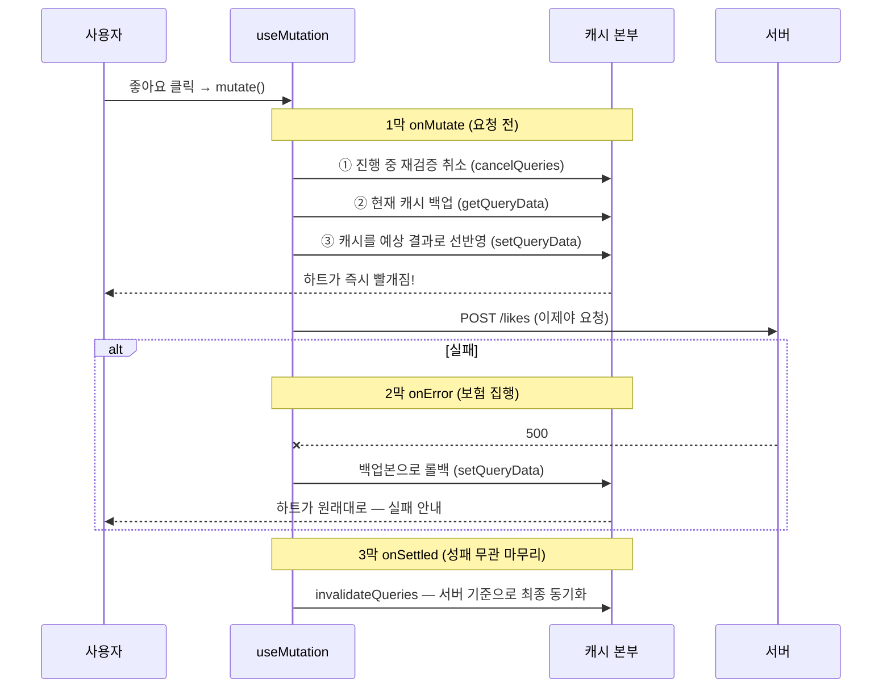

<Callout type="info">
  **이번 문서의 목표:** 무효화만으로는 부족한 순간 — 응답 지연이 UX를 해치는 좋아요·삭제 버튼, 페이지가 바뀔 때마다 깜빡이는 목록 — 에 캐시를 직접 갱신하는 기술을 적용하고, 실패 시 안전하게 되돌리는 낙관적 업데이트를 3막 구조(onMutate/onError/onSettled)로 설계할 수 있게 된다. 이 편이 이 과목에서 가장 깊게 파는 주제다.
</Callout>

## 왜 무효화만으로는 부족한가

04편의 "쓰기 → 무효화 → 재검증" 사이클은 안전하고 단순한 기본기입니다. 그런데 비용이 있습니다 — **네트워크 왕복 두 번**입니다. 쓰기 요청 한 번, 재검증 요청 한 번. 사용자가 결과를 보기까지 두 왕복만큼 기다립니다.

대부분의 화면에서는 그 지연이 문제없습니다. 하지만 이런 버튼들을 생각해 보세요.

- **좋아요 버튼**: 눌렀는데 하트가 1초 뒤에 빨개진다면? 사용자는 "안 눌렸나?" 하고 또 누릅니다.
- **할 일 체크박스**: 체크했는데 체크 표시가 늦게 뜬다면? 앱이 굼뜨다고 느낍니다.
- **댓글 삭제**: 삭제를 눌렀는데 댓글이 한동안 그대로라면? 사용자는 삭제 버튼을 연타합니다.

이런 상호작용의 공통점 — **성공 확률이 매우 높고, 결과를 클라이언트가 예측할 수 있다**는 점입니다. 좋아요가 성공하면 하트 수가 1 늘어난다는 것을 서버에 물어보지 않아도 압니다. 그렇다면 서버 응답을 기다리지 말고 **화면부터 바꿔버리면** 어떨까요? 이것이 **낙관적 업데이트**(optimistic update) — "성공할 거라고 낙관하고 UI를 먼저 갱신하는" 기법입니다.

다만 낙관에는 보험이 필요합니다. 만에 하나 실패하면 화면을 **원래대로 되돌려야**(rollback, 롤백) 하니까요. 그 보험 설계까지가 이 편의 핵심이고, 그 전에 먼저 도구부터 익힙니다 — 캐시를 직접 읽고 쓰는 손, `getQueryData`와 `setQueryData`입니다.

## 1. 캐시를 직접 다듬는 손 — setQueryData

지금까지 캐시는 queryFn을 통해서만 채워졌습니다. 그런데 캐시 본부(QueryClient)는 직접 읽기·쓰기 창구도 열어두고 있습니다.

```js
// 읽기: 해당 key의 현재 캐시 데이터를 동기적으로 반환 (없으면 undefined)
const posts = queryClient.getQueryData(["posts"]);

// 쓰기: 해당 key의 캐시를 새 값으로 교체 — 구독 중인 컴포넌트가 즉시 리렌더링
queryClient.setQueryData(["posts"], newPosts);

// 쓰기(함수형): 이전 값을 받아 새 값을 계산 — 실무에서는 대부분 이 형태
queryClient.setQueryData(["posts"], (old) =>
  old ? [...old, newPost] : [newPost]
);
```

setQueryData가 실행되는 순간 그 key를 구독하는 모든 컴포넌트가 새 데이터로 리렌더링됩니다 — 네트워크 요청 없이, 즉시. 두 가지 규칙을 지켜야 합니다.

**① 불변성을 지킨다.** `old.push(newPost)`처럼 기존 배열·객체를 직접 변형하면 안 됩니다. React가 변화를 감지하는 방식(참조 비교)과 TanStack Query의 내부 최적화가 모두 "새 참조 = 새 데이터"를 전제하기 때문입니다. 항상 스프레드 등으로 **새 배열·새 객체를 만들어** 반환합니다.

**② undefined를 조심한다.** 캐시가 아직 없을 수 있습니다(그 화면을 아직 안 열었다면). 함수형 갱신에서 old가 undefined인 경우를 반드시 처리하세요. 참고로 함수가 undefined를 반환하면 갱신이 취소됩니다.

### 실전 활용 ① — 뮤테이션 응답으로 캐시 심기

04편에서 "응답을 setState로 넣지 말라"고 했습니다. 대신 **캐시에** 넣는 것은 정당한 기법입니다. 글 수정 응답(수정된 글 전체)을 받았다면, 재검증 요청 없이 캐시를 바로 최신으로 만들 수 있습니다.

```jsx
const updateMutation = useMutation({
  mutationFn: updatePost,
  onSuccess: (updatedPost) => {
    // 상세 캐시: 응답으로 통째로 교체
    queryClient.setQueryData(["posts", updatedPost.id], updatedPost);
    // 목록 캐시: 해당 글만 갈아끼우는 부분 업데이트(병합)
    queryClient.setQueryData(["posts"], (old) =>
      old?.map((post) => (post.id === updatedPost.id ? updatedPost : post))
    );
  },
});
```

재검증 왕복이 사라져 빠르고, 서버가 준 **진짜 데이터**로 갱신하므로 낙관적 업데이트 같은 위험도 없습니다. 다만 유지보수 비용이 있습니다 — 이 글이 등장하는 캐시가 목록·상세·검색 결과·무한 스크롤 등 여러 곳이라면 전부 손으로 갱신해야 하고, 하나라도 빼먹으면 화면 간 불일치가 생깁니다. 그래서 실무 감각은 이렇습니다.

| 상황 | 전략 |
|------|------|
| 캐시 반영 지점이 한두 곳이고 응답에 최신 데이터가 있음 | setQueryData 직접 갱신 |
| 반영 지점이 많거나 서버 계산(정렬·집계)이 끼어 있음 | invalidateQueries로 재검증 |
| 확신이 없을 때 | **무효화가 기본기** — 느리지만 항상 옳다 |

setQueryData와 invalidate를 **함께** 쓰는 절충도 흔합니다 — 일단 캐시를 심어 화면을 즉시 갱신하고, 무효화도 걸어 서버 기준으로 한 번 더 맞추는 것입니다.

### 실전 활용 ② — 상세 화면의 초기 데이터

목록에서 글을 클릭해 상세로 갈 때, 목록 캐시에 이미 제목·작성자가 있는데 상세 화면이 스피너부터 보여주는 것은 아깝습니다. `initialData`로 목록 캐시의 조각을 상세 캐시의 씨앗으로 심을 수 있습니다.

```jsx
const { data } = useQuery({
  queryKey: ["posts", postId],
  queryFn: () => fetchPost(postId),
  initialData: () =>
    queryClient
      .getQueryData(["posts"])
      ?.find((post) => post.id === postId),
  initialDataUpdatedAt: () =>
    queryClient.getQueryState(["posts"])?.dataUpdatedAt,
});
```

상세 화면이 목록의 데이터로 **즉시** 뜨고, 본문 같은 나머지 필드는 배경 재검증으로 채워집니다. `initialDataUpdatedAt`은 "이 씨앗이 언제 데이터인지"를 알려줘 staleTime 판정이 정확해지게 합니다(안 주면 씨앗을 방금 받은 fresh 데이터로 오판할 수 있습니다).

## 2. 낙관적 업데이트 — 3막 구조로 설계하기

이제 주인공입니다. 좋아요 버튼을 예로, 서버 응답 전에 화면을 먼저 바꾸고 실패 시 되돌리는 전체 흐름을 설계합니다.

### 등장인물 — onMutate, onError, onSettled

useMutation에는 04편에서 본 onSuccess·onError·onSettled 외에 하나가 더 있습니다 — **onMutate**. mutate가 호출되면 **요청이 서버로 나가기 직전에** 실행되는 콜백입니다. 낙관적 업데이트의 3막은 이렇게 구성됩니다.



코드 전체입니다. TanStack Query 공식 문서의 정석 패턴이니 구조째 익혀두세요.

```jsx
const likeMutation = useMutation({
  mutationFn: (postId) => toggleLike(postId),

  // ── 1막: 요청 직전 — 선반영과 백업
  onMutate: async (postId) => {
    // ① 이 캐시를 향해 날아오는 중인 재검증이 있다면 취소한다.
    //    안 하면 옛 데이터를 실은 응답이 뒤늦게 도착해 선반영을 덮어쓴다.
    await queryClient.cancelQueries({ queryKey: ["posts", postId] });

    // ② 되돌릴 때 쓸 백업본을 떠 둔다.
    const previousPost = queryClient.getQueryData(["posts", postId]);

    // ③ 예상 결과를 캐시에 선반영 — 화면이 즉시 바뀐다.
    queryClient.setQueryData(["posts", postId], (old) =>
      old
        ? { ...old, liked: !old.liked, likeCount: old.likeCount + (old.liked ? -1 : 1) }
        : old
    );

    // ④ 반환값은 "컨텍스트"가 되어 onError·onSettled의 세 번째 인자로 전달된다.
    return { previousPost };
  },

  // ── 2막: 실패 — 백업본으로 롤백
  onError: (error, postId, context) => {
    queryClient.setQueryData(["posts", postId], context.previousPost);
    // + 사용자에게 실패 알림 (토스트 등)
  },

  // ── 3막: 성패 무관 — 서버 기준 최종 동기화
  onSettled: (data, error, postId) => {
    queryClient.invalidateQueries({ queryKey: ["posts", postId] });
  },
});
```

각 막을 뜯어봅니다.

**1막 onMutate — 취소, 백업, 선반영.** 세 동작의 순서가 전부 이유가 있습니다.

- **cancelQueries가 왜 먼저인가**: 마침 배경 재검증이 진행 중이었다면, 내가 캐시를 선반영한 **직후에** 그 응답(좋아요 반영 전의 옛 데이터)이 도착해 선반영을 덮어씁니다 — 하트가 빨개졌다가 혼자 꺼지는 유령 현상. 진행 중 요청을 먼저 취소해 이 **경쟁 조건**(race condition)을 차단합니다. await를 붙이는 것도 취소가 완료된 뒤에 다음 단계로 가기 위해서입니다.
- **백업은 선반영 전에**: 당연하지만, 바꾸기 전의 값을 떠 둬야 되돌릴 수 있습니다.
- **컨텍스트 반환**: onMutate의 반환값은 **컨텍스트**(context)라는 이름으로 이 뮤테이션의 다른 콜백들에게 전달됩니다. 백업본을 컴포넌트 변수가 아니라 컨텍스트로 나르는 이유 — 같은 뮤테이션이 연타로 여러 번 실행돼도 **각 실행이 자기만의 백업본**을 갖게 되기 때문입니다.

**2막 onError — 롤백은 기계적으로.** 컨텍스트의 백업본을 그대로 되돌려 놓습니다. 중요한 것은 **사용자에게 알리는 일**입니다 — 하트가 소리 없이 꺼지기만 하면 사용자는 앱이 미쳤다고 생각합니다. "좋아요에 실패했어요" 한 줄이 낙관적 UI의 신뢰를 지킵니다.

**3막 onSettled — 낙관을 진실로 교정.** 성공했든 실패했든 마지막엔 무효화로 서버 기준 재검증을 겁니다. 성공 시에도 필요한 이유 — 내 선반영은 어디까지나 **예측**이라, 서버의 실제 결과(다른 사용자의 좋아요가 겹쳐 카운트가 다르다든가)와 어긋날 수 있기 때문입니다. 낙관적 업데이트는 "먼저 보여주기"일 뿐, **진실의 원천은 끝까지 서버**라는 원칙이 이 막에 담겨 있습니다.

<Callout type="warning">
  **자주 틀리는 점:** 낙관적 업데이트를 아무 뮤테이션에나 적용하는 것. 적용 기준은 두 가지입니다 — ① 결과를 클라이언트가 확실히 예측할 수 있고(좋아요 토글, 삭제), ② 실패 확률이 낮으며 실패해도 롤백으로 충분히 수습되는가. 결제, 재고 차감, 서버 검증이 큰 폼 제출처럼 예측 불가하거나 실패가 치명적인 작업은 정직하게 스피너를 보여주는 편이 옳습니다. 낙관은 UX 기법이지 기본값이 아닙니다.
</Callout>

### 목록에 대한 낙관적 삭제

단건이 아니라 목록 캐시를 선반영하는 경우도 패턴은 동일합니다 — 백업, 선반영(필터로 제거), 롤백, 동기화.

```jsx
const deleteMutation = useMutation({
  mutationFn: deletePost,
  onMutate: async (postId) => {
    await queryClient.cancelQueries({ queryKey: ["posts"] });
    const previousPosts = queryClient.getQueryData(["posts"]);
    queryClient.setQueryData(["posts"], (old) =>
      old?.filter((post) => post.id !== postId)
    );
    return { previousPosts };
  },
  onError: (error, postId, context) => {
    queryClient.setQueryData(["posts"], context.previousPosts);
  },
  onSettled: () => {
    queryClient.invalidateQueries({ queryKey: ["posts"] });
  },
});
```

삭제 버튼을 누르는 즉시 글이 사라지고, 실패하면 되살아나며, 어느 쪽이든 서버와 최종 동기화됩니다. 04편 마지막에 남겨둔 "삭제했는데 한동안 남아 있는" 아쉬움이 이렇게 해소됩니다.

## 3. 페이지네이션 — 페이지가 바뀔 때 깜빡이지 않게

이제 캐시 설계의 다른 축 — **여러 조각으로 나뉜 데이터**를 다룹니다. 02편에서 본 페이지네이션 응답(data + meta)을 useQuery로 받아봅시다. key의 제1원칙대로 page는 key에 들어갑니다.

```jsx
function PostList() {
  const [page, setPage] = useState(1);

  const { data, isPending, isPlaceholderData } = useQuery({
    queryKey: ["posts", { page }],
    queryFn: () => fetchPosts(page),
    placeholderData: (previousData) => previousData, // ★ 핵심 한 줄
  });
  // ...
}
```

page가 1에서 2로 바뀌면 key가 바뀌므로 **완전히 새로운 캐시 항목**입니다. 새 항목엔 데이터가 없으니 기본 동작은 isPending — 화면이 목록에서 **스피너로 와장창 바뀌었다가** 2페이지가 뜹니다. 페이지를 넘길 때마다 화면이 깜빡이는 최악의 페이지네이션 UX입니다.

`placeholderData: (previousData) => previousData`가 이를 고칩니다. **placeholderData**는 "진짜 데이터가 오기 전까지 임시로 보여줄 데이터"인데, 함수형으로 쓰면 **직전 key의 데이터**를 넘겨받을 수 있습니다. 즉 2페이지를 기다리는 동안 1페이지를 계속 보여주고, 도착하는 순간 부드럽게 교체합니다. 지금 보이는 것이 임시 데이터인지는 `isPlaceholderData`로 알 수 있어, 그동안 "다음" 버튼을 잠그거나 흐림 효과를 줄 수 있습니다.

placeholderData는 **캐시에 저장되지 않는 순수 표시용**이라는 점에서 initialData와 다릅니다 — initialData는 진짜 데이터처럼 캐시에 심기고 staleTime 판정도 받지만, placeholderData는 화면 채우기용 가짜라 응답이 오면 흔적 없이 사라집니다.

## 4. 무한 스크롤 — useInfiniteQuery의 캐시 구조

SNS 피드처럼 "더 보기"로 데이터를 이어 붙이는 UI는 페이지네이션과 캐시 구조 자체가 다릅니다. 페이지네이션은 페이지마다 **별도 캐시 항목**(key가 다르니까)이지만, 무한 스크롤은 **하나의 캐시 항목 안에 페이지들이 쌓여야** 합니다 — 화면에 1·2·3페이지가 동시에 붙어 있으니까요. 이를 위한 전용 훅이 **useInfiniteQuery**입니다.

```jsx
const {
  data,              // { pages: [1페이지, 2페이지, …], pageParams: [...] }
  fetchNextPage,     // 다음 페이지를 이어서 가져오는 방아쇠
  hasNextPage,       // 다음 페이지가 존재하는가
  isFetchingNextPage // 다음 페이지를 가져오는 중인가
} = useInfiniteQuery({
  queryKey: ["posts", "infinite"],
  queryFn: ({ pageParam }) => fetchPosts(pageParam), // pageParam이 자동 주입된다
  initialPageParam: 1,
  getNextPageParam: (lastPage) =>
    // 마지막으로 받은 페이지의 meta를 보고 "다음 요청의 pageParam"을 계산.
    // undefined를 반환하면 "더 없음" — hasNextPage가 false가 된다.
    lastPage.meta.page < lastPage.meta.totalPages
      ? lastPage.meta.page + 1
      : undefined,
});
```

구조를 해부하면 —

- 캐시 항목 하나의 data가 평평한 배열이 아니라 `{ pages, pageParams }` — **페이지의 배열**입니다. 렌더링할 때는 `data.pages.flatMap((page) => page.data)`처럼 평탄화합니다.
- **getNextPageParam**이 무한 스크롤의 두뇌입니다. 방금 받은 페이지(lastPage)를 보고 다음 요청의 매개변수를 계산합니다 — 02편의 meta가 바로 이 계산의 재료입니다. 페이지 번호 방식뿐 아니라 "마지막 항목의 id 다음부터"를 주는 커서(cursor) 방식 API에도 같은 자리에서 커서를 반환하면 됩니다.
- "더 보기" 버튼(또는 스크롤 바닥 감지)에서 `fetchNextPage()`를 호출하면 새 페이지가 pages 배열 **뒤에 이어 붙습니다**.

```jsx
<button
  onClick={() => fetchNextPage()}
  disabled={!hasNextPage || isFetchingNextPage}
>
  {isFetchingNextPage ? "불러오는 중…" : hasNextPage ? "더 보기" : "끝!"}
</button>
```

### 무한 쿼리의 재검증 비용

알아둘 특성 — 무한 쿼리가 stale이 되어 재검증되면 **쌓인 모든 페이지를 순서대로 다시** 가져옵니다. 5페이지를 쌓았다면 5번의 순차 요청입니다. 왜 그럴까요? 2페이지만 갱신하면 그 사이 글이 추가·삭제됐을 때 페이지 경계가 밀려 **항목이 중복되거나 누락**되기 때문에, 정합성을 위해 처음부터 다시 쌓는 것입니다. 그래서 무한 쿼리에는 staleTime을 넉넉히 주고, 쌓인 페이지 수를 제한하는 `maxPages` 옵션을 고려하는 것이 실무 요령입니다.

또 하나 — 무한 쿼리에 낙관적 업데이트를 적용할 때는 setQueryData에서 `{ pages, pageParams }` 구조를 지키며 갱신해야 합니다.

```js
queryClient.setQueryData(["posts", "infinite"], (old) =>
  old
    ? {
        ...old,
        pages: old.pages.map((page) => ({
          ...page,
          data: page.data.filter((post) => post.id !== deletedId),
        })),
      }
    : old
);
```

구조가 깊어질수록 불변 갱신 코드도 깊어집니다 — 이런 복잡한 선반영일수록 "무효화가 기본기"라는 원칙을 다시 떠올리세요. 굳이 낙관적일 필요가 없는 자리라면 안전한 길이 좋은 길입니다.

## 핵심 정리

- setQueryData는 캐시를 직접 갱신해 구독 컴포넌트를 즉시 리렌더링시킨다 — 불변성을 지키고, old가 undefined인 경우를 처리한다. 반영 지점이 많으면 무효화가 기본기다.
- 낙관적 업데이트는 3막 구조: onMutate에서 취소(cancelQueries)·백업(getQueryData)·선반영(setQueryData) 후 백업을 컨텍스트로 반환, onError에서 컨텍스트로 롤백 + 사용자 알림, onSettled에서 무효화로 서버 기준 최종 동기화.
- cancelQueries를 빼먹으면 진행 중이던 재검증 응답이 선반영을 덮어쓰는 경쟁 조건이 생긴다. 적용 기준은 결과 예측 가능 + 실패가 수습 가능한 작업뿐이다.
- 페이지네이션은 page를 key에 넣고 placeholderData 함수형으로 직전 페이지를 유지해 깜빡임을 없앤다 — placeholderData는 캐시에 저장되지 않는 표시용이다.
- 무한 스크롤은 useInfiniteQuery — 캐시 하나에 pages 배열이 쌓이고, getNextPageParam이 meta·커서로 다음 매개변수를 계산하며, 재검증 시 전 페이지를 다시 가져오므로 staleTime·maxPages로 비용을 관리한다.

## 마무리 복습

<Quiz
  questionNumber={1}
  question="setQueryData의 함수형 갱신에서 기존 배열에 push로 항목을 추가하면 안 되는 이유는?"
  options={['push는 비동기 함수라서', 'React와 TanStack Query가 새 참조로 변화를 감지하는데 push는 기존 배열을 직접 변형해 참조가 그대로이기 때문', 'push는 배열 길이를 바꿀 수 없어서', '캐시가 읽기 전용으로 잠겨 있어서']}
  correctAnswer={2}
  explanation="변화 감지는 참조 비교에 기반한다. 기존 배열을 직접 변형하면 참조가 같아 갱신이 누락되거나 예측 불가능한 동작이 생기므로, 스프레드 등으로 항상 새 배열을 만들어 반환해야 한다."
  optionExplanations={['push는 동기 메서드다', '정답 — 불변성 유지가 캐시 직접 갱신의 제1규칙이다', 'push는 길이를 바꾼다 — 문제는 참조다', '캐시는 잠겨 있지 않다 — 규칙은 감지 방식에서 온다']}
/>

<Quiz
  questionNumber={2}
  question="onMutate에서 cancelQueries를 가장 먼저 호출하는 이유는?"
  options={['서버의 처리 속도를 높이기 위해', '진행 중이던 재검증 응답이 뒤늦게 도착해 선반영한 캐시를 옛 데이터로 덮어쓰는 경쟁 조건을 막기 위해', '캐시 메모리를 확보하기 위해', '다른 뮤테이션의 실행을 차단하기 위해']}
  correctAnswer={2}
  explanation="선반영 직후 진행 중이던 재검증 응답(선반영 이전의 옛 데이터)이 도착하면 화면이 혼자 되돌아가는 유령 현상이 생긴다. 요청을 먼저 취소해 이 경쟁 조건을 차단한다."
  optionExplanations={['클라이언트 캐시 작업이라 서버 속도와 무관하다', '정답 — 하트가 빨개졌다 혼자 꺼지는 현상의 원인이 이것이다', '메모리 확보 목적이 아니다', '뮤테이션이 아니라 진행 중인 쿼리 요청을 취소하는 것이다']}
/>

<Quiz
  questionNumber={3}
  question="onMutate가 백업본을 컴포넌트 변수 대신 반환값(컨텍스트)으로 전달하는 이유는?"
  options={['반환값이 자동으로 서버에 전송되기 때문', '같은 뮤테이션이 연달아 여러 번 실행돼도 각 실행이 자기만의 백업본을 가져 롤백이 꼬이지 않기 때문', '컴포넌트 변수는 콜백에서 접근이 불가능하기 때문', '컨텍스트는 자동으로 캐시에 저장되기 때문']}
  correctAnswer={2}
  explanation="onMutate의 반환값은 그 실행 건의 컨텍스트가 되어 같은 건의 onError·onSettled에 전달된다. 연타로 여러 건이 동시에 진행돼도 실행별 백업이 분리되어 정확한 롤백이 가능하다."
  optionExplanations={['서버 전송과는 무관한 클라이언트 내부 전달 통로다', '정답 — 실행 건 단위의 격리가 컨텍스트의 존재 이유다', '클로저로 접근은 가능하지만 여러 실행이 하나의 변수를 공유해 꼬인다', '컨텍스트는 캐시에 저장되지 않는다']}
/>

<Quiz
  questionNumber={4}
  question="낙관적 업데이트가 성공했는데도 onSettled에서 무효화를 거는 이유는?"
  options={['롤백을 한 번 더 수행하기 위해', '선반영은 클라이언트의 예측일 뿐이므로 서버의 실제 결과와 최종 동기화하기 위해', '캐시를 삭제해 메모리를 절약하기 위해', '무효화 없이는 onSuccess가 실행되지 않기 때문']}
  correctAnswer={2}
  explanation="선반영 값은 예측이라 다른 사용자의 변경 등으로 서버 실제 값과 어긋날 수 있다. 진실의 원천은 서버라는 원칙에 따라 성패와 무관하게 재검증으로 교정한다."
  optionExplanations={['롤백은 실패 시 onError의 몫이다', '정답 — 낙관은 먼저 보여주기일 뿐 최종 진실은 서버가 정한다', '무효화는 삭제가 아니라 재검증 신고다', '콜백 실행 순서는 무효화와 무관하다']}
/>

<Quiz
  questionNumber={5}
  question="다음 중 낙관적 업데이트를 적용하기에 가장 적합한 작업은?"
  options={['신용카드 결제 승인', '할 일 항목의 완료 체크 토글', '재고 수량 차감 주문', '복잡한 서버 검증이 있는 회원가입 제출']}
  correctAnswer={2}
  explanation="적용 기준은 결과를 클라이언트가 확실히 예측할 수 있고 실패해도 롤백으로 수습 가능한 작업이다. 체크 토글은 결과가 자명하고 실패 시 되돌리면 그만이지만, 결제·재고·복잡한 검증은 예측 불가하거나 실패가 치명적이다."
  optionExplanations={['결제는 실패가 치명적이고 결과 예측도 불가능하다', '정답 — 예측 가능하고 실패 수습이 쉬운 전형적 후보다', '재고는 서버만 아는 상태라 예측이 불가능하다', '서버 검증 결과를 클라이언트가 미리 알 수 없다']}
/>

<Quiz
  questionNumber={6}
  question="페이지네이션에서 placeholderData: (previousData) =&gt; previousData가 해결하는 문제는?"
  options={['페이지 번호가 key에 포함되지 않는 문제', '페이지 이동 시 새 key의 캐시가 비어 있어 화면이 스피너로 깜빡이는 문제', '서버가 메타데이터를 주지 않는 문제', '마지막 페이지를 감지하지 못하는 문제']}
  correctAnswer={2}
  explanation="page가 바뀌면 key가 바뀌어 새 캐시 항목이 되고 기본 동작은 isPending이다. placeholderData 함수형은 직전 key의 데이터를 임시로 보여주어 새 페이지 도착까지 화면을 유지한다."
  optionExplanations={['page는 당연히 key에 넣어야 하며 그것이 깜빡임의 전제다', '정답 — 직전 페이지를 보여주다 부드럽게 교체하는 표준 기법이다', '메타데이터는 서버 응답 설계의 문제다', '마지막 페이지 감지는 meta나 getNextPageParam의 역할이다']}
/>

<Quiz
  questionNumber={7}
  question="useInfiniteQuery의 getNextPageParam이 undefined를 반환하면 일어나는 일은?"
  options={['에러 상태가 된다', 'hasNextPage가 false가 되어 더 가져올 페이지가 없음을 나타낸다', '첫 페이지부터 다시 가져온다', '캐시가 삭제된다']}
  correctAnswer={2}
  explanation="getNextPageParam은 다음 요청의 매개변수를 계산하며, undefined 반환은 더 없음의 신호다. hasNextPage가 false가 되고 fetchNextPage 호출도 무시된다."
  optionExplanations={['정상적인 끝 신호이지 에러가 아니다', '정답 — 더 보기 버튼을 잠그는 기준이 이 값이다', '전체 재요청은 재검증 시의 동작이다', '캐시는 그대로 유지된다']}
/>

<Quiz
  questionNumber={8}
  question="무한 쿼리가 재검증될 때 쌓인 모든 페이지를 처음부터 다시 가져오는 이유는?"
  options={['서버가 개별 페이지 요청을 지원하지 않아서', '그 사이 항목 추가·삭제로 페이지 경계가 밀리면 일부만 갱신 시 중복·누락이 생겨 정합성이 깨지기 때문', '네트워크 요청 횟수를 줄이기 위해', 'pages 배열이 읽기 전용이기 때문']}
  correctAnswer={2}
  explanation="페이지 경계는 전체 데이터 상태에 의존한다. 중간에 글이 추가·삭제되면 각 페이지의 내용이 밀리므로, 일부 페이지만 갱신하면 이어 붙인 목록에 중복이나 누락이 생긴다. 그래서 순서대로 전부 다시 쌓으며, staleTime과 maxPages로 비용을 관리한다."
  optionExplanations={['개별 요청은 가능하다 — 문제는 경계의 정합성이다', '정답 — 그래서 무한 쿼리에는 재검증 비용 관리가 필요하다', '오히려 요청이 페이지 수만큼 늘어나는 비용을 감수하는 설계다', '불변 갱신 규칙과는 별개의 이유다']}
/>

## 참고 자료

- [TanStack Query v5 - Optimistic Updates](https://tanstack.com/query/v5/docs/framework/react/guides/optimistic-updates)
- [TanStack Query v5 - Updates from Mutation Responses](https://tanstack.com/query/v5/docs/framework/react/guides/updates-from-mutation-responses)
- [TanStack Query v5 - Paginated Queries](https://tanstack.com/query/v5/docs/framework/react/guides/paginated-queries)
- [TanStack Query v5 - Infinite Queries](https://tanstack.com/query/v5/docs/framework/react/guides/infinite-queries)
- [TanStack Query v5 - QueryClient API (setQueryData, cancelQueries)](https://tanstack.com/query/v5/docs/reference/QueryClient)
