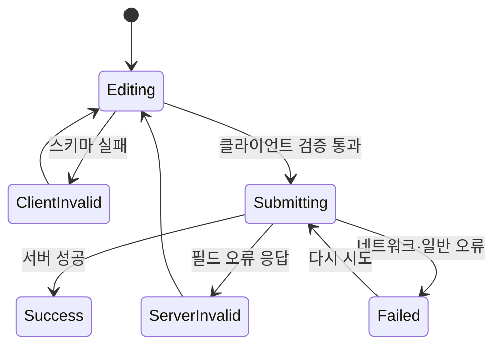

<Callout type="info">
  **이번 문서의 목표:** 폼 값·검증 규칙·오류·제출 상태의 책임을 구분하고, react-hook-form과 Zod로 타입과 런타임 검증이 일치하는 동적 폼을 만들 수 있다.
</Callout>

## 왜 폼 라이브러리가 필요한가

입력 두 개짜리 폼은 `useState`만으로 충분합니다. 하지만 회원 가입 폼에 이름·이메일·비밀번호·약관·주소 배열이 들어오면 값, 방문 여부, 오류, 제출 중 상태, 서버 오류를 직접 맞춰야 합니다. 필드 하나를 추가할 때 여러 객체와 핸들러를 동시에 고치는 구조는 금방 어긋납니다.

> **쉽게 말하면:** react-hook-form은 브라우저 폼이 이미 잘하는 값 수집을 활용하면서, React에서 검증·오류·제출 흐름을 한 API로 묶는 도구입니다.

**RHF**(React Hook Form)는 입력 DOM의 값을 필요할 때 읽는 비제어(uncontrolled) 방식을 기본으로 사용합니다. 키를 누를 때마다 부모 state를 갱신하지 않아도 되어 큰 폼에서 렌더 범위를 줄일 수 있습니다. 반면 날짜 선택기처럼 `value`와 `onChange`를 요구하는 외부 제어 컴포넌트는 `Controller`로 연결합니다.

## 1. useForm이 돌려주는 폼 제어기

`useForm`은 폼 전체를 제어하는 함수와 상태를 반환합니다.

```jsx
const {
  register,
  handleSubmit,
  control,
  setError,
  formState: { errors, isSubmitting, isDirty },
} = useForm({
  defaultValues: {
    email: '',
    role: 'member',
    skills: [{ name: '' }],
  },
});
```

- `register`: 기본 HTML 입력을 RHF에 등록합니다.
- `handleSubmit`: 검증을 통과한 값만 제출 함수에 전달합니다.
- `control`: `Controller`와 `useFieldArray`가 같은 폼 제어기를 사용하게 합니다.
- `errors`: 필드별 오류 객체입니다.
- `isSubmitting`: 비동기 제출이 진행 중인지 알려줍니다.
- `isDirty`: 기본값과 달라진 필드가 있는지 알려줍니다.

`defaultValues`를 명시하는 습관이 중요합니다. 제어·비제어 전환 경고를 피하고, reset과 dirty 비교의 기준점을 제공합니다. 서버에서 초기값을 가져온다면 로딩 완료 뒤 `reset(serverData)`로 폼의 새 기준값을 설정합니다.

## 2. register로 기본 입력 연결하기

`register('email')`은 입력에 필요한 `name`, `ref`, `onChange`, `onBlur`를 묶어서 반환합니다. spread 문법으로 input에 연결합니다.

```jsx
function SignupForm() {
  const {
    register,
    handleSubmit,
    formState: { errors },
  } = useForm();

  function onValid(values) {
    console.log(values);
  }

  return (
    <form onSubmit={handleSubmit(onValid)} noValidate>
      <label htmlFor="email">이메일</label>
      <input
        id="email"
        type="email"
        {...register('email', {
          required: '이메일을 입력하세요.',
          pattern: {
            value: /^[^\s@]+@[^\s@]+\.[^\s@]+$/,
            message: '이메일 형식이 올바르지 않습니다.',
          },
        })}
        aria-invalid={Boolean(errors.email)}
        aria-describedby={errors.email ? 'email-error' : undefined}
      />
      {errors.email && <p id="email-error" role="alert">{errors.email.message}</p>}
      <button>가입</button>
    </form>
  );
}
```

`handleSubmit`에 `onValid()`의 결과가 아니라 함수 자체를 넘깁니다. RHF가 submit 이벤트를 받고 현재 값을 수집한 뒤 검증하고, 성공했을 때만 함수를 호출합니다.

HTML 기본 검증과 사용자 정의 검증을 함께 쓸 수 있지만, 오류 UI를 한 흐름으로 제어하려면 `noValidate`로 브라우저 팝업을 끄고 RHF 오류를 접근성 있게 표시하는 방식이 관리하기 쉽습니다.

## 3. Zod로 검증 규칙을 데이터 모델로 만든다

필드가 많아지면 `register`마다 규칙을 흩어놓기보다 **스키마**(schema, 데이터가 가져야 할 형태와 제약의 선언)로 모읍니다. Zod는 런타임 값을 실제로 검사하고 TypeScript 타입도 추론할 수 있는 스키마 라이브러리입니다.

```tsx
import { z } from 'zod';

const signupSchema = z.object({
  email: z.string().trim().email('올바른 이메일을 입력하세요.'),
  password: z
    .string()
    .min(8, '비밀번호는 8자 이상이어야 합니다.')
    .regex(/[0-9]/, '숫자를 하나 이상 포함하세요.'),
  confirmPassword: z.string(),
  role: z.enum(['member', 'admin']),
  skills: z
    .array(z.object({ name: z.string().trim().min(1, '기술 이름을 입력하세요.') }))
    .min(1, '기술을 하나 이상 추가하세요.'),
}).refine((data) => data.password === data.confirmPassword, {
  path: ['confirmPassword'],
  message: '비밀번호 확인이 일치하지 않습니다.',
});

type SignupValues = z.infer<typeof signupSchema>;
```

`z.infer`는 스키마에서 TypeScript 타입을 만들어냅니다. 타입과 검증 규칙을 따로 작성하지 않으므로 둘이 어긋날 가능성이 줄어듭니다. 그러나 TypeScript 타입은 빌드 뒤 사라지므로 서버 응답·URL·폼 입력 같은 외부 값은 Zod의 런타임 검증이 여전히 필요합니다.

RHF와 연결할 때는 resolver를 사용합니다.

```tsx
const form = useForm<SignupValues>({
  resolver: zodResolver(signupSchema),
  defaultValues: {
    email: '',
    password: '',
    confirmPassword: '',
    role: 'member',
    skills: [{ name: '' }],
  },
});
```

이제 `handleSubmit`이 Zod 스키마를 통과한 값만 제출 함수에 전달하고, 실패 결과는 `formState.errors`의 해당 경로에 매핑됩니다.

## 4. Controller는 언제 필요한가

기본 input, select, textarea는 `register`를 우선 사용합니다. 반면 외부 UI 컴포넌트가 자체 `value`, `onChange` API를 사용하고 DOM ref 등록만으로 값을 읽을 수 없다면 `Controller`가 어댑터 역할을 합니다.

```jsx
<Controller
  name="birthDate"
  control={control}
  render={({ field, fieldState }) => (
    <DatePicker
      value={field.value}
      onChange={field.onChange}
      onBlur={field.onBlur}
      inputRef={field.ref}
      errorMessage={fieldState.error?.message}
    />
  )}
/>
```

`field` 객체를 다시 별도 state와 동기화하지 않습니다. RHF와 컴포넌트 state라는 두 출처를 만들면 어느 값이 최신인지 관리해야 합니다. DatePicker 값 형태가 `Date`인데 스키마는 문자열을 기대한다면 `onChange` 경계에서 변환하거나 Zod 전처리를 명시합니다.

<Callout type="warning">
  모든 입력을 Controller로 감싸지 마세요. 기본 HTML 입력에는 register가 더 단순하고 비제어 방식의 장점을 유지합니다. Controller는 제어 컴포넌트를 연결하는 어댑터입니다.
</Callout>

## 5. useFieldArray로 동적 필드를 다룬다

기술 목록처럼 사용자가 행을 추가·삭제하는 폼에는 `useFieldArray`를 사용합니다.

```tsx
const { fields, append, remove } = useFieldArray({
  control,
  name: 'skills',
});

return (
  <fieldset>
    <legend>기술</legend>
    {fields.map((field, index) => (
      <div key={field.id}>
        <input {...register(`skills.${index}.name`)} />
        <button type="button" onClick={() => remove(index)}>삭제</button>
        {errors.skills?.[index]?.name && (
          <p role="alert">{errors.skills[index].name.message}</p>
        )}
      </div>
    ))}
    <button type="button" onClick={() => append({ name: '' })}>기술 추가</button>
  </fieldset>
);
```

React key에는 배열 인덱스가 아니라 RHF가 제공하는 `field.id`를 사용합니다. 삭제 뒤 인덱스가 바뀌어도 입력 DOM의 정체성을 안정적으로 추적하기 위해서입니다. 반면 필드 이름은 현재 배열 위치를 표현하므로 `skills.0.name` 형태의 index를 사용합니다.

## 6. 제출 흐름을 하나의 상태 머신으로 본다

폼 제출은 단순 클릭이 아니라 다음 상태를 가집니다.



`isSubmitting` 동안 버튼을 비활성화해 중복 요청을 줄이되, 사용자가 현재 상태를 알 수 있게 문구를 함께 바꿉니다. 제출 성공 뒤에는 요구사항에 따라 `reset()`으로 초기화하거나 서버가 반환한 정규화 값을 `reset(savedValue)`로 새 기준값으로 삼습니다.

서버 오류 매핑과 포커스·ARIA 처리는 다음 7편에서 깊게 다룹니다. 여기서는 클라이언트 스키마가 서버 검증을 대체하지 않는다는 점만 기억하세요. 브라우저 검증은 사용자 경험을 위한 빠른 피드백이고, 신뢰 경계의 최종 검증은 서버 책임입니다.

## 자주 틀리는 점

- `defaultValues` 없이 undefined와 문자열 사이를 오가지 않는다.
- `handleSubmit(onSubmit())`처럼 제출 함수를 렌더 중 호출하지 않는다.
- Zod 스키마와 별도 TypeScript 인터페이스를 중복 관리하지 않는다.
- 기본 input까지 무조건 Controller로 감싸지 않는다.
- 동적 행의 React key로 index를 사용하지 않는다.
- 클라이언트 검증을 보안 검증으로 착각하지 않는다.

## 핵심 정리

- `useForm`은 값 수집, 오류, 제출 상태를 한 폼 제어기로 묶는다.
- 기본 HTML 입력은 `register`, 외부 제어 컴포넌트는 `Controller`로 연결한다.
- Zod 스키마는 런타임 검증의 단일 출처가 되고 `z.infer`로 타입을 파생한다.
- `useFieldArray`의 `field.id`는 동적 행의 안정적인 React key다.
- 클라이언트 검증은 빠른 피드백이며 최종 권한·무결성 검증은 서버가 수행한다.

## 마무리 복습

<Quiz questionNumber={1} question="기본 HTML input을 RHF에 연결할 때 우선 사용할 API는?" options={['register', 'Controller', 'setInterval', 'createPortal']} correctAnswer={1} explanation="register는 name, ref, onChange, onBlur를 입력에 연결해 비제어 방식으로 값을 수집한다. Controller는 외부 제어 컴포넌트용 어댑터다." optionExplanations={['정답 — 기본 입력의 표준 연결 방식이다', '기본 input에는 대개 필요 없다', '시간 반복 API다', 'DOM 위치를 옮기는 API다']} />

<Quiz questionNumber={2} question="Zod 스키마와 z.infer를 함께 쓰는 가장 큰 이점은?" options={['브라우저가 서버 검증을 생략한다', '런타임 검증 규칙에서 TypeScript 타입을 파생해 중복을 줄인다', '모든 입력이 자동으로 비동기가 된다', 'CSS 클래스가 생성된다']} correctAnswer={2} explanation="하나의 스키마가 실제 값 검증과 정적 타입의 근거가 된다. 타입만으로 외부 입력을 검증할 수는 없으므로 Zod 파싱은 런타임에도 필요하다." optionExplanations={['서버 검증은 여전히 필요하다', '정답 — 규칙과 타입의 불일치를 줄인다', '비동기 여부와 무관하다', '스타일 도구가 아니다']} />

<Quiz questionNumber={3} question="Controller가 필요한 대표 상황은?" options={['일반 text input을 등록할 때마다', 'value와 onChange를 요구하는 외부 DatePicker를 RHF와 연결할 때', '정적 문단을 렌더할 때', 'route를 변경할 때']} correctAnswer={2} explanation="Controller는 제어 컴포넌트의 값·변경·blur·ref API를 RHF field와 이어주는 어댑터다." optionExplanations={['register가 더 단순하다', '정답 — 제어 컴포넌트 통합의 대표 사례다', '폼 필드가 아니다', '라우터 책임이다']} />

<Quiz questionNumber={4} question="useFieldArray의 fields를 렌더할 때 key로 field.id를 써야 하는 이유는?" options={['id가 화면에 자동 출력되어서', '행 삭제·이동 뒤에도 입력의 정체성을 안정적으로 유지하기 위해', '배열 index는 JSX 문법 오류여서', 'Zod가 숫자를 허용하지 않아서']} correctAnswer={2} explanation="index는 삭제나 재정렬 뒤 다른 항목을 가리킬 수 있다. field.id는 각 행의 안정적인 정체성으로 React의 reconciliation을 돕는다." optionExplanations={['key는 화면에 표시되지 않는다', '정답 — 동적 목록의 상태 연결을 보호한다', '문법상 가능하지만 안정성이 문제다', 'Zod와 key 선택은 별개다']} />

<Quiz questionNumber={5} question="서버에서 불러온 편집 데이터로 폼의 dirty 기준까지 갱신하려면 적절한 API는?" options={['reset(serverData)', 'console.log(serverData)', 'window.reload()', 'setError의 root만 설정']} correctAnswer={1} explanation="reset에 새 값을 전달하면 현재 값과 default 기준을 함께 갱신할 수 있다. 단순히 각 필드를 setValue하면 dirty 기준 설계를 별도로 고려해야 한다." optionExplanations={['정답 — 서버 값을 새 폼 기준으로 삼는다', '화면 상태를 바꾸지 않는다', '사용자 흐름과 앱 상태를 잃는다', '오류 설정은 초기값 갱신이 아니다']} />

<Quiz questionNumber={6} question="클라이언트 Zod 검증을 통과했으므로 서버가 입력 검증을 생략해도 된다는 설명은?" options={['맞다. 같은 스키마 이름이면 안전하다', '틀리다. 클라이언트는 조작 가능하므로 서버가 신뢰 경계에서 다시 검증해야 한다', '맞다. TypeScript가 네트워크 요청을 보호한다', '틀리다. 대신 localStorage가 검증해야 한다']} correctAnswer={2} explanation="브라우저 코드는 사용자가 우회하거나 직접 API를 호출할 수 있다. 클라이언트 검증은 UX를 개선하고 서버 검증은 데이터 무결성과 보안을 강제한다." optionExplanations={['클라이언트 결과는 신뢰할 수 없다', '정답 — 서버 검증은 필수다', '타입은 런타임 네트워크 값을 막지 못한다', '브라우저 저장소는 검증 신뢰 경계가 아니다']} />

## 참고 자료

- [React Hook Form 공식 문서 - Get Started](https://react-hook-form.com/get-started)
- [React Hook Form 공식 문서 - Controller](https://react-hook-form.com/docs/usecontroller/controller)
- [React Hook Form 공식 문서 - useFieldArray](https://react-hook-form.com/docs/usefieldarray)
- [Zod 공식 문서](https://zod.dev/)
- [Resolvers 공식 저장소 - Zod 연동](https://github.com/react-hook-form/resolvers)
