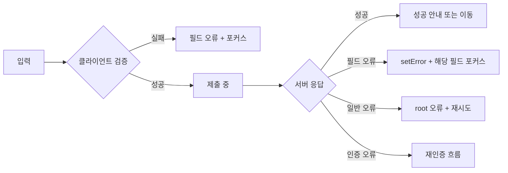

<Callout type="info">
  **이번 문서의 목표:** 폼 제출의 성공·필드 오류·일반 서버 오류·네트워크 실패를 구분하고, 모든 사용자가 오류를 발견하고 수정한 뒤 안전하게 다시 제출할 수 있는 흐름을 구현한다.
</Callout>

## 검증 통과가 제출 성공은 아니다

Zod가 이메일 형식을 통과시켜도 서버는 "이미 가입된 이메일"이라고 거절할 수 있습니다. 결제 폼의 숫자가 올바라도 재고가 사라졌거나 세션이 만료될 수 있습니다. 따라서 폼 오류는 발생 위치와 사용자가 취할 행동에 따라 나눠야 합니다.

> **쉽게 말하면:** 입력 형식이 틀린 오류, 특정 필드의 서버 오류, 폼 전체의 서버 오류, 연결 실패는 서로 다른 문제이며 서로 다른 회복 행동이 필요합니다.

| 오류 종류 | 예시 | 표시 위치 | 다음 행동 |
|---|---|---|---|
| 클라이언트 필드 오류 | 이메일 형식 오류 | 해당 필드 바로 아래 | 값을 수정한다 |
| 서버 필드 오류 | 이미 사용 중인 이메일 | 해당 필드 바로 아래 | 값을 수정한다 |
| 서버 폼 오류 | 현재 주문을 처리할 수 없음 | 폼 상단 요약 | 내용을 확인하고 재시도한다 |
| 인증 오류 | 세션 만료 | 폼 상단 또는 로그인 흐름 | 다시 인증한다 |
| 네트워크 오류 | 연결 끊김 | 폼 상단 요약 | 연결 확인 후 재시도한다 |

## 1. RHF 오류 객체를 읽는 법

`formState.errors`는 필드 이름을 따라 중첩됩니다. `profile.email` 오류는 `errors.profile?.email`, 배열의 첫 주소 오류는 `errors.addresses?.[0]?.city`에서 읽습니다.

```jsx
const {
  register,
  handleSubmit,
  setError,
  clearErrors,
  setFocus,
  formState: { errors, isSubmitting },
} = useForm({ resolver: zodResolver(schema) });
```

오류 메시지를 단순한 빨간 글씨로만 표현하지 않습니다. 색을 구분하기 어려운 사용자와 화면 낭독기 사용자는 색만으로 오류를 알 수 없습니다.

```jsx
<label htmlFor="email">이메일</label>
<input
  id="email"
  {...register('email')}
  aria-invalid={Boolean(errors.email)}
  aria-describedby={errors.email ? 'email-error' : undefined}
/>
{errors.email && (
  <p id="email-error" role="alert">
    {errors.email.message}
  </p>
)}
```

`aria-invalid`는 입력이 유효하지 않음을 알리고, `aria-describedby`는 오류 문구와 입력을 연결합니다. `role="alert"`는 새 오류가 나타났음을 보조 기술에 알립니다. 같은 오류를 상단 요약과 필드 아래에 둘 때는 낭독이 과도하게 반복되지 않도록 요약에는 링크와 짧은 설명을 제공합니다.

## 2. 서버 응답을 안정된 계약으로 만든다

서버마다 오류 응답 형태가 제각각이면 화면마다 매핑 코드가 달라집니다. API 계층에서 공통 오류 모델로 정규화합니다.

```ts
type FormApiError = {
  status: number;
  message: string;
  fieldErrors?: Record<string, string>;
  code?: string;
};

async function submitSignup(values: SignupValues): Promise<SignupResult> {
  const response = await fetch('/api/signup', {
    method: 'POST',
    headers: { 'Content-Type': 'application/json' },
    body: JSON.stringify(values),
  });

  const body = await response.json().catch(() => null);
  if (!response.ok) {
    throw {
      status: response.status,
      message: body?.message ?? '요청을 처리하지 못했습니다.',
      fieldErrors: body?.fieldErrors,
      code: body?.code,
    } satisfies FormApiError;
  }
  return body;
}
```

HTTP 상태 코드와 사용자 메시지를 분리합니다. 서버의 스택 추적이나 데이터베이스 오류 문자열을 그대로 사용자에게 노출하지 않습니다. 클라이언트는 상태 코드와 안정된 `code`를 기준으로 행동을 정하고, 표시 문구는 사용자에게 다음 행동을 안내합니다.

## 3. setError로 서버 필드 오류를 매핑한다

서버가 `{ fieldErrors: { email: '이미 사용 중입니다.' } }`를 반환했다면 RHF의 `setError`로 같은 필드 오류 흐름에 넣습니다.

```tsx
async function onSubmit(values: SignupValues) {
  clearErrors('root.server');
  try {
    await submitSignup(values);
    reset(values);
    navigate('/welcome');
  } catch (error) {
    const apiError = error as FormApiError;

    if (apiError.status === 401) {
      setError('root.server', {
        type: 'server',
        message: '로그인이 만료되었습니다. 다시 로그인해 주세요.',
      });
      return;
    }

    const entries = Object.entries(apiError.fieldErrors ?? {});
    for (const [field, message] of entries) {
      if (isSignupField(field)) {
        setError(field, { type: 'server', message });
      }
    }

    if (entries.length > 0) {
      const firstField = entries[0][0];
      if (isSignupField(firstField)) setFocus(firstField);
      return;
    }

    setError('root.server', {
      type: 'server',
      message: apiError.message,
    });
  }
}
```

서버가 보낸 필드 이름을 무조건 타입 단언으로 통과시키지 않습니다. 허용된 폼 경로인지 검사해, 예상치 못한 키가 UI 내부 구조에 들어오지 않게 합니다. 필드에 대응하지 않는 오류는 `root.server`처럼 폼 전체 오류로 표시합니다.

## 4. 오류 요약과 포커스 관리

긴 폼에서 아래쪽 오류만 표시하면 키보드·화면 낭독기 사용자는 제출이 실패한 이유를 놓칠 수 있습니다. 제출 실패 시 첫 오류로 포커스를 옮기고, 상단 요약에서 오류 필드로 이동할 수 있게 합니다.

```jsx
function ErrorSummary({ errors }) {
  const items = flattenErrors(errors);
  if (items.length === 0) return null;

  return (
    <section role="alert" aria-labelledby="error-title" tabIndex={-1}>
      <h2 id="error-title">입력 내용을 확인해 주세요.</h2>
      <ul>
        {items.map(({ field, message }) => (
          <li key={field}>
            <a href={'#' + field}>{message}</a>
          </li>
        ))}
      </ul>
    </section>
  );
}
```

RHF의 `shouldFocusError` 기본 동작은 등록 순서의 첫 오류 입력으로 포커스를 이동합니다. 커스텀 입력은 ref 전달이 올바른지 확인해야 합니다. 숨겨진 탭 안 오류처럼 바로 포커스할 수 없는 경우에는 먼저 탭을 열고 다음 프레임에 포커스를 이동하는 흐름을 설계합니다.

## 5. 제출 중·중복 제출·재시도

```jsx
<button type="submit" disabled={isSubmitting} aria-busy={isSubmitting}>
  {isSubmitting ? '저장 중...' : '저장'}
</button>
```

`isSubmitting`으로 실수에 의한 중복 클릭을 줄일 수 있지만 이것만으로 결제·주문 중복을 완전히 막을 수는 없습니다. 네트워크 재전송과 여러 탭 요청까지 고려하려면 서버가 멱등성 키(idempotency key, 같은 요청을 여러 번 받아도 한 번만 처리하게 하는 식별자)를 지원해야 합니다.

재시도는 사용자가 입력을 다시 작성하게 만들지 않아야 합니다. 네트워크 실패 뒤 폼 값을 유지하고, 버튼으로 같은 값을 다시 제출하게 합니다. 반면 서버 필드 오류는 사용자가 해당 값을 수정하면 지우거나 새 검증 결과로 교체합니다.



## 6. TanStack Query mutation과 연결할 때

mutation을 쓰더라도 RHF가 필드 오류와 입력 상태를, mutation이 서버 요청 상태와 캐시 후속 처리를 맡는 책임은 유지합니다.

```tsx
const mutation = useMutation({ mutationFn: submitSignup });

const onSubmit = handleSubmit(async (values) => {
  try {
    const result = await mutation.mutateAsync(values);
    reset(values);
    queryClient.invalidateQueries({ queryKey: ['members'] });
    navigate(`/members/${result.id}`);
  } catch (error) {
    mapApiErrorsToForm(error, { setError, setFocus });
  }
});
```

`onError`와 `catch` 양쪽에서 같은 오류를 중복 표시하지 않습니다. 필드 오류처럼 폼 API가 필요한 처리는 제출 함수 가까이 두고, 전역 토스트나 관찰 로그만 mutation 공통 계층에 둘 수 있습니다.

## 자주 틀리는 점

- 서버 오류 문자열을 예외 객체 그대로 화면에 출력하지 않는다.
- 400·401·403·409·500 오류를 모두 같은 메시지로 처리하지 않는다.
- 색상만으로 오류를 표시하지 않는다.
- 성공 전에 reset하거나 이동하지 않는다.
- 버튼 비활성화만으로 서버 중복 처리가 해결됐다고 믿지 않는다.
- 필드 오류와 폼 전체 오류를 같은 위치에 무조건 쌓지 않는다.

## 핵심 정리

- 클라이언트 필드 오류, 서버 필드 오류, 폼 전체 오류, 인증·네트워크 오류는 회복 행동이 다르다.
- `setError`와 `root` 오류로 서버 실패를 RHF 흐름에 매핑할 수 있다.
- `aria-invalid`, `aria-describedby`, 오류 요약과 포커스로 오류를 발견 가능하게 만든다.
- `isSubmitting`은 UX 중복 클릭을 줄이고, 최종 중복 방지는 서버 멱등성 설계가 맡는다.
- mutation과 폼은 각각 서버 요청과 필드 상호작용이라는 책임을 분리한다.

## 마무리 복습

<Quiz questionNumber={1} question="서버가 이미 사용 중인 이메일이라고 응답했을 때 가장 적절한 표시 위치는?" options={['콘솔에만 기록', 'email 필드 오류로 매핑하고 해당 입력과 연결', '모든 입력을 삭제한 뒤 홈으로 이동', '성공 메시지 영역']} correctAnswer={2} explanation="사용자가 수정할 수 있는 특정 필드 문제이므로 setError로 email에 연결하고 해당 입력 가까이에 메시지를 표시한다." optionExplanations={['사용자가 해결 방법을 알 수 없다', '정답 — 오류와 수정 지점을 가깝게 둔다', '입력 손실과 혼란을 만든다', '오류를 성공으로 오인하게 한다']} />

<Quiz questionNumber={2} question="aria-describedby의 역할은?" options={['입력을 자동 제출한다', '입력과 설명·오류 메시지 요소를 연결한다', '서버 오류를 재시도한다', '필드 값을 암호화한다']} correctAnswer={2} explanation="입력의 aria-describedby에 오류 요소 id를 지정하면 보조 기술이 해당 설명을 입력과 연관 지어 읽을 수 있다." optionExplanations={['제출 기능이 아니다', '정답 — 접근 가능한 관계를 만든다', '네트워크 동작과 무관하다', '보안 기능이 아니다']} />

<Quiz questionNumber={3} question="서버 오류 응답의 알 수 없는 field 이름을 그대로 setError에 넘기지 말아야 하는 이유는?" options={['문자열은 setError에서 금지돼서', '클라이언트가 허용한 폼 경로와 검증해 예상치 못한 구조를 차단해야 해서', '서버는 필드 오류를 보낼 수 없어서', '오류는 항상 root에만 둘 수 있어서']} correctAnswer={2} explanation="API 입력도 외부 데이터다. 허용된 필드 경로를 검사해야 타입과 UI 구조를 보호하고 알 수 없는 오류는 폼 전체 메시지로 안전하게 처리할 수 있다." optionExplanations={['문자열 경로를 사용한다', '정답 — 서버 응답도 경계에서 검증한다', '서버 필드 오류는 흔하다', '필드별 오류도 지원한다']} />

<Quiz questionNumber={4} question="isSubmitting으로 버튼을 비활성화하면 주문 중복 처리가 완전히 해결되는가?" options={['그렇다. 네트워크 재전송도 막는다', '아니다. UX 중복 클릭을 줄일 뿐 서버는 멱등성을 별도로 보장해야 한다', '그렇다. 모든 탭이 상태를 공유한다', '아니다. 버튼은 제출 중 항상 활성화해야 한다']} correctAnswer={2} explanation="클라이언트 상태는 여러 탭, 재시도, 네트워크 재전송을 통제하지 못한다. 금전·주문 작업은 서버 멱등성 키와 트랜잭션으로 최종 보장한다." optionExplanations={['서버 중복까지 막지 못한다', '정답 — UX와 데이터 무결성 책임을 구분한다', '탭 간 state는 기본 공유되지 않는다', '중복 클릭 방지를 위해 비활성화할 수 있다']} />

<Quiz questionNumber={5} question="네트워크 실패 뒤 좋은 재시도 경험은?" options={['입력값을 모두 지운다', '입력값과 오류 맥락을 유지하고 사용자가 같은 요청을 다시 시도하게 한다', '무한 자동 재시도를 시작한다', '성공으로 간주하고 이동한다']} correctAnswer={2} explanation="사용자가 작성한 값을 보존하고 실패 이유와 재시도 행동을 제공해야 한다. mutation 성격에 따라 자동 재시도 가능 여부도 구분한다." optionExplanations={['사용자의 작업을 잃는다', '정답 — 회복 비용을 낮춘다', '중복 처리와 서버 부하를 만들 수 있다', '데이터가 저장되지 않았는데 성공처럼 보인다']} />

<Quiz questionNumber={6} question="RHF와 mutation을 함께 사용할 때 책임 분리로 적절한 것은?" options={['RHF가 서버 캐시 무효화를 모두 담당한다', 'mutation이 input ref와 aria 연결을 담당한다', 'RHF는 필드·검증·오류를, mutation은 요청 상태와 캐시 후속 처리를 담당한다', '두 도구가 같은 오류를 각각 중복 표시한다']} correctAnswer={3} explanation="폼 상호작용은 RHF, 서버 요청과 캐시는 mutation이 맡는다. 경계에서 오류를 한 번 매핑해 중복 토스트와 중복 메시지를 피한다." optionExplanations={['캐시는 서버 상태 도구의 책임이다', '입력 접근성은 폼 UI 책임이다', '정답 — 각 도구의 강점을 유지한다', '같은 실패가 두 번 보인다']} />

## 참고 자료

- [React Hook Form 공식 문서 - useForm](https://react-hook-form.com/docs/useform)
- [React Hook Form 공식 문서 - setError](https://react-hook-form.com/docs/useform/seterror)
- [WAI 튜토리얼 - Form Instructions](https://www.w3.org/WAI/tutorials/forms/instructions/)
- [WAI-ARIA Authoring Practices](https://www.w3.org/WAI/ARIA/apg/)
- [TanStack Query 공식 문서 - Mutations](https://tanstack.com/query/latest/docs/framework/react/guides/mutations)
- [MDN - HTTP response status codes](https://developer.mozilla.org/en-US/docs/Web/HTTP/Reference/Status)
