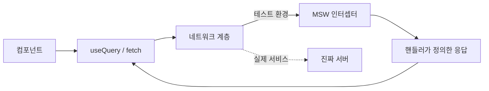

<Callout type="info">
  **이번 문서의 목표:** MSW로 REST API를 네트워크 수준에서 모킹하고, TanStack Query가 붙은 화면과 폼 제출 흐름을 — 로딩·성공·에러·빈 상태 시나리오별로 — 실제 서버 없이 통합 테스트할 수 있게 된다.
</Callout>

## 왜 fetch를 모킹하면 안 되고 "네트워크"를 모킹해야 하는가

08편에서 우리는 "구현이 아니라 사용자 행동을 테스트한다"는 원칙을 세웠습니다. 그런데 서버 상태가 등장하는 순간 이 원칙이 바로 시험대에 오릅니다. 컴포넌트가 API를 호출하는데, 테스트 환경에는 서버가 없으니까요. 전통적인 해법은 이랬습니다.

```js
// ❌ 전통적 방식 — fetch 함수 자체를 가짜로 바꿔치기
jest.spyOn(global, 'fetch').mockResolvedValue({
  ok: true,
  json: async () => [{ id: 1, title: '첫 이슈' }],
});
```

이 방식은 동작은 하지만 세 가지 문제가 있습니다.

1. **구현에 결합됩니다.** 팀이 `fetch`를 `axios`로 바꾸는 순간, 앱 동작은 그대로인데 테스트가 전부 깨집니다. 08편에서 경계한 "구현 세부사항 테스트"의 전형입니다.
2. **응답의 절반만 흉내 냅니다.** 진짜 `fetch` 응답에는 상태코드, 헤더, 직렬화 과정이 있는데 `json` 메서드 하나만 가짜로 만들면 "네트워크를 통과한 데이터"가 아니라 "자바스크립트 객체"를 테스트하게 됩니다. 02편에서 본 HTTP 에러 모델 — `response.ok` 검사, 4xx와 5xx의 구분 — 이 테스트에서 사라집니다.
3. **요청 코드를 검증하지 못합니다.** URL을 잘못 조립했거나, 쿼리 파라미터를 빠뜨렸거나, `POST` 본문을 잘못 만들어도 가짜 fetch는 무조건 성공을 돌려주므로 버그가 통과합니다.

**MSW**(Mock Service Worker, 모의 서비스 워커)는 접근을 뒤집습니다. 함수를 바꿔치기하는 대신, **네트워크 요청 자체를 가로채서** 우리가 정의한 응답을 돌려줍니다. 앱 코드는 자신이 진짜 서버와 대화한다고 믿은 채로 평소처럼 동작합니다.

> **쉽게 말하면:** fetch 모킹은 배우에게 "전화기 들고 통화하는 척해"라고 시키는 것이고, MSW는 진짜 전화기를 주되 **전화국에서 회선을 가로채** 대본대로 응답해 주는 것입니다. 배우(앱 코드)는 아무것도 바꿀 필요가 없습니다.

비유를 하나 더 들면, MSW는 식당의 "모의 주방"입니다. 홀 직원(컴포넌트)은 평소처럼 주문서를 주방에 넣고, 주방(MSW 핸들러)이 미리 정해둔 요리를 내보냅니다. 홀 직원의 주문서 작성법 — 요청 URL, 메서드, 본문 — 까지 전부 실제와 같은 경로로 검증됩니다.



## MSW의 두 얼굴 — 브라우저 워커와 Node 서버

MSW라는 이름의 **서비스 워커**(Service Worker)는 원래 브라우저 기술입니다. 페이지와 네트워크 사이에 끼어들어 요청을 가로챌 수 있는 백그라운드 스크립트죠. 그런데 Jest 테스트는 브라우저가 아니라 **Node.js** 환경에서 돌아갑니다. 그래서 MSW는 같은 핸들러를 두 환경에서 쓸 수 있게 두 가지 실행 방식을 제공합니다.

| 환경 | 사용 함수 | 가로채는 방법 | 주 용도 |
|------|-----------|---------------|---------|
| 브라우저 | `setupWorker` (`msw/browser`) | 진짜 서비스 워커 등록 | 개발 중 목 API, 데모 |
| Node (Jest) | `setupServer` (`msw/node`) | Node의 요청 모듈을 패치 | 테스트 |

핵심은 **핸들러 파일 하나를 두 환경이 공유한다**는 점입니다. 개발할 때 화면에서 보던 목 데이터와 테스트가 검증하는 목 데이터가 같은 파일에서 나오므로, "개발에선 되는데 테스트에선 깨진다"는 어긋남이 사라집니다. 12~13편 미니 프로젝트에서 이 구조를 그대로 씁니다.

### 핸들러 — 요청과 응답의 대본

**핸들러**(handler)는 "이 URL에 이 메서드로 요청이 오면 이렇게 응답하라"는 대본 한 줄입니다. MSW 2.x 기준 문법은 다음과 같습니다.

```js
// src/mocks/handlers.js
import { http, HttpResponse } from 'msw';

export const handlers = [
  // GET /api/issues → 이슈 목록
  http.get('/api/issues', () => {
    return HttpResponse.json([
      { id: 1, title: '로그인 버튼이 안 눌림', status: 'open' },
      { id: 2, title: '다크 모드 색 대비 부족', status: 'closed' },
    ]);
  }),

  // GET /api/issues/:id → 이슈 하나 (URL 파라미터 사용)
  http.get('/api/issues/:id', ({ params }) => {
    return HttpResponse.json({
      id: Number(params.id),
      title: '로그인 버튼이 안 눌림',
      status: 'open',
    });
  }),

  // POST /api/issues → 요청 본문을 읽어 새 이슈 생성
  http.post('/api/issues', async ({ request }) => {
    const newIssue = await request.json();
    return HttpResponse.json(
      { id: 3, ...newIssue },
      { status: 201 }
    );
  }),
];
```

문법 요소를 하나씩 풀면:

- `http.get`, `http.post` — HTTP 메서드별로 대본을 등록합니다. 경로의 `:id` 부분은 **경로 파라미터**로, 콜백의 `params`에서 꺼냅니다.
- `HttpResponse.json` — JSON 본문과 함께 진짜 HTTP 응답 객체를 만듭니다. 두 번째 인자로 상태코드·헤더를 지정할 수 있어서, 02편에서 배운 에러 모델을 그대로 재현할 수 있습니다.
- `request.json` — 클라이언트가 보낸 요청 본문을 읽습니다. **폼이 서버에 무엇을 보냈는지** 검증할 때 이 지점을 씁니다.

<Callout type="warning">
  **버전 주의:** MSW 1.x는 `rest.get(url, (req, res, ctx) => res(ctx.json(...)))` 형태였습니다. 검색하다 나오는 옛 예제와 문법이 완전히 다르므로, 2.x의 `http`·`HttpResponse` 문법인지 먼저 확인하세요. 이 과목은 2.x로 통일합니다.
</Callout>

## 테스트 환경에 MSW 연결하기 — 수명 주기 3단계

Node 테스트에서는 `setupServer`로 가로채기 서버를 만들고, 테스트 수명 주기에 세 개의 훅을 겁니다.

```js
// src/mocks/server.js
import { setupServer } from 'msw/node';
import { handlers } from './handlers';

export const server = setupServer(...handlers);
```

```js
// jest.setup.js — 모든 테스트 파일 전에 실행되는 설정 파일
import '@testing-library/jest-dom';
import { server } from './src/mocks/server';

beforeAll(() => server.listen());        // 1. 전체 테스트 시작 전: 가로채기 시작
afterEach(() => server.resetHandlers()); // 2. 각 테스트 후: 덮어쓴 핸들러 원상 복구
afterAll(() => server.close());          // 3. 전체 테스트 끝: 가로채기 해제
```

세 줄의 의미를 정확히 이해해야 합니다.

1. `server.listen` — 이 시점부터 Node의 모든 HTTP 요청이 MSW를 통과합니다. 핸들러에 없는 요청이 나가면 경고를 띄우도록 `server.listen({ onUnhandledRequest: 'error' })`로 강화하면, "깜빡하고 모킹 안 한 API"를 즉시 잡아냅니다.
2. `server.resetHandlers` — 잠시 뒤 배울 `server.use`로 특정 테스트에서만 응답을 바꿨을 때, 그 변경이 **다음 테스트로 새어 나가지 않게** 매번 기본 대본으로 되돌립니다. 이 줄을 빼먹으면 "혼자 돌리면 통과하는데 전체 돌리면 실패하는" 유령 버그가 생깁니다.
3. `server.close` — 가로채기를 해제해 테스트 프로세스가 깨끗하게 종료되게 합니다.

## TanStack Query가 붙은 컴포넌트 테스트하기

이제 진짜 문제로 갑니다. 03~05편에서 만든 것 같은, `useQuery`로 데이터를 불러오는 컴포넌트를 테스트해 봅시다.

```jsx
// IssueList.jsx — 테스트 대상
import { useQuery } from '@tanstack/react-query';

async function fetchIssues() {
  const res = await fetch('/api/issues');
  if (!res.ok) throw new Error('이슈 목록을 불러오지 못했습니다');
  return res.json();
}

export function IssueList() {
  const { data, isPending, isError } = useQuery({
    queryKey: ['issues'],
    queryFn: fetchIssues,
  });

  if (isPending) return <p role="status">불러오는 중…</p>;
  if (isError) return <p role="alert">이슈 목록을 불러오지 못했습니다</p>;
  if (data.length === 0) return <p>등록된 이슈가 없습니다</p>;

  return (
    <ul>
      {data.map((issue) => (
        <li key={issue.id}>{issue.title}</li>
      ))}
    </ul>
  );
}
```

### 테스트 전용 QueryClient — 두 가지 필수 설정

이 컴포넌트는 `QueryClientProvider` 없이는 렌더링조차 되지 않습니다(03편). 그래서 테스트마다 **새 QueryClient를 만들어 감싸는 래퍼**가 필요한데, 여기에 테스트 환경 특유의 함정 두 개가 숨어 있습니다.

```jsx
// test-utils.jsx — 테스트 전용 렌더 도우미
import { QueryClient, QueryClientProvider } from '@tanstack/react-query';
import { render } from '@testing-library/react';

export function renderWithClient(ui) {
  const queryClient = new QueryClient({
    defaultOptions: {
      queries: {
        retry: false, // 함정 1 해결: 실패 시 재시도 끄기
      },
    },
  });
  return render(
    <QueryClientProvider client={queryClient}>{ui}</QueryClientProvider>
  );
}
```

- **함정 1 — 재시도**(retry): TanStack Query는 쿼리가 실패하면 기본적으로 3번, 지수적으로 간격을 늘려가며 재시도합니다(04편). 서비스에서는 미덕이지만 테스트에서는 재앙입니다 — 에러 상태를 검증하려는 테스트가 재시도 시간을 전부 기다리다 **타임아웃으로 실패**합니다. 반드시 `retry: false`로 끕니다.
- **함정 2 — 캐시 공유**: QueryClient를 파일 상단에 하나 만들어 모든 테스트가 공유하면, 첫 테스트가 채운 캐시를 두 번째 테스트가 물려받습니다. 두 번째 테스트는 로딩 상태를 건너뛰고 캐시된 데이터를 즉시 보여주므로, 검증 결과가 **테스트 실행 순서에 따라 달라집니다**. 03편에서 배웠듯 캐시는 QueryClient 인스턴스에 소속되므로, **테스트마다 새 인스턴스**를 만들면 캐시가 격리됩니다.

### 성공 시나리오 — findBy로 비동기 전환 기다리기

```jsx
// IssueList.test.jsx
import { screen } from '@testing-library/react';
import { renderWithClient } from './test-utils';
import { IssueList } from './IssueList';

test('이슈 목록을 불러와 화면에 보여준다', async () => {
  renderWithClient(<IssueList />);

  // 1. 처음엔 로딩 상태
  expect(screen.getByRole('status')).toHaveTextContent('불러오는 중');

  // 2. 데이터 도착을 기다렸다가 검증 — findBy는 나타날 때까지 기다린다
  expect(
    await screen.findByText('로그인 버튼이 안 눌림')
  ).toBeInTheDocument();
  expect(screen.getByText('다크 모드 색 대비 부족')).toBeInTheDocument();

  // 3. 로딩 표시는 사라졌다
  expect(screen.queryByRole('status')).not.toBeInTheDocument();
});
```

08편에서 배운 세 쿼리 계열이 여기서 각자 제 역할을 합니다 — 지금 있어야 하는 것은 `getBy`, **나중에 나타날 것은** `findBy`, 없어야 하는 것은 `queryBy`. MSW의 응답은 실제 네트워크처럼 **비동기**로 도착하므로, 데이터 검증은 반드시 `findBy` 또는 `waitFor`로 기다려야 합니다. 이 테스트가 통과하면 "요청 URL 조립 → 네트워크 → 응답 파싱 → 캐시 저장 → 리렌더링"의 전 구간이 한 번에 검증된 것입니다. 이것이 **통합 테스트**(integration test)의 힘입니다.

## 시나리오별 응답 바꾸기 — server.use

성공 케이스만 테스트하면 절반입니다. 02편에서 정리했듯 화면에는 로딩·성공·에러·빈 상태의 네 얼굴이 있고, 사용자 불만은 대부분 나머지 세 얼굴에서 나옵니다. `server.use`는 **지금 이 테스트에서만** 핸들러를 덮어쓰는 도구입니다.

```jsx
import { http, HttpResponse } from 'msw';
import { server } from './mocks/server';

test('서버가 500을 돌려주면 에러 메시지를 보여준다', async () => {
  // 이 테스트에서만 /api/issues가 500을 반환하도록 덮어쓴다
  server.use(
    http.get('/api/issues', () => {
      return HttpResponse.json(
        { message: '서버 내부 오류' },
        { status: 500 }
      );
    })
  );

  renderWithClient(<IssueList />);

  expect(
    await screen.findByRole('alert')
  ).toHaveTextContent('이슈 목록을 불러오지 못했습니다');
});

test('이슈가 하나도 없으면 빈 상태 안내를 보여준다', async () => {
  server.use(
    http.get('/api/issues', () => HttpResponse.json([]))
  );

  renderWithClient(<IssueList />);

  expect(
    await screen.findByText('등록된 이슈가 없습니다')
  ).toBeInTheDocument();
});
```

`server.use`로 등록한 대본은 기본 핸들러보다 우선하고, `afterEach`의 `resetHandlers`가 매 테스트 후 지워줍니다. 그래서 **기본 핸들러는 성공 응답**으로 두고, **예외 상황은 각 테스트 안에서 덮어쓰는** 구조가 표준입니다.

> **쉽게 말하면:** 기본 핸들러는 극단의 정규 대본이고, `server.use`는 오늘 공연에만 쓰는 특별 대본입니다. 공연이 끝나면(`resetHandlers`) 특별 대본은 폐기됩니다.

시나리오를 표로 설계해 두면 빠뜨림이 없습니다.

| 시나리오 | MSW 응답 | 사용자가 보는 것 | 검증 쿼리 |
|----------|----------|------------------|-----------|
| 로딩 | 응답 지연 중 | 스피너·스켈레톤 | `getByRole` status |
| 성공 | 200 + 데이터 배열 | 목록 | `findByText` |
| 빈 상태 | 200 + 빈 배열 | 안내 문구 | `findByText` |
| 서버 에러 | 500 | 에러 메시지·재시도 버튼 | `findByRole` alert |
| 찾을 수 없음 | 404 | 없음 안내 | `findByRole` alert |

빈 상태를 200 + 빈 배열로 정의한 것은 02편에서 세운 기준 — "결과가 없는 것"은 정상 응답이고, 404는 "자원 자체가 없는 것" — 을 그대로 반영한 것입니다.

## 폼 제출을 통합 테스트하기 — 요청 본문까지 검증

06~07편에서 만든 폼의 핵심 가치는 "제출하면 서버에 올바른 데이터가 가고, 서버 에러가 올바른 필드에 표시된다"입니다. 이 두 가지를 MSW로 검증합니다. 테스트 대상은 react-hook-form + Zod로 만든 이슈 생성 폼이라고 합시다(폼 자체의 구현은 06~07편 그대로이므로 재설명하지 않습니다).

### 시나리오 1 — 제출 성공: 서버에 도착한 본문 확인

```jsx
import userEvent from '@testing-library/user-event';

test('폼을 채워 제출하면 입력값이 서버로 전송된다', async () => {
  const user = userEvent.setup();
  let receivedBody = null; // 서버에 도착한 본문을 담아둘 변수

  server.use(
    http.post('/api/issues', async ({ request }) => {
      receivedBody = await request.json(); // 요청 본문 가로채기
      return HttpResponse.json({ id: 10, ...receivedBody }, { status: 201 });
    })
  );

  renderWithClient(<IssueCreateForm />);

  await user.type(screen.getByLabelText('제목'), '검색이 느립니다');
  await user.type(screen.getByLabelText('설명'), '결과가 5초 뒤에 나옵니다');
  await user.click(screen.getByRole('button', { name: '등록' }));

  // 사용자 관점 검증: 성공 안내가 보인다
  expect(await screen.findByText('이슈가 등록되었습니다')).toBeInTheDocument();

  // 계약 검증: 서버가 받은 본문이 입력값과 일치한다
  expect(receivedBody).toEqual({
    title: '검색이 느립니다',
    description: '결과가 5초 뒤에 나옵니다',
  });
});
```

`receivedBody` 검증이 이 테스트의 백미입니다. fetch 모킹으로는 흉내 낼 수 없는, **클라이언트와 서버 사이의 계약** — "폼 필드 이름이 API 필드 이름과 맞는가, 값이 가공 없이 전달되는가" — 을 네트워크를 통과한 실물로 확인합니다.

### 시나리오 2 — 서버 필드 에러: 화면의 올바른 자리에 표시되는가

07편에서 설계한 "서버 응답의 필드 에러를 `setError`로 해당 필드에 매핑"하는 흐름을 검증합니다.

```jsx
test('서버가 필드 에러를 돌려주면 해당 필드 옆에 표시된다', async () => {
  const user = userEvent.setup();

  server.use(
    http.post('/api/issues', () => {
      return HttpResponse.json(
        {
          message: '입력값이 올바르지 않습니다',
          errors: { title: '같은 제목의 이슈가 이미 있습니다' },
        },
        { status: 422 }
      );
    })
  );

  renderWithClient(<IssueCreateForm />);

  await user.type(screen.getByLabelText('제목'), '로그인 버튼이 안 눌림');
  await user.type(screen.getByLabelText('설명'), '중복 등록 시도');
  await user.click(screen.getByRole('button', { name: '등록' }));

  // 에러 메시지가 role=alert로 나타나고, 제목 입력이 에러로 표시된다
  expect(
    await screen.findByText('같은 제목의 이슈가 이미 있습니다')
  ).toBeInTheDocument();
  expect(screen.getByLabelText('제목')).toHaveAttribute('aria-invalid', 'true');
});
```

이 테스트는 07편의 접근성 설계 — `aria-invalid`, 에러 메시지 연결 — 까지 함께 고정합니다. 접근성 속성을 검증 수단으로 쓰면, 테스트가 통과한다는 사실 자체가 "스크린 리더 사용자도 에러를 인지할 수 있다"는 보증이 됩니다. 테스트와 접근성이 서로를 강화하는 선순환입니다.

## 무엇을 모킹하지 않을 것인가 — 통합 테스트의 경계

MSW를 배우면 모든 것을 모킹하고 싶어지는데, 08편의 경계 원칙을 다시 적용해야 합니다.

- **모킹하는 것: 네트워크 바깥.** 서버는 내 코드가 아니므로 대본으로 대체합니다.
- **모킹하지 않는 것: 네트워크 안쪽 전부.** TanStack Query, react-hook-form, fetch 래퍼, 내 컴포넌트 — 이들은 실물 그대로 함께 돌립니다. 이 조합이 실제로 맞물려 도는지가 바로 검증하려는 대상이기 때문입니다.

자주 보이는 안티패턴이 `useQuery` 훅 자체를 `jest.mock`으로 바꿔치기하는 것입니다. 그러면 테스트는 "컴포넌트가 useQuery의 반환값을 화면에 그린다"만 확인할 뿐, queryKey 오타·queryFn의 URL 실수·에러 throw 누락 같은 실전 버그를 전부 놓칩니다. 게다가 TanStack Query의 반환 구조가 바뀌면(예: v4의 `isLoading`이 v5에서 `isPending`으로) 테스트만 우수수 깨집니다. **훅을 모킹하지 말고 네트워크를 모킹하세요.**

<Callout type="warning">
  **자주 틀리는 점 모음:**
  1. `retry: false`를 빼먹어 에러 테스트가 타임아웃으로 실패 — 실패 원인이 에러 처리 버그인지 재시도 대기인지 구분이 안 돼 디버깅 시간을 태웁니다.
  2. QueryClient를 테스트 간에 공유해 캐시가 새어 나감 — 실행 순서에 따라 통과·실패가 뒤바뀝니다.
  3. 비동기 데이터를 `getBy`로 즉시 조회 — 아직 로딩 중이라 "요소 없음" 에러. `findBy`로 기다려야 합니다.
  4. `server.resetHandlers` 누락 — 앞 테스트의 `server.use` 덮어쓰기가 뒤 테스트를 오염시킵니다.
</Callout>

## 핵심 정리

- MSW는 fetch 함수가 아니라 **네트워크 요청 자체를 가로채는** 모킹 도구다. 앱 코드는 한 줄도 바꾸지 않고, 요청 조립부터 응답 파싱까지 전 구간이 실물로 검증된다.
- 핸들러 파일 하나를 브라우저 개발용 `setupWorker`와 테스트용 `setupServer`가 공유한다 — 개발과 테스트의 목 데이터가 어긋나지 않는다.
- 테스트마다 **새 QueryClient**를 만들고 `retry: false`를 설정한다. 캐시 격리와 타임아웃 방지, 두 함정을 막는 필수 설정이다.
- 기본 핸들러는 성공 응답으로 두고, 에러·빈 상태는 각 테스트 안에서 `server.use`로 덮어쓴다. `afterEach`의 `resetHandlers`가 격리를 보장한다.
- 폼 테스트는 두 방향을 검증한다 — 나가는 방향(요청 본문이 입력값과 일치)과 들어오는 방향(서버 필드 에러가 올바른 필드에 접근성 있게 표시).
- 훅·라이브러리를 모킹하지 말고 네트워크만 모킹한다 — 통합의 실체가 테스트 대상이다.

## 마무리 복습

<Quiz
  questionNumber={1}
  question="fetch 함수를 jest로 직접 모킹하는 방식 대신 MSW를 쓰는 가장 본질적인 이유는?"
  options={['MSW가 테스트 실행 속도를 항상 높여주기 때문', '네트워크 수준에서 가로채므로 요청 조립부터 응답 파싱까지 실제 경로 그대로 검증되기 때문', 'MSW를 쓰면 QueryClient 설정이 필요 없어지기 때문', 'fetch 모킹은 최신 Jest에서 금지되었기 때문']}
  correctAnswer={2}
  explanation="MSW는 앱 코드가 실제로 보내는 요청을 네트워크 계층에서 가로채므로, URL 조립·메서드·본문·상태코드 처리 등 전 구간이 실물로 검증된다. fetch 모킹은 구현에 결합되고 요청 검증을 건너뛴다."
  optionExplanations={['속도는 본질이 아니며 큰 차이도 없다', '정답 — 구현이 아닌 네트워크 경계를 모킹하는 것이 핵심 철학이다', 'QueryClient 래퍼는 여전히 필요하다', 'fetch 모킹이 금지된 사실은 없다 — 권장되지 않을 뿐이다']}
/>

<Quiz
  questionNumber={2}
  question="Jest 테스트 환경에서 MSW를 구동할 때 사용하는 함수는?"
  options={['msw/browser의 setupWorker', 'msw/node의 setupServer', 'jest.mock 함수', 'window.navigator.serviceWorker 등록']}
  correctAnswer={2}
  explanation="Jest는 Node 환경에서 실행되므로 서비스 워커를 쓸 수 없고, Node의 요청 모듈을 패치하는 setupServer를 사용한다. setupWorker는 브라우저 개발 환경용이다."
  optionExplanations={['setupWorker는 진짜 브라우저에서 서비스 워커를 등록하는 개발용이다', '정답 — Node 환경 전용 구동 방식이다', 'jest.mock은 모듈 바꿔치기로, MSW의 방식과 정반대다', 'Node 환경에는 서비스 워커 API 자체가 없다']}
/>

<Quiz
  questionNumber={3}
  question="테스트용 QueryClient에 retry를 false로 설정하는 이유는?"
  options={['재시도 기능이 테스트 환경에서 메모리 누수를 일으키기 때문', '쿼리 실패 시 기본 3회 재시도를 기다리다 에러 상태 검증 테스트가 타임아웃되기 때문', 'retry가 true면 MSW 핸들러가 등록되지 않기 때문', '재시도가 캐시를 자동으로 비워버리기 때문']}
  correctAnswer={2}
  explanation="TanStack Query는 실패한 쿼리를 기본 3회, 점점 긴 간격으로 재시도한다. 테스트에서 에러 상태를 검증하려면 이 대기를 전부 기다려야 해 타임아웃으로 실패하므로 재시도를 꺼야 한다."
  optionExplanations={['메모리 누수와는 무관하다', '정답 — 서비스의 미덕이 테스트의 재앙이 되는 대표 사례다', 'MSW 핸들러 등록과 retry 설정은 서로 독립적이다', '재시도는 캐시를 비우지 않는다']}
/>

<Quiz
  questionNumber={4}
  question="QueryClient를 모든 테스트가 하나로 공유하면 생기는 문제는?"
  options={['빌드가 실패한다', '앞 테스트가 채운 캐시를 뒤 테스트가 물려받아 실행 순서에 따라 결과가 달라진다', 'MSW 핸들러가 중복 등록된다', 'userEvent가 동작하지 않는다']}
  correctAnswer={2}
  explanation="캐시는 QueryClient 인스턴스에 소속되므로, 인스턴스를 공유하면 뒤 테스트가 로딩 상태를 건너뛰고 캐시 데이터를 바로 보여줄 수 있다. 테스트마다 새 인스턴스를 만들어 캐시를 격리해야 한다."
  optionExplanations={['빌드 문제는 아니다 — 런타임에 조용히 결과가 오염되는 것이 더 무섭다', '정답 — 테스트 격리 원칙이 캐시에도 적용된다', '핸들러 등록은 server 객체의 일이며 QueryClient와 무관하다', 'userEvent는 QueryClient와 무관하게 동작한다']}
/>

<Quiz
  questionNumber={5}
  question="특정 테스트에서만 API가 500 에러를 돌려주게 만드는 표준 방법은?"
  options={['핸들러 파일의 기본 응답을 500으로 바꾼다', '해당 테스트 안에서 server.use로 핸들러를 덮어쓰고 afterEach의 resetHandlers로 복구되게 한다', '컴포넌트에 테스트 전용 에러 prop을 추가한다', 'fetch를 jest.spyOn으로 다시 모킹한다']}
  correctAnswer={2}
  explanation="기본 핸들러는 성공 응답으로 두고, 예외 시나리오는 각 테스트에서 server.use로 덮어쓴다. resetHandlers가 매 테스트 후 기본 대본으로 되돌려 테스트 간 격리를 보장한다."
  optionExplanations={['기본을 500으로 바꾸면 성공 시나리오 테스트가 전부 깨진다', '정답 — 덮어쓰기와 자동 복구의 조합이 표준 패턴이다', '테스트를 위해 제품 코드를 오염시키는 안티패턴이다', 'MSW를 쓰는 의미를 없애는 역행이다']}
/>

<Quiz
  questionNumber={6}
  question="MSW로 응답하는 데이터가 화면에 나타났는지 검증할 때 findByText를 쓰는 이유는?"
  options={['findBy가 getBy보다 문법이 짧기 때문', 'MSW 응답은 비동기로 도착하므로 요소가 나타날 때까지 기다리는 쿼리가 필요하기 때문', 'getBy는 텍스트 검색을 지원하지 않기 때문', 'findBy만 한글 텍스트를 찾을 수 있기 때문']}
  correctAnswer={2}
  explanation="MSW 응답도 실제 네트워크처럼 비동기다. 렌더 직후에는 아직 로딩 중이므로 getBy는 요소 없음으로 실패하고, 나타날 때까지 기다렸다가 반환하는 findBy를 써야 한다."
  optionExplanations={['문법 길이 문제가 아니라 동작 방식의 차이다', '정답 — 지금 있어야 하면 getBy, 나중에 나타나면 findBy', 'getByText도 텍스트 검색을 지원한다', '쿼리의 언어 지원에는 차이가 없다']}
/>

<Quiz
  questionNumber={7}
  question="폼 제출 테스트에서 MSW 핸들러 안의 request.json 호출로 확인하는 것은?"
  options={['폼 컴포넌트의 내부 상태 변수', '클라이언트가 실제로 서버에 보낸 요청 본문이 입력값과 일치하는지', 'Zod 스키마의 내부 구현', '서버 데이터베이스의 저장 결과']}
  correctAnswer={2}
  explanation="핸들러의 request.json으로 네트워크를 통과해 도착한 요청 본문을 꺼내 검증하면, 폼 필드와 API 필드의 이름·값이 맞는지 — 클라이언트와 서버 사이의 계약 — 를 실물로 확인할 수 있다."
  optionExplanations={['내부 상태는 구현 세부사항이라 검증 대상이 아니다', '정답 — fetch 모킹으로는 불가능한 나가는 방향의 계약 검증이다', '라이브러리 내부는 테스트 경계 밖이다', '진짜 서버가 없으므로 저장 결과는 존재하지 않는다']}
/>

<Quiz
  questionNumber={8}
  question="useQuery 훅 자체를 jest.mock으로 바꿔치기하는 방식의 문제점은?"
  options={['테스트 실행이 느려진다', 'queryKey 오타나 queryFn의 URL 실수 같은 실전 버그를 놓치고, 라이브러리 반환 구조가 바뀌면 테스트만 깨진다', 'MSW와 함께 쓰면 빌드 에러가 난다', 'React 18 이상에서 동작하지 않는다']}
  correctAnswer={2}
  explanation="훅을 모킹하면 컴포넌트가 반환값을 그리는지만 확인할 뿐 데이터 흐름의 실제 맞물림을 검증하지 못하고, 구현 세부사항에 결합돼 라이브러리 버전 변화에 취약해진다. 네트워크만 모킹해야 한다."
  optionExplanations={['속도가 핵심 문제가 아니다', '정답 — 통합의 실체를 검증하지 못하는 것이 치명적이다', '빌드 에러가 나지는 않는다 — 조용히 가치 없는 테스트가 될 뿐이다', 'React 버전과는 무관하다']}
/>

## 참고 자료

- [MSW 공식 문서 - Getting Started](https://mswjs.io/docs/getting-started)
- [React Testing Library 공식 문서 - Example (MSW 통합 예제)](https://testing-library.com/docs/react-testing-library/example-intro/)
- [TanStack Query 공식 문서 - Testing](https://tanstack.com/query/v5/docs/framework/react/guides/testing)
- [Jest 공식 문서 - Getting Started](https://jestjs.io/docs/getting-started)
