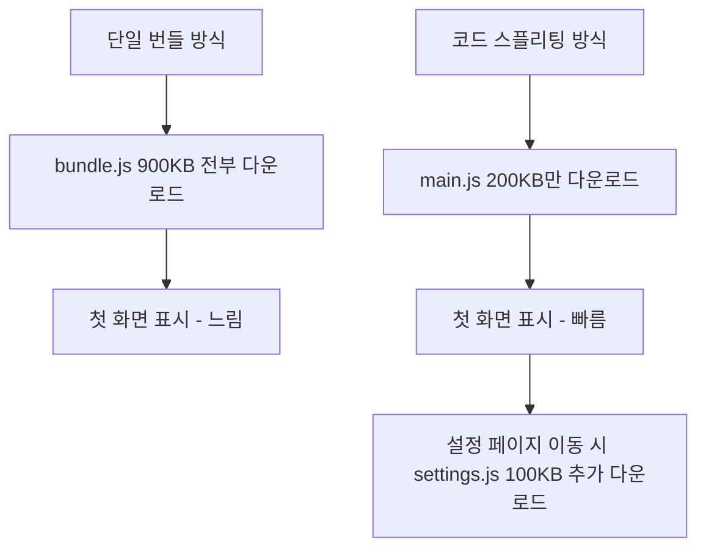
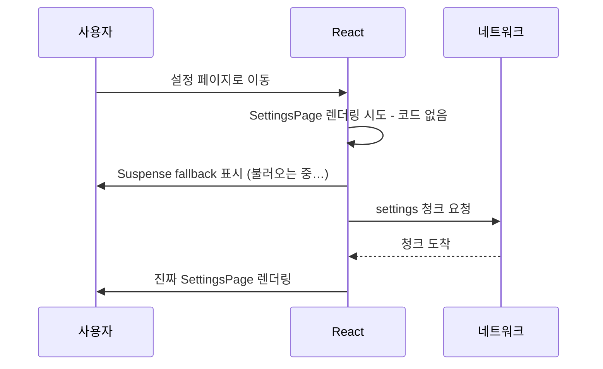

<Callout type="info">
  **이번 문서의 목표:** 앱을 라우트 단위로 쪼개 첫 화면을 가볍게 만들고, Vite가 만들어내는 빌드 결과물을 읽을 줄 알며, 환경 변수로 개발·스테이징·프로덕션 세 환경을 안전하게 구분할 수 있게 된다.
</Callout>

## 왜 번들을 나눠야 하는가 — 문제는 첫 화면이다

지금까지 우리는 서버 상태(03–05편), 폼(06–07편), 테스트(08–09편)를 다뤘습니다. 기능은 완성됐는데, 이제 다른 종류의 문제가 등장합니다. **앱이 커질수록 사용자가 첫 화면을 보기까지 걸리는 시간이 길어진다**는 문제입니다.

React SPA(Single Page Application, 단일 페이지 애플리케이션)는 기본적으로 이렇게 동작합니다.

1. 브라우저가 거의 빈 `index.html`을 받는다.
2. 그 안에 링크된 **자바스크립트 번들**(bundle)을 내려받는다.
3. 번들이 실행되어 React가 화면을 그린다.

여기서 **번들**이란, 우리가 작성한 수십~수백 개의 소스 파일과 `node_modules`의 라이브러리들을 **배포용으로 하나**(또는 몇 개)**로 합쳐 놓은 자바스크립트 파일**입니다. 브라우저가 파일 수백 개를 각각 요청하면 네트워크 왕복이 너무 많아지니, 빌드 도구가 미리 묶어 두는 것이죠. Vite는 프로덕션 빌드 때 내부적으로 **Rollup**(롤업)이라는 번들러(bundler, 묶는 도구)를 사용합니다.

문제는 이 "묶기"가 기본값으로는 **전부 다 묶는다**는 점입니다. 사용자가 접속하자마자 보는 것은 목록 페이지 하나인데, 번들 안에는 관리자 페이지, 통계 차트 라이브러리, 설정 화면까지 전부 들어 있습니다. 사용자는 **지금 안 쓰는 코드를 내려받고 파싱하느라** 흰 화면을 보고 기다립니다.

> **쉽게 말하면:** 코드 스플리팅은 이사할 때 짐을 방별로 나눠 포장하는 것입니다. 기본 번들링은 집안 살림 전체를 컨테이너 하나에 욱여넣는 방식이라, 첫날 밤 이불 하나 꺼내려 해도 컨테이너 전체를 내려야 합니다. 방별로 나눠 두면 오늘 쓸 상자만 먼저 내리면 됩니다.

**코드 스플리팅**(code splitting, 코드 분할)은 번들을 여러 조각(chunk, 청크)으로 나누고, 각 조각을 **실제로 필요해지는 순간에** 내려받게 하는 기법입니다. 사용자 입장에서는 첫 화면이 빨라지고, 안 가는 페이지의 코드는 영영 내려받지 않게 됩니다.



## 분할의 엔진 — 동적 import

코드 스플리팅의 밑바닥에는 자바스크립트 문법 하나가 있습니다. 바로 **동적 import**(dynamic import)입니다.

```js
// 정적 import — 파일 맨 위에, 항상 함께 묶인다
import { drawChart } from './chart';

// 동적 import — 함수처럼 호출, 이 지점이 "분할선"이 된다
const module = await import('./chart');
module.drawChart();
```

두 문장의 차이는 문법이 아니라 **번들러에게 보내는 신호**에 있습니다.

- **정적 import**는 "이 파일은 처음부터 반드시 필요하다"는 선언입니다. 번들러는 이 파일을 같은 청크에 묶습니다.
- **동적 import**는 "이 파일은 나중에 필요할 수도 있다"는 선언입니다. 번들러는 이 지점에서 파일을 **별도 청크로 분리**하고, `import()` 호출이 실행되는 순간 네트워크로 그 청크를 내려받는 코드로 바꿔치기합니다.

`import()`가 **Promise**(프로미스)를 반환한다는 점이 핵심입니다. 네트워크 다운로드는 시간이 걸리는 비동기 작업이니까요. "코드 조각이 도착할 때까지 기다린다"는 비동기 문제가 생겼고, React는 이 문제를 컴포넌트 세계의 방식으로 풀어야 합니다. 그 답이 `React.lazy`와 `Suspense`입니다.

## React.lazy와 Suspense — 컴포넌트를 게으르게 불러오기

**React.lazy**는 "이 컴포넌트는 실제로 렌더링될 때 코드를 내려받아라"라고 선언하는 함수입니다. 여기서 lazy는 게으르다는 뜻 그대로, **필요해질 때까지 일을 미루는**(lazy loading, 지연 로딩) 전략을 가리킵니다.

```jsx
import { lazy, Suspense } from 'react';

// ❌ 정적 import — SettingsPage 코드가 첫 번들에 포함된다
// import SettingsPage from './pages/SettingsPage';

// ✅ 동적 import를 lazy로 감싼다 — 별도 청크로 분리된다
const SettingsPage = lazy(() => import('./pages/SettingsPage'));

function App() {
  return (
    <Suspense fallback={<p>페이지를 불러오는 중…</p>}>
      <SettingsPage />
    </Suspense>
  );
}
```

문법 요소를 하나씩 풀면:

- `lazy(() => import('./pages/SettingsPage'))` — `lazy`는 **동적 import를 반환하는 함수**를 인자로 받습니다. `import()` 자체를 바로 넘기는 게 아니라 화살표 함수로 감싸는 이유는, 감싸지 않으면 이 줄이 평가되는 순간 즉시 다운로드가 시작되어 "게으름"이 사라지기 때문입니다.
- `Suspense`(서스펜스) — 영어로 "미결·긴장 상태"라는 뜻입니다. 감싼 자식 컴포넌트의 코드가 **아직 도착하지 않은 동안** 대신 보여줄 UI를 `fallback`(폴백, 대체물) prop으로 받습니다. 코드가 도착하면 자동으로 진짜 컴포넌트로 교체됩니다.

동작 순서를 시간 축으로 보면 이렇습니다.



### lazy의 세 가지 함정

**함정 1 — default export만 지원합니다.** `React.lazy`는 모듈의 `default` export를 컴포넌트로 사용합니다. named export만 있는 파일을 lazy로 불러오면 렌더링 시점에 에러가 납니다.

```jsx
// SettingsPage.jsx
export default function SettingsPage() { /* … */ }  // ✅ 이렇게

// named export만 있다면 중간에서 변환해 준다
const SettingsPage = lazy(() =>
  import('./pages/SettingsPage').then((module) => ({
    default: module.SettingsPage,
  }))
);
```

**함정 2 — lazy 선언을 컴포넌트 안에 쓰면 안 됩니다.** 컴포넌트 함수 안에서 `lazy`를 호출하면 **리렌더링마다 새로운 lazy 컴포넌트가 만들어져**, React가 이전 것과 다른 컴포넌트로 판단하고 상태를 버린 채 처음부터 다시 마운트합니다. lazy 선언은 반드시 **모듈 최상위**(파일의 바깥 레벨)에 둡니다.

**함정 3 — 다운로드는 실패할 수 있습니다.** 청크 다운로드는 네트워크 요청이므로, 오프라인이거나 배포 직후 옛 청크가 사라진 경우 실패합니다. 이 실패는 렌더링 중 던져지는 에러이므로 **에러 바운더리**(Error Boundary, 렌더링 에러를 잡아 대체 UI를 보여주는 컴포넌트)로 감싸 "새로고침해 주세요" 같은 안내를 보여줘야 합니다. 에러 바운더리 자체는 선행 과목에서 다룬 개념이므로 여기서는 "Suspense 바깥을 한 겹 감싼다"는 배치만 기억하면 됩니다.

### Suspense fallback의 UX — 어디에 몇 개를 둘 것인가

`Suspense`는 여러 lazy 컴포넌트를 한꺼번에 감쌀 수도, 각각 감쌀 수도 있습니다. 이것은 기술 선택이 아니라 **UX 설계** 문제입니다.

| 배치 | 동작 | 어울리는 경우 |
|------|------|---------------|
| 앱 전체를 하나로 감싸기 | 어느 페이지든 로딩 중엔 전체 화면 폴백 | 페이지 단위 전환, 공통 로딩 화면 |
| 영역별로 나눠 감싸기 | 준비된 영역부터 순서대로 표시 | 대시보드처럼 위젯이 독립적인 화면 |
| 너무 잘게 감싸기 | 화면 곳곳이 따로따로 깜빡임 | 피해야 할 안티패턴 |

폴백이 아주 잠깐(수십 밀리초) 나타났다 사라지면 오히려 화면이 **깜빡이는** 느낌을 줍니다. 청크가 작아 다운로드가 빠른 환경에서 흔한 현상인데, 스켈레톤 UI를 실제 콘텐츠와 같은 크기로 만들어 배치 이동(layout shift, 요소가 갑자기 밀리는 현상)을 줄이는 것이 실무의 처방입니다.

아래 플레이그라운드에서 지연 로딩의 체감을 확인해 보세요. 실제 네트워크 대신 타이머로 "청크 다운로드 2초"를 흉내 낸 순수 React 예제입니다.

<CodePlayground
  template="react"
  activeFile="/App.js"
  label="lazy + Suspense 동작 체험 — 버튼을 눌러야 무거운 컴포넌트 코드를 불러온다"
  files={{
    '/HeavyChart.js': `export default function HeavyChart() {
  return (
    <div style={{ padding: 16, border: '2px solid teal', borderRadius: 8 }}>
      <strong>무거운 차트 컴포넌트</strong>
      <p>이 코드는 버튼을 누른 뒤에야 로드되었습니다.</p>
    </div>
  );
}`,
    '/App.js': `import { lazy, Suspense, useState } from 'react';

// 실제 청크 다운로드처럼 2초 지연을 흉내 낸다
const HeavyChart = lazy(() =>
  new Promise((resolve) => setTimeout(resolve, 2000)).then(() =>
    import('./HeavyChart')
  )
);

export default function App() {
  const [열림, set열림] = useState(false);

  return (
    <div style={{ fontFamily: 'sans-serif', padding: 16 }}>
      <button onClick={() => set열림(true)}>차트 열기</button>
      {열림 && (
        <Suspense fallback={<p>차트 코드를 내려받는 중…</p>}>
          <HeavyChart />
        </Suspense>
      )}
    </div>
  );
}`,
  }}
/>

버튼을 누르기 전에는 `HeavyChart`의 코드가 전혀 실행되지 않습니다. 누른 순간 폴백이 2초간 보이고, "다운로드"가 끝나면 진짜 컴포넌트로 교체됩니다. `setTimeout`의 시간을 바꿔 보면 폴백 깜빡임 문제도 체감할 수 있습니다.

## 라우트 단위 분할 — 실무의 기본 단위

컴포넌트를 하나하나 lazy로 만드는 것은 과합니다. 실무의 표준은 **라우트**(route, 경로) 단위 분할입니다. 사용자는 어차피 페이지 단위로 이동하고, 페이지 전환은 원래 "잠깐 기다림"이 자연스러운 순간이라 폴백 UI가 어색하지 않기 때문입니다.

React Router 기준으로 이렇게 구성합니다(라우팅 자체는 선행 과목 범위이므로 배치 패턴만 봅니다).

```jsx
import { lazy, Suspense } from 'react';
import { BrowserRouter, Routes, Route } from 'react-router-dom';

// 각 페이지가 별도 청크가 된다
const IssueListPage = lazy(() => import('./pages/IssueListPage'));
const IssueDetailPage = lazy(() => import('./pages/IssueDetailPage'));
const SettingsPage = lazy(() => import('./pages/SettingsPage'));

export default function App() {
  return (
    <BrowserRouter>
      <Suspense fallback={<div className="page-loading">불러오는 중…</div>}>
        <Routes>
          <Route path="/" element={<IssueListPage />} />
          <Route path="/issues/:id" element={<IssueDetailPage />} />
          <Route path="/settings" element={<SettingsPage />} />
        </Routes>
      </Suspense>
    </BrowserRouter>
  );
}
```

이 구조에서 첫 진입 시 내려받는 것은 "라우터 + 공통 레이아웃 + 첫 페이지 청크"뿐입니다. 상세 페이지 청크는 상세로 이동할 때, 설정 청크는 설정에 갈 때 도착합니다. 12–13편 미니 프로젝트에서 이 패턴을 그대로 적용합니다.

분할 기준을 정리하면:

- **라우트 단위** — 기본값. 거의 항상 이득입니다.
- **조건부로만 열리는 무거운 UI** — 모달 속 차트, 마크다운 에디터, 지도처럼 "열어야 보이는" 무거운 라이브러리는 컴포넌트 단위 lazy가 이득입니다.
- **첫 화면에 항상 보이는 것** — 분할하면 오히려 손해입니다. 요청이 하나 늘고 폴백 깜빡임만 생깁니다.

## Vite 빌드 아웃풋 읽기 — dist 폴더의 해부

이제 분할의 결과물을 눈으로 확인할 차례입니다. Vite에서 프로덕션 빌드를 실행하면:

```bash
npm run build   # 내부적으로 vite build 실행
```

`dist/` 폴더에 결과물이 생기고, 터미널에 이런 요약이 출력됩니다.

```text
dist/index.html                            0.46 kB
dist/assets/index-BQx3mA7f.css            12.30 kB │ gzip:  3.10 kB
dist/assets/index-D2xTkV9c.js            210.44 kB │ gzip: 68.21 kB
dist/assets/IssueDetailPage-Cq1z8sPj.js   34.02 kB │ gzip:  9.87 kB
dist/assets/SettingsPage-Bv7Hn2Lk.js      18.55 kB │ gzip:  5.42 kB
```

읽는 법을 하나씩 풀면:

- **`index-D2xTkV9c.js`** — 진입점(entry) 청크입니다. React 본체, 라우터, 공통 코드가 들어 있습니다. 파일명 가운데의 `D2xTkV9c` 같은 문자열이 **콘텐츠 해시**(content hash)입니다. 파일 **내용**으로 계산한 지문이라, 내용이 한 글자라도 바뀌면 해시가 바뀌고, 안 바뀌면 그대로입니다.
- **`IssueDetailPage-….js`** — 우리가 `lazy`로 만든 분할선이 실제 파일로 나타난 것입니다. lazy 선언 하나가 청크 파일 하나로 이어지는 이 대응을 확인하는 습관이 중요합니다.
- **gzip 칼럼** — 서버가 압축해 전송할 때의 실제 전송량입니다. 사용자 체감에 가까운 숫자는 이쪽입니다.

### 해시가 캐싱을 가능하게 한다

콘텐츠 해시는 장식이 아니라 **캐싱 전략의 기둥**입니다. 브라우저 캐시(cache, 한 번 받은 파일을 저장해 재사용하는 저장소)에 "이 파일은 1년간 다시 묻지 말고 써라"라고 지시해도 안전한 이유가 해시 덕분입니다 — 내용이 바뀌면 **파일명 자체가 바뀌므로** 브라우저 입장에서는 새 파일을 처음 요청하는 것이 되고, 옛 캐시와 충돌할 일이 없습니다. 이 전략이 배포와 만나는 지점(어떤 파일은 캐시하고 어떤 파일은 하면 안 되는지)은 11편에서 다룹니다.

### 번들 분석 — 무엇이 큰지 눈으로 보기

빌드 요약의 숫자가 예상보다 크다면, **무엇이 그 자리를 차지하는지** 시각적으로 확인해야 합니다. `rollup-plugin-visualizer`가 표준 도구입니다.

```bash
npm install --save-dev rollup-plugin-visualizer
```

```js
// vite.config.js
import { defineConfig } from 'vite';
import react from '@vitejs/plugin-react';
import { visualizer } from 'rollup-plugin-visualizer';

export default defineConfig({
  plugins: [
    react(),
    visualizer({ open: true, gzipSize: true }),
  ],
});
```

빌드하면 청크별 구성이 **트리맵**(treemap, 면적이 크기를 나타내는 사각형 지도)으로 열립니다. 여기서 내리는 실무적 판단은 대체로 세 가지입니다.

1. **예상 밖의 거인 찾기** — 날짜 라이브러리 전체, 아이콘 팩 전체가 통째로 들어와 있는 경우가 흔합니다. 필요한 함수만 import하도록 고칩니다.
2. **중복 찾기** — 같은 라이브러리가 버전 차이로 두 번 들어 있는 경우입니다.
3. **분할선 추가할 곳 찾기** — 한 청크가 유독 크면 그 안의 무거운 컴포넌트를 lazy로 분리합니다.

라이브러리를 앱 코드와 분리해 캐시 수명을 늘리고 싶다면 Rollup의 `manualChunks` 옵션으로 "이 패키지들은 `vendor` 청크로 묶어라"라고 지정할 수 있습니다. 다만 이는 최적화의 영역이므로, 이 과목에서는 "그런 손잡이가 존재한다"까지만 알아 둡니다.

## 환경 변수와 빌드 프로필 — 세 개의 세계를 구분하기

앱은 보통 세 개의 세계에서 살아갑니다.

| 환경 | 목적 | API 주소 예시 |
|------|------|---------------|
| 개발(development) | 내 컴퓨터에서 개발 | `http://localhost:4000` |
| 스테이징(staging) | 배포 전 리허설 서버 | `https://api-staging.example.com` |
| 프로덕션(production) | 실제 사용자 서비스 | `https://api.example.com` |

같은 코드가 환경마다 다른 API 주소를 바라봐야 합니다. 코드에 주소를 하드코딩하면 배포 때마다 소스를 고쳐야 하니, **환경 변수**(environment variable) — 코드 바깥에서 주입하는 설정값 — 로 분리합니다.

### import.meta.env와 VITE_ 접두사

Vite에서 환경 변수는 `import.meta.env` 객체로 읽습니다.

```js
// src/api/client.js
const BASE_URL = import.meta.env.VITE_API_BASE_URL;

export async function fetchIssues() {
  const res = await fetch(BASE_URL + '/issues');
  if (!res.ok) throw new Error('이슈 목록을 불러오지 못했습니다');
  return res.json();
}
```

여기에 Vite의 중요한 안전장치가 있습니다. **`VITE_` 접두사가 붙은 변수만** 클라이언트 코드에 노출됩니다. 이유를 이해하는 것이 이 절의 핵심입니다.

프론트엔드의 환경 변수는 서버의 환경 변수와 **근본적으로 다릅니다**. 서버 환경 변수는 서버 안에만 머물지만, 프론트엔드 번들은 **사용자 브라우저로 통째로 전송되는 공개 파일**입니다. 즉 `import.meta.env.VITE_무엇이든`에 넣은 값은 빌드 시점에 번들 속 문자열로 **그대로 박제되어**, 개발자 도구를 여는 누구나 볼 수 있습니다. Vite가 접두사를 강제하는 것은 "노출해도 되는 값에만 의도적으로 도장을 찍어라"는 뜻입니다.

<Callout type="warning">
  **절대 규칙:** 데이터베이스 비밀번호, 결제 비밀 키, 관리자 토큰 같은 **비밀값을 VITE_ 변수에 넣지 마세요.** 접두사를 붙이는 순간 전 세계에 공개한 것과 같습니다. 비밀이 필요한 작업은 반드시 백엔드가 대신 수행해야 합니다. 프론트엔드 환경 변수의 올바른 용도는 API 주소, 기능 플래그, 공개용 분석 키처럼 애초에 공개되어도 괜찮은 설정값뿐입니다.
</Callout>

Vite가 기본 제공하는 변수도 있습니다 — `import.meta.env.MODE`(현재 모드 문자열), `import.meta.env.DEV`와 `import.meta.env.PROD`(불리언). "개발에서만 로그를 찍고 싶다" 같은 분기에 씁니다.

### .env 파일 계층과 모드

환경 변수는 프로젝트 루트의 `.env` 파일들에 적습니다. Vite는 여러 파일을 **계층적으로** 읽습니다.

```text
.env                  # 모든 모드에서 항상 로드
.env.local            # 항상 로드 + git에서 제외 (개인용)
.env.development      # development 모드에서만
.env.staging          # staging 모드에서만
.env.production       # production 모드에서만
```

```bash
# .env.development
VITE_API_BASE_URL=http://localhost:4000

# .env.production
VITE_API_BASE_URL=https://api.example.com
```

같은 변수가 여러 파일에 있으면 **더 구체적인 파일이 이깁니다**(`.env.production`이 `.env`를 덮어씀). `.local`이 붙은 파일은 git에 올리지 않는 관례라서, 팀 공통 기본값은 `.env`에, 내 컴퓨터에서만 쓰는 값은 `.env.local`에 두는 식으로 역할을 나눕니다.

그럼 어떤 `.env.*` 파일이 선택되는가? 그것을 결정하는 것이 **모드**(mode)입니다.

- `npm run dev` → 기본 모드 **development** → `.env.development` 로드
- `npm run build` → 기본 모드 **production** → `.env.production` 로드
- `vite build --mode staging` → 모드 **staging** → `.env.staging` 로드

이 세 번째가 **빌드 프로필**의 실체입니다. "스테이징용 빌드"란 별도의 마법이 아니라, **production급 최적화 빌드를 staging 모드의 환경 변수로 수행한 것**입니다. package.json에 스크립트로 고정해 두면 팀 전체가 같은 방식으로 빌드합니다.

```json
{
  "scripts": {
    "dev": "vite",
    "build": "vite build",
    "build:staging": "vite build --mode staging",
    "preview": "vite preview"
  }
}
```

### 함정 — 환경 변수는 빌드 시점에 굳는다

가장 자주 틀리는 지점입니다. 서버 개발 경험이 있다면 "배포된 앱의 환경 변수를 서버에서 바꾸면 반영되겠지"라고 기대하기 쉽지만, **Vite의 환경 변수는 빌드하는 순간 번들 속 리터럴 문자열로 치환되어 굳습니다**. 빌드가 끝난 `dist/`는 그냥 정적 파일 덩어리라서, 이후 환경 변수를 아무리 바꿔도 이미 구운 빵의 재료를 바꿀 수 없습니다. 환경별로 다른 값을 원한다면 **환경별로 각각 빌드**해야 합니다. 이 성질은 11편에서 호스팅 서비스의 환경 변수 설정과 연결됩니다.

또 하나 — `import.meta.env.VITE_API_BASE_URL`처럼 **정적으로 전체 이름을 적어야** 치환이 됩니다. `import.meta.env['VITE_' + name]`처럼 동적으로 조합하면 빌드 도구가 치환할 지점을 찾지 못해 `undefined`가 됩니다.

## 핵심 정리

- 코드 스플리팅은 번들을 청크로 나눠 **필요한 순간에 내려받게** 하는 기법이다. 분할선은 동적 `import()`이며, React에서는 `React.lazy`가 이를 컴포넌트로 감싸고 `Suspense`의 `fallback`이 대기 UI를 맡는다.
- lazy는 **모듈 최상위에서 선언**하고, default export를 대상으로 하며, 청크 다운로드 실패에 대비해 에러 바운더리를 한 겹 두른다. 실무 기본 단위는 **라우트 분할**이다.
- Vite 빌드 결과물의 파일명 해시는 **콘텐츠 해시**로, "내용이 바뀌면 이름이 바뀐다"는 성질이 장기 캐싱을 가능하게 한다. 청크가 크면 `rollup-plugin-visualizer`로 원인을 눈으로 확인한다.
- 환경 변수는 `import.meta.env.VITE_이름`으로 읽고, `VITE_` 접두사 없는 값은 노출되지 않는다. **비밀값은 절대 넣지 않는다** — 번들은 공개 파일이다.
- 모드(`--mode staging` 등)가 어떤 `.env.*` 파일을 읽을지 결정하며, 이것이 빌드 프로필의 실체다. 환경 변수는 **빌드 시점에 문자열로 굳으므로** 환경별로 각각 빌드해야 한다.

## 마무리 복습

<Quiz
  questionNumber={1}
  question="코드 스플리팅이 해결하려는 핵심 문제는 무엇인가?"
  options={['서버 API 응답이 느린 문제', '지금 쓰지 않는 코드까지 첫 진입 때 전부 내려받아 첫 화면이 느려지는 문제', 'React 컴포넌트의 리렌더링이 잦은 문제', '환경 변수가 번들에 노출되는 문제']}
  correctAnswer={2}
  explanation="기본 번들링은 앱 전체를 묶어 첫 진입 때 모두 내려받게 한다. 코드 스플리팅은 번들을 청크로 나눠 필요한 시점에 내려받게 해 초기 로드를 가볍게 만든다."
  optionExplanations={['API 응답 속도는 서버 상태 관리의 영역으로 코드 스플리팅과 무관하다', '정답 — 분할의 목적은 초기 다운로드·파싱 비용 절감이다', '리렌더링 최적화는 메모이제이션 등 다른 기법의 영역이다', '환경 변수 노출은 VITE_ 접두사 규칙과 관련된 별개 주제다']}
/>

<Quiz
  questionNumber={2}
  question="정적 import와 동적 import()의 차이로 옳은 것은?"
  options={['동적 import는 파일을 더 빠르게 불러온다', '정적 import는 같은 청크에 묶이고, 동적 import는 별도 청크로 분리되어 호출 시점에 다운로드된다', '동적 import는 개발 모드에서만 동작한다', '정적 import는 Promise를 반환한다']}
  correctAnswer={2}
  explanation="번들러는 정적 import를 처음부터 필요한 코드로 보고 함께 묶지만, 동적 import() 지점은 분할선으로 삼아 별도 청크를 만들고 호출 시점에 네트워크로 내려받게 한다. import()는 Promise를 반환한다."
  optionExplanations={['속도가 아니라 다운로드 시점이 달라지는 것이다', '정답 — 동적 import가 번들러에게 보내는 분할 신호다', '동적 import는 프로덕션 빌드에서 분할의 핵심으로 동작한다', 'Promise를 반환하는 쪽은 동적 import()다']}
/>

<Quiz
  questionNumber={3}
  question="React.lazy로 만든 컴포넌트를 감싸는 Suspense의 fallback prop이 하는 일은?"
  options={['청크 다운로드가 실패했을 때의 에러 화면을 지정한다', '컴포넌트 코드가 도착할 때까지 대신 보여줄 UI를 지정한다', '컴포넌트를 미리 다운로드하도록 예약한다', '컴포넌트의 기본 props 값을 지정한다']}
  correctAnswer={2}
  explanation="fallback은 lazy 컴포넌트의 청크가 아직 도착하지 않은 동안 대신 렌더링할 UI다. 다운로드 실패 같은 에러는 Suspense가 아니라 에러 바운더리가 담당한다."
  optionExplanations={['에러 처리는 에러 바운더리의 역할이다', '정답 — 대기 상태의 대체 UI가 fallback이다', '미리 다운로드는 프리로딩 기법으로 별개 주제다', 'props 기본값과는 무관하다']}
/>

<Quiz
  questionNumber={4}
  question="lazy 선언을 컴포넌트 함수 안에 작성하면 생기는 문제는?"
  options={['빌드가 즉시 실패한다', '리렌더링마다 새 lazy 컴포넌트가 만들어져 상태를 잃고 다시 마운트된다', '청크가 두 배 크기로 생성된다', '환경 변수를 읽을 수 없게 된다']}
  correctAnswer={2}
  explanation="컴포넌트 안에서 lazy를 호출하면 렌더링될 때마다 새로운 컴포넌트 타입이 생성된다. React는 타입이 바뀌면 기존 트리를 버리고 새로 마운트하므로 상태 손실과 불필요한 재로딩이 일어난다. lazy는 모듈 최상위에 선언해야 한다."
  optionExplanations={['빌드는 통과하고 런타임에 조용히 문제가 생겨 더 위험하다', '정답 — 선언 위치가 컴포넌트 정체성을 좌우한다', '청크 크기와는 무관하다', '환경 변수와는 무관하다']}
/>

<Quiz
  questionNumber={5}
  question="Vite 빌드 결과물의 파일명에 포함된 해시(index-D2xTkV9c.js의 D2xTkV9c 부분)의 역할은?"
  options={['파일을 암호화해 소스 코드를 보호한다', '파일 내용으로 계산한 지문으로, 내용이 바뀌면 이름이 바뀌어 장기 브라우저 캐싱을 안전하게 만든다', '빌드 날짜와 시간을 기록한다', '청크의 다운로드 우선순위를 표시한다']}
  correctAnswer={2}
  explanation="콘텐츠 해시는 파일 내용의 지문이다. 내용이 바뀌면 파일명이 바뀌므로 브라우저에 이 파일은 오래 캐시하라고 지시해도 새 버전과 충돌하지 않는다."
  optionExplanations={['암호화가 아니라 식별용 지문이며 코드는 그대로 공개된다', '정답 — 내용이 바뀌면 이름이 바뀐다는 성질이 캐싱 전략의 기둥이다', '날짜가 아니라 내용 기반이라 내용이 같으면 언제 빌드해도 같은 해시가 나온다', '우선순위와는 무관하다']}
/>

<Quiz
  questionNumber={6}
  question="Vite에서 클라이언트 코드에 노출되는 환경 변수의 조건은?"
  options={['.env 파일에 적힌 모든 변수', 'VITE_ 접두사가 붙은 변수만', '대문자로 작성된 변수만', 'process.env로 읽는 변수만']}
  correctAnswer={2}
  explanation="번들은 사용자에게 통째로 전송되는 공개 파일이므로, Vite는 노출을 의도한 변수에만 VITE_ 접두사 도장을 찍게 강제한다. 접두사 없는 변수는 import.meta.env에 포함되지 않는다."
  optionExplanations={['접두사 없는 변수는 클라이언트에 노출되지 않는다', '정답 — 실수로 비밀값이 새는 것을 막는 안전장치다', '대소문자가 아니라 접두사가 기준이다', 'Vite 클라이언트 코드는 process.env가 아니라 import.meta.env를 사용한다']}
/>

<Quiz
  questionNumber={7}
  question="배포된 Vite 앱의 API 주소를 바꾸고 싶을 때 올바른 방법은?"
  options={['호스팅 서버의 환경 변수만 바꾸면 즉시 반영된다', '환경 변수는 빌드 시점에 번들 속 문자열로 치환되므로 새 값으로 다시 빌드해서 배포해야 한다', 'dist 폴더의 index.html만 수정하면 된다', '브라우저 캐시를 지우면 새 값이 적용된다']}
  correctAnswer={2}
  explanation="import.meta.env 값은 빌드하는 순간 번들에 리터럴로 박제된다. 빌드가 끝난 정적 파일은 이후 환경 변수 변경의 영향을 받지 않으므로, 값을 바꾸려면 재빌드·재배포가 필요하다."
  optionExplanations={['서버 환경 변수와 달리 프론트엔드 번들은 이미 값이 굳어 있다', '정답 — 환경별로 각각 빌드해야 하는 이유다', 'API 주소는 자바스크립트 번들 안에 있어 index.html 수정으로는 바뀌지 않는다', '캐시 문제가 아니라 번들 내용 자체의 문제다']}
/>

## 참고 자료

- [React 공식 문서 - lazy](https://react.dev/reference/react/lazy)
- [React 공식 문서 - Suspense](https://react.dev/reference/react/Suspense)
- [Vite 공식 문서 - Building for Production](https://vitejs.dev/guide/build)
- [Vite 공식 문서 - Env Variables and Modes](https://vitejs.dev/guide/env-and-mode)
