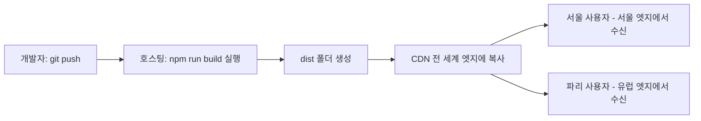
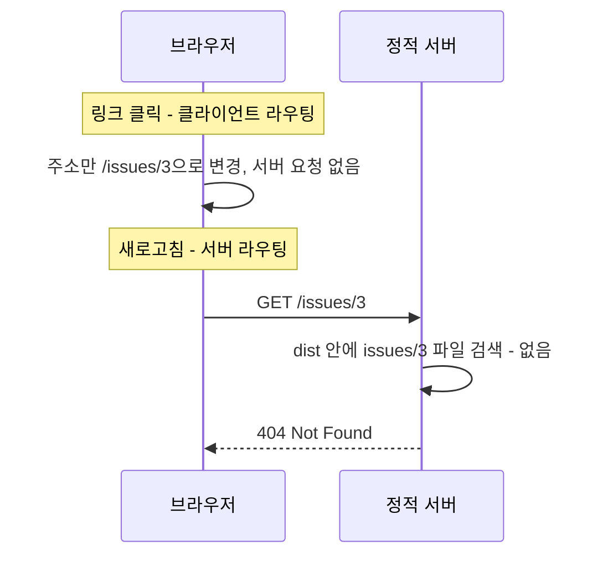

<Callout type="info">
  **이번 문서의 목표:** 내 컴퓨터에서만 돌던 React 앱을 실제 URL로 전 세계에 서비스하고, SPA 특유의 새로고침 404 문제를 히스토리 폴백으로 해결하며, git push 한 번으로 빌드·배포가 자동으로 이어지는 파이프라인을 설명할 수 있게 된다.
</Callout>

## 배포란 무엇인가 — dist 폴더를 세상에 내놓는 일

10편에서 `npm run build`로 `dist/` 폴더를 만들었습니다. 그 폴더의 정체를 다시 확인해 봅시다 — `index.html` 하나, 해시가 붙은 자바스크립트·CSS 파일 몇 개. 전부 **정적 파일**(static file)입니다. 정적이라는 말은 "요청이 올 때마다 서버가 계산해서 만들어내는 것이 아니라, **미리 만들어져 있어서 그대로 건네주기만 하면 되는** 파일"이라는 뜻입니다.

이 점이 React SPA 배포의 성격을 결정합니다. Node.js 서버도, 데이터베이스도, 백엔드 코드도 필요 없습니다. 필요한 것은 단 하나 — **파일을 달라는 요청에 파일을 돌려주는 웹 서버**뿐입니다. 이런 역할만 하는 서비스를 **정적 호스팅**(static hosting)이라고 부릅니다. Netlify(네틀리파이), Vercel(버셀), GitHub Pages, Cloudflare Pages 등이 대표적입니다.

> **쉽게 말하면:** 백엔드 서버 배포가 "주방장을 파견해서 현지에서 요리하게 하는 것"이라면, 정적 호스팅 배포는 "완성된 도시락을 편의점 진열대에 올려놓는 것"입니다. 진열대(호스팅)는 도시락(dist 폴더)을 달라는 사람에게 건네주기만 하면 됩니다.

정적 호스팅은 대개 **CDN**(Content Delivery Network, 콘텐츠 전송 네트워크)과 함께 옵니다. CDN은 전 세계 곳곳에 복사본 서버(엣지, edge)를 두고, 사용자에게 **지리적으로 가장 가까운 서버**가 파일을 건네주는 구조입니다. 서울 사용자는 서울 근처 엣지에서, 파리 사용자는 유럽 엣지에서 같은 `dist/`를 받습니다. 우리가 파일을 한 번 올리면 CDN이 전 세계 배포를 대신해 주는 셈입니다. 이 과목에서는 CDN 내부 구조까지는 들어가지 않고, "정적 호스팅에 올리면 자동으로 전 세계에서 빨라진다"는 효용까지만 짚습니다.



## 배포 전 리허설 — vite preview

배포 사고의 절반은 "개발 서버에서는 됐는데 빌드 결과물에서는 안 되는" 유형입니다. 개발 서버(`npm run dev`)는 빌드를 거치지 않은 특수한 환경이라, **빌드 결과물 자체를 검증하는 별도의 리허설**이 필요합니다.

```bash
npm run build     # dist/ 생성
npm run preview   # dist/를 로컬 웹 서버로 서빙 — http://localhost:4173
```

`vite preview`는 방금 만든 `dist/` 폴더를 **프로덕션과 같은 방식**(정적 파일 서빙)으로 로컬에서 띄워 줍니다. 여기서 확인할 것들:

- 10편에서 만든 lazy 청크들이 페이지 이동 시 실제로 따로 로드되는가(개발자 도구 Network 탭).
- `import.meta.env` 값이 프로덕션 값으로 치환되었는가.
- 콘솔에 개발 모드에서 못 보던 에러가 없는가.

<Callout type="warning">
  `vite preview`는 리허설 도구이지 서비스용 서버가 아닙니다. 실제 서비스는 반드시 정적 호스팅이나 전용 웹 서버에 올립니다.
</Callout>

## SPA의 아킬레스건 — 새로고침하면 404

이제 이 편의 핵심 문제입니다. `dist/`를 아무 정적 서버에나 올리면 **처음에는 잘 되는 것처럼 보이다가**, 이런 사고가 납니다.

1. 사용자가 `https://myapp.com/`에 접속한다 → 잘 나온다.
2. 목록에서 이슈를 클릭해 `https://myapp.com/issues/3`으로 이동한다 → 잘 나온다.
3. 그 페이지에서 **새로고침**을 누른다 → **404 Not Found.**
4. 동료에게 `https://myapp.com/issues/3` 링크를 공유한다 → 동료도 **404.**

왜 2번은 되고 3번은 안 될까요? 두 이동의 **주체가 다르기 때문**입니다.

- 2번의 페이지 이동은 **클라이언트 라우터**(React Router)가 처리했습니다. 브라우저의 History API로 주소창만 바꾸고, 화면 전환은 이미 로드된 자바스크립트가 수행합니다. **서버에는 아무 요청도 가지 않습니다.**
- 3번의 새로고침은 브라우저가 **서버에게** "`/issues/3`이라는 경로의 파일을 주세요"라고 진짜 HTTP 요청을 보내는 행위입니다.

그런데 서버, 즉 정적 호스팅의 입장이 되어 봅시다. `dist/` 폴더에는 무엇이 있었죠? `index.html`, `assets/index-….js`… **`issues/3`이라는 파일이나 폴더는 존재하지 않습니다.** 그 경로는 React Router의 머릿속에만 있는 **가상의 경로**입니다. 파일 서빙밖에 모르는 정적 서버는 정직하게 "그런 파일 없음", 404를 돌려줍니다.



### 해법 — 히스토리 폴백

해법은 서버에 규칙 하나를 가르치는 것입니다. **"어떤 경로를 요청받든, 해당하는 실제 파일이 없으면 404 대신 `index.html`을 돌려줘라."** 이 규칙을 **히스토리 폴백**(history fallback) 또는 SPA 폴백이라고 부릅니다. History API 기반 라우팅을 위한 대체 응답이라는 뜻입니다.

폴백이 설정된 서버에서 위 시나리오를 다시 돌려 보면:

1. 브라우저가 `GET /issues/3`을 보낸다.
2. 서버는 그런 파일이 없음을 확인하고, 약속대로 `index.html`을 **200 상태코드**로 돌려준다.
3. `index.html`이 로드되며 React 앱이 부팅된다.
4. React Router가 **현재 주소창의 값**(`/issues/3`)을 읽고, 그 경로에 매핑된 상세 페이지 컴포넌트를 렌더링한다.

즉 폴백의 역할은 "어떤 경로로 들어와도 일단 앱을 부팅시키는 것"이고, 경로 해석은 부팅된 앱 안의 라우터가 맡습니다. 서버 라우팅과 클라이언트 라우팅의 **업무 분담 계약**인 셈입니다.

한 가지 짚을 점 — 폴백은 존재하지 않는 경로(`/없는페이지`)에도 `index.html`을 200으로 돌려줍니다. 그래서 SPA에서 "404 화면"은 서버가 아니라 **라우터의 몫**입니다. React Router에서 `path="*"` 라우트로 잡아 안내 화면을 보여주는 것이 그 구현이고, 이는 02편에서 세운 "무엇이 진짜 404인가" 기준과 이어집니다.

## 플랫폼별 폴백 설정 — Netlify와 Vercel

폴백을 어떻게 켜는지는 호스팅마다 문법이 다르지만 의미는 동일합니다.

### Netlify — _redirects 또는 netlify.toml

가장 간단한 방법은 `public/` 폴더에 `_redirects`라는 파일(확장자 없음)을 만드는 것입니다. `public/`의 내용물은 Vite가 빌드 때 `dist/` 루트로 그대로 복사해 줍니다.

```text
# public/_redirects
/*    /index.html   200
```

한 줄의 뜻: "모든 경로(`/*`)를 `/index.html`로 응답하되, 상태코드는 **200**으로." 마지막 200이 중요합니다. 이것이 없으면 301 리다이렉트(주소창이 바뀌는 이동)가 되어 주소창의 `/issues/3`이 지워져 버립니다. 200 지정은 **주소는 유지한 채 내용만 index.html로 채우는** 리라이트(rewrite) 동작을 만듭니다.

설정 파일 방식을 선호하면 프로젝트 루트에 `netlify.toml`을 둡니다. 빌드 명령과 산출물 폴더도 함께 선언할 수 있어 팀 프로젝트에서는 이쪽이 표준입니다.

```toml
# netlify.toml
[build]
  command = "npm run build"
  publish = "dist"

[[redirects]]
  from = "/*"
  to = "/index.html"
  status = 200
```

### Vercel — vercel.json

Vercel은 프로젝트 루트의 `vercel.json`에 **rewrites**(리라이트) 규칙으로 선언합니다.

```json
{
  "rewrites": [
    { "source": "/(.*)", "destination": "/index.html" }
  ]
}
```

`source`의 `"/(.*)"`는 모든 경로를 뜻하는 패턴이고, `destination`이 실제로 응답할 파일입니다. rewrite라는 단어 그대로 **주소는 그대로 두고 응답 내용만 바꿔치기**합니다. 참고로 Vercel은 Vite 프로젝트를 감지하면 프레임워크 프리셋이 폴백을 자동 구성해 주는 경우가 많지만, **명시적으로 선언해 두는 것**이 팀원 모두가 동작을 예측할 수 있어 안전합니다.

| 항목 | Netlify | Vercel |
|------|---------|--------|
| 설정 파일 | `_redirects` 또는 `netlify.toml` | `vercel.json` |
| 규칙 이름 | redirects (status 200 지정) | rewrites |
| 빌드 명령 선언 | `[build]` 섹션 | 대시보드 또는 `buildCommand` |
| 산출물 폴더 | `publish = "dist"` | `outputDirectory` 기본 감지 |

## git push가 곧 배포 — 기본 CI 파이프라인

Netlify·Vercel의 진짜 편의는 파일 업로드가 아니라 **git 연동**입니다. 저장소를 한 번 연결해 두면 다음 흐름이 자동화됩니다.

<Steps>

### 저장소 연결과 빌드 설정

호스팅 대시보드에서 GitHub 저장소를 선택하고, 빌드 명령(`npm run build`)과 산출물 폴더(`dist`)를 확인합니다. Vite 프로젝트는 대부분 자동 감지됩니다.

### 환경 변수 등록

10편에서 본 `VITE_API_BASE_URL` 같은 값을 호스팅 대시보드의 환경 변수 화면에 등록합니다. 핵심은 이 값이 **호스팅이 빌드를 실행하는 시점**에 주입된다는 것입니다 — 10편에서 배운 "환경 변수는 빌드 시점에 굳는다"는 성질 때문에, 등록·수정한 값은 **다음 빌드부터** 반영됩니다. 값만 바꾸고 재배포를 잊으면 옛 값이 계속 서비스됩니다.

### push하면 자동 빌드·배포

`main` 브랜치에 push할 때마다 호스팅이 이를 감지해 깨끗한 환경에서 `npm install`과 `npm run build`를 실행하고, 성공하면 결과물을 CDN에 올립니다. 빌드가 실패하면 **이전 배포가 그대로 유지**됩니다 — 깨진 코드가 사용자에게 나가지 않는 안전장치입니다.

### PR마다 미리보기 배포

`main`이 아닌 브랜치로 **풀 리퀘스트**(Pull Request, 병합 요청)를 열면, 그 브랜치만의 **미리보기 URL**(preview deployment)이 자동 생성됩니다. 리뷰어는 코드만 읽는 게 아니라 실제 동작하는 화면을 눌러보고 승인할 수 있습니다.

</Steps>

이 자동화 전체가 **CI**(Continuous Integration, 지속적 통합)와 **CD**(Continuous Deployment, 지속적 배포)의 가장 단순한 형태입니다. 통합이 지속적이라는 말은 "코드 변경을 모아뒀다 한 번에 합치는 게 아니라, 변경마다 자동으로 빌드·검증한다"는 뜻입니다. 더 갖춘 파이프라인이라면 배포 전에 08–09편의 테스트를 끼워 넣습니다 — 예를 들어 GitHub Actions로 "push마다 `npm test`를 돌리고, 통과해야만 배포가 진행되게" 구성하는 식입니다.

```yaml
# .github/workflows/ci.yml — 테스트를 배포의 관문으로 세우는 최소 예시
name: CI
on: [push, pull_request]
jobs:
  test:
    runs-on: ubuntu-latest
    steps:
      - uses: actions/checkout@v4
      - uses: actions/setup-node@v4
        with:
          node-version: 20
      - run: npm ci
      - run: npm test
      - run: npm run build
```

`npm ci`는 `npm install`의 CI 전용 형제로, `package-lock.json`에 잠긴 버전을 **정확히 그대로** 설치해 "내 컴퓨터에선 되는데" 문제를 줄입니다. 이 워크플로가 실패하면 PR에 빨간 표시가 붙어 병합을 막는 관문이 됩니다. CI 도구 자체의 심화는 이 과목 범위 밖이므로, "테스트가 배포의 관문이 되는 구조"라는 그림까지만 가져가면 됩니다.

## 캐싱 전략 — index.html과 해시 자산의 역할 분담

10편에서 본 콘텐츠 해시가 배포와 만나는 지점입니다. 배포된 파일은 두 부류로 나뉘고, **정반대의 캐시 정책**을 가져야 합니다.

| 파일 | 캐시 정책 | 이유 |
|------|-----------|------|
| `assets/index-D2xTkV9c.js` 등 해시 자산 | 최장 기간 캐시(immutable) | 내용이 바뀌면 파일명이 바뀌므로 옛 캐시와 충돌 불가능 |
| `index.html` | 캐시하지 않음(no-cache) | 새 배포의 유일한 진입점 — 최신 해시 파일명을 담은 목록표 |

`index.html`은 "지금 버전의 자산 파일명이 무엇인지" 적힌 **목록표**입니다. 이 목록표가 브라우저에 오래 캐시되면, 새로 배포해도 사용자는 옛 목록표로 옛 자산을 계속 찾게 됩니다. 반대로 해시 자산은 이름이 곧 버전이므로 영원히 캐시해도 안전합니다. Netlify·Vercel은 이 역할 분담을 기본값으로 제공하므로 보통 손댈 일이 없지만, **원리를 알아야** 배포 직후 "화면이 안 바뀌어요" 문의가 왔을 때 캐시 문제인지 판단할 수 있습니다.

한 가지 실전 증상도 알아 둡시다. 배포 직후 앱을 **열어둔 채였던** 사용자가 페이지를 이동하면, 옛 index.html이 가리키는 옛 청크를 요청하는데 새 배포에서 그 파일이 사라졌을 수 있습니다. 10편에서 말한 "lazy 청크 다운로드 실패"의 대표 원인이 바로 이것이고, 에러 바운더리에서 새로고침을 안내하는 처방과 연결됩니다.

## 자주 틀리는 점

1. **폴백을 잊는 것** — 배포 후 첫 화면만 확인하고 끝내면 놓칩니다. 배포 검증 체크리스트에 반드시 "**하위 경로에서 새로고침**"을 넣으세요.
2. **폴백을 301 리다이렉트로 설정** — 주소창이 `/`로 바뀌어 버려 상세 페이지 공유가 불가능해집니다. 반드시 200 리라이트여야 합니다.
3. **호스팅 환경 변수를 바꾸고 재배포를 안 함** — 값은 다음 빌드부터 반영됩니다. 바꿨으면 재배포 버튼까지가 한 세트입니다.
4. **개발 서버 확인만으로 배포** — `vite preview`로 빌드 결과물을 리허설하는 단계를 건너뛰면, 빌드 시점 치환·청크 로딩 문제를 프로덕션에서 처음 만나게 됩니다.
5. **API 서버 주소의 CORS 미확인** — 로컬에서는 프록시로 우회되던 교차 출처 문제가 실제 도메인에서 터질 수 있습니다. 배포 도메인을 API 서버의 허용 목록에 등록해야 합니다(CORS 자체는 WebAPIs 과목의 영역이므로 여기서는 점검 항목으로만).

## 핵심 정리

- React SPA의 배포물은 `dist/`의 **정적 파일**이 전부이며, 파일을 건네주기만 하는 **정적 호스팅**과 CDN이 서비스를 담당한다. 배포 전 `vite preview`로 빌드 결과물을 리허설한다.
- 클라이언트 라우팅 경로는 서버에 파일로 존재하지 않으므로, 하위 경로에서 새로고침하면 404가 난다. **히스토리 폴백** — 파일이 없으면 `index.html`을 200으로 응답 — 이 해법이다.
- Netlify는 `_redirects`/`netlify.toml`, Vercel은 `vercel.json`의 rewrites로 폴백을 선언한다. 리다이렉트가 아니라 **주소를 유지하는 리라이트**여야 한다.
- git 저장소를 연결하면 push마다 자동 빌드·배포, PR마다 미리보기 URL이 생긴다. 테스트를 관문으로 세우면 그것이 기본 CI 파이프라인이다.
- 캐시는 역할 분담이다 — 해시 자산은 영구 캐시, `index.html`은 캐시 금지. 호스팅 환경 변수는 **다음 빌드부터** 반영된다.

## 마무리 복습

<Quiz
  questionNumber={1}
  question="React SPA를 정적 호스팅에 배포할 수 있는 근본적인 이유는?"
  options={['React가 서버에서 HTML을 생성해 주기 때문', '빌드 결과물이 미리 만들어진 정적 파일뿐이라 파일을 건네주는 서버만 있으면 되기 때문', '정적 호스팅이 Node.js 서버를 내장하고 있기 때문', '브라우저가 소스 코드를 직접 컴파일하기 때문']}
  correctAnswer={2}
  explanation="Vite 빌드의 산출물은 index.html과 자바스크립트·CSS 정적 파일이 전부다. 요청마다 계산할 것이 없으므로 파일 서빙만 하는 정적 호스팅과 CDN으로 서비스할 수 있다."
  optionExplanations={['서버 사이드 렌더링은 Next.js 등 별도 프레임워크의 영역으로 이 과목 범위가 아니다', '정답 — 산출물이 정적이라는 성질이 배포 방식을 결정한다', '정적 호스팅은 오히려 서버 코드를 실행하지 않는 것이 특징이다', '컴파일은 배포 전 빌드 단계에서 끝난다']}
/>

<Quiz
  questionNumber={2}
  question="배포된 SPA에서 /issues/3 페이지를 새로고침하면 404가 나는 이유는?"
  options={['React Router의 버그 때문', '새로고침은 서버에 실제 HTTP 요청을 보내는데 서버의 dist 폴더에는 issues/3이라는 파일이 없기 때문', '브라우저 캐시가 오래되어서', '해당 페이지의 lazy 청크가 삭제되어서']}
  correctAnswer={2}
  explanation="링크 클릭은 클라이언트 라우터가 서버 요청 없이 처리하지만, 새로고침은 브라우저가 서버에 그 경로의 파일을 요청한다. 정적 서버에는 그런 파일이 없으므로 404를 돌려준다."
  optionExplanations={['라우터는 정상 동작 중이며 서버 요청 자체가 라우터를 거치지 않는 것이 원인이다', '정답 — 가상 경로와 실제 파일 시스템의 불일치가 본질이다', '캐시 문제가 아니라 파일 부재 문제다', '청크 삭제는 배포 직후 열린 탭에서 생기는 별개의 문제다']}
/>

<Quiz
  questionNumber={3}
  question="히스토리 폴백 설정의 정확한 의미는?"
  options={['모든 요청을 홈 화면 주소로 리다이렉트한다', '요청 경로에 해당하는 파일이 없으면 주소를 유지한 채 index.html을 200으로 응답한다', '404 에러 페이지를 예쁘게 꾸민다', '브라우저 히스토리를 서버에 백업한다']}
  correctAnswer={2}
  explanation="폴백은 어떤 경로로 들어와도 index.html을 돌려줘 앱을 부팅시키고, 경로 해석은 부팅된 클라이언트 라우터에게 맡기는 계약이다. 주소가 유지되어야 라우터가 경로를 읽을 수 있다."
  optionExplanations={['리다이렉트하면 주소창의 경로가 지워져 상세 페이지에 도달할 수 없다', '정답 — 리라이트로 앱을 부팅시키고 라우팅은 클라이언트가 맡는다', '폴백은 404를 안 내는 장치이며 404 화면은 라우터의 와일드카드 라우트가 맡는다', '히스토리 백업 같은 기능은 존재하지 않는다']}
/>

<Quiz
  questionNumber={4}
  question="Netlify의 _redirects 규칙에서 상태코드를 200으로 지정하는 이유는?"
  options={['200이 가장 빠른 상태코드라서', '301로 하면 주소창이 index.html 경로로 바뀌어 클라이언트 라우터가 원래 경로를 읽을 수 없기 때문', '200이 아니면 Netlify가 규칙을 무시하기 때문', '검색 엔진 최적화를 위해서']}
  correctAnswer={2}
  explanation="200 지정은 주소를 유지한 채 내용만 바꾸는 리라이트를 만든다. 301 리다이렉트는 주소창 자체를 바꿔 버려 /issues/3 같은 경로 정보가 사라지고, 라우터가 어느 페이지를 그릴지 알 수 없게 된다."
  optionExplanations={['상태코드에 속도 차이는 없다', '정답 — 리라이트와 리다이렉트의 차이가 SPA 라우팅의 생사를 가른다', 'Netlify는 다른 상태코드도 처리하지만 SPA에는 부적합할 뿐이다', 'SEO는 부차적 효과일 뿐 본질은 경로 보존이다']}
/>

<Quiz
  questionNumber={5}
  question="호스팅 대시보드에서 VITE_API_BASE_URL 값을 수정했는데 서비스에 반영되지 않는다. 가장 유력한 원인은?"
  options={['환경 변수 이름에 오타가 있다', '환경 변수는 빌드 시점에 번들로 굳으므로 수정 후 재배포를 하지 않았다', 'CDN 엣지 서버가 다운되었다', 'index.html이 캐시되었다']}
  correctAnswer={2}
  explanation="10편에서 배웠듯 Vite 환경 변수는 빌드하는 순간 번들 속 문자열로 치환된다. 호스팅의 환경 변수는 빌드 실행 시점에 주입되므로, 값을 바꿨다면 새 빌드를 트리거해야 반영된다."
  optionExplanations={['오타 가능성도 있지만 값 수정 후 미반영의 전형적 원인은 재배포 누락이다', '정답 — 값 변경과 재배포는 한 세트다', '엣지 장애라면 사이트 전체가 안 열리는 증상이 나타난다', '캐시 문제라면 강력 새로고침으로 확인되지만 번들 자체에 옛 값이 굳은 것이 본질이다']}
/>

<Quiz
  questionNumber={6}
  question="배포 파일의 캐시 정책으로 올바른 조합은?"
  options={['index.html은 영구 캐시, 해시 자산은 캐시 금지', 'index.html은 캐시 금지, 해시가 붙은 자산 파일은 장기 캐시', '모든 파일을 영구 캐시', '모든 파일을 캐시 금지']}
  correctAnswer={2}
  explanation="해시 자산은 내용이 바뀌면 파일명이 바뀌므로 장기 캐시해도 충돌이 없다. 반면 index.html은 최신 자산 파일명을 담은 진입점이므로 캐시되면 새 배포가 사용자에게 전달되지 않는다."
  optionExplanations={['정반대다 — 목록표를 캐시하면 새 배포가 보이지 않는다', '정답 — 이름이 곧 버전인 파일은 영구 캐시, 진입점은 항상 새로 받는다', '전부 캐시하면 배포가 반영되지 않는 사용자가 생긴다', '전부 금지하면 재방문 성능을 통째로 버리는 낭비다']}
/>

<Quiz
  questionNumber={7}
  question="PR 미리보기 배포(preview deployment)의 가치는?"
  options={['프로덕션 배포 속도를 높인다', '병합 전에 해당 브랜치의 실제 동작 화면을 별도 URL에서 확인하며 리뷰할 수 있다', '테스트 코드를 자동으로 작성해 준다', '번들 크기를 자동으로 줄여 준다']}
  correctAnswer={2}
  explanation="PR마다 그 브랜치의 빌드 결과가 독립 URL로 배포되므로, 리뷰어가 코드뿐 아니라 실제 동작을 확인한 뒤 병합 여부를 결정할 수 있다."
  optionExplanations={['프로덕션 배포 속도와는 무관하다', '정답 — 코드 리뷰에 동작 검증을 더하는 장치다', '테스트 작성은 개발자의 일이며 CI는 실행만 대신한다', '번들 최적화는 별개의 작업이다']}
/>

## 참고 자료

- [Vite 공식 문서 - Building for Production](https://vitejs.dev/guide/build)
- [Vite 공식 문서 - Deploying a Static Site](https://vitejs.dev/guide/static-deploy)
- [Netlify 공식 문서 - Redirects and rewrites](https://docs.netlify.com/routing/redirects/)
- [Vercel 공식 문서 - Project Configuration (rewrites)](https://vercel.com/docs/projects/project-configuration)
