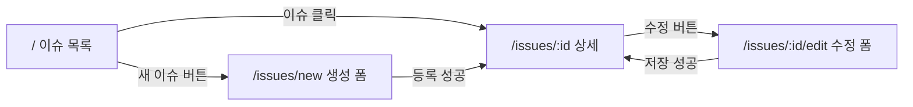

<Callout type="info">
  **이번 문서의 목표:** 13편에서 구현할 이슈 트래커의 요구사항 전체 — 화면, API 계약, 데이터 모델, 상태별 UX 기준, 테스트 범위, 배포 조건 — 를 스펙 문서로 확정하고, 구현 중 판단이 흔들릴 때 돌아올 단일 기준을 갖게 된다.
</Callout>

## 왜 스펙부터 쓰는가 — 코드보다 계약이 먼저다

드디어 03–11편의 기술을 한 앱에 모읍니다. 그런데 실무 프로젝트가 튜토리얼과 갈라지는 지점은 **코딩을 시작하는 방식**입니다. 튜토리얼은 "일단 컴포넌트부터" 만들지만, 실무는 **스펙**(spec, specification의 줄임말 — 명세, 만들 것의 정의서)부터 씁니다. 이유는 단순합니다.

1. **판단 기준이 생깁니다.** "삭제 실패 시 어떻게 하지?"라는 질문이 구현 중에 튀어나왔을 때, 스펙이 있으면 찾아보면 되고 없으면 그 자리에서 즉흥 결정을 하게 됩니다. 즉흥 결정이 쌓이면 화면마다 에러 처리 방식이 다른 앱이 됩니다.
2. **완료를 정의할 수 있습니다.** 스펙의 체크리스트를 다 지우면 끝난 것입니다. 스펙이 없으면 "이 정도면 됐나?"를 영원히 반복합니다.
3. **API 계약이 곧 MSW 핸들러가 됩니다.** 09편에서 봤듯 우리의 목 서버는 핸들러 파일이고, 핸들러는 API 스펙의 코드 번역입니다. 스펙이 정확하면 백엔드 없이도 프론트엔드를 끝까지 만들 수 있습니다.

> **쉽게 말하면:** 스펙은 건축 도면입니다. 도면 없이 벽돌부터 쌓으면 방 크기를 현장에서 즉흥으로 정하게 되고, 다 짓고 나서야 화장실을 잊었다는 걸 알게 됩니다.

이 편은 그 도면입니다. 코드는 거의 없지만, 13편 구현의 모든 판단이 이 문서를 근거로 이뤄집니다.

## 프로젝트 개요 — 이슈 트래커

만들 것은 **이슈 트래커**(issue tracker)입니다. 팀이 버그·할 일을 등록하고 추적하는 도구로, GitHub Issues의 축소판이라고 생각하면 됩니다. 이 주제를 고른 이유는 실무 앱의 4대 요소가 전부 자연스럽게 등장하기 때문입니다 — **목록**(필터·서버 상태 캐싱), **상세**(URL 파라미터 기반 쿼리), **생성/수정 폼**(검증·서버 에러), **변경 작업**(뮤테이션·무효화·낙관적 업데이트).

- **기술 스택**: Vite + React, TanStack Query v5, react-hook-form v7 + Zod, Jest + React Testing Library + MSW 2.x, React Router
- **백엔드**: 없음. **MSW가 개발·테스트 양쪽의 서버**를 맡습니다(09편에서 본 핸들러 공유 구조). 실제 백엔드가 생기면 핸들러를 끄기만 하면 되도록, 앱 코드는 진짜 API를 호출하듯 작성합니다.

사용자 스토리(user story, "누가 무엇을 왜 하는가" 형식의 요구사항)로 범위를 확정합니다.

| # | 사용자 스토리 | 관련 편 |
|---|---------------|---------|
| S1 | 팀원으로서, 등록된 이슈 목록을 상태별로 필터링해 보고 싶다 | 03, 04 |
| S2 | 팀원으로서, 이슈 하나를 클릭해 상세 내용을 보고 싶다 | 04 |
| S3 | 팀원으로서, 새 이슈를 등록하고 싶다 — 잘못 입력하면 어디가 왜 틀렸는지 알고 싶다 | 06, 07 |
| S4 | 팀원으로서, 기존 이슈의 내용을 수정하고 싶다 | 04, 06 |
| S5 | 팀원으로서, 이슈를 열림/닫힘 상태로 전환하고 싶다 — 클릭 즉시 화면에 반영되면 좋겠다 | 05 |
| S6 | 팀원으로서, 네트워크가 느리거나 실패해도 지금 무슨 상황인지 화면에서 알 수 있어야 한다 | 02, 04 |

**범위에서 제외하는 것**도 명시합니다 — 로그인/인증, 댓글, 담당자 지정, 검색, 페이지네이션 UI(무한 스크롤 포함), 다크 모드. 제외 목록이 없는 스펙은 끝없이 자라납니다.

## 화면 정의 — 세 페이지와 한 폼



### 화면 1 — 이슈 목록 (경로 `/`)

- 이슈를 **최신 등록 순**으로 보여준다. 각 행에 제목, 상태 배지(열림/닫힘), 우선순위, 등록일을 표시한다.
- 상단에 상태 필터 — 전체 / 열림 / 닫힘. 필터는 **서버에 쿼리 파라미터로 전달**한다(클라이언트에서 배열을 자르지 않는다). 필터별로 캐시가 분리되도록 queryKey에 필터를 포함한다(03편의 "queryKey는 캐시의 신원" 원칙).
- 행 클릭 시 상세로 이동, 우측 상단 "새 이슈" 버튼으로 생성 폼 이동.

### 화면 2 — 이슈 상세 (경로 `/issues/:id`)

- 제목, 본문, 상태, 우선순위, 등록일·수정일을 표시한다.
- "상태 전환" 버튼 — 열림이면 닫기, 닫힘이면 다시 열기. **낙관적 업데이트**로 클릭 즉시 반영하고 실패 시 롤백한다(05편). 이 버튼이 S5의 구현이다.
- "수정" 버튼으로 수정 폼 이동. 존재하지 않는 id면 404 안내 화면(02편의 "자원 자체가 없음" 기준).

### 화면 3 — 생성/수정 폼 (경로 `/issues/new`, `/issues/:id/edit`)

- 두 화면은 **같은 폼 컴포넌트를 공유**한다. 생성은 빈 초기값, 수정은 기존 이슈 값을 초기값으로 받는다.
- 필드: 제목(텍스트), 본문(여러 줄 텍스트), 우선순위(선택 — 낮음/보통/높음).
- 검증은 Zod 스키마 단일 출처(06편), 서버 필드 에러는 해당 필드에 매핑(07편), 에러 시 첫 에러 필드로 포커스 이동과 `aria-invalid` 표시(07편).
- 제출 중에는 버튼 비활성화 + "저장 중…" 표시. 성공 시 상세 화면으로 이동.

## 데이터 모델과 검증 규칙

**이슈**(Issue) 자원의 형태를 확정합니다. 이 표가 Zod 스키마와 MSW 핸들러 양쪽의 원본이 됩니다.

| 필드 | 타입 | 제약 | 소유 |
|------|------|------|------|
| `id` | number | 서버가 발급 | 서버 |
| `title` | string | 필수, 2–80자 | 사용자 입력 |
| `body` | string | 필수, 10자 이상 | 사용자 입력 |
| `priority` | string | `low` / `medium` / `high` 중 하나 | 사용자 입력 |
| `status` | string | `open` / `closed`, 생성 시 서버가 `open`으로 설정 | 서버 |
| `createdAt` | string | ISO 8601 날짜 문자열, 서버 발급 | 서버 |
| `updatedAt` | string | ISO 8601 날짜 문자열, 서버 갱신 | 서버 |

"소유" 칼럼이 설계의 핵심입니다. `id`·`status`·날짜는 **서버 소유** 필드라 폼에 존재하지 않고, 폼의 Zod 스키마는 사용자 입력 3개 필드만 다룹니다. 서버 소유 필드를 폼 스키마에 섞으면 "생성 시엔 없는 값" 처리로 스키마가 지저분해집니다 — 06편에서 세운 "폼 스키마는 입력의 모델" 원칙의 적용입니다.

검증 규칙과 에러 메시지도 스펙에서 확정합니다. 메시지를 구현 중에 즉흥으로 쓰면 화면마다 어조가 달라집니다.

| 규칙 | 에러 메시지 |
|------|-------------|
| 제목 미입력 또는 2자 미만 | 제목을 2자 이상 입력해 주세요 |
| 제목 80자 초과 | 제목은 80자까지 입력할 수 있어요 |
| 본문 10자 미만 | 내용을 10자 이상 입력해 주세요 |
| 우선순위 미선택 | 우선순위를 선택해 주세요 |

## API 계약 — MSW 핸들러의 원본이 될 명세

02편의 응답 패턴을 따르는 REST API 계약입니다. 13편에서 이 표의 각 행이 MSW 핸들러 하나로 번역됩니다.

| 메서드·경로 | 용도 | 성공 응답 | 주요 실패 |
|-------------|------|-----------|-----------|
| `GET /api/issues?status=open` | 목록 (status 생략 시 전체) | 200 + 이슈 배열 | 500 |
| `GET /api/issues/:id` | 상세 | 200 + 이슈 객체 | 404, 500 |
| `POST /api/issues` | 생성 | 201 + 생성된 이슈 | 422(필드 에러), 500 |
| `PATCH /api/issues/:id` | 수정·상태 전환 | 200 + 수정된 이슈 | 404, 422, 500 |

에러 응답의 본문 형태도 계약입니다. 07편의 필드 에러 매핑이 이 구조에 의존합니다.

```json
{
  "message": "입력값이 올바르지 않습니다",
  "errors": {
    "title": "같은 제목의 이슈가 이미 있습니다"
  }
}
```

- `message` — 폼 상단 요약 영역에 표시할 사람이 읽는 문장.
- `errors` — 필드 이름을 키로 하는 객체. RHF의 `setError`로 각 필드에 매핑한다(07편). `errors`가 없는 에러(500 등)는 폼 상단 요약에만 표시한다.

서버 검증 규칙 하나를 일부러 넣습니다 — **같은 제목의 열린 이슈가 이미 있으면 422**를 돌려줍니다. 클라이언트 Zod 검증만으로는 잡을 수 없는 "서버만 아는 에러"를 만들어, 07편의 두 층 검증 흐름을 강제로 연습하기 위한 장치입니다.

### queryKey 설계

API 계약이 정해졌으니 캐시 신원도 스펙으로 고정합니다(03편 원칙 — 계층적 key, 구체적 무효화).

```js
// src/queries/keys.js — 앱 전체가 이 팩토리만 사용한다
export const issueKeys = {
  all: ['issues'],
  lists: () => [...issueKeys.all, 'list'],
  list: (status) => [...issueKeys.lists(), { status }],
  details: () => [...issueKeys.all, 'detail'],
  detail: (id) => [...issueKeys.details(), id],
};
```

- 필터별 목록은 `issueKeys.list('open')`처럼 분리 캐시된다.
- 생성·수정 성공 시 `issueKeys.lists()`로 **모든 필터의 목록**을 한 번에 무효화한다(04편).
- 상태 전환의 낙관적 업데이트는 `issueKeys.detail(id)` 캐시를 직접 수정한다(05편).

## 로딩·에러·빈 상태 UX 기준

02편에서 세운 "화면의 네 얼굴"을 화면별 스펙으로 못 박습니다. 이 표는 그대로 09편 방식의 테스트 시나리오 표가 됩니다.

| 화면 | 로딩 | 에러 | 빈 상태 | 404 |
|------|------|------|---------|-----|
| 목록 | 스켈레톤 행 5개, `role="status"` | 안내 문구 + 다시 시도 버튼, `role="alert"` | 등록된 이슈가 없다는 안내 + 새 이슈 버튼 | 해당 없음 |
| 상세 | 스켈레톤 블록 | 안내 문구 + 다시 시도 버튼 | 해당 없음 | 이슈를 찾을 수 없다는 안내 + 목록으로 링크 |
| 폼 제출 | 버튼 비활성화 + 저장 중 표시 | 필드 에러는 필드 옆, 그 외는 상단 요약 | 해당 없음 | 해당 없음 |

추가 규칙:

- **다시 시도 버튼**은 TanStack Query의 `refetch`를 호출한다. 전체 새로고침을 안내하는 것은 실격이다.
- 빈 상태와 에러를 절대 같은 화면으로 취급하지 않는다 — 빈 배열은 200 정상 응답이다(02편).
- 필터 전환 시 이전 목록을 유지한 채 갱신 표시만 하는 것은 **선택 과제**(v5의 `placeholderData` 활용)로 두고, 기본 요구는 아니다.

## 테스트 범위 정의 — 무엇을 고정하고 무엇을 버릴 것인가

08편의 원칙대로, 테스트 목록도 스펙에서 정합니다. "시간이 남으면 테스트"가 아니라 **아래 목록이 통과해야 완료**입니다.

<Steps>

### 반드시 테스트하는 것 (필수 6종)

1. 목록: 이슈들이 화면에 나타난다 (성공 경로).
2. 목록: 서버 500 시 에러 안내와 다시 시도 버튼이 보인다.
3. 목록: 빈 배열 응답 시 빈 상태 안내가 보인다.
4. 생성 폼: 잘못된 입력으로 제출하면 필드별 에러 메시지가 보이고 서버 요청이 나가지 않는다.
5. 생성 폼: 올바른 입력으로 제출하면 **서버가 받은 본문이 입력값과 일치**하고 성공 화면으로 이어진다 (09편의 계약 검증).
6. 생성 폼: 서버 422 필드 에러가 해당 필드 옆에 `aria-invalid`와 함께 표시된다.

### 하지 않는 것 (경계 선언)

- TanStack Query·RHF·Zod **라이브러리 내부 동작** — 우리 코드가 아니다(08편).
- 스켈레톤의 CSS, 배지 색상 등 **스타일 세부** — 행동이 아니라 외형이다.
- 낙관적 업데이트의 **캐시 내부 값 직접 검사** — 화면에 보이는 결과로만 검증한다.
- 라우터의 경로 매칭 자체 — React Router의 몫이다.

</Steps>

이 경계 선언이 있어야 13편에서 "이것도 테스트해야 하나?"라는 질문에 스펙으로 답할 수 있습니다.

## 배포 요구사항과 완료 조건

배포 범위(10–11편의 적용)를 확정합니다.

- 세 페이지(목록/상세/폼)는 **라우트 단위 코드 스플리팅**을 적용한다(10편). 빌드 로그에서 페이지별 청크 생성을 확인한다.
- API 기본 주소는 `VITE_API_BASE_URL` 환경 변수로 분리한다(10편). MSW를 쓰는 동안은 상대 경로 기준이지만, 실제 백엔드 전환에 대비한 구조를 만든다.
- Netlify 또는 Vercel에 git 연동으로 배포하고, **히스토리 폴백을 설정**한다(11편). 검증 기준: 상세 페이지 URL에서 새로고침해도 404가 나지 않는다.
- 배포 파이프라인에서 테스트가 실패하면 배포가 진행되지 않게 한다(11편의 CI 관문).

마지막으로, 전체 **완료 조건**(Definition of Done — 실무에서 "끝났다"의 공식 정의)을 체크리스트로 못 박습니다. 13편을 마친 뒤 이 목록으로 스스로 채점합니다.

- [ ] 사용자 스토리 S1–S6이 화면에서 모두 동작한다
- [ ] 상태별 UX 표의 모든 칸이 구현되어 있다
- [ ] 필수 테스트 6종이 통과한다
- [ ] 상태 전환이 낙관적 업데이트로 즉시 반영되고, 실패 시 롤백된다
- [ ] 라우트 청크가 분리되어 빌드된다
- [ ] 배포 URL의 하위 경로에서 새로고침해도 앱이 뜬다

## 핵심 정리

- 구현보다 **스펙이 먼저**다. 스펙은 구현 중 즉흥 결정을 막고, 완료를 정의하며, API 계약은 그대로 MSW 핸들러의 원본이 된다.
- 프로젝트는 이슈 트래커 — 목록(필터·캐시), 상세(URL 파라미터 쿼리), 공유 폼(생성/수정), 상태 전환(낙관적 업데이트)으로 03–11편의 기술을 전부 소화한다.
- 데이터 모델에서 **서버 소유 필드와 사용자 입력 필드를 구분**하고, 폼 스키마는 입력 필드만 다룬다. 에러 응답 형태(`message` + `errors` 객체)도 계약이다.
- queryKey는 팩토리로 스펙에 고정한다 — 필터별 목록 분리, `lists()` 단위 무효화, `detail(id)` 낙관적 갱신.
- 테스트는 필수 6종과 **하지 않는 것 목록**을 함께 선언한다. 완료 조건 체크리스트가 프로젝트의 채점표다.

## 마무리 복습

<Quiz
  questionNumber={1}
  question="구현 전에 스펙 문서를 쓰는 가장 실질적인 이유는?"
  options={['코드 작성 속도가 두 배로 빨라지기 때문', '구현 중의 판단 기준과 완료의 정의가 생기고, API 계약이 그대로 MSW 핸들러의 원본이 되기 때문', '스펙이 있으면 테스트를 생략할 수 있기 때문', '백엔드 개발자가 프론트엔드 코드를 검토할 수 있기 때문']}
  correctAnswer={2}
  explanation="스펙은 즉흥 결정을 막는 판단 기준, 완료 조건, 그리고 목 서버 구현의 원본이라는 세 역할을 한다. 속도보다 일관성과 완결성이 핵심 가치다."
  optionExplanations={['속도 향상은 부수 효과일 뿐 본질이 아니다', '정답 — 판단 기준·완료 정의·핸들러 원본의 세 역할이다', '스펙은 오히려 테스트 목록을 확정하는 문서다', '검토 편의는 부차적 효과다']}
/>

<Quiz
  questionNumber={2}
  question="데이터 모델에서 id, status, createdAt을 폼의 Zod 스키마에 넣지 않는 이유는?"
  options={['Zod가 숫자와 날짜 타입을 지원하지 않아서', '서버가 소유·발급하는 필드라 사용자 입력 모델이 아니기 때문', '필드가 많으면 폼 성능이 떨어져서', 'MSW가 해당 필드를 처리하지 못해서']}
  correctAnswer={2}
  explanation="폼 스키마는 사용자 입력의 모델이다. 서버 소유 필드를 섞으면 생성 시점에 존재하지 않는 값을 처리하느라 스키마가 왜곡된다. 서버 발급 값은 응답에서 받는다."
  optionExplanations={['Zod는 숫자·날짜를 포함한 풍부한 타입을 지원한다', '정답 — 입력의 모델과 자원의 모델을 구분하는 설계 원칙이다', '성능 문제가 아니라 책임 구분 문제다', 'MSW는 어떤 필드든 처리할 수 있다']}
/>

<Quiz
  questionNumber={3}
  question="에러 응답 본문에 message와 별도로 errors 객체를 두는 이유는?"
  options={['HTTP 표준이 두 필드를 강제하기 때문', '필드 이름을 키로 갖는 errors를 RHF의 setError로 각 입력 필드에 매핑하고, message는 폼 상단 요약에 쓰기 위해서', '에러 로그를 서버에 저장하기 위해서', '404와 500을 구분하기 위해서']}
  correctAnswer={2}
  explanation="errors 객체의 키가 폼 필드 이름과 일치해야 서버 검증 실패를 해당 필드 옆에 표시할 수 있다. 필드에 귀속되지 않는 에러는 message로 상단 요약에 보여준다. 이 구조 자체가 클라이언트와의 계약이다."
  optionExplanations={['HTTP 표준은 에러 본문 형태를 강제하지 않는다 — 팀의 계약일 뿐이다', '정답 — 07편의 필드 에러 매핑이 이 구조에 의존한다', '로그 저장과는 무관한 클라이언트 표시용 구조다', '상태코드 구분은 응답 코드 자체가 담당한다']}
/>

<Quiz
  questionNumber={4}
  question="목록 화면의 상태 필터를 queryKey에 포함시키는 이유는?"
  options={['queryKey가 길수록 캐시가 빨라져서', '필터 값이 다르면 다른 데이터이므로 캐시 신원을 분리해 필터별로 독립 캐싱되게 하기 위해서', 'React Router가 queryKey를 요구해서', '무효화를 불가능하게 만들기 위해서']}
  correctAnswer={2}
  explanation="queryKey는 캐시의 신원이다. 열린 이슈 목록과 닫힌 이슈 목록은 다른 데이터이므로 key에 필터를 넣어 분리 캐시한다. 계층적 key 팩토리 덕분에 lists() 수준에서 한 번에 무효화도 가능하다."
  optionExplanations={['key 길이와 속도는 무관하다', '정답 — 파라미터가 다르면 key가 달라야 한다는 03편 원칙의 적용이다', '라우터와 queryKey는 무관하다', '오히려 계층 구조로 무효화가 쉬워진다']}
/>

<Quiz
  questionNumber={5}
  question="스펙의 테스트 범위에 하지 않는 것 목록을 함께 선언하는 이유는?"
  options={['테스트 개수를 줄여 CI 비용을 아끼기 위해서', '라이브러리 내부·스타일 세부 같은 비대상을 미리 선언해 구현 중 테스트 경계 판단이 흔들리지 않게 하기 위해서', '테스트 커버리지 도구가 요구해서', '하지 않는 목록이 있어야 빌드가 통과해서']}
  correctAnswer={2}
  explanation="08편의 테스트 경계 원칙을 프로젝트 스펙에 못 박는 것이다. 비대상이 문서화되어 있으면 이것도 테스트해야 하나라는 질문에 스펙으로 답할 수 있고, 구현 세부에 결합된 취약한 테스트를 예방한다."
  optionExplanations={['비용 절감은 부수 효과다', '정답 — 경계 선언이 테스트의 일관성을 지킨다', '커버리지 도구와는 무관하다', '빌드와는 아무 관계가 없다']}
/>

<Quiz
  questionNumber={6}
  question="배포 완료 조건에 상세 페이지 URL에서 새로고침해도 404가 나지 않는다가 들어간 이유는?"
  options={['새로고침이 캐시를 갱신하는지 확인하려고', 'SPA 히스토리 폴백이 올바르게 설정되었는지 검증하는 대표 시나리오이기 때문', '서버 응답 속도를 측정하기 위해서', '코드 스플리팅이 적용되었는지 확인하려고']}
  correctAnswer={2}
  explanation="하위 경로 새로고침은 클라이언트 라우팅 경로로 서버에 직접 요청하는 행위라서, 히스토리 폴백이 없으면 정확히 이 지점에서 404가 난다. 폴백 검증의 표준 시나리오다."
  optionExplanations={['캐시 갱신 확인과는 무관하다', '정답 — 11편에서 본 SPA 배포의 대표 함정을 완료 조건으로 명시한 것이다', '속도 측정 항목이 아니다', '청크 분리는 빌드 로그로 확인한다']}
/>

## 참고 자료

- [TanStack Query 공식 문서 - Query Keys](https://tanstack.com/query/v5/docs/framework/react/guides/query-keys)
- [react-hook-form 공식 문서](https://react-hook-form.com/)
- [Zod 공식 문서](https://zod.dev/)
- [MSW 공식 문서 - Getting Started](https://mswjs.io/docs/getting-started)
