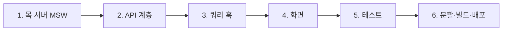

<Callout type="info">
  **이번 문서의 목표:** 12편에서 확정한 스펙을 기준 삼아, 프로젝트 셋업부터 배포까지 이슈 트래커 전체를 손으로 구현하고 완료 조건 체크리스트를 전부 지울 수 있게 된다.
</Callout>

## 구현 순서에 대하여 — 안쪽부터 바깥쪽으로

12편 스펙을 코드로 옮길 차례입니다. 시작 전에 **순서**를 정합니다. 화면부터 만들고 싶은 유혹이 크지만, 우리는 반대로 갑니다.



> **쉽게 말하면:** 수도관 공사와 같습니다. 수원지(목 서버)부터 확보하고, 배관(API 계층·쿼리 훅)을 깔고, 마지막에 수도꼭지(화면)를 답니다. 수도꼭지부터 달면 물이 나오는지 끝까지 확인할 수 없습니다.

이 순서의 이점은 **각 단계가 끝날 때마다 동작을 확인할 수 있다**는 것입니다. 목 서버는 브라우저 개발자 도구로, API 계층은 콘솔에서, 쿼리 훅은 임시 화면으로 검증하며 전진합니다. 각 단계에서 쓰는 기술의 원리는 해당 편에 있으므로 여기서는 재설명하지 않고, **스펙의 어느 항목을 어떤 코드로 옮기는지**에 집중합니다.

<Steps>

### 프로젝트 셋업

Vite로 프로젝트를 만들고 필요한 패키지를 설치합니다.

```bash
npm create vite@latest issue-tracker -- --template react
cd issue-tracker

# 런타임 의존성
npm install @tanstack/react-query react-router-dom react-hook-form zod @hookform/resolvers

# 개발·테스트 의존성
npm install --save-dev msw jest jest-environment-jsdom @testing-library/react @testing-library/jest-dom @testing-library/user-event @babel/preset-env @babel/preset-react
```

- `@hookform/resolvers` — RHF와 Zod를 연결하는 어댑터입니다(06편).
- Jest 관련 설정(babel 프리셋, `jest-environment-jsdom`, `jest.setup.js`)은 08편에서 구성한 그대로이므로 생략합니다.

폴더 구조를 스펙의 책임 구분대로 잡습니다.

```text
src/
  mocks/        # MSW 핸들러·서버 (개발·테스트 공유)
  api/          # fetch 래퍼 — HTTP를 아는 유일한 곳
  queries/      # queryKey 팩토리 + 쿼리·뮤테이션 훅
  pages/        # 라우트 단위 화면 3종
  components/   # 공유 폼 등 재사용 조각
  schemas/      # Zod 스키마
```

### MSW 목 서버 — 스펙의 API 계약을 코드로

12편 API 계약 표의 네 행을 핸들러 네 개로 번역합니다. 서버가 상태(이슈 배열)를 가져야 하므로, 핸들러 파일 안에 **메모리 데이터베이스**를 둡니다.

```js
// src/mocks/db.js — 메모리 저장소. 테스트마다 초기화할 수 있게 함수로 감싼다
const 초기데이터 = [
  {
    id: 1, title: '로그인 버튼이 안 눌림', body: '사파리에서 로그인 버튼 클릭이 무반응입니다.',
    priority: 'high', status: 'open',
    createdAt: '2026-08-01T09:00:00.000Z', updatedAt: '2026-08-01T09:00:00.000Z',
  },
  {
    id: 2, title: '다크 모드 색 대비 부족', body: '다크 모드에서 보조 텍스트가 잘 안 보입니다.',
    priority: 'low', status: 'closed',
    createdAt: '2026-08-02T10:30:00.000Z', updatedAt: '2026-08-03T11:00:00.000Z',
  },
];

export let issues = structuredClone(초기데이터);
export function resetDb() {
  issues = structuredClone(초기데이터);
}
```

```js
// src/mocks/handlers.js
import { http, HttpResponse } from 'msw';
import { issues } from './db';

export const handlers = [
  // GET /api/issues?status=open — 목록 (필터는 서버가 처리: 스펙 S1)
  http.get('/api/issues', ({ request }) => {
    const url = new URL(request.url);
    const status = url.searchParams.get('status');
    const 결과 = status ? issues.filter((i) => i.status === status) : issues;
    // 최신 등록 순 정렬 — 스펙 화면 1
    const 정렬됨 = [...결과].sort((a, b) => b.createdAt.localeCompare(a.createdAt));
    return HttpResponse.json(정렬됨);
  }),

  // GET /api/issues/:id — 상세. 없으면 404 (스펙: 자원 부재)
  http.get('/api/issues/:id', ({ params }) => {
    const issue = issues.find((i) => i.id === Number(params.id));
    if (!issue) {
      return HttpResponse.json({ message: '이슈를 찾을 수 없습니다' }, { status: 404 });
    }
    return HttpResponse.json(issue);
  }),

  // POST /api/issues — 생성. 중복 제목이면 422 필드 에러 (스펙의 서버만 아는 에러)
  http.post('/api/issues', async ({ request }) => {
    const body = await request.json();
    const 중복 = issues.some((i) => i.status === 'open' && i.title === body.title);
    if (중복) {
      return HttpResponse.json(
        {
          message: '입력값이 올바르지 않습니다',
          errors: { title: '같은 제목의 열린 이슈가 이미 있습니다' },
        },
        { status: 422 }
      );
    }
    const now = new Date().toISOString();
    const 새이슈 = {
      id: Math.max(0, ...issues.map((i) => i.id)) + 1,
      ...body,
      status: 'open',          // 서버 소유 필드 — 서버가 결정
      createdAt: now,
      updatedAt: now,
    };
    issues.push(새이슈);
    return HttpResponse.json(새이슈, { status: 201 });
  }),

  // PATCH /api/issues/:id — 수정·상태 전환
  http.patch('/api/issues/:id', async ({ params, request }) => {
    const issue = issues.find((i) => i.id === Number(params.id));
    if (!issue) {
      return HttpResponse.json({ message: '이슈를 찾을 수 없습니다' }, { status: 404 });
    }
    const 변경분 = await request.json();
    Object.assign(issue, 변경분, { updatedAt: new Date().toISOString() });
    return HttpResponse.json(issue);
  }),
];
```

핸들러가 스펙과 1:1로 대응하는지 확인하세요 — 필터 처리(S1), 404 기준, 422 응답의 `message` + `errors` 구조, 서버 소유 필드의 서버 측 발급. **스펙에 없는 동작을 핸들러에 넣지 않는 것**도 규율입니다.

개발용 브라우저 워커와 테스트용 Node 서버는 09편의 구조 그대로입니다.

```js
// src/mocks/browser.js — 개발 환경용
import { setupWorker } from 'msw/browser';
import { handlers } from './handlers';
export const worker = setupWorker(...handlers);

// src/mocks/server.js — 테스트용
import { setupServer } from 'msw/node';
import { handlers } from './handlers';
export const server = setupServer(...handlers);
```

```js
// src/main.jsx — 개발 모드에서만 워커 가동
async function enableMocking() {
  if (!import.meta.env.DEV) return;
  const { worker } = await import('./mocks/browser');
  return worker.start();
}

enableMocking().then(() => {
  // 여기서 ReactDOM.createRoot(...).render(...) 실행
});
```

`worker.start()`가 끝난 **뒤에** 앱을 렌더링해야, 앱의 첫 요청이 워커 준비 전에 새어 나가는 경쟁 문제를 막을 수 있습니다. 이 시점에 `npm run dev`를 켜고 브라우저 콘솔에 MSW 가동 메시지가 뜨는지, 주소창에 `/api/issues`를 쳐서 JSON이 나오는지 확인합니다 — 1단계 완료 검증입니다.

### API 계층 — HTTP를 아는 유일한 곳

컴포넌트나 훅이 `fetch`를 직접 만지면 에러 처리 방식이 화면마다 흩어집니다. HTTP 지식(상태코드 해석, 에러 본문 파싱)을 한 파일에 가둡니다. 02편에서 세운 에러 모델의 코드화입니다.

```js
// src/api/client.js
const BASE_URL = import.meta.env.VITE_API_BASE_URL ?? '';

// 서버 에러 본문(message, errors)을 실어 나르는 커스텀 에러
export class ApiError extends Error {
  constructor(status, body) {
    super(body?.message ?? '요청에 실패했습니다');
    this.status = status;
    this.fieldErrors = body?.errors ?? null; // 07편의 필드 에러 매핑 재료
  }
}

async function request(path, options) {
  const res = await fetch(BASE_URL + '/api' + path, {
    headers: { 'Content-Type': 'application/json' },
    ...options,
  });
  if (!res.ok) {
    const body = await res.json().catch(() => null);
    throw new ApiError(res.status, body);
  }
  return res.json();
}

export const issueApi = {
  getList: (status) =>
    request(status ? '/issues?status=' + status : '/issues'),
  getOne: (id) => request('/issues/' + id),
  create: (data) =>
    request('/issues', { method: 'POST', body: JSON.stringify(data) }),
  update: (id, data) =>
    request('/issues/' + id, { method: 'PATCH', body: JSON.stringify(data) }),
};
```

`ApiError`가 이 계층의 핵심 산출물입니다. `status`로 404 분기(상세 화면), `fieldErrors`로 폼 매핑(07편)이 가능해집니다. 이후 어느 코드도 `fetch`를 직접 부르지 않습니다.

### 쿼리 훅 — queryKey 팩토리와 데이터 흐름

12편에서 스펙으로 고정한 key 팩토리를 그대로 옮기고, 화면이 쓸 훅을 만듭니다.

```js
// src/queries/keys.js — 12편 스펙 그대로
export const issueKeys = {
  all: ['issues'],
  lists: () => [...issueKeys.all, 'list'],
  list: (status) => [...issueKeys.lists(), { status }],
  details: () => [...issueKeys.all, 'detail'],
  detail: (id) => [...issueKeys.details(), id],
};
```

```js
// src/queries/issues.js
import { useQuery, useMutation, useQueryClient } from '@tanstack/react-query';
import { issueApi } from '../api/client';
import { issueKeys } from './keys';

export function useIssueList(status) {
  return useQuery({
    queryKey: issueKeys.list(status ?? 'all'),
    queryFn: () => issueApi.getList(status),
  });
}

export function useIssue(id) {
  return useQuery({
    queryKey: issueKeys.detail(id),
    queryFn: () => issueApi.getOne(id),
  });
}

export function useCreateIssue() {
  const queryClient = useQueryClient();
  return useMutation({
    mutationFn: (data) => issueApi.create(data),
    onSuccess: () => {
      // 모든 필터의 목록을 한 번에 무효화 — 계층적 key의 보상 (04편)
      queryClient.invalidateQueries({ queryKey: issueKeys.lists() });
    },
  });
}

export function useUpdateIssue(id) {
  const queryClient = useQueryClient();
  return useMutation({
    mutationFn: (data) => issueApi.update(id, data),
    onSuccess: (수정된이슈) => {
      queryClient.setQueryData(issueKeys.detail(id), 수정된이슈);
      queryClient.invalidateQueries({ queryKey: issueKeys.lists() });
    },
  });
}
```

`useUpdateIssue`의 `onSuccess`는 두 가지를 합니다 — 서버가 돌려준 최신 이슈로 **상세 캐시를 직접 갱신**(refetch 한 번 절약, 05편의 부분 업데이트)하고, 목록들은 무효화로 위임합니다. "직접 갱신은 확실히 아는 것에만, 나머지는 무효화"라는 05편 원칙의 적용입니다.

상태 전환(S5)은 **낙관적 업데이트**가 스펙 요구입니다. 05편의 `onMutate` 롤백 패턴을 그대로 씁니다.

```js
// src/queries/issues.js 에 추가
export function useToggleStatus(id) {
  const queryClient = useQueryClient();
  return useMutation({
    mutationFn: (다음상태) => issueApi.update(id, { status: 다음상태 }),

    onMutate: async (다음상태) => {
      // 1. 진행 중인 refetch가 낙관적 값을 덮지 않게 중단
      await queryClient.cancelQueries({ queryKey: issueKeys.detail(id) });
      // 2. 롤백용 스냅샷
      const 이전 = queryClient.getQueryData(issueKeys.detail(id));
      // 3. 캐시를 미리 바꿔 화면 즉시 반영
      queryClient.setQueryData(issueKeys.detail(id), (old) =>
        old ? { ...old, status: 다음상태 } : old
      );
      return { 이전 };
    },

    onError: (_err, _변수, context) => {
      // 실패하면 스냅샷으로 되돌린다
      queryClient.setQueryData(issueKeys.detail(id), context.이전);
    },

    onSettled: () => {
      // 성공이든 실패든 서버 진실과 재동기화
      queryClient.invalidateQueries({ queryKey: issueKeys.detail(id) });
      queryClient.invalidateQueries({ queryKey: issueKeys.lists() });
    },
  });
}
```

### 화면 1·2 — 목록과 상세

12편 UX 표의 각 칸을 코드의 분기 하나로 대응시킵니다. 목록 화면입니다.

```jsx
// src/pages/IssueListPage.jsx
import { useState } from 'react';
import { Link } from 'react-router-dom';
import { useIssueList } from '../queries/issues';

const 필터목록 = [
  { value: undefined, label: '전체' },
  { value: 'open', label: '열림' },
  { value: 'closed', label: '닫힘' },
];

export default function IssueListPage() {
  const [status, setStatus] = useState(undefined);
  const { data, isPending, isError, refetch } = useIssueList(status);

  return (
    <main>
      <h1>이슈 목록</h1>
      <Link to="/issues/new">새 이슈</Link>
      <div role="group" aria-label="상태 필터">
        {필터목록.map((f) => (
          <button key={f.label} onClick={() => setStatus(f.value)}
            aria-pressed={status === f.value}>
            {f.label}
          </button>
        ))}
      </div>

      {isPending && <ul role="status" aria-label="불러오는 중">
        {[1, 2, 3, 4, 5].map((n) => <li key={n} className="skeleton-row" />)}
      </ul>}

      {isError && (
        <div role="alert">
          <p>이슈 목록을 불러오지 못했습니다.</p>
          <button onClick={() => refetch()}>다시 시도</button>
        </div>
      )}

      {data && data.length === 0 && (
        <div>
          <p>등록된 이슈가 없습니다.</p>
          <Link to="/issues/new">첫 이슈 만들기</Link>
        </div>
      )}

      {data && data.length > 0 && (
        <ul>
          {data.map((issue) => (
            <li key={issue.id}>
              <Link to={'/issues/' + issue.id}>
                {issue.title}
                <span>{issue.status === 'open' ? '열림' : '닫힘'}</span>
                <span>{issue.priority}</span>
              </Link>
            </li>
          ))}
        </ul>
      )}
    </main>
  );
}
```

로딩·에러·빈·성공의 **네 분기가 표와 1:1**인지, 다시 시도가 새로고침이 아니라 `refetch`인지 스펙과 대조합니다. 상세 화면은 404 분기가 추가됩니다.

```jsx
// src/pages/IssueDetailPage.jsx
import { Link, useParams } from 'react-router-dom';
import { useIssue, useToggleStatus } from '../queries/issues';

export default function IssueDetailPage() {
  const { id } = useParams();
  const { data: issue, isPending, isError, error, refetch } = useIssue(Number(id));
  const toggle = useToggleStatus(Number(id));

  if (isPending) return <div role="status">불러오는 중…</div>;

  if (isError && error.status === 404) {
    return (
      <div>
        <p>이슈를 찾을 수 없습니다.</p>
        <Link to="/">목록으로 돌아가기</Link>
      </div>
    );
  }

  if (isError) {
    return (
      <div role="alert">
        <p>이슈를 불러오지 못했습니다.</p>
        <button onClick={() => refetch()}>다시 시도</button>
      </div>
    );
  }

  const 다음상태 = issue.status === 'open' ? 'closed' : 'open';

  return (
    <main>
      <h1>{issue.title}</h1>
      <p>{issue.body}</p>
      <dl>
        <dt>상태</dt><dd>{issue.status === 'open' ? '열림' : '닫힘'}</dd>
        <dt>우선순위</dt><dd>{issue.priority}</dd>
      </dl>
      <button onClick={() => toggle.mutate(다음상태)}>
        {issue.status === 'open' ? '이슈 닫기' : '다시 열기'}
      </button>
      {toggle.isError && <p role="alert">상태 변경에 실패해 되돌렸습니다.</p>}
      <Link to={'/issues/' + issue.id + '/edit'}>수정</Link>
    </main>
  );
}
```

`error.status === 404` 분기가 동작하는 것은 3단계에서 만든 `ApiError` 덕분입니다. 상태 전환 버튼은 `toggle.mutate` 즉시 화면이 바뀌고(낙관적), 실패 시 자동 롤백과 함께 알림이 뜹니다.

### 화면 3 — 공유 폼과 서버 에러 매핑

Zod 스키마는 12편 검증 규칙 표를 그대로 옮깁니다. 사용자 입력 3개 필드만 있다는 점을 확인하세요.

```js
// src/schemas/issue.js
import { z } from 'zod';

export const issueFormSchema = z.object({
  title: z.string()
    .min(2, '제목을 2자 이상 입력해 주세요')
    .max(80, '제목은 80자까지 입력할 수 있어요'),
  body: z.string().min(10, '내용을 10자 이상 입력해 주세요'),
  priority: z.enum(['low', 'medium', 'high'], {
    message: '우선순위를 선택해 주세요',
  }),
});
```

생성과 수정이 공유하는 폼 컴포넌트입니다. 06–07편에서 만든 패턴 — resolver 연결, 접근성 있는 에러 표시, `setError`를 통한 서버 필드 에러 매핑 — 을 프로젝트에 이식합니다.

```jsx
// src/components/IssueForm.jsx
import { useForm } from 'react-hook-form';
import { zodResolver } from '@hookform/resolvers/zod';
import { issueFormSchema } from '../schemas/issue';

export default function IssueForm({ 초기값, onSubmit, 제출중 }) {
  const {
    register, handleSubmit, setError, setFocus,
    formState: { errors },
  } = useForm({
    resolver: zodResolver(issueFormSchema),
    defaultValues: 초기값 ?? { title: '', body: '', priority: 'medium' },
  });

  async function 제출(values) {
    try {
      await onSubmit(values);
    } catch (err) {
      // ApiError의 fieldErrors를 RHF 에러로 번역 — 07편의 매핑
      if (err.fieldErrors) {
        const 필드들 = Object.entries(err.fieldErrors);
        필드들.forEach(([field, message]) => {
          setError(field, { type: 'server', message });
        });
        setFocus(필드들[0][0]); // 첫 에러 필드로 포커스 이동
      } else {
        setError('root.server', { message: err.message });
      }
    }
  }

  return (
    <form onSubmit={handleSubmit(제출)} noValidate>
      {errors.root?.server && <p role="alert">{errors.root.server.message}</p>}

      <label htmlFor="title">제목</label>
      <input id="title" {...register('title')}
        aria-invalid={errors.title ? 'true' : 'false'}
        aria-describedby={errors.title ? 'title-error' : undefined} />
      {errors.title && <p id="title-error" role="alert">{errors.title.message}</p>}

      <label htmlFor="body">설명</label>
      <textarea id="body" {...register('body')}
        aria-invalid={errors.body ? 'true' : 'false'}
        aria-describedby={errors.body ? 'body-error' : undefined} />
      {errors.body && <p id="body-error" role="alert">{errors.body.message}</p>}

      <label htmlFor="priority">우선순위</label>
      <select id="priority" {...register('priority')}
        aria-invalid={errors.priority ? 'true' : 'false'}>
        <option value="low">낮음</option>
        <option value="medium">보통</option>
        <option value="high">높음</option>
      </select>
      {errors.priority && <p role="alert">{errors.priority.message}</p>}

      <button type="submit" disabled={제출중}>
        {제출중 ? '저장 중…' : '저장'}
      </button>
    </form>
  );
}
```

페이지는 이 폼에 "무엇을 제출할지"만 주입합니다. 생성 페이지가 그 예입니다.

```jsx
// src/pages/IssueCreatePage.jsx
import { useNavigate } from 'react-router-dom';
import IssueForm from '../components/IssueForm';
import { useCreateIssue } from '../queries/issues';

export default function IssueCreatePage() {
  const navigate = useNavigate();
  const create = useCreateIssue();

  async function handleSubmit(values) {
    // mutateAsync는 실패 시 throw — 폼의 catch에서 필드 매핑이 이어진다
    const 새이슈 = await create.mutateAsync(values);
    navigate('/issues/' + 새이슈.id);
  }

  return (
    <main>
      <h1>새 이슈</h1>
      <IssueForm onSubmit={handleSubmit} 제출중={create.isPending} />
    </main>
  );
}
```

수정 페이지는 `useIssue(id)`로 기존 값을 불러와 `초기값`으로 넘기고, `useUpdateIssue(id).mutateAsync`를 제출 함수로 주입하면 끝입니다 — 폼 컴포넌트는 한 글자도 바뀌지 않습니다. **공유의 경계를 "폼 UI·검증"에 두고 "데이터 출처·제출 대상"을 바깥에서 주입**하는 이 구조가 생성/수정 공유 폼의 표준입니다.

여기서 흐름 하나를 끝까지 따라가 보세요 — 열린 이슈와 같은 제목으로 생성을 제출하면: MSW가 422와 `errors.title`을 응답 → `ApiError.fieldErrors`에 실림 → 폼의 catch에서 `setError('title', …)` → 제목 필드에 `aria-invalid`와 메시지 표시, 포커스 이동. 02→03→07편이 한 줄로 꿰어지는 순간입니다.

### 테스트 — 스펙의 필수 6종

09편에서 만든 테스트 인프라(jest.setup.js의 MSW 수명 주기, `renderWithClient` 래퍼)를 그대로 쓰되, 메모리 DB를 쓰므로 **테스트마다 DB 초기화**를 추가합니다. 라우팅이 필요한 화면은 라우터로도 감쌉니다.

```jsx
// src/test-utils.jsx
import { QueryClient, QueryClientProvider } from '@tanstack/react-query';
import { MemoryRouter } from 'react-router-dom';
import { render } from '@testing-library/react';

export function renderWithProviders(ui, { route = '/' } = {}) {
  const queryClient = new QueryClient({
    defaultOptions: { queries: { retry: false } },
  });
  return render(
    <QueryClientProvider client={queryClient}>
      <MemoryRouter initialEntries={[route]}>{ui}</MemoryRouter>
    </QueryClientProvider>
  );
}
```

```js
// jest.setup.js — 09편 구조에 DB 리셋 한 줄 추가
import '@testing-library/jest-dom';
import { server } from './src/mocks/server';
import { resetDb } from './src/mocks/db';

beforeAll(() => server.listen({ onUnhandledRequest: 'error' }));
afterEach(() => {
  server.resetHandlers();
  resetDb(); // 앞 테스트가 생성한 이슈가 뒤 테스트로 새지 않게
});
afterAll(() => server.close());
```

필수 6종 가운데 대표로 세 개를 보입니다(1·2·3번은 09편의 목록 테스트와 동형이므로 지면 관계상 생략 — 반드시 직접 작성하세요).

```jsx
// src/pages/IssueCreatePage.test.jsx
import { screen } from '@testing-library/react';
import userEvent from '@testing-library/user-event';
import { http, HttpResponse } from 'msw';
import { server } from '../mocks/server';
import { renderWithProviders } from '../test-utils';
import App from '../App';

// 필수 4: 클라이언트 검증 실패 — 서버 요청이 나가면 안 된다
test('잘못된 입력으로 제출하면 필드 에러가 보이고 요청이 나가지 않는다', async () => {
  const user = userEvent.setup();
  let 요청횟수 = 0;
  server.use(
    http.post('/api/issues', () => {
      요청횟수 += 1;
      return HttpResponse.json({}, { status: 201 });
    })
  );

  renderWithProviders(<App />, { route: '/issues/new' });

  await user.type(await screen.findByLabelText('제목'), 'a'); // 2자 미만
  await user.click(screen.getByRole('button', { name: '저장' }));

  expect(await screen.findByText('제목을 2자 이상 입력해 주세요')).toBeInTheDocument();
  expect(요청횟수).toBe(0); // Zod가 제출 자체를 막았다
});

// 필수 5: 성공 경로 — 서버가 받은 본문 검증 (09편의 계약 검증)
test('올바른 입력으로 제출하면 입력값이 서버로 전송되고 상세로 이동한다', async () => {
  const user = userEvent.setup();
  let receivedBody = null;
  server.use(
    http.post('/api/issues', async ({ request }) => {
      receivedBody = await request.json();
      return HttpResponse.json(
        { id: 99, ...receivedBody, status: 'open',
          createdAt: '2026-08-30T00:00:00.000Z', updatedAt: '2026-08-30T00:00:00.000Z' },
        { status: 201 }
      );
    })
  );

  renderWithProviders(<App />, { route: '/issues/new' });

  await user.type(await screen.findByLabelText('제목'), '검색이 느립니다');
  await user.type(screen.getByLabelText('설명'), '결과가 5초 뒤에 나옵니다');
  await user.selectOptions(screen.getByLabelText('우선순위'), 'high');
  await user.click(screen.getByRole('button', { name: '저장' }));

  // 상세 화면으로 이동했는지 — 사용자 관점의 성공 증거
  expect(await screen.findByRole('heading', { name: '검색이 느립니다' })).toBeInTheDocument();
  expect(receivedBody).toEqual({
    title: '검색이 느립니다', body: '결과가 5초 뒤에 나옵니다', priority: 'high',
  });
});

// 필수 6: 서버 422 필드 에러 매핑
test('서버 필드 에러가 해당 필드 옆에 접근성 있게 표시된다', async () => {
  const user = userEvent.setup();
  server.use(
    http.post('/api/issues', () =>
      HttpResponse.json(
        { message: '입력값이 올바르지 않습니다',
          errors: { title: '같은 제목의 열린 이슈가 이미 있습니다' } },
        { status: 422 }
      )
    )
  );

  renderWithProviders(<App />, { route: '/issues/new' });

  await user.type(await screen.findByLabelText('제목'), '로그인 버튼이 안 눌림');
  await user.type(screen.getByLabelText('설명'), '중복 제목으로 제출해 봅니다');
  await user.click(screen.getByRole('button', { name: '저장' }));

  expect(await screen.findByText('같은 제목의 열린 이슈가 이미 있습니다')).toBeInTheDocument();
  expect(screen.getByLabelText('제목')).toHaveAttribute('aria-invalid', 'true');
});
```

세 테스트 모두 **화면과 네트워크 경계에서만** 검증합니다 — RHF 내부 상태나 캐시 내부 값은 건드리지 않습니다(12편의 "하지 않는 것" 준수). `npm test`가 전부 초록이면 5단계 완료입니다.

### 코드 스플리팅·빌드·배포

10편의 라우트 분할 패턴을 App에 적용합니다.

```jsx
// src/App.jsx
import { lazy, Suspense } from 'react';
import { Routes, Route } from 'react-router-dom';

const IssueListPage = lazy(() => import('./pages/IssueListPage'));
const IssueDetailPage = lazy(() => import('./pages/IssueDetailPage'));
const IssueCreatePage = lazy(() => import('./pages/IssueCreatePage'));
const IssueEditPage = lazy(() => import('./pages/IssueEditPage'));

export default function App() {
  return (
    <Suspense fallback={<div role="status">불러오는 중…</div>}>
      <Routes>
        <Route path="/" element={<IssueListPage />} />
        <Route path="/issues/new" element={<IssueCreatePage />} />
        <Route path="/issues/:id" element={<IssueDetailPage />} />
        <Route path="/issues/:id/edit" element={<IssueEditPage />} />
        <Route path="*" element={<p>페이지를 찾을 수 없습니다</p>} />
      </Routes>
    </Suspense>
  );
}
```

`path="*"` 라우트가 11편에서 말한 "SPA의 404는 라우터의 몫"의 구현입니다. 이제 빌드하고 청크 분리를 확인합니다.

```bash
npm run build     # 빌드 로그에 IssueListPage-….js 등 페이지별 청크 확인
npm run preview   # 리허설 — 페이지 이동 시 Network 탭에서 청크 로드 확인
```

마지막으로 11편의 배포 절차 — 저장소 push, Netlify/Vercel 연동, 히스토리 폴백 파일 추가(`public/_redirects` 또는 `vercel.json`), 배포 후 `배포URL/issues/1`에서 **새로고침 검증**. 단, 우리 목 서버는 `import.meta.env.DEV`에서만 켜지므로 프로덕션 빌드에서는 API가 없어 에러 화면이 뜨는 것이 정상입니다. 배포 검증이 목적이라면 워커 가동 조건을 `VITE_ENABLE_MSW === 'true'` 같은 환경 변수로 바꿔 데모 모드로 배포하는 방법을 쓸 수 있습니다 — 10편의 모드별 `.env` 파일이 여기서 실전 활용됩니다.

</Steps>

## 자주 틀리는 점

1. **워커 가동 전에 렌더링** — `worker.start()`를 기다리지 않으면 첫 쿼리가 목 서버를 지나쳐 실패합니다. 개발 모드에서 간헐적으로 첫 로드만 실패한다면 이 문제입니다.
2. **낙관적 업데이트에서 `cancelQueries` 생략** — 진행 중이던 refetch 응답이 낙관적 값을 덮어써서, 버튼을 눌렀는데 잠깐 바뀌었다 되돌아오는 깜빡임이 생깁니다(05편).
3. **테스트에서 메모리 DB 초기화 누락** — 생성 테스트가 남긴 이슈가 다음 테스트의 목록에 나타나 실행 순서 의존이 생깁니다. `afterEach`의 `resetDb`가 방어선입니다.
4. **수정 폼에서 데이터 도착 전에 폼 렌더링** — `useIssue`가 pending인 동안 폼을 그리면 `defaultValues`가 빈 값으로 고정됩니다. 데이터 도착 후 폼을 마운트하거나 `key`로 리마운트해야 합니다.
5. **스펙에 없는 기능 추가** — 구현 중 "검색도 넣을까?"가 반드시 찾아옵니다. 12편의 제외 목록이 답입니다. 완료 조건을 먼저 지우고, 확장은 그 다음입니다.

## 핵심 정리

- 구현은 **안쪽부터** — MSW 목 서버 → API 계층 → 쿼리 훅 → 화면 → 테스트 → 빌드·배포. 각 단계마다 동작을 검증하고 전진한다.
- HTTP 지식은 API 계층 한 곳에 가둔다. `ApiError`가 상태코드와 필드 에러를 실어 나르며, 404 분기와 폼 매핑이 모두 여기서 나온다.
- 뮤테이션 후처리는 "확실히 아는 것은 `setQueryData`로 직접 갱신, 나머지는 `invalidateQueries`로 위임". 상태 전환은 `onMutate` 스냅샷 → 낙관적 갱신 → `onError` 롤백 → `onSettled` 재동기화.
- 생성/수정 폼은 UI·검증을 공유하고 **초기값과 제출 함수를 주입**받는다. 서버 422의 `errors` 객체는 `setError`로 필드에, 포커스는 첫 에러 필드로.
- 테스트는 화면과 네트워크 경계에서만 검증하며, 메모리 DB는 테스트마다 리셋한다. 배포 후에는 하위 경로 새로고침으로 폴백을 검증한다.

## 마무리 복습

<Quiz
  questionNumber={1}
  question="목 서버부터 만들고 화면을 나중에 만드는 순서의 이점은?"
  options={['화면 코드가 자동 생성되기 때문', '각 단계의 산출물을 아래층이 완성된 상태에서 즉시 검증하며 전진할 수 있기 때문', 'MSW가 컴포넌트보다 중요한 기술이라서', '테스트를 생략할 수 있어서']}
  correctAnswer={2}
  explanation="데이터의 출발점인 목 서버가 먼저 있으면 API 계층은 콘솔로, 쿼리 훅은 임시 화면으로 바로 확인할 수 있다. 화면부터 만들면 완성 전까지 어느 층도 실제로 돌려볼 수 없다."
  optionExplanations={['자동 생성 같은 것은 없다', '정답 — 단계마다 동작 확인이 가능한 순서다', '중요도 문제가 아니라 의존 방향 문제다', '테스트는 스펙의 필수 항목으로 생략 대상이 아니다']}
/>

<Quiz
  questionNumber={2}
  question="fetch 호출과 상태코드 해석을 api/client.js 한 곳에 모은 이유는?"
  options={['fetch는 한 파일에서만 호출할 수 있는 API라서', 'HTTP 에러 해석 방식을 한 곳에 가두어 화면마다 처리가 달라지는 것을 막고, ApiError로 404 분기와 필드 에러 매핑의 재료를 일관되게 공급하기 위해서', '번들 크기를 줄이기 위해서', 'MSW가 한 파일의 요청만 가로챌 수 있어서']}
  correctAnswer={2}
  explanation="에러 모델의 코드화를 한 계층에 집중하면 모든 화면이 같은 규칙으로 에러를 다룬다. ApiError의 status와 fieldErrors가 상세 404 분기와 폼 setError 매핑을 가능하게 한다."
  optionExplanations={['fetch는 어디서든 호출 가능하다 — 하지 않기로 정한 것이다', '정답 — 일관성과 재료 공급이 계층화의 목적이다', '번들 크기와는 무관하다', 'MSW는 네트워크 수준에서 모든 요청을 가로챈다']}
/>

<Quiz
  questionNumber={3}
  question="useToggleStatus의 onMutate에서 cancelQueries를 먼저 호출하는 이유는?"
  options={['서버 요청을 취소해 트래픽을 아끼려고', '진행 중이던 refetch의 응답이 나중에 도착해 방금 적용한 낙관적 캐시 값을 덮어쓰는 것을 막으려고', '다른 컴포넌트의 리렌더링을 막으려고', '뮤테이션의 재시도를 끄려고']}
  correctAnswer={2}
  explanation="낙관적으로 캐시를 바꾼 직후, 그 전에 출발했던 refetch 응답이 도착하면 옛 서버 값이 낙관적 값을 덮어 화면이 되돌아가는 깜빡임이 생긴다. cancelQueries가 이 경쟁을 차단한다."
  optionExplanations={['서버 트래픽 절약이 목적이 아니라 캐시 경쟁 방지가 목적이다', '정답 — 05편 낙관적 업데이트 3종 세트의 첫 단추다', '리렌더링 억제 도구가 아니다', '재시도 설정과는 무관하다']}
/>

<Quiz
  questionNumber={4}
  question="생성 페이지와 수정 페이지가 IssueForm 컴포넌트를 공유할 수 있는 설계의 핵심은?"
  options={['두 페이지가 같은 URL을 쓰기 때문', '폼은 UI와 검증만 담당하고, 초기값과 제출 함수를 페이지가 주입하도록 책임을 나눴기 때문', '전역 상태로 폼 값을 공유하기 때문', 'Zod 스키마가 페이지를 자동 감지하기 때문']}
  correctAnswer={2}
  explanation="공유의 경계를 폼 UI·검증에 두고, 다른 부분 — 어떤 데이터로 시작하고 어디에 제출하는가 — 을 props로 주입받게 하면 생성과 수정이 폼 코드를 한 글자도 바꾸지 않고 재사용한다."
  optionExplanations={['URL은 서로 다르다', '정답 — 변하는 것을 주입하고 변하지 않는 것을 공유한다', '전역 상태는 쓰지 않았고 이 과목 범위도 아니다', '스키마는 검증 규칙일 뿐 페이지를 알지 못한다']}
/>

<Quiz
  questionNumber={5}
  question="필수 테스트 4번에서 서버로 나간 요청 횟수가 0임을 함께 확인하는 이유는?"
  options={['MSW의 성능을 측정하기 위해서', '클라이언트 검증이 제출 자체를 차단했다는 사실 — 에러 표시만이 아니라 요청 억제까지 — 을 행동으로 고정하기 위해서', '서버가 응답하지 않는 상황을 흉내 내기 위해서', 'Jest가 네트워크 검증을 요구해서']}
  correctAnswer={2}
  explanation="잘못된 입력에서 에러 메시지가 보이는 것과 서버 요청이 나가지 않는 것은 별개의 행동이다. 검증이 통과 전 제출을 막는다는 계약까지 테스트해야 검증 우회 버그를 잡는다."
  optionExplanations={['성능 측정과는 무관하다', '정답 — 화면 표시와 요청 억제 두 행동을 모두 고정한다', '서버 무응답 시나리오는 별도 테스트의 몫이다', 'Jest에 그런 요구는 없다']}
/>

<Quiz
  questionNumber={6}
  question="테스트 설정의 afterEach에 resetDb를 추가한 이유는?"
  options={['MSW 핸들러를 다시 등록하기 위해서', '핸들러가 공유하는 메모리 데이터가 테스트 간에 새어 실행 순서 의존이 생기는 것을 막기 위해서', 'QueryClient 캐시를 비우기 위해서', 'Jest의 메모리 사용량을 줄이기 위해서']}
  correctAnswer={2}
  explanation="핸들러의 메모리 DB는 모듈 수준 상태라 테스트끼리 공유된다. 생성 테스트가 추가한 이슈가 다음 테스트의 목록에 나타나면 결과가 실행 순서에 좌우되므로, 매 테스트 후 초기 데이터로 되돌린다."
  optionExplanations={['핸들러 재등록은 resetHandlers의 역할이다', '정답 — QueryClient 격리와 같은 원리를 서버 쪽 상태에도 적용한 것이다', '캐시 격리는 테스트마다 새 QueryClient를 만드는 것으로 해결한다', '메모리 절약이 아니라 격리가 목적이다']}
/>

## 참고 자료

- [TanStack Query 공식 문서 - Optimistic Updates](https://tanstack.com/query/v5/docs/framework/react/guides/optimistic-updates)
- [react-hook-form 공식 문서 - useForm](https://react-hook-form.com/docs/useform)
- [MSW 공식 문서 - Getting Started](https://mswjs.io/docs/getting-started)
- [React 공식 문서 - lazy](https://react.dev/reference/react/lazy)
- [Vite 공식 문서 - Building for Production](https://vitejs.dev/guide/build)
