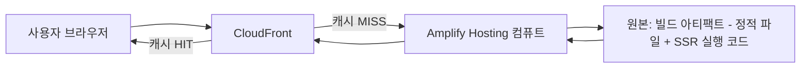

<Callout type="info">
  **이번 편의 결과물:** 코드는 바꾸지 않습니다. Amplify Hosting이 요청을 처리하는 경로와 Next.js 캐시 4층의 이름·역할을 정리하고, `notice-board`가 16편까지 갖출 최종 상태를 확정합니다. · **다루는 개념:** Amplify Hosting 아키텍처(CloudFront → 컴퓨트 → 원본), 지원 Next.js 버전(15)과 컴퓨트 런타임, Next.js 캐시 4층 개요, `notice-board` 청사진
</Callout>

## 이 편에서 만드는 파일

개념 편입니다. 새로 만들거나 고치는 파일이 없습니다. 03편부터 실제로 `notice-board` 프로젝트를 만들며 이 편에서 정리한 구조를 그대로 적용합니다.

## 개념 정리

### Amplify Hosting이 요청을 처리하는 경로

Amplify Hosting에 배포한 Next.js 앱은 요청 하나가 브라우저에서 바로 애플리케이션 코드로 가지 않습니다. CloudFront를 먼저 거칩니다.



| 구간 | 역할 |
|---|---|
| CloudFront | 전 세계에 분산된 CDN. 응답을 엣지에 캐시해두고, 캐시된 응답이 있으면 컴퓨트까지 가지 않고 바로 돌려준다 |
| 컴퓨트 | Next.js 서버 코드를 실제로 실행하는 단위. 정적 페이지가 아니라 요청마다 렌더링이 필요한 SSR 페이지·Route Handler를 처리한다 |
| 원본 | 빌드 결과물(정적 파일과 SSR 실행 코드)이 저장된 곳. 컴퓨트가 필요할 때 여기서 읽는다 |

CloudFront가 캐시를 갖고 있으면(HIT) 컴퓨트까지 요청이 도달하지 않습니다. 캐시가 없으면(MISS) 컴퓨트가 실행되고, 그 결과가 다시 CloudFront에 저장됩니다. 이 과목에서 응답 헤더로 관찰할 `x-cache`(HIT/MISS 여부)와 `age`(캐시가 만들어진 뒤 지난 시간)는 바로 이 CloudFront 계층의 상태를 보여줍니다.

### 이 과목이 다루는 Next.js 버전과 컴퓨트 런타임

Amplify Hosting compute는 지원하는 Next.js 버전과 Node.js 런타임 버전을 명확히 제한합니다.

| 항목 | 지원 범위 | 비고 |
|---|---|---|
| Next.js 버전 | 12부터 15까지 | 16 이상은 아직 지원 목록에 없다 |
| Node.js 런타임 | 20, 22, 24 | 14·16·18은 더 이상 지원하지 않는다 |
| 미지원 기능 | 온디맨드 ISR, Next.js 스트리밍, Edge 미들웨어 | 10편에서 온디맨드 ISR 제약을 직접 확인한다 |

이 과목은 이 표를 근거로 **Next.js 15**를 기준 버전으로 확정합니다. 03편에서 `create-next-app` 실행 시 메이저 버전을 15로 못 박는 이유가 여기 있습니다.

### Next.js 캐시 4층 한눈에 보기

Amplify가 만드는 CDN 캐시와 별개로, Next.js 자체도 서버와 클라이언트에 걸쳐 네 개의 캐시 층을 둡니다. 이 과목은 06~08편에서 이 네 층을 하나씩 직접 확인합니다.

| 캐시 층 | 위치 | 무엇을 저장하는가 | 언제 비워지는가 |
|---|---|---|---|
| 요청 메모이제이션 | 서버(렌더 1회) | 같은 렌더 패스 안에서 중복 호출된 fetch 결과 | 렌더가 끝나면 자동으로 사라진다 |
| 데이터 캐시 | 서버(영구) | fetch 응답 데이터 자체 | `revalidate` 시간 경과, 또는 무효화 호출 |
| 전체 라우트 캐시(ISR) | 서버(영구) | 렌더링된 HTML과 RSC 페이로드 | `revalidate` 시간 경과, 또는 무효화 |
| 라우터 캐시 | 클라이언트(브라우저 메모리) | 방문했거나 프리페치한 라우트의 페이로드 | 새로고침, 일정 시간 경과 |

앞의 두 층(요청 메모이제이션·데이터 캐시)은 06편, 세 번째(전체 라우트 캐시·ISR)는 07편, 네 번째(라우터 캐시)는 08편에서 각각 실제로 켜고 끄며 헤더로 확인합니다. 09편부터는 이 서버 쪽 캐시들이 컴퓨트 인스턴스마다 따로 논다는 문제를 다룹니다. 그 원리는 02편에서 먼저 정리합니다.

### notice-board 청사진

이 과목 전체가 만들고 배포하는 결과물은 공지사항 목록·상세를 보여주는 `notice-board`입니다. 16편을 마쳤을 때의 구조는 다음과 같습니다.

```
notice-board/
├── amplify.yml                    (빌드 캐시 설정 — 14편)
├── cache-handler.js                (외부 공유 캐시 — 13편)
├── data/
│   └── notices.seed.json          (시드 데이터 — 03편)
├── lib/
│   ├── notices-store.js            (공지사항 저장소 — 10편)
│   └── view-counts.js              (조회수 저장소 — 09편, 13편에서 DynamoDB로 전환)
├── next.config.mjs                 (cacheHandler 연결 — 13편)
└── app/
    ├── page.js                     (공지사항 목록 — 03편)
    ├── notices/
    │   └── [id]/
    │       └── page.js             (공지사항 상세)
    └── api/
        └── notices/
            └── route.js             (mock API — 06편)
```

이 트리는 목표 지점을 미리 보여주는 스케치입니다. 실제로는 03편부터 한 단계씩 만듭니다.

## 직접 해보기

<details>
<summary>지금까지 정리한 내용만으로, "서버에 있는 캐시"와 "브라우저에 있는 캐시"를 하나씩 짝지어보세요.</summary>

서버에 있는 캐시는 요청 메모이제이션, 데이터 캐시, 전체 라우트 캐시(ISR) 세 가지입니다. 브라우저에 있는 캐시는 라우터 캐시 하나입니다. CloudFront의 CDN 캐시는 이 넷과 별개로, Next.js 밖에서 Amplify가 관리하는 층입니다.

</details>

## 자주 하는 실수

| 증상 | 원인 | 고치는 법 |
|---|---|---|
| CDN 캐시와 Next.js 데이터 캐시를 같은 것으로 착각한다 | 둘 다 "캐시"라는 이름만 보고 구분하지 않음 | CDN 캐시는 Amplify(CloudFront)가, 나머지 네 층은 Next.js가 관리한다는 점을 구분한다 |
| Amplify가 Next.js 최신 버전을 항상 즉시 지원한다고 가정한다 | 공식 지원 범위를 확인하지 않음 | 새 프로젝트를 시작하기 전 AWS 공식 문서에서 지원 버전을 확인한다 |
| 컴퓨트 인스턴스를 CloudFront와 같은 것으로 여긴다 | 아키텍처 다이어그램을 보지 않음 | CloudFront는 캐시를 갖는 CDN, 컴퓨트는 코드를 실행하는 단위로 구분한다 |

## 확인 문제

<Quiz
  questionNumber={1}
  question="Amplify Hosting compute가 2026년 9월 기준 공식 지원하는 Next.js 버전 범위는"
  options={['11까지', '12부터 15까지', '16 이상만', '버전 제한이 없다']}
  correctAnswer={2}
  explanation="AWS 공식 문서는 Amplify Hosting compute가 Next.js 12부터 15까지를 완전히 관리형으로 지원한다고 명시합니다."
  optionExplanations={['11까지는 이전 Classic SSR 제공자의 범위입니다', '정답입니다', '16 지원은 아직 문서에 없습니다', '지원 범위는 명확히 제한되어 있습니다']}
/>

<Quiz
  questionNumber={2}
  question="요청이 CloudFront에서 캐시 MISS로 처리될 때 벌어지는 일은"
  options={['요청이 그대로 실패한다', '컴퓨트가 실행되어 응답을 만들고 그 결과가 다시 CloudFront에 저장된다', '항상 사용자에게 에러 화면이 보인다', 'CloudFront가 요청을 무시한다']}
  correctAnswer={2}
  explanation="캐시 MISS는 CloudFront에 유효한 캐시가 없다는 뜻이며, 이때 컴퓨트가 실행되어 새 응답을 만들고 이후 요청을 위해 캐시에 저장됩니다."
  optionExplanations={['실패가 아니라 정상적인 처리 경로입니다', '정답입니다', '에러가 아니라 정상 응답입니다', '무시하지 않고 컴퓨트로 전달합니다']}
/>

<Quiz
  questionNumber={3}
  question="Next.js 캐시 4층 중 브라우저 메모리에 저장되는 것은"
  options={['요청 메모이제이션', '데이터 캐시', '전체 라우트 캐시(ISR)', '라우터 캐시']}
  correctAnswer={4}
  explanation="라우터 캐시만 클라이언트(브라우저) 메모리에 저장되고, 나머지 세 층은 서버에 있습니다."
  optionExplanations={['서버의 렌더 1회 동안만 유지됩니다', '서버에 영구적으로 저장됩니다', '서버에 영구적으로 저장됩니다', '정답입니다']}
/>

<Quiz
  questionNumber={4}
  question="Amplify Hosting compute가 더 이상 지원하지 않는 Node.js 런타임은"
  options={['20', '22', '18', '24']}
  correctAnswer={3}
  explanation="Amplify Hosting은 Node.js 14, 16, 18 런타임 지원을 중단했고 20, 22, 24만 지원합니다."
  optionExplanations={['지원 대상입니다', '지원 대상입니다', '정답입니다', '지원 대상입니다']}
/>

## 참고 자료

- [AWS Amplify Docs — Amplify support for Next.js](https://docs.aws.amazon.com/amplify/latest/userguide/ssr-amplify-support.html)
- [AWS Amplify Docs — SSR supported features](https://docs.aws.amazon.com/amplify/latest/userguide/ssr-supported-features.html)
- [AWS Amplify Docs — Deploying SSR applications with Amplify Hosting](https://docs.aws.amazon.com/amplify/latest/userguide/server-side-rendering-amplify.html)
- [AWS Amplify Pricing](https://aws.amazon.com/amplify/pricing/)
