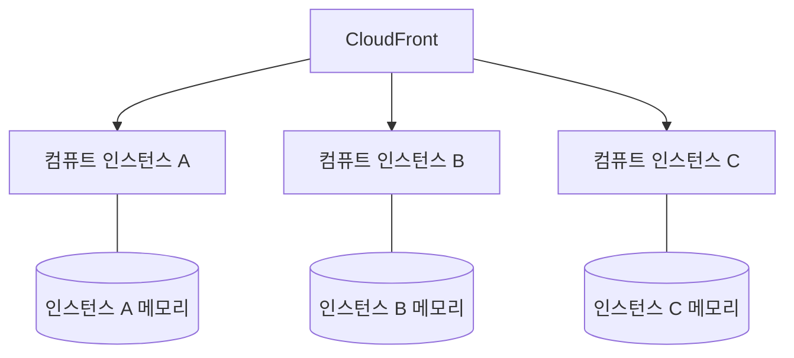

<Callout type="info">
  **이번 편의 결과물:** 코드는 바꾸지 않습니다. 09편에서 실제로 재현할 "캐시가 인스턴스마다 다르다" 현상이 왜 생기는지 원리로 먼저 정리합니다. · **다루는 개념:** 트래픽 증가에 따른 컴퓨트 인스턴스 확장, 로컬 메모리·파일시스템 캐시의 인스턴스별 격리, 09편에서 재현할 문제 정의
</Callout>

## 이 편에서 만드는 파일

개념 편입니다. 새로 만들거나 고치는 파일이 없습니다. 09편에서 이 편의 원리를 실제 코드로 재현합니다.

## 개념 정리

### 요청이 몰리면 인스턴스가 늘어난다

01편에서 정리한 컴퓨트는 요청을 처리하는 실행 단위입니다. 동시에 들어오는 요청이 적을 때는 인스턴스 하나로 충분하지만, 트래픽이 늘면 Amplify Hosting은 요청을 나눠 처리할 컴퓨트 인스턴스를 추가로 띄웁니다. 정확히 몇 개가 언제 뜨는지는 AWS가 세부 구현으로 공개하지 않지만, 확실한 사실 하나는 남습니다. **동시에 여러 인스턴스가 병렬로 요청을 처리한다는 것**입니다.

같은 시각에 보낸 두 요청이 같은 인스턴스로 간다는 보장이 없습니다. CloudFront가 캐시 MISS인 요청을 컴퓨트로 넘길 때마다, 그 요청은 A·B·C 중 어느 인스턴스로든 갈 수 있습니다.

### 인스턴스마다 격리된 로컬 캐시

각 인스턴스는 자신만의 메모리 공간과 파일시스템을 갖습니다. 코드 안에서 모듈 스코프 변수에 값을 저장하거나, 파일을 직접 읽고 쓰는 방식으로 캐시를 흉내 내면, 그 값은 그 인스턴스 안에서만 유효합니다. 다른 인스턴스는 그 값을 전혀 알지 못합니다.

| 저장 방식 | 인스턴스 간 공유 여부 | 이유 |
|---|---|---|
| 모듈 스코프 변수(전역 객체, `Map` 등) | 공유되지 않는다 | 각 인스턴스가 별도의 프로세스 메모리를 갖는다 |
| 인스턴스 로컬 파일시스템에 쓴 파일 | 공유되지 않는다 | 각 인스턴스가 별도의 파일시스템을 갖는다 |
| Next.js 데이터 캐시·전체 라우트 캐시(기본 설정) | 인스턴스별로 따로 쌓인다 | 기본 캐시 저장소가 인스턴스 로컬이다 |
| 외부 데이터베이스(예: DynamoDB) | 공유된다 | 모든 인스턴스가 같은 외부 엔드포인트에 접근한다 |

06~08편에서 확인할 데이터 캐시·전체 라우트 캐시·요청 메모이제이션은 기본 설정에서 모두 인스턴스 로컬입니다. 인스턴스 하나만 떠 있을 때는 문제가 드러나지 않습니다. 인스턴스가 여러 개로 늘어나야 비로소 "같은 데이터인데 인스턴스마다 다른 값이 나온다"는 현상이 생깁니다. 이 표의 마지막 행(외부 데이터베이스)이 12~13편에서 다룰 해결 방향입니다.

### CDN 캐시와 컴퓨트 로컬 캐시의 차이

01편에서 본 CloudFront 캐시는 이 문제와 무관합니다. CloudFront 캐시는 인스턴스 개수와 상관없이 하나의 공유 계층입니다.

| 구분 | CDN(CloudFront) 캐시 | 컴퓨트 로컬 캐시 |
|---|---|---|
| 공유 범위 | 모든 사용자가 같은 캐시를 본다 | 인스턴스마다 따로 쌓인다 |
| 관리 주체 | Amplify(CloudFront) | Next.js 런타임(인스턴스 내부) |
| 이 과목에서 관찰하는 신호 | 응답 헤더(`x-cache`, `age`) | 응답에 노출한 인스턴스 식별자 값의 불일치 |

### 09편에서 재현할 문제

09편은 조회수처럼 애플리케이션이 직접 관리하는 상태를, 응답에 인스턴스 식별자(`process.pid` 등)와 함께 실어 보내는 방식으로 이 현상을 직접 확인합니다. 짧은 시간에 반복 요청을 보냈을 때 식별자 값이 요청마다 바뀐다면, 그 요청들이 서로 다른 인스턴스에서 처리됐다는 뜻입니다. 그 상태에서 각 인스턴스가 응답한 조회수 값을 함께 비교하면, 인스턴스가 바뀔 때마다 값도 따로 늘어나는 것을 눈으로 확인할 수 있습니다.

## 직접 해보기

이 앱을 인스턴스 한 대에만 배포한다면, 이번 편에서 설명한 문제가 발생할까요?

발생하지 않습니다. 인스턴스가 하나뿐이면 로컬 캐시도 하나뿐이라 값이 갈릴 대상 자체가 없습니다. 이 문제는 트래픽이 늘어 인스턴스가 둘 이상으로 늘어날 때만 나타납니다. 그래서 로컬 테스트(`npm run dev`)에서는 재현되지 않고, 실제 트래픽이 있는 배포 환경에서만 드러납니다.

## 자주 하는 실수

| 증상 | 원인 | 고치는 법 |
|---|---|---|
| 로컬에서는 캐시가 잘 도는데 배포하면 값이 들쭉날쭉하다고 당황한다 | 로컬은 인스턴스가 항상 하나뿐이라는 사실을 놓침 | 인스턴스가 여러 개일 수 있는 배포 환경과 로컬을 구분해서 생각한다 |
| CDN 캐시 문제와 인스턴스 로컬 캐시 문제를 같은 원인으로 묶어 진단한다 | 두 계층이 다른 곳에서 관리된다는 점을 모름 | 헤더(`x-cache`)로 CDN 문제인지, 인스턴스 식별자 불일치로 로컬 캐시 문제인지 먼저 구분한다 |
| 모듈 스코프 변수에 캐시를 저장하면 항상 안전하다고 생각한다 | 인스턴스가 하나라는 가정을 무의식적으로 함 | 인스턴스가 여러 개로 늘어날 가능성을 항상 전제하고 설계한다 |

## 확인 문제

<Quiz
  questionNumber={1}
  question="트래픽이 늘어날 때 Amplify Hosting에서 벌어지는 일로 옳은 것은"
  options={['컴퓨트 인스턴스 하나가 모든 요청을 순서대로 처리한다', '여러 컴퓨트 인스턴스가 요청을 나눠 병렬로 처리할 수 있다', 'CloudFront가 요청을 전부 거부한다', '데이터베이스가 자동으로 늘어난다']}
  correctAnswer={2}
  explanation="트래픽이 늘면 Amplify Hosting은 요청을 나눠 처리할 컴퓨트 인스턴스를 추가로 띄워 병렬로 처리합니다."
  optionExplanations={['인스턴스가 하나로 고정되지 않습니다', '정답입니다', '거부가 아니라 분산 처리가 목적입니다', '이 편의 주제는 컴퓨트 인스턴스입니다']}
/>

<Quiz
  questionNumber={2}
  question="모듈 스코프 변수에 저장한 캐시 값이 인스턴스마다 다르게 나오는 근본 원인은"
  options={['코드에 오타가 있어서', '각 인스턴스가 서로 다른 프로세스 메모리를 갖기 때문에', 'CloudFront가 값을 무작위로 바꾸기 때문에', 'Next.js가 변수를 지원하지 않기 때문에']}
  correctAnswer={2}
  explanation="각 컴퓨트 인스턴스는 독립된 프로세스 메모리를 가지므로, 한 인스턴스의 변수 값을 다른 인스턴스는 알 수 없습니다."
  optionExplanations={['오타 문제가 아닙니다', '정답입니다', 'CloudFront는 이 문제와 무관합니다', '변수 자체는 정상 동작합니다']}
/>

<Quiz
  questionNumber={3}
  question="인스턴스 간에 공유되는 저장 방식은"
  options={['인스턴스 로컬 파일시스템', '모듈 스코프 변수', '외부 데이터베이스(예: DynamoDB)', 'Next.js 기본 데이터 캐시']}
  correctAnswer={3}
  explanation="외부 데이터베이스는 모든 인스턴스가 같은 엔드포인트에 접근하므로 값이 공유됩니다."
  optionExplanations={['인스턴스마다 분리됩니다', '인스턴스마다 분리됩니다', '정답입니다', '기본 설정은 인스턴스 로컬입니다']}
/>

<Quiz
  questionNumber={4}
  question="로컬 개발 환경(npm run dev)에서 인스턴스 간 캐시 불일치가 재현되지 않는 이유는"
  options={['로컬 환경은 캐시 기능 자체가 꺼져 있어서', '로컬은 인스턴스가 항상 하나뿐이라서', 'Node.js 버전이 달라서', '로컬에는 CloudFront가 없어서']}
  correctAnswer={2}
  explanation="이 문제는 인스턴스가 둘 이상일 때만 나타나는데, 로컬 개발 서버는 항상 프로세스 하나로만 돌아갑니다."
  optionExplanations={['캐시 기능은 로컬에서도 동작합니다', '정답입니다', 'Node.js 버전과는 무관합니다', 'CloudFront 유무는 이 현상의 원인이 아닙니다']}
/>

## 참고 자료

- [Next.js Docs — Caching and Revalidating (Previous Model)](https://nextjs.org/docs/app/guides/caching-without-cache-components)
