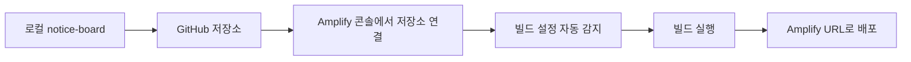

<Callout type="info">
  **이번 편의 결과물:** `notice-board`가 실제 Amplify URL로 접속되고, 응답 헤더에서 `x-cache`, `age`, `cache-control` 값을 처음 관찰합니다. · **다루는 개념:** GitHub 저장소 연결, Amplify 콘솔 앱 생성(빌드 설정 자동 감지), 첫 배포와 무료 티어 범위 확인
</Callout>

<Callout type="warning">
  **비용 안내:** 이 편부터 실제 AWS 계정에 Amplify 앱을 만들어 배포합니다. AWS Amplify Hosting은 매월 빌드 `1,000`분, 스토리지 `5`GB, 데이터 전송 `15`GB, SSR 요청 `500,000`건과 SSR 컴퓨트 `100`GB시간까지 무료입니다. 이 실습 규모(정적 위주의 작은 앱)로는 초과할 가능성이 거의 없지만, 초과하면 빌드는 분당 `$0.01`, 스토리지는 GB당 월 `$0.023`, 데이터 전송은 GB당 `$0.15`, SSR 요청은 `100`만 건당 `$0.30`, SSR 컴퓨트는 GB시간당 `$0.20`이 청구됩니다. 실습을 마친 뒤 앱을 계속 켜둘 필요가 없다면 Amplify 콘솔에서 삭제해 스토리지·빌드 시간이 쌓이지 않게 합니다.
</Callout>

## 이 편에서 만드는 파일

이 편은 코드를 바꾸지 않습니다. `notice-board`를 GitHub 저장소로 올리고, Amplify 콘솔에서 앱을 만들어 배포하는 작업만 합니다.

## 개념 정리

### GitHub 연결부터 배포까지



`create-next-app`은 프로젝트를 만들 때 이미 로컬 git 저장소를 초기화해둡니다. 이 편에서는 그 저장소에 원격 저장소(GitHub)를 연결해 올리고, Amplify가 그 저장소를 구독하도록 설정합니다. 이후로는 `main` 브랜치에 커밋을 `push`할 때마다 Amplify가 변경을 감지해 자동으로 다시 빌드·배포합니다.

### Amplify가 빌드 설정을 감지하는 방식

Amplify는 저장소의 `package.json`을 보고 Next.js 앱임을 자동으로 인식합니다. 빌드 설정(`amplify.yml`에 해당하는 내용)을 저장하는 방법은 두 가지입니다.

| 방법 | 동작 |
|---|---|
| 콘솔에 저장(기본값) | Amplify가 자동 감지한 설정을 콘솔 안에 저장한다. 저장소에는 아무 파일도 추가되지 않는다 |
| 저장소에 `amplify.yml` 파일로 저장 | 콘솔에서 내려받은 `amplify.yml`을 저장소 루트에 커밋한다. 있으면 콘솔 설정보다 이 파일이 우선한다 |

이 편은 첫 번째 방법(콘솔 자동 감지)으로 진행합니다. 빌드 캐시 경로를 직접 지정하려고 `amplify.yml`을 저장소에 추가하는 작업은 14편에서 다룹니다.

### 응답 헤더 미리보기

05편부터 이 헤더들의 값을 직접 조정하고 비교합니다. 이번 편에서는 헤더가 존재한다는 사실과 대략적인 의미만 확인합니다.

| 헤더 | 의미 |
|---|---|
| `x-cache` | CloudFront가 이 응답을 캐시에서 줬는지(`Hit`) 원본까지 갔는지(`Miss`)를 나타낸다 |
| `age` | 이 응답이 CloudFront 캐시에 만들어진 뒤 지난 시간(초) |
| `cache-control` | 이 응답을 얼마나 오래 캐시해도 되는지 서버가 지정한 값 |

### 무료 티어로 이번 편이 충분한 이유

이번 편에서 발생하는 사용량은 빌드 1회, 배포된 앱에 대한 확인 요청 몇 건뿐입니다. 위 경고 문구의 무료 한도(빌드 `1,000`분, SSR 요청 `500,000`건)에 비하면 극히 적은 양이라, 정상적으로 진행하면 과금 걱정 없이 실습할 수 있습니다.

## 실습

<Steps>

### 1. GitHub 저장소 만들고 올리기

GitHub에서 새 저장소를 만듭니다(이름은 `notice-board`, `README` 등은 추가하지 않고 빈 저장소로 생성합니다). 그다음 로컬에서 원격 저장소를 연결합니다.

```text
git add .
git commit -m "notice-board 초기 프로젝트와 시드 데이터"
git remote add origin 본인의_GitHub_저장소_URL
git branch -M main
git push -u origin main
```

### 2. Amplify 콘솔에서 앱 생성 시작

1. AWS 콘솔에서 Amplify 콘솔로 이동합니다.
2. **All apps** 페이지에서 **Create new app**을 선택합니다.
3. **Start building with Amplify** 페이지에서 Git 공급자로 **GitHub**를 선택하고 **Next**를 누릅니다.
4. GitHub 인증 팝업이 뜨면 로그인하고, Amplify가 접근할 저장소 범위에서 `notice-board`를 포함해 승인합니다.

### 3. 저장소·브랜치 선택

**Add repository branch** 페이지에서 다음을 진행합니다.

1. 저장소 목록에서 `notice-board`를 선택합니다.
2. 브랜치 목록에서 `main`을 선택합니다.
3. **Next**를 누릅니다.

### 4. 앱 설정 확인과 서비스 역할 지정

**App settings** 페이지로 이동합니다.

1. Amplify가 Next.js SSR 앱임을 자동으로 감지했는지 확인합니다(별도 설정을 손댈 필요는 없습니다).
2. 서비스 역할(IAM service role) 항목에서 **Create and use a new service role**을 선택합니다. 이 역할은 Amplify가 배포 로그를 CloudWatch Logs로 보낼 때 필요합니다.
3. **Next**를 누릅니다.

### 5. 검토와 배포

**Review** 페이지에서 지금까지 선택한 내용을 확인하고 **Save and deploy**를 누릅니다.

### 6. 배포 진행 확인

앱 대시보드에 **Provision → Build → Deploy → Verify** 네 단계가 순서대로 표시됩니다. 모두 초록색으로 바뀌면 배포가 끝난 것입니다. 보통 몇 분 안에 끝납니다.

### 7. 배포된 URL로 접속

앱 대시보드 상단에 표시된 도메인(예: `https://main.d1a2b3c4d5e6f7.amplifyapp.com` 형태)을 클릭해 접속합니다.

### 8. 응답 헤더 확인

macOS·Linux 또는 Git Bash에서는 아래처럼 확인합니다.

```text
curl -I https://본인의_amplify_도메인
```

Windows PowerShell에서는 `curl`이 `Invoke-WebRequest`의 별칭이라 옵션 동작이 다릅니다. 확장자를 붙여 원래의 curl을 호출합니다.

```text
curl.exe -I https://본인의_amplify_도메인
```

명령을 쓰기 어려운 환경이면 브라우저 개발자 도구의 **Network** 탭에서 문서 요청을 선택해 **Response Headers**를 확인합니다.

</Steps>

## 확인

- Amplify 앱 대시보드에 `Provision`, `Build`, `Deploy`, `Verify` 네 단계가 모두 성공으로 표시됩니다.
- 배포된 URL로 접속하면 로컬과 동일하게 "notice-board" 제목과 공지사항 7건 목록이 보입니다.
- 응답 헤더 목록에 `x-cache`, `age`, `cache-control`이 포함되어 있습니다(정확한 값 해석은 05편에서 다룹니다. 지금은 세 헤더가 존재한다는 사실만 확인합니다).
- Amplify 콘솔 좌측 사용량(Usage) 화면에서 이번 배포로 소모한 빌드 시간이 무료 한도(월 `1,000`분)에 비해 매우 적다는 것을 확인합니다.

## 직접 해보기

1. Amplify 콘솔 앱 대시보드에서 방금 배포의 빌드 로그를 열어 **Provision**, **Build**, **Deploy**, **Verify** 각 단계가 몇 초(또는 몇 분) 걸렸는지 적어보세요.
2. 같은 URL로 `curl -I`(또는 `curl.exe -I`)를 두세 번 연달아 실행해 `age` 값이 어떻게 바뀌는지 기록해두세요. 05편에서 이 값을 다시 비교합니다.

<details>
<summary>정답 보기</summary>

빌드 로그의 각 단계 소요 시간은 배포마다 달라지지만, 일반적으로 **Provision**(인프라 준비)이 몇 초, **Build**(`npm ci`, `npm run build`)가 1~2분 안팎으로 가장 오래 걸리고, **Deploy**와 **Verify**는 각각 짧게 끝납니다. 이 시간은 14편에서 빌드 캐시를 적용한 뒤 다시 비교합니다.

`curl -I`를 연달아 실행하면 `age` 값이 매 요청마다 증가하거나, 캐시가 아직 없을 때는 `x-cache`가 `Miss`로 나올 수 있습니다. 정확한 원인(캐시 정책이 아직 기본값이라는 점)은 05편에서 커스텀 헤더를 설정하며 다시 다룹니다.

</details>

## 자주 하는 실수

| 증상 | 원인 | 고치는 법 |
|---|---|---|
| GitHub 저장소 목록에 `notice-board`가 안 보임 | GitHub 인증 시 Amplify 앱의 저장소 접근 범위에 해당 저장소를 포함하지 않음 | GitHub의 Amplify 앱 설정에서 저장소 접근 범위를 수정하고 다시 시도한다 |
| **Build** 단계에서 실패 | `package.json`의 `build` 스크립트가 없거나 수정됨 | `create-next-app`이 만든 기본 `build` 스크립트(`next build`)가 그대로인지 확인한다 |
| 배포는 성공했는데 화면이 비어 보임 | 브라우저 캐시가 이전 상태를 보여줌 | 강력 새로고침(캐시 무시 새로고침)으로 다시 확인한다 |
| `curl -I` 실행 시 옵션 인식 오류 | Windows PowerShell의 `curl` 별칭이 `Invoke-WebRequest`를 가리킴 | `curl.exe -I`처럼 확장자를 붙이거나 브라우저 개발자 도구를 사용한다 |
| 무료 티어 초과가 걱정돼 배포를 미룸 | 실습 규모와 무료 한도를 비교해보지 않음 | 이 실습의 빌드·요청 수는 무료 한도에 비해 매우 적다는 것을 확인하고 진행한다 |

## 확인 문제

<Quiz
  questionNumber={1}
  question="Amplify 콘솔이 amplify.yml 없이도 Next.js 앱을 배포할 수 있는 이유는"
  options={['Next.js 앱은 빌드 설정이 필요 없어서', 'Amplify가 package.json을 보고 빌드 설정을 자동으로 감지해 콘솔에 저장할 수 있어서', 'amplify.yml은 존재하지 않는 파일이라서', 'GitHub가 빌드를 대신 실행해서']}
  correctAnswer={2}
  explanation="Amplify는 저장소의 package.json을 분석해 Next.js 앱임을 자동으로 인식하고, 그 빌드 설정을 저장소 파일 없이도 콘솔 안에 저장할 수 있습니다."
  optionExplanations={['빌드 설정 자체는 필요합니다', '정답입니다', 'amplify.yml은 14편에서 실제로 다룹니다', 'GitHub는 저장소 호스팅만 담당합니다']}
/>

<Quiz
  questionNumber={2}
  question="Amplify Hosting 무료 티어에서 매월 무료로 제공되는 SSR 요청 수는"
  options={['5만 건', '10만 건', '50만 건', '100만 건']}
  correctAnswer={3}
  explanation="AWS Amplify Pricing 기준 SSR 요청은 월 50만 건까지 무료입니다."
  optionExplanations={['실제 무료 한도보다 적습니다', '실제 무료 한도보다 적습니다', '정답입니다', '실제 무료 한도보다 많습니다']}
/>

<Quiz
  questionNumber={3}
  question="GitHub 저장소를 Amplify에 연결한 뒤 main 브랜치에 커밋을 push하면 벌어지는 일은"
  options={['아무 일도 자동으로 벌어지지 않는다', 'Amplify가 변경을 감지해 자동으로 다시 빌드하고 배포한다', 'GitHub가 배포를 직접 수행한다', '수동으로 Deploy 버튼을 눌러야만 배포된다']}
  correctAnswer={2}
  explanation="저장소가 연결된 이후에는 지정한 브랜치에 커밋이 올라올 때마다 Amplify가 자동으로 빌드·배포를 다시 실행합니다."
  optionExplanations={['자동 배포가 이 연결의 핵심 기능입니다', '정답입니다', '배포 실행 주체는 Amplify입니다', '자동 배포이므로 수동 클릭이 필요 없습니다']}
/>

<Quiz
  questionNumber={4}
  question="무료 티어를 초과했을 때 SSR 컴퓨트 사용량에 부과되는 요금은"
  options={['GB시간당 0.02달러', 'GB시간당 0.20달러', '요청 100만 건당 20달러', '월 20달러 고정']}
  correctAnswer={2}
  explanation="AWS Amplify Pricing 기준 SSR 컴퓨트는 무료 티어 초과 시 GB시간당 0.20달러가 청구됩니다."
  optionExplanations={['실제 요금의 10분의 1입니다', '정답입니다', '이것은 컴퓨트가 아니라 요청 과금 방식과 단위가 다릅니다', '고정 요금제가 아니라 사용량 기반 요금입니다']}
/>

## 참고 자료

- [AWS Amplify Docs — Deploying SSR applications with Amplify Hosting](https://docs.aws.amazon.com/amplify/latest/userguide/server-side-rendering-amplify.html)
- [AWS Amplify Docs — Configuring the build settings for an Amplify application](https://docs.aws.amazon.com/amplify/latest/userguide/build-settings.html)
- [AWS Amplify Pricing](https://aws.amazon.com/amplify/pricing/)
