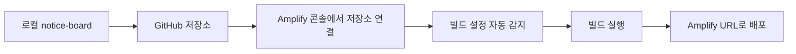

<Callout type="warning">
  **비용 안내:** AWS Amplify Hosting의 무료 한도와 초과 요금은 계정·리전·시점에 따라 달라질 수 있습니다. 실제 배포 전에는 AWS 공식 요금표와 결제 알림 설정을 먼저 확인해야 합니다.
</Callout>

## 개념 정리

### GitHub 연결부터 배포까지

```mermaid
flowchart LR
  A[로컬 notice-board] --> B[GitHub 저장소]
  B --> C[Amplify 콘솔에서 저장소 연결]
  C --> D[빌드 설정 자동 감지]
  D --> E[빌드 실행]
  E --> F[Amplify URL로 배포]
```

`create-next-app`은 프로젝트를 만들 때 이미 로컬 git 저장소를 초기화해둡니다. 이후로는 `main` 브랜치에 커밋을 `push`할 때마다 Amplify가 변경을 감지해 자동으로 다시 빌드·배포합니다.

### Amplify가 빌드 설정을 감지하는 방식

Amplify는 저장소의 `package.json`을 보고 Next.js 앱임을 자동으로 인식합니다. 빌드 설정(`amplify.yml`에 해당하는 내용)을 저장하는 방법은 두 가지입니다.

| 방법 | 동작 |
|---|---|
| 콘솔에 저장(기본값) | Amplify가 자동 감지한 설정을 콘솔 안에 저장한다. 저장소에는 아무 파일도 추가되지 않는다 |
| 저장소에 `amplify.yml` 파일로 저장 | 콘솔에서 내려받은 `amplify.yml`을 저장소 루트에 커밋한다. 있으면 콘솔 설정보다 이 파일이 우선한다 |

이 편은 첫 번째 방법(콘솔 자동 감지)으로 진행합니다. 빌드 캐시 경로를 직접 지정하려고 `amplify.yml`을 저장소에 추가하는 작업은 14편에서 다룹니다.

### 응답 헤더 미리보기

| 헤더 | 의미 |
|---|---|
| `x-cache` | CloudFront가 이 응답을 캐시에서 줬는지(`Hit`) 원본까지 갔는지(`Miss`)를 나타낸다 |
| `age` | 이 응답이 CloudFront 캐시에 만들어진 뒤 지난 시간(초) |
| `cache-control` | 이 응답을 얼마나 오래 캐시해도 되는지 서버가 지정한 값 |

### 무료 티어로 이번 편이 충분한 이유

이번 편에서 발생하는 사용량은 빌드 1회, 배포된 앱에 대한 확인 요청 몇 건뿐입니다. 위 경고 문구의 무료 한도(빌드 `1,000`분, SSR 요청 `500,000`건)에 비하면 극히 적은 양이라, 정상적으로 진행하면 과금 걱정 없이 예시할 수 있습니다.

## 자주 하는 실수

| 증상 | 원인 | 고치는 법 |
|---|---|---|
| GitHub 저장소 목록에 `notice-board`가 안 보임 | GitHub 인증 시 Amplify 앱의 저장소 접근 범위에 해당 저장소를 포함하지 않음 | GitHub의 Amplify 앱 설정에서 저장소 접근 범위를 수정하고 다시 시도한다 |
| **Build** 단계에서 실패 | `package.json`의 `build` 스크립트가 없거나 수정됨 | `create-next-app`이 만든 기본 `build` 스크립트(`next build`)가 그대로인지 확인한다 |
| 배포는 성공했는데 화면이 비어 보임 | 브라우저 캐시가 이전 상태를 보여줌 | 강력 새로고침(캐시 무시 새로고침)으로 다시 확인한다 |

## 확인 문제

<Quiz
  questionNumber={1}
  question={"Amplify 콘솔이 amplify.yml 없이도 Next.js 앱을 배포할 수 있는 이유는"}
  options={["Next.js 앱은 빌드 설정이 필요 없어서","Amplify가 package.json을 보고 빌드 설정을 자동으로 감지해 콘솔에 저장할 수 있어서","amplify.yml은 존재하지 않는 파일이라서","GitHub가 빌드를 대신 실행해서"]}
  correctAnswer={2}
  explanation={"Amplify는 저장소의 package.json을 분석해 Next.js 앱임을 자동으로 인식하고, 그 빌드 설정을 저장소 파일 없이도 콘솔 안에 저장할 수 있습니다."}
/>

<Quiz
  questionNumber={2}
  question={"Amplify Hosting 무료 티어에서 매월 무료로 제공되는 SSR 요청 수는"}
  options={["5만 건","10만 건","50만 건","100만 건"]}
  correctAnswer={3}
  explanation={"AWS Amplify Pricing 기준 SSR 요청은 월 50만 건까지 무료입니다."}
/>

<Quiz
  questionNumber={3}
  question={"GitHub 저장소를 Amplify에 연결한 뒤 main 브랜치에 커밋을 push하면 벌어지는 일은"}
  options={["아무 일도 자동으로 벌어지지 않는다","Amplify가 변경을 감지해 자동으로 다시 빌드하고 배포한다","GitHub가 배포를 직접 수행한다","수동으로 Deploy 버튼을 눌러야만 배포된다"]}
  correctAnswer={2}
  explanation={"저장소가 연결된 이후에는 지정한 브랜치에 커밋이 올라올 때마다 Amplify가 자동으로 빌드·배포를 다시 실행합니다."}
/>

## 참고 자료

- [AWS Amplify Docs — Deploying SSR applications with Amplify Hosting](https://docs.aws.amazon.com/amplify/latest/userguide/server-side-rendering-amplify.html)
- [AWS Amplify Docs — Configuring the build settings for an Amplify application](https://docs.aws.amazon.com/amplify/latest/userguide/build-settings.html)
- [AWS Amplify Pricing](https://aws.amazon.com/amplify/pricing/)
