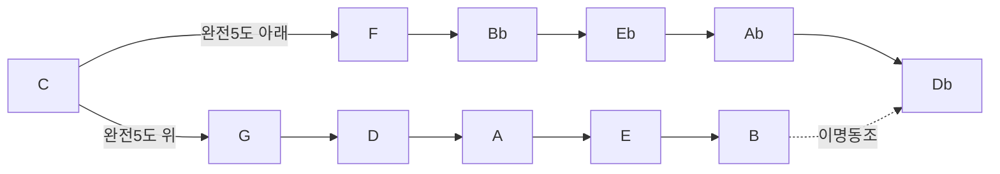

<Callout type="info">
  **이번 편의 목표:** 5도권이 왜 완전5도씩 도는지 설명하고, 자주 쓰는 조 C·F·G·Bb·Eb의 조표(샵·플랫 개수)를 악보만 보고 바로 읽을 수 있습니다. **연습 시간 목안:** 하루 20~30분 × 3일
</Callout>

## 개념 (짧게)

04편에서 C·G·F 메이저 스케일을 만들 때, G메이저는 F샵이 하나 필요했고 F메이저는 B플랫이 하나 필요했습니다. 조가 바뀔 때마다 필요한 샵·플랫 개수가 규칙적으로 늘어나는데, 이 규칙을 한눈에 정리한 지도가 **5도권**(circle of fifths)입니다.

### 완전5도씩 이동하는 이유

C에서 완전5도 위로 올라가면 G입니다. G메이저 스케일을 온-온-반-온-온-온-반 공식으로 만들면 7번째 음(F)이 이끔음 역할을 하도록 F샵이 필요합니다. G에서 다시 완전5도 위로 올라가면 D이고, D메이저는 F샵에 더해 C샵이 필요합니다. 이렇게 완전5도씩 계속 올라가면 샵이 하나씩 늘어나며 12개 조를 한 바퀴 돌아 다시 C로 돌아옵니다.

반대로 완전5도 아래(=완전4도 위)로 이동하면 플랫이 하나씩 늘어납니다. C 아래 완전5도는 F이고, F메이저는 B플랫이 필요합니다.



### 샵·플랫 순서 암기법

샵이 늘어나는 순서와 플랫이 늘어나는 순서는 서로 정반대입니다.

| 방향 | 늘어나는 순서 | 암기 문장 |
|---|---|---|
| 샵(#) | F C G D A E B | Father Charles Goes Down And Ends Battle |
| 플랫(b) | B E A D G C F | Battle Ends And Down Goes Charles' Father |

조표에 적힌 샵·플랫의 개수만 세면 조 이름을 바로 알 수 있습니다.

| 조표 개수 | 메이저 조(샵 방향) | 메이저 조(플랫 방향) |
|---|---|---|
| 0 | C | C |
| 1 | G(F#) | F(Bb) |
| 2 | D(F#,C#) | Bb(Bb,Eb) |
| 3 | A(F#,C#,G#) | Eb(Bb,Eb,Ab) |
| 4 | E(F#,C#,G#,D#) | Ab(Bb,Eb,Ab,Db) |

빠르게 읽는 요령도 있습니다. 샵 조표는 **마지막 샵에서 반음 올린 음**이 조 이름이고(예: F#·C# 두 개면 마지막이 C#, 반음 올리면 D메이저), 플랫 조표는 **마지막에서 두 번째 플랫**이 조 이름입니다(예: Bb·Eb·Ab 세 개면 두 번째에서 두 번째인 Eb가 조 이름). 플랫이 1개(F메이저)뿐일 때는 예외로 그냥 외웁니다.

> **쉽게 말하면:** 5도권은 완전5도씩 이동할 때마다 샵(또는 플랫)이 하나씩 늘어난다는 사실을 원 모양으로 정리한 지도입니다.

### 12개 조를 한 바퀴 돌면

5도권을 끝까지 돌면 샵 6개(F#메이저)와 플랫 6개(Gb메이저)가 같은 자리에서 만납니다. 두 조는 실제로 같은 소리인데 표기만 다른 조로, 이런 관계를 **이명동조**(enharmonic key)라고 부릅니다. 지금 단계에서는 "한 바퀴 돌면 겹치는 지점이 있다" 정도만 알아 둡니다.

| 샵 개수 | 메이저 조 | 나란한 마이너 |
|---|---|---|
| 0 | C | Am |
| 1 | G | Em |
| 2 | D | Bm |
| 3 | A | F#m |
| 4 | E | C#m |
| 5 | B | G#m |
| 6 | F#(=Gb) | D#m(=Ebm) |

| 플랫 개수 | 메이저 조 | 나란한 마이너 |
|---|---|---|
| 0 | C | Am |
| 1 | F | Dm |
| 2 | Bb | Gm |
| 3 | Eb | Cm |
| 4 | Ab | Fm |
| 5 | Db | Bbm |
| 6 | Gb(=F#) | Ebm(=D#m) |

각 메이저 조 옆의 나란한 마이너는 05편에서 배운 개념입니다. 조표가 같으면 메이저-마이너 짝도 정해져 있어, 조표 하나만 외우면 메이저 조와 마이너 조를 동시에 알 수 있습니다.

### 재즈에서 먼저 외울 조 5개

이 과목은 C·F·G·B♭·E♭ 다섯 조를 우선 암기 대상으로 삼습니다. 관악기(색소폰·트럼펫) 중심으로 발전한 재즈 스탠다드는 B♭·E♭조로 이조된 악보가 많고, 블루스(14편~)도 F·B♭·C로 자주 연주되기 때문입니다.

다섯 조를 5도권 위에서 보면 서로 이웃해 있습니다. C-G는 오른쪽 이웃, C-F는 왼쪽 이웃, F-Bb-Eb는 왼쪽으로 연이은 세 칸입니다. 즉 이 다섯 조는 5도권에서 무작위로 고른 것이 아니라, 한 구간에 몰려 있는 인접한 조들입니다. 이 구간만 확실히 외우면 나머지 7개 조는 이후 필요할 때 5도권 규칙으로 그때그때 계산해도 충분합니다.

## 건반과 악보로 보기

G메이저(#1개)와 D메이저(#2개)에서 검은건반이 추가되는 위치입니다.

```text
      C#    D#          F#    G#    A#
   ┌────┬────┬────┬────┬────┬────┬────┬────┐
   │ C  │ D  │ E  │ F  │ G  │ A  │ B  │ C  │
   └────┴────┴────┴────┴────┴────┴────┴────┘
G메이저: 흰건반 그대로 + F# 하나만 검은건반
D메이저: 흰건반 + F#·C# 두 개 검은건반
```

C-G-D 세 조의 스케일을 나란히 놓고 악보에 조표가 어떻게 붙는지 비교합니다.

<AbcScore
  title="C메이저 (조표 없음)"
  abc={`X:1
T:C Major
M:4/4
L:1/4
Q:1/4=90
K:C
C D E F | G A B c |]
`}
/>

<AbcScore
  title="G메이저 (F# 1개)"
  abc={`X:1
T:G Major
M:4/4
L:1/4
Q:1/4=90
K:G
G A B c | d e f g |]
`}
/>

<AbcScore
  title="D메이저 (F#·C# 2개)"
  abc={`X:1
T:D Major
M:4/4
L:1/4
Q:1/4=90
K:D
D E F G | A B c d |]
`}
/>

`K:G`, `K:D`로 조를 지정하면 악보 맨 앞에 조표(#)가 자동으로 붙고, 스케일 안의 F·C 음이 자동으로 F샵·C샵으로 연주됩니다. 음표 앞에 매번 샵을 적지 않아도 되는 이유가 바로 이 조표입니다.

## 연습 과제

<Steps>

### 1. 샵 순서 암기 문장 외우기

"Father Charles Goes Down And Ends Battle"을 소리 내어 외웁니다. 첫 글자만 따면 F-C-G-D-A-E-B, 샵이 늘어나는 순서와 정확히 같습니다.

### 2. C-G-D-A 손으로 연주하며 조표 확인

메트로놈 70BPM으로 C메이저(조표 없음) → G메이저(F#) → D메이저(F#·C#) → A메이저(F#·C#·G#) 순서로 오른손 스케일을 한 옥타브씩 칩니다. 조가 바뀔 때마다 새로 추가되는 검은건반이 어느 것인지 소리 내어 말한 뒤 칩니다.

### 3. F-Bb-Eb 손으로 연주하며 조표 확인

같은 방식으로 F메이저(Bb) → Bb메이저(Bb·Eb) → Eb메이저(Bb·Eb·Ab) 순서로 칩니다. 이 세 조는 재즈에서 특히 자주 쓰이므로 손 모양을 확실히 기억해 둡니다.

### 4. 조표 개수 빠르게 읽기 드릴

임의의 조표(예: 샵 3개)를 보고 5초 안에 조 이름을 답하는 연습을 합니다. 샵은 마지막 샵에서 반음 위, 플랫은 마지막에서 두 번째 플랫이라는 규칙을 소리 내어 말하며 확인합니다. 10개 조표를 준비해 하루 1세트씩 풉니다.

### 5. 5도권을 손으로 그려 보기

빈 종이에 시계 모양 원을 그리고 12시 방향에 C를 적습니다. 시계 방향으로 완전5도씩(G-D-A-E-B) 채우고, 반시계 방향으로 완전5도씩(F-Bb-Eb-Ab-Db) 채웁니다. 외운 것을 확인하는 용도이므로 막히면 표를 다시 보고 채워 넣습니다. 하루 1번, 3일 반복하면 12개 조 배치가 자연스럽게 외워집니다.

</Steps>

## 곡에 적용하기

5도권은 조표만이 아니라 코드 진행에서도 그대로 나타납니다. I-IV-V 진행에서 IV는 으뜸음의 완전5도 아래(=5도권에서 왼쪽 이웃), V는 완전5도 위(=오른쪽 이웃)에 있습니다. 07편에서 배울 다이어토닉 코드의 기능(서브도미넌트·도미넌트)이 사실은 5도권 위의 이웃 관계라는 점을 미리 확인합니다.

왜 하필 이웃한 두 조(IV·V)를 가장 많이 쓸까요. 5도권에서 가까운 조일수록 공유하는 음이 많아 자연스럽게 연결됩니다. C와 F는 6개 음(C D E F G A)을 공유하고, C와 G도 6개 음(C D E G A B)을 공유합니다. 반대로 5도권에서 멀리 떨어진 조로 갑자기 이동하면 공유하는 음이 적어 소리가 뚝 끊긴 느낌을 줍니다. I-IV-V가 오랫동안 가장 기본적인 진행으로 쓰인 이유가 바로 이 5도권 인접성입니다.

| 마디 | 코드 | 로마 숫자 | 으뜸음(F)과의 5도권 관계 |
|---|---|---|---|
| 1 | `F` | I | 기준(으뜸음) |
| 2 | `Bb` | IV | 완전5도 아래(왼쪽 이웃) |
| 3 | `C7` | V7 | 완전5도 위(오른쪽 이웃) |
| 4 | `F` | I | 기준으로 복귀 |

<AbcScore
  title="I - IV - V7 - I in F (재즈에서 자주 쓰는 조)"
  abc={`X:1
T:I-IV-V7-I in F
M:4/4
L:1/4
Q:1/4=80
K:F
"F"[FAc]4 | "Bb"[B,DF]4 | "C7"[CEGB]4 | "F"[FAc]4 |]
`}
/>

이 코드는 눈과 귀로만 확인합니다. 손으로 이런 코드를 직접 짚는 훈련은 09편(보이싱)부터 본격적으로 다룹니다.

## 자주 하는 실수

| 증상 | 원인 | 고치는 법 |
|---|---|---|
| 샵 순서와 플랫 순서를 섞어서 외움 | 두 순서가 정반대라는 점을 놓침 | 플랫 순서는 샵 순서를 거꾸로 읽은 것(B-E-A-D-G-C-F)이라고 다시 확인 |
| 조표 개수는 맞는데 조 이름을 반대로 답함 | 샵 조표를 플랫 조 규칙으로 읽거나 그 반대로 읽음 | 악보 맨 앞 기호가 샵인지 플랫인지 먼저 확인한 뒤 해당 규칙 적용 |
| F메이저(플랫 1개)의 조 이름을 못 찾음 | "마지막에서 두 번째 플랫" 규칙은 플랫이 2개 이상일 때만 적용됨 | 플랫 1개는 예외로 F메이저라고 그냥 암기 |
| 5도권에서 시계 방향과 반시계 방향을 헷갈림 | 어느 쪽이 샵 증가 방향인지 헷갈림 | 시계 방향(오른쪽)은 샵 증가, 반시계 방향(왼쪽)은 플랫 증가로 통일해서 기억 |
| F#메이저와 Gb메이저를 다른 조라고 생각함 | 이명동조 개념을 모름 | 소리는 같고 표기(샵 6개 vs 플랫 6개)만 다른 조라는 점을 확인 |

## 마무리 복습

<Quiz
  questionNumber={1}
  question="5도권에서 한 칸 이동할 때마다 음정 관계로 올바른 것은?"
  options={['완전4도씩 이동한다(항상)', '완전5도씩 이동한다', '장2도씩 이동한다', '단3도씩 이동한다']}
  correctAnswer={2}
  explanation="5도권은 완전5도씩 이동하며 조를 배열한 지도입니다. 반대 방향으로 보면 완전4도 이동과 같습니다."
  optionExplanations={['방향에 따라 완전4도로도 볼 수 있지만 기준은 완전5도입니다', '정답입니다', '장2도는 스케일 안의 인접 음 관계입니다', '단3도는 코드 구성에 쓰이는 간격입니다']}
/>

<Quiz
  questionNumber={2}
  question="샵이 늘어나는 순서로 올바른 것은?"
  options={['B E A D G C F', 'F C G D A E B', 'C D E F G A B', 'F G A B C D E']}
  correctAnswer={2}
  explanation="샵은 F-C-G-D-A-E-B 순서로 늘어납니다. 암기 문장 Father Charles Goes Down And Ends Battle의 첫 글자와 일치합니다."
  optionExplanations={['이것은 플랫이 늘어나는 순서(샵 순서를 거꾸로 읽은 것)입니다', '정답입니다', '이것은 단순 음이름 나열이며 조표 순서가 아닙니다', '순서가 실제 샵 증가 순서와 다릅니다']}
/>

<Quiz
  questionNumber={3}
  question="조표에 샵이 2개(F#, C#) 있을 때 메이저 조 이름은?"
  options={['C메이저', 'G메이저', 'D메이저', 'A메이저']}
  correctAnswer={3}
  explanation="마지막 샵인 C#에서 반음 올리면 D가 되므로 D메이저입니다."
  optionExplanations={['C메이저는 조표가 없습니다', 'G메이저는 샵이 1개(F#)뿐입니다', '정답입니다', 'A메이저는 샵이 3개(F#,C#,G#)입니다']}
/>

<Quiz
  questionNumber={4}
  question="조표에 플랫이 3개(Bb, Eb, Ab) 있을 때 메이저 조 이름은?"
  options={['F메이저', 'Bb메이저', 'Eb메이저', 'Ab메이저']}
  correctAnswer={3}
  explanation="플랫이 2개 이상일 때는 마지막에서 두 번째 플랫이 조 이름입니다. Bb-Eb-Ab 중 마지막에서 두 번째는 Eb이므로 Eb메이저입니다."
  optionExplanations={['F메이저는 플랫이 1개뿐입니다', 'Bb메이저는 플랫이 2개(Bb,Eb)입니다', '정답입니다', 'Ab메이저는 플랫이 4개(Bb,Eb,Ab,Db)입니다']}
/>

<Quiz
  questionNumber={5}
  question="이 과목에서 우선 암기 대상으로 정한 조 5개는?"
  options={['C, D, E, F, G', 'C, F, G, Bb, Eb', 'A, B, C, D, E', 'F#, C#, G#, D#, A#']}
  correctAnswer={2}
  explanation="관악기 중심 재즈 스탠다드와 블루스에서 자주 쓰이는 C·F·G·Bb·Eb 다섯 조를 우선 암기 대상으로 삼습니다."
  optionExplanations={['샵 순서로 나열한 것일 뿐 우선 암기 조가 아닙니다', '정답입니다', '무작위로 나열한 조입니다', '샵 조표 이름을 그대로 나열한 것으로 우선 암기 대상이 아닙니다']}
/>

<Quiz
  questionNumber={6}
  question="I-IV-V 진행에서 IV와 V가 으뜸음(I)과 맺는 5도권 관계는?"
  options={['IV는 완전5도 위, V는 완전5도 아래', 'IV는 완전5도 아래, V는 완전5도 위', '둘 다 완전5도 위', '둘 다 완전5도 아래']}
  correctAnswer={2}
  explanation="5도권에서 IV는 으뜸음의 완전5도 아래(왼쪽 이웃), V는 완전5도 위(오른쪽 이웃)에 위치합니다."
  optionExplanations={['방향이 반대로 서술되어 있습니다', '정답입니다', 'IV는 아래쪽입니다', 'V는 위쪽입니다']}
/>

## 참고 자료

- [musictheory.net - Lessons](https://www.musictheory.net/lessons)
- [Wikipedia - Circle of fifths](https://en.wikipedia.org/wiki/Circle_of_fifths)
