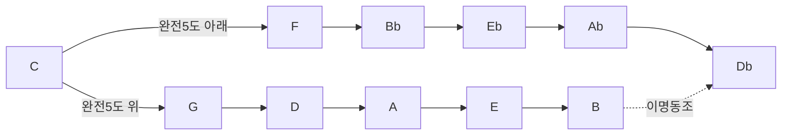

## 개념 (짧게)

04편에서 C·G·F 메이저 스케일을 만들 때, G메이저는 F샵이 하나 필요했고 F메이저는 B플랫이 하나 필요했습니다. 조가 바뀔 때마다 필요한 샵·플랫 개수가 규칙적으로 늘어나는데, 이 규칙을 한눈에 정리한 지도가 **5도권**(circle of fifths)입니다.

### 완전5도씩 이동하는 이유

C에서 완전5도 위로 올라가면 G입니다. G메이저 스케일을 온-온-반-온-온-온-반 공식으로 만들면 7번째 음(F)이 이끔음 역할을 하도록 F샵이 필요합니다.

반대로 완전5도 아래(=완전4도 위)로 이동하면 플랫이 하나씩 늘어납니다. C 아래 완전5도는 F이고, F메이저는 B플랫이 필요합니다.


```mermaid
graph LR
    C -->|"완전5도 위"| G --> D --> A --> E --> B
    C -->|"완전5도 아래"| F --> Bb["Bb"] --> Eb["Eb"] --> Ab["Ab"] --> Db["Db"]
    B -.->|"이명동조"| Db
```

### 샵·플랫 순서 암기법

샵이 늘어나는 순서와 플랫이 늘어나는 순서는 서로 정반대입니다.

| 방향 | 늘어나는 순서 | 암기 문장 |
|---|---|---|
| 샵(#) | F C G D A E B | Father Charles Goes Down And Ends Battle |
| 플랫(b) | B E A D G C F | Battle Ends And Down Goes Charles' Father |

조표에 적힌 샵·플랫의 개수만 세면 조 이름을 바로 알 수 있습니다.

| 조표 개수 | 메이저 조(샵 방향) | 메이저 조(플랫 방향) |
|---|---|---|
| 0 | C | C |
| 1 | G(F#) | F(Bb) |
| 2 | D(F#,C#) | Bb(Bb,Eb) |
| 3 | A(F#,C#,G#) | Eb(Bb,Eb,Ab) |
| 4 | E(F#,C#,G#,D#) | Ab(Bb,Eb,Ab,Db) |

빠르게 읽는 요령도 있습니다. 샵 조표는 **마지막 샵에서 반음 올린 음**이 조 이름이고(예: F#·C# 두 개면 마지막이 C#, 반음 올리면 D메이저), 플랫 조표는 **마지막에서 두 번째 플랫**이 조 이름입니다(예: Bb·Eb·Ab 세 개면 두 번째에서 두 번째인 Eb가 조 이름).

### 12개 조를 한 바퀴 돌면

5도권을 끝까지 돌면 샵 6개(F#메이저)와 플랫 6개(Gb메이저)가 같은 자리에서 만납니다. 두 조는 실제로 같은 소리인데 표기만 다른 조로, 이런 관계를 **이명동조**(enharmonic key)라고 부릅니다. 지금 단계에서는 "한 바퀴 돌면 겹치는 지점이 있다" 정도만 알아 둡니다.

| 샵 개수 | 메이저 조 | 나란한 마이너 |
|---|---|---|
| 0 | C | Am |
| 1 | G | Em |
| 2 | D | Bm |
| 3 | A | F#m |
| 4 | E | C#m |
| 5 | B | G#m |
| 6 | F#(=Gb) | D#m(=Ebm) |

| 플랫 개수 | 메이저 조 | 나란한 마이너 |
|---|---|---|
| 0 | C | Am |
| 1 | F | Dm |
| 2 | Bb | Gm |
| 3 | Eb | Cm |
| 4 | Ab | Fm |
| 5 | Db | Bbm |
| 6 | Gb(=F#) | Ebm(=D#m) |

각 메이저 조 옆의 나란한 마이너는 05편에서 배운 개념입니다. 조표가 같으면 메이저-마이너 짝도 정해져 있어, 조표 하나만 외우면 메이저 조와 마이너 조를 동시에 알 수 있습니다.

### 재즈에서 먼저 외울 조 5개

이 과목은 C·F·G·B♭·E♭ 다섯 조를 우선 암기 대상으로 삼습니다. 관악기(색소폰·트럼펫) 중심으로 발전한 재즈 스탠다드는 B♭·E♭조로 이조된 악보가 많고, 블루스(14편~)도 F·B♭·C로 자주 연주되기 때문입니다.

다섯 조를 5도권 위에서 보면 서로 이웃해 있습니다. 즉 이 다섯 조는 5도권에서 무작위로 고른 것이 아니라, 한 구간에 몰려 있는 인접한 조들입니다.

## 건반과 악보로 보기

G메이저(#1개)와 D메이저(#2개)에서 검은건반이 추가되는 위치입니다.

```text
      C#    D#          F#    G#    A#
   ┌────┬────┬────┬────┬────┬────┬────┬────┐
   │ C  │ D  │ E  │ F  │ G  │ A  │ B  │ C  │
   └────┴────┴────┴────┴────┴────┴────┴────┘
G메이저: 흰건반 그대로 + F# 하나만 검은건반
D메이저: 흰건반 + F#·C# 두 개 검은건반
```

C-G-D 세 조의 스케일을 나란히 놓고 악보에 조표가 어떻게 붙는지 비교합니다.

<AbcScore
title="C메이저 (조표 없음)" abc={`X:1 T:C Major M:4/4 L:1/4 Q:1/4=90 K:C C D E F | G A B c |] `} />

<AbcScore
title="G메이저 (F# 1개)" abc={`X:1 T:G Major M:4/4 L:1/4 Q:1/4=90 K:G G A B c | d e f g |] `} />

<AbcScore
title="D메이저 (F#·C# 2개)" abc={`X:1 T:D Major M:4/4 L:1/4 Q:1/4=90 K:D D E F G | A B c d |] `} />

`K:G`, `K:D`로 조를 지정하면 악보 맨 앞에 조표(#)가 자동으로 붙고, 스케일 안의 F·C 음이 자동으로 F샵·C샵으로 연주됩니다. 음표 앞에 매번 샵을 적지 않아도 되는 이유가 바로 이 조표입니다.

## 자주 하는 실수

| 증상 | 원인 | 고치는 법 |
|---|---|---|
| 샵 순서와 플랫 순서를 섞어서 외움 | 두 순서가 정반대라는 점을 놓침 | 플랫 순서는 샵 순서를 거꾸로 읽은 것(B-E-A-D-G-C-F)이라고 다시 확인 |
| 조표 개수는 맞는데 조 이름을 반대로 답함 | 샵 조표를 플랫 조 규칙으로 읽거나 그 반대로 읽음 | 악보 맨 앞 기호가 샵인지 플랫인지 먼저 확인한 뒤 해당 규칙 적용 |
| F메이저(플랫 1개)의 조 이름을 못 찾음 | "마지막에서 두 번째 플랫" 규칙은 플랫이 2개 이상일 때만 적용됨 | 플랫 1개는 예외로 F메이저라고 그냥 암기 |

## 마무리 복습

<Quiz
  questionNumber={1}
  question={"5도권에서 한 칸 이동할 때마다 음정 관계로 올바른 것은?"}
  options={["완전4도씩 이동한다(항상)","완전5도씩 이동한다","장2도씩 이동한다","단3도씩 이동한다"]}
  correctAnswer={2}
  explanation={"5도권은 완전5도씩 이동하며 조를 배열한 지도입니다. 반대 방향으로 보면 완전4도 이동과 같습니다."}
/>

<Quiz
  questionNumber={2}
  question={"샵이 늘어나는 순서로 올바른 것은?"}
  options={["B E A D G C F","F C G D A E B","C D E F G A B","F G A B C D E"]}
  correctAnswer={2}
  explanation={"샵은 F-C-G-D-A-E-B 순서로 늘어납니다. 암기 문장 Father Charles Goes Down And Ends Battle의 첫 글자와 일치합니다."}
/>

<Quiz
  questionNumber={3}
  question={"조표에 샵이 2개(F#, C#) 있을 때 메이저 조 이름은?"}
  options={["C메이저","G메이저","D메이저","A메이저"]}
  correctAnswer={3}
  explanation={"마지막 샵인 C#에서 반음 올리면 D가 되므로 D메이저입니다."}
/>

## 참고 자료

- [musictheory.net - Lessons](https://www.musictheory.net/lessons)
- [Wikipedia - Circle of fifths](https://en.wikipedia.org/wiki/Circle_of_fifths)
