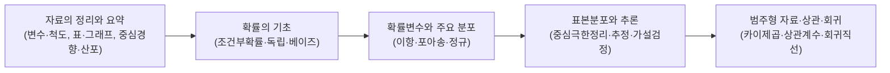

<Callout type="info">
  **이번 문서의 목표:** 독학사 제도가 무엇인지, 「기초통계학」이 어떤 형태로 출제되는지, 시험 당일 운영이 어떻게 이루어지는지를 파악해 뒤이어 나올 24편의 학습 순서와 시간 배분 전략을 스스로 세울 수 있게 한다.
</Callout>

## 독학사 제도란 무엇인가

> **쉽게 말하면:** 대학에 다니지 않아도 시험만으로 학사 학위를 딸 수 있게 해 주는 국가 제도다.

독학사(독학에 의한 학위취득시험) 제도는 정식 명칭이 **독학학위제**다. 대학을 다니지 않고 혼자 공부한 사람도 국가가 정한 시험 단계를 차례로 통과하면 학사 학위를 받을 수 있도록 만든 제도로, 국가평생교육진흥원(National Institute for Lifelong Education, 국가가 평생교육을 관리하기 위해 만든 기관)이 주관한다. 여기서 "진흥"이란 어떤 분야가 더 잘 발전하도록 북돋운다는 뜻의 한자어로, 국가평생교육진흥원은 학교 밖에서 이루어지는 교육 전반을 지원하고 관리하는 기관이라고 이해하면 된다.

독학사 시험은 총 4단계로 이루어진다.

- **1단계 교양과정 인정시험**: 대학 1~2학년 교양 수준. 우리가 다루는 「기초통계학」이 이 단계의 한 과목이다.
- **2단계 전공기초과정 인정시험**: 전공의 기초가 되는 과목들.
- **3단계 전공심화과정 인정시험**: 전공을 깊이 있게 다루는 과목들.
- **4단계 학위취득 종합시험**: 마지막 종합 평가. 이 단계까지 통과하면 학사 학위가 나온다.

각 단계는 별도로 응시할 수 있고, 1단계부터 순서대로 합격해 나가는 구조다. 「기초통계학」은 1단계 교양과정에 속하는 과목 중 하나이며, 통계학과가 아니어도 여러 전공에서 필수 또는 선택 교양으로 요구되는 경우가 많다.

<Callout type="warning">
  독학사 각 단계의 정확한 응시 자격, 과목 조합 규정, 연간 시행 횟수는 국가평생교육진흥원의 **최신 공고를 확인해야 한다**. 이 문서에서 다루는 것은 학습 전략 수립에 필요한 구조적 이해이며, 응시 자격이나 접수 일정 같은 행정 정보의 최종 확인처는 항상 공식 공고다.
</Callout>

## 「기초통계학」 과목이 다루는 범위

독학사 1단계 「기초통계학」은 대학 교양 수준의 통계학 입문 과목이다. 수리적으로 엄밀한 증명을 요구하는 과목이 아니라, **정의·가정·공식의 의미를 이해하고 계산 절차를 정확히 수행할 수 있는지**를 확인하는 과목이라고 보면 된다. 이 시리즈의 목차를 기준으로 출제범위를 다섯 덩어리로 나누면 다음과 같다.

이 다섯 덩어리는 순서대로 서로를 필요로 한다. 예를 들어 가설검정(4번째 덩어리)을 이해하려면 표본분포 개념이 있어야 하고, 표본분포를 이해하려면 확률변수와 분포(3번째 덩어리)를 먼저 알아야 한다. 이 시리즈의 본론 편(05~22편)이 이 순서를 그대로 따라가는 이유도 여기에 있다.

### 문항 유형: 개념형과 계산형

독학사 「기초통계학」 문항은 크게 두 유형으로 나뉜다.

| 유형 | 무엇을 묻는가 | 준비 방법 |
|------|--------------|-----------|
| 개념형 | 용어의 정의, 공식이 성립하는 조건, 두 개념의 차이 (예: 모수와 통계량의 차이) | 정의를 내 말로 설명할 수 있는지 스스로 확인. 자주 틀리는 점 위주로 암기 |
| 계산형 | 주어진 자료로 통계량을 계산 (예: 표본분산, 신뢰구간, 검정통계량) | 공식을 암기하는 것을 넘어 대입–정리–약분–반올림까지 손으로 여러 번 반복 |

개념형은 "이 용어가 정확히 무엇을 뜻하는가"를 묻기 때문에, 비슷하게 생긴 두 개념(예: 모집단의 분산인 모분산과 표본에서 계산한 표본분산)을 짝지어 비교하며 외우는 방식이 효과적이다. 계산형은 공식을 아는 것과 실제로 숫자를 넣어 끝까지 계산해 내는 것 사이에 큰 차이가 있으므로, 이 시리즈의 모든 계산 예제는 중간 단계를 생략하지 않고 보여준다.

## 시험 운영: 시간·점수·합격선

<Callout type="warning">
  아래 항목의 구체적인 숫자(시험 시간, 문항 수, 배점, 합격 점수, 사용 가능한 계산기 종류 등)는 회차마다 바뀔 수 있으므로 **반드시 응시 회차의 공고 확인 필요**하다. 여기서는 일반적인 독학사 교양과정 인정시험의 운영 구조만 설명한다.
</Callout>

독학사 교양과정 인정시험은 일반적으로 다음과 같은 구조로 운영된다.

- **문항 형식**: 객관식(선택형) 위주. 정해진 개수의 보기 중 정답을 고르는 방식이다.
- **과목당 시험 시간**: 한 과목에 정해진 시간이 배정되고, 그 시간 안에 모든 문항을 풀어야 한다.
- **합격 기준**: 과목마다 정해진 점수(주로 백점 만점 기준 60점 이상) 이상을 얻으면 해당 과목이 합격 처리되는 절대평가 방식이 일반적이다. 다만 정확한 커트라인과 과목별 예외 여부는 공고 확인 필요하다.
- **계산기 사용 여부**: 계산형 문항이 있는 과목 특성상 계산기 사용 규정이 중요하다. 사용 가능 여부와 허용 기종은 회차 공고를 반드시 확인해야 한다.

이 정보들이 시험마다 달라질 수 있다는 점이 오히려 학습 전략에서 중요한 시사점을 준다. **암기해야 할 숫자(시험 시간, 합격 점수)와 이해해야 할 개념(통계 이론)을 분리해서 관리해야** 한다는 뜻이다. 후자는 이 시리즈 전체를 통해 충분히 다루지만, 전자는 매 회차 공식 공고에서 갱신해야 한다.

## 과목별 학습 전략 프레임

「기초통계학」처럼 개념과 계산이 함께 출제되는 과목은 다음 네 단계 전략으로 접근하는 것이 효율적이다.

<Steps>
1. **기호·용어 지도 그리기**: 02편(수학 복습)과 03편(통계 용어·기호)을 먼저 익혀, 이후 모든 편에서 등장하는 표기($\mu$, $\bar{x}$, $\sigma^2$, $S^2$ 등)를 낯설지 않게 만든다.
2. **개념 → 계산 순서로 단원 학습**: 각 본론 편을 읽을 때 "이 개념이 왜 필요한가"를 먼저 이해한 다음, 계산 예제를 손으로 직접 따라 푼다. 눈으로만 읽고 넘어가면 계산형 문항에서 막힌다.
3. **자주 틀리는 점 반복 점검**: 이 시리즈의 각 편 끝에는 "자주 틀리는 점" 소절이 있다. 이 부분만 따로 모아 시험 전에 다시 훑는 것을 권장한다.
4. **기출·모의 문항으로 실전 감각 점검**: 23~24편의 기출·복원 유형 문제를 실제 시험처럼 시간을 재고 풀어, 이해와 실전 사이의 간극을 좁힌다.
</Steps>

### 단원별 시간 배분 감각 잡기

모든 단원이 똑같이 중요한 것은 아니다. 이 시리즈의 설계 근거에 따르면 **표본분포 → 추정 → 가설검정으로 이어지는 흐름**(12~19편)이 시험에서 비중이 크고 개념이 복잡하게 얽혀 있으므로, 전체 학습 시간 중 이 구간에 상대적으로 더 많은 시간을 배정하는 것이 합리적이다. 반대로 02편(수학 복습)처럼 이미 익숙한 내용이 많은 편은 빠르게 훑고 넘어가도 무방하다.

> **쉽게 말하면:** 24편을 똑같은 속도로 읽지 말고, 확률분포 이후 추론 파트(12~19편)에 시간을 더 투자하라.

## 자주 틀리는 점

- **독학사 단계와 학년을 혼동**: 1단계는 "1학년 수준"이 아니라 "교양과정 수준"을 뜻한다. 몇 학년이 배우는 내용이냐가 아니라 어떤 성격의 과목이냐를 기준으로 단계가 나뉜다.
- **공고 확인 없이 이전 회차 정보로 준비**: 시험 시간, 합격 점수, 계산기 허용 여부는 회차마다 바뀔 수 있다. 과거 수기나 후기의 숫자를 그대로 믿지 말고 반드시 응시할 회차의 공고 확인 필요하다는 점을 기억해야 한다.
- **개념형과 계산형을 분리해서 준비하지 않음**: 공식만 외우고 왜 그 공식이 성립하는지 모르면 응용된 개념형 문항에서 막히고, 반대로 개념만 알고 손으로 계산해 본 적이 없으면 계산형 문항에서 시간이 부족해진다. 두 유형을 함께 준비해야 한다.

## 핵심 정리

- 독학사는 1~4단계로 이루어진 학위취득 제도이며, 「기초통계학」은 1단계 교양과정 과목이다.
- 출제범위는 자료 정리·확률·분포·표본분포와 추론·상관회귀 순으로 논리적으로 연결되어 있다.
- 문항은 개념형과 계산형으로 나뉘며, 계산형은 중간 과정을 생략하지 않고 연습해야 한다.
- 시험 시간·합격 점수·계산기 허용 여부 등 구체적 수치는 공고 확인 필요하며, 이 문서는 학습 전략 수립을 위한 구조 설명에 집중했다.
- 학습은 기호·용어 정리 → 개념·계산 학습 → 자주 틀리는 점 점검 → 기출 문제 풀이 순으로 진행하면 효율적이다.

## 마무리 복습

<Quiz
  questionNumber={1}
  question="독학사 제도에서 기초통계학이 속하는 단계는 무엇인가?"
  options={['1단계 교양과정 인정시험', '2단계 전공기초과정 인정시험', '3단계 전공심화과정 인정시험', '4단계 학위취득 종합시험']}
  correctAnswer={1}
  explanation="기초통계학은 대학 1~2학년 교양 수준을 다루는 1단계 교양과정 인정시험 과목이다."
  optionExplanations={['정답. 기초통계학은 교양 수준의 통계 입문 과목이다.', '2단계는 전공의 기초를 이루는 과목들을 다룬다.', '3단계는 전공을 심화해서 다루는 과목들이다.', '4단계는 마지막 종합 평가로 학위 취득의 최종 단계다.']}
/>

<Quiz
  questionNumber={2}
  question="다음 중 독학사 기초통계학의 출제 성격에 대한 설명으로 옳은 것은?"
  options={['수리통계의 엄밀한 증명을 요구한다', '정의·가정·공식의 의미와 계산 절차 이해를 중심으로 한다', 'R이나 Python 코딩 능력을 평가한다', '다변량·시계열 등 고급 통계 기법이 핵심이다']}
  correctAnswer={2}
  explanation="독학사 1단계 기초통계학은 대학 교양 수준의 과목으로, 엄밀한 증명보다 정의와 공식의 의미, 계산 절차의 정확한 수행을 중심으로 출제된다."
  optionExplanations={['엄밀한 증명은 이 과목의 핵심이 아니다.', '정답. 개념 이해와 계산 절차 수행이 출제의 중심이다.', '이 과목은 지필 계산 중심이며 코딩을 다루지 않는다.', '다변량·시계열은 이 과목의 제외 범위에 해당한다.']}
/>

<Quiz
  questionNumber={3}
  question="계산형 문항을 준비하는 방법으로 가장 적절한 것은?"
  options={['공식을 눈으로만 암기하고 넘어간다', '정답만 확인하고 풀이 과정은 생략한다', '대입부터 반올림까지 중간 단계를 직접 손으로 여러 번 반복한다', '계산형 문항은 출제 비중이 낮으므로 대비하지 않는다']}
  correctAnswer={3}
  explanation="계산형 문항은 공식을 아는 것과 실제로 끝까지 계산해 내는 것 사이에 차이가 크므로, 대입-정리-약분-반올림까지 직접 반복 연습하는 것이 가장 효과적이다."
  optionExplanations={['눈으로만 외우면 실제 계산 과정에서 막히기 쉽다.', '정답만 확인하면 자신이 어디서 실수하는지 알 수 없다.', '정답. 손으로 전 과정을 반복하는 것이 계산형 대비의 핵심이다.', '계산형은 개념형과 함께 출제 비중이 큰 유형이다.']}
/>

<Quiz
  questionNumber={4}
  question="시험 시간, 합격 점수, 계산기 허용 여부와 같은 정보를 준비할 때 가장 올바른 태도는?"
  options={['과거 응시자의 후기 글만 참고한다', '이전 회차 자료를 그대로 신뢰한다', '해당 정보는 회차마다 바뀔 수 있으므로 응시 회차의 공식 공고를 확인한다', '이런 정보는 합격에 영향이 없으므로 무시한다']}
  correctAnswer={3}
  explanation="시험 운영에 관한 구체적 수치는 회차마다 달라질 수 있으므로 반드시 응시하는 회차의 국가평생교육진흥원 공식 공고를 확인해야 한다."
  optionExplanations={['후기는 참고 자료일 뿐 공식 정보가 아니다.', '이전 회차와 다를 수 있으므로 그대로 신뢰하면 위험하다.', '정답. 회차별 공식 공고 확인이 가장 안전한 방법이다.', '시험 시간과 합격 점수는 응시 전략에 직접 영향을 준다.']}
/>

<Quiz
  questionNumber={5}
  question="이 시리즈에서 제안하는 단원별 학습 시간 배분 전략으로 옳은 것은?"
  options={['모든 편을 똑같은 속도로 읽는다', '표본분포에서 가설검정으로 이어지는 구간(12~19편)에 상대적으로 더 많은 시간을 투자한다', '수학 복습 편에 가장 많은 시간을 투자한다', '기출 문제 편은 시간 배분에서 제외한다']}
  correctAnswer={2}
  explanation="표본분포, 추정, 가설검정으로 이어지는 흐름은 개념이 복잡하게 얽혀 있고 시험 비중이 크므로 상대적으로 더 많은 학습 시간을 배정하는 것이 합리적이다."
  optionExplanations={['단원마다 난이도와 출제 비중이 다르므로 균등 배분은 비효율적이다.', '정답. 이 구간은 개념이 복잡하고 출제 비중이 크다.', '수학 복습은 이미 익숙한 내용이 많아 빠르게 훑어도 된다.', '기출 문제 풀이는 실전 감각을 점검하는 중요한 단계다.']}
/>

## 참고 자료

- [국가평생교육진흥원 독학학위제](https://bdes.nile.or.kr)
- [국가평생교육진흥원](https://www.nile.or.kr)
