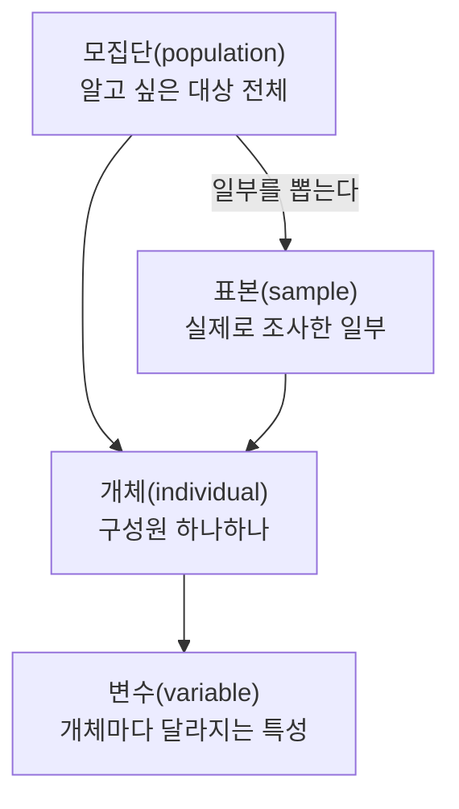

<Callout type="info">
  **이번 문서의 목표:** 이 문서를 다 읽으면 모집단과 표본, 변수의 종류와 척도, 모수와 통계량이라는 개념을 구분하고, 이후 모든 편에서 등장하는 $\mu$, $\bar{x}$, $\sigma^2$, $S^2$ 같은 표기를 즉시 읽고 이해할 수 있다.
</Callout>

## 왜 용어·기호를 먼저 지도로 그려야 하는가

> **쉽게 말하면:** 통계학은 특수한 단어와 기호로 쓰인 언어이므로, 그 언어의 단어장을 먼저 만들어 두면 이후 모든 편을 훨씬 빠르게 읽을 수 있다.

통계학을 처음 배울 때 가장 크게 막히는 지점은 계산 자체보다 **낯선 용어와 기호**다. "모수"와 "통계량"이 뭐가 다른지, $\mu$(뮤)와 $\bar{x}$(엑스바)가 왜 다른 기호로 쓰이는지를 모르면, 이후 05편부터 22편까지 어떤 공식을 봐도 "이 글자가 뭘 뜻하는지"부터 다시 찾아봐야 한다. 이 편에서는 이런 혼란을 방지하기 위해 통계학 전체를 관통하는 용어와 표기를 한 번에 정리한다.

## 모집단·표본·개체·변수

### 모집단과 표본

**모집단**(population)이란 우리가 알고 싶어 하는 대상 전체의 집합이다. 예를 들어 "우리나라 20대 성인의 평균 키"를 알고 싶다면, 모집단은 "우리나라 20대 성인 전체"다.

**표본**(sample)이란 모집단 전체를 조사하기 어려울 때, 그 일부를 뽑아서 대신 조사하는 대상의 집합이다. 20대 성인 전체의 키를 한 명씩 다 재는 것은 현실적으로 불가능하므로, 그중 1,000명을 무작위로 뽑아 키를 재는 방식을 쓴다. 이때 뽑힌 1,000명이 표본이다.

> **쉽게 말하면:** 모집단은 "알고 싶은 전체", 표본은 "실제로 조사한 일부"다.

**개체**(individual, 단위)란 모집단이나 표본을 구성하는 하나하나의 대상을 말한다. 위 예시에서는 성인 한 명 한 명이 개체다. **변수**(variable)란 개체마다 값이 달라질 수 있는 특성을 말한다. 키, 몸무게, 성별, 혈액형은 모두 변수다.

### 왜 모집단 전체가 아니라 표본을 조사하는가

모집단 전체를 조사하는 것을 **전수조사**(census)라고 하는데, 비용과 시간이 지나치게 많이 들거나 아예 불가능한 경우가 많다(예: 전구의 수명을 조사하려면 모든 전구를 다 태워 없애야 하는데, 그러면 팔 전구가 남지 않는다). 그래서 통계학은 표본이라는 일부만 보고 모집단 전체의 특성을 추측하는 방법을 다루며, 이 추측 과정을 **추론**(inference)이라고 부른다. 이 시리즈의 12편부터 다루는 표본분포·추정·가설검정이 모두 이 추론 과정을 다루는 내용이다.

## 질적 변수와 양적 변수, 그리고 척도

변수는 크게 두 종류로 나뉜다.

- **질적 변수**(qualitative variable, 범주형 변수): 숫자가 아니라 범주(카테고리)로 표현되는 변수. 예: 혈액형(A형, B형, O형, AB형), 성별.
- **양적 변수**(quantitative variable, 수치형 변수): 숫자로 표현되고 크기 비교나 계산이 의미 있는 변수. 예: 키, 몸무게, 시험 점수.

이 구분이 중요한 이유는 변수의 종류에 따라 **적용할 수 있는 통계 방법이 완전히 달라지기 때문**이다. 예를 들어 혈액형의 "평균"을 구하는 것은 의미가 없지만(A형과 B형을 더해서 나눌 수 없다), 시험 점수의 평균은 자연스럽게 구할 수 있다.

### 척도: 변수를 더 세밀하게 분류하기

변수가 가진 정보의 "수준"을 네 가지 **척도**(scale of measurement, 측정 단위의 성질)로 더 세밀하게 나눌 수 있다.

| 척도 | 이름 뜻 | 할 수 있는 비교 | 예시 |
|------|---------|-----------------|------|
| 명목척도 | 이름(名)만 구분 | 같다/다르다만 구분 가능 | 혈액형, 성별, 출신 지역 |
| 서열척도 | 순서(序列)가 있음 | 순서 비교 가능(크다/작다), 간격은 의미 없음 | 학점(A, B, C), 만족도(상·중·하) |
| 등간척도 | 간격(等間)이 일정 | 순서와 간격 비교 가능, 그러나 0이 "없음"을 뜻하지 않음 | 섭씨온도, 지능지수 |
| 비율척도 | 비율(比率) 계산 가능 | 순서·간격·비율 모두 비교 가능, 0이 "없음"을 뜻함 | 키, 몸무게, 소득 |

- 명목척도와 서열척도는 **질적 변수**에 해당한다.
- 등간척도와 비율척도는 **양적 변수**에 해당한다.

> **비유:** 명목척도는 사람 이름표(순서 없이 구분만), 서열척도는 마라톤 등수(순서는 있지만 1등과 2등 사이 시간 차와 2등과 3등 사이 시간 차가 같다고 할 수 없음), 등간척도는 온도계(20도와 10도의 차이는 10도지만 20도가 10도의 두 배 덥다고 할 수는 없음, 0도가 "온도 없음"이 아니기 때문), 비율척도는 저울(0kg은 진짜로 "무게 없음"을 뜻하고, 4kg은 2kg의 정확히 두 배다)이라고 생각하면 구분이 쉽다.

### 등간척도와 비율척도를 구분하는 핵심: 0의 의미

두 척도를 혼동하는 경우가 많은데, 구분 기준은 단 하나다. **0이 "그 특성이 전혀 없음"을 뜻하는가**이다. 섭씨 0도는 온도가 아예 없다는 뜻이 아니라 물이 어는 지점을 임의로 0으로 정한 것뿐이므로 등간척도다. 반면 몸무게 0kg은 실제로 무게가 없다는 뜻이므로 비율척도다. 이 차이 때문에 "섭씨 20도는 섭씨 10도의 두 배 덥다"는 말은 성립하지 않지만, "몸무게 40kg은 20kg의 두 배 무겁다"는 말은 성립한다.

## 표본추출 용어: 모수와 통계량

이 시리즈 전체에서 가장 자주 헷갈리는 두 용어가 **모수**와 **통계량**이다.

- **모수**(parameter): 모집단의 특성을 나타내는 값. 모집단 전체를 조사해야만 정확히 알 수 있으며, 보통 상수(고정된 값)로 취급하지만 우리는 그 값을 정확히 모른다.
- **통계량**(statistic): 표본의 특성을 나타내는 값. 실제로 계산할 수 있는 값이며, 표본을 어떻게 뽑느냐에 따라 매번 달라질 수 있다.

> **쉽게 말하면:** 모수는 "진짜 답이지만 우리가 모르는 값", 통계량은 "표본으로 계산해서 실제로 손에 쥔 값"이다.

예를 들어 우리나라 20대 성인 전체의 평균 키(모평균)는 정확히 알 수 없는 모수다. 대신 1,000명을 뽑아 계산한 평균 키(표본평균)는 우리가 실제로 계산할 수 있는 통계량이며, 이 통계량으로 모수를 추측한다. 이 "통계량으로 모수를 추측하는 과정"이 14편(점추정)부터 본격적으로 다루는 주제다.

### 모수 기호 ↔ 통계량 기호 대조표

같은 개념(평균, 분산, 비율)이라도 모집단을 가리키는지 표본을 가리키는지에 따라 기호가 다르다. 이 표는 이후 모든 편에서 계속 참조하게 될 핵심 지도다.

| 개념 | 모수 기호 (모집단) | 읽는 법 | 통계량 기호 (표본) | 읽는 법 |
|------|---------------------|---------|---------------------|---------|
| 평균 | $\mu$ | 뮤 | $\bar{x}$ | 엑스바 |
| 분산 | $\sigma^2$ | 시그마 제곱 | $S^2$ | 에스 제곱 |
| 표준편차 | $\sigma$ | 시그마 | $S$ | 에스 |
| 비율 | $p$ | 피 | $\hat{p}$ | 피햇 |
| 크기(개체 수) | $N$ | 대문자 엔 | $n$ | 소문자 엔 |

- $\mu$(뮤)는 그리스 소문자로, 모집단 전체를 다 조사해야 정확히 알 수 있는 값이므로 우리는 보통 이 값을 모른 채로 추측만 한다.
- $\bar{x}$(엑스바)는 로마자 $x$ 위에 막대(bar)를 얹은 기호로, "표본에서 계산한 평균"이라는 뜻을 담고 있다.
- $\hat{p}$(피햇)의 모자 기호(hat, $\hat{}$)는 통계학에서 관례적으로 "실제 값을 추정한 값"이라는 뜻으로 쓰인다. 즉 $\hat{p}$는 "모비율 $p$를 표본으로 추정한 값"이라는 의미가 기호 자체에 담겨 있다.
- $N$(대문자 엔)과 $n$(소문자 엔)은 대소문자로 모집단 크기와 표본 크기를 구분한다. 이후 모든 공식에서 대문자와 소문자를 반드시 구별해서 읽어야 한다.

이 대조는 06편의 분산 공식에서 결정적인 차이를 만든다. 모분산은 $N$으로 나누지만, 표본분산은 $N$이 아니라 $n-1$로 나눈다(자유도라는 개념 때문이며, 이는 06편과 13편에서 자세히 설명한다). 지금 단계에서는 "모수와 통계량은 기호부터 다르게 쓴다"는 습관만 확실히 잡아 두면 된다.

## 표기 관례: 대문자와 소문자, 그리스 문자와 로마자

통계학 표기에는 몇 가지 반복되는 관례가 있다. 이 관례를 알아두면 처음 보는 공식도 구조를 짐작할 수 있다.

- **그리스 문자는 대개 모수(모집단 값)를 나타낸다.** $\mu$(뮤), $\sigma$(시그마), $\rho$(로, 모상관계수) 등.
- **로마자(영어 알파벳)는 대개 통계량(표본에서 계산한 값)을 나타낸다.** $\bar{x}$(엑스바), $S$(에스), $r$(알, 표본상관계수) 등.
- **모자 기호($\hat{}$)는 "추정값"을 뜻한다.** $\hat{p}$(피햇)은 모비율의 추정값, 이후 22편에서 등장하는 $\hat{y}$(와이햇)는 회귀식으로 예측한 값이다.
- **대문자와 소문자로 모집단 크기와 표본 크기를 구분한다.** $N$은 모집단 크기, $n$은 표본 크기.

> **비유:** 그리스 문자는 "우리가 알고 싶지만 직접 볼 수 없는 진짜 답이 적힌 봉투"이고, 로마자는 "표본을 조사해서 실제로 손에 쥔 계산 결과"라고 생각하면 왜 다른 알파벳을 쓰는지 이해하기 쉽다.

## 자주 틀리는 점

- **모수와 통계량을 반대로 씀**: "표본평균이 모수다"라고 착각하는 경우가 많다. 모수는 항상 모집단의 값이고, 우리가 실제로 계산해서 손에 쥐는 것은 항상 통계량이다.
- **등간척도와 비율척도를 혼동**: 온도(등간척도)를 비율척도처럼 취급해 "두 배 덥다"는 식으로 해석하는 오류가 흔하다. 0이 "완전히 없음"을 뜻하는지 반드시 확인해야 한다.
- **서열척도의 간격을 등간척도처럼 계산**: 만족도 조사에서 "상(3점), 중(2점), 하(1점)"처럼 숫자를 매겨도, 상과 중의 차이가 중과 하의 차이와 반드시 같다고 할 수는 없다. 서열척도에 숫자를 매겼다고 해서 등간척도가 되는 것은 아니다.
- **$N$과 $n$을 같은 것으로 취급**: 문제에서 모집단 크기 $N$과 표본 크기 $n$이 둘 다 주어졌을 때, 어떤 공식에 어떤 값을 넣어야 하는지 헷갈리면 계산 전체가 틀어진다. 항상 "이 공식이 모집단 이야기인가, 표본 이야기인가"를 먼저 확인하는 습관이 필요하다.

## 핵심 정리

- 모집단은 알고 싶은 대상 전체, 표본은 그중 실제로 조사한 일부이며, 개체는 구성원 하나, 변수는 개체마다 달라지는 특성이다.
- 변수는 질적(범주형)과 양적(수치형)으로 나뉘고, 척도는 명목·서열·등간·비율 네 단계로 세분된다. 등간척도와 비율척도의 구분 기준은 "0이 완전한 없음을 뜻하는가"이다.
- 모수는 모집단의 값(우리가 모르는 진짜 답), 통계량은 표본의 값(우리가 실제로 계산하는 값)이다.
- 그리스 문자($\mu$, $\sigma$)는 대개 모수, 로마자($\bar{x}$, $S$)는 대개 통계량을 나타내며, 모자 기호는 추정값을 뜻한다.
- $N$(모집단 크기)과 $n$(표본 크기)은 반드시 구분해서 읽어야 한다.

## 마무리 복습

<Quiz
  questionNumber={1}
  question="우리나라 전체 20대 성인 중 1,000명을 무작위로 뽑아 키를 측정했다. 이 1,000명은 무엇에 해당하는가?"
  options={['모집단', '표본', '변수', '척도']}
  correctAnswer={2}
  explanation="실제로 조사한 일부인 1,000명은 표본이다. 우리나라 20대 성인 전체가 모집단에 해당한다."
  optionExplanations={['모집단은 조사 대상 전체인 20대 성인 전체를 뜻한다.', '정답. 실제로 뽑아 조사한 일부이므로 표본이다.', '변수는 키처럼 개체마다 달라지는 특성을 뜻한다.', '척도는 변수의 측정 수준을 뜻하며 대상 집단이 아니다.']}
/>

<Quiz
  questionNumber={2}
  question="다음 중 비율척도로 측정된 변수는?"
  options={['혈액형', '만족도(상, 중, 하)', '섭씨온도', '몸무게']}
  correctAnswer={4}
  explanation="몸무게는 0kg이 실제로 무게가 없음을 뜻하고 두 배, 세 배 같은 비율 비교가 성립하므로 비율척도다."
  optionExplanations={['혈액형은 순서 없이 구분만 되는 명목척도다.', '만족도는 순서는 있지만 간격이 일정하지 않은 서열척도다.', '섭씨온도는 0이 완전한 없음을 뜻하지 않는 등간척도다.', '정답. 몸무게는 0이 진짜 없음을 뜻하고 비율 비교가 가능한 비율척도다.']}
/>

<Quiz
  questionNumber={3}
  question="등간척도와 비율척도를 구분하는 핵심 기준은?"
  options={['숫자로 표현되는지 여부', '순서를 매길 수 있는지 여부', '0이 그 특성이 완전히 없음을 뜻하는지 여부', '조사 대상의 수']}
  correctAnswer={3}
  explanation="등간척도와 비율척도는 둘 다 숫자이고 순서·간격 비교가 가능하지만, 0이 완전한 없음을 뜻하는지 여부에서 갈린다."
  optionExplanations={['둘 다 숫자로 표현되므로 이는 구분 기준이 아니다.', '둘 다 순서를 매길 수 있으므로 구분 기준이 아니다.', '정답. 0의 의미(완전한 없음 여부)가 두 척도를 가르는 기준이다.', '조사 대상의 수는 척도의 종류와 관련이 없다.']}
/>

<Quiz
  questionNumber={4}
  question="모수와 통계량에 대한 설명으로 옳은 것은?"
  options={['모수는 표본에서 계산한 값이고 통계량은 모집단의 값이다', '모수는 모집단의 값이고 통계량은 표본에서 계산한 값이다', '모수와 통계량은 같은 것을 가리키는 다른 이름일 뿐이다', '모수는 항상 알 수 있고 통계량은 항상 알 수 없다']}
  correctAnswer={2}
  explanation="모수는 모집단 전체를 조사해야 정확히 알 수 있는 값이고, 통계량은 표본을 조사해 실제로 계산할 수 있는 값이다."
  optionExplanations={['설명이 반대로 되어 있다.', '정답. 모수는 모집단 값, 통계량은 표본에서 계산한 값이다.', '둘은 서로 다른 대상(모집단과 표본)의 값을 가리킨다.', '실제로는 모수는 대개 알 수 없고 통계량은 계산 가능한 값이다.']}
/>

<Quiz
  questionNumber={5}
  question="표기 관례상 표본평균을 나타내는 기호와 그 이름으로 옳은 것은?"
  options={['뮤(그리스 문자)', '엑스바(x 위에 막대)', '시그마 제곱', '피햇']}
  correctAnswer={2}
  explanation="표본평균은 로마자 x 위에 막대를 얹은 엑스바로 표기한다. 뮤는 모평균, 시그마 제곱은 모분산, 피햇은 표본비율을 나타낸다."
  optionExplanations={['뮤는 모평균을 나타내는 그리스 문자 기호다.', '정답. 엑스바가 표본평균을 나타내는 통계량 기호다.', '시그마 제곱은 모분산을 나타내는 기호다.', '피햇은 모비율을 표본으로 추정한 값을 나타낸다.']}
/>

## 참고 자료

- [NIST/SEMATECH e-Handbook of Statistical Methods](https://www.itl.nist.gov/div898/handbook/)
- [국가평생교육진흥원 독학학위제](https://bdes.nile.or.kr)
