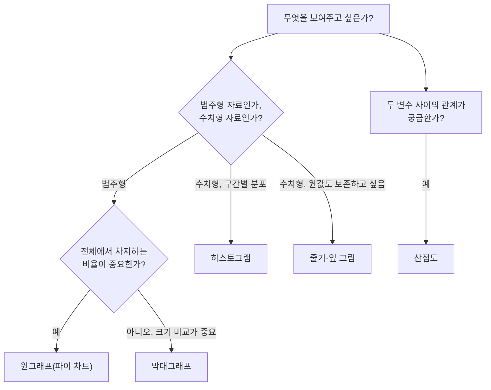

<Callout type="info">
  **이번 문서의 목표:** 이 문서를 다 읽으면 원자료(raw data)를 받아 계급 폭을 정하고 도수분포표를 직접 만들 수 있으며, 막대그래프·원그래프·히스토그램·줄기-잎 그림·산점도를 보고 그 의미를 정확히 해석할 수 있다.
</Callout>

## 왜 자료를 표와 그래프로 먼저 정리하는가

> **쉽게 말하면:** 숫자를 나열만 해서는 아무 특징도 보이지 않으므로, 표와 그래프로 정리해야 자료의 모양이 눈에 들어온다.

20명의 시험 점수를 그냥 나열해 놓으면("62, 75, 88, 91, 55, ...") 어디가 많이 몰려 있고 어디가 드문지 한눈에 파악하기 어렵다. **도수분포표**(frequency distribution table)는 이런 원자료를 몇 개의 구간으로 나누어 각 구간에 몇 개의 값이 속하는지 정리한 표이고, 히스토그램 같은 그래프는 그 표를 그림으로 바꿔 자료의 모양을 한눈에 보여준다. 이 과정을 **자료의 정리**(organizing data)라고 부르며, 05편(중심경향치)과 06편(산포)에서 다루는 평균·분산 계산은 사실 이렇게 정리된 자료를 요약하는 다음 단계다.

## 도수분포표 만들기: 실제 데이터로 연습

### 원자료 준비

다음은 20명의 학생이 치른 시험 점수(100점 만점)다.

$$
62,\ 75,\ 88,\ 91,\ 55,\ 68,\ 73,\ 80,\ 95,\ 60,\ 77,\ 82,\ 69,\ 58,\ 90,\ 85,\ 71,\ 64,\ 78,\ 83
$$

- $n = 20$: 전체 관측값의 개수 (표본 크기)
- 최댓값: 95점, 최솟값: 55점

### 1단계: 범위와 계급 개수 정하기

**범위**(range)는 최댓값에서 최솟값을 뺀 값이다.

$$
\text{범위} = 95 - 55 = 40
$$

- 95: 최댓값(가장 큰 점수)
- 55: 최솟값(가장 작은 점수)
- 40: 자료가 퍼져 있는 전체 폭

**계급**(class)이란 도수분포표에서 자료를 나누는 각 구간을 말한다. 계급이 몇 개가 적당한지 정하는 방법 중 하나가 **스터지스의 공식**(Sturges' rule)이다.

$$
k = 1 + 3.322 \times \log_{10} n
$$

- $k$: 적정 계급 개수
- $n$: 전체 관측값 개수 (여기서는 20)
- $\log_{10} n$: $n$의 상용로그(밑이 10인 로그)

$n=20$을 대입해 계산한다.

$$
k = 1 + 3.322 \times \log_{10} 20 = 1 + 3.322 \times 1.301 = 1 + 4.32 = 5.32
$$

- $\log_{10} 20 \approx 1.301$: 계산기나 로그표로 구한 값(소수점 셋째 자리에서 반올림)
- $3.322 \times 1.301 \approx 4.32$: 곱셈 결과(소수점 둘째 자리에서 반올림)
- $k \approx 5.32$: 계급 개수는 정수여야 하므로 반올림하여 **5개**로 정한다

### 2단계: 계급 폭 정하기

**계급 폭**(class width)은 각 계급이 차지하는 구간의 길이이며, 범위를 계급 개수로 나누어 구한다.

$$
\text{계급 폭} = \frac{\text{범위}}{k} = \frac{40}{5} = 8
$$

- 40: 1단계에서 구한 범위
- 5: 1단계에서 정한 계급 개수
- 8: 계산상 나오는 계급 폭

계산상으로는 8이 나왔지만, 실제로 표를 만들 때는 **계산값보다 크거나 같은 딱 떨어지는 수(보통 5, 10, 20 단위)로 올려서** 쓰는 것이 관례다. 계급 경계가 55, 63, 71처럼 어중간한 숫자가 되면 표를 읽는 사람이 계산하기 번거롭기 때문이다. 여기서는 8을 10으로 올려 계급 폭을 **10**으로 정한다.

> **쉽게 말하면:** 계급 폭은 "계산으로 나온 숫자를 그대로 쓰는 것"이 아니라 "계산값 이상이면서 사람이 읽기 편한 딱 떨어지는 수로 반올림해서" 정한다.

### 3단계: 계급 경계 정하고 도수 세기

계급 폭을 10으로 정했으므로 최솟값 55가 포함되도록 50부터 시작해 계급을 나눈다. 각 계급은 "이상–미만"으로 정의해, 경계값이 두 계급에 동시에 속하는 일이 없도록 한다.

각 값을 계급에 분류하면 다음과 같다.

- 50 이상 60 미만: 55, 58 → 2개
- 60 이상 70 미만: 62, 68, 60, 69, 64 → 5개
- 70 이상 80 미만: 75, 73, 77, 71, 78 → 5개
- 80 이상 90 미만: 88, 80, 82, 85, 83 → 5개
- 90 이상 100 미만: 91, 95, 90 → 3개

**도수**(frequency)는 각 계급에 속하는 관측값의 개수다. 이 다섯 도수를 모두 더하면 전체 관측값 개수인 $n$과 반드시 같아야 한다. 이는 도수분포표를 만든 뒤 항상 검산해야 하는 항목이다.

$$
2 + 5 + 5 + 5 + 3 = 20
$$

계산 결과 20으로, 처음에 정한 $n = 20$과 정확히 일치한다.

### 4단계: 상대도수와 누적도수 계산

**상대도수**(relative frequency)는 전체에서 그 계급이 차지하는 비율이며, 도수를 전체 개수 $n$으로 나누어 구한다.

$$
\text{상대도수} = \frac{\text{도수}}{n}
$$

예를 들어 50 이상 60 미만 계급의 상대도수는 다음과 같다.

$$
\frac{2}{20} = 0.10
$$

**누적도수**(cumulative frequency)는 해당 계급까지의 도수를 순서대로 더해 나간 값이다. 예를 들어 세 번째 계급(70 이상 80 미만)까지의 누적도수는 그 앞의 모든 도수를 더한 것이다.

$$
2 + 5 + 5 = 12
$$

이 모든 결과를 정리하면 다음과 같은 도수분포표가 완성된다.

| 계급 | 계급값(중간값) | 도수 | 상대도수 | 누적도수 | 누적상대도수 |
|------|-----------------|------|----------|----------|--------------|
| 50 이상–60 미만 | 55 | 2 | 0.10 | 2 | 0.10 |
| 60 이상–70 미만 | 65 | 5 | 0.25 | 7 | 0.35 |
| 70 이상–80 미만 | 75 | 5 | 0.25 | 12 | 0.60 |
| 80 이상–90 미만 | 85 | 5 | 0.25 | 17 | 0.85 |
| 90 이상–100 미만 | 95 | 3 | 0.15 | 20 | 1.00 |
| **합계** | – | **20** | **1.00** | – | – |

- **계급값**(class mark, 중간값)은 계급의 가장 작은 값과 가장 큰 값의 평균이다. 예: 50 이상–60 미만 계급의 계급값은 $(50+60)/2 = 55$다. 계급값은 05편에서 그룹화된 자료의 평균을 근사할 때 사용된다.

### 검산: 도수의 합과 상대도수의 합

도수분포표를 완성한 뒤에는 반드시 두 가지를 검산해야 한다.

$$
2 + 5 + 5 + 5 + 3 = 20 = n
$$

$$
0.10 + 0.25 + 0.25 + 0.25 + 0.15 = 1.00
$$

도수의 합은 전체 관측값 개수 $n$과 같아야 하고, 상대도수의 합은 항상 정확히 1(또는 반올림 오차 범위 안에서 100퍼센트)이 되어야 한다. 두 검산 중 하나라도 어긋나면 분류 과정에서 값을 빠뜨렸거나 중복으로 넣은 것이므로, 원자료부터 다시 확인해야 한다.

## 자료를 그래프로 표현하기

같은 자료도 무엇을 강조하고 싶은지에 따라 다른 그래프를 선택한다.

### 막대그래프와 원그래프: 범주형 자료 표현

**막대그래프**(bar chart)는 범주(카테고리)별 크기를 막대의 높이로 비교하는 그래프다. 범주 사이에 순서나 연속성이 없으므로 막대와 막대 사이를 붙이지 않고 간격을 둔다. 예를 들어 혈액형별 인원수를 비교할 때, "A형 막대가 O형 막대보다 얼마나 높은가"를 한눈에 볼 수 있다.

**원그래프**(pie chart)는 전체를 100퍼센트(또는 1)로 놓고, 각 범주가 차지하는 비율을 부채꼴의 크기로 나타낸다. 막대그래프가 "크기 자체의 비교"에 강하다면, 원그래프는 "전체에서 차지하는 비중"을 강조할 때 적합하다. 위 도수분포표를 원그래프로 그린다면, 각 계급의 상대도수(0.10, 0.25, 0.25, 0.25, 0.15)가 곧 부채꼴이 차지하는 비율이 되며, 이 값을 모두 더하면 항상 1(100퍼센트)이 되어야 한다.

<DataBarChart
  data={[
    { label: '50–60', value: 2 },
    { label: '60–70', value: 5 },
    { label: '70–80', value: 5 },
    { label: '80–90', value: 5 },
    { label: '90–100', value: 3 },
  ]}
  xKey="label"
  yKey="value"
  label="시험 점수 도수분포 (계급별 도수)"
/>

### 히스토그램: 도수분포표를 그림으로

**히스토그램**(histogram)은 도수분포표를 막대 형태의 그래프로 그린 것이다. 막대그래프와 생김새는 비슷하지만 결정적인 차이가 있다. 히스토그램의 가로축은 **연속된 수치 구간**(계급)이므로 막대 사이에 간격을 두지 않고 서로 붙여서 그린다. 이는 계급 사이에 값이 끊기지 않고 연속적으로 이어진다는 것을 표현하기 위해서다.

위 도수분포표를 히스토그램으로 그리면, 60 이상–70 미만, 70 이상–80 미만, 80 이상–90 미만 계급의 막대가 가장 높고(도수 5로 동일), 양 끝(50대, 90점대)으로 갈수록 막대가 낮아지는 모양이 된다. 이런 모양을 "가운데가 볼록하고 양 끝이 낮은 분포"라고 해석하며, 11편에서 다루는 정규분포의 종 모양과 비슷한 형태로 이어진다.

### 줄기-잎 그림: 원값을 살리면서 분포 보기

**줄기-잎 그림**(stem-and-leaf plot)은 히스토그램처럼 분포의 모양을 보여주면서도, 도수분포표와 달리 **원래 관측값을 그대로 복원할 수 있다**는 장점이 있다. 각 값을 십의 자리(줄기, stem)와 일의 자리(잎, leaf)로 나누어 표현한다.

위 20개 점수를 줄기-잎 그림으로 그리면 다음과 같다.

| 줄기 | 잎 |
|------|-----|
| 5 | 5, 8 |
| 6 | 0, 2, 4, 8, 9 |
| 7 | 1, 3, 5, 7, 8 |
| 8 | 0, 2, 3, 5, 8 |
| 9 | 0, 1, 5 |

- 줄기 "5", 잎 "5"는 점수 55를 나타내고, 줄기 "9", 잎 "5"는 점수 95를 나타낸다.
- 각 줄기 옆에 나열된 잎의 개수는 앞서 만든 도수분포표의 도수와 정확히 일치한다(줄기 5: 2개, 줄기 6: 5개, 줄기 7: 5개, 줄기 8: 5개, 줄기 9: 3개). 두 표현 방법이 같은 자료를 다른 방식으로 보여줄 뿐이라는 것을 이렇게 서로 대조하며 검산할 수 있다.
- 도수분포표는 계급으로 묶는 과정에서 개별 값(예: 62라는 값이 정확히 몇 점이었는지)이 사라지지만, 줄기-잎 그림은 잎을 보면 원래 값을 그대로 읽어낼 수 있다.

### 산점도: 두 변수의 관계 보기

지금까지는 변수 하나의 분포를 보는 방법이었다면, **산점도**(scatter plot)는 **두 변수 사이의 관계**를 보기 위한 그래프다. 가로축에 한 변수, 세로축에 다른 변수를 놓고, 각 개체를 좌표평면 위의 점 하나로 표시한다. 예를 들어 학생별로 "공부 시간"을 가로축에, "시험 점수"를 세로축에 놓고 20명을 각각 점으로 찍으면, 점들이 오른쪽 위로 갈수록 몰려 있는지(공부 시간이 늘수록 점수도 느는 경향), 아니면 흩어져 있는지를 한눈에 볼 수 있다. 이 관계를 숫자로 요약하는 방법이 21편에서 다루는 상관계수다. 지금 단계에서는 "산점도는 점 하나가 개체 하나를 나타내고, 점들이 이루는 패턴이 두 변수의 관계를 보여준다"는 개념만 잡아두면 충분하다.

## 요약표·그래프 해석 연습

앞서 만든 도수분포표를 다시 보며 몇 가지 해석 연습을 해 보자.

- **가장 도수가 많은 계급(최빈 계급)은 어디인가?** 60 이상–70 미만, 70 이상–80 미만, 80 이상–90 미만 세 계급이 도수 5로 공동 1위다. 이는 "이 시험에서 60점대부터 80점대까지 학생이 고르게 많이 분포한다"는 뜻으로 해석할 수 있다.
- **누적상대도수 0.60이 뜻하는 것은?** 70 이상–80 미만 계급까지의 누적상대도수가 0.60이라는 것은, "전체 학생의 60퍼센트가 80점 미만을 받았다"는 뜻이다. 바꾸어 말하면 상위 40퍼센트만 80점 이상을 받았다는 의미도 된다.
- **90점대 학생은 전체의 몇 퍼센트인가?** 상대도수 0.15이므로 15퍼센트다. 이렇게 상대도수는 "몇 명"이 아니라 "전체 대비 비율"로 바로 해석할 수 있어, 학생 수가 다른 두 집단(예: 20명 반과 35명 반)을 비교할 때 특히 유용하다.

> **쉽게 말하면:** 표와 그래프를 볼 때는 숫자 하나하나보다 "어디가 많이 몰려 있는지", "전체에서 몇 퍼센트를 차지하는지"를 문장으로 말할 수 있어야 제대로 읽은 것이다.

## 자주 틀리는 점

- **막대그래프와 히스토그램을 혼동**: 막대그래프는 범주형 자료(막대 사이 간격 있음), 히스토그램은 수치형 자료를 구간으로 나눈 것(막대 사이 간격 없음)이다. 시험에서 두 그래프를 그림만 보고 구분하는 문제가 나올 수 있으므로, "막대 사이가 붙어 있는가"를 확인하는 습관이 필요하다.
- **계급 경계에 있는 값의 소속 계급을 잘못 판단**: "이상–미만"으로 계급을 정의했다면 경계값(예: 60)은 항상 그 값이 하한인 계급(60 이상–70 미만)에 속한다. "이하–초과"로 정의를 바꾸면 반대로 계산해야 하므로, 표를 만들기 전에 어느 정의를 쓸지 먼저 정하고 끝까지 일관되게 적용해야 한다.
- **도수의 합과 상대도수의 합을 검산하지 않고 넘어감**: 도수의 합이 $n$과 다르거나 상대도수의 합이 1이 아니면 분류 과정에 실수가 있었다는 뜻이다. 표를 완성한 즉시 이 두 검산을 습관적으로 수행해야 한다.
- **계급값(중간값)을 계급의 하한이나 상한으로 착각**: 계급값은 하한과 상한의 평균이지, 둘 중 하나가 아니다. 60 이상–70 미만 계급의 계급값은 60이나 70이 아니라 $(60+70)/2 = 65$다.
- **상대도수를 퍼센트(%)로 변환하는 것을 잊음**: 상대도수 0.25는 그 자체로 "비율 0.25"를 뜻하지만, 문장으로 해석할 때는 "25퍼센트"라고 바꿔 말해야 의미가 더 분명해진다. 0.25를 "0.25명"처럼 잘못 해석하지 않도록 주의한다.

## 핵심 정리

- 도수분포표를 만들 때는 범위 계산 → 스터지스의 공식 등으로 계급 개수 추정 → 계급 폭을 딱 떨어지는 수로 반올림 → 계급별 도수 세기 → 상대도수·누적도수 계산 순서를 따른다.
- 완성한 표는 반드시 도수의 합이 $n$과 같은지, 상대도수의 합이 1인지 검산한다.
- 범주형 자료는 막대그래프(크기 비교)나 원그래프(비율 비교)로, 수치형 자료의 분포는 히스토그램이나 줄기-잎 그림으로 표현한다.
- 히스토그램은 막대 사이 간격이 없고, 줄기-잎 그림은 원래 관측값을 그대로 복원할 수 있다는 점에서 도수분포표와 차별화된다.
- 두 변수 사이의 관계는 산점도로 확인하며, 이는 21편의 상관계수 계산으로 이어진다.

## 마무리 복습

<Quiz
  questionNumber={1}
  question="20개의 관측값으로 도수분포표를 만들었더니 각 계급의 도수가 3, 6, 6, 4, 1이었다. 이 표에 대한 설명으로 옳은 것은?"
  options={['도수의 합이 20이므로 전체 개수에 대한 합계 검산을 통과한다', '도수의 합이 19이므로 어딘가 값이 하나 누락되었다', '도수의 합은 항상 상대도수의 합과 같아야 한다', '도수의 합은 계급 개수와 같아야 한다']}
  correctAnswer={1}
  explanation="3+6+6+4+1=20이다. 도수의 합은 전체 관측값 개수 n과 같아야 하므로 이 표는 전체 개수에 대한 합계 검산을 통과한다. 다만 합계가 맞는다는 사실만으로 각 관측값이 올바른 계급에 분류되었다는 것까지 보장되지는 않는다."
  optionExplanations={['정답. 도수의 합 20이 전체 관측값 개수 n=20과 일치한다.', '3+6+6+4+1은 19가 아니라 20이다.', '도수의 합은 n과 같아야 하고 상대도수의 합은 1이어야 하므로 서로 값이 같을 필요가 없다.', '도수의 합은 계급 개수가 아니라 전체 관측값 개수와 같아야 한다.']}
/>

<Quiz
  questionNumber={2}
  question="학생 20명의 시험 점수를 도수분포표로 정리했더니 70 이상–80 미만 계급의 도수가 5였다. 이 계급의 상대도수는?"
  options={['0.10', '0.25', '0.35', '0.60']}
  correctAnswer={2}
  explanation="상대도수는 해당 계급의 도수를 전체 관측값 개수로 나누어 구한다. 따라서 5를 20으로 나눈 0.25가 정답이다."
  optionExplanations={['0.10은 도수가 2일 때의 상대도수다.', '정답. 5를 20으로 나누면 0.25다.', '0.35는 5를 20으로 나눈 값이 아니다.', '0.60은 5를 20으로 나눈 값이 아니다.']}
/>

<Quiz
  questionNumber={3}
  question="계급 폭을 정할 때, 스터지스의 공식으로 계산한 값이 8이 나왔다면 어떻게 처리하는 것이 관례적으로 옳은가?"
  options={['계산값 8을 그대로 사용한다', '계산값보다 작은 5로 낮춘다', '계산값 이상이면서 사람이 읽기 편한 딱 떨어지는 수(예: 10)로 올린다', '계급 폭은 항상 10으로 고정한다']}
  correctAnswer={3}
  explanation="계산으로 나온 계급 폭은 그대로 쓰기보다, 그 값 이상이면서 5나 10 단위처럼 딱 떨어지는 수로 올림하여 표를 읽기 쉽게 만드는 것이 관례다."
  optionExplanations={['계산값을 그대로 쓰면 계급 경계가 어중간해져 읽기 어렵다.', '계산값보다 작게 낮추면 일부 계급이 필요한 폭보다 좁아져 계급 수가 달라진다.', '정답. 계산값 이상의 딱 떨어지는 수로 올리는 것이 관례다.', '계급 폭은 자료의 범위와 개수에 따라 매번 다시 계산해야 하며 항상 10으로 고정되지 않는다.']}
/>

<Quiz
  questionNumber={4}
  question="막대그래프와 히스토그램의 차이로 옳은 것은?"
  options={['막대그래프는 막대 사이가 붙어 있고 히스토그램은 떨어져 있다', '막대그래프는 범주형 자료, 히스토그램은 구간으로 나눈 수치형 자료를 나타낸다', '두 그래프는 완전히 같은 것을 다른 이름으로 부를 뿐이다', '히스토그램은 항상 원그래프로 바꿔 그릴 수 있다']}
  correctAnswer={2}
  explanation="막대그래프는 범주형 자료의 크기를 비교하기 위해 막대 사이에 간격을 두고, 히스토그램은 연속된 수치 구간을 나타내므로 막대를 붙여서 그린다."
  optionExplanations={['설명이 반대로 되어 있다. 막대 사이 간격이 있는 쪽은 막대그래프다.', '정답. 자료의 종류(범주형 대 구간화된 수치형)가 두 그래프를 구분하는 기준이다.', '두 그래프는 자료의 종류와 막대 배치 방식이 다른 별개의 그래프다.', '히스토그램은 계급별 도수를 보여주는 그래프이며 원그래프로의 변환이 항상 자연스러운 것은 아니다.']}
/>

<Quiz
  questionNumber={5}
  question="줄기-잎 그림이 도수분포표보다 나은 점으로 옳은 것은?"
  options={['계급 폭을 정할 필요가 없어 항상 더 정확하다', '원래 관측값을 그대로 복원해서 읽을 수 있다', '상대도수를 자동으로 계산해 준다', '두 변수 사이의 관계를 보여준다']}
  correctAnswer={2}
  explanation="줄기-잎 그림은 십의 자리를 줄기, 일의 자리를 잎으로 나누어 표시하므로 분포의 모양을 보면서도 원래 값을 그대로 읽어낼 수 있다는 장점이 있다."
  optionExplanations={['줄기-잎 그림도 줄기의 폭을 정해야 하며, 정확성 자체는 계급 폭과 무관하다.', '정답. 잎을 보면 원래 관측값을 그대로 복원할 수 있다.', '줄기-잎 그림 자체는 상대도수를 자동으로 계산해 주지 않는다.', '두 변수의 관계를 보여주는 것은 산점도의 역할이다.']}
/>

<Quiz
  questionNumber={6}
  question="산점도에 대한 설명으로 옳은 것은?"
  options={['한 변수의 도수를 막대로 표현한다', '전체에서 각 범주가 차지하는 비율을 부채꼴로 표현한다', '두 변수 값을 좌표평면 위의 점으로 나타내어 관계를 살펴본다', '원자료를 줄기와 잎으로 나누어 표현한다']}
  correctAnswer={3}
  explanation="산점도는 개체마다 두 변수의 값을 각각 가로축, 세로축 좌표로 삼아 점으로 표시함으로써 두 변수 사이의 관계를 시각적으로 살펴보는 그래프다."
  optionExplanations={['한 변수의 도수를 막대로 표현하는 것은 막대그래프나 히스토그램이다.', '비율을 부채꼴로 표현하는 것은 원그래프다.', '정답. 산점도는 두 변수의 관계를 점으로 보여준다.', '줄기와 잎으로 나누는 것은 줄기-잎 그림이다.']}
/>

## 참고 자료

- [NIST/SEMATECH e-Handbook of Statistical Methods](https://www.itl.nist.gov/div898/handbook/)
- [MathWorld — Histogram](https://mathworld.wolfram.com/Histogram.html)
