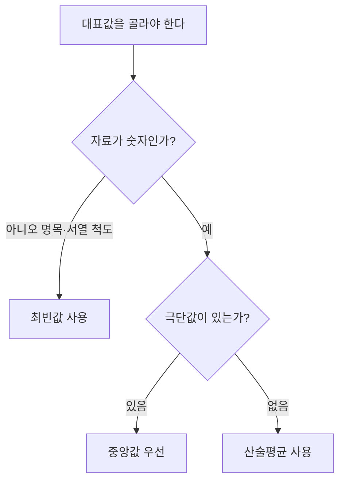

<Callout type="info">
  **이번 문서의 목표:** 이 파일을 다 읽으면 자료 하나를 보고 평균·중앙값·최빈값을 직접 계산하고, 상황에 맞는 대표값을 고를 수 있다.
</Callout>

## 왜 대표값이 필요한가

시험 점수가 8명분 있다고 하자. "우리 반 성적이 어때?"라는 질문에 62, 68, 71, 75, 75, 80, 85, 92라는 숫자 8개를 그대로 나열해서 답하는 사람은 없다. 대신 "평균 76점 정도"처럼 자료 전체를 대표하는 숫자 하나로 요약해서 말한다.

이렇게 자료 집합 전체의 중심 위치를 하나의 숫자로 나타낸 값을 **중심경향치**(measure of central tendency)라고 부른다. 중심경향치에는 여러 종류가 있고, 어떤 것을 쓰느냐에 따라 같은 자료도 다르게 보일 수 있다. 이 편에서는 가장 널리 쓰이는 세 가지, **산술평균**(mean), **중앙값**(median), **최빈값**(mode)을 다루고, 어느 상황에 어떤 값을 써야 하는지까지 판단하는 법을 배운다.

이 편에서 계속 쓸 기본 자료는 앞서 예로 든 학생 8명의 시험 점수다.

| 학생 | 1 | 2 | 3 | 4 | 5 | 6 | 7 | 8 |
|------|---|---|---|---|---|---|---|---|
| 점수 | 62 | 68 | 71 | 75 | 75 | 80 | 85 | 92 |

## 산술평균: 다 더해서 인원수로 나눈다

> **쉽게 말하면:** 모든 값을 똑같은 비중으로 취급해 더한 뒤, 개수로 나눈 값이다.

**산술평균**(arithmetic mean)은 자료값을 모두 더한 다음 자료의 개수로 나눈 값이다. 03편에서 배웠듯이, 모집단 전체를 대상으로 하면 이 값을 모평균이라 하고 그리스 문자 $\mu$(뮤)로 쓰며, 표본을 대상으로 하면 표본평균이라 하고 $\bar{x}$(엑스 바)로 쓴다. 계산 방법 자체는 동일하다.

$$
\bar{x} = \frac{\sum_{i=1}^{n} x_i}{n}
$$

- $\bar{x}$: 표본평균 (읽는 법: 엑스 바)
- $\sum_{i=1}^{n} x_i$: 시그마, "$x_1$부터 $x_n$까지 모두 더하라"는 뜻. 02편에서 배운 시그마(Σ) 표기 그대로다.
- $x_i$: $i$번째 자료값 (예: $x_1=62$, $x_2=68$, …)
- $n$: 자료의 개수 (여기서는 8)

위 8명 점수로 직접 계산해 보자.

$$
\sum x_i = 62+68+71+75+75+80+85+92 = 608
$$

$$
\bar{x} = \frac{608}{8} = 76
$$

**결과 해석:** 이 반 학생 8명의 시험 점수를 하나의 숫자로 요약하면 76점이다. 평균은 "자료를 저울 위에 늘어놓았을 때 균형이 잡히는 지점"이라고 이해하면 직관적이다. 62점처럼 평균보다 훨씬 낮은 값과 92점처럼 훨씬 높은 값이 서로 균형을 맞추면서 76이라는 지점에서 저울이 평형을 이룬다.

### 가중평균: 값마다 중요도가 다를 때

> **쉽게 말하면:** 모든 값을 똑같이 취급하지 않고, 각 값에 붙은 비중(가중치)만큼 더 크게 반영해서 구하는 평균이다.

산술평균은 모든 자료값의 비중이 동일하다고 가정한다. 하지만 현실에서는 값마다 중요도(가중치, weight)가 다른 경우가 많다. 예를 들어 성적처럼 과목마다 이수 학점이 다르면, 학점이 큰 과목의 점수를 더 크게 반영해야 공정한 평균이 나온다. 이럴 때 쓰는 것이 **가중평균**(weighted mean)이다.

$$
\bar{x}_w = \frac{\sum_{i=1}^{n} w_i x_i}{\sum_{i=1}^{n} w_i}
$$

- $\bar{x}_w$: 가중평균 (아래 첨자 $w$는 weight, 가중치의 약자)
- $w_i$: $i$번째 자료값에 매겨진 가중치 (여기서는 이수 학점)
- $x_i$: $i$번째 자료값 (여기서는 과목 점수)

한 학생이 국어(3학점, 90점), 영어(2학점, 85점), 수학(4학점, 78점)을 들었다고 하자. 학점을 고려하지 않은 단순 평균은 $(90+85+78)/3 \approx 84.33$점이지만, 실제 성적표에서 쓰는 가중평균은 다음과 같이 계산한다.

$$
\sum w_i x_i = (3\times 90) + (2\times 85) + (4\times 78) = 270+170+312 = 752
$$

$$
\sum w_i = 3+2+4 = 9
$$

$$
\bar{x}_w = \frac{752}{9} \approx 83.56
$$

**결과 해석:** 단순 평균(84.33점)과 가중평균(83.56점)이 다르게 나왔다. 학점이 가장 큰 수학(4학점) 점수가 상대적으로 낮았기 때문에, 학점을 반영한 가중평균이 단순 평균보다 낮아졌다. 학점이 큰 과목의 영향력이 더 커진 것이다.

## 중앙값: 줄을 세웠을 때 한가운데 값

> **쉽게 말하면:** 자료를 크기순으로 세웠을 때 정확히 가운데에 오는 값이다.

**중앙값**(median)은 자료를 오름차순으로 정렬했을 때 정중앙에 위치하는 값이다. 자료 개수 $n$이 홀수인지 짝수인지에 따라 계산법이 다르다.

- $n$이 홀수면, 정렬한 자료의 $\frac{n+1}{2}$번째 값이 중앙값이다.
- $n$이 짝수면, 가운데에 오는 두 값( $\frac{n}{2}$번째와 $\frac{n}{2}+1$번째)의 평균이 중앙값이다.

8명 점수는 이미 오름차순 정렬되어 있다: 62, 68, 71, 75, 75, 80, 85, 92. $n=8$은 짝수이므로 4번째 값(75)과 5번째 값(75)의 평균을 구한다.

$$
\text{중앙값} = \frac{75+75}{2} = 75
$$

**결과 해석:** 중앙값 75점은 산술평균 76점과 거의 비슷하다. 이는 이 자료가 한쪽으로 크게 치우치지 않은, 비교적 고른 분포임을 시사한다. 평균과 중앙값이 크게 차이 나면 극단값이나 비대칭 분포를 의심해야 하는데, 이 내용은 바로 다음 소절에서 다룬다.

### 사분위수: 자료를 넷으로 나누는 세 지점

> **쉽게 말하면:** 중앙값이 자료를 반으로 가르는 값이라면, 사분위수는 자료를 4등분하는 세 개의 경계값이다.

**사분위수**(quartile)는 정렬된 자료를 4등분하는 세 값 $Q_1$, $Q_2$, $Q_3$을 말한다. $Q_2$는 중앙값과 같다. $Q_1$(제1사분위수, 하위 25퍼센트 지점)은 중앙값보다 아래쪽 절반 자료의 중앙값이고, $Q_3$(제3사분위수, 상위 25퍼센트 지점)은 중앙값보다 위쪽 절반 자료의 중앙값이다.

8명 점수를 중앙값 기준으로 반씩 나누면 다음과 같다.

- 하위 절반: 62, 68, 71, 75
- 상위 절반: 75, 80, 85, 92

$$
Q_1 = \frac{68+71}{2} = 69.5
$$

$$
Q_3 = \frac{80+85}{2} = 82.5
$$

**결과 해석:** $Q_1=69.5$점, $Q_3=82.5$점이라는 뜻은, 이 반 학생의 하위 25퍼센트는 69.5점 이하, 상위 25퍼센트는 82.5점 이상이라는 의미다. $Q_3-Q_1$을 사분위범위라 부르며, 이는 06편에서 산포도로 다시 다룬다.

## 최빈값: 가장 자주 나오는 값

> **쉽게 말하면:** 자료 중 가장 많이 등장한 값이다.

**최빈값**(mode)은 자료에서 빈도(frequency)가 가장 높은 값이다. 8명 점수 중 75점이 두 번(학생 4, 5) 등장해 다른 값보다 빈도가 높으므로, 최빈값은 75다.

최빈값은 평균·중앙값과 달리 **질적 변수**(03편 참고: 명목·서열 척도로 측정한 자료)에도 쓸 수 있다는 특징이 있다. 예를 들어 "가장 선호하는 색깔"처럼 숫자로 평균을 낼 수 없는 자료도 최빈값은 구할 수 있다. 반대로 모든 값이 한 번씩만 나오면 최빈값이 없고(무최빈), 빈도가 같은 값이 여러 개면 최빈값이 여러 개(다봉, multimodal)일 수도 있다.

## 극단값과 척도 선택: 언제 어떤 대표값을 쓸까

> **쉽게 말하면:** 평균은 극단값에 쉽게 흔들리지만, 중앙값은 잘 흔들리지 않는다. 자료에 극단값이 있으면 중앙값을 우선 고려한다.

**극단값**(outlier)이란 나머지 자료와 동떨어지게 크거나 작은 값을 말한다. 산술평균은 모든 자료를 더해서 나누는 방식이라, 극단값 하나가 전체 평균을 크게 끌어올리거나 끌어내릴 수 있다. 반면 중앙값은 "가운데 순서"만 보기 때문에 극단값의 크기 자체에는 영향을 받지 않는다.

예를 들어 8명 점수 중 92점이 오타로 992점이 되었다고 가정하자.

$$
\bar{x}_{\text{오류}} = \frac{62+68+71+75+75+80+85+992}{8} = \frac{1508}{8} = 188.5
$$

평균은 76점에서 188.5점으로 완전히 뒤틀렸다. 하지만 중앙값은 정렬 순서상 여전히 4번째·5번째 값인 75, 75의 평균, 즉 75점 그대로다. 이처럼 **극단값이 있을 때는 중앙값이 산술평균보다 자료를 더 안정적으로 대표한다.** 대표적인 실생활 예가 가구 소득 통계다. 소수의 초고소득 가구가 평균 소득을 크게 끌어올리기 때문에, 뉴스에서 소득을 이야기할 때 "평균 소득"보다 "중위 소득"(중앙값)을 더 자주 인용하는 이유가 여기에 있다.

아래 표로 언제 어떤 대표값을 우선할지 정리한다.

| 상황 | 우선 고려할 대표값 | 이유 |
|------|---------------------|------|
| 극단값이 없고 자료가 대칭적 | 산술평균 | 모든 자료 정보를 반영해 통계적으로 다루기 쉬움 |
| 극단값이 있거나 자료가 심하게 치우침 | 중앙값 | 극단값의 영향을 받지 않음 |
| 질적 변수(명목·서열 척도) | 최빈값 | 평균·중앙값 계산 자체가 불가능한 경우가 많음 |
| "가장 흔한 선택"이 궁금할 때 | 최빈값 | 빈도 자체가 관심 대상 |

## 그룹화 자료의 평균·중앙값 근사

> **쉽게 말하면:** 원자료 없이 도수분포표만 있을 때는, 각 계급의 대푯값(계급값)으로 원자료를 대신해서 근사 계산한다.

04편에서 다룬 도수분포표처럼, 원자료 하나하나가 아니라 계급(class interval)별 도수(frequency)만 주어질 때가 있다. 이런 **그룹화 자료**(grouped data)에서는 정확한 평균·중앙값을 구할 수 없고, 각 계급의 중간값인 **계급값**(class mark, 계급의 최솟값과 최댓값의 평균)을 그 계급에 속한 모든 자료의 대표값으로 가정해 근사한다.

앞서 쓴 8명 점수를 계급 폭 10점 단위로 묶으면 다음 도수분포표가 된다.

| 계급 | 계급값 | 도수($f$) |
|------|--------|-----------|
| 60–69 | 64.5 | 2 |
| 70–79 | 74.5 | 3 |
| 80–89 | 84.5 | 2 |
| 90–99 | 94.5 | 1 |

### 그룹화 자료의 평균 근사

$$
\bar{x} \approx \frac{\sum f_i m_i}{n}
$$

- $f_i$: $i$번째 계급의 도수
- $m_i$: $i$번째 계급의 계급값
- $n$: 전체 도수의 합 ($\sum f_i$)

$$
\sum f_i m_i = (2\times 64.5)+(3\times 74.5)+(2\times 84.5)+(1\times 94.5) = 129+223.5+169+94.5 = 616
$$

$$
\bar{x} \approx \frac{616}{8} = 77
$$

**결과 해석:** 원자료로 구한 정확한 평균은 76점이었는데, 그룹화 자료 근사값은 77점으로 1점 차이가 난다. 이는 계급값(구간의 중간)이 실제 값을 완벽히 대신하지 못하기 때문에 생기는 **근사 오차**다. 계급 폭이 좁을수록 이 오차는 줄어든다.

### 그룹화 자료의 중앙값 근사

그룹화 자료의 중앙값은 중앙값이 속한 계급(중앙값 계급)을 찾은 뒤, 그 계급 안에서 누적도수가 선형으로 고르게 분포한다고 가정하고 다음 식으로 보간한다.

$$
\text{중앙값} \approx L + \left(\frac{\frac{n}{2}-F}{f}\right)\times h
$$

- $L$: 중앙값이 속한 계급의 하한 경계값
- $n$: 전체 도수의 합
- $F$: 중앙값 계급 바로 이전까지의 누적도수
- $f$: 중앙값 계급의 도수
- $h$: 계급 폭

위 표에서 $n/2 = 4$다. 누적도수를 보면 60–69 계급까지 누적 2, 70–79 계급까지 누적 $2+3=5$이므로, 누적도수가 4를 처음 넘는 계급인 **70–79가 중앙값 계급**이다. 여기서 $L=69.5$(70의 하한 경계, 계급 사이 경계는 정수 자료 기준으로 0.5를 뺀 값), $F=2$, $f=3$, $h=10$이다.

$$
\text{중앙값} \approx 69.5 + \left(\frac{4-2}{3}\right)\times 10 = 69.5+6.67 = 76.17
$$

**결과 해석:** 정확한 중앙값 75점과 근사값 76.17점 사이에 약 1.17점의 오차가 있다. 그룹화 자료 근사는 원자료가 없을 때 어쩔 수 없이 쓰는 방법이며, 시험에서는 공식에 값을 정확히 대입하는 절차 자체가 채점 포인트가 된다.

## 자주 틀리는 점

- **평균과 중앙값을 혼동한다.** "정중앙에 있는 값"은 중앙값이지 평균이 아니다. 자료가 비대칭이면 두 값은 다르게 나온다.
- **짝수 개 자료의 중앙값에서 평균 내는 것을 빠뜨린다.** $n$이 짝수면 가운데 두 값의 평균을 내야 하는데, 둘 중 하나만 답으로 쓰는 실수가 잦다.
- **가중평균을 단순 평균처럼 계산한다.** 가중치를 무시하고 $\sum x_i / n$으로 계산하면 틀린다. 반드시 $\sum w_i x_i / \sum w_i$를 써야 한다.
- **그룹화 자료 중앙값 공식에서 $L$을 계급의 시작 숫자 그대로 쓴다.** 정수 자료(60, 61, …, 69)라면 계급 경계는 59.5–69.5처럼 0.5를 보정한 값을 써야 하는 것이 원칙이다. 다만 독학사 수준 문제에서는 계급 경계가 이미 표에 제시되는 경우가 많으므로, 표에 주어진 경계값을 그대로 $L$로 쓰면 된다.
- **극단값이 있는데도 무조건 평균만 계산한다.** 문제에서 "극단값이 있다", "왜곡되었다" 같은 표현이 나오면 중앙값을 우선 검토해야 한다.

## 핵심 정리

- 산술평균은 $\bar{x} = \sum x_i / n$, 모든 자료를 동일한 비중으로 반영한다.
- 가중평균은 $\bar{x}_w = \sum w_i x_i / \sum w_i$, 값마다 중요도가 다를 때 쓴다.
- 중앙값은 정렬된 자료의 정가운데 값(짝수 개면 가운데 두 값의 평균)이며, 극단값에 영향을 받지 않는다.
- 사분위수 $Q_1$, $Q_3$은 자료를 4등분하는 경계값이고, 최빈값은 가장 빈도가 높은 값이다.
- 그룹화 자료에서는 계급값·계급 경계를 이용해 평균·중앙값을 근사하며, 이는 원자료 대비 오차를 동반한다.

## 마무리 복습

<Quiz
  questionNumber={1}
  question="다음 자료의 산술평균을 구하시오: 4, 6, 8, 10, 12"
  options={['7', '8', '9', '10']}
  correctAnswer={2}
  explanation="합계는 4+6+8+10+12=40이고, 자료 개수는 5이므로 평균은 40/5=8이다."
  optionExplanations={['합계를 잘못 나눈 값이다', '40/5=8로 정답이다', '합계 40을 잘못 계산한 값이다', '자료 최댓값과 혼동한 값이다']}
/>

<Quiz
  questionNumber={2}
  question="자료 3, 7, 9, 15의 중앙값은 얼마인가?"
  options={['7', '8', '9', '9.5']}
  correctAnswer={2}
  explanation="n=4로 짝수이므로 2번째 값 7과 3번째 값 9의 평균을 구한다. (7+9)/2=8이 중앙값이다."
  optionExplanations={['가운데 두 값 중 하나만 택한 값이다', '(7+9)/2=8로 정답이다', '3번째 값만 택한 값이다', '잘못된 평균 계산 결과다']}
/>

<Quiz
  questionNumber={3}
  question="자료 2, 4, 4, 4, 6, 8에서 최빈값은 얼마인가?"
  options={['2', '4', '6', '8']}
  correctAnswer={2}
  explanation="4가 세 번 등장해 다른 값보다 빈도가 가장 높으므로 최빈값은 4다."
  optionExplanations={['빈도가 1번뿐인 값이다', '4가 3번 등장해 정답이다', '빈도가 1번뿐인 값이다', '빈도가 1번뿐인 값이다']}
/>

<Quiz
  questionNumber={4}
  question="어떤 학생의 성적이 국어(2학점, 80점), 수학(3학점, 90점)일 때 학점 가중평균은 얼마인가?"
  options={['85점', '86점', '84점', '88점']}
  correctAnswer={2}
  explanation="가중합은 (2×80)+(3×90)=160+270=430이고, 가중치 합은 2+3=5다. 430/5=86점이 가중평균이다."
  optionExplanations={['단순 평균 (80+90)/2=85와 혼동한 값이다', '430/5=86으로 정답이다', '가중치를 반대로 적용한 값이다', '계산 오류로 나온 값이다']}
/>

<Quiz
  questionNumber={5}
  question="자료에 극단값(outlier)이 포함되어 있을 때 자료의 중심을 나타내는 값으로 가장 적절한 것은?"
  options={['산술평균', '중앙값', '가중평균', '자료의 최댓값']}
  correctAnswer={2}
  explanation="산술평균은 극단값 하나에도 크게 흔들리지만, 중앙값은 순서만 보기 때문에 극단값의 크기에 영향을 받지 않는다. 따라서 극단값이 있을 때는 중앙값이 더 안정적인 대표값이다."
  optionExplanations={['극단값에 크게 흔들리는 값이다', '극단값의 영향을 받지 않아 정답이다', '가중치가 주어지지 않은 상황과는 무관하다', '대표값이 아니라 자료의 일부일 뿐이다']}
/>

<Quiz
  questionNumber={6}
  question="정렬된 자료 10, 20, 30, 40, 50, 60, 70, 80에서 제1사분위수 Q1은 얼마인가?"
  options={['15', '20', '22.5', '25']}
  correctAnswer={4}
  explanation="하위 절반은 10, 20, 30, 40이다. n=4로 짝수이므로 2번째 값 20과 3번째 값 30의 평균을 구하면 (20+30)/2=25다."
  optionExplanations={['하위 절반의 첫 값에 불과하다', '하위 절반의 두 번째 값에 불과하다', '계산 과정에서 나온 중간값이 아니다', '(20+30)/2=25로 정답이다']}
/>

<Quiz
  questionNumber={7}
  question="도수분포표에서 계급 70–79의 계급값은 얼마인가?"
  options={['70', '74.5', '75', '79']}
  correctAnswer={2}
  explanation="계급값은 계급의 하한과 상한의 평균이다. (70+79)/2=74.5가 계급값이다."
  optionExplanations={['계급의 하한일 뿐이다', '(70+79)/2=74.5로 정답이다', '반올림한 근사값에 불과하다', '계급의 상한일 뿐이다']}
/>

## 참고 자료

- [Introduction to Applied Statistics: Lecture Notes](https://www.nile.or.kr) — 기술통계(중심경향·산포) 단원 구조와 예제 흐름 참고
- [국가평생교육진흥원 독학학위제](https://bdes.nile.or.kr) — 기초통계학 출제범위 중 중심경향치 항목 확인
