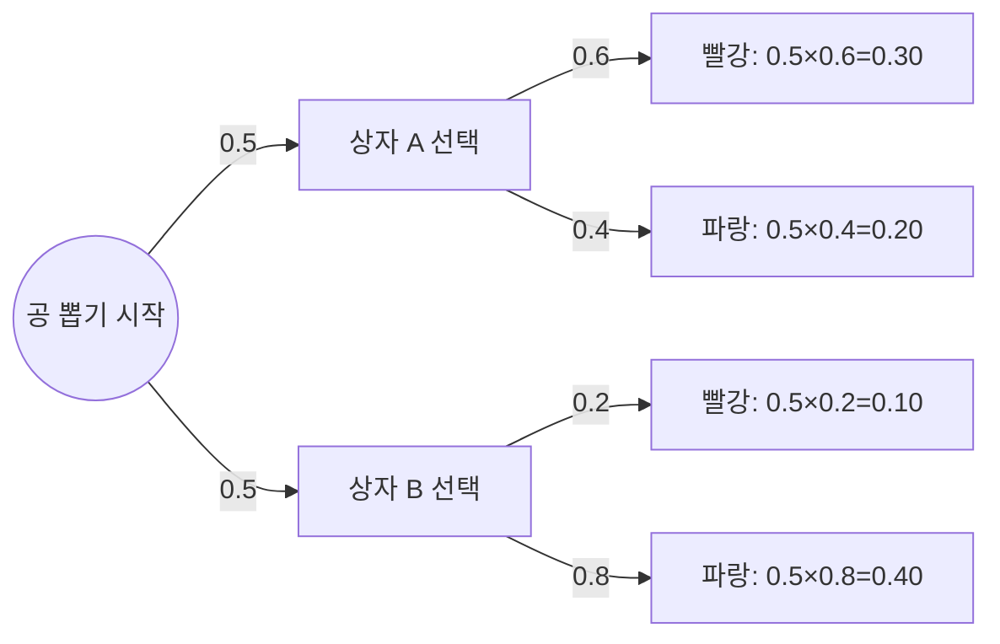

<Callout type="info">
  **이번 문서의 목표:** 이 파일을 다 읽으면 베이즈 정리로 "결과에서 원인으로" 거슬러 확률을 계산하고, 독립과 배반을 절대 혼동하지 않을 수 있다.
</Callout>

## 왜 확률을 거꾸로 뒤집어야 하는가

07편의 상자 예제를 다시 떠올려 보자. 상자 A(빨간 공 3개, 파란 공 2개)와 상자 B(빨간 공 1개, 파란 공 4개) 중 하나를 반반의 확률로 고른 뒤 공을 하나 꺼냈더니 **빨간 공**이 나왔다. 이때 이런 질문이 자연스럽게 떠오른다. "이 빨간 공은 상자 A에서 나왔을 확률이 얼마일까?"

07편에서 구한 것은 "상자를 알 때 공 색깔의 확률"($P(\text{빨강}\mid\text{A})$)이었다. 그런데 지금 궁금한 것은 그 반대, "공 색깔(결과)을 알 때 상자(원인)의 확률"이다. 이렇게 조건부확률의 방향을 뒤집는 도구가 **베이즈 정리**(Bayes' theorem)다.

## 베이즈 정리: 조건부확률의 방향을 뒤집는 공식

> **쉽게 말하면:** 베이즈 정리는 "원인이 주어졌을 때 결과가 나올 확률"을 알고 있을 때, 거꾸로 "결과를 보고 원인을 추측할 확률"을 계산하는 공식이다.

07편에서 배운 조건부확률의 정의를 두 방향에서 각각 써 보면 다음과 같다.

$$
P(A\mid B) = \frac{P(A\cap B)}{P(B)}, \qquad P(B\mid A) = \frac{P(A\cap B)}{P(A)}
$$

두 식 모두 분자가 $P(A\cap B)$로 같다는 점에 주목하자. 두 번째 식을 $P(A\cap B) = P(B\mid A)\times P(A)$로 바꿔서 첫 번째 식에 대입하면 **베이즈 정리**가 나온다.

$$
P(A\mid B) = \frac{P(B\mid A)\times P(A)}{P(B)}
$$

- $P(A\mid B)$: 결과 $B$를 관찰한 뒤 원인이 $A$였을 확률 (사후확률, posterior probability)
- $P(B\mid A)$: 원인이 $A$일 때 결과 $B$가 나올 확률 (가능도, likelihood)
- $P(A)$: $B$를 관찰하기 전, 원인 $A$ 자체의 확률 (사전확률, prior probability)
- $P(B)$: 결과 $B$가 나올 전체 확률 (07편의 전확률의 법칙으로 구한다)

분모 $P(B)$는 보통 그 자체로 주어지지 않고, 07편에서 배운 **전확률의 법칙**으로 계산해야 한다. 원인이 $A_1, A_2, \ldots, A_k$로 나뉘어 있다면 다음과 같이 쓸 수 있다.

$$
P(B) = \sum_{i=1}^{k} P(A_i)\times P(B\mid A_i)
$$

## 나무도로 풀기: 상자와 공 예제

07편의 상자 예제를 나무도(tree diagram)로 그려서 베이즈 정리를 적용해 보자. 상자 A와 B를 고를 확률은 각각 0.5, 상자 A에서 빨간 공이 나올 확률은 0.6, 상자 B에서 빨간 공이 나올 확률은 0.2였다.

나무도에서 각 가지 끝의 확률은 그 경로를 따라가며 확률을 **곱한 값**이다(가지를 따라가는 것은 "동시에 일어나는 사건"이므로 곱셈 정리를 적용한 것이다). 이제 "빨간 공이 나왔다"는 결과에서 출발해, 그 결과로 이어지는 두 가지(상자 A 경로, 상자 B 경로)의 확률만 모아서 베이즈 정리를 적용한다.

전확률(분모)부터 구한다.

$$
P(\text{빨강}) = 0.30+0.10 = 0.40
$$

베이즈 정리로 "빨간 공이 나왔을 때 상자 A였을 확률"을 구한다.

$$
P(\text{A}\mid\text{빨강}) = \frac{P(\text{빨강}\mid\text{A})\times P(\text{A})}{P(\text{빨강})} = \frac{0.6\times0.5}{0.4} = \frac{0.30}{0.40} = 0.75
$$

**결과 해석:** 빨간 공을 뽑았다는 것을 알고 나면, 애초 반반이었던 상자 A일 확률이 75퍼센트까지 올라간다. 상자 A가 상자 B보다 빨간 공 비율이 훨씬 높았기 때문에(0.6 대 0.2), 빨간 공이라는 결과를 관찰한 것 자체가 "상자 A였을 가능성이 크다"는 강한 증거가 되는 것이다.

## 표로 풀기: 같은 문제를 2×2 표로

나무도 대신 **2×2 표**(결합확률표)로도 똑같이 풀 수 있다. 표의 각 칸에는 "상자 선택"과 "공 색깔"이 동시에 일어날 결합확률을 채운다.

| 구분 | 빨강 | 파랑 | 행 합계 |
|------|------|------|---------|
| 상자 A | 0.30 | 0.20 | 0.50 |
| 상자 B | 0.10 | 0.40 | 0.50 |
| 열 합계 | 0.40 | 0.60 | 1.00 |

표를 채우는 방법은 나무도와 동일하다. 상자 A 행의 "빨강" 칸은 $P(\text{A})\times P(\text{빨강}\mid\text{A})=0.5\times0.6=0.30$이고, 나머지 칸도 같은 방식으로 채운다. 표가 완성되면 다음 두 가지를 반드시 검산한다.

- **행 합계**: 각 상자를 선택할 확률은 원래 조건인 0.5, 0.5와 일치해야 한다. $0.30+0.20=0.50$, $0.10+0.40=0.50$으로 일치한다.
- **열 합계**: 열 합계를 모두 더하면 전체 확률인 1이 되어야 한다. $0.40+0.60=1.00$으로 일치하며, "빨강" 열 합계 0.40은 앞서 전확률의 법칙으로 구한 $P(\text{빨강})=0.4$와 정확히 같다.

이제 베이즈 정리는 표에서 **"빨강" 열만 떼어내 그 안에서 비율을 다시 계산**하는 것과 같다.

$$
P(\text{A}\mid\text{빨강}) = \frac{0.30}{0.40} = 0.75
$$

$$
P(\text{B}\mid\text{빨강}) = \frac{0.10}{0.40} = 0.25
$$

**검산:** 나무도로 구한 값(0.75)과 표로 구한 값(0.75)이 정확히 일치한다. 또한 $P(\text{A}\mid\text{빨강})+P(\text{B}\mid\text{빨강}) = 0.75+0.25 = 1$로, 빨간 공이 나왔다는 조건 아래에서 상자는 반드시 A 또는 B 둘 중 하나이므로 두 사후확률의 합이 1이 되는 것도 모순 없이 확인된다.

## 시험 수준 베이즈 추론 예제: 진단 검사

베이즈 정리가 실전에서 가장 자주 등장하는 자리는 **진단 검사**(diagnostic test) 문제다. 어떤 질병의 유병률(prevalence, 인구 중 실제로 그 병을 가진 비율)이 1퍼센트라고 하자. 이 병을 검사하는 도구는 실제 병이 있는 사람을 95퍼센트 확률로 양성 판정하고(민감도, sensitivity), 실제 병이 없는 사람을 90퍼센트 확률로 음성 판정한다(특이도, specificity). 어떤 사람이 검사에서 양성 판정을 받았을 때, 이 사람이 실제로 병에 걸렸을 확률은 얼마일까?

기호를 정리하면 다음과 같다.

$$
P(D) = 0.01, \qquad P(D^c) = 0.99
$$

- $D$: 실제로 병이 있는 사건, $D^c$: 병이 없는 사건(여사건)

$$
P(+\mid D) = 0.95
$$

- $P(+\mid D)$: 병이 있을 때 양성 판정이 나올 확률 (민감도)

$$
P(+\mid D^c) = 1-0.90 = 0.10
$$

- $P(+\mid D^c)$: 병이 없을 때도 양성 판정이 나올 확률 (특이도 90퍼센트의 여사건, 즉 위양성률)

전확률의 법칙으로 "양성 판정이 나올 전체 확률"부터 구한다.

$$
P(+) = P(D)\times P(+\mid D) + P(D^c)\times P(+\mid D^c)
$$

$$
P(+) = (0.01\times0.95)+(0.99\times0.10) = 0.0095+0.099 = 0.1085
$$

베이즈 정리를 적용한다.

$$
P(D\mid +) = \frac{P(+\mid D)\times P(D)}{P(+)} = \frac{0.0095}{0.1085} \approx 0.0876
$$

**결과 해석:** 검사의 민감도(95퍼센트)와 특이도(90퍼센트)가 모두 상당히 높은 편인데도, 양성 판정을 받은 사람이 실제로 병에 걸렸을 확률은 겨우 약 8.76퍼센트에 불과하다. 언뜻 직관에 어긋나 보이지만 이유는 명확하다. 애초에 병에 걸린 사람 자체가 인구의 1퍼센트로 매우 드물기 때문에($P(D)=0.01$), 병이 없는 사람(99퍼센트)에게서 나오는 위양성(false positive, 10퍼센트) 건수가 실제 환자에게서 나오는 진짜 양성 건수보다 절대적인 인원 수로는 더 많아지는 것이다.

$$
P(D^c\mid +) = \frac{0.099}{0.1085} \approx 0.9124
$$

**검산:** $P(D\mid+) + P(D^c\mid+) \approx 0.0876+0.9124 = 1.00$으로, 양성 판정이라는 조건 아래에서 병이 있거나 없거나 둘 중 하나이므로 두 확률의 합이 1이 되는 것이 모순 없이 확인된다.

## 독립과 배반(서로 배타) 비교: 시험에서 가장 자주 걸리는 함정

> **쉽게 말하면:** 배반은 "동시에 일어날 수 없다"는 뜻이고, 독립은 "서로 영향을 주지 않는다"는 뜻이다. 이 둘은 전혀 다른 개념이며, 확률이 모두 0보다 크다면 배반사건은 오히려 독립일 수 없다.

07편 끝에서 예고한 대로, 독립(independent)과 배반(mutually exclusive, 서로 배타적)은 수험생이 가장 자주 헷갈리는 두 개념이다. 둘 다 "두 사건의 관계"를 설명하는 말이지만 뜻이 정반대에 가깝다.

- **배반사건**: $A\cap B = \emptyset$, 즉 두 사건이 동시에 일어나는 경우가 전혀 없다. 한 사건이 일어나면 다른 사건은 절대 일어날 수 없다.
- **독립사건**: $P(A\cap B) = P(A)\times P(B)$, 즉 한 사건이 일어나는지 여부가 다른 사건이 일어날 확률에 아무 영향을 주지 않는다.

이 둘이 왜 상극에 가까운 개념인지 수식으로 확인해 보자. 두 사건이 배반이면 $P(A\cap B)=0$이다. 그런데 두 사건의 확률이 모두 0보다 크다면($P(A)>0$, $P(B)>0$), 독립의 조건식 우변인 $P(A)\times P(B)$는 반드시 0보다 크다. $0$과 $0$보다 큰 값은 같을 수 없으므로, **확률이 모두 양수인 배반사건은 절대로 독립일 수 없다.** 한 사건이 일어나면 다른 사건이 일어날 확률이 곧바로 0으로 뚝 떨어지기 때문에, 이는 "서로 영향을 주지 않는다"는 독립의 정의와 정반대다.

두 개념을 실제 예시로 정면 대조한다.

| 구분 | 배반사건 예시 | 독립사건 예시 |
|------|----------------|-----------------|
| 예시 상황 | 주사위 한 번 던지기에서 "눈이 1이 나온다"(A)와 "눈이 2가 나온다"(B) | 주사위 두 개를 던지기에서 "첫 번째 주사위가 짝수"(A)와 "두 번째 주사위가 홀수"(B) |
| 동시 발생 가능 여부 | 불가능 ($A\cap B=\emptyset$) | 가능 (예: 첫 번째가 2, 두 번째가 3) |
| $P(A\cap B)$ | 0 | $1/4$ |
| $P(A)\times P(B)$ | $1/6\times1/6=1/36$ | $1/2\times1/2=1/4$ |
| 독립 성립 여부 | 불성립 ($0 \neq 1/36$) | 성립 ($1/4=1/4$) |
| 조건부확률 $P(B\mid A)$ | $0$ (A가 일어나면 B는 절대 못 일어남, $P(B)=1/6$과 다름) | $1/2$ (A 발생 여부와 무관하게 $P(B)=1/2$와 동일) |
| 한 줄 요약 | 한쪽이 일어나면 다른 쪽은 반드시 못 일어난다 | 한쪽이 일어나도 다른 쪽 확률은 변하지 않는다 |

**결과 해석:** 배반사건 예시에서 $P(B\mid A)=0$인데 원래 $P(B)=1/6$이었으므로, $A$가 일어나는 순간 $B$의 확률이 완전히 바뀌어 버린다. 즉 배반은 "매우 강하게 서로 영향을 주는" 관계이지, 독립과는 정반대다. 반대로 독립사건 예시에서는 $A$가 일어나든 말든 $B$의 확률이 $1/2$로 전혀 변하지 않는다. **"동시에 안 일어나니까 독립이겠지"라는 생각은 틀렸다는 것**을 이 표로 확실히 기억해야 한다.

## 자주 틀리는 점

- **베이즈 정리의 분모(전확률)를 빠뜨리고 분자만 답으로 낸다.** $P(B\mid A)\times P(A)$는 결합확률일 뿐이며, 반드시 $P(B)$로 나누어야 조건부확률이 된다.
- **사전확률과 가능도를 뒤바꿔 대입한다.** $P(A)$(사전확률)와 $P(B\mid A)$(가능도)의 역할을 헷갈리면 완전히 다른 답이 나온다. 나무도나 표를 그려 각 가지의 확률이 무엇의 조건부인지 눈으로 확인하는 습관이 중요하다.
- **배반이면 당연히 독립이라고 생각한다.** 위 표에서 확인했듯, 확률이 모두 양수인 배반사건은 오히려 독립일 수 없는 관계다.
- **독립이면 당연히 배반이 아니라고만 생각하고 넘어간다.** 맞는 결론이지만, 그 이유(정의가 서로 다른 조건이라는 것)까지 설명할 수 있어야 시험에서 응용 문제에 대응할 수 있다.
- **진단 검사 문제에서 민감도·특이도가 높으면 양성 판정만으로 병에 걸렸다고 단정한다.** 유병률이 매우 낮으면, 검사 정확도가 높아도 사후확률이 낮게 나올 수 있다는 것을 위 예제에서 확인했다.

## 핵심 정리

- 베이즈 정리는 $P(A\mid B) = \dfrac{P(B\mid A)\times P(A)}{P(B)}$이며, 분모는 전확률의 법칙으로 구한다.
- 나무도는 경로별 결합확률(곱셈)을 눈으로 보여주고, 2×2 표는 행·열 합계로 계산을 검산하기 좋다. 두 방법은 같은 답을 준다.
- 유병률이 낮은 질병의 진단 검사처럼, 검사 정확도가 높아도 사전확률(유병률)이 낮으면 사후확률이 예상보다 낮게 나올 수 있다.
- 배반사건은 $A\cap B=\emptyset$(동시 발생 불가), 독립사건은 $P(A\cap B)=P(A)P(B)$(서로 무관)로 정의가 다르며, 확률이 모두 양수라면 배반과 독립은 동시에 성립할 수 없다.

## 마무리 복습

<Quiz
  questionNumber={1}
  question="베이즈 정리 공식 P(A|B) = P(B|A)×P(A) / P(B)에서 분모 P(B)를 구하는 데 사용하는 법칙은?"
  options={['확률의 가법성', '전확률의 법칙', '여사건의 정의', '독립사건의 곱셈 정리']}
  correctAnswer={2}
  explanation="분모 P(B)는 B가 일어날 수 있는 모든 경로(원인)의 확률을 더해서 구하며, 이는 07편에서 배운 전확률의 법칙이다."
  optionExplanations={['배반사건의 합을 구할 때 쓰는 성질이다', '여러 원인 경로의 확률을 합산해 정답이다', '여사건은 1에서 빼는 계산으로 이 상황과는 다르다', '독립사건 여부를 판단할 때 쓰는 정리로 이 상황과는 다르다']}
/>

<Quiz
  questionNumber={2}
  question="상자 A(빨강6, 파랑4)와 상자 B(빨강2, 파랑8) 중 반반 확률로 하나를 골라 공을 꺼냈더니 빨간색이었다. 상자 A였을 확률은? (전확률과 베이즈 정리를 사용)"
  options={['0.5', '0.6', '0.75', '0.4']}
  correctAnswer={3}
  explanation="P(빨강|A)=6/10=0.6, P(빨강|B)=2/10=0.2다. 전확률 P(빨강)=0.5×0.6+0.5×0.2=0.3+0.1=0.4다. 베이즈 정리로 P(A|빨강)=0.3/0.4=0.75다."
  optionExplanations={['상자를 고를 사전확률 그대로이며 조건부 정보를 반영하지 않았다', '계산 과정 중 나온 값과는 다른 값이다', '0.3/0.4=0.75로 정답이다', '전확률 P(빨강)의 값과 혼동한 것이다']}
/>

<Quiz
  questionNumber={3}
  question="2×2 결합확률표를 그렸을 때, 표가 올바르게 채워졌는지 검산하는 방법으로 옳은 것은?"
  options={['대각선 값들의 합이 항상 0.5여야 한다', '행 합계는 각 원인의 사전확률과 같고, 열 합계를 모두 더하면 1이 되어야 한다', '모든 칸의 값이 서로 같아야 한다', '가장 큰 칸의 값이 항상 0.5 이상이어야 한다']}
  correctAnswer={2}
  explanation="행 합계는 원인(예: 상자 선택) 각각의 사전확률과 일치해야 하고, 전체 열 합계를 다 더하면 표본공간 전체 확률인 1이 되어야 한다. 이 두 조건으로 계산 실수를 검산할 수 있다."
  optionExplanations={['일반적으로 성립하는 규칙이 아니다', '행·열 합계 검산이 표를 검증하는 올바른 방법으로 정답이다', '결합확률은 상황에 따라 다르므로 항상 같을 필요가 없다', '일반적으로 성립하는 규칙이 아니다']}
/>

<Quiz
  questionNumber={4}
  question="어떤 질병의 유병률이 2%이고, 검사 민감도가 90%, 특이도가 95%다. 양성 판정을 받았을 때 실제로 병이 있을 확률(사후확률)을 구하기 위해 가장 먼저 계산해야 할 것은?"
  options={['P(양성)을 전확률의 법칙으로 구한다', '유병률과 민감도를 곱해 바로 답으로 낸다', '특이도만으로 답을 구한다', '민감도에서 특이도를 빼서 답을 구한다']}
  correctAnswer={1}
  explanation="베이즈 정리를 적용하려면 분모인 P(양성)을 먼저 구해야 한다. P(양성)=P(병)×P(양성|병)+P(병 아님)×P(양성|병 아님)의 전확률의 법칙으로 계산한다."
  optionExplanations={['분모 P(양성)을 먼저 구해야 베이즈 정리를 완성할 수 있어 정답이다', '이는 결합확률일 뿐이며 분모로 나누지 않으면 조건부확률이 아니다', '특이도만으로는 사후확률을 구할 수 없다', '민감도와 특이도는 서로 빼는 값이 아니다']}
/>

<Quiz
  questionNumber={5}
  question="사건 A, B의 확률이 각각 P(A)=0.3, P(B)=0.4이고 두 사건이 배반사건이라면, A와 B는 독립인가?"
  options={['독립이다, 배반이면 항상 독립이므로', '독립이 아니다, P(A∩B)=0인데 P(A)×P(B)=0.12로 서로 다르므로', '독립이다, 두 확률의 합이 1보다 작으므로', '판단할 수 없다']}
  correctAnswer={2}
  explanation="배반사건이므로 P(A∩B)=0이다. 독립이 되려면 P(A∩B)=P(A)×P(B)=0.3×0.4=0.12여야 하는데 0≠0.12이므로 독립이 아니다."
  optionExplanations={['배반과 독립은 서로 다른 개념이며 배반이면 오히려 독립이 아닌 경우가 대부분이다', '0과 0.12가 달라 독립이 아니라는 것이 정답이다', '확률의 합과 독립 여부는 직접적인 관련이 없다', '정의식을 그대로 대입하면 바로 판단할 수 있다']}
/>

<Quiz
  questionNumber={6}
  question="주사위 두 개를 던질 때 사건 A는 첫 번째 주사위가 짝수, 사건 B는 두 번째 주사위가 홀수라 하자. A와 B의 관계로 옳은 것은?"
  options={['배반사건이면서 독립사건이다', '배반사건이지만 독립사건은 아니다', '배반사건은 아니지만 독립사건이다', '배반사건도 독립사건도 아니다']}
  correctAnswer={3}
  explanation="첫 번째가 짝수이면서 두 번째가 홀수인 경우(예: 2와 3)가 실제로 존재하므로 배반사건이 아니다. 서로 다른 주사위의 결과이므로 한쪽이 다른 쪽의 확률에 영향을 주지 않아 P(A∩B)=P(A)×P(B)=1/4가 성립하는 독립사건이다."
  optionExplanations={['배반사건이 아니므로 이 조합은 성립할 수 없다', '배반사건이 아니므로 이 조합은 성립할 수 없다', '동시 발생이 가능하면서(배반 아님) 서로 무관하므로(독립) 정답이다', '독립사건 조건이 성립하므로 이 조합은 틀렸다']}
/>

<Quiz
  questionNumber={7}
  question="빨간 공이 나왔을 때 상자 A였을 확률이 0.75로 계산되었다면, 같은 조건에서 상자 B였을 확률은 얼마여야 하는가?"
  options={['0.75', '0.5', '0.25', '0']}
  correctAnswer={3}
  explanation="빨간 공이 나왔다는 조건 아래에서 상자는 반드시 A 또는 B 둘 중 하나이므로 두 사후확률의 합은 1이어야 한다. 1-0.75=0.25가 상자 B였을 확률이다."
  optionExplanations={['상자 A의 확률과 같을 이유가 없다', '조건을 반영하기 전인 사전확률과 혼동한 값이다', '1-0.75=0.25로 정답이다', '반드시 하나의 상자에서 나온 것이므로 0이 될 수 없다']}
/>

## 참고 자료

- [Introduction to Applied Statistics: Lecture Notes](https://www.nile.or.kr) — 조건부확률·베이즈 정리 단원의 예제 구조 참고
- [NIST/SEMATECH e-Handbook of Statistical Methods](https://www.itl.nist.gov/div898/handbook/) — 베이즈 정리, 독립사건과 배반사건의 정의 확인
