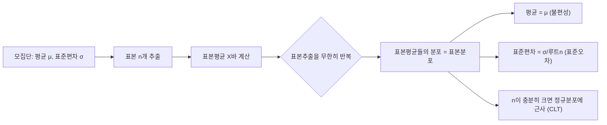

<Callout type="info">
  **이번 문서의 목표:** 이 파일을 다 읽으면 표본평균이 왜 그 자체로 확률변수인지 이해하고, 중심극한정리를 이용해 표본평균의 분포를 정규분포로 근사해 확률을 계산하며, 시험에서 가장 자주 틀리는 "표준편차 대 표준오차" 함정을 구분할 수 있다.
</Callout>

## 표본을 뽑을 때마다 값이 달라진다: 표본평균이라는 확률변수

09편에서 확률변수(random variable)는 "시행 결과에 값을 대응시키는 규칙"이라고 배웠다. 그런데 표본평균도 사실 확률변수다. 왜 그럴까?

모집단(population, 관심 있는 대상 전체)에서 크기 $n$인 표본(sample)을 하나 뽑아 평균을 낸다고 하자. 오늘 뽑은 표본과 내일 다시 뽑는 표본은 구성 원소가 다르므로, 그 평균값도 매번 달라진다. 즉 표본평균은 "표본을 뽑는 시행"의 결과에 따라 값이 바뀌는 확률변수다.

> **쉽게 말하면:** 표본평균 하나의 값은 우연히 뽑힌 결과일 뿐이라, 표본을 다시 뽑으면 다른 값이 나온다. 그 "여러 번 뽑았을 때 나오는 값들의 분포"가 바로 표본분포(sampling distribution)다.

**표기법**: 모집단에서 뽑은 확률변수 $n$개를 $X_1, X_2, \ldots, X_n$이라 하면, 표본평균은 다음과 같이 정의한다.

$$
\bar X = \frac{X_1 + X_2 + \cdots + X_n}{n}
$$

- $\bar X$ (엑스바): 표본평균이라는 확률변수
- $X_1, \ldots, X_n$: 모집단에서 독립적으로 뽑은 $n$개의 확률변수 (03편의 통계량 표기 참고)
- $n$: 표본크기(sample size)

이 문서에서는 $\bar X$가 어떤 분포를 따르는지, 그 분포의 평균과 분산이 무엇인지, 그리고 $n$이 커질수록 그 분포가 어떻게 변하는지를 다룬다.

## 표본평균의 기댓값과 분산

### 왜 필요한가

가설검정(17~19편)이나 신뢰구간(15~16편)을 만들려면 표본평균 $\bar X$가 모평균 $\mu$ 주변에서 얼마나 흩어져 있는지를 알아야 한다. 이를 위해 $\bar X$의 기댓값 $E(\bar X)$와 분산 $\mathrm{Var}(\bar X)$을 구한다.

### 유도

모집단의 평균이 $\mu$(뮤, 모평균), 분산이 $\sigma^2$(시그마 제곱, 모분산)이라 하자. 09편에서 배운 기댓값의 선형성(linearity)과, 서로 독립인 확률변수의 분산은 더해진다는 성질을 그대로 적용한다.

$$
E(\bar X) = E\left(\frac{X_1 + \cdots + X_n}{n}\right) = \frac{1}{n}\bigl(E(X_1) + \cdots + E(X_n)\bigr) = \frac{1}{n}(n\mu) = \mu
$$

- $E(\bar X)$: 표본평균의 기댓값
- $E(X_i)$: 각 관측값의 기댓값, 모두 $\mu$와 같다 (같은 모집단에서 뽑았으므로)

즉 표본평균의 기댓값은 언제나 모평균과 같다. 이 성질을 **불편성**(unbiasedness)이라 하며 14편에서 더 자세히 다룬다.

분산은 독립성 덕분에 다음과 같이 정리된다.

$$
\mathrm{Var}(\bar X) = \mathrm{Var}\left(\frac{X_1 + \cdots + X_n}{n}\right) = \frac{1}{n^2}\bigl(\mathrm{Var}(X_1) + \cdots + \mathrm{Var}(X_n)\bigr) = \frac{1}{n^2}(n\sigma^2) = \frac{\sigma^2}{n}
$$

- $\mathrm{Var}(\bar X)$: 표본평균의 분산
- $n^2$으로 나누는 이유: $\bar X = \frac{1}{n}\sum X_i$에서 상수 $\frac{1}{n}$을 분산 밖으로 꺼내면 제곱이 붙기 때문 ($\mathrm{Var}(aX) = a^2\mathrm{Var}(X)$)

표준편차 형태로 쓰면 다음과 같다.

$$
\mathrm{SD}(\bar X) = \frac{\sigma}{\sqrt n}
$$

이 $\dfrac{\sigma}{\sqrt n}$이라는 값에 **표준오차**(standard error, SE)라는 별도 이름이 붙는다. 이번 문서의 핵심 함정이므로 뒤에서 데이터로 직접 계산해 비교한다.

### 작은 예시

모집단이 시험 점수 5개 $\{70, 75, 80, 85, 90\}$이라고 하자(모집단 전체를 이 5개라고 가정하는 아주 작은 예시다). 평균과 분산을 먼저 구한다.

$$
\mu = \frac{70+75+80+85+90}{5} = \frac{400}{5} = 80
$$

편차 제곱을 구하면 $(70-80)^2=100$, $(75-80)^2=25$, $(80-80)^2=0$, $(85-80)^2=25$, $(90-80)^2=100$이다.

$$
\sigma^2 = \frac{100+25+0+25+100}{5} = \frac{250}{5} = 50
$$

$$
\sigma = \sqrt{50} = 7.0710678\ldots \approx 7.07
$$

이 모집단에서 $n=25$인 표본을 뽑는다면(이론적 예시이므로 표본이 모집단보다 커도 개념 설명에는 문제없다), 표본평균의 분산과 표준편차는 다음과 같다.

$$
\mathrm{Var}(\bar X) = \frac{\sigma^2}{n} = \frac{50}{25} = 2
$$

$$
\mathrm{SD}(\bar X) = \frac{\sigma}{\sqrt n} = \frac{7.07}{\sqrt{25}} = \frac{7.07}{5} = 1.414 \approx 1.41
$$

**결과 해석**: 개별 시험 점수 하나하나는 평균 80점 주위로 표준편차 7.07점만큼 퍼져 있다. 하지만 25명의 평균 점수를 낸다면, 그 평균값은 80점 주위로 겨우 1.41점 정도만 퍼진다. 평균을 낼수록 개별값의 들쭉날쭉함이 서로 상쇄되어 훨씬 안정적인 값이 나온다는 뜻이다.

## 큰 수의 법칙: 표본이 커지면 평균에 가까워진다는 직관

큰 수의 법칙(law of large numbers)은 "표본크기 $n$을 한없이 늘리면 표본평균 $\bar X$가 모평균 $\mu$에 점점 더 가까워진다"는 직관을 수학적으로 보장하는 정리다.

> **쉽게 말하면:** 동전을 10번 던지면 앞면 비율이 0.3이나 0.7처럼 들쭉날쭉해도, 10000번 던지면 결국 0.5에 아주 가까워진다.

위 식 $\mathrm{Var}(\bar X) = \dfrac{\sigma^2}{n}$을 보면 이유가 바로 보인다. $n$이 커질수록 분모가 커지므로 $\mathrm{Var}(\bar X)$는 0에 가까워진다. 분산이 0에 가까워진다는 것은 $\bar X$가 자신의 기댓값인 $\mu$ 주위에 거의 붙어버린다는 뜻이다. 즉 표본이 커질수록 $\bar X$는 우연에 덜 흔들리고 $\mu$를 더 정확히 대변하게 된다. 이 성질은 14편에서 다루는 **일치성**(consistency)의 핵심 근거이기도 하다.

## 중심극한정리: 표본평균은 정규분포에 가까워진다

### 왜 필요한가

모집단 자체의 분포 모양은 정규분포일 수도, 한쪽으로 치우친 분포일 수도 있다. 모집단 분포를 모르면 확률 계산이 막막해 보인다. 그런데 표본평균 $\bar X$는 모집단 분포 모양과 거의 무관하게 **표본크기가 충분히 크면 정규분포에 가까워진다**는 놀라운 성질이 있다. 이것이 중심극한정리(Central Limit Theorem, CLT)다.

> **쉽게 말하면:** 원래 자료가 어떤 모양이든, 표본을 충분히 크게 뽑아 평균을 내면 그 평균들의 분포는 종 모양(정규분포)을 닮아간다.

### 정의

모집단의 평균이 $\mu$, 분산이 $\sigma^2$(유한하다고 가정)일 때, 표본크기 $n$이 충분히 크면 다음이 성립한다(근사).

$$
\bar X \;\dot\sim\; N\!\left(\mu,\ \frac{\sigma^2}{n}\right)
$$

- $N(\cdot,\cdot)$: 정규분포(11편), 괄호 안은 (평균, 분산)
- $\dot\sim$: "근사적으로 다음 분포를 따른다"는 표기
- "충분히 크다"의 실무 기준: 시험에서는 흔히 $n \geq 30$을 기준선으로 쓴다. 모집단이 원래 정규분포이면 $n$이 작아도(심지어 $n=2$부터) $\bar X$는 정확히 정규분포를 따른다.

표준화하면 11편에서 배운 표준정규분포표를 그대로 쓸 수 있다.

$$
Z = \frac{\bar X - \mu}{\sigma / \sqrt n}
$$

- $Z$: 표준정규분포 $N(0,1)$을 따르는 확률변수
- 분모 $\sigma/\sqrt n$: 앞서 구한 표본평균의 표준편차(=표준오차)

### 계산 예시

앞의 시험 점수 모집단($\mu=80$, $\sigma=7.07$)에서 $n=25$인 표본을 뽑았을 때, 표본평균이 82점을 넘을 확률을 구해보자.

먼저 표준오차를 구한다.

$$
\frac{\sigma}{\sqrt n} = \frac{7.07}{\sqrt{25}} = \frac{7.07}{5} = 1.414
$$

이 값으로 $z$ 값을 계산한다.

$$
z = \frac{82 - 80}{1.414} = \frac{2}{1.414} = 1.4144\ldots \approx 1.41
$$

11편의 표준정규분포표에서 $z=1.41$에 대응하는 누적확률(평균부터 $z$까지의 넓이)은 약 0.4207이다. 표 전체 기준 왼쪽 누적확률로 바꾸면 $0.5 + 0.4207 = 0.9207$이다.

$$
P(\bar X > 82) = 1 - 0.9207 = 0.0793 \approx 7.93\%
$$

**결과 해석**: 25명씩 표본을 반복해서 뽑는다면, 그 표본평균이 82점을 넘는 경우는 전체의 약 7.93퍼센트(약 8퍼센트)에 불과하다. 개별 학생 한 명의 점수가 82점을 넘을 확률과는 전혀 다른 숫자라는 점에 주의해야 한다(개별값은 $\sigma=7.07$을 쓰지만 표본평균은 $\sigma/\sqrt n = 1.414$를 쓴다).

## 표본크기가 표본분포에 미치는 영향

표본크기 $n$이 커질수록 표본평균의 분포는 (1) 평균은 그대로 $\mu$에 머물지만, (2) 퍼짐(표준오차)은 점점 좁아진다. 같은 모집단($\sigma=7.07$)에서 표본크기를 바꿔가며 표준오차를 비교하면 다음과 같다.

| 표본크기 $n$ | $\sqrt n$ | 표준오차 $\sigma/\sqrt n$ |
|---|---|---|
| 4 | 2 | 7.07 / 2 = 3.535 ≈ 3.54 |
| 25 | 5 | 7.07 / 5 = 1.414 ≈ 1.41 |
| 100 | 10 | 7.07 / 10 = 0.707 ≈ 0.71 |
| 400 | 20 | 7.07 / 20 = 0.354 ≈ 0.35 |

**결과 해석**: 표본크기를 4배로 늘릴 때마다 표준오차는 $\sqrt 4 = 2$배씩 줄어든다(제곱근 관계이기 때문에 표본크기를 늘리는 만큼 정확도가 비례해서 좋아지지는 않는다). 예를 들어 표준오차를 절반으로 줄이려면 표본크기를 4배로 늘려야 한다. 여론조사나 실험 설계에서 "표본을 얼마나 더 뽑아야 하는가"를 판단할 때 이 관계가 그대로 쓰인다(15편 표본크기 설계에서 다시 등장).

## 표집오차와 표준오차: 표준편차와 절대 혼동하면 안 되는 개념

### 왜 필요한가 — 시험에서 가장 자주 틀리는 지점

여기까지 계산 과정을 그대로 따라왔다면 이미 답은 손에 있다. 다만 시험에서는 "표준편차를 쓰라"는 문제와 "표준오차를 쓰라"는 문제를 구분하지 못해 틀리는 경우가 압도적으로 많다. 이 둘은 이름이 비슷해서 헷갈리지만, **측정 대상 자체가 다르다.**

> **쉽게 말하면:** 표준편차는 "개별 관측값 하나하나"가 평균에서 얼마나 흩어졌는지를 재고, 표준오차는 "표본평균이라는 하나의 통계량"이 표본을 반복해서 뽑을 때마다 얼마나 흔들리는지를 잰다.

### 정의로 정리

| 구분 | 표준편차(standard deviation, SD) | 표준오차(standard error, SE) |
|---|---|---|
| 무엇의 퍼짐인가 | 모집단(또는 표본) 안의 개별 관측값 | 표본평균이라는 통계량 자체 |
| 공식 | $\sigma$ (모표준편차) 또는 $s$ (표본표준편차, 06편) | $\sigma/\sqrt n$ (또는 $s/\sqrt n$) |
| $n$이 커지면 | 변하지 않는다(모집단 고유의 퍼짐) | 점점 작아진다 (0에 수렴) |
| 쓰이는 질문 | "학생 한 명의 점수는 얼마나 들쭉날쭉한가" | "표본평균은 참값(모평균) 주위로 얼마나 믿을 만한가" |
| 관련 단원 | 06편 산포와 표준화 | 15–19편 신뢰구간·가설검정 |

**표집오차**(sampling error)는 표본평균처럼 표본에서 계산한 값이 모수(예: 모평균)와 정확히 일치하지 않고 어긋나는 오차 자체를 가리키는 말이다. 표준오차는 이 표집오차의 크기를 "표준편차 단위로" 요약한 수치라고 이해하면 된다. 즉 표준오차가 크다는 것은 표본평균이 표본마다 크게 요동친다는 뜻이고, 표집오차가 커질 가능성이 높다는 뜻이다.

### 같은 데이터로 직접 계산해 비교하기

다시 시험 점수 모집단 $\{70, 75, 80, 85, 90\}$을 쓴다. 앞서 구한 값을 그대로 가져오면 다음과 같다.

$$
\sigma = \sqrt{50} = 7.0710678\ldots \approx 7.07
$$

- 이 $\sigma \approx 7.07$점은 "학생 한 명의 점수가 평균 80점에서 얼마나 떨어져 있는가"를 나타내는 **표준편차**다. 표본크기 $n$과 무관하게 이 모집단 고유의 값으로 고정되어 있다.

이제 이 모집단에서 $n=25$인 표본을 뽑는 상황을 가정해 **같은 $\sigma$ 값을 이용해** 표준오차를 계산한다.

$$
\text{표준오차} = \frac{\sigma}{\sqrt n} = \frac{7.0710678}{\sqrt{25}} = \frac{7.0710678}{5} = 1.4142136\ldots \approx 1.41
$$

- 이 $1.41$점은 "25명씩 뽑은 표본의 평균이, 표본을 바꿀 때마다 80점 주위로 얼마나 흔들리는가"를 나타내는 **표준오차**다.

**검산**: $1.41 \times 5 = 7.05$로 반올림 오차 범위 내에서 원래 $\sigma \approx 7.07$과 일치한다(반올림 전 정확한 값 $1.4142136 \times 5 = 7.0710678$은 $\sigma$와 정확히 같다). 이렇게 곱셈으로 되돌려 확인하면 계산 실수를 바로 잡아낼 수 있다.

**결과 해석**: 같은 모집단, 같은 $\sigma$ 값에서 출발했지만 두 숫자는 무려 5배(=$\sqrt{25}$) 차이가 난다. 문제에서 "개별 관측값의 흩어짐"을 물으면 7.07을, "표본평균의 흩어짐" 또는 "추정의 정밀도"를 물으면 1.41을 써야 한다. 이 둘을 바꿔 쓰면 신뢰구간(15편)의 폭이 5배나 틀어지는 심각한 오류로 이어진다.

## 자주 틀리는 점

- **표준편차와 표준오차를 같은 것으로 착각한다.** 문제 문장에 "표본평균의", "추정값의", "$n$명을 조사했을 때 평균의" 같은 표현이 있으면 표준오차 $\sigma/\sqrt n$을 써야 한다. 단순히 "자료의 흩어짐", "개별값의 산포"를 물으면 표준편차 $\sigma$(또는 $s$)를 쓴다.
- **표준오차 공식에서 제곱근을 빠뜨린다.** $\sigma/n$이 아니라 $\sigma/\sqrt n$이다. $n$이 4배가 되면 표준오차는 4분의 1이 아니라 2분의 1(=$1/\sqrt4$)이 된다.
- **모표준편차 $\sigma$를 모를 때도 무조건 $\sigma/\sqrt n$을 쓴다.** $\sigma$를 모르면 표본표준편차 $s$로 대체한 $s/\sqrt n$을 쓰고, 이 경우 표본평균의 표준화 통계량은 정규분포가 아니라 t분포(13편)를 따른다는 점을 함께 기억해야 한다.
- **중심극한정리를 "표본 하나의 분포가 정규분포가 된다"로 오해한다.** 정규분포에 가까워지는 것은 개별 관측값이 아니라 **표본평균들의 분포**다. 모집단 자체가 정규분포가 아니어도 상관없다.
- **"표본크기가 크면 표준편차도 줄어든다"고 착각한다.** 모집단의 표준편차 $\sigma$는 표본크기와 무관하게 고정된 값이다. $n$이 커질 때 줄어드는 것은 표준오차이지 표준편차가 아니다.

## 핵심 정리

- 표본평균 $\bar X$는 그 자체로 확률변수이며, $E(\bar X)=\mu$, $\mathrm{Var}(\bar X)=\sigma^2/n$이다.
- 큰 수의 법칙: $n$이 커지면 $\mathrm{Var}(\bar X)\to 0$이 되어 $\bar X$가 $\mu$에 가까워진다.
- 중심극한정리: 모집단 분포 모양과 거의 무관하게, $n$이 충분히 크면(실무 기준 $n\geq30$) $\bar X$는 $N(\mu, \sigma^2/n)$에 근사한다.
- **표준편차 $\sigma$는 개별 관측값의 흩어짐, 표준오차 $\sigma/\sqrt n$은 표본평균의 흩어짐이며, 둘은 절대 같은 개념이 아니다.**
- 표본크기를 4배로 늘리면 표준오차는 2분의 1(=$\sqrt4$분의 1)로 줄어드는 제곱근 관계다.

## 마무리 복습

<Quiz
  questionNumber={1}
  question="모집단의 표준편차가 20이고 표본크기가 100일 때, 표본평균의 표준오차는 얼마인가?"
  options={['0.2', '2', '20', '200']}
  correctAnswer={2}
  explanation="표준오차는 시그마를 표본크기의 제곱근으로 나눈 값이다. 20을 루트100인 10으로 나누면 2가 된다."
  optionExplanations={['20을 100으로 직접 나눈 값으로, 루트를 씌우지 않아 틀렸다', '20 나누기 10은 2로 정답이다', '모표준편차 자체를 그대로 쓴 값으로 표준오차가 아니다', '20에 10을 곱한 값으로 계산 방향이 반대다']}
/>

<Quiz
  questionNumber={2}
  question="표본크기를 4배로 늘리면 표준오차는 원래의 몇 배가 되는가?"
  options={['4배', '2배', '1/2배', '1/4배']}
  correctAnswer={3}
  explanation="표준오차는 시그마를 루트n으로 나눈 값이므로 n이 4배가 되면 분모는 루트4인 2배가 되어, 표준오차 전체는 1/2배가 된다."
  optionExplanations={['n과 표준오차가 정비례한다고 착각한 오답이다', '방향은 맞지만 배율 계산이 틀렸다', '루트 관계를 정확히 반영한 정답이다', 'n의 역수와 표준오차가 정비례한다고 착각한 오답이다']}
/>

<Quiz
  questionNumber={3}
  question="어느 공장 제품 무게의 모표준편차가 6이다. 이 제품 중 하나를 임의로 뽑았을 때 무게의 흩어짐 정도를 나타내는 값과, 36개씩 표본을 뽑아 평균을 낼 때 그 평균의 흩어짐 정도를 나타내는 값을 각각 순서대로 구하면?"
  options={['6, 6', '6, 1', '1, 6', '6, 36']}
  correctAnswer={2}
  explanation="개별 제품 하나의 흩어짐은 모표준편차 6 그대로다. 36개 표본평균의 흩어짐인 표준오차는 6을 루트36인 6으로 나눈 1이다."
  optionExplanations={['표준오차 계산을 생략하고 표준편차를 그대로 반복한 오답이다', '6과 6나누기6인 1로 표준편차와 표준오차를 정확히 구분한 정답이다', '두 값의 순서를 반대로 배치한 오답이다', '표본크기 36을 그대로 표준오차로 쓴 오답이다']}
/>

<Quiz
  questionNumber={4}
  question="중심극한정리에 대한 설명으로 옳은 것은?"
  options={['모집단이 반드시 정규분포여야 성립한다', '표본크기가 충분히 크면 표본평균의 분포가 정규분포에 가까워진다', '표본 하나의 개별 관측값들이 정규분포에 가까워진다는 정리다', '표본크기와 관계없이 항상 정확히 성립하는 정리다']}
  correctAnswer={2}
  explanation="중심극한정리는 모집단의 분포 모양과 거의 무관하게, 표본크기가 충분히 크면 표본평균의 분포가 정규분포에 근사한다는 정리다."
  optionExplanations={['모집단이 정규분포가 아니어도 성립하는 것이 이 정리의 핵심이므로 틀렸다', '표본평균의 분포가 정규분포에 근사한다는 내용으로 정답이다', '개별 관측값이 아니라 표본평균의 분포에 대한 정리이므로 틀렸다', '표본크기가 충분히 커야 근사가 성립하는 근사적 정리이므로 틀렸다']}
/>

<Quiz
  questionNumber={5}
  question="모평균이 50, 모표준편차가 8인 모집단에서 n=16인 표본을 뽑았다. 표본평균이 52보다 클 확률에 가장 가까운 값은? (표준정규분포에서 z=1일 때 누적확률은 0.8413이다)"
  options={['약 84.13%', '약 15.87%', '약 50%', '약 97.72%']}
  correctAnswer={2}
  explanation="표준오차는 8을 루트16인 4로 나눈 2다. z값은 (52-50)을 2로 나눈 1이다. z=1의 누적확률 0.8413은 표본평균이 52보다 작을 확률이므로, 52보다 클 확률은 1에서 0.8413을 뺀 0.1587, 즉 약 15.87퍼센트다."
  optionExplanations={['이 값은 52보다 작을 확률이지 클 확률이 아니므로 방향이 반대다', '1에서 0.8413을 뺀 0.1587로 정답이다', '표준오차를 무시하고 대략 절반이라 짐작한 오답이다', 'z=2에 해당하는 값으로 z값 계산을 잘못한 오답이다']}
/>

<Quiz
  questionNumber={6}
  question="표준오차에 대한 설명으로 틀린 것은?"
  options={['표본크기가 커질수록 작아진다', '개별 관측값의 흩어짐 정도를 나타낸다', '모표준편차를 표본크기의 제곱근으로 나눈 값이다', '표본평균이라는 통계량의 신뢰도를 가늠하는 데 쓰인다']}
  correctAnswer={2}
  explanation="개별 관측값의 흩어짐을 나타내는 것은 표준편차이지 표준오차가 아니다. 표준오차는 표본평균이라는 통계량 자체의 흩어짐을 나타낸다."
  optionExplanations={['표준오차는 시그마를 루트n으로 나눈 값이라 n이 커질수록 작아지므로 옳은 설명이다', '이는 표준편차에 대한 설명을 표준오차로 잘못 서술한 것이므로 틀린 설명이며 정답이다', '표준오차의 정의 공식과 일치하므로 옳은 설명이다', '표준오차가 작을수록 표본평균이 모평균에 가깝다고 믿을 수 있으므로 옳은 설명이다']}
/>

## 참고 자료

- [Introduction to Statistics 강의노트 — 표본분포와 중심극한정리](https://www.itl.nist.gov/div898/handbook/)
- [NIST/SEMATECH e-Handbook of Statistical Methods — Sampling Distributions](https://www.itl.nist.gov/div898/handbook/)
- [국가평생교육진흥원 독학학위제](https://bdes.nile.or.kr)
