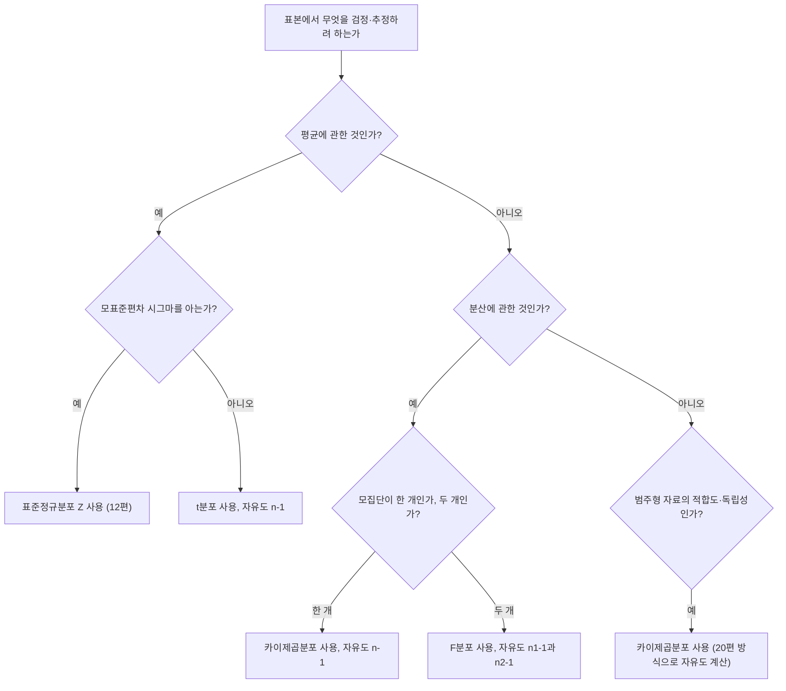

<Callout type="info">
  **이번 문서의 목표:** 이 파일을 다 읽으면 t분포·$\chi^2$분포·F분포가 각각 무엇의 표본분포인지 설명하고, 상황에 맞는 자유도를 계산하며, 분포표를 읽어 임계값을 찾을 수 있다.
</Callout>

## 표준정규분포로는 부족한 상황: t분포가 필요한 이유

### 왜 필요한가

12편에서 배운 것처럼, 모표준편차 $\sigma$(시그마)를 알고 있다면 표본평균을 표준화한 $Z = \dfrac{\bar X - \mu}{\sigma/\sqrt n}$는 정확히(또는 중심극한정리에 의해 근사적으로) 표준정규분포 $N(0,1)$을 따른다. 그런데 현실에서는 $\sigma$를 아는 경우가 거의 없다. 그래서 $\sigma$ 대신 표본에서 계산한 표본표준편차 $s$(06편)를 대신 넣는다.

$$
T = \frac{\bar X - \mu}{s / \sqrt n}
$$

- $T$: t통계량. 표본에서 매번 계산되는 확률변수다.
- $s$: 표본표준편차. $\sigma$의 추정값일 뿐 참값이 아니므로, 표본마다 조금씩 다르게 나온다.

$s$ 자체가 표본마다 흔들리는 추정값이기 때문에, $T$는 $Z$보다 변동성이 더 크다. 이 추가된 불확실성을 반영한 분포가 바로 **t분포**(t-distribution)다.

> **쉽게 말하면:** 모표준편차를 정확히 몰라서 표본표준편차로 대신 어림잡아 쓸 때, 그 어림짐작 때문에 생기는 여분의 불확실성까지 감안해서 만든 분포가 t분포다.

### 정의: 모양과 자유도

t분포는 표준정규분포처럼 0을 중심으로 좌우 대칭인 종 모양이지만, 양쪽 꼬리가 표준정규분포보다 더 두껍다(극단값이 나올 가능성을 더 높게 잡는다는 뜻이다). t분포의 모양은 **자유도**(degrees of freedom, df)라는 하나의 모수로 결정된다.

$$
T \sim t(df),\qquad df = n-1
$$

- $df$: 자유도. 표본크기 $n$에서 표본평균을 이미 계산하는 데 정보 하나를 "써버렸기" 때문에 $n-1$이 된다(직관: 표본평균이 고정되면 $n$개 값 중 $n-1$개만 자유롭게 정해도 나머지 하나는 자동으로 결정되므로 "자유롭게 움직이는" 값의 개수가 $n-1$이라는 뜻이다).
- $df$가 커질수록(즉 표본크기가 커질수록) t분포는 표준정규분포에 점점 가까워진다. 실무적으로 $df \geq 30$ 정도면 거의 구분이 안 될 만큼 비슷해진다.

### 계산 예시

어느 학원에서 학생 $n=16$명을 뽑아 시험 점수를 조사했더니 표본평균 $\bar x = 78$, 표본표준편차 $s=8$이 나왔다. 모평균이 $\mu_0=75$라는 주장을 검정하기 위한 t통계량을 계산해보자.

$$
\sqrt n = \sqrt{16} = 4
$$

$$
\frac{s}{\sqrt n} = \frac{8}{4} = 2
$$

$$
t = \frac{78 - 75}{2} = \frac{3}{2} = 1.5
$$

이 t값은 자유도 $df = 16-1 = 15$인 t분포를 따른다. 17~18편에서 이 값을 t표의 임계값과 비교해 가설을 기각할지 판단하는 절차를 다룬다.

## $\chi^2$분포: 분산의 표본분포

### 왜 필요한가

06편에서 배운 표본분산 $s^2 = \dfrac{\sum(x_i-\bar x)^2}{n-1}$도 표본마다 다른 값이 나오는 확률변수다. 표본분산이 모분산 $\sigma^2$ 주위로 어떻게 흩어지는지를 알아야 분산의 신뢰구간(16편)이나 분산 검정(19~20편)을 만들 수 있다. 이때 등장하는 분포가 카이제곱분포($\chi^2$분포)다.

> **쉽게 말하면:** 표본에서 계산한 분산이 진짜 모분산과 얼마나 다르게 나올 수 있는지를 설명해 주는 분포다.

### 정의

$$
\chi^2 = \frac{(n-1)s^2}{\sigma^2} \sim \chi^2(df),\qquad df = n-1
$$

- $\chi^2$ (카이제곱, chi-squared): 항상 0 이상의 값만 가지는 확률변수. 표준정규분포를 따르는 확률변수 $df$개를 각각 제곱해서 더한 것과 같은 분포다(정의상 음수 제곱합이 나올 수 없어 왼쪽 경계가 0이다).
- $s^2$: 표본분산, $\sigma^2$: 모분산
- $df$: 자유도. 단일 표본에서 분산을 추정할 때는 $n-1$이다.

$\chi^2$분포는 t분포·표준정규분포와 달리 좌우 대칭이 아니라 오른쪽으로 긴 꼬리를 가진 비대칭 분포다. 자유도가 커질수록 점점 좌우 대칭인 종 모양에 가까워진다.

### 계산 예시

$n=10$인 표본에서 표본분산이 $s^2=25$로 나왔고 모분산이 $\sigma^2=16$이라고 알려져 있다고 하자.

$$
n - 1 = 10 - 1 = 9
$$

$$
\chi^2 = \frac{(n-1)s^2}{\sigma^2} = \frac{9 \times 25}{16} = \frac{225}{16} = 14.0625 \approx 14.06
$$

이 값은 자유도 $df=9$인 $\chi^2$분포를 따르는 통계량이며, 16편의 분산 신뢰구간과 20편의 카이제곱 검정에서 이런 식으로 계산한 값을 카이제곱표의 임계값과 비교한다.

## F분포: 두 분산의 비율

### 왜 필요한가

두 모집단의 분산이 같은지 비교하고 싶을 때가 있다(예: 두 반의 시험 점수 흩어짐이 비슷한가). 이때는 두 표본분산의 **비율**을 살펴본다. 두 독립된 $\chi^2$분포를 각각의 자유도로 나눈 뒤 그 둘을 다시 비율로 만든 분포가 F분포다.

> **쉽게 말하면:** "두 그룹 중 어느 쪽이 더 들쭉날쭉한가"를 판단하기 위해, 두 표본분산의 비율이 얼마나 1에서 벗어날 수 있는지를 설명하는 분포다.

### 정의

$$
F = \frac{s_1^2/\sigma_1^2}{s_2^2/\sigma_2^2} \sim F(df_1,\ df_2)
$$

- $F$: F통계량. 두 표본분산의 비율에서 유도된다. 두 모집단의 분산이 같다는 가정($\sigma_1^2=\sigma_2^2$) 아래에서는 $F = s_1^2/s_2^2$로 단순화된다.
- $df_1$: 분자 쪽 표본의 자유도 ($n_1-1$)
- $df_2$: 분모 쪽 표본의 자유도 ($n_2-1$)
- F분포는 $\chi^2$분포처럼 0 이상의 값만 가지며 오른쪽으로 긴 꼬리를 가진 비대칭 분포다. F분포는 두 개의 자유도(분자, 분모)로 모양이 결정되는 점이 t분포·$\chi^2$분포와 다르다.

### 계산 예시

A반 $n_1=13$명의 표본분산이 $s_1^2=36$, B반 $n_2=10$명의 표본분산이 $s_2^2=9$라고 하자. 두 모분산이 같다는 가정 아래 F통계량을 구한다(관행적으로 더 큰 분산을 분자에 놓는다).

$$
df_1 = n_1 - 1 = 13 - 1 = 12
$$

$$
df_2 = n_2 - 1 = 10 - 1 = 9
$$

$$
F = \frac{s_1^2}{s_2^2} = \frac{36}{9} = 4
$$

이 $F=4$ 값은 자유도 $(12, 9)$인 F분포를 따르는 통계량이며, F표에서 해당 자유도 쌍의 임계값과 비교해 "두 반의 분산이 같다"는 가정을 기각할지 19편에서 판단한다.

## 세 분포 대조표

| 구분 | t분포 | $\chi^2$분포 | F분포 |
|---|---|---|---|
| 무엇을 설명하는가 | 모표준편차를 모를 때 표준화한 평균 | 표본분산과 모분산의 비 | 두 표본분산의 비 |
| 모양 | 좌우 대칭, 표준정규분포보다 두꺼운 꼬리 | 오른쪽 꼬리를 가진 비대칭, 0 이상 | 오른쪽 꼬리를 가진 비대칭, 0 이상 |
| 자유도 개수 | 1개 | 1개 | 2개(분자, 분모) |
| 자유도가 커지면 | 표준정규분포에 수렴 | 좌우 대칭에 가까워짐 | 모양이 안정화됨 |
| 대표적 쓰임 | 단일·두 모평균 검정, 평균의 신뢰구간 | 단일 모분산 검정·신뢰구간, 적합도·독립성 검정 | 두 모분산 비교, 분산분석(참고 수준) |
| 관련 단원 | 15, 17–19편 | 16, 20편 | 19편 |

## 분포표 읽는 법

세 분포표 모두 "면적(확률)을 알고 있을 때 그에 대응하는 임계값(경계선 위치)을 찾는" 방식으로 쓴다는 점은 같지만, 표의 생김새는 서로 다르다.

| 표 | 가로축(열) | 세로축(행) | 표 안의 값 |
|---|---|---|---|
| 표준정규분포표(11편) | 소수점 둘째 자리 $z$ | 정수와 소수점 첫째 자리 $z$ | 누적확률 |
| t분포표 | 유의수준(꼬리 확률, 예: 0.05, 0.025, 0.01) | 자유도 $df$ | 임계값 $t$ |
| $\chi^2$분포표 | 유의수준(꼬리 확률) | 자유도 $df$ | 임계값 $\chi^2$ |
| F분포표 | 분자 자유도 $df_1$ | 분모 자유도 $df_2$ (표 자체가 유의수준별로 여러 장) | 임계값 $F$ |

t분포표와 $\chi^2$분포표는 자유도 하나만 확인하면 행을 바로 찾을 수 있지만, F분포표는 자유도가 두 개이므로 먼저 유의수준에 맞는 표를 고른 다음, 분자 자유도로 열을, 분모 자유도로 행을 찾아 교차하는 값을 읽는다. 이 구조 때문에 F표는 유의수준별로 여러 장이 따로 존재한다.

## 어떤 분포를 언제 쓰는가: 판단 트리

## 자유도 계산 규칙: 상황별 표

자유도 계산 실수는 시험에서 가장 잦은 실수 중 하나다. 상황별로 정리한다.

| 상황 | 쓰는 분포 | 자유도 계산 | 비고 |
|---|---|---|---|
| 단일 모평균 검정·신뢰구간 ($\sigma$ 모름) | t분포 | $n-1$ | $n$은 표본크기 |
| 두 독립표본 평균 비교 (등분산 가정) | t분포 | $n_1+n_2-2$ | 두 표본 각각 정보 하나씩 총 2개를 씀 |
| 대응(짝지은) 표본 평균 비교 | t분포 | $n_d-1$ | $n_d$는 차이값의 개수(=쌍의 수) |
| 단일 모분산 검정·신뢰구간 | $\chi^2$분포 | $n-1$ | |
| 카이제곱 적합도 검정 | $\chi^2$분포 | $k-1$ | $k$는 범주(칸)의 개수 |
| 카이제곱 독립성 검정 | $\chi^2$분포 | $(r-1)(c-1)$ | $r$은 교차표의 행 개수, $c$는 열 개수 |
| 두 모분산 비교 | F분포 | $df_1=n_1-1$, $df_2=n_2-1$ | 자유도가 두 개(분자·분모) |

**카이제곱 독립성 검정의 자유도 계산 예시**: 교차표가 3행(행 개수 $r=3$) 4열(열 개수 $c=4$)이라면 자유도는 다음과 같다.

$$
df = (r-1)(c-1) = (3-1)(4-1) = 2 \times 3 = 6
$$

- $r-1$: 행 개수에서 1을 뺀 값
- $c-1$: 열 개수에서 1을 뺀 값
- 곱하는 이유(직관): 교차표의 각 칸(cell)은 행의 합·열의 합이라는 제약을 만족해야 하므로, 행과 열 각각에서 "자유롭게 정할 수 있는" 개수를 곱한 만큼만 실제로 자유롭게 움직인다.

## 자주 틀리는 점

- **t분포의 자유도를 $n$으로 쓴다.** 단일표본 t분포는 $n-1$이지, $n$이 아니다. 표본평균을 계산하면서 정보 1개를 이미 소모했다는 점을 잊지 않는다.
- **두 독립표본 t검정의 자유도를 $n_1-1$이나 $n_2-1$ 하나만 쓴다.** 등분산을 가정하는 경우 두 표본 각각에서 정보 1개씩을 쓰므로 $n_1+n_2-2$가 맞다.
- **카이제곱 독립성 검정에서 자유도를 $r \times c$로 계산한다.** 옳은 공식은 $(r-1)(c-1)$이다. 행 개수와 열 개수에서 각각 1씩 뺀 뒤 곱한다.
- **F통계량을 만들 때 분자·분모를 마음대로 바꾼다.** 어느 표본분산을 분자에 놓느냐에 따라 F값과 그에 대응하는 자유도 순서($df_1, df_2$)가 함께 바뀐다는 점을 주의해야 한다. 관행적으로 더 큰 분산을 분자로 놓지만, 문제에서 순서를 지정했다면 그 순서를 그대로 따라야 한다.
- **$\chi^2$분포와 F분포도 t분포·표준정규분포처럼 좌우 대칭일 것이라 생각한다.** 이 둘은 0 이상의 값만 가지는 오른쪽 꼬리 분포이며, 표에서 임계값을 찾을 때 좌우 대칭을 가정한 지름길(예: 절댓값 처리)을 쓸 수 없다.
- **자유도가 커지면 t분포가 정규분포와 완전히 같아진다고 착각한다.** 자유도가 커질수록 "가까워질" 뿐, 자유도가 유한한 한 t분포는 표준정규분포보다 꼬리가 항상 조금 더 두껍다.

## 핵심 정리

- t분포는 모표준편차를 몰라 표본표준편차로 대신할 때 생기는 여분의 불확실성을 반영한 분포이며, 자유도는 $n-1$이다.
- $\chi^2$분포는 표본분산과 모분산의 비율에서 나오는 분포로, 자유도 $n-1$을 가지며 0 이상의 비대칭 분포다.
- F분포는 두 표본분산의 비율에서 나오는 분포로, 분자·분모 각각의 자유도 두 개로 모양이 결정된다.
- 자유도 계산은 상황마다 다르다: 단일평균 $n-1$, 두 독립표본평균 $n_1+n_2-2$, 카이제곱 적합도 $k-1$, 카이제곱 독립성 $(r-1)(c-1)$, F분포는 $(n_1-1,\ n_2-1)$.
- "평균이냐 분산이냐", "모집단이 한 개냐 두 개냐", "$\sigma$를 아느냐 모르느냐"의 세 가지 질문으로 어떤 분포를 쓸지 판단할 수 있다.

## 마무리 복습

<Quiz
  questionNumber={1}
  question="표본크기 n=20인 단일 표본에서 모표준편차를 모를 때 모평균을 검정하기 위해 사용하는 분포와 그 자유도는?"
  options={['표준정규분포, 자유도 없음', 't분포, 자유도 19', 't분포, 자유도 20', '카이제곱분포, 자유도 19']}
  correctAnswer={2}
  explanation="모표준편차를 모르므로 t분포를 쓰고, 단일표본의 자유도는 n-1이므로 20-1인 19가 된다."
  optionExplanations={['모표준편차를 모르므로 표준정규분포가 아니라 t분포를 써야 하므로 틀렸다', 't분포와 자유도 19를 모두 정확히 계산한 정답이다', '분포 선택은 맞지만 자유도에서 1을 빼지 않아 틀렸다', '평균 검정에는 카이제곱분포가 아니라 t분포를 쓰므로 틀렸다']}
/>

<Quiz
  questionNumber={2}
  question="교차표가 4행 5열로 이루어진 카이제곱 독립성 검정의 자유도는?"
  options={['9', '12', '20', '19']}
  correctAnswer={2}
  explanation="독립성 검정의 자유도는 (행 개수-1) 곱하기 (열 개수-1)이다. (4-1)과 (5-1)을 곱하면 3 곱하기 4인 12가 된다."
  optionExplanations={['행 개수와 열 개수에서 1씩 뺀 값을 곱하지 않고 더한 값이므로 틀렸다', '(4-1) 곱하기 (5-1)을 정확히 계산한 12로 정답이다', '행 개수와 열 개수를 그대로 곱한 값으로 1을 빼지 않아 틀렸다', '행 개수 곱하기 열 개수에서 1을 뺀 값으로 계산 순서가 틀렸다']}
/>

<Quiz
  questionNumber={3}
  question="A그룹(n1=11)과 B그룹(n2=8)의 분산이 같은지 F검정으로 비교할 때, 분자 자유도와 분모 자유도를 순서대로 옳게 짝지은 것은? (A그룹 분산을 분자로 사용)"
  options={['11, 8', '10, 7', '7, 10', '19, 2']}
  correctAnswer={2}
  explanation="F분포의 자유도는 각 표본크기에서 1을 뺀 값이다. 분자는 A그룹의 n1-1인 10, 분모는 B그룹의 n2-1인 7이다."
  optionExplanations={['표본크기를 그대로 자유도로 사용해 1을 빼지 않았으므로 틀렸다', '두 표본 각각에서 1씩 뺀 10과 7을 순서대로 배치한 정답이다', '분자와 분모의 순서가 반대로 되어 있으므로 틀렸다', '두 독립표본 t검정의 자유도 계산 방식을 잘못 적용한 오답이다']}
/>

<Quiz
  questionNumber={4}
  question="n=13인 표본에서 표본분산이 s제곱=18, 모분산이 시그마제곱=12로 알려져 있을 때 카이제곱 통계량의 값은? (소수점 둘째 자리까지)"
  options={['13.00', '18.00', '15.00', '16.00']}
  correctAnswer={2}
  explanation="카이제곱 통계량은 (n-1) 곱하기 표본분산을 모분산으로 나눈 값이다. n-1은 12이고, 12 곱하기 18은 216이며, 216을 12로 나누면 18이 된다."
  optionExplanations={['자유도 12를 그대로 답으로 쓴 오답이다', '(n-1)과 표본분산의 곱을 모분산으로 나눈 값 18을 정확히 계산한 정답이다', '18과 12의 평균처럼 임의로 계산한 오답이다', '반올림 과정에서 계산을 잘못한 오답이다']}
/>

<Quiz
  questionNumber={5}
  question="t분포, 카이제곱분포, F분포에 대한 설명으로 옳은 것은?"
  options={['세 분포 모두 좌우 대칭이다', 't분포는 자유도가 커질수록 표준정규분포에 가까워진다', '카이제곱분포는 음수 값도 가질 수 있다', 'F분포는 자유도를 하나만 가진다']}
  correctAnswer={2}
  explanation="t분포는 자유도가 커질수록 표준정규분포에 가까워지는 성질을 가진다. 카이제곱분포와 F분포는 좌우 대칭이 아니며 0 이상의 값만 가지고, F분포는 분자·분모 두 개의 자유도를 가진다."
  optionExplanations={['카이제곱분포와 F분포는 오른쪽 꼬리를 가진 비대칭 분포이므로 틀렸다', 't분포의 핵심 성질을 정확히 설명한 정답이다', '카이제곱분포는 제곱합에서 나온 분포라 항상 0 이상의 값만 가지므로 틀렸다', 'F분포는 분자와 분모 두 개의 자유도로 모양이 결정되므로 틀렸다']}
/>

<Quiz
  questionNumber={6}
  question="어떤 검정에서 '두 반의 시험 점수 평균이 같은가'를 두 독립표본(n1=15, n2=12)으로 검정하며 등분산을 가정할 때, 사용할 분포와 자유도는?"
  options={['t분포, 자유도 27', 't분포, 자유도 25', '카이제곱분포, 자유도 25', 'F분포, 자유도 14와 11']}
  correctAnswer={2}
  explanation="두 독립표본 평균 비교는 t분포를 쓰며 등분산 가정 시 자유도는 n1+n2-2이다. 15+12에서 2를 빼면 25가 된다."
  optionExplanations={['n1+n2에서 2를 빼지 않은 값이므로 틀렸다', 'n1+n2-2를 정확히 계산한 25로 정답이다', '평균 비교에는 t분포를 쓰지 카이제곱분포를 쓰지 않으므로 틀렸다', 'F분포는 분산 비교에 쓰는 분포이므로 평균 비교 상황에는 맞지 않는다']}
/>

## 참고 자료

- [NIST/SEMATECH e-Handbook of Statistical Methods — Sampling Distributions and t, chi-square, F](https://www.itl.nist.gov/div898/handbook/)
- [Wolfram MathWorld — Student's t-Distribution, Chi-Squared Distribution, F-Distribution](https://mathworld.wolfram.com)
- [국가평생교육진흥원 독학학위제](https://bdes.nile.or.kr)
