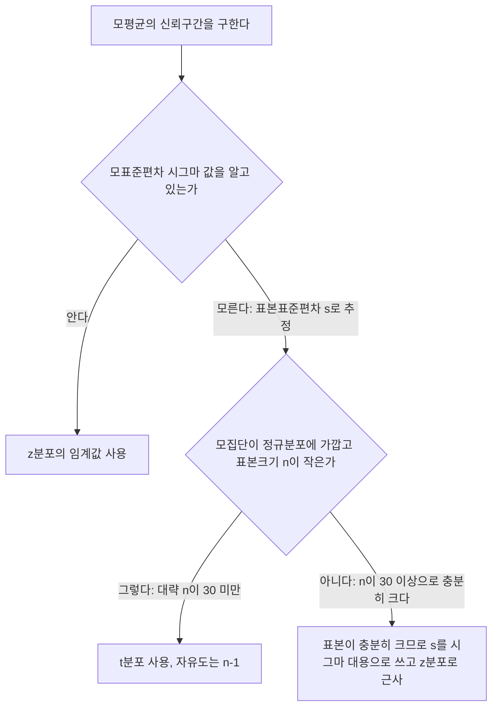

<Callout type="info">
  **이번 문서의 목표:** 이 문서를 다 읽으면 모표준편차를 아는 경우와 모르는 경우를 구분해 모평균의 신뢰구간을 직접 계산하고, "95% 신뢰구간"이라는 말을 정확한 문장으로 해석할 수 있습니다.
</Callout>

## 왜 "구간"으로 추정하는가 — 점추정만으로는 부족하다

14편에서 점추정(point estimation)을 다뤘습니다. 표본평균 $\bar{X}$(엑스바, 표본의 평균)를 모평균 $\mu$(뮤, 모집단의 평균)의 추정값으로 쓴다는 내용이었습니다. 자세한 성질은 14편을 참고하세요.

> **쉽게 말하면:** 점추정은 "정답은 아마 여기쯤"이라고 숫자 하나를 딱 찍는 것이고, 구간추정은 "정답은 이 범위 안에 있을 가능성이 높다"고 폭을 두고 말하는 것입니다.

문제는 표본평균이 모평균과 정확히 일치할 가능성이 사실상 0에 가깝다는 점입니다. 표본을 새로 뽑을 때마다 $\bar{X}$ 값이 조금씩 달라지기 때문입니다(표집오차, sampling error). 그래서 "$\bar{X}$가 곧 $\mu$다"라고 단정하는 대신, "이 범위 안 어딘가에 $\mu$가 있을 것이다"라고 폭을 가진 구간으로 말하는 쪽이 훨씬 정직한 표현입니다. 이 구간을 **신뢰구간**(confidence interval, 줄여서 CI)이라고 부릅니다.

비유하자면, 친구에게 "지금 몇 시야?"라고 물었을 때 "정확히 3시 14분 27초"라고 답하는 것보다 "3시에서 3시 15분 사이"라고 답하는 쪽이 틀릴 위험이 훨씬 적은 것과 같습니다. 폭을 인정하는 대신 맞을 확률을 높이는 전략입니다.

## 신뢰수준과 오차한계

> **쉽게 말하면:** 신뢰수준은 "이 방법을 반복해서 쓰면 몇 퍼센트나 성공하는가"이고, 오차한계는 "중심에서 양옆으로 얼마나 벌리는가"입니다.

### 신뢰수준(confidence level)

신뢰수준은 같은 절차(같은 표본크기, 같은 계산 방법)로 신뢰구간을 반복해서 만들었을 때, 그 구간들 중 실제로 모수(모평균 $\mu$)를 포함하는 구간의 비율을 뜻합니다. 기호로는 $1-\alpha$(1 마이너스 알파)로 씁니다.

- $\alpha$(알파)는 **유의수준**(significance level)이라 부르며, "실패를 허용하는 비율"입니다. $\alpha=0.05$면 신뢰수준은 $1-0.05=0.95$, 즉 95%입니다.
- 신뢰수준 95%인 신뢰구간을 만드는 절차를 100번 반복하면, 대략 95개의 구간이 실제 모평균을 포함하고 5개는 포함하지 못한다는 뜻입니다(정확한 의미는 이 문서 뒤쪽 "자주 틀리는 점"에서 다시 정확히 짚습니다).

### 오차한계(margin of error)

오차한계는 점추정값(표본평균)에서 양옆으로 얼마나 폭을 주는지를 나타내는 값입니다. 기호로는 보통 $E$로 씁니다.

$$
E = (\text{임계값}) \times (\text{표준오차})
$$

- 임계값(critical value): 신뢰수준에 대응하는 표준정규분포 또는 t분포의 값. 아래에서 바로 다룹니다.
- 표준오차(standard error, SE): 표본평균의 표준편차. 12편에서 다룬 $\sigma/\sqrt{n}$(시그마를 표본크기의 제곱근으로 나눈 값)입니다. 자세한 유도는 12편을 참고하세요.

신뢰구간은 항상 다음 모양입니다.

$$
(\text{점추정값}) - E \le \mu \le (\text{점추정값}) + E
$$

즉 "점추정값 ± 오차한계"입니다. 아래에서 이 $E$를 어떻게 계산하는지, 모표준편차 $\sigma$(시그마)를 아는 경우와 모르는 경우로 나눠 살펴봅니다.

### 신뢰수준별 z 임계값

모표준편차를 아는 경우 쓰는 임계값은 표준정규분포(11편 참고)에서 양쪽 꼬리에 남기는 넓이로 정해집니다. 예를 들어 신뢰수준 95%면 전체 넓이 1에서 0.95를 뺀 0.05를 양쪽 꼬리에 절반씩(각 0.025) 나눠 남깁니다. 표준정규분포표에서 "오른쪽 꼬리 넓이가 0.025가 되는 지점"을 찾으면 그 값이 1.96입니다.

| 신뢰수준 | 양쪽 꼬리 합 $\alpha$ | 한쪽 꼬리 $\alpha/2$ | z 임계값 $z_{\alpha/2}$ |
|---|---|---|---|
| 90% | 0.10 | 0.050 | 1.645 |
| 95% | 0.05 | 0.025 | 1.96 |
| 99% | 0.01 | 0.005 | 2.576 |

이 표의 z값은 표준정규분포표(11편에서 다룬 z표)에서 직접 찾은 값이며, 통계 문제에서 가장 자주 쓰이는 세 가지 신뢰수준이므로 외워두면 계산이 빨라집니다.

## 모분산을 아는 경우: z 신뢰구간

공정이 오래 운영되어 모표준편차 $\sigma$가 이미 알려져 있는 상황을 가정합니다(현실에서는 드물지만, 계산 원리를 배우는 기준 사례입니다).

$$
\bar{x} - z_{\alpha/2}\frac{\sigma}{\sqrt{n}} \le \mu \le \bar{x} + z_{\alpha/2}\frac{\sigma}{\sqrt{n}}
$$

- $\bar{x}$: 표본평균(실제로 관측한 값 하나)
- $z_{\alpha/2}$: 신뢰수준에 대응하는 z 임계값(위 표 참고)
- $\sigma$: 모표준편차(이미 알려진 값)
- $n$: 표본크기
- $\sigma/\sqrt{n}$: 표본평균의 표준오차

### 예시: 볼트 지름 측정

한 공장에서 오랜 생산 이력으로 볼트 지름의 모표준편차가 $\sigma=1.5$밀리미터로 알려져 있습니다. 오늘 생산분에서 $n=25$개를 무작위로 뽑아 측정했더니 표본평균이 $\bar{x}=50.2$밀리미터였습니다. 모평균 $\mu$의 95% 신뢰구간을 구합니다.

**1단계 — 표준오차 계산**

$$
SE = \frac{\sigma}{\sqrt{n}} = \frac{1.5}{\sqrt{25}} = \frac{1.5}{5} = 0.3
$$

**2단계 — 오차한계 계산 (95%이므로 $z_{0.025}=1.96$)**

$$
E = z_{0.025} \times SE = 1.96 \times 0.3 = 0.588
$$

**3단계 — 신뢰구간 계산**

$$
50.2 - 0.588 \le \mu \le 50.2 + 0.588
$$

$$
49.612 \le \mu \le 50.788
$$

**검산**: 구간의 중심은 $(49.612+50.788)/2=50.2$로 표본평균과 정확히 같아야 하고, 중심에서 양 끝까지의 거리는 $(50.788-49.612)/2=0.588$로 오차한계 $E$와 같아야 합니다. 둘 다 일치하므로 계산이 맞습니다.

**해석**: "이 절차로 신뢰구간을 반복해서 만들면 그중 95%가 모평균을 포함할 것이라는 신뢰수준 아래, 오늘 뽑은 표본으로 계산한 구간 (49.612, 50.788)밀리미터가 모평균의 추정 범위다"라고 말합니다. "모평균이 이 구간 안에 있을 확률이 95%다"라고 말하면 왜 안 되는지는 뒤에서 정확히 다룹니다.

## 모분산을 모르는 경우: t 신뢰구간

현실에서는 모표준편차 $\sigma$를 아는 경우가 오히려 드뭅니다. 보통은 표본에서 계산한 표본표준편차 $s$로 $\sigma$를 대신 추정해야 합니다. 그런데 $s$ 자체도 표본마다 달라지는 추정값이라 오차가 하나 더 생깁니다. 이 추가 불확실성을 반영하려면 표준정규분포보다 꼬리가 더 두꺼운 **t분포**(13편에서 다룬 스튜던트 t분포)를 써야 합니다.

> **쉽게 말하면:** $\sigma$를 알면 자로 잰 듯 정확하게 z를 쓰고, $\sigma$를 몰라 $s$로 어림잡으면 그 어림값의 오차까지 감안해 좀 더 관대한(꼬리가 두꺼운) t를 씁니다.

t분포는 **자유도**(degrees of freedom, df)라는 모수를 하나 더 가집니다. 표본평균을 이미 구하는 데 표본 하나의 정보를 썼기 때문에, 표본표준편차를 계산할 때 자유롭게 움직일 수 있는 값의 개수가 $n$이 아니라 $n-1$로 줄어듭니다. 그래서 자유도는 $n-1$입니다(자세한 유도는 13편 참고).

$$
\bar{x} - t_{\alpha/2, \, n-1}\frac{s}{\sqrt{n}} \le \mu \le \bar{x} + t_{\alpha/2, \, n-1}\frac{s}{\sqrt{n}}
$$

- $t_{\alpha/2, \, n-1}$: 자유도 $n-1$인 t분포에서, 한쪽 꼬리 넓이가 $\alpha/2$가 되는 임계값(t분포표에서 찾음)
- $s$: 표본표준편차(표본에서 직접 계산, 분모가 $n-1$인 공식 사용 — 06편 참고)
- 나머지 기호는 z 신뢰구간과 동일

### 예시: 커피 한 잔의 무게

한 카페에서 만드는 아메리카노 한 잔의 무게(그람)가 궁금합니다. 모표준편차는 모르는 상태에서 $n=16$잔을 무작위로 뽑아 무게를 쟀더니 표본평균 $\bar{x}=72.4$그람, 표본표준편차 $s=8.2$그람이 나왔습니다. 모평균의 95% 신뢰구간을 구합니다.

**1단계 — 자유도 계산**

$$
df = n - 1 = 16 - 1 = 15
$$

**2단계 — t 임계값 찾기**

t분포표에서 자유도 15, 양쪽 꼬리 합 $\alpha=0.05$(한쪽 0.025) 행과 열이 만나는 값은 $t_{0.025,15}=2.131$입니다.

**3단계 — 표준오차 계산**

$$
SE = \frac{s}{\sqrt{n}} = \frac{8.2}{\sqrt{16}} = \frac{8.2}{4} = 2.05
$$

**4단계 — 오차한계 계산**

$$
E = t_{0.025,15} \times SE = 2.131 \times 2.05 = 4.36855
$$

소수 둘째 자리로 반올림하면 $E \approx 4.37$입니다.

**5단계 — 신뢰구간 계산**

$$
72.4 - 4.37 \le \mu \le 72.4 + 4.37
$$

$$
68.03 \le \mu \le 76.77
$$

**검산**: 중심 $(68.03+76.77)/2=72.4$(표본평균과 일치), 반폭 $(76.77-68.03)/2=4.37$(오차한계와 일치). 계산이 맞습니다.

**해석**: 이 카페 아메리카노 한 잔의 평균 무게는 95% 신뢰수준에서 68.03그람에서 76.77그람 사이로 추정됩니다.

## z냐 t냐: 판단 흐름

모평균 신뢰구간을 구할 때 z와 t 중 어느 것을 쓸지는 다음 순서로 판단합니다.

표본크기 30은 정확한 경계선이라기보다 "중심극한정리(12편 참고)가 잘 작동하기 시작하는 지점"으로 흔히 쓰는 관행적 기준입니다. $n$이 30 이상이면 표본표준편차 $s$로 추정해도 t분포와 z분포의 차이가 실용적으로 거의 없어지므로 z분포로 근사해서 계산해도 무방합니다.

## 표본크기 설계 — 원하는 정밀도를 미리 확보하기

조사를 시작하기 전에 "오차한계를 이 값 이하로 만들려면 표본을 몇 개 뽑아야 하는가"를 미리 계산할 수 있습니다. z 신뢰구간의 오차한계 공식 $E=z_{\alpha/2}\,\sigma/\sqrt{n}$을 $n$에 대해 정리하면 됩니다.

$$
n = \left(\frac{z_{\alpha/2}\,\sigma}{E}\right)^2
$$

- $E$: 원하는(목표로 하는) 오차한계
- $\sigma$: 모표준편차(모르면 과거 자료나 예비조사 표본표준편차로 대신 추정)
- 계산 결과는 항상 **올림**(반올림이 아니라 무조건 올림)합니다. 소수점 아래를 버리면 목표한 정밀도에 못 미치기 때문입니다.

### 예시

과거 자료로 모표준편차가 $\sigma=2.0$그람 정도로 추정되는 상황에서, 95% 신뢰수준으로 오차한계를 $E=0.5$그람 이하로 만들고 싶습니다. 필요한 표본크기는?

**1단계 — 대입**

$$
n = \left(\frac{1.96 \times 2.0}{0.5}\right)^2
$$

**2단계 — 분자 계산**

$$
1.96 \times 2.0 = 3.92
$$

**3단계 — 나눗셈**

$$
\frac{3.92}{0.5} = 7.84
$$

**4단계 — 제곱**

$$
7.84^2 = 61.4656
$$

**5단계 — 올림**

$$
n = 62
$$

**해석**: 최소 62개의 표본을 뽑아야 95% 신뢰수준에서 오차한계 0.5그람 이하를 보장할 수 있습니다. 61개로는 부족합니다(61일 때 오차한계가 0.5그람을 살짝 넘어섭니다).

## 자주 틀리는 점

- **"95% 신뢰구간 안에 모평균이 있을 확률이 95%다"는 부정확한 표현입니다.** 모평균 $\mu$는 미지수이긴 하지만 이미 정해져 있는 고정된 값이지, 표본마다 달라지는 확률변수가 아닙니다. 표본을 뽑기 전에는 "이 절차로 만든 구간이 $\mu$를 포함할 확률이 95%"라고 말할 수 있지만, 표본을 뽑아 구간 (49.612, 50.788)처럼 숫자가 확정되고 나면 그 특정 구간이 $\mu$를 포함하는지 여부는 이미 "포함한다" 또는 "포함하지 않는다" 둘 중 하나로 정해져 있을 뿐, 더 이상 확률의 문제가 아닙니다. 정확한 표현은 "이 절차를 반복하면 만들어지는 구간들 중 95%가 모평균을 포함한다"는 **장기적으로 반복했을 때의 성공률**입니다. 과녁에 고리를 던지는 비유로 보면, 과녁(모평균)은 고정되어 있고 고리(신뢰구간)가 매번 랜덤하게 던져집니다. "100번 던지면 95번은 과녁을 감쌀 것이다"는 던지기 전의 확률 진술이지, 이미 던져서 바닥에 떨어진 특정 고리 하나를 보고 "이 고리가 과녁을 감쌌을 확률이 95%다"라고 말하는 것과는 다릅니다.
- **모표준편차를 아는지 모르는지를 확인하지 않고 무조건 z를 쓰는 실수.** 시험 문제에서 "모표준편차"라는 말이 나오면 z, "표본표준편차"라는 말만 나오고 모표준편차 언급이 없으면(표본크기가 작으면) t를 써야 합니다.
- **자유도를 $n$으로 착각.** t분포의 자유도는 $n-1$입니다. $n$을 그대로 t표에 넣으면 임계값이 틀려집니다.
- **표준오차와 표준편차를 혼동.** $\sigma$나 $s$ 자체가 아니라 그것을 $\sqrt{n}$으로 나눈 값이 표준오차입니다. 표준편차를 그대로 오차한계 계산에 넣는 실수가 흔합니다.
- **표본크기 계산 결과를 반올림하는 실수.** $n=61.x$가 나왔다고 61로 반올림하면 목표 정밀도를 달성하지 못합니다. 반드시 올림해서 62로 씁니다.

## 핵심 정리

- 신뢰구간은 "점추정값 ± 오차한계" 형태이며, 오차한계는 임계값과 표준오차의 곱입니다.
- 모표준편차 $\sigma$를 알면 z분포, 모르면(표본표준편차 $s$로 추정) t분포(자유도 $n-1$)를 씁니다. 단, 표본이 충분히 크면(관행적으로 $n \ge 30$) z로 근사해도 됩니다.
- 95%, 90%, 99% 신뢰수준에 대응하는 z 임계값은 각각 1.96, 1.645, 2.576입니다.
- 목표 오차한계를 미리 정하면 필요한 표본크기를 역산할 수 있으며, 계산 결과는 항상 올림합니다.
- "신뢰구간이 모평균을 포함할 확률 95%"라는 말은 절차를 반복했을 때의 장기적 성공률이지, 이미 계산된 특정 구간 하나에 대한 확률 진술이 아닙니다.

## 마무리 복습

<Quiz
  questionNumber={1}
  question="95% 신뢰수준에서 사용하는 표준정규분포의 z 임계값은 얼마인가?"
  options={['1.645', '1.96', '2.326', '2.576']}
  correctAnswer={2}
  explanation="95% 신뢰구간은 양쪽 꼬리에 각각 2.5%씩 총 5%의 오차를 허용하므로, 표준정규분포표에서 오른쪽 꼬리 넓이가 0.025인 지점을 찾으면 1.96이 됩니다."
  optionExplanations={['1.645는 90% 신뢰구간(양쪽 꼬리 각 5%)에서 쓰는 z값입니다.', '95% 신뢰구간은 양쪽 꼬리가 각각 2.5%이므로 1.96이 맞습니다.', '2.326은 98% 신뢰구간에서 쓰는 z값입니다.', '2.576은 99% 신뢰구간(양쪽 꼬리 각 0.5%)에서 쓰는 z값입니다.']}
/>

<Quiz
  questionNumber={2}
  question="모표준편차가 1.5이고 표본크기가 25인 표본에서 표본평균 50.2를 얻었다. 95% 신뢰구간의 오차한계는 얼마인가? (z=1.96 사용)"
  options={['0.3', '0.588', '0.98', '1.176']}
  correctAnswer={2}
  explanation="표준오차는 시그마를 표본크기의 제곱근으로 나눈 1.5 나누기 5는 0.3입니다. 오차한계는 z값과 표준오차의 곱인 1.96 곱하기 0.3은 0.588입니다."
  optionExplanations={['0.3은 표준오차 값이지 오차한계가 아닙니다.', '1.96×0.3=0.588이 정답입니다.', '0.98은 1.96×0.5로 잘못 계산한 값입니다.', '1.176은 오차한계를 두 배로 계산한 값(신뢰구간 전체 폭)입니다.']}
/>

<Quiz
  questionNumber={3}
  question="모표준편차를 모르고 표본크기가 작을 때(예: n=16) 모평균의 신뢰구간을 구하려면 어떤 분포를 써야 하는가?"
  options={['표준정규분포(z분포)', '자유도 n인 t분포', '자유도 n-1인 t분포', '카이제곱분포']}
  correctAnswer={3}
  explanation="모표준편차를 몰라 표본표준편차로 추정할 때는 그 추정 오차까지 반영하는 t분포를 쓰며, 자유도는 표본평균 계산에 정보 하나를 썼으므로 n-1입니다."
  optionExplanations={['z분포는 모표준편차를 아는 경우에 씁니다.', '자유도는 n이 아니라 n-1입니다.', 't분포이고 자유도는 n-1이므로 이 답이 맞습니다.', '카이제곱분포는 모분산의 신뢰구간을 구할 때 쓰입니다.']}
/>

<Quiz
  questionNumber={4}
  question="표본크기 16, 표본평균 72.4, 표본표준편차 8.2인 자료로 95% t 신뢰구간을 구하면 오차한계는 약 얼마인가? (t(0.025, 15)=2.131 사용)"
  options={['2.05', '2.131', '4.37', '8.2']}
  correctAnswer={3}
  explanation="표준오차는 8.2 나누기 4(표본크기 16의 제곱근)는 2.05입니다. 오차한계는 t임계값과 표준오차의 곱인 2.131 곱하기 2.05는 약 4.37입니다."
  optionExplanations={['2.05는 표준오차 값입니다.', '2.131은 t 임계값 자체이지 오차한계가 아닙니다.', '2.131×2.05≈4.37이 오차한계이므로 이 답이 맞습니다.', '8.2는 표본표준편차 값입니다.']}
/>

<Quiz
  questionNumber={5}
  question="95% 신뢰수준에서 오차한계를 0.5 이하로 만들려면 몇 명의 표본이 필요한가? (모표준편차 추정치 2.0, z=1.96 사용)"
  options={['31명', '61명', '62명', '124명']}
  correctAnswer={3}
  explanation="n=(1.96×2.0/0.5)의 제곱을 계산하면 7.84의 제곱인 61.4656이 나옵니다. 목표 정밀도를 확실히 달성하려면 소수점을 무조건 올림해야 하므로 62명이 필요합니다."
  optionExplanations={['31명은 계산 과정에서 제곱을 빠뜨린 값입니다.', '61명으로 반올림하면 목표 오차한계를 달성하지 못합니다.', '61.4656을 올림한 62명이 정답입니다.', '124명은 61.4656을 두 배로 잘못 계산한 값입니다.']}
/>

<Quiz
  questionNumber={6}
  question="95% 신뢰구간 (49.612, 50.788)을 얻었을 때 가장 정확한 해석은 무엇인가?"
  options={['모평균이 이 구간에 있을 확률이 95%다', '표본평균이 이 구간에 있을 확률이 95%다', '이 절차를 반복해 구간을 만들면 그중 95%가 모평균을 포함할 것이다', '모평균은 정확히 50.2이며 오차 범위는 무시할 수 있다']}
  correctAnswer={3}
  explanation="모평균은 이미 고정된 값이므로 특정 구간 하나에 대해 확률을 말할 수 없습니다. 신뢰수준 95%는 같은 절차를 반복해서 신뢰구간을 만들었을 때 그중 95%가 모평균을 포함한다는 장기적 성공률을 뜻합니다."
  optionExplanations={['모평균은 확률변수가 아니라 고정된 값이므로 이 표현은 부정확합니다.', '표본평균은 이미 50.2로 관측된 값이라 확률을 논할 대상이 아닙니다.', '절차를 반복했을 때의 장기적 성공률이라는 표현이 정확한 해석입니다.', '신뢰구간에는 항상 오차한계가 존재하며 이를 무시할 수 없습니다.']}
/>

<Quiz
  questionNumber={7}
  question="표본크기가 40인 자료로 모평균 신뢰구간을 구하는데 모표준편차를 모른다. 가장 적절한 처리 방법은?"
  options={['자유도 39인 t분포를 반드시 써야 한다', '표본이 충분히 크므로 표본표준편차를 시그마 대용으로 써서 z분포로 근사해도 무방하다', '표본크기가 작으므로 계산이 불가능하다', '카이제곱분포를 사용해야 한다']}
  correctAnswer={2}
  explanation="표본크기가 관행적 기준인 30 이상으로 충분히 크면 중심극한정리에 의해 표본표준편차로 추정해도 t분포와 z분포의 차이가 실용적으로 거의 없으므로 z분포로 근사할 수 있습니다."
  optionExplanations={['t분포를 써도 틀리지는 않지만 이 상황에서는 z분포 근사가 더 일반적으로 쓰이는 적절한 처리입니다.', '표본이 충분히 크므로 z분포 근사가 가장 적절한 처리 방법입니다.', '표본크기 40은 충분히 커서 계산이 가능합니다.', '카이제곱분포는 모분산 신뢰구간에 쓰이며 이 문제와는 관련이 없습니다.']}
/>

## 참고 자료

- [NIST/SEMATECH e-Handbook of Statistical Methods](https://www.itl.nist.gov/div898/handbook/)
- [국가평생교육진흥원 독학학위제](https://bdes.nile.or.kr)
