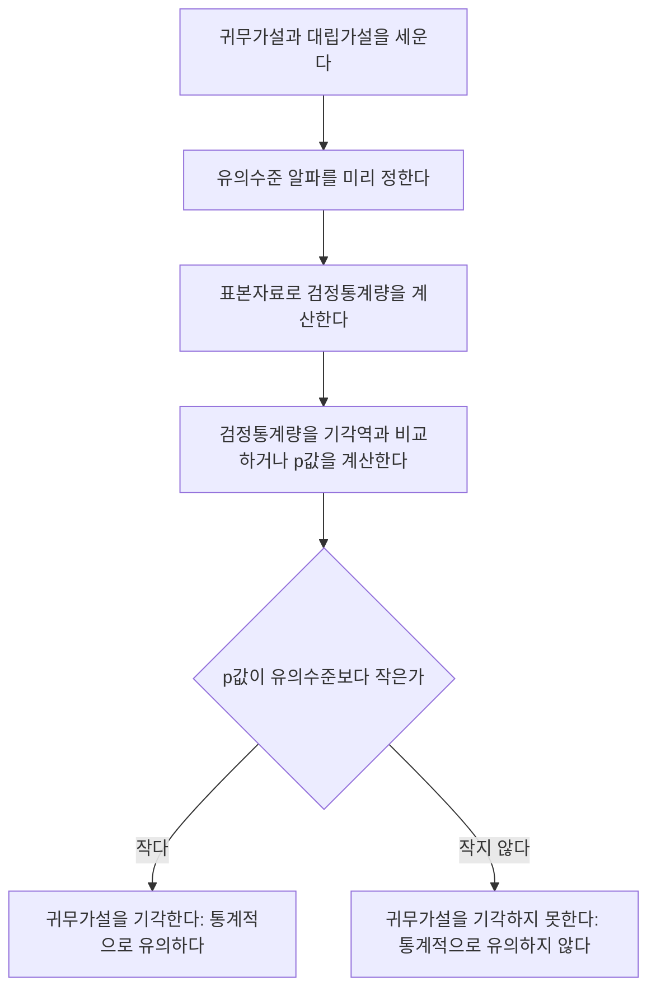

## 왜 가설검정이 필요한가 — "우연"과 "진짜 차이"를 구분하기

14편과 15편에서는 모수(모평균, 모비율, 모분산)의 값을 "이 범위 어딘가"라고 추정하는 방법을 다뤘습니다. 이를 **가설검정**(hypothesis testing)이라고 합니다.

예를 들어 한 카페가 "우리 아메리카노 한 잔은 평균 75그람이다"라고 광고합니다. 실제로 표본을 뽑아 재보니 평균이 72.4그람이 나왔습니다.

## 귀무가설과 대립가설 — 무엇을 두고 다투는가

가설검정은 항상 서로 반대되는 두 가설을 세우는 것에서 시작합니다.

- **귀무가설**(null hypothesis, 기호 $H_0$, 에이치 제로 또는 에이치 노트): 지금까지 인정되어 온 주장, 혹은 "차이가 없다", "효과가 없다"는 기본 가정. 등호(=)를 포함하는 형태로 씁니다.
- **대립가설**(alternative hypothesis, 기호 $H_1$ 또는 $H_a$): 연구자가 실제로 의심하거나 입증하고 싶은 주장. 부등호($\neq$, $>$, $<$)로 씁니다.

카페 예시라면 다음과 같이 세웁니다.

$$
H_0: \mu = 75
$$

$$
H_1: \mu \neq 75
$$

- $\mu$: 아메리카노 한 잔의 모평균 무게(그람)
- $H_1$이 $\neq$(같지 않다)인 경우를 **양측검정**(two-tailed test)이라 하고, $>$ 또는 $<$인 경우를 **단측검정**(one-tailed test)이라 합니다. "카페가 광고보다 가볍게 준다"는 의심이 확실하면 $H_1: \mu < 75$처럼 단측으로 세울 수도 있지만, 단순히 "다르다"는 의심이면 양측으로 세웁니다. 이 문서의 예시는 양측검정을 기준으로 설명합니다.

가설검정 절차는 항상 귀무가설을 "일단 참이라고 가정"한 뒤, 표본 증거가 그 가정과 얼마나 어긋나는지를 살펴봅니다. 마치 법정에서 "무죄 추정의 원칙"으로 재판을 시작해, 검사가 충분한 증거로 유죄를 입증해야 유죄 판결이 나오는 구조와 비슷합니다.

## 유의수준과 기각역

**유의수준**(significance level, 기호 $\alpha$)은 14편에서 신뢰구간을 다룰 때 등장한 그 $\alpha$와 정확히 같은 개념입니다. 검정을 시작하기 전에 미리 정하는 값으로, 관행적으로 0.05(5%)를 가장 많이 쓰고, 더 엄격하게 판단하고 싶으면 0.01, 더 관대하게 보면 0.10을 씁니다.

**기각역**(rejection region)은 검정통계량이 그 범위 안에 들어오면 귀무가설을 기각하기로 미리 정해둔 구간입니다. 양측검정에서 유의수준 $\alpha=0.05$라면, 표준정규분포의 양쪽 꼬리에 각각 2.5%씩(14편에서 다룬 것과 똑같은 방식으로) 기각역을 설정하고, 그 경계가 되는 임계값은 $\pm1.96$입니다.

$$
\text{검정통계량} \; z = \frac{\bar{x} - \mu_0}{\sigma/\sqrt{n}}
$$

- $\bar{x}$: 표본평균
- $\mu_0$: 귀무가설에서 주장하는 모평균 값(위 예시에서는 75)
- $\sigma/\sqrt{n}$: 표본평균의 표준오차(14편 참고)

이 $z$ 값이 $-1.96$보다 작거나 $1.96$보다 크면(기각역 안에 들어오면) 귀무가설을 기각하고, 그 사이(채택역, $-1.96 \le z \le 1.96$)에 있으면 귀무가설을 기각하지 못합니다.

## 제1종 오류와 제2종 오류

가설검정은 표본이라는 불완전한 정보로 판단을 내리는 절차이기 때문에 틀릴 가능성이 항상 남아 있습니다. 틀리는 방식은 두 가지입니다.

| 구분 | 실제로 $H_0$이 참일 때 | 실제로 $H_0$이 거짓일 때 |
|---|---|---|
| 검정 결과: $H_0$을 기각한다 | 제1종 오류(Type I error), 확률 $\alpha$ | 옳은 결정(검정력), 확률 $1-\beta$ |
| 검정 결과: $H_0$을 기각하지 못한다 | 옳은 결정, 확률 $1-\alpha$ | 제2종 오류(Type II error), 확률 $\beta$ |

- **제1종 오류**: 귀무가설이 실제로는 참인데(카페가 정말로 75그람을 지키고 있는데) 표본에서 우연히 극단적인 값이 나와 귀무가설을 잘못 기각하는 오류. 이 오류가 일어날 확률이 바로 유의수준 $\alpha$입니다.
- **제2종 오류**: 귀무가설이 실제로는 거짓인데(카페가 실제로는 75그람을 못 지키고 있는데) 표본 증거가 충분히 극단적이지 않아 귀무가설을 기각하지 못하는 오류. 이 오류가 일어날 확률을 $\beta$(베타)라고 씁니다.
- $1-\beta$는 **검정력**(power)이라고 하며, "실제로 차이가 있을 때 그 차이를 정확히 찾아낼 확률"을 뜻합니다.

### 트레이드오프: 유의수준을 낮추면 무슨 일이 생기는가

유의수준 $\alpha$를 0.05에서 0.01로 낮추면(더 엄격한 기준을 적용하면), 기각역이 좁아집니다(임계값이 1.96에서 2.576으로 커짐). 그 결과:

- 귀무가설을 잘못 기각할 위험(제1종 오류, $\alpha$)은 확실히 줄어듭니다.
- 그런데 기각역이 좁아진 만큼, 실제로 차이가 있어도 그 증거가 새로운 좁은 기각역까지 들어오지 못해 기각하지 못하는 경우가 늘어납니다. 즉 **제2종 오류 $\beta$가 커지고, 검정력 $1-\beta$는 낮아집니다.**

이는 표본크기 $n$을 그대로 둔 채 $\alpha$만 조정할 때 생기는 근본적인 트레이드오프입니다. 이 두 오류를 동시에 줄이는 유일한 방법은 표본크기 $n$을 늘려 정보량 자체를 늘리는 것입니다.

## p값의 정의와 해석

**p값**(p-value)의 정확한 정의는 다음과 같습니다.

**귀무가설 $H_0$이 참이라고 가정했을 때, 실제로 관측된 검정통계량 값 이상으로 극단적인 결과가 나타날 확률.**

이 정의에서 눈여겨봐야 할 것은 "귀무가설이 참이라고 **가정**했을 때"라는 조건입니다. p값은 조건부 확률이며, 조건이 되는 사건은 "$H_0$이 참"입니다.

$$
p\text{값} = P(\,\text{관측값 이상으로 극단적인 결과} \mid H_0 \text{이 참}\,)
$$

**반드시 반박해야 할 오해**: "p값은 귀무가설이 참일 확률이다."

이 말은 틀렸습니다. 위 식을 보면 $H_0$이 참이라는 것은 **조건**(조건부 확률 기호 $\mid$의 오른쪽)이지, 확률을 구하는 **대상**(왼쪽)이 아닙니다.

### 예시: 카페 아메리카노 검정으로 p값 계산

14편에서 다룬 카페 예시를 z 검정으로 바꿔 다시 살펴봅니다. 카페는 "평균 75그람"이라 광고하고(모표준편차 $\sigma=1.5$그람으로 알려져 있다고 가정), $n=25$잔을 뽑아 표본평균 $\bar{x}=75.2$그람을 얻었습니다.

**1단계 — 가설 설정**

$$
H_0: \mu = 75, \qquad H_1: \mu \neq 75
$$

**2단계 — 검정통계량 계산**

$$
z = \frac{75.2 - 75}{1.5/\sqrt{25}} = \frac{0.2}{0.3} \approx 0.667
$$

**3단계 — p값 계산**

표준정규분포표에서 $z=0.67$(소수 둘째 자리로 반올림)에 대응하는 누적확률은 $\Phi(0.67)=0.7486$입니다. 이는 $z\le0.67$일 확률이므로, 오른쪽 꼬리 확률은 다음과 같습니다.

$$
P(Z > 0.67) = 1 - 0.7486 = 0.2514
$$

양측검정이므로 반대쪽 꼬리($z<-0.67$)의 확률도 같은 크기로 더합니다.

$$
p\text{값} = 2 \times 0.2514 = 0.5028
$$

**4단계 — 판정**

$$
p\text{값}(0.5028) > \alpha(0.05)
$$

p값이 유의수준보다 크므로 귀무가설을 기각하지 못합니다.

**해석**: "카페의 실제 평균이 75그람이라고 가정했을 때, 오늘처럼 75.2그람 이상으로 벗어난 표본평균이 나올 확률은 약 50.28퍼센트(50.28%)나 됩니다. 이 정도는 흔히 있을 수 있는 우연의 범위이므로, 카페가 거짓말을 하고 있다는 증거로 보기 어렵습니다." p값이 크다는 것은 "관측된 결과가 귀무가설과 잘 어울린다"는 뜻이지, "귀무가설이 옳다는 것이 증명됐다"는 뜻은 아닙니다(가설검정은 귀무가설을 "채택"하지 않고 "기각하지 못한다"고만 말합니다).

## 판정 절차를 흐름으로 정리하기

## 신뢰구간과 가설검정의 관계

14편, 15편에서 다룬 신뢰구간과 이번 편의 가설검정은 사실 같은 계산을 다른 각도에서 보는 것입니다. 신뢰수준 $1-\alpha$인 신뢰구간과 유의수준 $\alpha$인 양측검정은 다음과 같이 정확히 대응합니다.

**규칙**: 귀무가설에서 주장하는 값 $\mu_0$이 $100(1-\alpha)\%$ 신뢰구간 **밖에** 있으면 유의수준 $\alpha$에서 귀무가설을 기각하고, 신뢰구간 **안에** 있으면 기각하지 못합니다.

14편에서 계산한 볼트 예시를 다시 봅니다. 표본평균 $\bar{x}=50.2$, $\sigma=1.5$, $n=25$로 구한 95% 신뢰구간은 $(49.612,\ 50.788)$이었습니다. 만약 "이 공정의 모평균은 50이다"($H_0:\mu=50$)라는 가설을 유의수준 0.05로 검정한다면 어떻게 될까요?

$50$은 신뢰구간 $(49.612, 50.788)$ **안에** 있습니다. 따라서 신뢰구간만 보고도 "유의수준 0.05에서 $H_0:\mu=50$을 기각하지 못한다"고 바로 판단할 수 있습니다. 실제로 직접 검정통계량을 계산해도 같은 결론이 나오는지 확인해봅니다.

$$
z = \frac{50.2 - 50}{1.5/\sqrt{25}} = \frac{0.2}{0.3} \approx 0.667
$$

이 값은 카페 예시에서 계산한 것과 정확히 같은 $z\approx0.667$이며, 기각역의 경계인 $\pm1.96$ 안에 들어오므로 역시 기각하지 못합니다. 신뢰구간으로 판단한 결과와 검정통계량으로 판단한 결과가 정확히 일치합니다.

## 자주 틀리는 점

- **"귀무가설을 채택한다"는 표현.** 가설검정은 귀무가설이 옳다는 것을 적극적으로 증명하는 절차가 아니라, "기각할 만한 충분한 증거가 없었다"는 소극적 결론만 내립니다. 그래서 "$H_0$을 채택한다"가 아니라 "$H_0$을 **기각하지 못한다**"라고 표현해야 합니다. 무죄 추정 원칙에서 "무죄로 확정됐다"가 아니라 "유죄를 입증하지 못했다"고 말하는 것과 같은 이치입니다.
- **"p값 = 귀무가설이 참일 확률"이라는 오해.** 앞서 자세히 다룬 것처럼 p값은 "$H_0$이 참이라는 조건 아래"에서 계산되는 확률이지, "$H_0$이 참일" 확률 자체가 아닙니다. 조건과 결론의 위치를 바꿔서 읽는 실수가 시험에서 가장 자주 나오는 함정입니다.
- **유의수준을 낮추면 모든 오류가 함께 줄어든다고 착각.** 표본크기가 고정된 상태에서 $\alpha$를 낮추면 제1종 오류는 줄어들지만 제2종 오류 $\beta$는 오히려 늘어납니다. 두 오류를 동시에 줄이려면 표본크기를 늘려야 합니다.
- **단측검정과 양측검정의 임계값을 혼동.** 같은 유의수준 $\alpha=0.05$라도 양측검정의 임계값은 $\pm1.96$(양쪽에 2.5%씩)이고, 단측검정의 임계값은 $1.645$(한쪽에 5% 전부)입니다. 가설을 양측으로 세워놓고 단측 임계값을 쓰거나 그 반대로 계산하는 실수가 흔합니다.

## 핵심 정리

- 귀무가설 $H_0$은 "변화 없음"의 기본 가정, 대립가설 $H_1$은 연구자가 의심하는 주장이며 서로 반대되게 세웁니다.
- 제1종 오류(참인 $H_0$을 잘못 기각, 확률 $\alpha$)와 제2종 오류(거짓인 $H_0$을 못 기각, 확률 $\beta$)는 트레이드오프 관계이며, 표본크기를 늘리지 않는 한 유의수준을 낮추면 제2종 오류가 늘어납니다.
- p값은 "$H_0$이 참이라고 가정했을 때 관측값 이상으로 극단적인 결과가 나올 확률"이며, "$H_0$이 참일 확률"이 아닙니다.
- p값이 유의수준보다 작으면 기각, 크거나 같으면 기각하지 못합니다.
- $100(1-\alpha)\%$ 신뢰구간과 유의수준 $\alpha$ 양측검정은 서로 대응한다 — 귀무가설의 주장값이 신뢰구간 밖에 있으면 기각, 안에 있으면 기각하지 못합니다.

## 마무리 복습

<Quiz
  questionNumber={1}
  question={"귀무가설과 대립가설에 대한 설명으로 옳은 것은?"}
  options={["귀무가설은 연구자가 입증하고 싶은 주장이다","대립가설은 항상 등호를 포함한다","귀무가설은 변화나 차이가 없다는 기본 가정이며 등호를 포함하는 형태로 세운다","두 가설은 항상 서로 같은 내용을 담는다"]}
  correctAnswer={3}
  explanation={"귀무가설은 지금까지 인정되어 온 기본 가정으로 등호를 포함하는 형태로 세우고, 대립가설은 연구자가 의심하는 주장으로 부등호 형태로 세웁니다."}
/>

<Quiz
  questionNumber={2}
  question={"실제로 귀무가설이 참인데 표본 증거 때문에 귀무가설을 잘못 기각하는 오류를 무엇이라 하는가?"}
  options={["제1종 오류","제2종 오류","표집오차","검정력 부족"]}
  correctAnswer={1}
  explanation={"참인 귀무가설을 잘못 기각하는 오류는 제1종 오류이며, 이 오류가 일어날 확률이 유의수준 알파입니다."}
/>

<Quiz
  questionNumber={3}
  question={"표본크기를 그대로 둔 채 유의수준 알파를 0.05에서 0.01로 낮추면 일반적으로 어떤 변화가 생기는가?"}
  options={["제1종 오류와 제2종 오류가 모두 줄어든다","제1종 오류는 줄어들지만 제2종 오류는 늘어난다","제1종 오류는 늘어나지만 제2종 오류는 줄어든다","두 오류 모두 변화가 없다"]}
  correctAnswer={2}
  explanation={"유의수준을 낮추면 기각역이 좁아져 제1종 오류 확률은 줄어들지만, 그만큼 실제 차이를 잡아내기 어려워져 제2종 오류가 늘어나는 트레이드오프가 생깁니다."}
/>

## 참고 자료

- [NIST/SEMATECH e-Handbook of Statistical Methods](https://www.itl.nist.gov/div898/handbook/)
- [국가평생교육진흥원 독학학위제](https://bdes.nile.or.kr)
