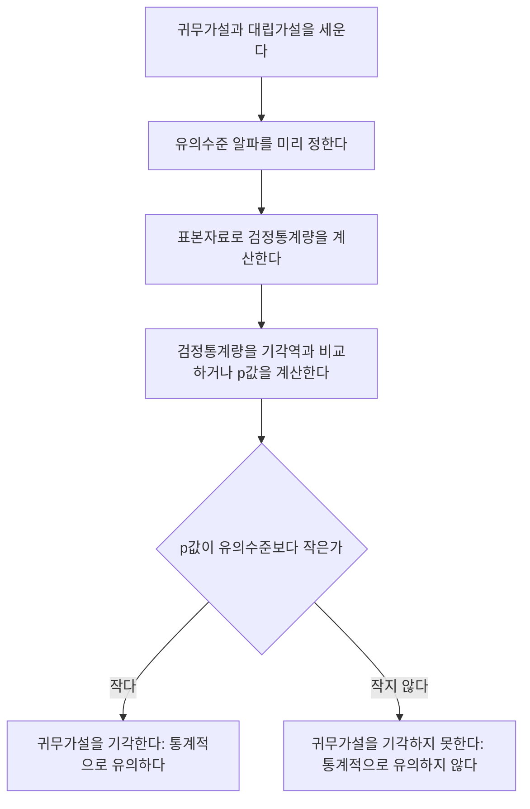

<Callout type="info">
  **이번 문서의 목표:** 이 문서를 다 읽으면 귀무가설과 대립가설을 세우고, 제1종·제2종 오류의 의미와 트레이드오프를 설명하며, p값을 정확한 문장으로 해석하고, 신뢰구간과 가설검정이 어떻게 같은 이야기를 하는지 이해할 수 있습니다.
</Callout>

## 왜 가설검정이 필요한가 — "우연"과 "진짜 차이"를 구분하기

> **쉽게 말하면:** 표본에서 관찰한 차이가 진짜로 의미 있는 차이인지, 아니면 그냥 우연히 그렇게 나온 것인지를 판단하는 절차입니다.

15편과 16편에서는 모수(모평균, 모비율, 모분산)의 값을 "이 범위 어딘가"라고 추정하는 방법을 다뤘습니다. 이번 편에서는 방향을 조금 바꿔, "모수가 특정 값(또는 특정 조건)을 만족하는가?"라는 **주장을 검증**하는 절차를 다룹니다. 이를 **가설검정**(hypothesis testing)이라고 합니다.

예를 들어 한 카페가 "우리 아메리카노 한 잔은 평균 75그람이다"라고 광고합니다. 실제로 표본을 뽑아 재보니 평균이 72.4그람이 나왔습니다. 이 2.6그람의 차이는 "카페가 거짓말을 하고 있다"는 증거일까요, 아니면 "표본을 뽑을 때마다 원래 이 정도는 왔다 갔다 하는 우연의 범위"일까요? 가설검정은 이 질문에 통계적으로 답하는 절차입니다.

## 귀무가설과 대립가설 — 무엇을 두고 다투는가

> **쉽게 말하면:** 귀무가설은 "원래 주장(변화 없음)"이고, 대립가설은 "내가 의심하는 것(변화 있음)"입니다.

가설검정은 항상 서로 반대되는 두 가설을 세우는 것에서 시작합니다.

- **귀무가설**(null hypothesis, 기호 $H_0$, 에이치 제로 또는 에이치 노트): 지금까지 인정되어 온 주장, 혹은 "차이가 없다", "효과가 없다"는 기본 가정. 등호(=)를 포함하는 형태로 씁니다.
- **대립가설**(alternative hypothesis, 기호 $H_1$ 또는 $H_a$): 연구자가 실제로 의심하거나 입증하고 싶은 주장. 부등호($\neq$, $>$, $<$)로 씁니다.

카페 예시라면 다음과 같이 세웁니다.

$$
H_0: \mu = 75
$$

$$
H_1: \mu \neq 75
$$

- $\mu$: 아메리카노 한 잔의 모평균 무게(그람)
- $H_1$이 $\neq$(같지 않다)인 경우를 **양측검정**(two-tailed test)이라 하고, $>$ 또는 $<$인 경우를 **단측검정**(one-tailed test)이라 합니다. "카페가 광고보다 가볍게 준다"는 의심이 확실하면 $H_1: \mu < 75$처럼 단측으로 세울 수도 있지만, 단순히 "다르다"는 의심이면 양측으로 세웁니다. 이 문서의 예시는 양측검정을 기준으로 설명합니다.

가설검정 절차는 항상 귀무가설을 "일단 참이라고 가정"한 뒤, 표본 증거가 그 가정과 얼마나 어긋나는지를 살펴봅니다. 마치 법정에서 "무죄 추정의 원칙"으로 재판을 시작해, 검사가 충분한 증거로 유죄를 입증해야 유죄 판결이 나오는 구조와 비슷합니다. 여기서 $H_0$은 "무죄"(원래 상태), $H_1$은 "유죄"(의심하는 상태)에 대응합니다.

## 유의수준과 기각역

> **쉽게 말하면:** 유의수준은 "이 정도로 극단적이면 우연으로 보기 어렵다고 인정하는 기준선"입니다.

**유의수준**(significance level, 기호 $\alpha$)은 15편에서 신뢰구간을 다룰 때 등장한 그 $\alpha$와 정확히 같은 개념입니다. 검정을 시작하기 전에 미리 정하는 값으로, 관행적으로 0.05(5%)를 가장 많이 쓰고, 더 엄격하게 판단하고 싶으면 0.01, 더 관대하게 보면 0.10을 씁니다.

**기각역**(rejection region)은 검정통계량이 그 범위 안에 들어오면 귀무가설을 기각하기로 미리 정해둔 구간입니다. 양측검정에서 유의수준 $\alpha=0.05$라면, 표준정규분포의 양쪽 꼬리에 각각 2.5%씩(15편에서 다룬 것과 똑같은 방식으로) 기각역을 설정하고, 그 경계가 되는 임계값은 $\pm1.96$입니다.

$$
\text{검정통계량} \; z = \frac{\bar{x} - \mu_0}{\sigma/\sqrt{n}}
$$

- $\bar{x}$: 표본평균
- $\mu_0$: 귀무가설에서 주장하는 모평균 값(위 예시에서는 75)
- $\sigma/\sqrt{n}$: 표본평균의 표준오차(15편 참고)

이 $z$ 값이 $-1.96$보다 작거나 $1.96$보다 크면(기각역 안에 들어오면) 귀무가설을 기각하고, 그 사이(채택역, $-1.96 \le z \le 1.96$)에 있으면 귀무가설을 기각하지 못합니다.

## 제1종 오류와 제2종 오류

가설검정은 표본이라는 불완전한 정보로 판단을 내리는 절차이기 때문에 틀릴 가능성이 항상 남아 있습니다. 틀리는 방식은 두 가지입니다.

> **쉽게 말하면:** 제1종 오류는 "죄 없는 사람을 유죄로 판단"하는 것이고, 제2종 오류는 "진짜 범인을 무죄로 놓치는" 것입니다.

| 구분 | 실제로 $H_0$이 참일 때 | 실제로 $H_0$이 거짓일 때 |
|---|---|---|
| 검정 결과: $H_0$을 기각한다 | 제1종 오류(Type I error), 확률 $\alpha$ | 옳은 결정(검정력), 확률 $1-\beta$ |
| 검정 결과: $H_0$을 기각하지 못한다 | 옳은 결정, 확률 $1-\alpha$ | 제2종 오류(Type II error), 확률 $\beta$ |

- **제1종 오류**: 귀무가설이 실제로는 참인데(카페가 정말로 75그람을 지키고 있는데) 표본에서 우연히 극단적인 값이 나와 귀무가설을 잘못 기각하는 오류. 이 오류가 일어날 확률이 바로 유의수준 $\alpha$입니다.
- **제2종 오류**: 귀무가설이 실제로는 거짓인데(카페가 실제로는 75그람을 못 지키고 있는데) 표본 증거가 충분히 극단적이지 않아 귀무가설을 기각하지 못하는 오류. 이 오류가 일어날 확률을 $\beta$(베타)라고 씁니다.
- $1-\beta$는 **검정력**(power)이라고 하며, "실제로 차이가 있을 때 그 차이를 정확히 찾아낼 확률"을 뜻합니다.

### 트레이드오프: 유의수준을 낮추면 무슨 일이 생기는가

유의수준 $\alpha$를 0.05에서 0.01로 낮추면(더 엄격한 기준을 적용하면), 기각역이 좁아집니다(임계값이 1.96에서 2.576으로 커짐). 그 결과:

- 귀무가설을 잘못 기각할 위험(제1종 오류, $\alpha$)은 확실히 줄어듭니다.
- 그런데 기각역이 좁아진 만큼, 실제로 차이가 있어도 그 증거가 새로운 좁은 기각역까지 들어오지 못해 기각하지 못하는 경우가 늘어납니다. 즉 **제2종 오류 $\beta$가 커지고, 검정력 $1-\beta$는 낮아집니다.**

이는 표본크기 $n$을 그대로 둔 채 $\alpha$만 조정할 때 생기는 근본적인 트레이드오프입니다. 마치 재판에서 "확실한 증거가 없으면 무죄로 한다"는 기준을 더 엄격하게 세울수록(제1종 오류인 억울한 유죄 판결은 줄어들지만) 실제 범인을 무죄로 놓치는 경우(제2종 오류)가 늘어나는 것과 같은 이치입니다. 이 두 오류를 동시에 줄이는 유일한 방법은 표본크기 $n$을 늘려 정보량 자체를 늘리는 것입니다.

## p값의 정의와 해석

> **쉽게 말하면:** p값은 "귀무가설이 맞다고 가정했을 때, 지금 얻은 것만큼 또는 더 극단적인 결과가 나올 확률"입니다.

**p값**(p-value)의 정확한 정의는 다음과 같습니다.

**귀무가설 $H_0$이 참이라고 가정했을 때, 실제로 관측된 검정통계량 값 이상으로 극단적인 결과가 나타날 확률.**

이 정의에서 눈여겨봐야 할 것은 "귀무가설이 참이라고 **가정**했을 때"라는 조건입니다. p값은 조건부 확률이며, 조건이 되는 사건은 "$H_0$이 참"입니다.

$$
p\text{값} = P(\,\text{관측값 이상으로 극단적인 결과} \mid H_0 \text{이 참}\,)
$$

**반드시 반박해야 할 오해**: "p값은 귀무가설이 참일 확률이다."

이 말은 틀렸습니다. 위 식을 보면 $H_0$이 참이라는 것은 **조건**(조건부 확률 기호 $\mid$의 오른쪽)이지, 확률을 구하는 **대상**(왼쪽)이 아닙니다. "비가 온다고 가정했을 때 우산 든 사람을 볼 확률"과 "우산 든 사람을 봤을 때 비가 왔을 확률"이 서로 다른 질문이듯, "$H_0$이 참일 때 이 데이터가 나올 확률"과 "이 데이터가 나왔을 때 $H_0$이 참일 확률"은 완전히 다른 질문입니다. p값은 앞쪽 질문에 대한 답이지, 뒤쪽 질문(귀무가설이 참일 확률)에 대한 답이 아닙니다. 뒤쪽 질문에 답하려면 베이즈 정리(08편 참고)와 사전확률이 추가로 필요하며, 일반적인 p값 계산만으로는 답할 수 없습니다.

### 예시: 카페 아메리카노 검정으로 p값 계산

15편에서 다룬 카페 예시를 z 검정으로 바꿔 다시 살펴봅니다. 다만 이번에는 모표준편차를 안다고 가정한 단순한 상황으로 계산 원리를 보입니다. 카페는 "평균 75그람"이라 광고하고(모표준편차 $\sigma=1.5$그람으로 알려져 있다고 가정), $n=25$잔을 뽑아 표본평균 $\bar{x}=75.2$그람을 얻었습니다. 유의수준 $\alpha=0.05$로 양측검정합니다.

**1단계 — 가설 설정**

$$
H_0: \mu = 75, \qquad H_1: \mu \neq 75
$$

**2단계 — 검정통계량 계산**

$$
z = \frac{75.2 - 75}{1.5/\sqrt{25}} = \frac{0.2}{0.3} \approx 0.667
$$

**3단계 — p값 계산**

표준정규분포표에서 $z=0.67$(소수 둘째 자리로 반올림)에 대응하는 누적확률은 $\Phi(0.67)=0.7486$입니다. 이는 $z\le0.67$일 확률이므로, 오른쪽 꼬리 확률은 다음과 같습니다.

$$
P(Z > 0.67) = 1 - 0.7486 = 0.2514
$$

양측검정이므로 반대쪽 꼬리($z<-0.67$)의 확률도 같은 크기로 더합니다.

$$
p\text{값} = 2 \times 0.2514 = 0.5028
$$

**4단계 — 판정**

$$
p\text{값}(0.5028) > \alpha(0.05)
$$

p값이 유의수준보다 크므로 귀무가설을 기각하지 못합니다.

**해석**: "카페의 실제 평균이 75그람이라고 가정했을 때, 오늘처럼 75.2그람 이상으로 벗어난 표본평균이 나올 확률은 약 50.28퍼센트(50.28%)나 됩니다. 이 정도는 흔히 있을 수 있는 우연의 범위이므로, 카페가 거짓말을 하고 있다는 증거로 보기 어렵습니다." p값이 크다는 것은 "관측된 결과가 귀무가설과 잘 어울린다"는 뜻이지, "귀무가설이 옳다는 것이 증명됐다"는 뜻은 아닙니다(가설검정은 귀무가설을 "채택"하지 않고 "기각하지 못한다"고만 말합니다).

## 판정 절차를 흐름으로 정리하기

## 신뢰구간과 가설검정의 관계

15편, 16편에서 다룬 신뢰구간과 이번 편의 가설검정은 사실 같은 계산을 다른 각도에서 보는 것입니다. 신뢰수준 $1-\alpha$인 신뢰구간과 유의수준 $\alpha$인 양측검정은 다음과 같이 정확히 대응합니다.

**규칙**: 귀무가설에서 주장하는 값 $\mu_0$이 $100(1-\alpha)\%$ 신뢰구간 **밖에** 있으면 유의수준 $\alpha$에서 귀무가설을 기각하고, 신뢰구간 **안에** 있으면 기각하지 못합니다.

15편에서 계산한 볼트 예시를 다시 봅니다. 표본평균 $\bar{x}=50.2$, $\sigma=1.5$, $n=25$로 구한 95% 신뢰구간은 $(49.612,\ 50.788)$이었습니다. 만약 "이 공정의 모평균은 50이다"($H_0:\mu=50$)라는 가설을 유의수준 0.05로 검정한다면 어떻게 될까요?

$50$은 신뢰구간 $(49.612, 50.788)$ **안에** 있습니다. 따라서 신뢰구간만 보고도 "유의수준 0.05에서 $H_0:\mu=50$을 기각하지 못한다"고 바로 판단할 수 있습니다. 실제로 직접 검정통계량을 계산해도 같은 결론이 나오는지 확인해봅니다.

$$
z = \frac{50.2 - 50}{1.5/\sqrt{25}} = \frac{0.2}{0.3} \approx 0.667
$$

이 값은 카페 예시에서 계산한 것과 정확히 같은 $z\approx0.667$이며, 기각역의 경계인 $\pm1.96$ 안에 들어오므로 역시 기각하지 못합니다. 신뢰구간으로 판단한 결과와 검정통계량으로 판단한 결과가 정확히 일치합니다. 이처럼 신뢰구간과 가설검정은 같은 정보를 담고 있는 두 가지 표현 방식이며, 신뢰구간 하나만 계산해두면 그 안에 포함되는 모든 $\mu_0$ 값에 대한 양측검정 결과를 한꺼번에 알 수 있다는 실용적 장점이 있습니다.

## 자주 틀리는 점

- **"귀무가설을 채택한다"는 표현.** 가설검정은 귀무가설이 옳다는 것을 적극적으로 증명하는 절차가 아니라, "기각할 만한 충분한 증거가 없었다"는 소극적 결론만 내립니다. 그래서 "$H_0$을 채택한다"가 아니라 "$H_0$을 **기각하지 못한다**"라고 표현해야 합니다. 무죄 추정 원칙에서 "무죄로 확정됐다"가 아니라 "유죄를 입증하지 못했다"고 말하는 것과 같은 이치입니다.
- **"p값 = 귀무가설이 참일 확률"이라는 오해.** 앞서 자세히 다룬 것처럼 p값은 "$H_0$이 참이라는 조건 아래"에서 계산되는 확률이지, "$H_0$이 참일" 확률 자체가 아닙니다. 조건과 결론의 위치를 바꿔서 읽는 실수가 시험에서 가장 자주 나오는 함정입니다.
- **유의수준을 낮추면 모든 오류가 함께 줄어든다고 착각.** 표본크기가 고정된 상태에서 $\alpha$를 낮추면 제1종 오류는 줄어들지만 제2종 오류 $\beta$는 오히려 늘어납니다. 두 오류를 동시에 줄이려면 표본크기를 늘려야 합니다.
- **단측검정과 양측검정의 임계값을 혼동.** 같은 유의수준 $\alpha=0.05$라도 양측검정의 임계값은 $\pm1.96$(양쪽에 2.5%씩)이고, 단측검정의 임계값은 $1.645$(한쪽에 5% 전부)입니다. 가설을 양측으로 세워놓고 단측 임계값을 쓰거나 그 반대로 계산하는 실수가 흔합니다.
- **p값과 유의수준의 대소 비교 방향을 반대로 기억.** "p값이 유의수준보다 **작으면** 기각"이 옳은 방향입니다. 반대로 외워서 큰데도 기각한다고 답하는 실수가 잦습니다.

## 핵심 정리

- 귀무가설 $H_0$은 "변화 없음"의 기본 가정, 대립가설 $H_1$은 연구자가 의심하는 주장이며 서로 반대되게 세웁니다.
- 제1종 오류(참인 $H_0$을 잘못 기각, 확률 $\alpha$)와 제2종 오류(거짓인 $H_0$을 못 기각, 확률 $\beta$)는 트레이드오프 관계이며, 표본크기를 늘리지 않는 한 유의수준을 낮추면 제2종 오류가 늘어납니다.
- p값은 "$H_0$이 참이라고 가정했을 때 관측값 이상으로 극단적인 결과가 나올 확률"이며, "$H_0$이 참일 확률"이 아닙니다.
- p값이 유의수준보다 작으면 기각, 크거나 같으면 기각하지 못합니다.
- $100(1-\alpha)\%$ 신뢰구간과 유의수준 $\alpha$ 양측검정은 서로 대응한다 — 귀무가설의 주장값이 신뢰구간 밖에 있으면 기각, 안에 있으면 기각하지 못합니다.

## 마무리 복습

<Quiz
  questionNumber={1}
  question="귀무가설과 대립가설에 대한 설명으로 옳은 것은?"
  options={['귀무가설은 연구자가 입증하고 싶은 주장이다', '대립가설은 항상 등호를 포함한다', '귀무가설은 변화나 차이가 없다는 기본 가정이며 등호를 포함하는 형태로 세운다', '두 가설은 항상 서로 같은 내용을 담는다']}
  correctAnswer={3}
  explanation="귀무가설은 지금까지 인정되어 온 기본 가정으로 등호를 포함하는 형태로 세우고, 대립가설은 연구자가 의심하는 주장으로 부등호 형태로 세웁니다."
  optionExplanations={['연구자가 입증하고 싶은 주장은 대립가설입니다.', '등호를 포함하는 것은 귀무가설입니다.', '귀무가설은 변화 없음을 등호로 표현한다는 설명이 정확합니다.', '두 가설은 서로 반대되는 내용을 담아야 합니다.']}
/>

<Quiz
  questionNumber={2}
  question="실제로 귀무가설이 참인데 표본 증거 때문에 귀무가설을 잘못 기각하는 오류를 무엇이라 하는가?"
  options={['제1종 오류', '제2종 오류', '표집오차', '검정력 부족']}
  correctAnswer={1}
  explanation="참인 귀무가설을 잘못 기각하는 오류는 제1종 오류이며, 이 오류가 일어날 확률이 유의수준 알파입니다."
  optionExplanations={['참인 H0을 잘못 기각하는 오류이므로 제1종 오류가 정답입니다.', '제2종 오류는 거짓인 귀무가설을 기각하지 못하는 오류입니다.', '표집오차는 표본과 모집단 사이의 차이를 뜻하는 다른 개념입니다.', '검정력 부족은 제2종 오류와 관련된 개념이지 이 상황을 직접 가리키는 용어가 아닙니다.']}
/>

<Quiz
  questionNumber={3}
  question="표본크기를 그대로 둔 채 유의수준 알파를 0.05에서 0.01로 낮추면 일반적으로 어떤 변화가 생기는가?"
  options={['제1종 오류와 제2종 오류가 모두 줄어든다', '제1종 오류는 줄어들지만 제2종 오류는 늘어난다', '제1종 오류는 늘어나지만 제2종 오류는 줄어든다', '두 오류 모두 변화가 없다']}
  correctAnswer={2}
  explanation="유의수준을 낮추면 기각역이 좁아져 제1종 오류 확률은 줄어들지만, 그만큼 실제 차이를 잡아내기 어려워져 제2종 오류가 늘어나는 트레이드오프가 생깁니다."
  optionExplanations={['표본크기를 늘리지 않는 한 두 오류가 동시에 줄어들지는 않습니다.', '제1종 오류 감소와 제2종 오류 증가라는 트레이드오프가 정답입니다.', '유의수준을 낮추면 제1종 오류는 늘어나는 것이 아니라 줄어듭니다.', '기각역이 좁아지므로 반드시 변화가 생깁니다.']}
/>

<Quiz
  questionNumber={4}
  question="p값의 정의로 가장 정확한 것은?"
  options={['귀무가설이 참일 확률', '대립가설이 참일 확률', '귀무가설이 참이라고 가정했을 때 관측값 이상으로 극단적인 결과가 나올 확률', '검정통계량이 임계값과 같아질 확률']}
  correctAnswer={3}
  explanation="p값은 귀무가설이 참이라는 조건 아래에서, 실제로 관측된 값 이상으로 극단적인 결과가 나타날 조건부 확률로 정의됩니다."
  optionExplanations={['귀무가설이 참일 확률은 p값이 아니라 흔히 저지르는 오해입니다.', '대립가설이 참일 확률 역시 p값의 정의가 아닙니다.', '조건부 확률로서의 정의를 정확히 담고 있으므로 이 답이 맞습니다.', '검정통계량이 임계값과 같아질 확률은 p값과 무관한 개념입니다.']}
/>

<Quiz
  questionNumber={5}
  question="모표준편차 1.5, 표본크기 25, 표본평균 75.2로 귀무가설 모평균은 75라는 가설을 양측검정할 때 검정통계량 z 값은 얼마인가?"
  options={['0.133', '0.2', '0.667', '1.96']}
  correctAnswer={3}
  explanation="검정통계량은 (75.2-75)를 표준오차 0.3(1.5를 5로 나눈 값)으로 나눈 값으로, 0.2 나누기 0.3은 약 0.667입니다."
  optionExplanations={['0.133은 계산 과정에서 분모나 분자를 잘못 넣은 값입니다.', '0.2는 분자 값이지 검정통계량 전체 값이 아닙니다.', '0.2/0.3≈0.667이 정답입니다.', '1.96은 임계값이지 검정통계량 계산 결과가 아닙니다.']}
/>

<Quiz
  questionNumber={6}
  question="위 문제에서 계산한 z=0.667에 대해 표준정규분포표로 구한 p값이 약 0.503이고 유의수준이 0.05일 때, 올바른 결론은?"
  options={['p값이 유의수준보다 작으므로 귀무가설을 기각한다', 'p값이 유의수준보다 크므로 귀무가설을 기각하지 못한다', '귀무가설이 참이라고 확정할 수 있다', '표본크기가 작아 결론을 내릴 수 없다']}
  correctAnswer={2}
  explanation="p값 0.503은 유의수준 0.05보다 크므로 귀무가설을 기각할 근거가 부족합니다. 따라서 귀무가설을 기각하지 못한다고 결론짓습니다."
  optionExplanations={['p값 0.503은 유의수준 0.05보다 크므로 기각 조건을 만족하지 않습니다.', 'p값이 유의수준보다 크므로 기각하지 못한다는 결론이 정확합니다.', '가설검정은 귀무가설이 참임을 확정하지 않고 기각 여부만 판단합니다.', '표본크기 25로도 검정통계량과 p값 계산이 가능하므로 결론을 내릴 수 있습니다.']}
/>

<Quiz
  questionNumber={7}
  question="95% 신뢰구간이 (49.612, 50.788)로 계산되었을 때, 귀무가설 모평균은 50이라는 주장을 유의수준 0.05로 양측검정하면 결과는?"
  options={['50이 신뢰구간 밖에 있으므로 기각한다', '50이 신뢰구간 안에 있으므로 기각하지 못한다', '신뢰구간만으로는 검정 결과를 알 수 없다', '신뢰수준이 달라 비교할 수 없다']}
  correctAnswer={2}
  explanation="50은 신뢰구간 (49.612, 50.788) 안에 포함되므로, 신뢰구간과 유의수준이 대응하는 원리에 따라 유의수준 0.05에서 귀무가설을 기각하지 못합니다."
  optionExplanations={['50은 신뢰구간 안에 있으므로 신뢰구간 밖에 있다는 설명은 틀렸습니다.', '50이 신뢰구간 안에 있으므로 기각하지 못한다는 결론이 정확합니다.', '95% 신뢰구간과 유의수준 0.05인 양측검정은 정확히 대응하므로 신뢰구간만으로도 판단할 수 있습니다.', '95% 신뢰구간은 유의수준 0.05인 양측검정과 정확히 짝을 이루는 신뢰수준입니다.']}
/>

## 참고 자료

- [NIST/SEMATECH e-Handbook of Statistical Methods](https://www.itl.nist.gov/div898/handbook/)
- [국가평생교육진흥원 독학학위제](https://bdes.nile.or.kr)
