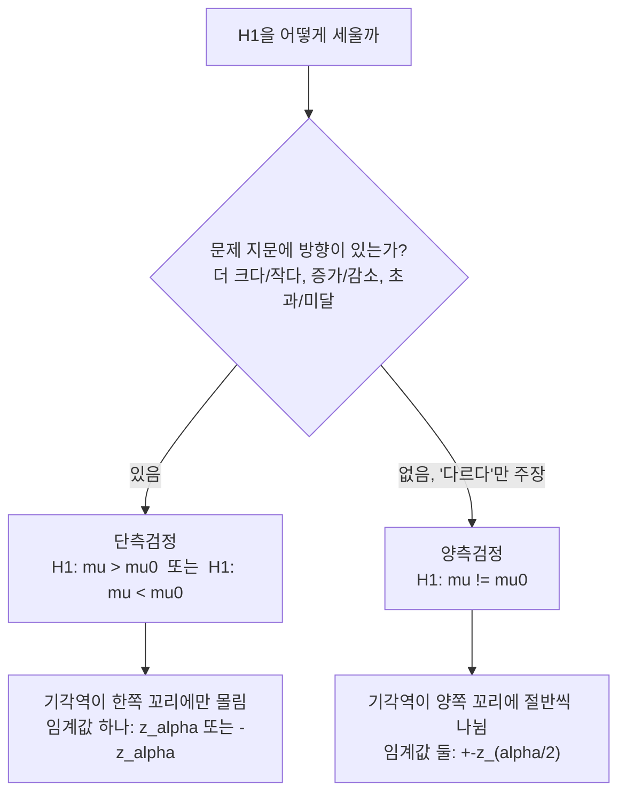

<Callout type="info">
  **이번 문서의 목표:** 이 문서를 다 읽으면 모평균 하나, 모비율 하나에 대한 가설검정 문제를 받았을 때 z검정과 t검정 중 무엇을 쓸지 스스로 판단하고, 단측·양측을 올바르게 설정해 검정통계량 계산부터 결론 문장까지 끝까지 풀 수 있다.
</Callout>

## 이 편에서 하는 일

17편에서는 가설검정이라는 틀 자체 — 귀무가설(null hypothesis, 지금까지 사실로 인정되어 온 주장) $H_0$ 과 대립가설(alternative hypothesis, 새로 주장하고 싶은 내용) $H_1$ 을 세우고, 유의수준(significance level) $\alpha$ (알파, 귀무가설을 잘못 기각할 위험을 얼마나 허용할지)와 p값을 비교해 결론을 내리는 원리 — 를 배웠다. 이번 편은 그 틀을 **모평균 하나**와 **모비율 하나**라는 가장 기본적인 두 상황에 실제로 적용하는 계산 절차를 다룬다. 15편·16편의 신뢰구간 공식과 짝을 이루는 내용이므로, 공식이 낯설면 그쪽을 먼저 훑고 오면 좋다.

> **쉽게 말하면:** "표본에서 관찰한 값이, 원래 주장하던 모집단의 값과 비교해 우연이라 보기엔 너무 차이가 크다"를 숫자로 판정하는 절차다.

## 다섯 단계 고정 틀: 모든 검정에 똑같이 적용

이 편과 다음 두 편(19편·20편)에서 다루는 모든 검정은 아래 다섯 단계를 그대로 반복한다. 유형마다 3단계 검정통계량 공식만 달라질 뿐, 틀 자체는 바뀌지 않는다. 이 틀을 손에 익히는 것이 이 편의 진짜 목표다.

<Steps>
1. **가설 설정** — 귀무가설 $H_0$ 과 대립가설 $H_1$ 을 문제 상황에 맞게 세운다. $H_0$ 은 항상 등호(`=`)를 포함한다.
2. **유의수준 결정** — 문제에서 준 $\alpha$ (보통 0.05 또는 0.01)를 확인한다.
3. **검정통계량 계산** — 표본 자료를 공식에 대입해 하나의 숫자(z값 또는 t값)를 구한다.
4. **기각역 또는 p값 판정** — 검정통계량이 기각역(rejection region, 귀무가설을 기각하게 되는 값의 범위) 안에 들어가는지, 또는 p값이 $\alpha$ 보다 작은지를 확인한다.
5. **결론 문장** — "귀무가설을 기각한다/기각하지 않는다"에서 끝내지 않고, 원래 문제 상황의 말로 풀어 쓴다.
</Steps>

## 단일 모평균 검정: z검정과 t검정, 언제 나뉘는가

### 왜 두 가지로 나뉘는가

모평균 $\mu$ (뮤, 모집단의 평균) 하나를 검정할 때 쓰는 검정통계량의 형태는 똑같이 "표본평균이 주장하는 값에서 얼마나 떨어져 있는지를 표준오차 단위로 잰다"이다. 문제는 그 표준오차를 계산할 때 **모표준편차 $\sigma$ (시그마, 모집단의 표준편차)를 알고 있느냐**다. 13편에서 다뤘듯, $\sigma$ 를 모르고 표본표준편차 $S$ 로 대신 추정하면 그 추정 자체에 오차가 생기고, 표본크기가 작을수록 이 오차의 영향이 커진다. t분포는 바로 이 "표준편차를 추정해서 쓸 때 생기는 여분의 불확실성"을 반영하기 위해 정규분포보다 양쪽 꼬리가 두꺼운 분포다.

| 조건 | 모표준편차 $\sigma$ | 표본크기 $n$ | 쓰는 검정 | 검정통계량이 따르는 분포 |
|------|------|------|-----------|--------------------|
| 상황 1 | 알고 있음 | 상관없음 | z검정 | 표준정규분포 |
| 상황 2 | 모름 | 크다(보통 30 이상) | z검정(근사) | 표준정규분포로 근사 |
| 상황 3 | 모름 | 작다(30 미만) | t검정 | 자유도 $n-1$ 인 t분포 |

> **자주 틀리는 점:** "표본크기가 크면 무조건 z, 작으면 무조건 t"로 외우면 절반만 맞다. 정확한 기준은 **모표준편차를 아느냐 모르느냐**이고, 표본크기는 모를 때 z로 근사해도 되는지를 결정하는 보조 기준일 뿐이다. 독학사 시험에서는 $\sigma$ 를 문제에 직접 알려주는 경우가 많으므로, 문제 지문에서 "모표준편차는 ○○이다"라는 문장이 있는지부터 확인하는 습관을 들여야 한다.

### z검정 통계량

$$
Z = \frac{\bar X - \mu_0}{\sigma / \sqrt{n}}
$$

- $\bar X$ (엑스 바, 표본평균): 실제로 뽑은 표본 자료의 평균
- $\mu_0$ (뮤 제로, 귀무가설이 주장하는 모평균의 값): $H_0$ 에서 "모평균은 ○○이다"라고 못박은 숫자
- $\sigma$: 모표준편차(알고 있다고 가정)
- $n$: 표본크기
- $\sigma / \sqrt{n}$: 표본평균의 표준오차(standard error, 표본평균이 표본마다 얼마나 흔들리는지를 나타내는 척도)

### t검정 통계량

$$
T = \frac{\bar X - \mu_0}{S / \sqrt{n}}
$$

- $S$ (표본표준편차): 모표준편차 대신 표본에서 추정한 값. 자유도 $n-1$ 로 계산한 표본분산의 제곱근(06편 참고)
- 나머지 기호는 z검정과 동일
- 이 통계량은 **자유도(degree of freedom, 자유롭게 값을 정할 수 있는 정보의 개수) $n-1$ 인 t분포**를 따른다

### 예제로 다섯 단계 밟기 — z검정

한 제과 공장이 "우리 회사 과자 한 봉지의 무게는 평균 200그램이다"라고 주장한다. 과거 대량 생산 데이터로 모표준편차가 $\sigma = 10$그램임이 알려져 있다. 소비자단체가 무작위로 $n = 36$봉지를 뽑아 평균 $\bar x = 196$그램을 얻었다. 유의수준 $\alpha = 0.05$ 에서 "실제 평균이 200그램보다 적다"고 볼 수 있는지 검정한다.

<Steps>
1. **가설 설정**: 소비자단체는 "적다"는 것을 입증하고 싶은 쪽이므로 이것이 대립가설이 된다.
   $$
   H_0: \mu = 200, \quad H_1: \mu < 200
   $$
2. **유의수준**: $\alpha = 0.05$
3. **검정통계량**:
   $$
   Z = \frac{196 - 200}{10 / \sqrt{36}} = \frac{-4}{10/6} = \frac{-4}{1.6\overline{6}} \approx -2.40
   $$
4. **기각역/p값 판정**: $H_1$ 이 `<` 방향(왼쪽 단측)이므로 기각역은 표준정규분포의 왼쪽 꼬리다. $\alpha = 0.05$ 에서 왼쪽 단측 기각역의 경계값은 $-z_{0.05} = -1.645$ 다. 계산된 $Z \approx -2.40$ 은 $-1.645$ 보다 더 왼쪽(더 작음)에 있으므로 기각역 안에 들어간다. p값으로 확인하면 $P(Z < -2.40) \approx 0.0082$ 로, $\alpha = 0.05$ 보다 작다. 두 판정 방식이 일치한다.
5. **결론**: 귀무가설을 기각한다. 유의수준 5퍼센트에서 이 공장 과자의 실제 평균 무게는 200그램보다 적다고 볼 통계적 근거가 있다.
</Steps>

## 단측검정과 양측검정: 시험에서 가장 많이 틀리는 지점

### 언제 단측, 언제 양측인가

가설을 세울 때 $H_1$ 에 부등호를 어떻게 쓰느냐가 단측(one-tailed, 한쪽 방향만 검정)과 양측(two-tailed, 양쪽 방향 모두 검정)을 가른다. 판단 기준은 오직 하나, **문제 지문이 방향을 명시했는가**다.

- "더 많다", "더 적다", "증가했다", "감소했다", "초과한다", "미달한다" 같은 **방향 표현**이 있으면 → 단측검정. $H_1$ 에 `>` 또는 `<` 를 쓴다.
- "차이가 있다", "같지 않다", "달라졌다" 처럼 **방향을 명시하지 않고 다르다는 것만 주장**하면 → 양측검정. $H_1$ 에 `≠`(같지 않다)를 쓴다.

### 기각역이 실제로 어떻게 달라지는가

같은 $\alpha = 0.05$ 라도 단측이냐 양측이냐에 따라 임계값(critical value, 기각역의 경계가 되는 값)의 크기 자체가 달라진다. 이것이 계산 실수를 가장 많이 유발하는 지점이다.

| 검정 종류 | 기각역 | $\alpha = 0.05$ 일 때 임계값 | $\alpha = 0.01$ 일 때 임계값 |
|-----------|--------|------------------------|------------------------|
| 양측검정 ($H_1: \mu \neq \mu_0$) | 양쪽 꼬리에 $\alpha/2$씩 | $|Z| > 1.96$ | $|Z| > 2.576$ |
| 오른쪽 단측 ($H_1: \mu > \mu_0$) | 오른쪽 꼬리에 $\alpha$ 전체 | $Z > 1.645$ | $Z > 2.326$ |
| 왼쪽 단측 ($H_1: \mu < \mu_0$) | 왼쪽 꼬리에 $\alpha$ 전체 | $Z < -1.645$ | $Z < -2.326$ |

양측검정은 $\alpha$ 를 양쪽 꼬리에 절반씩(각 $\alpha/2$) 나눠 배정하기 때문에 임계값이 단측보다 더 바깥쪽(절댓값이 더 큼)에 있다. 즉 **같은 $Z$ 값이라도 단측에서는 기각되는데 양측에서는 기각되지 않는 경우가 생긴다.** 예를 들어 $Z = 1.8$ 은 오른쪽 단측 기각역($Z > 1.645$)에는 들어가지만, 양측 기각역($|Z| > 1.96$)에는 들어가지 않는다.

> **자주 틀리는 점:** 문제에서 "차이가 있는지 검정하라"고 했는데 습관적으로 한쪽 방향 기각역(예: $Z > 1.645$)만 쓰면 오답이다. 반대로 "증가했는지 검정하라"고 명시했는데 양쪽 기각역($|Z| > 1.96$)을 쓰면 임계값이 필요 이상으로 커져 실제로는 유의한 결과를 "유의하지 않다"고 잘못 판정하게 된다. **가설을 세우는 1단계에서 방향 표현을 놓치면 4단계 전체가 틀어진다.**

## 단일 모비율 검정

### 왜 정규분포로 근사하는가

모비율(population proportion) $p$ 는 모집단에서 어떤 특성을 가진 개체의 비율이다. 표본비율 $\hat p$ (피 햇, 표본에서 계산한 비율)은 이항분포(10편)를 따르는 확률변수의 평균이지만, 표본크기 $n$ 이 충분히 크면(대략 $np_0 \geq 5$ 이고 $n(1-p_0) \geq 5$) 중심극한정리(12편)에 의해 정규분포로 근사할 수 있다. 이 근사가 성립해야 아래 z검정 공식을 쓸 수 있다.

### 검정통계량

$$
Z = \frac{\hat p - p_0}{\sqrt{p_0(1-p_0)/n}}
$$

- $\hat p$: 표본비율 (표본에서 특성을 가진 개체 수 ÷ 표본크기)
- $p_0$: 귀무가설이 주장하는 모비율의 값
- $\sqrt{p_0(1-p_0)/n}$: 표본비율의 표준오차. **분모에 $p_0$ 를 쓴다** (표본비율 $\hat p$ 가 아니라 귀무가설의 값을 쓰는 것이 신뢰구간 공식과의 차이점)

### 예제로 다섯 단계 밟기

어느 정당은 "우리 당 지지율은 40퍼센트다"라고 주장한다. 무작위로 $n = 400$명을 조사했더니 152명이 지지한다고 답했다. 유의수준 $\alpha = 0.05$ 에서 지지율이 40퍼센트와 다른지(방향을 정하지 않고) 검정한다.

<Steps>
1. **가설 설정**: "다른지"만 물었으므로 양측검정이다.
   $$
   H_0: p = 0.4, \quad H_1: p \neq 0.4
   $$
2. **유의수준**: $\alpha = 0.05$, 양측이므로 임계값은 $\pm 1.96$
3. **검정통계량**: 표본비율은 $\hat p = 152/400 = 0.38$ 이다.
   $$
   Z = \frac{0.38 - 0.4}{\sqrt{0.4 \times 0.6 / 400}} = \frac{-0.02}{\sqrt{0.24/400}} = \frac{-0.02}{\sqrt{0.0006}} = \frac{-0.02}{0.0245} \approx -0.82
   $$
4. **기각역/p값 판정**: $|Z| \approx 0.82$ 는 임계값 $1.96$ 보다 작으므로 기각역 밖에 있다. 양측 p값은 $2 \times P(Z < -0.82) \approx 2 \times 0.2061 = 0.4122$ 로, $\alpha = 0.05$ 보다 훨씬 크다. 두 판정이 일치한다.
5. **결론**: 귀무가설을 기각하지 않는다. 표본에서 관측된 38퍼센트와 주장된 40퍼센트의 차이는, 400명이라는 표본크기를 고려할 때 우연한 표집 변동의 범위 안에 있다고 볼 수 있다.
</Steps>

## 자주 틀리는 점 모음

- **표준오차의 분모를 헷갈린다.** 모비율 검정에서는 표준오차에 $p_0$(귀무가설의 값)를 쓰지만, 16편의 모비율 **신뢰구간**에서는 $p_0$ 를 모르므로 $\hat p$ 를 대신 쓴다. 검정과 신뢰구간의 공식이 겉보기엔 비슷해도 이 지점에서 갈린다.
- **$H_0$ 에 부등호를 쓴다.** $H_0$ 은 항상 등호(`=`)로 쓴다. 부등호는 오직 $H_1$ 에만 들어간다.
- **표본표준편차를 쓸 자유도를 빠뜨린다.** t검정의 자유도는 $n-1$ 이다. $n$ 을 그대로 자유도로 쓰면 t분포표에서 엉뚱한 행을 읽게 된다.
- **기각역과 p값 판정이 어긋나면 계산을 다시 본다.** 두 방법은 항상 같은 결론을 내야 한다. 서로 다른 결론이 나왔다면 임계값이나 검정통계량 계산 중 하나가 틀린 것이다.
- **단측 방향을 반대로 잡는다.** "더 적다"고 주장하려면 $H_1$ 은 `<` 방향이고 기각역도 왼쪽(음수 쪽)에 있어야 한다. 방향과 기각역의 부호를 반드시 짝지어 확인한다.

## 핵심 정리

- 단일 모평균 검정은 모표준편차를 아는지에 따라 z검정과 t검정으로 나뉘고, 모르고 표본이 작으면 자유도 $n-1$ 인 t분포를 쓴다.
- 검정 절차는 가설 설정 → 유의수준 → 검정통계량 → 기각역/p값 → 결론의 다섯 단계로 고정되어 있다.
- 단측·양측은 문제 지문의 방향 표현 유무로 결정되며, 같은 $\alpha$ 라도 단측과 양측의 임계값 크기가 다르다.
- 단일 모비율 검정은 표준오차의 분모에 표본비율이 아닌 귀무가설의 비율 $p_0$ 를 쓴다.
- 기각역 판정과 p값 판정은 항상 같은 결론을 내야 하며, 검산의 기준으로 삼는다.

## 마무리 복습

<Quiz
  questionNumber={1}
  question="모평균 검정에서 z검정을 쓸지 t검정을 쓸지를 가르는 가장 정확한 기준은 무엇인가?"
  options={['표본크기가 30 이상인지 여부', '모표준편차를 알고 있는지 여부', '유의수준이 0.05인지 0.01인지', '단측검정인지 양측검정인지']}
  correctAnswer={2}
  explanation="모표준편차를 알고 있으면 표본크기와 무관하게 z검정을 쓸 수 있다. 모르면 표본표준편차로 추정해야 하므로 t검정을 쓰는 것이 원칙이며, 표본이 크면 z로 근사하는 것은 편의상의 절차일 뿐 근본 기준이 아니다."
  optionExplanations={['표본크기는 모표준편차를 모를 때 z로 근사해도 되는지를 결정하는 보조 기준일 뿐이다', '정답이다. 모표준편차를 알면 z, 모르고 표본이 작으면 t를 쓴다', '유의수준은 임계값의 크기를 정할 뿐 z와 t의 선택 기준이 아니다', '단측·양측 여부는 기각역의 위치를 정할 뿐 z와 t의 선택 기준이 아니다']}
/>

<Quiz
  questionNumber={2}
  question="어떤 문제가 '개선 전보다 불량률이 감소했는지 검정하라'고 지시했다. 이때 올바른 가설과 검정 방식은?"
  options={['H1: p != p0인 양측검정', 'H1: p > p0인 오른쪽 단측검정', 'H1: p < p0인 왼쪽 단측검정', '방향을 알 수 없으므로 양측검정으로만 풀 수 있다']}
  correctAnswer={3}
  explanation="'감소했는지'는 방향이 명시된 표현이므로 단측검정을 쓰고, 대립가설은 모비율이 원래 값보다 작다는 뜻이므로 H1: p가 p0보다 작다로 세운다. 방향 표현이 있는데 양측으로 풀면 임계값이 불필요하게 커져 판정이 달라질 수 있다."
  optionExplanations={['방향 표현이 있으므로 양측검정을 쓰면 안 된다', '감소를 검정하는 것이므로 방향이 반대다', '정답이다. 감소는 부등호가 작다 방향이므로 왼쪽 단측검정이다', '방향 표현이 명확히 있으므로 단측검정으로 풀 수 있다']}
/>

<Quiz
  questionNumber={3}
  question="유의수준 0.05인 양측검정과 오른쪽 단측검정에서, 표준정규분포 기준 임계값의 크기를 비교하면?"
  options={['양측검정의 임계값 1.96이 단측검정의 임계값 1.645보다 크다', '단측검정의 임계값이 항상 더 크다', '두 임계값은 항상 같다', '표본크기에 따라 어느 쪽이 큰지 달라진다']}
  correctAnswer={1}
  explanation="양측검정은 유의수준 알파를 양쪽 꼬리에 절반씩(각 0.025) 나누므로 임계값이 1.96으로 더 바깥쪽에 있다. 오른쪽 단측검정은 알파 전체(0.05)를 한쪽에 몰아주므로 임계값이 1.645로 더 안쪽에 있다."
  optionExplanations={['정답이다. 양측은 alpha를 절반씩 나누므로 임계값이 더 커진다', '반대로 설명했다. 단측 임계값이 더 작다', '유의수준을 나누는 방식이 다르므로 임계값도 다르다', '임계값은 표본크기가 아니라 유의수준을 몇 쪽에 나누는지로 정해진다']}
/>

<Quiz
  questionNumber={4}
  question="단일 모비율 검정의 검정통계량 공식에서 표준오차의 분모에 들어가는 값으로 옳은 것은?"
  options={['표본비율 p hat', '귀무가설이 주장하는 비율 p0', '표본크기 n', '표본분산 S 제곱']}
  correctAnswer={2}
  explanation="모비율 검정통계량은 Z = (p hat - p0) / sqrt(p0(1-p0)/n)의 형태로, 표준오차 계산에 귀무가설의 값 p0를 쓴다. 이는 신뢰구간에서 p0 대신 p hat을 쓰는 것과 대비되는 지점이다."
  optionExplanations={['표본비율은 분자에 들어가며 분모의 표준오차 계산에는 쓰이지 않는다', '정답이다. 검정에서는 귀무가설의 값을 표준오차 계산에 사용한다', '표본크기는 분모 안의 근호 계산에 쓰이지만 그 자체가 답은 아니다', '표본분산은 모비율 검정과 관계가 없다']}
/>

<Quiz
  questionNumber={5}
  question="어느 회사가 신형 배터리의 평균 수명이 500시간이라고 주장한다. 모표준편차 sigma = 20시간이 알려져 있고, n = 25개를 뽑아 평균 x bar = 492시간을 얻었다. H1: mu != 500 인 양측검정을 alpha = 0.05에서 수행할 때 검정통계량 Z의 값은? (반올림 소수 둘째 자리)"
  options={['Z = -2.00', 'Z = -1.60', 'Z = -0.40', 'Z = -4.00']}
  correctAnswer={1}
  explanation="Z = (492-500)/(20/sqrt(25)) = -8/(20/5) = -8/4 = -2.00이다. 표준오차는 20을 5(=sqrt(25))로 나눈 4이고, 분자 -8을 4로 나누면 -2.00이 된다."
  optionExplanations={['정답이다. -8을 표준오차 4로 나누면 -2.00이다', '표준오차 계산에서 sqrt(25)=5를 잘못 나눈 값이다', '분자 -8을 표준오차가 아닌 20으로 나눈 값이다', '표준오차를 1로 잘못 계산했을 때 나오는 값이다']}
/>

<Quiz
  questionNumber={6}
  question="위 5번 문제에서 계산한 Z = -2.00을 유의수준 0.05인 양측검정 임계값 1.96과 비교했을 때 올바른 결론은?"
  options={['|Z| = 2.00 > 1.96이므로 귀무가설을 기각하지 않는다', '|Z| = 2.00 > 1.96이므로 귀무가설을 기각한다', '|Z| = 2.00 < 1.96이므로 귀무가설을 기각한다', '임계값과 비교할 수 없고 t분포표를 따로 찾아야 한다']}
  correctAnswer={2}
  explanation="|Z| = 2.00은 임계값 1.96보다 크므로 기각역 안에 들어간다. 따라서 유의수준 5퍼센트에서 귀무가설을 기각하고, 배터리의 실제 평균 수명이 500시간과 다르다고 결론 내린다."
  optionExplanations={['부등호 방향이 반대다. 2.00은 1.96보다 크다', '정답이다. 기각역 안에 들어가므로 귀무가설을 기각한다', '2.00은 1.96보다 작지 않고 크다', '모표준편차를 알고 있으므로 z검정을 그대로 쓰면 되고 t분포표는 필요 없다']}
/>

## 참고 자료

- [Statistics for Applications / Introduction to Statistical Inference 슬라이드 — 단·양측 검정, p값 해석](https://www.itl.nist.gov/div898/handbook/)
- [NIST/SEMATECH e-Handbook of Statistical Methods](https://www.itl.nist.gov/div898/handbook/)
- [국가평생교육진흥원 독학학위제](https://bdes.nile.or.kr)
