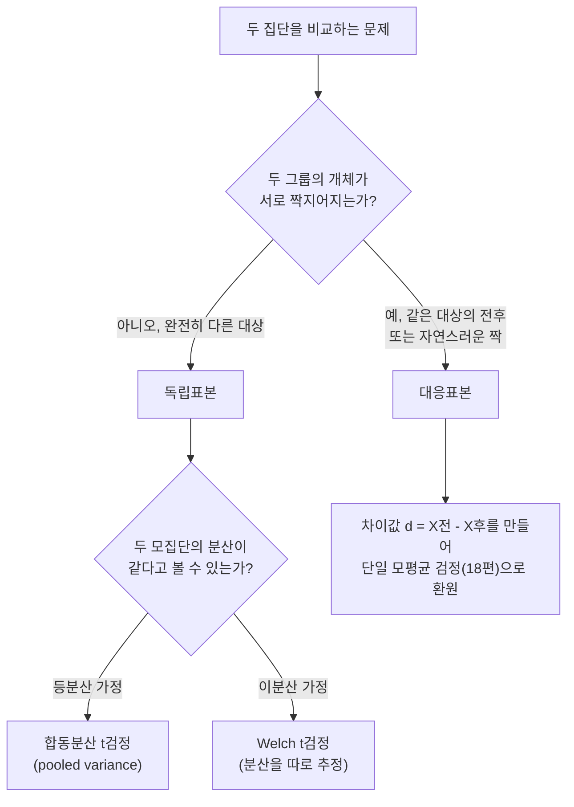

<Callout type="info">
  **이번 문서의 목표:** 이 문서를 다 읽으면 "두 집단을 비교하라"는 문제를 받았을 때 독립표본인지 대응표본인지부터 판단하고, 등분산 가정 여부를 확인해 올바른 검정통계량으로 평균·비율·분산 비교 검정을 끝까지 풀 수 있다.
</Callout>

## 이 편에서 하는 일

18편에서는 모집단 **하나**의 평균·비율을 어떤 값과 비교했다. 이번 편은 모집단 **둘**을 서로 비교한다. "신약을 먹은 그룹과 안 먹은 그룹의 평균 회복 시간이 다른가", "남녀 지지율에 차이가 있는가", "두 공정의 산포가 같은가" 같은 문제가 여기에 해당한다. 검정 절차의 다섯 단계 틀(가설 설정 → 유의수준 → 검정통계량 → 기각역/p값 → 결론)은 18편과 동일하며, 이번 편의 핵심은 **상황을 정확히 분류해 올바른 공식을 고르는 것**이다.

> **쉽게 말하면:** 두 집단이 서로 남남인지(독립표본), 같은 대상을 전후로 비교한 것인지(대응표본)를 먼저 가르고, 그다음 각 상황에 맞는 공식으로 차이를 검정한다.

## 독립표본과 대응표본: 가장 먼저 갈리는 갈림길

### 두 상황이 왜 다른가

독립표본(independent samples, 서로 관련 없는 두 집단에서 각각 뽑은 표본)은 두 그룹의 개체가 완전히 다른 대상이다. 예를 들어 남학생 30명과 여학생 30명의 시험 점수를 비교하는 경우, 어떤 남학생과 어떤 여학생을 짝지을 이유가 없다.

대응표본(paired samples, 같은 대상을 두 번 측정하거나 자연스럽게 짝지어진 표본)은 개체 하나하나가 짝을 이룬다. 예를 들어 다이어트 프로그램 참가자 20명의 "시작 전 체중"과 "6주 후 체중"을 비교하는 경우, 같은 사람의 전후 값이므로 자연스럽게 짝이 생긴다. 이 짝은 개인차(원래 체중이 높은 사람은 전후 모두 높게 나오는 경향 등)를 공유하기 때문에, 독립표본처럼 취급하면 이 개인차가 잡음으로 섞여 들어가 검정의 정확도가 떨어진다.

### 판단 기준을 표로 정리

| 구분 | 판단 근거 | 검정통계량이 보는 대상 | 예시 |
|------|-----------|----------------------|------|
| 독립표본 | 두 그룹의 개체가 서로 무관 | 두 표본평균의 차이 $\bar X_1 - \bar X_2$ | 남녀 지지율, 두 회사 제품의 수명 |
| 대응표본 | 같은 개체를 전후로 측정, 또는 자연스러운 짝 | 짝별 차이값의 평균 $\bar d$ | 다이어트 전후 체중, 교육 전후 점수 |

> **자주 틀리는 점:** 문제에 "두 그룹"이라는 말이 나온다고 무조건 독립표본으로 단정하면 안 된다. "같은 사람을", "같은 기계를", "전 · 후" 같은 표현이 있으면 대응표본이다. 대응표본인데 독립표본 공식을 쓰면 개인차가 표준오차에 그대로 섞여 들어가 검정력(power, 실제로 차이가 있을 때 그 차이를 찾아낼 능력)이 부당하게 낮아진다.

## 두 모평균 비교 — 독립표본

### 등분산인지 이분산인지부터 확인

독립표본 t검정은 두 모집단의 분산이 같다고 볼 수 있는지(등분산 가정)에 따라 공식이 갈린다. 등분산 여부는 문제에서 "두 모집단의 분산은 같다고 가정한다"처럼 직접 알려주거나, 20편 이전 단원에서 배운 두 분산 비교 검정(이 편의 뒷부분)으로 먼저 확인한다.

등분산을 가정할 때는 두 표본의 분산을 하나로 합친 **합동분산(pooled variance)** $S_p^2$ 을 쓴다.

$$
S_p^2 = \frac{(n_1-1)S_1^2 + (n_2-1)S_2^2}{n_1+n_2-2}
$$

- $n_1, n_2$: 두 표본의 크기
- $S_1^2, S_2^2$: 두 표본의 분산(각각 자유도 $n_1-1$, $n_2-1$ 로 계산)
- 분모의 $n_1+n_2-2$: 합동분산의 자유도. 두 표본에서 각각 평균 하나씩을 추정하는 데 자유도를 하나씩 썼으므로 전체 자유도에서 2를 뺀다

검정통계량은 다음과 같다.

$$
T = \frac{(\bar X_1 - \bar X_2) - 0}{\sqrt{S_p^2 \left(\frac{1}{n_1} + \frac{1}{n_2}\right)}}
$$

- $\bar X_1, \bar X_2$: 두 표본의 평균
- $0$: 귀무가설이 보통 "두 모평균에 차이가 없다"($\mu_1 - \mu_2 = 0$)이므로 0을 뺀다
- 이 통계량은 자유도 $n_1+n_2-2$ 인 t분포를 따른다

### 예제로 다섯 단계 밟기

두 학원 A, B의 모의고사 평균 점수를 비교한다. A학원 $n_1 = 10$명의 평균 $\bar x_1 = 78$점, 분산 $S_1^2 = 20$. B학원 $n_2 = 12$명의 평균 $\bar x_2 = 74$점, 분산 $S_2^2 = 24$. 두 모집단의 분산은 같다고 가정하며, 유의수준 $\alpha = 0.05$ 에서 "두 학원의 평균이 다른지" 검정한다.

<Steps>
1. **가설 설정**: "다른지"만 물었으므로 양측검정이다.
   $$
   H_0: \mu_1 = \mu_2, \quad H_1: \mu_1 \neq \mu_2
   $$
2. **유의수준**: $\alpha = 0.05$, 자유도 $n_1+n_2-2 = 10+12-2 = 20$
3. **검정통계량**: 먼저 합동분산을 구한다.
   $$
   S_p^2 = \frac{(10-1)(20) + (12-1)(24)}{10+12-2} = \frac{180+264}{20} = \frac{444}{20} = 22.2
   $$
   이어서 검정통계량을 계산한다.
   $$
   T = \frac{78-74}{\sqrt{22.2\left(\frac{1}{10}+\frac{1}{12}\right)}} = \frac{4}{\sqrt{22.2 \times 0.1833}} = \frac{4}{\sqrt{4.070}} = \frac{4}{2.017} \approx 1.98
   $$
4. **기각역/p값 판정**: 자유도 20인 t분포에서 양측 $\alpha = 0.05$ 의 임계값은 $t_{0.025,20} = 2.086$ 이다. 계산된 $|T| \approx 1.98$ 은 $2.086$ 보다 작으므로 기각역 밖에 있다. p값으로 확인하면 자유도 20인 t분포에서 $P(|T|>1.98) \approx 0.062$ 로 $\alpha=0.05$ 보다 크다. 두 판정이 일치한다.
5. **결론**: 귀무가설을 기각하지 않는다. 두 학원의 평균 점수 차이 4점은, 표본크기와 산포를 고려할 때 통계적으로 유의한 차이라고 보기 어렵다.
</Steps>

## 두 모평균 비교 — 대응표본

### 차이값으로 문제를 바꾼다

대응표본은 짝별 차이 $d_i = X_{1i} - X_{2i}$ 를 만들면, "차이값들의 모평균이 0인지"를 검정하는 **단일 모평균 검정**(18편)으로 그대로 환원된다. 즉 새로운 공식을 외울 필요 없이, 원자료 대신 차이값을 표본으로 삼아 18편의 t검정을 적용하면 된다.

$$
T = \frac{\bar d - 0}{S_d / \sqrt{n}}
$$

- $\bar d$: 차이값들의 평균
- $S_d$: 차이값들의 표본표준편차
- $n$: 짝(대응)의 개수
- 자유도는 $n-1$ (차이값 하나짜리 표본을 다루므로 18편의 t검정과 동일한 자유도 규칙)

### 예제로 다섯 단계 밟기

수면 교육 프로그램 전후로 5명의 수면 시간(시간 단위)을 측정했다.

| 참가자 | 전 | 후 | 차이 $d$ = 후 − 전 |
|--------|----|----|-------------------|
| 1 | 6.0 | 6.8 | 0.8 |
| 2 | 5.5 | 6.0 | 0.5 |
| 3 | 7.0 | 7.4 | 0.4 |
| 4 | 6.2 | 6.5 | 0.3 |
| 5 | 5.8 | 6.8 | 1.0 |

유의수준 $\alpha = 0.05$ 에서 "수면 시간이 늘었는지" 검정한다.

<Steps>
1. **가설 설정**: "늘었는지"는 방향이 있으므로 오른쪽 단측검정이다. 차이를 후 − 전으로 정의했으므로 늘었다면 $d$ 의 모평균이 0보다 크다.
   $$
   H_0: \mu_d = 0, \quad H_1: \mu_d > 0
   $$
2. **유의수준**: $\alpha = 0.05$, 자유도 $n-1 = 4$
3. **검정통계량**: 차이값의 평균은
   $$
   \bar d = \frac{0.8+0.5+0.4+0.3+1.0}{5} = \frac{3.0}{5} = 0.6
   $$
   차이값의 표본분산은 각 편차제곱합을 구해 계산한다. 편차는 $0.2, -0.1, -0.2, -0.3, 0.4$ 이고 제곱합은 $0.04+0.01+0.04+0.09+0.16=0.34$ 이다.
   $$
   S_d^2 = \frac{0.34}{5-1} = 0.085, \quad S_d = \sqrt{0.085} \approx 0.2915
   $$
   검정통계량은
   $$
   T = \frac{0.6-0}{0.2915/\sqrt5} = \frac{0.6}{0.1304} \approx 4.60
   $$
4. **기각역/p값 판정**: 자유도 4, 오른쪽 단측 $\alpha=0.05$ 의 임계값은 $t_{0.05,4}=2.132$ 다. 계산된 $T \approx 4.60$ 은 $2.132$ 보다 크므로 기각역 안에 든다. p값은 $P(T>4.60) \approx 0.005$ 로 $\alpha=0.05$ 보다 작다. 두 판정이 일치한다.
5. **결론**: 귀무가설을 기각한다. 유의수준 5퍼센트에서 수면 교육 프로그램 이후 수면 시간이 늘었다고 볼 통계적 근거가 있다.
</Steps>

## 두 모비율 비교

두 모집단의 비율을 비교할 때는 두 표본을 합쳐 만든 **합동비율(pooled proportion)** $\hat p$ 를 표준오차 계산에 쓴다. 귀무가설이 "두 비율이 같다"($p_1=p_2$)이므로, 그 공통값을 두 표본을 합쳐 추정하는 것이다.

$$
\hat p = \frac{X_1+X_2}{n_1+n_2}
$$

- $X_1, X_2$: 각 표본에서 특성을 가진 개체 수
- $n_1, n_2$: 각 표본크기

$$
Z = \frac{\hat p_1 - \hat p_2}{\sqrt{\hat p(1-\hat p)\left(\frac{1}{n_1}+\frac{1}{n_2}\right)}}
$$

- $\hat p_1, \hat p_2$: 각 표본에서 따로 계산한 비율
- 이 통계량은 표준정규분포를 따른다(표본이 충분히 클 때)

## 두 모분산 비교: F검정

### 왜 F분포를 쓰는가

두 모집단의 분산이 같은지 검정할 때는 두 표본분산의 **비율**을 본다. 13편에서 배웠듯 F분포(F distribution)는 "두 카이제곱분포를 각자의 자유도로 나눈 뒤 그 비율을 취한 분포"로, 두 분산의 비율이 우연히 이 정도로 벌어질 수 있는지를 판단하는 데 알맞다.

$$
F = \frac{S_1^2}{S_2^2}
$$

- $S_1^2, S_2^2$: 두 표본의 분산
- **관례상 큰 분산을 분자에 놓아 $F \geq 1$ 이 되게 계산**한다(표에서 오른쪽 꼬리 값만 찾으면 되도록 하기 위함)
- 이 통계량은 자유도 $(n_1-1, n_2-1)$ 인 F분포를 따른다. 분자의 자유도를 먼저, 분모의 자유도를 나중에 쓴다

### 예제로 다섯 단계 밟기

두 기계 A, B가 만드는 부품 지름의 산포를 비교한다. A기계 $n_1=13$개 표본의 분산 $S_1^2=12$, B기계 $n_2=10$개 표본의 분산 $S_2^2=4$. 유의수준 $\alpha=0.05$ 에서 "두 기계의 산포가 다른지" 검정한다.

<Steps>
1. **가설 설정**: "다른지"만 물었으므로 양측검정이다.
   $$
   H_0: \sigma_1^2 = \sigma_2^2, \quad H_1: \sigma_1^2 \neq \sigma_2^2
   $$
2. **유의수준**: $\alpha=0.05$, 양측이므로 위쪽 꼬리에 $\alpha/2=0.025$
3. **검정통계량**: 큰 분산을 분자에 놓는다.
   $$
   F = \frac{S_1^2}{S_2^2} = \frac{12}{4} = 3.00
   $$
   자유도는 분자 $n_1-1=12$, 분모 $n_2-1=9$ 다.
4. **기각역/p값 판정**: 자유도 (12, 9), 양측 $\alpha=0.05$ 의 위쪽 임계값은 $F_{0.025}(12,9) \approx 3.87$ 이다. 계산된 $F=3.00$ 은 $3.87$ 보다 작으므로 기각역 밖에 있다. p값으로 확인해도 $P(F>3.00) \approx 0.06$ 수준으로 양측 p값은 대략 $0.12$ 이며 $\alpha=0.05$ 보다 크다. 두 판정이 일치한다.
5. **결론**: 귀무가설을 기각하지 않는다. 두 기계의 산포 차이는 표본크기를 고려할 때 통계적으로 유의하다고 보기 어렵다. (이 결과는 앞선 두 모평균 비교에서 "등분산을 가정한다"는 전제를 뒷받침하는 근거로도 쓰인다.)
</Steps>

## 자주 틀리는 점 모음

- **독립표본과 대응표본을 헷갈린다.** "같은 대상을 전후로", "짝지어진" 표현을 놓치면 대응표본을 독립표본처럼 계산해 자유도와 표준오차가 모두 틀어진다.
- **합동분산의 자유도를 $n_1+n_2$ 로 잘못 쓴다.** 두 표본에서 각각 평균을 추정하느라 자유도를 하나씩 잃으므로 반드시 $n_1+n_2-2$ 다.
- **F검정에서 분자·분모를 바꿔 자유도를 뒤섞는다.** 분자에 놓은 표본의 자유도가 F분포 표기의 첫 번째 자유도다. 큰 분산을 분자에 놓는 관례를 지키지 않으면 $F<1$ 이 나와 표를 찾기 어려워진다.
- **두 모비율 검정에서 합동비율 대신 각 표본의 비율을 따로 표준오차에 쓴다.** 귀무가설이 "두 비율이 같다"고 전제하므로 공통값(합동비율)으로 표준오차를 계산해야 한다.
- **대응표본 차이값의 방향을 정의만 해두고 결론에서 반대로 해석한다.** $d = $ 후 − 전으로 정의했다면 $d>0$ 은 "늘었다"는 뜻이다. 정의와 해석의 방향을 반드시 맞춰 확인한다.

## 핵심 정리

- 두 집단 비교는 독립표본인지 대응표본인지를 가장 먼저 가른다. 개체가 짝지어지면 대응표본이다.
- 독립표본 평균 비교는 등분산 가정 시 합동분산으로 표준오차를 만들고, 자유도는 $n_1+n_2-2$ 다.
- 대응표본 평균 비교는 차이값 $d$ 를 만들어 단일 모평균 t검정(18편)으로 그대로 환원한다.
- 두 모비율 비교는 표준오차 계산에 두 표본을 합친 합동비율을 쓴다.
- 두 모분산 비교는 F검정을 쓰며, 큰 분산을 분자에 놓아 자유도 $(n_1-1, n_2-1)$ 인 F분포와 비교한다.

## 마무리 복습

<Quiz
  questionNumber={1}
  question="다이어트 프로그램 참가자 15명의 시작 전 체중과 8주 후 체중을 비교하려 한다. 어떤 검정을 써야 하는가?"
  options={['독립표본 t검정', '대응표본 t검정', '두 모비율 검정', 'F검정']}
  correctAnswer={2}
  explanation="같은 15명을 전과 후로 두 번 측정했으므로 각 개체가 자연스럽게 짝을 이루는 대응표본이다. 차이값 d를 만들어 단일 모평균 검정으로 환원해 풀어야 한다."
  optionExplanations={['개체가 서로 다른 대상이 아니라 같은 사람을 두 번 측정했으므로 독립표본이 아니다', '정답이다. 같은 대상의 전후 비교는 대응표본이다', '체중은 비율이 아니라 연속형 평균 비교 대상이다', 'F검정은 분산을 비교할 때 쓰며 이 문제는 평균 비교다']}
/>

<Quiz
  questionNumber={2}
  question="독립표본 t검정에서 등분산을 가정할 때, 합동분산 S_p^2의 자유도로 옳은 것은?"
  options={['n1 + n2', 'n1 + n2 - 1', 'n1 + n2 - 2', 'n1 - 1']}
  correctAnswer={3}
  explanation="두 표본에서 각각 평균을 하나씩 추정하는 데 자유도를 하나씩 쓰므로 전체 자유도 n1+n2에서 2를 뺀 n1+n2-2가 합동분산의 자유도다."
  optionExplanations={['자유도를 전혀 빼지 않은 값으로 틀렸다', '자유도를 하나만 뺀 값으로, 두 표본 모두에서 평균을 추정한 것을 반영하지 못했다', '정답이다. 두 표본 각각에서 평균 추정으로 자유도 1씩을 잃는다', '이것은 표본 1의 분산 자유도일 뿐 합동분산 전체의 자유도가 아니다']}
/>

<Quiz
  questionNumber={3}
  question="두 기계의 산포를 F검정으로 비교할 때, 표본분산이 S1^2=18(n1=10), S2^2=6(n2=8)이라면 검정통계량 F와 자유도로 옳은 것은?"
  options={['F=3.00, 자유도(9,7)', 'F=0.33, 자유도(7,9)', 'F=3.00, 자유도(10,8)', 'F=12, 자유도(9,7)']}
  correctAnswer={1}
  explanation="큰 분산을 분자에 놓으므로 F=18/6=3.00이다. 분자 표본의 자유도는 n1-1=9, 분모 표본의 자유도는 n2-1=7이므로 자유도는 (9,7)이다."
  optionExplanations={['정답이다. F=18/6=3.00이고 자유도는 각 표본크기에서 1을 뺀 (9,7)이다', '분자와 분모를 반대로 놓아 큰 분산이 분모에 간 경우로, 관례에 맞지 않는다', '자유도에서 1을 빼지 않은 표본크기를 그대로 쓴 오답이다', '분자를 18/6이 아니라 곱셈으로 잘못 계산한 값이다']}
/>

<Quiz
  questionNumber={4}
  question="두 모비율 비교 검정에서 표준오차를 계산할 때 사용하는 값으로 옳은 것은?"
  options={['각 표본의 비율 p hat1, p hat2를 각각 따로 사용한다', '두 표본을 합쳐 계산한 합동비율 p hat을 사용한다', '귀무가설과 무관하게 항상 0.5를 사용한다', '표본크기가 큰 쪽의 비율만 사용한다']}
  correctAnswer={2}
  explanation="귀무가설이 두 모비율이 같다고 전제하므로, 그 공통값을 두 표본을 합쳐 추정한 합동비율로 표준오차를 계산한다."
  optionExplanations={['귀무가설이 두 비율이 같다고 가정하므로 따로 쓰지 않고 합쳐서 추정한다', '정답이다. 합동비율을 사용하는 것이 두 모비율 비교 검정의 핵심이다', '0.5는 임의의 값이며 실제 자료를 반영하지 못한다', '표본크기가 큰 쪽만 쓰면 다른 표본의 정보를 버리게 된다']}
/>

<Quiz
  questionNumber={5}
  question="어느 교육 프로그램 전후 점수 차이(후-전) 4명 자료가 3, 5, 2, 6점일 때, 차이값의 평균 d bar와 자유도로 옳은 것은? (반올림 없음)"
  options={['d bar = 4, 자유도 3', 'd bar = 16, 자유도 4', 'd bar = 4, 자유도 4', 'd bar = 3.5, 자유도 3']}
  correctAnswer={1}
  explanation="차이값의 합은 3+5+2+6=16이고 개수 4로 나누면 d bar=4이다. 대응표본 t검정의 자유도는 짝의 개수에서 1을 뺀 n-1=3이다."
  optionExplanations={['정답이다. 16을 4로 나눈 4가 평균이고 자유도는 4-1=3이다', '16은 평균이 아니라 합계일 뿐이다', '평균 계산은 맞지만 자유도를 n으로 그대로 써서 1을 빼지 않았다', '평균 계산 자체가 16/4=4를 잘못 나눈 값이다']}
/>

<Quiz
  questionNumber={6}
  question="위 5번 자료(3, 5, 2, 6, d bar=4)의 표본표준편차 S_d를 구하면? (반올림 소수 둘째 자리)"
  options={['S_d = 1.83', 'S_d = 1.29', 'S_d = 3.33', 'S_d = 2.58']}
  correctAnswer={1}
  explanation="편차는 -1, 1, -2, 2이고 제곱합은 1+1+4+4=10이다. 표본분산은 10을 자유도 3으로 나눈 3.33이고, 그 제곱근인 S_d는 약 1.83이다."
  optionExplanations={['정답이다. 제곱합 10을 자유도 3으로 나눈 3.33의 제곱근이 약 1.83이다', '분산을 자유도 6으로 나눈 값의 제곱근으로 자유도를 잘못 적용했다', '이것은 분산 값 3.33 자체이며 제곱근을 취하지 않은 값이다', '제곱합을 n=4로 나눈 값의 제곱근으로 자유도 대신 표본크기를 썼다']}
/>

## 참고 자료

- [Regression and Correlation 기초 강의노트 계열 — 두 표본 비교·분산비 검정 절차](https://www.itl.nist.gov/div898/handbook/)
- [NIST/SEMATECH e-Handbook of Statistical Methods](https://www.itl.nist.gov/div898/handbook/)
- [국가평생교육진흥원 독학학위제](https://bdes.nile.or.kr)
