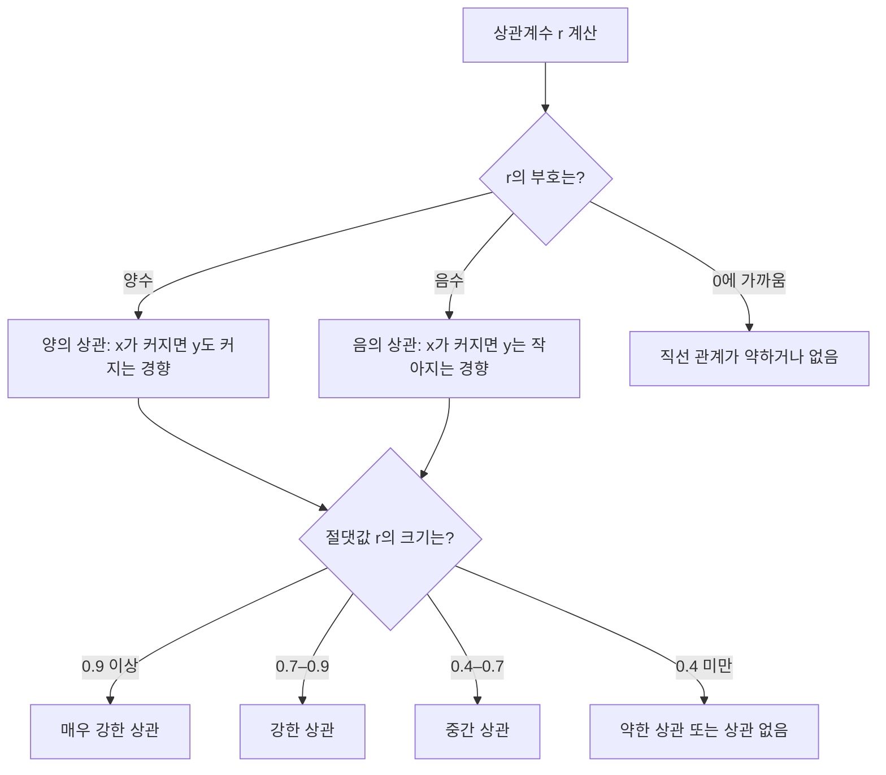

<Callout type="info">
  **이번 문서의 목표:** 두 변수 사이의 공분산과 피어슨 상관계수를 편차표로 직접 계산하고, 계수의 부호와 크기를 해석하며, 상관과 인과를 혼동하지 않고 산점도와 함께 결과를 읽을 수 있게 된다.
</Callout>

## 왜 상관분석이 필요한가

05편과 06편에서는 변수 하나를 놓고 "평균이 얼마인가", "흩어진 정도가 얼마인가"를 다뤘다. 그런데 현실의 질문은 대부분 변수 하나로 끝나지 않는다. "공부 시간이 늘면 시험 점수도 오르는가", "광고비를 늘리면 매출도 늘어나는가"처럼 **두 변수가 함께 어떻게 움직이는가**를 알고 싶은 경우가 훨씬 많다.

이때 필요한 것이 상관분석(correlation analysis)이다. 상관분석은 두 양적 변수(quantitative variable, 숫자로 측정되는 변수) 사이에 **직선 형태의 관계**가 얼마나 뚜렷한지를 하나의 숫자로 요약해 보여준다.

> **쉽게 말하면:** 상관분석은 "이 두 변수는 같이 커지는가, 따로 노는가, 아니면 하나가 커질 때 다른 하나는 작아지는가"를 숫자 하나로 압축해서 보여주는 도구다.

## 이 문서에서 함께 쓸 데이터

앞으로 계산 과정을 보여줄 때 계속 같은 자료를 쓴다. 학생 9명을 대상으로 한 주간 공부 시간(단위: 시간)과 이후 치른 쪽지시험 점수(단위: 점)를 조사했다고 하자.

| 학생 | A | B | C | D | E | F | G | H | I |
|------|---|---|---|---|---|---|---|---|---|
| 공부 시간 $x$ | 1 | 2 | 3 | 4 | 5 | 6 | 7 | 8 | 9 |
| 시험 점수 $y$ | 38 | 42 | 44 | 48 | 50 | 52 | 56 | 58 | 62 |

이 자료는 22편(단순선형회귀)에서도 그대로 다시 쓴다. 두 편을 같은 자료로 이어서 보면, 이번 편에서 구할 상관계수를 제곱한 값이 22편에서 구할 결정계수(coefficient of determination)와 정확히 같아지는 것을 직접 확인할 수 있다.

## 공분산: 두 변수가 같이 움직이는 방향과 크기

> **쉽게 말하면:** 공분산은 "$x$가 평균보다 클 때 $y$도 평균보다 크게 움직이는가"를 곱셈으로 확인하는 값이다.

한 변수의 산포는 06편에서 배운 분산(variance)으로 측정했다. 분산은 각 값이 평균에서 얼마나 떨어져 있는지를 나타내는 편차(deviation, 관측값에서 평균을 뺀 값)를 제곱해서 평균낸 것이었다. 두 변수를 동시에 다룰 때는 한 변수의 편차만으로는 부족하다. $x$의 편차와 $y$의 편차를 **곱해서** 같이 움직이는지를 봐야 한다.

$x$의 편차를 $x_i - \bar{x}$, $y$의 편차를 $y_i - \bar{y}$라고 하면, 이 둘을 곱했을 때:

- $x_i$도 평균보다 크고 $y_i$도 평균보다 크면 → 편차 두 개가 모두 양수 → 곱은 양수
- $x_i$도 평균보다 작고 $y_i$도 평균보다 작으면 → 편차 두 개가 모두 음수 → 곱은 양수(음수 곱하기 음수)
- 하나는 평균보다 크고 다른 하나는 평균보다 작으면 → 곱은 음수

이 곱을 모든 관측값에 대해 더하고 평균을 내면 공분산(covariance)이 된다. 표본 자료에서는 다음과 같이 정의한다.

$$
S_{xy} = \sum_{i=1}^{n} (x_i - \bar{x})(y_i - \bar{y})
$$

- $S_{xy}$: $x$와 $y$의 편차곱을 모두 더한 값(교차편차제곱합이라고 부른다)
- $x_i$, $y_i$: $i$번째 관측값의 $x$, $y$ 값
- $\bar{x}$ (엑스 바, $x$의 표본평균), $\bar{y}$ (와이 바, $y$의 표본평균)
- $\sum_{i=1}^{n}$ (시그마, $i=1$부터 $n$까지 모두 더하라는 기호)
- $n$: 관측값의 개수(여기서는 9)

표본공분산은 이 합을 $n-1$로 나눈 값이다($n-1$을 쓰는 이유는 06편의 표본분산과 같다 — 표본평균을 이미 써버려서 자유도가 하나 줄기 때문이다).

$$
\text{Cov}(x, y) = \frac{S_{xy}}{n-1}
$$

공분산은 부호(방향)는 알려주지만 크기를 그대로 신뢰하기 어렵다는 단점이 있다. 공부 시간을 분(minute) 단위로 바꾸기만 해도 공분산 값이 60배로 뛰기 때문이다. 그래서 실제로는 공분산을 표준화한 상관계수를 쓴다.

## 피어슨 상관계수: 편차표로 직접 계산하기

> **쉽게 말하면:** 피어슨 상관계수는 공분산을 두 변수 각각의 표준편차로 나눠서, 단위에 상관없이 -1에서 1 사이 값으로 바꾼 것이다.

칼 피어슨(Karl Pearson)이 정리한 피어슨 상관계수(Pearson correlation coefficient)는 다음과 같이 정의된다.

$$
r = \frac{\sum_{i=1}^{n} (x_i - \bar{x})(y_i - \bar{y})}{\sqrt{\sum_{i=1}^{n} (x_i - \bar{x})^2} \cdot \sqrt{\sum_{i=1}^{n} (y_i - \bar{y})^2}}
$$

- $r$: 피어슨 상관계수(단위가 없는 순수한 숫자)
- 분자: $x$와 $y$의 편차곱을 모두 더한 값($S_{xy}$)
- 분모: $x$ 편차제곱합의 제곱근과 $y$ 편차제곱합의 제곱근을 곱한 값

분모에 있는 $\sqrt{\sum (x_i-\bar{x})^2}$는 06편에서 배운 표준편차와 사실상 같은 뿌리를 가진 값이다(표본표준편차는 여기에 $\sqrt{n-1}$로 한 번 더 나눈 것뿐이다). 분자와 분모 모두 $n-1$로 나누는 부분이 똑같이 들어 있어서 계산할 때는 아예 $n-1$을 생략하고 편차제곱합 상태로 계산해도 결과가 같다. 그래서 실무에서는 위 식을 그대로 쓴다.

### 편차표 만들기

앞서 소개한 9명의 자료로 직접 계산해 보자. 먼저 두 변수의 평균을 구한다.

$$
\bar{x} = \frac{1+2+3+4+5+6+7+8+9}{9} = \frac{45}{9} = 5
$$

$$
\bar{y} = \frac{38+42+44+48+50+52+56+58+62}{9} = \frac{450}{9} = 50
$$

이제 각 학생마다 $x$ 편차, $y$ 편차, 편차곱, 편차제곱을 표로 정리한다. 이 표를 채우는 과정을 생략하지 않고 한 줄씩 보여준다.

| 학생 | $x_i$ | $y_i$ | $x_i-\bar{x}$ | $y_i-\bar{y}$ | $(x_i-\bar{x})(y_i-\bar{y})$ | $(x_i-\bar{x})^2$ | $(y_i-\bar{y})^2$ |
|------|-------|-------|---------------|---------------|------------------------------|--------------------|--------------------|
| A | 1 | 38 | -4 | -12 | 48 | 16 | 144 |
| B | 2 | 42 | -3 | -8 | 24 | 9 | 64 |
| C | 3 | 44 | -2 | -6 | 12 | 4 | 36 |
| D | 4 | 48 | -1 | -2 | 2 | 1 | 4 |
| E | 5 | 50 | 0 | 0 | 0 | 0 | 0 |
| F | 6 | 52 | 1 | 2 | 2 | 1 | 4 |
| G | 7 | 56 | 2 | 6 | 12 | 4 | 36 |
| H | 8 | 58 | 3 | 8 | 24 | 9 | 64 |
| I | 9 | 62 | 4 | 12 | 48 | 16 | 144 |
| **합계** | 45 | 450 | 0 | 0 | **172** | **60** | **496** |

편차의 합(네 번째·다섯 번째 열의 합)이 각각 0이 되는 것은 우연이 아니다. 평균에서 각 값을 뺀 편차를 모두 더하면 항상 0이 된다 — 이는 05편에서 평균의 정의로부터 이미 확인한 성질이다. 이 값이 0이 아니라면 편차 계산 어딘가에서 실수가 있었다는 신호이므로, 이 열의 합계가 0인지 확인하는 것 자체가 하나의 검산이다.

### 공식에 대입하기

편차표에서 얻은 세 값을 그대로 공식에 대입한다.

$$
S_{xy} = 172, \qquad \sum (x_i-\bar{x})^2 = 60, \qquad \sum (y_i-\bar{y})^2 = 496
$$

먼저 분모의 두 제곱근을 곱한 값을 구한다.

$$
\sqrt{60} \times \sqrt{496} = \sqrt{60 \times 496} = \sqrt{29760} \approx 172.5109
$$

이제 상관계수를 계산한다.

$$
r = \frac{172}{172.5109} \approx 0.9970
$$

소수 넷째 자리까지 반올림하면 $r \approx 0.9970$이다.

### 검산: 상관계수는 반드시 -1과 1 사이에 있어야 한다

피어슨 상관계수는 코시-슈바르츠 부등식(Cauchy-Schwarz inequality)이라는 수학적 성질 때문에 정의상 $-1 \leq r \leq 1$을 절대 벗어날 수 없다. 계산 결과 $r \approx 0.9970$은 이 범위 안에 있으므로 계산이 크게 잘못되지는 않았다고 1차로 확인할 수 있다. 만약 계산 결과가 1.3이나 -2 같은 값으로 나왔다면, 편차표의 부호나 합계를 다시 점검해야 한다.

## 상관계수의 범위와 크기 해석

상관계수의 부호와 절댓값은 각각 다른 정보를 담고 있다.

- **부호**: 두 변수가 같은 방향으로 움직이는지(양수), 반대 방향으로 움직이는지(음수)를 나타낸다.
- **절댓값의 크기**: 두 변수 사이의 직선 관계가 얼마나 뚜렷한지를 나타낸다. 1에 가까울수록 점들이 하나의 직선에 가깝게 모여 있다는 뜻이고, 0에 가까울수록 직선 관계가 약하다는 뜻이다.

대략적인 해석 기준은 다음과 같다(과목이나 분야마다 기준 폭에는 약간씩 차이가 있으므로 절대적인 경계선이 아니라 감을 잡는 용도로만 쓴다).

| $\lvert r \rvert$ 범위 | 해석 |
|------------------------|------|
| 0.0–0.2 | 상관관계가 거의 없다고 볼 수 있는 수준 |
| 0.2–0.4 | 약한 상관 |
| 0.4–0.7 | 중간 정도의 상관 |
| 0.7–0.9 | 강한 상관 |
| 0.9–1.0 | 매우 강한 상관 |

앞서 구한 $r \approx 0.9970$은 1에 매우 가까운 양수이므로, 공부 시간과 시험 점수 사이에 **매우 강한 양의 직선 관계**가 있다고 해석한다. 즉 공부 시간이 늘어난 학생일수록 시험 점수도 거의 일정한 비율로 높아지는 경향이 이 9명의 자료에서 뚜렷하게 나타난다는 뜻이다.

두 가지 극단값의 의미도 짚어두자.

- $r = 1$: 모든 점이 기울기가 양수인 직선 위에 정확히 놓인다(완전한 양의 직선 관계).
- $r = -1$: 모든 점이 기울기가 음수인 직선 위에 정확히 놓인다(완전한 음의 직선 관계).
- $r = 0$: 직선 관계가 전혀 없다. 다만 이것이 "아무 관계도 없다"는 뜻은 아니다 — 곡선 관계처럼 직선이 아닌 관계는 $r$이 0에 가깝게 나올 수 있다는 점은 아래 "산점도와 함께 읽기"에서 다시 다룬다.

## 상관과 인과의 구분

> **쉽게 말하면:** 상관계수가 높다는 것은 "두 숫자가 같이 움직인다"는 사실일 뿐, "하나가 다른 하나를 만들어낸다"는 증거는 아니다.

상관분석에서 가장 자주 저지르는 논리적 실수가 바로 상관관계(correlation)를 인과관계(causation)로 착각하는 것이다. 공부 시간과 시험 점수 예시는 실제로 공부 시간이 점수를 끌어올린다고 믿을 만한 상식적인 근거가 있지만, 상관계수 자체는 그 인과 방향을 증명해주지 않는다.

교과서에서 자주 드는 예시로, 여름철 아이스크림 판매량과 익사 사고 건수는 강한 양의 상관관계를 보인다. 그렇다고 아이스크림이 익사를 유발하는 것은 아니다. 실제로는 기온이라는 제3의 변수인 **교란변수**(confounding variable)가 두 변수 모두에 영향을 주기 때문에 생기는 상관관계다 — 더운 날씨에는 아이스크림도 많이 팔리고 물놀이도 늘어나 익사 사고도 늘어난다.

상관계수만 보고 인과관계를 주장하려면 최소한 다음을 함께 검토해야 한다.

- **시간 순서**: 원인이 결과보다 먼저 일어났는가.
- **다른 설명 가능성**: 제3의 변수가 두 변수에 동시에 영향을 준 것은 아닌가.
- **메커니즘**: 왜 한 변수가 다른 변수에 영향을 미치는지 설명할 수 있는 이론적 근거가 있는가.

상관분석 하나만으로는 이 세 가지 중 어느 것도 확인할 수 없다. 상관계수는 "관계의 존재와 방향, 강도"만 알려줄 뿐이다.

## 산점도와 함께 읽기

> **쉽게 말하면:** 상관계수는 숫자 하나로 요약된 정보라서, 그림(산점도)을 함께 보지 않으면 놓치는 것이 있다.

산점도(scatter plot)는 $x$와 $y$ 각각의 값을 좌표평면 위의 점으로 찍어 관계의 형태를 눈으로 확인하는 그래프다(04편에서 다룬 그래프 종류 중 하나다). 상관계수는 반드시 산점도와 함께 확인해야 하는 이유가 있다.

- **곡선 관계는 $r$이 낮게 나올 수 있다.** 예를 들어 $x$가 커질수록 $y$가 먼저 증가하다가 다시 감소하는 U자형·역U자형 관계라면, 직선으로는 이 패턴을 잘 설명하지 못해 $r$이 0에 가깝게 나올 수 있다. 그런데 이는 "관계가 없다"는 뜻이 아니라 "직선 관계가 아니다"라는 뜻이다.
- **극단값(outlier) 하나가 $r$을 크게 왜곡할 수 있다.** 나머지 점들은 관계가 약해도, 동떨어진 점 하나가 편차곱을 크게 만들어 상관계수를 실제보다 높거나 낮게 보이게 만들 수 있다.
- **서로 다른 형태의 자료가 같은 상관계수를 만들 수 있다.** 앤스컴의 사인방(Anscombe's quartet)이라는 유명한 예시는 겉모습이 전혀 다른 네 개의 산점도가 거의 같은 상관계수와 회귀직선을 갖는다는 것을 보여준다.

그래서 상관계수를 보고 결론을 내리기 전에는 항상 산점도를 먼저 그려 점들이 실제로 직선 형태에 가깝게 모여 있는지, 튀는 값은 없는지를 눈으로 확인하는 습관이 필요하다.

### 자주 틀리는 점

- **상관계수의 부호를 편차곱의 부호와 헷갈리는 경우**: 개별 관측값의 편차곱 $(x_i-\bar{x})(y_i-\bar{y})$이 음수라고 해서 전체 상관계수가 음수인 것은 아니다. 상관계수의 부호는 편차곱을 **모두 더한 합**($S_{xy}$)의 부호로 결정된다.
- **상관계수가 0이면 관계가 전혀 없다고 단정하는 경우**: 위에서 다뤘듯 $r \approx 0$은 "직선 관계가 없다"는 뜻이지 "아무 관계도 없다"는 뜻이 아니다. 곡선 관계는 여전히 존재할 수 있다.
- **상관계수를 비율이나 퍼센트처럼 해석하는 경우**: $r = 0.7$이 "70퍼센트의 관계가 있다"는 뜻은 아니다. $r$ 자체는 직선 관계의 방향과 강도를 나타내는 지표이고, "설명되는 비율"이라는 표현은 22편에서 배울 결정계수 $r^2$에 대해 쓰는 말이다.
- **상관계수가 높다고 곧바로 인과관계로 서술하는 경우**: 위에서 다룬 대로, 상관은 인과의 필요조건 중 하나일 뿐 충분조건이 아니다. "A가 늘면 B도 는다"까지만 말할 수 있고, "A 때문에 B가 는다"라고 쓰려면 추가 근거가 필요하다.
- **단위를 바꾸면 상관계수도 바뀐다고 착각하는 경우**: 공분산과 달리 상관계수는 표준화된 값이라, 공부 시간을 시간에서 분으로 바꾸거나 점수를 100점 만점에서 4.5 만점으로 환산해도 $r$ 값은 변하지 않는다(부호가 바뀌는 경우는 단위 변환이 방향을 뒤집을 때뿐이다).

## 핵심 정리

- 공분산은 두 변수의 편차를 곱해서 더한 값으로, 두 변수가 같은 방향으로 움직이는지를 알려주지만 단위에 따라 크기가 달라진다.
- 피어슨 상관계수 $r$은 공분산을 두 변수의 표준편차로 나눠 표준화한 값으로, 항상 $-1 \leq r \leq 1$ 범위 안에 있다.
- $r$의 부호는 관계의 방향을, 절댓값의 크기는 직선 관계의 강도를 나타낸다.
- 상관관계는 인과관계를 증명하지 않는다. 제3의 변수, 시간 순서, 메커니즘을 함께 따져야 한다.
- 상관계수는 반드시 산점도와 함께 확인해야 곡선 관계, 극단값, 서로 다른 자료 구조로 인한 착시를 피할 수 있다.

## 마무리 복습

<Quiz
  questionNumber={1}
  question="공분산과 상관계수의 관계를 가장 정확하게 설명한 것은?"
  options={['상관계수는 공분산에 100을 곱한 값이다', '상관계수는 공분산을 두 변수의 표준편차로 나눠 표준화한 값이다', '공분산과 상관계수는 항상 같은 값이다', '상관계수는 공분산의 부호를 반대로 바꾼 값이다']}
  correctAnswer={2}
  explanation="상관계수 r은 공분산을 x의 표준편차와 y의 표준편차로 각각 나눠 단위를 없앤 값이다. 그래서 공분산과 달리 항상 -1과 1 사이의 값을 가진다."
  optionExplanations={['100을 곱하는 것이 아니라 표준편차로 나누는 표준화 과정이다', '정의 그대로다: r = 공분산 / (x의 표준편차 × y의 표준편차)', '공분산은 단위에 따라 값이 달라지지만 상관계수는 단위와 무관한 고정 범위를 갖는다', '부호를 반대로 바꾸는 것이 아니라 크기를 표준화하는 것이다']}
/>

<Quiz
  questionNumber={2}
  question="본문의 9명 자료에서 x 편차와 y 편차를 곱한 값의 합(Sxy)을 구하는 과정에서, x=5, y=50인 학생 E의 (x-x바)(y-y바) 값은 얼마인가?"
  options={['0', '5', '50', '-5']}
  correctAnswer={1}
  explanation="학생 E는 x=5, y=50으로 각각 평균과 같다. 따라서 x 편차는 5-5=0, y 편차는 50-50=0이고, 두 편차의 곱은 0×0=0이다."
  optionExplanations={['정답이다: 평균과 같은 값을 가진 관측값의 편차는 항상 0이므로 편차곱도 0이다', '5는 편차곱이 아니라 x 값 자체다', '50은 편차곱이 아니라 y 값 자체다', '편차가 0이므로 음수가 될 수 없다']}
/>

<Quiz
  questionNumber={3}
  question="본문에서 계산한 대로 Sxy=172, x 편차제곱합=60, y 편차제곱합=496일 때, 피어슨 상관계수 r을 소수 넷째 자리까지 구하면?"
  options={['0.3462', '0.9970', '1.7200', '0.6957']}
  correctAnswer={2}
  explanation="r = 172 / (제곱근(60) × 제곱근(496)) = 172 / 제곱근(29760) ≈ 172 / 172.5109 ≈ 0.9970이다."
  optionExplanations={['분모 계산을 잘못했을 때 나올 수 있는 값이다', '정답이다: 분모의 두 제곱근을 곱한 172.5109로 172를 나누면 약 0.9970이 된다', '상관계수는 절대 1보다 클 수 없으므로 이 값은 정의상 성립할 수 없다', 'Sxy를 y 편차제곱합으로만 나누는 등 공식을 잘못 적용했을 때 나올 수 있는 값이다']}
/>

<Quiz
  questionNumber={4}
  question="상관계수가 이론적으로 절대 벗어날 수 없는 범위는?"
  options={['0 이상 100 이하', '-1 이상 1 이하', '-무한대 이상 무한대 이하', '0 이상 1 이하']}
  correctAnswer={2}
  explanation="피어슨 상관계수는 코시-슈바르츠 부등식에 의해 항상 -1과 1 사이의 값만 가질 수 있다. 계산 결과가 이 범위를 벗어나면 계산 과정에 오류가 있다는 뜻이다."
  optionExplanations={['상관계수는 퍼센트가 아니라 -1에서 1 사이의 순수한 숫자다', '정답이다: -1(완전한 음의 직선 관계)부터 1(완전한 양의 직선 관계)까지가 이론적 한계다', '분모가 항상 분자보다 크거나 같기 때문에 무한대로 발산할 수 없다', '0 이상 1 이하는 음의 상관관계를 표현할 수 없어 틀렸다']}
/>

<Quiz
  questionNumber={5}
  question="여름철 아이스크림 판매량과 익사 사고 건수 사이에 강한 양의 상관관계가 나타나는 이유를 가장 적절하게 설명한 것은?"
  options={['아이스크림 판매가 익사 사고를 직접 유발하기 때문이다', '익사 사고가 아이스크림 판매를 촉진하기 때문이다', '기온이라는 제3의 변수가 두 변수 모두에 영향을 주기 때문이다', '두 변수 사이에는 원래 아무런 관계가 없고 우연일 뿐이다']}
  correctAnswer={3}
  explanation="더운 날씨(기온)라는 교란변수가 아이스크림 판매량과 물놀이(따라서 익사 사고 위험)를 동시에 늘리기 때문에 두 변수 사이에 상관관계가 나타난다. 이는 상관관계가 인과관계를 의미하지 않는 대표적인 예시다."
  optionExplanations={['상식적으로도, 통계적으로도 아이스크림이 익사를 유발한다는 근거는 없다', '반대 방향의 인과관계도 마찬가지로 근거가 없다', '정답이다: 기온이라는 교란변수가 두 변수 모두를 움직이는 공통 원인이다', '우연으로 보기에는 매년 반복되는 체계적인 상관관계이며, 교란변수로 설명 가능하다']}
/>

<Quiz
  questionNumber={6}
  question="상관계수 r이 0에 가깝게 나온 자료에 대한 해석으로 가장 정확한 것은?"
  options={['두 변수 사이에는 어떤 형태의 관계도 존재하지 않는다', '두 변수 사이에 직선 형태의 관계는 약하지만, 곡선 형태의 관계는 여전히 있을 수 있다', 'x와 y는 반드시 서로 독립이다', '자료를 잘못 수집했다는 뜻이다']}
  correctAnswer={2}
  explanation="피어슨 상관계수는 직선 관계의 강도만을 측정한다. r이 0에 가까워도 U자형이나 지수적 관계 같은 곡선 관계는 여전히 존재할 수 있으므로, 반드시 산점도를 함께 확인해야 한다."
  optionExplanations={['직선 관계가 없다는 것이지 모든 관계가 없다는 뜻은 아니다', '정답이다: r은 직선 관계만 측정하므로 곡선 관계의 가능성은 산점도로 따로 확인해야 한다', '상관계수가 0이라고 해서 통계적 독립을 보장하지는 않는다(독립이면 상관계수는 0이지만, 역은 항상 성립하지 않는다)', '자료 수집 오류와는 무관하며, 정상적인 곡선 관계 자료에서도 흔히 나타난다']}
/>

## 참고 자료

- [Regression and Correlation 기초 개념 — NIST/SEMATECH e-Handbook of Statistical Methods](https://www.itl.nist.gov/div898/handbook/)
- [Correlation Coefficient — Wolfram MathWorld](https://mathworld.wolfram.com)
