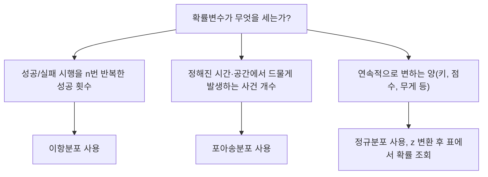

<Callout type="warning">
  **먼저 읽어 주세요.** 이 편의 문제는 실제 독학사 기출 문제를 그대로 옮긴 것이 아닙니다. 국가평생교육진흥원이 공개한 「기초통계학」 **출제범위를 바탕으로 새로 재구성한 문항**입니다. 숫자와 상황을 바꾸어 새로 만들었으므로 문장 자체를 외우는 방식은 통하지 않고, 04~10편에서 배운 개념과 계산 절차를 실제로 이해해야만 풀립니다.
</Callout>

## 이 편을 이렇게 쓰세요

이 편은 04편부터 10편까지 배운 내용을 시험 문제 형태로 다시 만나는 자리다. 개념을 처음 배우는 자리가 아니라, **이미 배운 개념이 문제 속에서 어떻게 위장되는지**를 확인하는 자리라는 점이 중요하다.

각 영역 앞에 "이 유형은 이렇게 접근한다"는 짧은 소절을 두었다. 문제를 풀기 전에 먼저 읽고, 그 접근법을 손으로 직접 적용해 보는 순서를 권한다. 계산 문항은 반드시 손으로 끝까지 계산해야 하며, 눈으로만 공식을 확인하고 넘어가면 실전에서 막힌다.

## 1. 자료의 정리·요약 문제 유형

### 이 유형은 이렇게 접근한다

자료 정리·요약 문항은 크게 세 가지로 나뉜다. 첫째는 도수분포표에서 **상대도수·누적도수를 계산**하는 문항, 둘째는 그래프·그림의 **특징을 개념적으로 구분**하는 문항, 셋째는 누적도수를 이용해 **중앙값이 속한 계급을 역으로 추론**하는 문항이다.

상대도수를 구할 때 가장 흔한 실수는 "이상"과 "미만"의 경계를 잘못 읽는 것이다. 예를 들어 "80점 이상"이라고 했는데 특정 계급 하나만 세고 그 위 계급을 빠뜨리는 식이다. 문제를 풀 때는 반드시 **어느 계급부터 어느 계급까지를 더해야 하는지 손가락으로 짚어 가며** 확인해야 한다.

- **상대도수** = 해당 계급의 도수 ÷ 전체 자료 개수
- **누적도수**는 가장 작은 계급부터 해당 계급까지 도수를 순서대로 더한 값이다.
- 중앙값의 위치는 전체 자료 개수가 $n$일 때 $n$이 짝수면 $n/2$번째와 $(n/2+1)$번째 값의 평균, 홀수면 $(n+1)/2$번째 값이다.

## 4. 이항·포아송·정규분포 문제 유형

### 이 유형은 이렇게 접근한다

분포 문항은 먼저 **어떤 상황에 어떤 분포를 쓰는지**를 판단하는 것이 절반이다. 성공·실패처럼 결과가 두 가지뿐인 시행을 정해진 횟수만큼 반복하면 이항분포, 정해진 시간·공간 안에서 드물게 일어나는 사건의 개수를 세면 포아송분포, 연속적으로 변하는 양을 다루면 정규분포를 쓴다.

- **이항분포의 기댓값과 분산**: $E(X) = np$, $Var(X) = np(1-p)$
- **포아송분포의 확률**: $P(X=k) = e^{-\lambda}\lambda^k \div k!$ (여기서 $\lambda$는 단위 시간·공간당 평균 발생 횟수)
- **z 변환**: $z = (x - \mu) \div \sigma$
- **이항분포의 정규근사**: 평균 $np$, 표준편차는 $np(1-p)$의 제곱근

## 핵심 정리

- 자료 정리·요약 문제는 "이상·이하·미만"의 경계를 정확히 짚어야 하고, 누적도수로 중앙값의 위치를 역추적하는 문제 유형에 익숙해져야 한다.
- 중심경향·산포 계산에서는 표본분산을 반드시 n-1로 나누고, 표준편차와 표준오차(표준편차를 표본크기의 제곱근으로 나눈 값)를 구분해야 한다.
- 조건부확률과 베이즈 정리 문제는 "무엇을 조건으로 하는 확률인지"를 먼저 문장으로 확인한 뒤 공식에 대입해야 방향이 반대로 뒤집히는 실수를 막을 수 있다.
- 이항·포아송·정규분포는 상황(반복 시행의 성공 횟수인지, 드문 사건의 발생 횟수인지, 연속적인 양인지)에 따라 어떤 분포를 쓸지 먼저 판단한 뒤 공식을 적용해야 한다.
- 정규분포 확률 문제는 z 변환 후 표준정규분포표의 값이 "이하 확률"인지 "0부터 z까지의 넓이"인지 표의 관례를 확인하고 풀어야 한다.

## 확인 문제

<Quiz
  questionNumber={1}
  question={"어느 반 학생 40명의 통계학 점수를 10점 단위 계급으로 나눈 도수분포표가 다음과 같다. 60~70점 8명, 70~80점 12명, 80~90점 14명, 90~100점 6명이다. 점수가 80점 이상인 학생의 상대도수(비율)는 얼마인가?"}
  options={["① 15퍼센트","② 35퍼센트","③ 50퍼센트","④ 80퍼센트"]}
  correctAnswer={3}
  explanation={"80점 이상인 학생은 80~90점 계급 14명과 90~100점 계급 6명을 더한 20명이다. 전체 학생 수는 40명이므로 상대도수는 20 ÷ 40 = 0.5, 즉 50퍼센트다. 이 문제가 노리는 함정은 '이상'이라는 말이 가리키는 범위를 정확히 챙기는지 여부다. 80점 이상은 80~90점 계급과 90~100점 계급을 모두 포함해야 하는데, 어느 한쪽만 세면 오답이 나온다."}
/>

<Quiz
  questionNumber={2}
  question={"도수분포표를 만들 때 계급의 폭(계급구간의 크기)을 지나치게 좁게 잡으면 나타나는 문제점으로 가장 적절한 것은?"}
  options={["① 계급별 도수가 0이거나 매우 작아져 전체적인 분포의 모양을 파악하기 어려워진다","② 자료의 세부 정보가 지나치게 단순화되어 사라진다","③ 상대도수의 합이 1(100퍼센트)을 넘어서게 된다","④ 히스토그램의 세로축 단위 표기가 항상 잘못 표시된다"]}
  correctAnswer={1}
  explanation={"계급의 폭을 지나치게 좁게 잡으면 계급의 개수가 많아지고, 각 계급에 들어가는 자료 개수(도수)가 0이거나 1~2개 수준으로 줄어든다. 그러면 히스토그램의 막대가 들쭉날쭉해져서 자료 전체의 경향(어디에 몰려 있는지, 좌우 대칭인지 등)을 한눈에 읽기 어려워진다. 계급 폭을 정할 때 좁을수록 세부 정보는 많이 남지만 전체 모양을 읽는 능력은 떨어지므로, 이 둘 사이에서 적절한 균형을 잡는 것이 도수분포표 작성의 핵심이다."}
/>

<Quiz
  questionNumber={3}
  question={"줄기-잎 그림(stem-and-leaf plot)의 특징으로 옳은 것은?"}
  options={["① 원자료의 값을 근사 없이 그대로 확인하면서 동시에 분포의 대략적인 모양도 파악할 수 있다","② 표본 크기가 매우 커도 자료를 압축하지 않고 표현할 수 있어 항상 히스토그램보다 유리하다","③ 질적 변수(범주형 자료)를 표현하는 데 가장 적합한 그래프다","④ 계급의 폭을 자유롭게 지정할 수 있어 도수분포표보다 유연하다"]}
  correctAnswer={1}
  explanation={"줄기-잎 그림은 자료의 앞자리(줄기)와 뒷자리(잎)를 나란히 늘어놓는 방식이라, 히스토그램처럼 계급으로 뭉뚱그리지 않고 원래 값을 그대로 읽어낼 수 있으면서도 잎이 늘어선 모양을 보면 분포의 대략적인 형태(어디에 몰려 있는지)까지 함께 파악할 수 있다. 이것이 줄기-잎 그림의 핵심 장점이다."}
/>

## 참고 자료

- [국가평생교육진흥원 독학학위제](https://bdes.nile.or.kr)
- [NIST/SEMATECH e-Handbook of Statistical Methods](https://www.itl.nist.gov/div898/handbook/)
