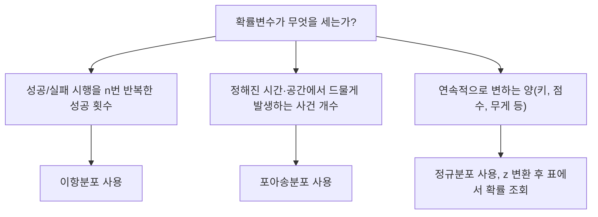

<Callout type="warning">
  **먼저 읽어 주세요.** 이 편의 문제는 실제 독학사 기출 문제를 그대로 옮긴 것이 아닙니다. 국가평생교육진흥원이 공개한 「기초통계학」 **출제범위를 바탕으로 새로 재구성한 문항**입니다. 숫자와 상황을 바꾸어 새로 만들었으므로 문장 자체를 외우는 방식은 통하지 않고, 04~10편에서 배운 개념과 계산 절차를 실제로 이해해야만 풀립니다.
</Callout>

## 이 편을 이렇게 쓰세요

이 편은 04편부터 10편까지 배운 내용을 시험 문제 형태로 다시 만나는 자리다. 개념을 처음 배우는 자리가 아니라, **이미 배운 개념이 문제 속에서 어떻게 위장되는지**를 확인하는 자리라는 점이 중요하다.

각 영역 앞에 "이 유형은 이렇게 접근한다"는 짧은 소절을 두었다. 문제를 풀기 전에 먼저 읽고, 그 접근법을 손으로 직접 적용해 보는 순서를 권한다. 계산 문항은 반드시 손으로 끝까지 계산해야 하며, 눈으로만 공식을 확인하고 넘어가면 실전에서 막힌다.

## 1. 자료의 정리·요약 문제 유형

### 이 유형은 이렇게 접근한다

자료 정리·요약 문항은 크게 세 가지로 나뉜다. 첫째는 도수분포표에서 **상대도수·누적도수를 계산**하는 문항, 둘째는 그래프·그림의 **특징을 개념적으로 구분**하는 문항, 셋째는 누적도수를 이용해 **중앙값이 속한 계급을 역으로 추론**하는 문항이다.

상대도수를 구할 때 가장 흔한 실수는 "이상"과 "미만"의 경계를 잘못 읽는 것이다. 예를 들어 "80점 이상"이라고 했는데 특정 계급 하나만 세고 그 위 계급을 빠뜨리는 식이다. 문제를 풀 때는 반드시 **어느 계급부터 어느 계급까지를 더해야 하는지 손가락으로 짚어 가며** 확인해야 한다.

- **상대도수** = 해당 계급의 도수 ÷ 전체 자료 개수
- **누적도수**는 가장 작은 계급부터 해당 계급까지 도수를 순서대로 더한 값이다.
- 중앙값의 위치는 전체 자료 개수가 $n$일 때 $n$이 짝수면 $n/2$번째와 $(n/2+1)$번째 값의 평균, 홀수면 $(n+1)/2$번째 값이다.

## 4. 이항·포아송·정규분포 문제 유형

### 이 유형은 이렇게 접근한다

분포 문항은 먼저 **어떤 상황에 어떤 분포를 쓰는지**를 판단하는 것이 절반이다. 성공·실패처럼 결과가 두 가지뿐인 시행을 정해진 횟수만큼 반복하면 이항분포, 정해진 시간·공간 안에서 드물게 일어나는 사건의 개수를 세면 포아송분포, 연속적으로 변하는 양을 다루면 정규분포를 쓴다.

- **이항분포의 기댓값과 분산**: $E(X) = np$, $Var(X) = np(1-p)$
- **포아송분포의 확률**: $P(X=k) = e^{-\lambda}\lambda^k \div k!$ (여기서 $\lambda$는 단위 시간·공간당 평균 발생 횟수)
- **z 변환**: $z = (x - \mu) \div \sigma$
- **이항분포의 정규근사**: 평균 $np$, 표준편차는 $np(1-p)$의 제곱근

## 핵심 정리

- 자료 정리·요약 문제는 "이상·이하·미만"의 경계를 정확히 짚어야 하고, 누적도수로 중앙값의 위치를 역추적하는 문제 유형에 익숙해져야 한다.
- 중심경향·산포 계산에서는 표본분산을 반드시 n-1로 나누고, 표준편차와 표준오차(표준편차를 표본크기의 제곱근으로 나눈 값)를 구분해야 한다.
- 조건부확률과 베이즈 정리 문제는 "무엇을 조건으로 하는 확률인지"를 먼저 문장으로 확인한 뒤 공식에 대입해야 방향이 반대로 뒤집히는 실수를 막을 수 있다.
- 이항·포아송·정규분포는 상황(반복 시행의 성공 횟수인지, 드문 사건의 발생 횟수인지, 연속적인 양인지)에 따라 어떤 분포를 쓸지 먼저 판단한 뒤 공식을 적용해야 한다.
- 정규분포 확률 문제는 z 변환 후 표준정규분포표의 값이 "이하 확률"인지 "0부터 z까지의 넓이"인지 표의 관례를 확인하고 풀어야 한다.

## 확인 문제

<Quiz
  questionNumber={1}
  question={"어느 반 학생 40명의 통계학 점수를 10점 단위 계급으로 나눈 도수분포표가 다음과 같다. 60~70점 8명, 70~80점 12명, 80~90점 14명, 90~100점 6명이다. 점수가 80점 이상인 학생의 상대도수(비율)는 얼마인가?"}
  options={["① 15퍼센트","② 35퍼센트","③ 50퍼센트","④ 80퍼센트"]}
  correctAnswer={3}
  explanation={"80점 이상인 학생은 80~90점 계급 14명과 90~100점 계급 6명을 더한 20명이다. 전체 학생 수는 40명이므로 상대도수는 20 ÷ 40 = 0.5, 즉 50퍼센트다. 이 문제가 노리는 함정은 '이상'이라는 말이 가리키는 범위를 정확히 챙기는지 여부다. 80점 이상은 80~90점 계급과 90~100점 계급을 모두 포함해야 하는데, 어느 한쪽만 세면 오답이 나온다."}
/>

<Quiz
  questionNumber={2}
  question={"도수분포표를 만들 때 계급의 폭(계급구간의 크기)을 지나치게 좁게 잡으면 나타나는 문제점으로 가장 적절한 것은?"}
  options={["① 계급별 도수가 0이거나 매우 작아져 전체적인 분포의 모양을 파악하기 어려워진다","② 자료의 세부 정보가 지나치게 단순화되어 사라진다","③ 상대도수의 합이 1(100퍼센트)을 넘어서게 된다","④ 히스토그램의 세로축 단위 표기가 항상 잘못 표시된다"]}
  correctAnswer={1}
  explanation={"계급의 폭을 지나치게 좁게 잡으면 계급의 개수가 많아지고, 각 계급에 들어가는 자료 개수(도수)가 0이거나 1~2개 수준으로 줄어든다. 그러면 히스토그램의 막대가 들쭉날쭉해져서 자료 전체의 경향(어디에 몰려 있는지, 좌우 대칭인지 등)을 한눈에 읽기 어려워진다. 계급 폭을 정할 때 좁을수록 세부 정보는 많이 남지만 전체 모양을 읽는 능력은 떨어지므로, 이 둘 사이에서 적절한 균형을 잡는 것이 도수분포표 작성의 핵심이다."}
/>

<Quiz
  questionNumber={3}
  question={"줄기-잎 그림(stem-and-leaf plot)의 특징으로 옳은 것은?"}
  options={["① 원자료의 값을 근사 없이 그대로 확인하면서 동시에 분포의 대략적인 모양도 파악할 수 있다","② 표본 크기가 매우 커도 자료를 압축하지 않고 표현할 수 있어 항상 히스토그램보다 유리하다","③ 질적 변수(범주형 자료)를 표현하는 데 가장 적합한 그래프다","④ 계급의 폭을 자유롭게 지정할 수 있어 도수분포표보다 유연하다"]}
  correctAnswer={1}
  explanation={"줄기-잎 그림은 자료의 앞자리(줄기)와 뒷자리(잎)를 나란히 늘어놓는 방식이라, 히스토그램처럼 계급으로 뭉뚱그리지 않고 원래 값을 그대로 읽어낼 수 있으면서도 잎이 늘어선 모양을 보면 분포의 대략적인 형태(어디에 몰려 있는지)까지 함께 파악할 수 있다. 이것이 줄기-잎 그림의 핵심 장점이다."}
/>

<Quiz
  questionNumber={4}
  question={"어떤 자료를 5개 계급으로 나누어 상대도수를 구했더니 A=0.15, B=0.25, C=0.30, D=0.20이었다. 마지막 계급 E의 상대도수는 얼마인가?"}
  options={["① 0.05","② 0.10","③ 0.15","④ 0.90"]}
  correctAnswer={2}
  explanation={"모든 계급의 상대도수를 더하면 반드시 1(100퍼센트)이 되어야 한다. A부터 D까지 더하면 0.15 + 0.25 + 0.30 + 0.20 = 0.90이므로, 마지막 계급 E의 상대도수는 1에서 이 값을 빼서 구한다. 1 - 0.90 = 0.10이다."}
/>

<Quiz
  questionNumber={5}
  question={"학생 40명의 점수 자료에서 누적도수가 60점 미만 10명, 70점 미만 22명, 80점 미만 34명, 90점 미만 40명(전체)이다. 이 자료의 중앙값이 속한 계급은 어디인가?"}
  options={["① 60~70점","② 70~80점","③ 80~90점","④ 90~100점"]}
  correctAnswer={1}
  explanation={"자료 개수가 40개(짝수)이므로 중앙값은 20번째 값과 21번째 값의 평균이며, 이 두 값이 어느 계급에 속하는지 찾으면 된다. 누적도수를 보면 60점 미만이 10명, 70점 미만이 22명이므로, 11번째 값부터 22번째 값까지가 모두 60~70점 계급에 속한다. 20번째와 21번째 값도 이 범위 안에 있으므로 중앙값은 60~70점 계급에 속한다."}
/>

<Quiz
  questionNumber={6}
  question={"자료 4, 8, 6, 10, 12의 평균은 얼마인가?"}
  options={["① 6","② 7","③ 8","④ 9"]}
  correctAnswer={3}
  explanation={"다섯 개 값을 모두 더하면 4+8+6+10+12 = 40이고, 자료 개수는 5개이므로 평균은 40 ÷ 5 = 8이다."}
/>

<Quiz
  questionNumber={7}
  question={"자료 3, 7, 7, 9, 15, 20의 중앙값은 얼마인가?"}
  options={["① 7","② 8","③ 9","④ 11"]}
  correctAnswer={2}
  explanation={"자료는 이미 크기순으로 정렬되어 있고 개수는 6개(짝수)다. 짝수 개일 때 중앙값은 3번째 값과 4번째 값의 평균이다. 3번째 값은 7, 4번째 값은 9이므로 중앙값은 (7+9) ÷ 2 = 8이다."}
/>

<Quiz
  questionNumber={8}
  question={"표본 자료 2, 4, 6, 8, 10(표본평균 6)의 표본분산은 얼마인가?"}
  options={["① 8","② 10","③ 40","④ 20"]}
  correctAnswer={2}
  explanation={"각 값에서 평균 6을 뺀 편차는 -4, -2, 0, 2, 4다. 편차를 제곱하면 16, 4, 0, 4, 16이고 이를 모두 더한 편차제곱합은 40이다. 표본분산은 이 편차제곱합을 자유도인 n-1로 나누므로 40 ÷ (5-1) = 40 ÷ 4 = 10이다."}
/>

<Quiz
  questionNumber={9}
  question={"어떤 모집단에서 크기 25인 표본을 뽑았고 표본표준편차가 10이다. 이 표본평균의 표준오차는 얼마인가?"}
  options={["① 10","② 50","③ 2","④ 0.4"]}
  correctAnswer={3}
  explanation={"표준오차는 표준편차를 표본크기의 제곱근으로 나눈 값이다. 표본크기 25의 제곱근은 5이므로, 표준오차는 10 ÷ 5 = 2다."}
/>

<Quiz
  questionNumber={10}
  question={"A집단은 평균 50, 표준편차 10이고 B집단은 평균 200, 표준편차 30이다. 변동계수(CV)를 기준으로 상대적인 산포가 더 큰 집단은 어디인가?"}
  options={["① A집단(변동계수 약 20퍼센트)","② B집단(변동계수 약 15퍼센트)","③ A집단(변동계수 약 15퍼센트)","④ B집단(변동계수 약 20퍼센트)"]}
  correctAnswer={1}
  explanation={"변동계수는 표준편차를 평균으로 나눈 값이다. A집단은 10 ÷ 50 = 0.20으로 20퍼센트이고, B집단은 30 ÷ 200 = 0.15로 15퍼센트다. 변동계수가 더 큰 A집단이 평균 규모를 고려했을 때 상대적으로 더 많이 흩어져 있는 집단이다."}
/>

<Quiz
  questionNumber={11}
  question={"크기순으로 정렬된 자료 12개 2, 4, 5, 7, 8, 10, 12, 13, 15, 18, 20, 25에서 (n+1)/4 공식으로 제1사분위수 Q1의 위치를 구해 계산하면 얼마인가?"}
  options={["① 5","② 5.5","③ 7","④ 6"]}
  correctAnswer={2}
  explanation={"자료 개수 n은 12이므로 Q1의 위치는 (12+1)÷4 = 3.25번째다. 이는 3번째 값과 4번째 값 사이 25퍼센트 지점을 의미한다. 3번째 값은 5, 4번째 값은 7이므로, Q1 = 5 + 0.25×(7-5) = 5 + 0.5 = 5.5다."}
/>

<Quiz
  questionNumber={12}
  question={"주사위를 두 번 던질 때 적어도 한 번은 6이 나올 확률은 얼마인가?"}
  options={["① 11/36","② 25/36","③ 1/6","④ 1/3"]}
  correctAnswer={1}
  explanation={"'적어도 한 번 6이 나온다'의 여사건은 '두 번 모두 6이 아니다'이다. 한 번 던져서 6이 아닐 확률은 5/6이고, 두 번의 시행은 독립이므로 두 번 모두 6이 아닐 확률은 (5/6)×(5/6) = 25/36이다. 따라서 적어도 한 번 6이 나올 확률은 1 - 25/36 = 11/36이다."}
/>

<Quiz
  questionNumber={13}
  question={"어느 집단에서 P(A)=0.5, P(B)=0.4, P(A∩B)=0.3이다. P(A|B)는 얼마인가?"}
  options={["① 0.75","② 0.6","③ 0.3","④ 0.2"]}
  correctAnswer={1}
  explanation={"조건부확률 P(A|B)는 P(A∩B)를 P(B)로 나눈 값이다. 즉 0.3 ÷ 0.4 = 0.75다."}
/>

<Quiz
  questionNumber={14}
  question={"사건 A, B에 대해 P(A)=0.3, P(B)=0.4, P(A∩B)=0.12일 때 두 사건의 관계로 옳은 것은?"}
  options={["① 독립이다","② 배반(상호배타)이다","③ 종속이면서 배반이다","④ 주어진 정보만으로는 알 수 없다"]}
  correctAnswer={1}
  explanation={"두 사건이 독립인지 확인하려면 P(A)×P(B)와 P(A∩B)가 같은지 비교한다. P(A)×P(B) = 0.3×0.4 = 0.12이고, 이는 주어진 P(A∩B)=0.12와 정확히 일치한다. 따라서 두 사건은 독립이다."}
/>

<Quiz
  questionNumber={15}
  question={"어떤 공장에서 부품을 기계 A, B, C가 각각 50퍼센트, 30퍼센트, 20퍼센트 비율로 생산한다. 각 기계의 불량률은 A 2퍼센트, B 3퍼센트, C 5퍼센트다. 임의로 뽑은 부품이 불량일 확률은 얼마인가?"}
  options={["① 2.9퍼센트","② 10퍼센트","③ 3.3퍼센트","④ 2퍼센트"]}
  correctAnswer={1}
  explanation={"전확률의 법칙에 따라, 부품이 불량일 확률은 각 기계의 생산 비율과 그 기계의 불량률을 곱해서 모두 더한 값이다. 0.5×0.02 + 0.3×0.03 + 0.2×0.05 = 0.01 + 0.009 + 0.01 = 0.029, 즉 2.9퍼센트다."}
/>

<Quiz
  questionNumber={16}
  question={"문항 15의 상황에서 임의로 뽑은 부품이 불량이었을 때, 그 부품이 기계 C에서 생산되었을 확률은 얼마인가? (부품이 불량일 확률은 2.9퍼센트로 이미 계산되어 있다)"}
  options={["① 약 34.5퍼센트","② 약 20퍼센트","③ 약 5퍼센트","④ 약 50퍼센트"]}
  correctAnswer={1}
  explanation={"베이즈 정리를 쓴다. 구하려는 값은 P(C|불량) = P(C)×P(불량|C) ÷ P(불량)이다. 분자는 C의 생산 비율과 C의 불량률을 곱한 0.2×0.05 = 0.01이고, 분모는 문항 15에서 구한 전체 불량 확률 0.029다. 따라서 P(C|불량) = 0.01 ÷ 0.029 ≈ 0.345, 즉 약 34.5퍼센트다."}
/>

<Quiz
  questionNumber={17}
  question={"'두 사건이 상호배반(mutually exclusive)이면 항상 독립이다'라는 주장에 대한 설명으로 가장 적절한 것은?"}
  options={["① 두 사건의 확률이 모두 0보다 크면 이 주장은 거짓이다","② 상호배반은 곧 독립을 의미하므로 이 주장은 항상 참이다","③ 독립인 두 사건은 항상 상호배반이므로 이 주장은 참이다","④ 표본공간이 유한한 경우에만 이 주장은 참이다"]}
  correctAnswer={1}
  explanation={"상호배반(배반)인 두 사건은 동시에 일어날 수 없으므로 P(A∩B)=0이다. 반면 독립이려면 P(A∩B)=P(A)×P(B)가 성립해야 한다. 만약 P(A)와 P(B)가 모두 0보다 크다면 P(A)×P(B)도 0보다 커야 하는데, 배반이면 P(A∩B)=0이므로 두 값이 같을 수 없다. 따라서 두 사건의 확률이 모두 양수라면 배반과 독립은 동시에 성립할 수 없고, 원래 주장은 거짓이 된다."}
/>

<Quiz
  questionNumber={18}
  question={"성공확률 p=0.3인 베르누이 시행을 n=20번 반복하는 이항분포에서 기댓값과 분산은 각각 얼마인가?"}
  options={["① 기댓값 6, 분산 4.2","② 기댓값 6, 분산 6","③ 기댓값 4.2, 분산 6","④ 기댓값 6, 분산 1.4"]}
  correctAnswer={1}
  explanation={"이항분포의 기댓값은 E(X)=np이므로 20×0.3=6이다. 분산은 Var(X)=np(1-p)이므로 20×0.3×0.7=4.2다."}
/>

<Quiz
  questionNumber={19}
  question={"동전을 5번 던질 때 정확히 3번 앞면이 나올 확률은 얼마인가? (앞면이 나올 확률 p=0.5인 이항분포)"}
  options={["① 0.3125","② 0.5","③ 0.15625","④ 0.25"]}
  correctAnswer={1}
  explanation={"이항분포 확률은 (n번 중 k번을 고르는 조합의 수) × p^k × (1-p)^(n-k)로 계산한다. 5번 중 3번을 고르는 조합의 수는 10가지다. p^3 = 0.5×0.5×0.5 = 0.125이고 (1-p)^2 = 0.5×0.5 = 0.25다. 따라서 확률은 10 × 0.125 × 0.25 = 0.3125다."}
/>

<Quiz
  questionNumber={20}
  question={"어떤 콜센터에 시간당 평균 4건의 불만 전화가 걸려 온다(포아송분포, 람다=4). 어느 시간에 불만 전화가 정확히 0건 걸려올 확률은 얼마인가? (e의 -4제곱은 약 0.0183이다)"}
  options={["① 약 0.0183","② 약 0.25","③ 약 0.9817","④ 약 0.1353"]}
  correctAnswer={1}
  explanation={"포아송분포에서 P(X=0) = e^(-람다) × 람다^0 ÷ 0!이다. 람다^0과 0!은 모두 1이므로 P(X=0) = e^(-람다) = e^(-4) ≈ 0.0183이다."}
/>

<Quiz
  questionNumber={21}
  question={"이항분포를 포아송분포로 근사하기에 가장 적절한 조건은 무엇인가?"}
  options={["① n이 크고 p가 매우 작아서 np가 일정한 값으로 유지될 때","② n이 작고 p가 0.5에 가까울 때","③ n과 p가 모두 클 때","④ 표본이 정규분포를 따를 때"]}
  correctAnswer={1}
  explanation={"포아송분포는 원래 '드물게 일어나는 사건의 발생 횟수'를 다루기 위해 만들어진 분포다. 이항분포에서 시행 횟수 n이 아주 크고 성공확률 p가 아주 작아서 평균 성공 횟수 np가 어느 정도 일정한 값으로 유지될 때, 이항분포는 포아송분포로 잘 근사된다."}
/>

<Quiz
  questionNumber={22}
  question={"어떤 시험 점수가 평균 70, 표준편차 8인 정규분포를 따른다. 점수가 82점인 학생의 z점수는 얼마인가?"}
  options={["① 1.5","② 1.2","③ 0.67","④ 12"]}
  correctAnswer={1}
  explanation={"z점수는 (관측값 - 평균) ÷ 표준편차로 계산한다. (82-70) ÷ 8 = 12 ÷ 8 = 1.5다."}
/>

<Quiz
  questionNumber={23}
  question={"문항 22와 같은 분포에서 점수가 82점 이상일 확률은 얼마인가? (표준정규분포표에서 P(Z≤1.5)=0.9332로 주어진다)"}
  options={["① 약 0.0668","② 약 0.9332","③ 약 0.4332","④ 약 0.5668"]}
  correctAnswer={1}
  explanation={"82점 이상일 확률은 z=1.5 이상일 확률, 즉 P(Z≥1.5)다. 표에서 주어진 P(Z≤1.5)=0.9332는 82점 미만일 확률이므로, 82점 이상일 확률은 1에서 이 값을 뺀 1 - 0.9332 = 0.0668이다."}
/>

<Quiz
  questionNumber={24}
  question={"어떤 여론조사에서 n=100, p=0.5인 이항분포를 정규분포로 근사할 때 사용하는 평균과 표준편차는 각각 얼마인가?"}
  options={["① 평균 50, 표준편차 5","② 평균 50, 표준편차 25","③ 평균 5, 표준편차 50","④ 평균 50, 표준편차 2.5"]}
  correctAnswer={1}
  explanation={"이항분포를 정규분포로 근사할 때 평균은 np, 표준편차는 np(1-p)의 제곱근을 쓴다. 평균은 100×0.5=50이다. 분산은 np(1-p)=100×0.5×0.5=25이고, 표준편차는 이 분산의 제곱근이므로 25의 제곱근인 5다."}
/>

## 참고 자료

- [국가평생교육진흥원 독학학위제](https://bdes.nile.or.kr)
- [NIST/SEMATECH e-Handbook of Statistical Methods](https://www.itl.nist.gov/div898/handbook/)
