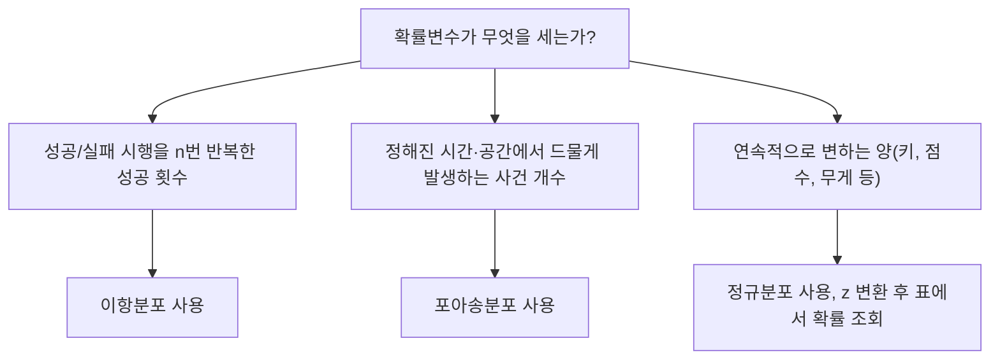

<Callout type="warning">
  **먼저 읽어 주세요.** 이 편의 문제는 실제 독학사 기출 문제를 그대로 옮긴 것이 아닙니다. 국가평생교육진흥원이 공개한 「기초통계학」 **출제범위를 바탕으로 새로 재구성한 문항**입니다. 숫자와 상황을 바꾸어 새로 만들었으므로 문장 자체를 외우는 방식은 통하지 않고, 05~11편에서 배운 개념과 계산 절차를 실제로 이해해야만 풀립니다.
</Callout>

<Callout type="info">
  **이번 문서의 목표:** 자료의 정리·요약, 중심경향·산포, 확률의 기초·조건부확률·베이즈 정리, 이항·포아송·정규분포 네 영역을 아우르는 24개 문항을 직접 풀고, 각 해설에서 정답이 나온 전 과정과 오답이 나오게 된 실수 지점을 하나씩 확인한다.
</Callout>

## 이 편을 이렇게 쓰세요

이 편은 05편부터 11편까지 배운 내용을 시험 문제 형태로 다시 만나는 자리다. 개념을 처음 배우는 자리가 아니라, **이미 배운 개념이 문제 속에서 어떻게 위장되는지**를 확인하는 자리라는 점이 중요하다.

> **쉽게 말하면:** 먼저 스스로 풀고 채점한 다음, 맞은 문제든 틀린 문제든 해설의 오답 이유까지 전부 읽어라. 오답 보기 하나하나가 실수의 유형을 보여준다.

각 영역 앞에 "이 유형은 이렇게 접근한다"는 짧은 소절을 두었다. 문제를 풀기 전에 먼저 읽고, 그 접근법을 손으로 직접 적용해 보는 순서를 권한다. 계산 문항은 반드시 손으로 끝까지 계산해야 하며, 눈으로만 공식을 확인하고 넘어가면 실전에서 막힌다.

## 1. 자료의 정리·요약 문제 유형

### 이 유형은 이렇게 접근한다

자료 정리·요약 문항은 크게 세 가지로 나뉜다. 첫째는 도수분포표에서 **상대도수·누적도수를 계산**하는 문항, 둘째는 그래프·그림의 **특징을 개념적으로 구분**하는 문항, 셋째는 누적도수를 이용해 **중앙값이 속한 계급을 역으로 추론**하는 문항이다.

상대도수를 구할 때 가장 흔한 실수는 "이상"과 "미만"의 경계를 잘못 읽는 것이다. 예를 들어 "80점 이상"이라고 했는데 특정 계급 하나만 세고 그 위 계급을 빠뜨리는 식이다. 문제를 풀 때는 반드시 **어느 계급부터 어느 계급까지를 더해야 하는지 손가락으로 짚어 가며** 확인해야 한다.

- **상대도수** = 해당 계급의 도수 ÷ 전체 자료 개수
- **누적도수**는 가장 작은 계급부터 해당 계급까지 도수를 순서대로 더한 값이다.
- 중앙값의 위치는 전체 자료 개수가 $n$일 때 $n$이 짝수면 $n/2$번째와 $(n/2+1)$번째 값의 평균, 홀수면 $(n+1)/2$번째 값이다.

<Quiz
  questionNumber={1}
  question="어느 반 학생 40명의 통계학 점수를 10점 단위 계급으로 나눈 도수분포표가 다음과 같다. 60~70점 8명, 70~80점 12명, 80~90점 14명, 90~100점 6명이다. 점수가 80점 이상인 학생의 상대도수(비율)는 얼마인가?"
  options={['① 15퍼센트', '② 35퍼센트', '③ 50퍼센트', '④ 80퍼센트']}
  correctAnswer={3}
  explanation="80점 이상인 학생은 80~90점 계급 14명과 90~100점 계급 6명을 더한 20명이다. 전체 학생 수는 40명이므로 상대도수는 20 ÷ 40 = 0.5, 즉 50퍼센트다. 이 문제가 노리는 함정은 '이상'이라는 말이 가리키는 범위를 정확히 챙기는지 여부다. 80점 이상은 80~90점 계급과 90~100점 계급을 모두 포함해야 하는데, 어느 한쪽만 세면 오답이 나온다."
  optionExplanations={['90~100점 계급 6명만 세고 80~90점 계급 14명을 빠뜨린 값이다. 6 ÷ 40 = 0.15로 15퍼센트가 나오지만 80~90점 구간을 놓친 계산이다.', '80~90점 계급 14명만 세고 90~100점 계급 6명을 빠뜨린 값이다. 14 ÷ 40 = 0.35로 35퍼센트가 나오지만 최상위 계급을 놓친 계산이다.', '80점 이상인 두 계급(14명+6명=20명)을 모두 더해 20 ÷ 40 = 0.5로 계산한 값이므로 옳다.', '70점 이상으로 잘못 읽어 70~80점, 80~90점, 90~100점 세 계급(12+14+6=32명)을 모두 더한 값이다. 32 ÷ 40 = 0.8로 80퍼센트가 나오지만 문제는 80점 이상을 물었다.']}
/>

<Quiz
  questionNumber={2}
  question="도수분포표를 만들 때 계급의 폭(계급구간의 크기)을 지나치게 좁게 잡으면 나타나는 문제점으로 가장 적절한 것은?"
  options={['① 계급별 도수가 0이거나 매우 작아져 전체적인 분포의 모양을 파악하기 어려워진다', '② 자료의 세부 정보가 지나치게 단순화되어 사라진다', '③ 상대도수의 합이 1(100퍼센트)을 넘어서게 된다', '④ 히스토그램의 세로축 단위 표기가 항상 잘못 표시된다']}
  correctAnswer={1}
  explanation="계급의 폭을 지나치게 좁게 잡으면 계급의 개수가 많아지고, 각 계급에 들어가는 자료 개수(도수)가 0이거나 1~2개 수준으로 줄어든다. 그러면 히스토그램의 막대가 들쭉날쭉해져서 자료 전체의 경향(어디에 몰려 있는지, 좌우 대칭인지 등)을 한눈에 읽기 어려워진다. 계급 폭을 정할 때 좁을수록 세부 정보는 많이 남지만 전체 모양을 읽는 능력은 떨어지므로, 이 둘 사이에서 적절한 균형을 잡는 것이 도수분포표 작성의 핵심이다."
  optionExplanations={['계급별 도수가 작아져 분포 형태를 읽기 어려워지는 것이 계급폭을 좁게 잡을 때의 실제 문제점이므로 옳다.', '세부 정보가 단순화되어 사라지는 것은 계급 폭을 오히려 넓게 잡을 때 나타나는 문제다. 좁게 잡으면 반대로 세부 정보는 더 많이 남는다.', '상대도수의 합은 계급을 어떻게 나누어도 항상 1이 되도록 정의되므로, 계급폭과 무관하게 이 서술 자체가 틀렸다.', '세로축 단위 표시는 계급폭과 무관하게 작성자가 올바르게 설정하면 되는 사항이며, 계급폭이 좁다고 항상 잘못 표시되는 것은 아니다.']}
/>

<Quiz
  questionNumber={3}
  question="줄기-잎 그림(stem-and-leaf plot)의 특징으로 옳은 것은?"
  options={['① 원자료의 값을 근사 없이 그대로 확인하면서 동시에 분포의 대략적인 모양도 파악할 수 있다', '② 표본 크기가 매우 커도 자료를 압축하지 않고 표현할 수 있어 항상 히스토그램보다 유리하다', '③ 질적 변수(범주형 자료)를 표현하는 데 가장 적합한 그래프다', '④ 계급의 폭을 자유롭게 지정할 수 있어 도수분포표보다 유연하다']}
  correctAnswer={1}
  explanation="줄기-잎 그림은 자료의 앞자리(줄기)와 뒷자리(잎)를 나란히 늘어놓는 방식이라, 히스토그램처럼 계급으로 뭉뚱그리지 않고 원래 값을 그대로 읽어낼 수 있으면서도 잎이 늘어선 모양을 보면 분포의 대략적인 형태(어디에 몰려 있는지)까지 함께 파악할 수 있다. 이것이 줄기-잎 그림의 핵심 장점이다."
  optionExplanations={['원자료를 보존하면서 분포 모양도 함께 보여주는 것이 줄기-잎 그림의 정확한 특징이므로 옳다.', '표본 크기가 매우 커지면 잎이 한 줄에 너무 많이 늘어서서 오히려 읽기 어려워진다. 이런 경우에는 자료를 압축하는 히스토그램이 더 유리하므로 항상 유리하다는 서술은 틀렸다.', '줄기-잎 그림은 숫자 자료(양적 변수)의 앞자리·뒷자리를 나누어 쓰는 방식이므로 범주형 자료가 아니라 양적 자료를 표현하는 데 적합하다.', '줄기-잎 그림은 자료의 자릿수 구조(십의 자리를 줄기로, 일의 자리를 잎으로 삼는 식)에 따라 구간이 정해지므로, 계급폭을 임의로 자유롭게 조정하기 어렵다. 오히려 도수분포표 쪽이 계급폭을 자유롭게 정할 수 있다.']}
/>

<Quiz
  questionNumber={4}
  question="어떤 자료를 5개 계급으로 나누어 상대도수를 구했더니 A=0.15, B=0.25, C=0.30, D=0.20이었다. 마지막 계급 E의 상대도수는 얼마인가?"
  options={['① 0.05', '② 0.10', '③ 0.15', '④ 0.90']}
  correctAnswer={2}
  explanation="모든 계급의 상대도수를 더하면 반드시 1(100퍼센트)이 되어야 한다. A부터 D까지 더하면 0.15 + 0.25 + 0.30 + 0.20 = 0.90이므로, 마지막 계급 E의 상대도수는 1에서 이 값을 빼서 구한다. 1 - 0.90 = 0.10이다."
  optionExplanations={['1에서 0.95를 빼는 것처럼 계산해 값이 지나치게 작게 나온 경우다. A부터 D까지의 합은 0.90이지 0.95가 아니므로 이 값은 틀렸다.', 'A부터 D까지의 합 0.90을 1에서 정확히 빼면 0.10이 나오므로 옳다.', 'D의 상대도수 0.20을 절반으로 나누는 등 계산 과정에서 착오가 생긴 값으로, 전체 합이 1이 된다는 조건을 만족하지 않는다.', 'A부터 D까지 더한 값 0.90을 그대로 답으로 써버린 경우다. 이는 이미 나온 네 계급의 합일 뿐 마지막 계급 E의 상대도수가 아니다.']}
/>

<Quiz
  questionNumber={5}
  question="학생 40명의 점수 자료에서 누적도수가 60점 미만 10명, 70점 미만 22명, 80점 미만 34명, 90점 미만 40명(전체)이다. 이 자료의 중앙값이 속한 계급은 어디인가?"
  options={['① 60~70점', '② 70~80점', '③ 80~90점', '④ 90~100점']}
  correctAnswer={1}
  explanation="자료 개수가 40개(짝수)이므로 중앙값은 20번째 값과 21번째 값의 평균이며, 이 두 값이 어느 계급에 속하는지 찾으면 된다. 누적도수를 보면 60점 미만이 10명, 70점 미만이 22명이므로, 11번째 값부터 22번째 값까지가 모두 60~70점 계급에 속한다. 20번째와 21번째 값도 이 범위 안에 있으므로 중앙값은 60~70점 계급에 속한다."
  optionExplanations={['60점 미만 누적도수가 10명, 70점 미만 누적도수가 22명이므로 11번째부터 22번째까지의 값이 이 계급에 속하고, 중앙값 위치인 20번째와 21번째도 여기에 포함되므로 옳다.', '70점 미만 누적도수가 이미 22명으로 20번째와 21번째 값을 넘어서므로, 중앙값은 이 계급이 아니라 그 앞 계급에서 이미 결정된다.', '80점 미만 누적도수 34명은 20~21번째 위치를 한참 지난 지점이므로 중앙값이 속한 계급이 될 수 없다.', '90점 미만 누적도수 40명은 전체 자료를 다 센 지점이므로 중앙값과는 무관하다.']}
/>

## 2. 중심경향·산포 문제 유형

### 이 유형은 이렇게 접근한다

이 영역에서 가장 많이 나오는 함정은 두 가지다. 첫째는 **표본분산을 구할 때 $n$으로 나누는 실수**다. 표본에서 계산한 분산(표본분산)은 반드시 자유도인 $n-1$로 나누어야 하며, $n$으로 나누면 모분산 공식이 되어 값이 실제보다 작게 나온다. 둘째는 **표준편차와 표준오차를 혼동하는 실수**다. 표준편차는 자료 하나하나가 평균에서 얼마나 흩어져 있는지를 나타내고, 표준오차는 표본평균이라는 통계량 자체가 얼마나 흩어져 있는지를 나타내는 값으로, 표준편차를 표본크기의 제곱근으로 나눈 것이다.

- **표본분산** $s^2$ = 편차제곱합 ÷ $(n-1)$
- **표준편차** $s$ = 표본분산의 제곱근
- **표준오차** = 표준편차 ÷ 표본크기의 제곱근
- **변동계수(CV)** = 표준편차 ÷ 평균. 평균의 크기가 다른 두 집단의 산포를 비교할 때 쓴다.

<Quiz
  questionNumber={6}
  question="자료 4, 8, 6, 10, 12의 평균은 얼마인가?"
  options={['① 6', '② 7', '③ 8', '④ 9']}
  correctAnswer={3}
  explanation="다섯 개 값을 모두 더하면 4+8+6+10+12 = 40이고, 자료 개수는 5개이므로 평균은 40 ÷ 5 = 8이다."
  optionExplanations={['합을 40이 아니라 30으로 잘못 계산했을 때 나오는 값(30÷5=6)으로, 덧셈 과정에서 항을 빠뜨린 경우다.', '합을 35로 잘못 계산했을 때 나오는 값(35÷5=7)이다.', '4+8+6+10+12 = 40이고 40 ÷ 5 = 8이므로 옳다.', '합을 45로 잘못 계산했을 때 나오는 값(45÷5=9)이다.']}
/>

<Quiz
  questionNumber={7}
  question="자료 3, 7, 7, 9, 15, 20의 중앙값은 얼마인가?"
  options={['① 7', '② 8', '③ 9', '④ 11']}
  correctAnswer={2}
  explanation="자료는 이미 크기순으로 정렬되어 있고 개수는 6개(짝수)다. 짝수 개일 때 중앙값은 3번째 값과 4번째 값의 평균이다. 3번째 값은 7, 4번째 값은 9이므로 중앙값은 (7+9) ÷ 2 = 8이다."
  optionExplanations={['3번째 값 7만 답으로 쓴 경우로, 짝수 개일 때는 4번째 값과 평균을 내야 한다는 점을 놓친 것이다.', '3번째 값과 4번째 값의 평균인 (7+9)÷2 = 8이 정확한 중앙값이므로 옳다.', '4번째 값 9만 답으로 쓴 경우로, 3번째 값과 평균을 내지 않고 한쪽 값만 택한 것이다.', '2번째 값 7과 5번째 값 15의 평균인 (7+15)÷2 = 11을 계산한 값으로, 중앙값 위치를 잘못 짚은 것이다.']}
/>

<Quiz
  questionNumber={8}
  question="표본 자료 2, 4, 6, 8, 10(표본평균 6)의 표본분산은 얼마인가?"
  options={['① 8', '② 10', '③ 40', '④ 20']}
  correctAnswer={2}
  explanation="각 값에서 평균 6을 뺀 편차는 -4, -2, 0, 2, 4다. 편차를 제곱하면 16, 4, 0, 4, 16이고 이를 모두 더한 편차제곱합은 40이다. 표본분산은 이 편차제곱합을 자유도인 n-1로 나누므로 40 ÷ (5-1) = 40 ÷ 4 = 10이다."
  optionExplanations={['편차제곱합 40을 자유도 4가 아니라 표본크기 5로 나눈 값(40÷5=8)이다. 이는 표본분산이 아니라 모분산을 구하는 공식이므로 자유도로 나누어야 하는 표본분산 문제에서는 틀린 값이다.', '편차제곱합 40을 자유도인 n-1=4로 정확히 나눈 값이므로 옳다.', '편차제곱합 40 자체를 답으로 써버린 경우로, 자유도로 나누는 마지막 단계를 빠뜨린 것이다.', '편차제곱합 40을 잘못된 값 2로 나눈 경우로, 자유도 계산에서 착오가 생긴 것이다.']}
/>

<Quiz
  questionNumber={9}
  question="어떤 모집단에서 크기 25인 표본을 뽑았고 표본표준편차가 10이다. 이 표본평균의 표준오차는 얼마인가?"
  options={['① 10', '② 50', '③ 2', '④ 0.4']}
  correctAnswer={3}
  explanation="표준오차는 표준편차를 표본크기의 제곱근으로 나눈 값이다. 표본크기 25의 제곱근은 5이므로, 표준오차는 10 ÷ 5 = 2다."
  optionExplanations={['표준편차 10을 그대로 표준오차로 착각한 값이다. 표준편차는 개별 자료의 흩어짐이고 표준오차는 표본평균의 흩어짐이므로 서로 다른 값이다.', '표준편차에 표본크기의 제곱근을 곱한 값(10×5=50)으로, 나누어야 할 것을 곱한 계산 실수다.', '표준편차 10을 표본크기의 제곱근 5로 정확히 나눈 값이므로 옳다.', '표준편차 10을 표본크기 25로 그대로 나눈 값(10÷25=0.4)으로, 제곱근을 취하지 않고 표본크기로 바로 나눈 실수다.']}
/>

<Quiz
  questionNumber={10}
  question="A집단은 평균 50, 표준편차 10이고 B집단은 평균 200, 표준편차 30이다. 변동계수(CV)를 기준으로 상대적인 산포가 더 큰 집단은 어디인가?"
  options={['① A집단(변동계수 약 20퍼센트)', '② B집단(변동계수 약 15퍼센트)', '③ A집단(변동계수 약 15퍼센트)', '④ B집단(변동계수 약 20퍼센트)']}
  correctAnswer={1}
  explanation="변동계수는 표준편차를 평균으로 나눈 값이다. A집단은 10 ÷ 50 = 0.20으로 20퍼센트이고, B집단은 30 ÷ 200 = 0.15로 15퍼센트다. 변동계수가 더 큰 A집단이 평균 규모를 고려했을 때 상대적으로 더 많이 흩어져 있는 집단이다."
  optionExplanations={['A집단의 변동계수는 10÷50=0.20으로 20퍼센트이며 B집단의 15퍼센트보다 크므로 A집단이 상대적으로 산포가 더 크다는 결론이 옳다.', 'B집단의 변동계수 자체는 30÷200=0.15로 15퍼센트가 맞지만, 이 값이 A집단의 20퍼센트보다 작으므로 B집단을 산포가 더 큰 집단으로 고르면 틀린다.', 'A집단을 정답으로 고른 것은 맞지만 변동계수 값 자체를 15퍼센트로 잘못 계산했다. A집단의 정확한 변동계수는 20퍼센트다.', '표준편차 값(30>10)만 보고 B집단이 더 흩어져 있다고 판단한 경우다. 하지만 두 집단은 평균 규모가 다르므로(50 대 200) 표준편차만으로 비교하면 안 되고 변동계수로 비교해야 한다.']}
/>

<Quiz
  questionNumber={11}
  question="크기순으로 정렬된 자료 12개 2, 4, 5, 7, 8, 10, 12, 13, 15, 18, 20, 25에서 (n+1)/4 공식으로 제1사분위수 Q1의 위치를 구해 계산하면 얼마인가?"
  options={['① 5', '② 5.5', '③ 7', '④ 6']}
  correctAnswer={2}
  explanation="자료 개수 n은 12이므로 Q1의 위치는 (12+1)÷4 = 3.25번째다. 이는 3번째 값과 4번째 값 사이 25퍼센트 지점을 의미한다. 3번째 값은 5, 4번째 값은 7이므로, Q1 = 5 + 0.25×(7-5) = 5 + 0.5 = 5.5다."
  optionExplanations={['위치가 3.25번째라는 것을 무시하고 3번째 값 5를 그대로 답으로 쓴 경우로, 소수점 위치의 보간(補間) 과정을 생략한 것이다.', '3번째 값 5와 4번째 값 7 사이를 0.25 비율만큼 보간해 5+0.25×(7-5)=5.5로 계산한 값이므로 옳다.', '위치가 3.25번째라는 것을 무시하고 4번째 값 7을 그대로 답으로 쓴 경우다.', '3번째 값과 4번째 값을 단순히 평균 내어 (5+7)÷2=6으로 계산한 값으로, 위치가 정확히 중간(3.5번째)이 아니라 3.25번째라는 점을 무시한 것이다.']}
/>

## 3. 확률·조건부확률·베이즈 문제 유형

### 이 유형은 이렇게 접근한다

확률 문항에서 가장 조심해야 할 것은 **조건부확률의 방향**이다. $P(A|B)$는 "B가 일어났다는 조건에서 A가 일어날 확률"이므로 분모는 항상 조건이 되는 사건(B)의 확률이다. 이 방향을 반대로 계산하면(분모와 분자를 바꾸거나, $P(A|B)$ 대신 $P(B|A)$를 계산하면) 답이 완전히 달라진다. 베이즈 정리 문항은 특히 이 방향 실수가 잦으므로, 문제를 풀기 전에 "지금 구하는 것이 무엇을 조건으로 하는 확률인가"를 먼저 문장으로 적어 두는 습관이 중요하다.

- **여사건의 확률**: $P(A^c) = 1 - P(A)$
- **조건부확률**: $P(A|B) = P(A \cap B) \div P(B)$
- **독립 판정**: $P(A \cap B) = P(A) \times P(B)$가 성립하면 독립이다.
- **전확률의 법칙**: 원인이 여러 갈래로 나뉠 때, 각 갈래의 확률과 그 갈래에서의 조건부확률을 곱해서 모두 더하면 전체 확률이 된다.
- **베이즈 정리**: $P(원인|결과) = P(원인) \times P(결과|원인) \div P(결과)$

<Quiz
  questionNumber={12}
  question="주사위를 두 번 던질 때 적어도 한 번은 6이 나올 확률은 얼마인가?"
  options={['① 11/36', '② 25/36', '③ 1/6', '④ 1/3']}
  correctAnswer={1}
  explanation="'적어도 한 번 6이 나온다'의 여사건은 '두 번 모두 6이 아니다'이다. 한 번 던져서 6이 아닐 확률은 5/6이고, 두 번의 시행은 독립이므로 두 번 모두 6이 아닐 확률은 (5/6)×(5/6) = 25/36이다. 따라서 적어도 한 번 6이 나올 확률은 1 - 25/36 = 11/36이다."
  optionExplanations={['여사건의 확률 25/36을 1에서 정확히 뺀 값 11/36이 적어도 한 번 6이 나올 확률이므로 옳다.', '여사건(두 번 모두 6이 아님)의 확률 25/36을 그대로 답으로 써버린 경우로, 1에서 빼는 마지막 단계를 빠뜨린 것이다.', '한 번 던져서 6이 나올 확률 1/6을 그대로 답으로 쓴 경우로, 두 번 던진다는 조건을 반영하지 않은 것이다.', '한 번 확률 1/6에 시행 횟수 2를 단순히 곱한 값(1/6×2=1/3)으로, 확률을 이런 방식으로 더하거나 곱해서는 안 된다는 점을 놓친 것이다.']}
/>

<Quiz
  questionNumber={13}
  question="어느 집단에서 P(A)=0.5, P(B)=0.4, P(A∩B)=0.3이다. P(A|B)는 얼마인가?"
  options={['① 0.75', '② 0.6', '③ 0.3', '④ 0.2']}
  correctAnswer={1}
  explanation="조건부확률 P(A|B)는 P(A∩B)를 P(B)로 나눈 값이다. 즉 0.3 ÷ 0.4 = 0.75다."
  optionExplanations={['P(A∩B)=0.3을 P(B)=0.4가 아니라 P(A)=0.5로 나눈 값(0.3÷0.5=0.6)이다. 이는 조건부확률의 방향을 반대로 계산한 P(B|A)에 해당하므로, P(A|B)를 물은 이 문제에서는 틀린 값이다.', '위와 같이 조건 방향을 반대로 계산한 값과 우연히 같은 값으로, 어느 쪽이든 P(A|B)의 정의(분모를 P(B)로 나눔)를 지키지 않으면 나올 수 있는 오답이다.', 'P(A∩B)의 값 0.3을 조건부확률과 혼동해 그대로 답으로 쓴 경우다. 교집합의 확률과 조건부확률은 다른 값이다.', 'A와 B가 서로 독립이라고 잘못 가정해 P(A)×P(B)=0.5×0.4=0.2로 계산한 값이다. 하지만 P(A∩B)=0.3은 P(A)×P(B)=0.2와 다르므로 두 사건은 독립이 아니며, 이 계산법 자체가 이 문제에 적용될 수 없다.']}
/>

<Quiz
  questionNumber={14}
  question="사건 A, B에 대해 P(A)=0.3, P(B)=0.4, P(A∩B)=0.12일 때 두 사건의 관계로 옳은 것은?"
  options={['① 독립이다', '② 배반(상호배타)이다', '③ 종속이면서 배반이다', '④ 주어진 정보만으로는 알 수 없다']}
  correctAnswer={1}
  explanation="두 사건이 독립인지 확인하려면 P(A)×P(B)와 P(A∩B)가 같은지 비교한다. P(A)×P(B) = 0.3×0.4 = 0.12이고, 이는 주어진 P(A∩B)=0.12와 정확히 일치한다. 따라서 두 사건은 독립이다."
  optionExplanations={['P(A)×P(B)=0.12가 P(A∩B)=0.12와 일치하므로 독립의 정의를 만족한다.', '배반(상호배타) 사건은 두 사건이 동시에 일어날 수 없어 P(A∩B)=0이어야 하는데, 이 문제에서는 P(A∩B)=0.12로 0이 아니므로 배반이 아니다.', '종속이면서 동시에 배반이라는 서술은 개념적으로 모순이며, 이 문제의 수치로도 성립하지 않는다.', 'P(A)×P(B)와 P(A∩B)를 직접 곱하고 비교하면 독립 여부를 바로 판정할 수 있으므로, 정보가 부족하다는 것은 계산을 하지 않았을 때 나오는 잘못된 결론이다.']}
/>

<Quiz
  questionNumber={15}
  question="어떤 공장에서 부품을 기계 A, B, C가 각각 50퍼센트, 30퍼센트, 20퍼센트 비율로 생산한다. 각 기계의 불량률은 A 2퍼센트, B 3퍼센트, C 5퍼센트다. 임의로 뽑은 부품이 불량일 확률은 얼마인가?"
  options={['① 2.9퍼센트', '② 10퍼센트', '③ 3.3퍼센트', '④ 2퍼센트']}
  correctAnswer={1}
  explanation="전확률의 법칙에 따라, 부품이 불량일 확률은 각 기계의 생산 비율과 그 기계의 불량률을 곱해서 모두 더한 값이다. 0.5×0.02 + 0.3×0.03 + 0.2×0.05 = 0.01 + 0.009 + 0.01 = 0.029, 즉 2.9퍼센트다."
  optionExplanations={['각 기계의 생산 비율에 해당 불량률을 곱한 뒤 모두 더한 값 0.029(2.9퍼센트)가 전확률의 법칙에 따른 정확한 계산이므로 옳다.', '세 기계의 불량률 2퍼센트, 3퍼센트, 5퍼센트를 생산 비율은 무시한 채 단순히 더한 값(2+3+5=10)이다. 생산 비율을 가중치로 곱하지 않은 계산이다.', '세 불량률의 단순 산술평균(2+3+5)÷3=3.33퍼센트로, 이 역시 생산 비율에 따른 가중치를 반영하지 않은 계산이다.', 'A기계 하나의 불량률 2퍼센트만 그대로 답으로 쓴 경우로, 세 기계 전체를 고려하지 않은 것이다.']}
/>

<Quiz
  questionNumber={16}
  question="문항 15의 상황에서 임의로 뽑은 부품이 불량이었을 때, 그 부품이 기계 C에서 생산되었을 확률은 얼마인가? (부품이 불량일 확률은 2.9퍼센트로 이미 계산되어 있다)"
  options={['① 약 34.5퍼센트', '② 약 20퍼센트', '③ 약 5퍼센트', '④ 약 50퍼센트']}
  correctAnswer={1}
  explanation="베이즈 정리를 쓴다. 구하려는 값은 P(C|불량) = P(C)×P(불량|C) ÷ P(불량)이다. 분자는 C의 생산 비율과 C의 불량률을 곱한 0.2×0.05 = 0.01이고, 분모는 문항 15에서 구한 전체 불량 확률 0.029다. 따라서 P(C|불량) = 0.01 ÷ 0.029 ≈ 0.345, 즉 약 34.5퍼센트다."
  optionExplanations={['0.01÷0.029를 정확히 계산하면 약 0.345, 즉 34.5퍼센트가 나오므로 옳다.', 'C기계의 사전 생산 비율인 20퍼센트를 그대로 답으로 쓴 경우로, 불량이라는 조건이 주어졌을 때 확률이 어떻게 바뀌는지(베이즈 갱신)를 계산하지 않은 것이다.', 'C기계의 불량률 5퍼센트를 조건부확률의 방향을 반대로 해서 그대로 답으로 쓴 경우다. 이는 P(불량|C)이지 P(C|불량)이 아니다.', '분자와 분모 계산에서 소수점 위치를 잘못 맞춰 0.01÷0.02=0.5로 계산한 경우로, 분모를 0.029가 아니라 0.02로 잘못 사용한 실수다.']}
/>

<Quiz
  questionNumber={17}
  question="'두 사건이 상호배반(mutually exclusive)이면 항상 독립이다'라는 주장에 대한 설명으로 가장 적절한 것은?"
  options={['① 두 사건의 확률이 모두 0보다 크면 이 주장은 거짓이다', '② 상호배반은 곧 독립을 의미하므로 이 주장은 항상 참이다', '③ 독립인 두 사건은 항상 상호배반이므로 이 주장은 참이다', '④ 표본공간이 유한한 경우에만 이 주장은 참이다']}
  correctAnswer={1}
  explanation="상호배반(배반)인 두 사건은 동시에 일어날 수 없으므로 P(A∩B)=0이다. 반면 독립이려면 P(A∩B)=P(A)×P(B)가 성립해야 한다. 만약 P(A)와 P(B)가 모두 0보다 크다면 P(A)×P(B)도 0보다 커야 하는데, 배반이면 P(A∩B)=0이므로 두 값이 같을 수 없다. 따라서 두 사건의 확률이 모두 양수라면 배반과 독립은 동시에 성립할 수 없고, 원래 주장은 거짓이 된다."
  optionExplanations={['두 확률이 모두 0보다 크면 P(A)×P(B)>0인데 배반이면 P(A∩B)=0이 되어 두 값이 같을 수 없으므로, 상호배반이 곧 독립이라는 주장은 이 경우 성립하지 않는다는 설명이 정확하다.', '상호배반과 독립은 서로 다른 개념이며 일반적으로 한쪽이 다른 쪽을 보장하지 않으므로, 항상 참이라는 서술은 틀렸다.', '독립인 두 사건이 항상 상호배반이라는 서술도 마찬가지로 일반적으로 성립하지 않는 잘못된 일반화다.', '이 관계는 표본공간이 유한한지 무한한지와 무관하게, 각 사건의 확률이 양수인지 여부에 따라 결정되므로 이 조건은 핵심을 벗어난다.']}
/>

## 4. 이항·포아송·정규분포 문제 유형

### 이 유형은 이렇게 접근한다

분포 문항은 먼저 **어떤 상황에 어떤 분포를 쓰는지**를 판단하는 것이 절반이다. 성공·실패처럼 결과가 두 가지뿐인 시행을 정해진 횟수만큼 반복하면 이항분포, 정해진 시간·공간 안에서 드물게 일어나는 사건의 개수를 세면 포아송분포, 연속적으로 변하는 양을 다루면 정규분포를 쓴다. 정규분포 문항에서는 항상 표준화(z 변환)를 거쳐 표준정규분포표의 값을 읽는 절차를 따른다.

- **이항분포의 기댓값과 분산**: $E(X) = np$, $Var(X) = np(1-p)$
- **포아송분포의 확률**: $P(X=k) = e^{-\lambda}\lambda^k \div k!$ (여기서 $\lambda$는 단위 시간·공간당 평균 발생 횟수)
- **z 변환**: $z = (x - \mu) \div \sigma$
- **이항분포의 정규근사**: 평균 $np$, 표준편차는 $np(1-p)$의 제곱근

<Quiz
  questionNumber={18}
  question="성공확률 p=0.3인 베르누이 시행을 n=20번 반복하는 이항분포에서 기댓값과 분산은 각각 얼마인가?"
  options={['① 기댓값 6, 분산 4.2', '② 기댓값 6, 분산 6', '③ 기댓값 4.2, 분산 6', '④ 기댓값 6, 분산 1.4']}
  correctAnswer={1}
  explanation="이항분포의 기댓값은 E(X)=np이므로 20×0.3=6이다. 분산은 Var(X)=np(1-p)이므로 20×0.3×0.7=4.2다."
  optionExplanations={['기댓값 20×0.3=6, 분산 20×0.3×0.7=4.2를 각각 정확히 계산했으므로 옳다.', '분산을 구할 때 (1-p)를 곱하지 않고 np를 그대로 다시 써서 분산도 6이라고 착각한 경우다. 이는 포아송분포처럼 기댓값과 분산이 같다고 잘못 생각한 것이다.', '기댓값과 분산의 값을 서로 바꾸어 쓴 경우로, 기댓값 계산식과 분산 계산식을 혼동한 것이다.', '분산 계산에서 20×0.7×0.1처럼 p와 (1-p)를 엉뚱한 값으로 대입해 1.4가 나온 산술 실수다.']}
/>

<Quiz
  questionNumber={19}
  question="동전을 5번 던질 때 정확히 3번 앞면이 나올 확률은 얼마인가? (앞면이 나올 확률 p=0.5인 이항분포)"
  options={['① 0.3125', '② 0.5', '③ 0.15625', '④ 0.25']}
  correctAnswer={1}
  explanation="이항분포 확률은 (n번 중 k번을 고르는 조합의 수) × p^k × (1-p)^(n-k)로 계산한다. 5번 중 3번을 고르는 조합의 수는 10가지다. p^3 = 0.5×0.5×0.5 = 0.125이고 (1-p)^2 = 0.5×0.5 = 0.25다. 따라서 확률은 10 × 0.125 × 0.25 = 0.3125다."
  optionExplanations={['조합의 수 10과 0.125, 0.25를 모두 곱해 0.3125를 정확히 얻었으므로 옳다.', '동전 하나를 던졌을 때의 확률인 0.5를 그대로 답으로 쓴 경우로, 5번 중 3번이라는 조건을 전혀 반영하지 않은 것이다.', '조합의 수 10을 곱하지 않고 5만 곱해 5×0.125×0.25=0.15625로 계산한 경우로, 5번 중 3번을 고르는 경우의 수를 잘못 센 것이다.', '(1-p)^2에 해당하는 0.25만 답으로 쓴 경우로, 조합의 수와 p^3을 곱하는 과정을 모두 빠뜨린 것이다.']}
/>

<Quiz
  questionNumber={20}
  question="어떤 콜센터에 시간당 평균 4건의 불만 전화가 걸려 온다(포아송분포, 람다=4). 어느 시간에 불만 전화가 정확히 0건 걸려올 확률은 얼마인가? (e의 -4제곱은 약 0.0183이다)"
  options={['① 약 0.0183', '② 약 0.25', '③ 약 0.9817', '④ 약 0.1353']}
  correctAnswer={1}
  explanation="포아송분포에서 P(X=0) = e^(-람다) × 람다^0 ÷ 0!이다. 람다^0과 0!은 모두 1이므로 P(X=0) = e^(-람다) = e^(-4) ≈ 0.0183이다."
  optionExplanations={['e^(-4)의 값을 문제에서 주어진 대로 그대로 적용했으므로 0.0183이 정답이다.', '람다가 4라는 것을 1/4로 잘못 이해해 계산한 값으로, e^(-4)의 정의와 무관한 어림값이다.', '1에서 e^(-4)를 뺀 값(1-0.0183=0.9817)으로, 이는 정확히 0건이 아니라 1건 이상 걸려올 확률에 해당하므로 이 문제가 묻는 것과 다르다.', '람다를 절반으로 잘못 줄여 e^(-2)에 해당하는 값을 계산한 경우로, 문제에 주어진 람다=4를 그대로 쓰지 않은 실수다.']}
/>

<Quiz
  questionNumber={21}
  question="이항분포를 포아송분포로 근사하기에 가장 적절한 조건은 무엇인가?"
  options={['① n이 크고 p가 매우 작아서 np가 일정한 값으로 유지될 때', '② n이 작고 p가 0.5에 가까울 때', '③ n과 p가 모두 클 때', '④ 표본이 정규분포를 따를 때']}
  correctAnswer={1}
  explanation="포아송분포는 원래 '드물게 일어나는 사건의 발생 횟수'를 다루기 위해 만들어진 분포다. 이항분포에서 시행 횟수 n이 아주 크고 성공확률 p가 아주 작아서 평균 성공 횟수 np가 어느 정도 일정한 값으로 유지될 때, 이항분포는 포아송분포로 잘 근사된다."
  optionExplanations={['n이 크고 p가 작아 np가 일정하게 유지되는 상황이 포아송 근사가 성립하는 대표적인 조건이므로 옳다.', 'n이 작고 p가 0.5에 가까운 경우는 이항분포 자체를 그대로 다루는 것이 적절하며 포아송 근사와는 조건이 반대다.', 'n과 p가 모두 크면 np(1-p)도 커지므로 오히려 정규분포로 근사하는 것이 더 적절한 상황이다.', '표본이 정규분포를 따르는지 여부는 이항분포를 포아송분포로 근사하는 조건과 직접적인 관련이 없다.']}
/>

<Quiz
  questionNumber={22}
  question="어떤 시험 점수가 평균 70, 표준편차 8인 정규분포를 따른다. 점수가 82점인 학생의 z점수는 얼마인가?"
  options={['① 1.5', '② 1.2', '③ 0.67', '④ 12']}
  correctAnswer={1}
  explanation="z점수는 (관측값 - 평균) ÷ 표준편차로 계산한다. (82-70) ÷ 8 = 12 ÷ 8 = 1.5다."
  optionExplanations={['82와 70의 차이 12를 표준편차 8로 정확히 나눈 값 1.5가 옳은 z점수다.', '나눗셈 과정에서 반올림이나 계산 실수로 값이 어긋난 경우로, 12÷8을 정확히 계산하면 1.5가 나와야 한다.', '분자와 분모를 뒤바꾸어 8÷12로 계산한 값(약 0.67)으로, z점수 공식의 분자·분모 위치를 반대로 놓은 실수다.', '표준편차로 나누는 과정을 생략하고 82와 70의 차이인 12를 그대로 z점수로 쓴 경우다.']}
/>

<Quiz
  questionNumber={23}
  question="문항 22와 같은 분포에서 점수가 82점 이상일 확률은 얼마인가? (표준정규분포표에서 P(Z≤1.5)=0.9332로 주어진다)"
  options={['① 약 0.0668', '② 약 0.9332', '③ 약 0.4332', '④ 약 0.5668']}
  correctAnswer={1}
  explanation="82점 이상일 확률은 z=1.5 이상일 확률, 즉 P(Z≥1.5)다. 표에서 주어진 P(Z≤1.5)=0.9332는 82점 미만일 확률이므로, 82점 이상일 확률은 1에서 이 값을 뺀 1 - 0.9332 = 0.0668이다."
  optionExplanations={['1에서 0.9332를 정확히 뺀 값 0.0668이 82점 이상일 확률이므로 옳다.', 'P(Z≤1.5)=0.9332는 82점 미만(이하)일 확률이지 이상일 확률이 아닌데, 이 값을 그대로 답으로 쓴 경우다.', '표준정규표 중에는 0부터 z까지의 넓이(0.4332)만 주는 표도 있는데, 이 문제에서 이미 누적확률 0.9332가 주어졌음에도 표 관례를 혼동해 0.9332에서 0.5를 뺀 값을 쓴 경우다.', '0.4332를 다시 1에서 빼는 등 이중으로 계산을 뒤집어 나온 값으로, 애초에 표 값을 잘못 해석한 데서 이어진 오답이다.']}
/>

<Quiz
  questionNumber={24}
  question="어떤 여론조사에서 n=100, p=0.5인 이항분포를 정규분포로 근사할 때 사용하는 평균과 표준편차는 각각 얼마인가?"
  options={['① 평균 50, 표준편차 5', '② 평균 50, 표준편차 25', '③ 평균 5, 표준편차 50', '④ 평균 50, 표준편차 2.5']}
  correctAnswer={1}
  explanation="이항분포를 정규분포로 근사할 때 평균은 np, 표준편차는 np(1-p)의 제곱근을 쓴다. 평균은 100×0.5=50이다. 분산은 np(1-p)=100×0.5×0.5=25이고, 표준편차는 이 분산의 제곱근이므로 25의 제곱근인 5다."
  optionExplanations={['평균 100×0.5=50과 표준편차(25의 제곱근)=5를 모두 정확히 계산했으므로 옳다.', '분산 np(1-p)=25를 구한 뒤 제곱근을 취하지 않고 그대로 표준편차라고 쓴 경우다. 25는 분산이지 표준편차가 아니다.', '평균과 분산 계산 과정에서 자릿수를 착각해 두 값의 위치를 서로 바꾸어 쓴 경우다.', '분산 25의 제곱근을 구하는 과정에서 계산 실수가 생겨 5가 아닌 2.5로 잘못 나온 경우다.']}
/>

## 핵심 정리

- 자료 정리·요약 문제는 "이상·이하·미만"의 경계를 정확히 짚어야 하고, 누적도수로 중앙값의 위치를 역추적하는 문제 유형에 익숙해져야 한다.
- 중심경향·산포 계산에서는 표본분산을 반드시 n-1로 나누고, 표준편차와 표준오차(표준편차를 표본크기의 제곱근으로 나눈 값)를 구분해야 한다.
- 조건부확률과 베이즈 정리 문제는 "무엇을 조건으로 하는 확률인지"를 먼저 문장으로 확인한 뒤 공식에 대입해야 방향이 반대로 뒤집히는 실수를 막을 수 있다.
- 이항·포아송·정규분포는 상황(반복 시행의 성공 횟수인지, 드문 사건의 발생 횟수인지, 연속적인 양인지)에 따라 어떤 분포를 쓸지 먼저 판단한 뒤 공식을 적용해야 한다.
- 정규분포 확률 문제는 z 변환 후 표준정규분포표의 값이 "이하 확률"인지 "0부터 z까지의 넓이"인지 표의 관례를 확인하고 풀어야 한다.

## 참고 자료

- [국가평생교육진흥원 독학학위제](https://bdes.nile.or.kr)
- [NIST/SEMATECH e-Handbook of Statistical Methods](https://www.itl.nist.gov/div898/handbook/)
