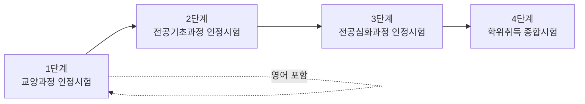
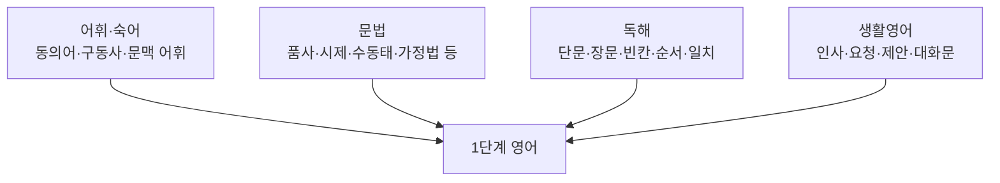

<Callout type="info">
  **이번 문서의 목표:** 독학사 제도 전체에서 1단계가 차지하는 위치, 1단계 영어 시험의 형식(문항 수·시간·객관식 4지선다), 출제 영역(어휘·문법·독해·생활영어)의 비중, 합격 기준과 채점 방식을 이해해서 이후 27편의 학습 순서를 스스로 설계할 수 있게 한다.
</Callout>

## 독학사 제도와 1단계의 위치

> **쉽게 말하면:** 1단계는 대학교 1~2학년이 듣는 교양 과목을 시험만으로 인정받는 단계다.

독학사(독학에 의한 학위취득시험)의 정식 명칭은 **독학학위제**이며, 국가평생교육진흥원(National Institute for Lifelong Education, 국가가 평생교육을 관리하기 위해 만든 기관)이 주관하는 국가시험이다. 대학에 다니지 않고도 시험을 통과하면 학점을 인정받아 학위까지 취득할 수 있는 제도로, 전체 과정은 4단계로 이루어진다.

- **1단계 교양과정 인정시험**: 전공과 무관하게 대학 1~2학년이 공통으로 듣는 교양 수준. **영어는 이 단계의 필수 과목 중 하나**다.
- **2단계 전공기초과정 인정시험**: 전공에 들어가기 위한 기초 과목들.
- **3단계 전공심화과정 인정시험**: 전공을 실무·이론 양쪽에서 깊이 있게 다루는 과목들.
- **4단계 학위취득 종합시험**: 여러 전공과목을 종합해 평가하는 마지막 관문.

1단계는 특정 전공을 정하지 않아도 응시할 수 있고, 국어·영어를 포함한 여러 교양 과목 중 일정 개수를 선택해 합격하면 다음 단계로 넘어갈 자격이 생긴다. 그래서 1단계 영어는 "전공 영어"가 아니라 **대학 신입생 수준의 일반 교양 영어**를 목표로 한다. 문학 감상이나 전공 논문 독해가 아니라, 품사·시제 같은 기본 문법 체계를 정확히 알고 짧고 명확한 지문을 읽어낼 수 있는가를 확인한다.

<Callout type="warning">
  1단계 응시에 필요한 학력 조건, 선택 가능한 교양 과목 목록, 연간 시행 횟수는 국가평생교육진흥원의 **최신 공고를 확인해야 한다.** 이 문서는 학습 전략에 필요한 구조적 이해만 다룬다.
</Callout>

## 1단계 영어 시험의 형식

> **쉽게 말하면:** 1단계 영어는 듣기·말하기 없이, 지문을 읽고 4개 중 답 하나를 고르는 시험이다.

1단계를 포함한 독학사 1·2과정은 **객관식 4지선다형**으로만 출제된다는 점이 제도 개편 이후의 공통된 특징이다. 즉 단답형이나 서술형이 섞이는 3·4단계와 달리, 1단계 영어는 처음부터 끝까지 보기 4개 중 하나를 고르는 형식이다.

| 항목 | 일반적인 형식 | 비고 |
|------|--------------|------|
| 문항 형식 | 객관식 4지선다형 | 단답·서술형 없음 |
| 문항 수 | 과목당 다수(보통 40문항 내외로 알려짐) | 회차마다 달라질 수 있음 |
| 시험 시간 | 과목당 정해진 시간 배분 | 회차·공고에 따라 다름 |
| 만점 | 100점 | 배점은 문항별로 다를 수 있음 |
| 응시 방식 | 지필고사(오프라인) | 온라인 응시 여부는 공고 확인 |

<Callout type="warning">
  문항 수·시험 시간·배점 배분은 회차마다 조정될 수 있으므로 숫자를 암기 대상으로 삼지 말고, **응시 회차의 공식 공고에서 최종 확인**해야 한다. 이 표는 시험이 어떤 "틀"로 짜여 있는지 감을 잡기 위한 참고용이다.
</Callout>

문항 형식이 객관식 4지선다형 하나로 고정되어 있다는 사실 자체는 학습 전략에 큰 영향을 준다. 서술형이 없으므로 용어를 완벽한 문장으로 재구성하는 연습보다, **보기 4개 중 정답이 아닌 3개를 왜 배제해야 하는지 설명할 수 있는 능력**이 더 중요해진다. 이 시리즈의 모든 문법·어휘·독해 편이 정답 설명뿐 아니라 오답 각각의 이유를 함께 적는 이유가 여기에 있다.

## 출제 영역과 비율: 어휘·문법·독해·생활영어

> **쉽게 말하면:** 1단계 영어는 크게 네 영역(어휘, 문법, 독해, 생활영어)에서 골고루 나온다.

독학사 1단계 영어의 출제기준은 보통 다음 네 영역으로 나뉜다고 알려져 있다.

- **어휘·숙어**: 단어의 뜻을 아는 것을 넘어, 문맥 속에서 알맞은 단어를 고르거나 동의어·반의어를 구별하는 유형이 중심이다.
- **문법**: 품사, 시제, 조동사, 수동태, 가정법, 관계사, 접속사, 비교, 일치·도치 등 학교 문법 전 범위를 다룬다. 자세한 범위 지도는 다음 편(02편)에서 다룬다.
- **독해**: 짧은 지문에서 세부 정보를 찾는 문제부터, 긴 지문에서 글의 흐름·순서·빈칸을 추론하는 문제까지 난이도가 다양하다.
- **생활영어**: 일상 대화문에서 빈칸에 알맞은 표현을 고르거나, 대화의 의도(제안·거절·감사 등)를 파악하는 유형이다.

<Callout type="warning">
  네 영역의 정확한 문항 배분 비율은 회차마다 조금씩 달라질 수 있다. 이 시리즈는 여러 회차에서 공통으로 확인되는 비중(어휘·문법이 절반 이상, 독해가 그다음, 생활영어가 가장 적은 편)을 참고해 목차를 짰지만, **정확한 숫자는 공고 확인 필요**하다.
</Callout>

네 영역은 서로 완전히 분리되어 있지 않다. 예를 들어 독해 지문 안에도 문법적으로 정확한 문장 구조 파악이 필요하고, 어휘 문제의 보기 문장 자체가 짧은 독해 지문 역할을 하기도 한다. 그래서 이 시리즈는 06~15편에서 문법을, 16~17편에서 어휘를, 18~19편에서 생활영어를, 20~23편에서 독해와 어법·영작형 문제를 각각 깊이 다루되, 뒤로 갈수록 앞의 영역을 전제로 삼아 통합하는 구조로 설계했다.

## 합격 기준과 채점 방식

> **쉽게 말하면:** 한 과목에서 100점 만점에 60점 이상을 받으면 그 과목은 합격이다.

독학사 1·2과정은 과목별 **절대평가**로 알려져 있다. 즉 다른 응시자와 순위를 다투는 상대평가가 아니라, 정해진 기준 점수(보통 100점 만점에 60점 이상)를 넘기면 해당 과목이 합격 처리되는 방식이다. 이는 다음과 같은 학습 전략상 의미를 가진다.

- **만점을 노릴 필요가 없다.** 60점 이상만 확보하면 되므로, 확실히 아는 유형에서 실점을 줄이는 것이 고득점을 노리다 시간을 낭비하는 것보다 효율적이다.
- **과목마다 독립적으로 채점된다.** 영어에서 아주 높은 점수를 받아도 다른 과목의 부족한 점수를 상쇄해주지 않는 것이 일반적이므로, 영어만 따로 60점을 넘기는 것을 목표로 삼아야 한다.
- **오답 감점은 없고 정답 개수만 채점되는 방식이 일반적**이라, 확신이 없는 문항이라도 답을 비워두기보다는 소거법으로 가능성이 높은 보기를 선택하는 편이 유리하다.

<Callout type="warning">
  합격 기준 점수, 과목별 채점 방식(오답 감점 여부 포함), 재응시·부분 합격 인정 규정은 개정될 수 있으므로 **응시 회차의 공식 공고로 반드시 재확인**해야 한다.
</Callout>

## 이 시리즈의 학습 전략 프레임

<Steps>
1. **선행 5편(01~05편)으로 지도를 그린다**: 이번 편에서 시험 구조를 잡았다면, 02편에서 문법 전체 범위, 03편에서 독해 기본기, 04편에서 어휘 학습 전략, 05편에서 생활영어 개관을 훑어 "무엇을 얼마나 공부해야 하는지" 미리 감을 잡는다.
2. **문법 10편(06~15편)을 순서대로 읽는다**: 품사에서 시작해 동사 중심 구조(시제·조동사·수동태·가정법)를 거쳐 문장 구조(관계사·접속사·비교·일치·도치)로 이어지는 흐름을 어기지 않는다.
3. **어휘·생활영어(16~19편)를 문법과 병행한다**: 문법을 다 끝낸 뒤에 몰아서 외우기보다, 매일 조금씩 병행하는 편이 장기 기억에 유리하다.
4. **독해·유형(20~23편)에서 앞의 지식을 통합한다**: 독해 지문 속에서 문법·어휘가 어떻게 함정으로 작동하는지 확인한다.
5. **기출·모의(25~28편)로 실전 감각을 점검한다**: 시간을 재고 풀어, 이해와 실전 사이의 간극을 좁힌다.
</Steps>

## 자주 틀리는 점

- **1단계 영어를 수능·토익처럼 준비**: 1단계는 대학 교양 수준의 기본 문법·독해를 확인하는 시험이다. 수능·토익의 고난도 어휘·긴 지문 전략을 그대로 가져오면 시간 배분이 어긋난다.
- **만점을 목표로 과도하게 심화 학습**: 절대평가 60점 기준이므로, 지나치게 지엽적인 문법 예외까지 파고들기보다 자주 나오는 함정을 정확히 잡는 것이 효율적이다.
- **문항 수·시간을 과거 후기로만 확정**: 회차마다 숫자가 달라질 수 있으므로 최신 공고를 확인하지 않고 옛 정보로 시간 배분 연습을 하면 실전에서 당황할 수 있다.
- **네 영역을 따로따로 암기**: 어휘·문법·독해·생활영어는 서로 얽혀 있다. 독해 지문 안의 문법 오류를 찾는 연습처럼 영역을 넘나드는 통합 연습(24편)이 필요하다.

## 핵심 정리

- 독학사는 4단계로 구성되며, 1단계는 전공과 무관한 교양과정 인정시험이고 영어가 필수 과목 중 하나다.
- 1단계 영어는 듣기·말하기 없이 객관식 4지선다형으로만 출제된다.
- 출제 영역은 어휘·숙어, 문법, 독해, 생활영어 네 축으로 나뉘며 서로 얽혀 있어 통합 학습이 필요하다.
- 합격 기준은 과목별 절대평가(보통 100점 만점 60점 이상)로 알려져 있으며, 정확한 수치는 회차 공고로 확인해야 한다.
- 학습은 선행 개관(01~05편) → 문법(06~15편) → 어휘·생활영어(16~19편) → 독해·통합(20~24편) → 기출·모의(25~28편) 순으로 진행한다.

## 마무리 복습

<Quiz
  questionNumber={1}
  question="독학사 제도에서 1단계 영어가 속하는 과정은 무엇인가?"
  options={['전공기초과정 인정시험', '교양과정 인정시험', '전공심화과정 인정시험', '학위취득 종합시험']}
  correctAnswer={2}
  explanation="1단계는 전공과 무관한 대학 1~2학년 수준의 교양과정 인정시험이며, 영어는 이 단계의 필수 과목 중 하나다."
  optionExplanations={['전공기초과정은 2단계로 특정 전공에 들어가기 위한 기초 과목들이다.', '정답. 1단계는 교양과정 인정시험이다.', '전공심화과정은 3단계로 전공을 깊이 다룬다.', '학위취득 종합시험은 4단계로 여러 전공과목을 종합 평가한다.']}
/>

<Quiz
  questionNumber={2}
  question="독학사 1단계 영어 시험의 문항 형식에 대한 설명으로 옳은 것은?"
  options={['단답형과 서술형만 출제된다', '듣기 평가가 포함된다', '객관식 4지선다형으로만 출제된다', '말하기 실기가 포함된다']}
  correctAnswer={3}
  explanation="1단계를 포함한 독학사 1·2과정은 단답·서술형 없이 객관식 4지선다형으로만 출제되는 것이 공통된 특징이다."
  optionExplanations={['단답·서술형은 3·4단계에서 나타날 수 있는 형식이며 1단계에는 해당하지 않는다.', '1단계 영어에는 듣기 평가가 포함되지 않는다.', '정답. 1단계는 객관식 4지선다형으로만 출제된다.', '말하기 실기는 이 시험의 범위에 포함되지 않는다.']}
/>

<Quiz
  questionNumber={3}
  question="독학사 1단계 영어의 출제 영역으로 보기 어려운 것은?"
  options={['어휘·숙어', '문법', '독해', '전공 논문 작성법']}
  correctAnswer={4}
  explanation="1단계 영어의 출제 영역은 어휘·숙어, 문법, 독해, 생활영어 네 축이며 전공 논문 작성법은 이 시험의 범위가 아니다."
  optionExplanations={['어휘·숙어는 출제 영역 중 하나다.', '문법은 출제 영역 중 하나다.', '독해는 출제 영역 중 하나다.', '정답. 전공 논문 작성법은 1단계 영어의 범위(제외 항목)에 해당하지 않는다.']}
/>

<Quiz
  questionNumber={4}
  question="독학사 1·2과정의 채점 방식에 대한 설명으로 가장 적절한 것은?"
  options={['다른 응시자와 순위를 겨루는 상대평가다', '과목별로 정해진 기준 점수를 넘기면 합격하는 절대평가로 알려져 있다', '전 과목 평균만으로 합격 여부를 정한다', '가장 낮은 점수를 받은 과목은 자동으로 재응시된다']}
  correctAnswer={2}
  explanation="독학사 1·2과정은 과목별로 정해진 기준 점수(보통 100점 만점 60점 이상)를 넘기면 합격 처리되는 절대평가 방식으로 알려져 있다."
  optionExplanations={['상대평가가 아니라 절대평가 방식으로 알려져 있다.', '정답. 과목별 절대평가가 일반적인 채점 방식이다.', '과목은 개별적으로 채점되는 것이 일반적이다.', '재응시 여부는 자동 처리되지 않으며 별도 절차를 따른다.']}
/>

<Quiz
  questionNumber={5}
  question="문항 수·시험 시간과 같은 시험 운영 정보에 대해 이 시리즈가 취하는 태도로 옳은 것은?"
  options={['한 번 확인한 숫자를 모든 회차에 그대로 적용한다', '과거 수험생 후기의 숫자만 신뢰한다', '숫자는 회차마다 달라질 수 있으므로 응시 회차의 공식 공고를 확인하라고 안내한다', '숫자는 학습에 영향이 없으므로 언급하지 않는다']}
  correctAnswer={3}
  explanation="시험 운영에 관한 구체적 수치는 회차마다 달라질 수 있으므로, 이 시리즈는 참고용 숫자를 제시하되 응시 회차의 공식 공고 확인을 반복해서 안내한다."
  optionExplanations={['규정이 개정될 수 있으므로 매 회차 다시 확인해야 한다.', '후기는 참고 자료일 뿐 공식 정보가 아니다.', '정답. 공식 공고 확인을 안내하는 것이 가장 안전하다.', '문항 수와 시험 시간은 풀이 속도 배분에 직접 영향을 준다.']}
/>

<Quiz
  questionNumber={6}
  question="1단계 영어의 성격에 대한 설명으로 옳지 않은 것은?"
  options={['대학 신입생 수준의 일반 교양 영어를 목표로 한다', '전공 논문 독해나 문학 감상을 주로 다룬다', '기본 문법 체계를 정확히 아는지를 확인한다', '짧고 명확한 지문을 읽어내는 능력을 확인한다']}
  correctAnswer={2}
  explanation="1단계 영어는 전공 영어가 아니라 대학 교양 수준의 기본 문법과 독해를 확인하는 시험이므로, 전공 논문 독해나 문학 감상은 이 시험의 목표가 아니다."
  optionExplanations={['1단계 영어는 대학 신입생 수준의 교양 영어를 목표로 하는 것이 맞다.', '정답. 전공 논문 독해와 문학 감상은 1단계 영어의 목표가 아니다.', '기본 문법 체계 확인은 1단계 영어의 핵심 목표다.', '짧고 명확한 지문 독해 능력 확인도 1단계 영어의 목표에 해당한다.']}
/>

<Quiz
  questionNumber={7}
  question="이 시리즈가 권장하는 학습 순서로 가장 적절한 것은?"
  options={['기출·모의부터 풀어보고 부족한 부분만 나중에 문법으로 보충한다', '선행 개관 → 문법 → 어휘·생활영어 → 독해·통합 → 기출·모의 순으로 진행한다', '어휘를 모두 암기한 뒤에만 문법을 시작한다', '독해 지문을 먼저 대량으로 읽고 문법은 생략한다']}
  correctAnswer={2}
  explanation="이 시리즈는 선행 개관(01~05편)으로 지도를 그린 뒤 문법(06~15편), 어휘·생활영어(16~19편), 독해·통합(20~24편), 기출·모의(25~28편) 순으로 진행하도록 설계되어 있다."
  optionExplanations={['기출부터 풀면 기초 개념 없이 오답 이유를 이해하기 어렵다.', '정답. 개관에서 시작해 문법, 어휘·생활영어, 독해·통합, 기출·모의로 이어지는 순서다.', '어휘 암기를 문법보다 반드시 먼저 끝내야 한다는 규칙은 없으며 병행이 권장된다.', '독해는 문법·어휘 지식을 전제로 하므로 문법을 생략하면 함정을 놓치기 쉽다.']}
/>

## 참고 자료

- [국가평생교육진흥원 독학학위제](https://bdes.nile.or.kr)
