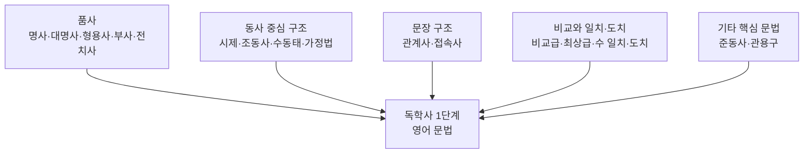

<Callout type="info">
  **이번 문서의 목표:** 독학사 1단계 영어 문법이 다루는 전체 범위(품사부터 기타 어법까지)를 한 장의 지도처럼 파악하고, 어느 파트가 자주 나오고 어느 순서로 공부해야 효율적인지 스스로 판단할 수 있게 한다.
</Callout>

## 왜 범위부터 지도로 그려야 하는가

문법 공부를 시작할 때 가장 흔한 실수는 손에 잡히는 교재의 첫 장부터 무작정 읽어 나가는 것이다. 그렇게 하면 시제 파트를 절반쯤 읽다가 조동사 예외가 궁금해지고, 관계사 파트에서 접속사와 헷갈리는 부분이 나와도 뒤로 미루다가 결국 "어디까지 봤는지" 스스로 잃어버리는 일이 생긴다. 독학사 1단계 영어처럼 **범위가 명확히 정해진 시험**은 이 문제를 피하기가 오히려 쉽다. 시험이 요구하는 문법 항목을 먼저 지도로 그려 놓으면, 그 지도 위에서 지금 배우는 내용이 전체의 몇 번째 칸을 채우고 있는지 항상 알 수 있기 때문이다.

> **쉽게 말하면:** 이번 편은 문법을 "가르치는" 편이 아니라, 앞으로 06~15편에서 배울 내용의 목차를 미리 지도로 보여주는 편이다.

01편에서 확인했듯 1단계 영어는 어휘·문법·독해·생활영어 네 영역으로 나뉘고, 이 중 문법은 단독 문항(어법 고르기)으로도 출제되고 독해·어휘 문제 안에 숨어서도 출제된다. 그래서 문법 범위를 정확히 아는 것은 문법 단원 자체의 점수뿐 아니라 다른 영역의 점수에도 영향을 준다.

## 독학사 1단계 영어 문법의 전체 범위

독학사 1단계 영어 문법은 크게 다섯 덩어리로 나눌 수 있다. 이 시리즈의 06~15편은 이 다섯 덩어리를 순서대로 다룬다.

| 덩어리 | 포함 항목 | 해당 편 | 성격 |
|--------|-----------|---------|------|
| ① 품사 | 명사·대명사·형용사·부사·전치사의 자리 규칙, 품사 전환(파생어) | 06편 | 모든 문법의 기초. 자리만 알면 풀리는 문제가 많다 |
| ② 동사 중심 구조 | 시제, 조동사, 수동태, 가정법 | 07–10편 | 동사 하나의 형태가 시제·태·법을 동시에 결정하므로 서로 얽혀 있다 |
| ③ 문장 구조 | 관계사(관계대명사·관계부사), 접속사·접속부사 | 11–12편 | 절과 절을 잇는 규칙. 독해 지문의 긴 문장을 끊어 읽는 데 직결된다 |
| ④ 비교와 일치·도치 | 비교급·최상급·비교 구문, 수 일치, 시제 일치, 도치 | 13–14편 | 문장 전체의 형태를 좌우하는 "짝 맞추기" 규칙 |
| ⑤ 기타 핵심 문법 | to부정사·동명사·분사(준동사), 상용 관용구 | 15편 | 앞 네 덩어리에 깔끔히 들어가지 않지만 어법 문제에 자주 등장 |

이 다섯 덩어리는 독립적이지 않다. 예를 들어 가정법(④ 동사 중심 구조에 속함)을 정확히 쓰려면 시제 지식이 필요하고, 관계사 문제를 풀려면 명사(① 품사)의 격 개념이 먼저 잡혀 있어야 한다. 그래서 목차 순서(06 → 15편)를 건너뛰지 않고 따라가는 것이 중요하다.

## 파트별 출제 빈도: 어디에 시간을 더 쓸까

<Callout type="warning">
  아래 빈도는 여러 회차의 기출·수험서 구성에서 공통적으로 확인되는 경향을 정리한 참고용 순위이며, 정확한 문항 배분은 회차 공고로 확인해야 한다.
</Callout>

| 순위 | 파트 | 출제 경향 | 학습 우선순위 |
|------|------|-----------|----------------|
| 1 | 동사 중심 구조(시제·조동사·수동태·가정법) | 어법 고르기 문항에서 가장 자주 등장. 독해 지문의 문장 구조 파악에도 직결 | 최우선 |
| 2 | 품사(명사·대명사·형용사·부사·전치사) | 단독 문항으로도 나오고, 다른 모든 문법 문제의 기초로 깔려 있음 | 최우선 |
| 3 | 문장 구조(관계사·접속사) | 장문 독해와 결합해 출제되는 빈도가 높음 | 우선 |
| 4 | 비교와 일치·도치 | 단독 문항 빈도는 상대적으로 낮지만 "옳지 않은 것 고르기" 유형에 자주 섞여 나옴 | 중간 |
| 5 | 기타 핵심 문법(준동사·관용구) | 어법 오류 찾기·영작형 객관식(23편)에서 자주 활용 | 중간 |

이 표를 볼 때 주의할 점이 하나 있다. 순위가 낮다고 해서 "안 나온다"는 뜻이 아니라 "상대적으로 문항 수가 적다"는 뜻이다. 절대평가 60점 기준(01편 참고)에서는 어느 한 파트를 완전히 포기하면 그 파트에서 나오는 문항을 전부 잃는 셈이 되므로, 우선순위는 공부 순서를 정하는 기준으로만 쓰고 범위 자체를 빼먹지는 않아야 한다.

## 문법 항목별 미리 보기 예문

각 항목이 실제로 어떤 문장에서 문제가 되는지, 06~15편에서 다룰 예문을 하나씩 미리 살펴보자. 지금 단계에서는 "이런 게 있구나" 정도로 감만 잡으면 충분하다.

- **품사**: The manager gave clear instructions to the new employees.
  그 관리자는 신입 직원들에게 명확한 지시를 내렸다.
  (clear는 명사 instructions를 꾸미는 형용사 자리)

- **시제**: She has lived in this city since 2019.
  그녀는 2019년부터 이 도시에 살고 있다.
  (since와 함께 쓰이는 현재완료 시제)

- **수동태**: The bridge was completed after three years of construction.
  그 다리는 3년의 공사 끝에 완공되었다.
  (동작을 받는 대상인 bridge가 주어이므로 수동태)

- **가정법**: If he had studied harder, he would have passed the exam.
  그가 더 열심히 공부했더라면, 시험에 합격했을 것이다.
  (과거 사실의 반대를 가정하는 가정법 과거완료)

- **관계사**: The book that she recommended changed my perspective.
  그녀가 추천한 그 책은 나의 관점을 바꾸었다.
  (선행사 book을 꾸미는 관계대명사절)

- **비교**: This method is far more efficient than the previous one.
  이 방법은 이전 방법보다 훨씬 더 효율적이다.
  (비교급 강조 부사 far와 함께 쓰인 비교 구문)

- **일치·도치**: Never have I seen such a beautiful sunset.
  나는 그렇게 아름다운 노을을 본 적이 없다.
  (부정어 Never가 문두에 나와 주어·동사가 도치된 구조)

## 문법 학습 로드맵

<Steps>
1. **06편 품사**로 시작해 명사·대명사·형용사·부사·전치사가 오는 자리를 먼저 확실히 잡는다. 이후 모든 편의 예문을 읽을 때 이 자리 감각을 계속 사용한다.
2. **07~10편 동사 중심 구조**를 순서대로 읽는다. 시제(07) → 조동사(08) → 수동태(09) → 가정법(10) 순서는 뒤로 갈수록 앞의 개념을 전제로 삼으므로 건너뛰지 않는다.
3. **11~12편 문장 구조**에서 관계사와 접속사를 정리하며, 긴 문장을 절 단위로 끊어 읽는 연습을 시작한다. 이 습관은 03편에서 다룰 독해 전략과 바로 연결된다.
4. **13~14편 비교와 일치·도치**를 읽으며 "짝이 맞는가"를 확인하는 시각을 기른다.
5. **15편 기타 핵심 문법**으로 준동사·관용구를 정리하고, 앞의 열 개 편에서 배운 항목이 실제 어법 오류 찾기 문제(23편)에서 어떻게 섞여 나오는지 대비한다.
</Steps>

## 자주 틀리는 점

- **좋아하는 파트만 반복 학습**: 가정법처럼 규칙이 뚜렷한 파트만 반복하고 전치사처럼 암기가 필요한 파트를 미루면, 실제 시험에서 편중된 점수를 받는다.
- **한 편을 완벽히 끝내야 다음 편으로 간다는 강박**: 문법 항목은 서로 얽혀 있어 뒤 편을 배우다 앞 편의 개념이 다시 필요해지는 경우가 많다. 완벽을 기다리기보다 전체를 한 바퀴 돈 뒤 다시 세부를 채우는 편이 효율적이다.
- **출제 빈도표를 암기 순서로 오해**: 빈도표는 시간 배분 참고용이지, 낮은 순위 항목을 아예 공부하지 않아도 된다는 뜻이 아니다.
- **문법을 어휘·독해와 분리해서 생각**: 관계사·접속사는 특히 장문 독해(21편)와 직결되므로, 문법 편을 읽을 때부터 "이 규칙이 독해에서 어떻게 쓰일까"를 함께 생각하는 것이 좋다.

## 핵심 정리

- 독학사 1단계 영어 문법은 품사, 동사 중심 구조(시제·조동사·수동태·가정법), 문장 구조(관계사·접속사), 비교와 일치·도치, 기타 핵심 문법(준동사·관용구) 다섯 덩어리로 나뉜다.
- 이 시리즈에서는 06~15편이 이 다섯 덩어리를 순서대로 깊이 다루며, 뒤 편은 앞 편의 개념을 전제로 한다.
- 동사 중심 구조와 품사가 출제 빈도가 가장 높다고 알려져 있지만, 다른 파트도 어법 오류 찾기·독해 문제에 섞여 나오므로 범위 전체를 학습해야 한다.
- 문법은 어휘·독해와 분리된 별개의 영역이 아니라, 특히 관계사·접속사를 통해 장문 독해와 직접 연결된다.

## 마무리 복습

<Quiz
  questionNumber={1}
  question="이 시리즈가 독학사 1단계 영어 문법을 분류하는 다섯 덩어리에 해당하지 않는 것은?"
  options={['품사', '동사 중심 구조', '문장 구조', '전공 논문 작성법']}
  correctAnswer={4}
  explanation="독학사 1단계 영어 문법은 품사, 동사 중심 구조, 문장 구조, 비교와 일치 및 도치, 기타 핵심 문법 다섯 덩어리로 분류되며 전공 논문 작성법은 포함되지 않는다."
  optionExplanations={['품사는 다섯 덩어리 중 하나다.', '동사 중심 구조는 다섯 덩어리 중 하나다.', '문장 구조는 다섯 덩어리 중 하나다.', '정답. 전공 논문 작성법은 1단계 영어의 범위 자체에 포함되지 않는다.']}
/>

<Quiz
  questionNumber={2}
  question="시제, 조동사, 수동태, 가정법이 함께 묶여 동사 중심 구조로 분류되는 이유로 가장 적절한 것은?"
  options={['모두 명사의 격 변화를 다루기 때문이다', '동사 하나의 형태가 시제·태·법을 동시에 결정하며 서로 얽혀 있기 때문이다', '전부 문장 맨 앞에만 오는 표현이기 때문이다', '독해 문제에는 전혀 등장하지 않기 때문이다']}
  correctAnswer={2}
  explanation="동사 하나의 형태 변화가 시제·태·법을 동시에 반영하므로, 이 네 항목은 서로 얽혀 있어 함께 학습해야 효율적이다."
  optionExplanations={['이 네 항목은 명사의 격이 아니라 동사의 형태 변화를 다룬다.', '정답. 동사의 형태가 시제·태·법을 동시에 결정하기 때문에 함께 묶인다.', '가정법 도치처럼 문두에 오는 경우도 있지만 이것이 함께 묶이는 핵심 이유는 아니다.', '동사 중심 구조는 독해 지문의 문장 구조 파악과도 직결된다.']}
/>

<Quiz
  questionNumber={3}
  question="다음 중 관계사·접속사가 속하는 덩어리와 이후 가장 밀접하게 연결되는 편은?"
  options={['16편 어휘', '18편 생활영어', '21편 장문 독해', '05편 생활영어 개관']}
  correctAnswer={3}
  explanation="관계사·접속사는 절과 절을 잇는 규칙으로, 긴 문장을 끊어 읽는 장문 독해(21편)와 가장 직접적으로 연결된다."
  optionExplanations={['16편 어휘는 구동사·파생어를 다루며 관계사·접속사와 직접 연결되지는 않는다.', '18편 생활영어는 대화 표현을 다루는 편으로 문장 구조와는 결이 다르다.', '정답. 절을 잇는 규칙은 긴 지문을 끊어 읽어야 하는 장문 독해에 직결된다.', '05편은 생활영어 개관으로 문장 구조와는 관련이 적다.']}
/>

<Quiz
  questionNumber={4}
  question="출제 빈도표에서 순위가 낮은 파트에 대한 올바른 태도는?"
  options={['시험에 나오지 않으므로 학습을 생략한다', '순위가 낮을수록 더 어려운 내용이므로 가장 먼저 학습한다', '상대적으로 문항 수가 적다는 뜻일 뿐이므로 학습 범위에서 제외하지 않는다', '순위표는 매 회차 동일하게 고정되어 있으므로 암기만 하면 된다']}
  correctAnswer={3}
  explanation="출제 빈도 순위는 시간 배분의 참고용일 뿐이며, 절대평가 구조상 낮은 순위 항목도 학습 범위에서 제외해서는 안 된다."
  optionExplanations={['순위가 낮다는 것이 출제되지 않는다는 뜻은 아니다.', '순위와 난이도는 별개의 기준이다.', '정답. 상대적 빈도일 뿐이므로 범위 자체를 빼먹지 않아야 한다.', '문항 배분은 회차마다 달라질 수 있으므로 고정된 값으로 암기해서는 안 된다.']}
/>

<Quiz
  questionNumber={5}
  question="Never have I seen such a beautiful sunset 문장에서 나타나는 문법 현상은?"
  options={['가정법 과거완료', '관계대명사 생략', '부정어 도치', '수동태']}
  correctAnswer={3}
  explanation="부정어 Never가 문장 맨 앞에 나오면서 주어와 동사(I have)의 순서가 바뀌어 have I가 되는 부정어 도치 구조다."
  optionExplanations={['가정법 과거완료는 If had p.p, would have p.p 형태로 이 문장에는 나타나지 않는다.', '이 문장에는 관계대명사절이 없다.', '정답. Never가 문두에 나오면서 주어·동사가 도치되었다.', '동작을 받는 대상이 주어로 온 구조가 아니므로 수동태가 아니다.']}
/>

<Quiz
  questionNumber={6}
  question="이 시리즈가 06~15편의 학습 순서를 건너뛰지 말라고 권장하는 이유로 가장 적절한 것은?"
  options={['각 편의 분량이 동일하기 때문이다', '뒤 편의 개념이 앞 편의 개념을 전제로 하는 경우가 많기 때문이다', '기출문제가 편 순서대로 출제되기 때문이다', '순서를 바꾸면 채점 방식이 달라지기 때문이다']}
  correctAnswer={2}
  explanation="예를 들어 가정법은 시제 지식을, 관계사는 명사의 격 개념을 전제로 하므로, 뒤 편의 개념이 앞 편의 개념 위에 쌓이는 구조다."
  optionExplanations={['편 순서 권장은 분량과는 관련이 없다.', '정답. 뒤 편이 앞 편의 개념을 전제로 삼는 경우가 많아 순서가 중요하다.', '기출문제의 출제 순서와 학습 순서는 별개다.', '학습 순서는 채점 방식과 무관하다.']}
/>

## 참고 자료

- [국가평생교육진흥원 독학학위제](https://bdes.nile.or.kr)
- [Cambridge Dictionary](https://dictionary.cambridge.org)
