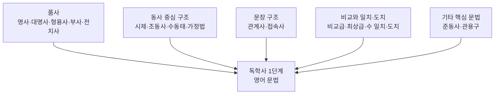

## 왜 범위부터 지도로 그려야 하는가

문법 공부를 시작할 때 가장 흔한 실수는 손에 잡히는 교재의 첫 장부터 무작정 읽어 나가는 것이다. 독학사 1단계 영어처럼 **범위가 명확히 정해진 시험**은 이 문제를 피하기가 오히려 쉽다.

1단계 영어는 어휘·문법·독해·생활영어 네 영역으로 나뉘고, 이 중 문법은 단독 문항(어법 고르기)으로도 출제되고 독해·어휘 문제 안에 숨어서도 출제된다. 그래서 문법 범위를 정확히 아는 것은 문법 단원 자체의 점수뿐 아니라 다른 영역의 점수에도 영향을 준다.

## 독학사 1단계 영어 문법의 전체 범위

독학사 1단계 영어 문법은 크게 다섯 덩어리로 나눌 수 있다. 이 시리즈의 05~14편은 이 다섯 덩어리를 순서대로 다룬다.

```mermaid
graph TB
  A[품사<br/>명사·대명사·형용사·부사·전치사] --> F[독학사 1단계<br/>영어 문법]
  B[동사 중심 구조<br/>시제·조동사·수동태·가정법] --> F
  C[문장 구조<br/>관계사·접속사] --> F
  D[비교와 일치·도치<br/>비교급·최상급·수 일치·도치] --> F
  E[기타 핵심 문법<br/>준동사·관용구] --> F
```

| 덩어리 | 포함 항목 | 해당 편 | 성격 |
|--------|-----------|---------|------|
| ① 품사 | 명사·대명사·형용사·부사·전치사의 자리 규칙, 품사 전환(파생어) | 05편 | 모든 문법의 기초. 자리만 알면 풀리는 문제가 많다 |
| ② 동사 중심 구조 | 시제, 조동사, 수동태, 가정법 | 06–09편 | 동사 하나의 형태가 시제·태·법을 동시에 결정하므로 서로 얽혀 있다 |
| ③ 문장 구조 | 관계사(관계대명사·관계부사), 접속사·접속부사 | 10–11편 | 절과 절을 잇는 규칙. 독해 지문의 긴 문장을 끊어 읽는 데 직결된다 |
| ④ 비교와 일치·도치 | 비교급·최상급·비교 구문, 수 일치, 시제 일치, 도치 | 12–13편 | 문장 전체의 형태를 좌우하는 "짝 맞추기" 규칙 |
| ⑤ 기타 핵심 문법 | to부정사·동명사·분사(준동사), 상용 관용구 | 14편 | 앞 네 덩어리에 깔끔히 들어가지 않지만 어법 문제에 자주 등장 |

이 다섯 덩어리는 독립적이지 않다. 예를 들어 가정법(④ 동사 중심 구조에 속함)을 정확히 쓰려면 시제 지식이 필요하고, 관계사 문제를 풀려면 명사(① 품사)의 격 개념이 먼저 잡혀 있어야 한다. 그래서 목차 순서(06 → 14편)를 건너뛰지 않고 따라가는 것이 중요하다.

## 문법 항목별 미리 보기 예문

각 항목이 실제로 어떤 문장에서 문제가 되는지, 05~14편에서 다룰 예문을 하나씩 미리 살펴보자. 지금 단계에서는 "이런 게 있구나" 정도로 감만 잡으면 충분하다.

- **품사**: The manager gave clear instructions to the new employees.
그 관리자는 신입 직원들에게 명확한 지시를 내렸다. (clear는 명사 instructions를 꾸미는 형용사 자리)

- **시제**: She has lived in this city since 2019.
그녀는 2019년부터 이 도시에 살고 있다. (since와 함께 쓰이는 현재완료 시제)

- **수동태**: The bridge was completed after three years of construction.
그 다리는 3년의 공사 끝에 완공되었다. (동작을 받는 대상인 bridge가 주어이므로 수동태)

- **가정법**: If he had studied harder, he would have passed the exam.
그가 더 열심히 공부했더라면, 시험에 합격했을 것이다. (과거 사실의 반대를 가정하는 가정법 과거완료)

- **관계사**: The book that she recommended changed my perspective.
그녀가 추천한 그 책은 나의 관점을 바꾸었다. (선행사 book을 꾸미는 관계대명사절)

- **비교**: This method is far more efficient than the previous one.
이 방법은 이전 방법보다 훨씬 더 효율적이다. (비교급 강조 부사 far와 함께 쓰인 비교 구문)

- **일치·도치**: Never have I seen such a beautiful sunset.
나는 그렇게 아름다운 노을을 본 적이 없다. (부정어 Never가 문두에 나와 주어·동사가 도치된 구조)

## 자주 틀리는 점

- **좋아하는 파트만 반복 학습**: 가정법처럼 규칙이 뚜렷한 파트만 반복하고 전치사처럼 암기가 필요한 파트를 미루면, 실제 시험에서 편중된 점수를 받는다.
- **한 편을 완벽히 끝내야 다음 편으로 간다는 강박**: 문법 항목은 서로 얽혀 있어 뒤 편을 배우다 앞 편의 개념이 다시 필요해지는 경우가 많다. 완벽을 기다리기보다 전체를 한 바퀴 돈 뒤 다시 세부를 채우는 편이 효율적이다.
- **출제 빈도표를 암기 순서로 오해**: 빈도표는 시간 배분 참고용이지, 낮은 순위 항목을 아예 공부하지 않아도 된다는 뜻이 아니다.
- **문법을 어휘·독해와 분리해서 생각**: 관계사·접속사는 특히 장문 독해(20편)와 직결되므로, 문법 편을 읽을 때부터 "이 규칙이 독해에서 어떻게 쓰일까"를 함께 생각하는 것이 좋다.

## 핵심 정리

- 독학사 1단계 영어 문법은 품사, 동사 중심 구조(시제·조동사·수동태·가정법), 문장 구조(관계사·접속사), 비교와 일치·도치, 기타 핵심 문법(준동사·관용구) 다섯 덩어리로 나뉜다.
- 이 시리즈에서는 05~14편이 이 다섯 덩어리를 순서대로 깊이 다루며, 뒤 편은 앞 편의 개념을 전제로 한다.
- 동사 중심 구조와 품사가 출제 빈도가 가장 높다고 알려져 있지만, 다른 파트도 어법 오류 찾기·독해 문제에 섞여 나오므로 범위 전체를 학습해야 한다.
- 문법은 어휘·독해와 분리된 별개의 영역이 아니라, 특히 관계사·접속사를 통해 장문 독해와 직접 연결된다.

## 마무리 복습

<Quiz
  questionNumber={1}
  question={"이 시리즈가 독학사 1단계 영어 문법을 분류하는 다섯 덩어리에 해당하지 않는 것은?"}
  options={["품사","동사 중심 구조","문장 구조","전공 논문 작성법"]}
  correctAnswer={4}
  explanation={"독학사 1단계 영어 문법은 품사, 동사 중심 구조, 문장 구조, 비교와 일치 및 도치, 기타 핵심 문법 다섯 덩어리로 분류되며 전공 논문 작성법은 포함되지 않는다."}
/>

<Quiz
  questionNumber={2}
  question={"시제, 조동사, 수동태, 가정법이 함께 묶여 동사 중심 구조로 분류되는 이유로 가장 적절한 것은?"}
  options={["모두 명사의 격 변화를 다루기 때문이다","동사 하나의 형태가 시제·태·법을 동시에 결정하며 서로 얽혀 있기 때문이다","전부 문장 맨 앞에만 오는 표현이기 때문이다","독해 문제에는 전혀 등장하지 않기 때문이다"]}
  correctAnswer={2}
  explanation={"동사 하나의 형태 변화가 시제·태·법을 동시에 반영하므로, 이 네 항목은 서로 얽혀 있어 함께 학습해야 효율적이다."}
/>

<Quiz
  questionNumber={3}
  question={"다음 중 관계사·접속사가 속하는 덩어리와 이후 가장 밀접하게 연결되는 편은?"}
  options={["15편 어휘","17편 생활영어","20편 장문 독해","04편 생활영어 개관"]}
  correctAnswer={3}
  explanation={"관계사·접속사는 절과 절을 잇는 규칙으로, 긴 문장을 끊어 읽는 장문 독해(20편)와 가장 직접적으로 연결된다."}
/>

## 참고 자료

- [국가평생교육진흥원 독학학위제](https://bdes.nile.or.kr)
- [Cambridge Dictionary](https://dictionary.cambridge.org)
