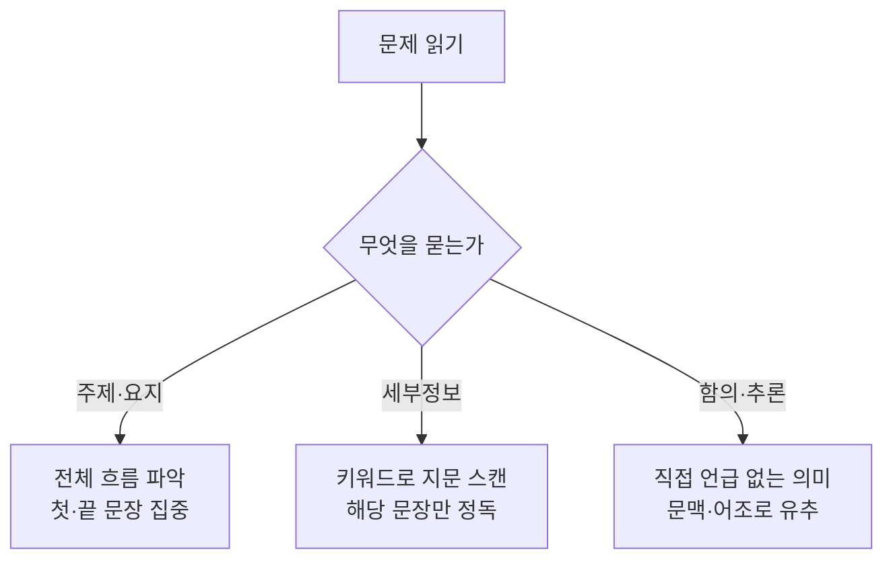

<Callout type="info">
  **이번 문서의 목표:** 지문을 처음부터 끝까지 해석하려 하지 않고 필요한 정보만 빠르게 찾아내는 독해의 기본 전략을 이해하고, 문장을 절·구 단위로 끊어 읽는 방법과 지문 유형(설명문·논설문·대화문)의 차이를 구별할 수 있게 한다.
</Callout>

## 왜 "다 읽지 않아도" 풀 수 있는가

완전 입문자가 독해 지문을 마주하면 가장 먼저 하는 행동은 첫 단어부터 마지막 단어까지 순서대로 하나하나 해석하는 것이다. 이 방법은 시간이 무제한이면 통하지만, 독학사 1단계 영어처럼 **한 시험 안에서 어휘·문법·독해·생활영어를 모두 풀어야 하는 시험**에서는 치명적이다. 지문 하나에 시간을 다 쓰면 뒤에 나오는 문법 문제를 풀 시간이 없어지기 때문이다.

> **쉽게 말하면:** 독해는 "전부 읽기"가 아니라 "질문이 요구하는 정보를 지문에서 찾아내기"다.

이번 편은 독해 지문 자체를 깊게 분석하는 편이 아니다. 실제 지문으로 문제를 푸는 훈련은 20~22편(단문·장문·빈칸 순서 유형)에서 다룬다. 여기서는 그 전에 반드시 갖추고 있어야 할 **기본기 세 가지**, 즉 (1) 지문을 읽는 기본 전략, (2) 문장을 절·구 단위로 끊어 읽는 법, (3) 지문 유형을 구별하는 눈을 지도처럼 정리한다.

## 기본 전략: 주제·요지·세부정보·함의를 구별하기

독해 문제는 지문에서 무엇을 묻는지에 따라 접근법이 완전히 달라진다. 질문 유형을 먼저 구별하지 않고 지문부터 읽으면, 필요 없는 부분까지 정독하느라 시간을 낭비하게 된다.

| 질문 유형 | 무엇을 찾는가 | 읽는 방법 |
|-----------|----------------|-----------|
| 주제(topic) · 요지(main idea) | 지문 전체를 요약하는 한 문장 | 첫 문장과 마지막 문장을 먼저 읽고, 반복되는 단어를 확인한다 |
| 세부정보(detail) | 지문에 직접 쓰여 있는 특정 사실 | 문제의 키워드를 지문에서 찾아(스캔) 그 문장만 정독한다 |
| 함의(implication) · 추론(inference) | 지문에 직접 나오지 않지만 문맥상 알 수 있는 내용 | 필자의 어조·문맥 단서를 근거로 판단하되, 지문에 없는 상식으로 넘겨짚지 않는다 |

이 세 유형을 구별하는 습관은 20편(단문 독해)과 21편(장문 독해)에서 실제 지문으로 훈련한다. 여기서는 "**질문을 먼저 읽고, 무엇을 찾을지 정한 뒤 지문으로 들어간다**"는 순서 자체를 습관으로 만드는 것이 목표다.

### 짧은 예시로 확인하기

다음은 세부정보 문제 유형을 보여주기 위해 새로 작성한 3문장짜리 예시 지문이다.

> The city library added a new reading room last month. The room is open only on weekends, and visitors must reserve a seat online in advance. Unlike the main hall, this room does not allow food or drinks.

한국어 해석: 시립 도서관은 지난달에 새로운 열람실을 추가했다. 이 열람실은 주말에만 운영되며, 방문객은 미리 온라인으로 좌석을 예약해야 한다. 본관과 달리 이 열람실에서는 음식과 음료가 허용되지 않는다.

만약 문제가 "새 열람실에 대한 설명으로 옳은 것은?"이라면, 전체를 다시 해석할 필요 없이 키워드(열람실, room)가 들어간 세 문장만 다시 확인하면 된다. 두 번째 문장에서 "주말에만"(only on weekends), "온라인 예약"(reserve a seat online)이라는 세부정보를 확인할 수 있고, 세 번째 문장에서 "음식·음료 불가"(does not allow food or drinks)를 확인할 수 있다. "본관처럼 음식을 먹을 수 있다"는 선택지가 있다면, unlike the main hall(본관과 달리)이라는 표현 하나로 바로 오답 처리할 수 있다.

## 문장 구조 파악: 절과 구로 끊어 읽기

장문 독해에서 학습자가 가장 자주 막히는 지점은 어려운 단어가 아니라 **긴 문장 하나를 어디서 끊어 읽어야 할지 모르는 것**이다. 영어 문장은 짧은 단위(절, 구)가 접속사나 관계사로 이어져 길어지는 구조를 가지므로, 이 이어지는 지점을 찾아내면 아무리 긴 문장도 짧은 단위로 쪼개 이해할 수 있다.

> **쉽게 말하면:** 긴 문장은 어려운 게 아니라, 짧은 문장 여러 개가 접속사·관계사로 붙어 있는 것뿐이다.

**절**(clause, 주어와 동사를 갖춘 단위)과 **구**(phrase, 주어와 동사 없이 두 단어 이상이 뭉친 단위)를 구별하는 것이 첫걸음이다. 절은 그 자체로 하나의 완전한 문장이 될 수 있지만, 구는 문장의 일부로만 쓰인다.

**예문**: Although the weather was cold, the students who had planned the trip decided to go hiking in the mountains.
비록 날씨가 추웠지만, 그 여행을 계획했던 학생들은 산으로 하이킹을 가기로 결정했다.

이 문장은 다음처럼 세 단위로 끊어 읽을 수 있다.

1. Although the weather was cold — 종속절(비록 날씨가 추웠지만): although라는 접속사가 이끄는 절
2. the students who had planned the trip — 주절의 주어 + 관계대명사절(그 여행을 계획했던 학생들은): who 이하가 students를 꾸민다
3. decided to go hiking in the mountains — 주절의 동사 이하(산으로 하이킹을 가기로 결정했다): in the mountains는 장소를 나타내는 전치사구

이렇게 끊어 읽으면 "누가 무엇을 했는가"(the students decided to go hiking)라는 핵심 골격이 먼저 보이고, although절과 who절은 그 골격에 붙은 부가 정보라는 것을 알 수 있다. 관계대명사·접속사의 세부 규칙은 11–12편에서 다루지만, 여기서는 "**골격(주어+동사)을 먼저 찾고, 나머지는 그 골격에 붙는 수식으로 본다**"는 읽기 습관 자체를 강조한다.

### 흔한 오류

접속사·관계사가 이끄는 절을 만나면 그 절 안의 동사를 문장 전체의 동사로 착각해 주어를 잘못 짝짓는 경우가 많다. 위 예문에서 who had planned the trip의 동사(had planned)를 문장 전체의 동사로 착각하면, "학생들이 계획했다"에서 해석이 끝나버려 뒤에 나오는 decided to go hiking(하이킹을 가기로 결정했다)이라는 진짜 핵심 정보를 놓치게 된다. 관계사절 안의 동사는 선행사를 꾸미는 역할만 하고, 문장 전체의 동사는 그 뒤에 따로 있다는 점을 항상 확인해야 한다.

## 지문 유형 개관: 설명문·논설문·대화문

독학사 1단계 영어 독해 지문은 성격이 다른 세 가지 유형으로 나눌 수 있고, 유형에 따라 "무엇을 먼저 볼지"가 달라진다.

| 지문 유형 | 목적 | 자주 나오는 신호 | 읽을 때 초점 |
|-----------|------|--------------------|----------------|
| 설명문(expository text) | 사실·정보를 객관적으로 전달 | 날짜·수치·기관명 등 구체적 정보 | 세부정보가 어디에 있는지 위치를 기억 |
| 논설문(argumentative text) | 필자의 주장을 근거로 설득 | however, therefore, in fact 같은 논리 연결어 | 주장과 근거를 구별, 필자의 어조(긍정·부정) 파악 |
| 대화문(dialogue) | 두 사람 이상의 대화 상황 | 짧은 문장, 질문·응답 반복 | 화자가 바뀌는 지점과 대화의 의도(요청·거절·제안 등) |

세 유형을 미리 구별해 두면, 지문의 첫 한두 문장만 보고도 "이건 정보를 찾는 지문이구나" 또는 "이건 필자 주장을 따라가야 하는 지문이구나"를 빠르게 판단할 수 있다. 설명문·논설문의 세부 독해 훈련은 20~21편에서, 대화문 형식의 표현은 18~19편(생활영어)에서 이어서 다룬다.

## 자주 틀리는 점

- **모르는 단어가 나오면 멈춰서 해결하려 한다**: 모든 단어를 몰라도 문장의 골격(주어+동사)과 문맥으로 대의는 파악할 수 있다. 모르는 단어 하나에 멈추면 시간 관리가 무너진다.
- **질문을 나중에 읽는다**: 지문을 다 읽은 뒤 질문을 읽으면, 어떤 정보가 중요한지 모른 채 지문을 읽어 비효율적이다. 질문(과 가능하면 선택지)을 먼저 훑고 지문으로 들어가는 습관을 들여야 한다.
- **관계사절의 동사를 문장 전체의 동사로 착각한다**: 앞서 다룬 흔한 오류처럼, 수식절 안의 동사와 주절의 동사를 혼동하면 문장의 핵심 정보를 놓친다.
- **지문 유형을 구별하지 않고 같은 속도로 읽는다**: 설명문은 세부정보 위치를 기억하며 빠르게, 논설문은 논리 연결어를 따라가며 천천히 읽는 것이 효율적이다.

## 핵심 정리

- 독해는 지문을 전부 정독하는 것이 아니라, 질문 유형(주제·요지 / 세부정보 / 함의·추론)에 따라 읽는 방법을 달리하는 기술이다.
- 긴 문장은 절과 구가 접속사·관계사로 이어진 것이므로, 주어와 동사로 이루어진 골격을 먼저 찾고 나머지를 수식으로 파악하면 끊어 읽을 수 있다.
- 지문 유형은 설명문(사실 전달), 논설문(주장과 근거), 대화문(질문과 응답)으로 나뉘며, 유형에 따라 읽을 때 초점이 달라진다.
- 이번 편의 전략은 20~22편(단문·장문·빈칸 순서 독해)에서 실제 지문으로 반복 훈련하며 몸에 익힌다.

## 마무리 복습

<Quiz
  questionNumber={1}
  question="독해 문제에서 세부정보(detail) 유형에 가장 적합한 읽기 방법은?"
  options={['지문 전체를 처음부터 끝까지 정독한다', '문제의 키워드를 지문에서 찾아 해당 문장만 정독한다', '첫 문장과 마지막 문장만 읽고 나머지는 읽지 않는다', '지문에 없는 배경지식으로 답을 추측한다']}
  correctAnswer={2}
  explanation="세부정보 문제는 지문에 직접 쓰여 있는 특정 사실을 찾는 유형이므로, 문제의 키워드를 지문에서 찾아 해당 문장만 정독하는 것이 효율적이다."
  optionExplanations={['전체 정독은 시간 관리에 비효율적이다.', '정답. 키워드로 지문을 스캔한 뒤 해당 문장만 정독한다.', '첫·끝 문장 위주 읽기는 주제·요지 문제에 적합한 방법이다.', '지문에 없는 배경지식으로 답을 추측하면 오답 함정에 빠지기 쉽다.']}
/>

<Quiz
  questionNumber={2}
  question="Although the weather was cold, the students who had planned the trip decided to go hiking in the mountains 문장의 주절 동사는 무엇인가?"
  options={['was', 'had planned', 'decided', 'go']}
  correctAnswer={3}
  explanation="who had planned the trip은 students를 꾸미는 관계대명사절의 동사이고, 문장 전체(주절)의 동사는 decided이다."
  optionExplanations={['was는 종속절 Although the weather was cold 안의 동사다.', 'had planned은 관계대명사절 안의 동사로 선행사 students를 꾸미는 역할만 한다.', '정답. decided가 주절의 동사이며 그 뒤에 to go hiking이 목적어로 이어진다.', 'go는 to부정사의 일부로 준동사이며 주절의 동사가 아니다.']}
/>

<Quiz
  questionNumber={3}
  question="다음 중 절(clause)의 정의로 옳은 것은?"
  options={['주어와 동사를 갖춘 단위', '두 단어 이상이 뭉쳤지만 주어와 동사가 없는 단위', '문장 맨 앞에만 오는 단어', '접속사가 반드시 없는 단위']}
  correctAnswer={1}
  explanation="절은 주어와 동사를 갖춘 단위로, 그 자체로 완전한 문장이 될 수 있다는 점에서 구(phrase)와 구별된다."
  optionExplanations={['정답. 절은 주어와 동사를 갖춘 단위다.', '이 설명은 구(phrase)의 정의에 해당한다.', '절은 위치가 정해져 있지 않으며 문장 안 여러 자리에 올 수 있다.', '접속사가 이끄는 절도 절이며, 접속사의 유무가 절의 정의를 결정하지 않는다.']}
/>

<Quiz
  questionNumber={4}
  question="논설문(argumentative text) 지문을 읽을 때 가장 초점을 두어야 할 것은?"
  options={['날짜와 수치 같은 구체적 정보의 위치', '주장과 근거의 구별, 필자의 어조', '화자가 바뀌는 지점', '단어의 철자']}
  correctAnswer={2}
  explanation="논설문은 필자의 주장을 근거로 설득하는 글이므로, however·therefore 같은 논리 연결어를 따라가며 주장과 근거를 구별하고 필자의 어조를 파악하는 것이 핵심이다."
  optionExplanations={['날짜·수치 위치 파악은 설명문 독해에 초점이 맞는 방법이다.', '정답. 논설문은 주장과 근거, 어조 파악이 핵심이다.', '화자가 바뀌는 지점을 확인하는 것은 대화문 독해에 해당한다.', '철자 확인은 독해 전략과 관련이 없다.']}
/>

<Quiz
  questionNumber={5}
  question="시립 도서관 새 열람실 예시 지문에서 unlike the main hall이라는 표현이 하는 역할로 가장 적절한 것은?"
  options={['열람실의 위치를 알려준다', '본관과 대조되는 정보(음식·음료 금지)를 알려주는 신호다', '열람실의 개관일을 알려준다', '온라인 예약 방법을 설명한다']}
  correctAnswer={2}
  explanation="unlike the main hall(본관과 달리)은 뒤에 나오는 does not allow food or drinks라는 내용이 본관과 대조된다는 것을 알려주는 신호다."
  optionExplanations={['이 표현은 위치가 아니라 본관과의 차이점을 나타낸다.', '정답. 본관과 대조되는 규칙(음식·음료 금지)을 알려주는 신호다.', '개관일은 첫 문장에서 last month로 언급되며 이 표현과는 관련이 없다.', '온라인 예약은 두 번째 문장에서 별도로 언급된 정보다.']}
/>

<Quiz
  questionNumber={6}
  question="이 시리즈에서 독해 전략을 실제 지문으로 훈련하는 편은?"
  options={['06~15편', '16~17편', '20~22편', '25~28편']}
  correctAnswer={3}
  explanation="03편은 독해의 기본 전략을 개관하는 편이고, 실제 지문으로 단문·장문·빈칸 순서 유형을 훈련하는 것은 20~22편에서 이루어진다."
  optionExplanations={['06~15편은 문법 편으로 독해 지문 훈련과는 별개다.', '16~17편은 어휘·숙어 편이다.', '정답. 20~22편이 단문·장문·빈칸 순서 독해를 실제 지문으로 훈련하는 편이다.', '25~28편은 기출·모의 편으로 통합 연습을 다룬다.']}
/>

## 참고 자료

- [Cambridge Dictionary](https://dictionary.cambridge.org)
- [국가평생교육진흥원 독학학위제](https://bdes.nile.or.kr)
