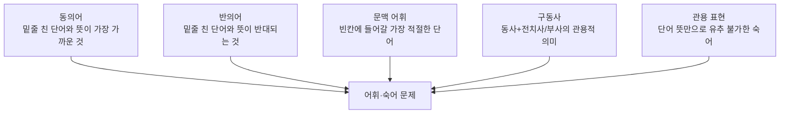

<Callout type="info">
  **이번 문서의 목표:** 독학사 1단계 영어 어휘 문제가 요구하는 유형(동의어·반의어·문맥 어휘·구동사·관용 표현)을 구별하고, 무작정 단어장을 외우는 대신 시험에 맞춘 암기·복습 전략을 세울 수 있게 한다.
</Callout>

## 왜 "단어를 많이 안다"가 목표가 아닌가

어휘 공부라고 하면 흔히 두꺼운 단어장을 처음부터 끝까지 외우는 장면을 떠올린다. 하지만 독학사 1단계 영어는 수능이나 토익처럼 방대한 어휘량 자체를 겨루는 시험이 아니라, **정해진 출제기준 범위 안에서 문맥에 맞는 단어를 고르는 능력**을 확인하는 시험이다. 즉 단어를 10,000개 아는 것보다, 자주 나오는 2,000~3,000개 단어를 문맥 속에서 정확히 구별해 쓸 수 있는 것이 훨씬 중요하다.

> **쉽게 말하면:** 많이 아는 것보다, 아는 단어를 문맥에 맞게 정확히 골라내는 것이 점수를 만든다.

이번 편은 어휘 문제 자체를 깊게 파고드는 편이 아니다. 실제 단어·숙어와 문제 풀이 훈련은 16편(품사·파생·구동사)과 17편(동의어·문맥 어휘)에서 이어진다. 여기서는 그 전에 "시험이 어떤 유형의 어휘 문제를 내는지", "어떻게 외우고 복습해야 오래 남는지"를 지도처럼 정리한다.

## 어휘 문제의 다섯 가지 유형

독학사 1단계 영어의 어휘·숙어 문제는 크게 다섯 유형으로 나눌 수 있다.

| 유형 | 무엇을 묻는가 | 풀이의 핵심 | 자세히 다루는 편 |
|------|----------------|--------------|--------------------|
| 동의어(synonym) | 밑줄 친 단어와 문맥상 뜻이 가장 가까운 선택지 | 사전적 뜻이 아니라 그 문장에서 바꿔 쓸 수 있는 단어를 찾는다 | 17편 |
| 반의어(antonym) | 밑줄 친 단어와 뜻이 반대되는 선택지 | 정반대 의미뿐 아니라 "정도"가 반대인 경우도 있다는 점에 주의한다 | 17편 |
| 문맥 어휘(context vocabulary) | 빈칸에 들어갈 가장 적절한 단어 | 접속사·연결어 같은 문맥 단서로 논리 관계를 파악한다 | 17편 |
| 구동사(phrasal verb) | 동사 + 전치사·부사가 합쳐져 새로운 뜻을 만드는 표현 | 동사와 전치사를 따로 해석하면 안 되고 전체를 하나의 단어처럼 외운다 | 16편 |
| 관용 표현(idiom) | 단어의 사전적 뜻만으로는 유추할 수 없는 굳어진 표현 | 표현 전체를 통째로 외우고, 비슷한 상황의 예문과 함께 기억한다 | 16, 18–19편 |

다섯 유형 중 구동사·관용 표현은 "단어 뜻은 아는데 조합된 의미를 몰라서" 틀리는 경우가 많고, 동의어·반의어·문맥 어휘는 "뜻은 대충 아는데 문맥에 안 맞는 것을 골라서" 틀리는 경우가 많다. 이 차이를 알아 두면 오답 노트를 정리할 때 "몰라서 틀렸다"와 "알지만 헷갈려서 틀렸다"를 구별해 복습 방법을 다르게 정할 수 있다.

### 유형별 예시로 감 잡기

아래 표는 각 유형이 실제로 어떤 문장에서 문제로 나오는지 보여주기 위해 새로 작성한 예시다. 뜻만 나열하지 않고 용례 문장을 함께 확인한다.

| 유형 | 예시 단어·표현 | 용례 문장 | 해석 |
|------|------------------|-----------|------|
| 동의어 | reluctant(꺼리는) ≈ unwilling(내키지 않는) | She was reluctant to accept the new position. | 그녀는 그 새로운 직책을 받아들이기를 꺼렸다. |
| 반의어 | generous(관대한) ↔ stingy(인색한) | Unlike his generous brother, he was quite stingy with money. | 그의 관대한 형과 달리, 그는 돈에 관해 상당히 인색했다. |
| 문맥 어휘 | 빈칸 → considerable(상당한) | The company invested a considerable amount of money in research. | 그 회사는 연구에 상당한 금액을 투자했다. |
| 구동사 | put off(연기하다) | The meeting was put off until next Monday. | 그 회의는 다음 주 월요일로 연기되었다. |
| 관용 표현 | under the weather(몸이 좋지 않은) | He stayed home because he felt under the weather. | 그는 몸이 좋지 않다고 느껴서 집에 있었다. |

<Callout type="warning">
  under the weather처럼 날씨(weather)와 무관해 보이는 관용 표현은 단어 뜻을 조합해서는 절대 유추할 수 없다. 이런 표현은 통째로 외우는 것 외에 다른 방법이 없다.
</Callout>

## 파트별 난이도와 학습 순서

| 파트 | 난이도 체감 | 이유 | 학습 조언 |
|------|--------------|------|-----------|
| 구동사 | 중간 | 동사·전치사는 익숙하지만 조합된 뜻이 낯설다 | 예문과 함께 통째로 외우고, 비슷한 전치사가 붙은 구동사끼리 비교한다 |
| 관용 표현 | 높음 | 단어 뜻으로 전혀 유추가 안 되는 경우가 많다 | 자주 나오는 표현 목록을 만들어 반복 노출한다 |
| 문맥 어휘 | 중간 | 단어는 알아도 접속사·논리 단서를 놓치면 틀린다 | 접속사·연결어의 의미(대조·인과·예시)를 먼저 확실히 외운다 |
| 동의어·반의어 | 낮음–중간 | 기본 단어 뜻만 정확히 알면 풀리는 경우가 많다 | 다의어(여러 뜻을 가진 단어)의 두 번째, 세 번째 뜻까지 함께 외운다 |

이 난이도 체감은 절대적인 기준이 아니라, 많은 학습자가 공통으로 겪는 어려움을 정리한 참고 지표다. 개인마다 이미 알고 있는 어휘량에 따라 체감 난이도는 달라질 수 있다.

## 암기·복습 전략

> **쉽게 말하면:** 단어는 한 번에 외우는 것이 아니라, 일정한 간격을 두고 여러 번 다시 만나야 오래 남는다.

무작정 단어장을 여러 번 읽는 것보다 다음 세 가지 원칙을 지키는 편이 훨씬 효율적이다.

<Steps>
1. **뜻만 외우지 않고 예문과 함께 외운다**: 앞의 표처럼 단어가 실제 문장에서 어떻게 쓰이는지 함께 기억하면, 시험에서 낯선 문장을 만나도 "이런 느낌으로 쓰이는 단어"라는 감각으로 접근할 수 있다.
2. **간격을 두고 반복한다(분산 학습)**: 오늘 외운 단어를 다음 날, 3일 뒤, 일주일 뒤에 다시 확인하는 방식이 하루에 몰아서 여러 번 반복하는 것보다 장기 기억에 유리하다고 알려져 있다.
3. **틀린 단어만 따로 모아 복습한다**: 아는 단어를 계속 다시 보는 것은 시간 낭비다. 오답 노트에 틀린 단어·표현만 모아 그 부분만 집중적으로 반복한다.
</Steps>

이 원칙은 16~17편에서 실제 단어·숙어 목록을 학습할 때, 그리고 24편(영역 통합 연습)·25~28편(기출·모의)에서 복습할 때 계속 적용한다.

## 자주 틀리는 점

- **단어 뜻 하나만 외우고 다의어 대비를 하지 않는다**: 앞서 언급했듯 시험은 흔히 아는 뜻이 아닌 낯선 뜻으로 단어를 제시하는 경우가 많다. 대표적인 뜻 두 개는 함께 외워야 한다.
- **구동사를 동사와 전치사를 따로 해석해서 이해하려 한다**: put off를 "놓다"와 "떨어져"로 따로 해석하면 "연기하다"라는 뜻이 나오지 않는다. 구동사는 하나의 새로운 단어처럼 통째로 외워야 한다.
- **한 번에 몰아서 외우고 복습을 미룬다**: 분산 학습 없이 벼락치기로 외운 단어는 시험 직전에는 기억나지만 실전에서 문맥과 결합해 응용하는 능력으로 이어지지 못하는 경우가 많다.
- **어휘를 문법·독해와 분리해서 공부한다**: 문맥 어휘 문제는 접속사(문법)의 의미를 알아야 풀리고, 동의어 문제는 짧은 독해 지문 안에서 판단해야 한다. 어휘만 따로 떼어 외우기보다 예문 속에서 익히는 것이 실전에 더 가깝다.

## 핵심 정리

- 독학사 1단계 영어 어휘 문제는 동의어·반의어·문맥 어휘·구동사·관용 표현 다섯 유형으로 나뉘며, 유형마다 풀이 접근법이 다르다.
- 구동사·관용 표현은 "몰라서" 틀리는 경우가, 동의어·반의어·문맥 어휘는 "헷갈려서" 틀리는 경우가 많다는 차이를 알면 오답 복습 방향을 정하는 데 도움이 된다.
- 어휘는 뜻만 나열해 외우지 않고 예문과 함께, 간격을 두고 반복(분산 학습)하며, 틀린 단어 위주로 복습하는 것이 효율적이다.
- 실제 단어·숙어 목록과 문제 풀이는 16편(품사·파생·구동사), 17편(동의어·문맥 어휘)에서 이어서 다룬다.

## 마무리 복습

<Quiz
  questionNumber={1}
  question="독학사 1단계 영어 어휘 문제의 성격에 대한 설명으로 가장 적절한 것은?"
  options={['방대한 어휘량 자체를 겨루는 시험이다', '정해진 범위 안에서 문맥에 맞는 단어를 고르는 능력을 확인하는 시험이다', '어휘 문제는 출제되지 않는다', '단어의 철자를 정확히 쓰는 능력을 확인하는 시험이다']}
  correctAnswer={2}
  explanation="독학사 1단계 영어는 방대한 어휘량 자체가 아니라, 출제기준 범위 안에서 문맥에 맞는 단어를 정확히 고르는 능력을 확인하는 시험이다."
  optionExplanations={['수능·토익처럼 방대한 어휘량을 겨루는 시험이 아니다.', '정답. 정해진 범위에서 문맥에 맞는 단어를 고르는 능력이 핵심이다.', '어휘는 1단계 영어의 네 출제 영역 중 하나로 반드시 출제된다.', '객관식 시험이므로 철자를 직접 쓰는 문제는 나오지 않는다.']}
/>

<Quiz
  questionNumber={2}
  question="put off라는 구동사를 학습하는 방법으로 가장 적절한 것은?"
  options={['put과 off를 따로 해석해 뜻을 조합한다', 'put off 전체를 하나의 단어처럼 예문과 함께 통째로 외운다', 'put off는 시험에 나오지 않으므로 학습하지 않는다', 'put의 첫 번째 사전적 뜻만 외운다']}
  correctAnswer={2}
  explanation="구동사는 동사와 전치사를 따로 해석하면 원래 뜻(연기하다)이 나오지 않으므로, 전체를 하나의 새로운 단어처럼 예문과 함께 통째로 외워야 한다."
  optionExplanations={['put(놓다)과 off(떨어져)를 따로 해석하면 연기하다라는 뜻이 나오지 않는다.', '정답. 구동사는 전체를 하나의 단어처럼 통째로 외워야 한다.', '구동사는 어휘 문제의 다섯 유형 중 하나로 자주 출제된다.', 'put만 따로 외우면 구동사의 실제 뜻을 알 수 없다.']}
/>

<Quiz
  questionNumber={3}
  question="under the weather라는 표현이 관용 표현으로 분류되는 이유는?"
  options={['날씨와 관련된 단어이므로 문맥 어휘에 해당하기 때문이다', '단어의 사전적 뜻만으로는 몸이 좋지 않다는 의미를 유추할 수 없기 때문이다', '동사와 전치사가 결합된 구동사이기 때문이다', '반의어 문제에 자주 출제되기 때문이다']}
  correctAnswer={2}
  explanation="under the weather는 under(아래)와 weather(날씨)의 사전적 뜻을 조합해도 몸이 좋지 않다는 의미가 나오지 않는, 굳어진 관용 표현이다."
  optionExplanations={['날씨라는 단어가 포함되어 있지만 실제 의미는 날씨와 무관하다.', '정답. 단어 뜻의 조합으로는 실제 의미를 유추할 수 없는 굳어진 표현이다.', 'under the weather는 동사가 아니라 전치사구로 이루어진 관용 표현이다.', '이 표현은 반의어 문제와 직접적인 관련이 없다.']}
/>

<Quiz
  questionNumber={4}
  question="분산 학습(간격을 두고 반복하는 복습)이 벼락치기보다 권장되는 이유로 가장 적절한 것은?"
  options={['시험 범위가 매번 바뀌기 때문이다', '장기 기억에 유리하다고 알려져 있기 때문이다', '벼락치기는 규정상 금지되어 있기 때문이다', '분산 학습은 문법 공부에만 적용되기 때문이다']}
  correctAnswer={2}
  explanation="오늘 외운 내용을 일정한 간격을 두고 다시 확인하는 분산 학습은, 하루에 몰아서 반복하는 것보다 장기 기억에 유리하다고 알려져 있다."
  optionExplanations={['분산 학습의 이유는 시험 범위 변경과 관련이 없다.', '정답. 간격을 둔 반복은 장기 기억 형성에 유리하다고 알려져 있다.', '벼락치기가 규정상 금지된 것은 아니며, 효율성 측면에서 권장되지 않는 것이다.', '분산 학습은 어휘·문법을 포함한 모든 암기 학습에 적용할 수 있는 원칙이다.']}
/>

<Quiz
  questionNumber={5}
  question="reluctant와 unwilling의 관계, generous와 stingy의 관계를 각각 올바르게 짝지은 것은?"
  options={['둘 다 동의어 관계다', 'reluctant-unwilling은 동의어, generous-stingy는 반의어 관계다', 'reluctant-unwilling은 반의어, generous-stingy는 동의어 관계다', '둘 다 반의어 관계다']}
  correctAnswer={2}
  explanation="reluctant(꺼리는)와 unwilling(내키지 않는)은 뜻이 비슷한 동의어 관계이고, generous(관대한)와 stingy(인색한)는 뜻이 반대되는 반의어 관계다."
  optionExplanations={['generous와 stingy는 뜻이 반대이므로 동의어 관계가 아니다.', '정답. 앞 쌍은 동의어, 뒤 쌍은 반의어 관계다.', 'reluctant와 unwilling은 뜻이 비슷하므로 반의어가 아니다.', 'reluctant와 unwilling은 뜻이 비슷한 동의어 관계다.']}
/>

<Quiz
  questionNumber={6}
  question="오답 노트를 정리할 때, 구동사·관용 표현 오답과 동의어·반의어 오답을 다르게 다루어야 하는 이유로 가장 적절한 것은?"
  options={['출제 영역이 완전히 다르기 때문이다', '전자는 몰라서 틀리는 경우가, 후자는 헷갈려서 틀리는 경우가 많아 복습 방향이 다르기 때문이다', '구동사는 시험에 나오지 않기 때문이다', '동의어·반의어는 암기가 필요 없기 때문이다']}
  correctAnswer={2}
  explanation="구동사·관용 표현은 표현 자체를 몰라서 틀리는 경우가 많아 통째로 암기해야 하고, 동의어·반의어·문맥 어휘는 뜻은 알지만 문맥에 안 맞는 것을 골라 틀리는 경우가 많아 문맥 판단 연습이 필요하다."
  optionExplanations={['두 유형 모두 어휘·숙어라는 같은 출제 영역에 속한다.', '정답. 오답의 원인이 다르므로 복습 방향도 다르게 잡아야 한다.', '구동사는 어휘 문제의 다섯 유형 중 하나로 자주 출제된다.', '동의어·반의어도 다의어의 여러 뜻을 암기해 두어야 정확히 풀 수 있다.']}
/>

## 참고 자료

- [Merriam-Webster](https://www.merriam-webster.com)
- [Cambridge Dictionary](https://dictionary.cambridge.org)
