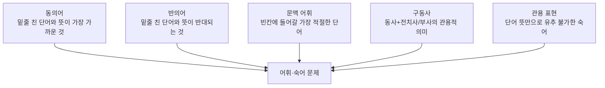

## 왜 "단어를 많이 안다"가 목표가 아닌가

어휘 공부라고 하면 흔히 두꺼운 단어장을 처음부터 끝까지 외우는 장면을 떠올린다. 하지만 독학사 1단계 영어는 수능이나 토익처럼 방대한 어휘량 자체를 겨루는 시험이 아니라, **정해진 출제기준 범위 안에서 문맥에 맞는 단어를 고르는 능력**을 확인하는 시험이다.

실제 단어·숙어와 문제 풀이 훈련은 15편(품사·파생·구동사)과 16편(동의어·문맥 어휘)에서 이어진다. 여기서는 그 전에 "시험이 어떤 유형의 어휘 문제를 내는지", "어떻게 외우고 복습해야 오래 남는지"를 지도처럼 정리한다.

## 어휘 문제의 다섯 가지 유형

독학사 1단계 영어의 어휘·숙어 문제는 크게 다섯 유형으로 나눌 수 있다.

```mermaid
graph TB
  A[동의어<br/>밑줄 친 단어와 뜻이 가장 가까운 것] --> V[어휘·숙어 문제]
  B[반의어<br/>밑줄 친 단어와 뜻이 반대되는 것] --> V
  C[문맥 어휘<br/>빈칸에 들어갈 가장 적절한 단어] --> V
  D[구동사<br/>동사+전치사/부사의 관용적 의미] --> V
  E[관용 표현<br/>단어 뜻만으로 유추 불가한 숙어] --> V
```

| 유형 | 무엇을 묻는가 | 풀이의 핵심 | 자세히 다루는 편 |
|------|----------------|--------------|--------------------|
| 동의어(synonym) | 밑줄 친 단어와 문맥상 뜻이 가장 가까운 선택지 | 사전적 뜻이 아니라 그 문장에서 바꿔 쓸 수 있는 단어를 찾는다 | 16편 |
| 반의어(antonym) | 밑줄 친 단어와 뜻이 반대되는 선택지 | 정반대 의미뿐 아니라 "정도"가 반대인 경우도 있다는 점에 주의한다 | 16편 |
| 문맥 어휘(context vocabulary) | 빈칸에 들어갈 가장 적절한 단어 | 접속사·연결어 같은 문맥 단서로 논리 관계를 파악한다 | 16편 |
| 구동사(phrasal verb) | 동사 + 전치사·부사가 합쳐져 새로운 뜻을 만드는 표현 | 동사와 전치사를 따로 해석하면 안 되고 전체를 하나의 단어처럼 외운다 | 15편 |
| 관용 표현(idiom) | 단어의 사전적 뜻만으로는 유추할 수 없는 굳어진 표현 | 표현 전체를 통째로 외우고, 비슷한 상황의 예문과 함께 기억한다 | 15, 17–18편 |

다섯 유형 중 구동사·관용 표현은 "단어 뜻은 아는데 조합된 의미를 몰라서" 틀리는 경우가 많고, 동의어·반의어·문맥 어휘는 "뜻은 대충 아는데 문맥에 안 맞는 것을 골라서" 틀리는 경우가 많다. 이 차이를 알아 두면 오답 노트를 정리할 때 "몰라서 틀렸다"와 "알지만 헷갈려서 틀렸다"를 구별해 복습 방법을 다르게 정할 수 있다.

### 유형별 예시로 감 잡기

아래 표는 각 유형이 실제로 어떤 문장에서 문제로 나오는지 보여주기 위해 새로 작성한 예시다. 뜻만 나열하지 않고 용례 문장을 함께 확인한다.

| 유형 | 예시 단어·표현 | 용례 문장 | 해석 |
|------|------------------|-----------|------|
| 동의어 | reluctant(꺼리는) ≈ unwilling(내키지 않는) | She was reluctant to accept the new position. | 그녀는 그 새로운 직책을 받아들이기를 꺼렸다. |
| 반의어 | generous(관대한) ↔ stingy(인색한) | Unlike his generous brother, he was quite stingy with money. | 그의 관대한 형과 달리, 그는 돈에 관해 상당히 인색했다. |
| 문맥 어휘 | 빈칸 → considerable(상당한) | The company invested a considerable amount of money in research. | 그 회사는 연구에 상당한 금액을 투자했다. |
| 구동사 | put off(연기하다) | The meeting was put off until next Monday. | 그 회의는 다음 주 월요일로 연기되었다. |
| 관용 표현 | under the weather(몸이 좋지 않은) | He stayed home because he felt under the weather. | 그는 몸이 좋지 않다고 느껴서 집에 있었다. |

<Callout type="warning">
  under the weather처럼 날씨(weather)와 무관해 보이는 관용 표현은 단어 뜻을 조합해서는 절대 유추할 수 없다. 이런 표현은 통째로 외우는 것 외에 다른 방법이 없다.
</Callout>

## 자주 틀리는 점

- **단어 뜻 하나만 외우고 다의어 대비를 하지 않는다**: 앞서 언급했듯 시험은 흔히 아는 뜻이 아닌 낯선 뜻으로 단어를 제시하는 경우가 많다. 대표적인 뜻 두 개는 함께 외워야 한다.
- **구동사를 동사와 전치사를 따로 해석해서 이해하려 한다**: put off를 "놓다"와 "떨어져"로 따로 해석하면 "연기하다"라는 뜻이 나오지 않는다. 구동사는 하나의 새로운 단어처럼 통째로 외워야 한다.
- **한 번에 몰아서 외우고 복습을 미룬다**: 분산 학습 없이 벼락치기로 외운 단어는 시험 직전에는 기억나지만 실전에서 문맥과 결합해 응용하는 능력으로 이어지지 못하는 경우가 많다.
- **어휘를 문법·독해와 분리해서 공부한다**: 문맥 어휘 문제는 접속사(문법)의 의미를 알아야 풀리고, 동의어 문제는 짧은 독해 지문 안에서 판단해야 한다. 어휘만 따로 떼어 외우기보다 예문 속에서 익히는 것이 실전에 더 가깝다.

## 핵심 정리

- 독학사 1단계 영어 어휘 문제는 동의어·반의어·문맥 어휘·구동사·관용 표현 다섯 유형으로 나뉘며, 유형마다 풀이 접근법이 다르다.
- 구동사·관용 표현은 "몰라서" 틀리는 경우가, 동의어·반의어·문맥 어휘는 "헷갈려서" 틀리는 경우가 많다는 차이를 알면 오답 복습 방향을 정하는 데 도움이 된다.
- 어휘는 뜻만 나열해 외우지 않고 예문과 함께, 간격을 두고 반복(분산 학습)하며, 틀린 단어 위주로 복습하는 것이 효율적이다.
- 실제 단어·숙어 목록과 문제 풀이는 15편(품사·파생·구동사), 16편(동의어·문맥 어휘)에서 이어서 다룬다.

## 마무리 복습

<Quiz
  questionNumber={1}
  question={"독학사 1단계 영어 어휘 문제의 성격에 대한 설명으로 가장 적절한 것은?"}
  options={["방대한 어휘량 자체를 겨루는 시험이다","정해진 범위 안에서 문맥에 맞는 단어를 고르는 능력을 확인하는 시험이다","어휘 문제는 출제되지 않는다","단어의 철자를 정확히 쓰는 능력을 확인하는 시험이다"]}
  correctAnswer={2}
  explanation={"독학사 1단계 영어는 방대한 어휘량 자체가 아니라, 출제기준 범위 안에서 문맥에 맞는 단어를 정확히 고르는 능력을 확인하는 시험이다."}
/>

<Quiz
  questionNumber={2}
  question={"put off라는 구동사를 학습하는 방법으로 가장 적절한 것은?"}
  options={["put과 off를 따로 해석해 뜻을 조합한다","put off 전체를 하나의 단어처럼 예문과 함께 통째로 외운다","put off는 시험에 나오지 않으므로 학습하지 않는다","put의 첫 번째 사전적 뜻만 외운다"]}
  correctAnswer={2}
  explanation={"구동사는 동사와 전치사를 따로 해석하면 원래 뜻(연기하다)이 나오지 않으므로, 전체를 하나의 새로운 단어처럼 예문과 함께 통째로 외워야 한다."}
/>

<Quiz
  questionNumber={3}
  question={"under the weather라는 표현이 관용 표현으로 분류되는 이유는?"}
  options={["날씨와 관련된 단어이므로 문맥 어휘에 해당하기 때문이다","단어의 사전적 뜻만으로는 몸이 좋지 않다는 의미를 유추할 수 없기 때문이다","동사와 전치사가 결합된 구동사이기 때문이다","반의어 문제에 자주 출제되기 때문이다"]}
  correctAnswer={2}
  explanation={"under the weather는 under(아래)와 weather(날씨)의 사전적 뜻을 조합해도 몸이 좋지 않다는 의미가 나오지 않는, 굳어진 관용 표현이다."}
/>

## 참고 자료

- [Merriam-Webster](https://www.merriam-webster.com)
- [Cambridge Dictionary](https://dictionary.cambridge.org)
