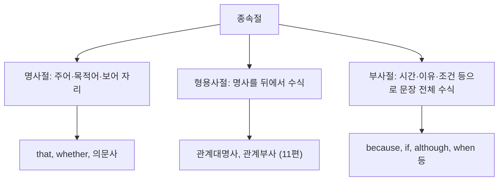

<Callout type="info">
  **이번 문서의 목표:** 이 문서를 다 읽으면 등위 접속사·종속 접속사·접속부사를 형태와 기능으로 구별하고, 명사절·형용사절·부사절이 문장에서 하는 역할을 파악하며, 병렬 구조 오류를 스스로 찾아낼 수 있다.
</Callout>

## 접속사가 왜 헷갈리는가 — 이어주는 말이 다 같아 보인다

**접속사**(接續詞, conjunction)는 단어와 단어, 구와 구, 절과 절을 이어 주는 품사다. 한국어로 옮기면 "그리고", "그러나", "그러므로"처럼 비슷비슷한 느낌의 말들이 튀어나오지만, 영어에서는 이 이어주는 말들이 **문법적으로 전혀 다른 세 부류**로 나뉜다. 첫째는 대등한 두 요소를 나란히 붙이는 등위 접속사(and, but, or 등), 둘째는 한 절을 다른 절에 종속시켜 문장 성분으로 만드는 종속 접속사(because, although, that 등), 셋째는 접속사처럼 보이지만 실제로는 부사인 접속부사(however, therefore 등)다. 이 셋을 구별하지 못하면 문장을 어떻게 연결해야 하는지, 쉼표를 어디에 찍어야 하는지, 심지어 두 문장을 마침표 없이 이어 버리는 오류(comma splice, 쉼표만으로 두 문장을 잘못 이은 오류)까지 저지르게 된다.

> **쉽게 말하면:** 접속사는 "누가 누구를 종속시키는가"로 구별한다. 등위 접속사는 대등하게 나란히, 종속 접속사는 한쪽을 다른 쪽에 딸린 절로, 접속부사는 사실 부사이므로 접속사 자리에 혼자 쓰면 문장이 끊어진다.

## 등위 접속사 — 대등하게 이어준다

**등위 접속사**(等位接續詞, coordinating conjunction)는 문법적으로 대등한 단어·구·절을 나란히 연결한다. 대표적으로 `and`(그리고), `but`(그러나), `or`(또는), `so`(그래서), `for`(왜냐하면, 격식체), `nor`(…도 아니다)가 있으며, 앞 글자를 따서 FANBOYS(For, And, Nor, But, Or, Yet, So)로 외우기도 한다.

- **I studied grammar, and my sister practiced vocabulary.**
  나는 문법을 공부했고, 내 여동생은 어휘를 연습했다.
- **The exam was difficult, but most students passed.**
  시험은 어려웠지만, 대부분의 학생이 합격했다.

등위 접속사가 **완전한 절과 절**을 연결할 때는 그 앞에 쉼표를 찍는 것이 원칙이다. 반면 단어와 단어, 구와 구를 연결할 때는 쉼표를 찍지 않는다.

- **She bought pens and notebooks.** (단어와 단어 → 쉼표 없음)
  그녀는 펜과 공책을 샀다.
- **She went to the library, and she borrowed three books.** (절과 절 → 쉼표 있음)
  그녀는 도서관에 갔고, 책 세 권을 빌렸다.

### 상관접속사 — 짝을 이루는 등위 접속사

`both A and B`(A와 B 둘 다), `either A or B`(A 또는 B 둘 중 하나), `neither A nor B`(A도 B도 아닌), `not only A but also B`(A뿐 아니라 B도)처럼 두 부분이 짝을 이루는 접속사를 **상관접속사**(相關接續詞, correlative conjunction)라고 한다. 이 구조에서 A와 B 자리에는 **문법적으로 같은 형태**가 와야 한다는 것이 시험에서 가장 자주 확인하는 지점이다.

- **잘못된 예: She is not only smart but also she is diligent.** (X)
- **바른 예: She is not only smart but also diligent.** (O)
  그녀는 똑똑할 뿐만 아니라 부지런하기도 하다.
  → `not only`와 `but also` 뒤에 똑같이 형용사(smart, diligent)가 와야 한다.

## 종속 접속사 — 한 절을 다른 절에 딸리게 한다

**종속 접속사**(從屬接續詞, subordinating conjunction)는 절 하나를 독립적으로 서지 못하게 만들고, 주절(main clause)에 딸린 **종속절**(從屬節, subordinate clause)로 바꾼다. 종속절은 그 역할에 따라 명사절·형용사절·부사절로 나뉜다. 관계대명사·관계부사가 이끄는 형용사절의 세부 규칙은 11편에서 다뤘으므로, 이 문서에서는 접속사가 이끄는 명사절·부사절, 그리고 형용사절과의 구별 지점을 중심으로 다룬다.

### 명사절을 이끄는 접속사

**명사절**(名詞節, noun clause)은 문장에서 주어·목적어·보어 자리를 채우는, 즉 명사 하나가 할 수 있는 역할을 절 전체가 대신하는 구조다. 대표적으로 `that`(…라는 것), `whether/if`(…인지 아닌지), 의문사(`what, who, when, where, why, how`)가 명사절을 이끈다.

- **That she passed the exam surprised everyone.** (주어 자리)
  그녀가 시험에 합격했다는 것은 모두를 놀라게 했다.
- **I do not know whether he will come tomorrow.** (목적어 자리)
  나는 그가 내일 올지 아닌지 모른다.
- **The problem is that we have no more time.** (보어 자리)
  문제는 우리에게 더 이상 시간이 없다는 것이다.

`whether`와 `if`는 둘 다 "…인지 아닌지"라는 뜻이지만, **주어 자리**나 **전치사 뒤**, **또는 or not이 바로 붙을 때**는 `if`를 쓸 수 없고 `whether`만 가능하다는 점이 출제 함정이다.

- **잘못된 예: If he comes or not does not matter.** (X)
- **바른 예: Whether he comes or not does not matter.** (O)
  그가 오든 안 오든 상관없다.

### 부사절을 이끄는 접속사

**부사절**(副詞節, adverb clause)은 시간·이유·조건·양보·목적 등의 의미로 주절을 수식한다.

| 의미 | 대표 접속사 | 예시 |
|---|---|---|
| 시간 | when, while, before, after, until, as soon as | I will call you as soon as I arrive. |
| 이유 | because, since, as | She stayed home because she was sick. |
| 조건 | if, unless, in case | Unless you hurry, you will miss the bus. |
| 양보 | although, though, even though, while | Although it rained, we went hiking. |
| 목적 | so that, in order that | He studied hard so that he could pass the exam. |

`unless`는 "…하지 않는다면"이라는 뜻으로 **이미 부정의 의미를 포함**하므로, 뒤에 다시 `not`을 겹쳐 쓰면 이중 부정이 되어 오류다.

- **잘못된 예: Unless you don't hurry, you will be late.** (X)
- **바른 예: Unless you hurry, you will be late.** (O)
  서두르지 않으면 늦을 것이다.

시간·조건의 부사절 안에서는 **미래의 일이라도 현재시제**로 쓴다는 규칙도 자주 출제된다.

- **잘못된 예: If it will rain tomorrow, we will cancel the picnic.** (X)
- **바른 예: If it rains tomorrow, we will cancel the picnic.** (O)
  내일 비가 오면 소풍을 취소할 것이다.

## 명사절·형용사절·부사절 구별하기

세 절은 모두 "접속사(또는 관계사) + 주어 + 동사" 형태로 비슷해 보이지만, **문장에서 하는 역할**로 구별해야 한다.

- **The book that I bought yesterday is interesting.** (형용사절: 명사 the book 수식)
  내가 어제 산 그 책은 흥미롭다.
- **I believe that the book is interesting.** (명사절: believe의 목적어)
  나는 그 책이 흥미롭다고 믿는다.

`that`이 형용사절(관계대명사)로 쓰였는지 명사절(접속사)로 쓰였는지는, `that` 뒤에 **불완전한 절**(주어나 목적어가 빠진 절)이 오면 관계대명사, **완전한 절**이 오면 명사절 접속사라는 기준으로 구별한다. 첫 문장은 `bought`의 목적어가 빠져 있으므로 관계대명사, 두 번째 문장은 `the book is interesting`이 완전한 절이므로 명사절 접속사다.

## 접속부사 — 접속사가 아니라 부사다

**접속부사**(接續副詞, conjunctive adverb)는 `however`(그러나), `therefore`(그러므로), `moreover`(게다가), `nevertheless`(그럼에도 불구하고), `in addition`(게다가)처럼 두 문장의 논리 관계를 보여주지만, 문법적으로는 **부사**이지 접속사가 아니다. 그래서 접속부사만으로 두 개의 완전한 절을 쉼표로 이어 버리면 **comma splice**(콤마 이어붙이기 오류)가 된다.

- **잘못된 예: It was raining heavily, however we decided to go out.** (X)
- **바른 예 1: It was raining heavily; however, we decided to go out.** (O, 세미콜론 사용)
- **바른 예 2: It was raining heavily. However, we decided to go out.** (O, 마침표로 분리)
  비가 심하게 내렸다. 그러나 우리는 나가기로 했다.

접속부사는 **세미콜론(;) + 접속부사 + 쉼표(,)**, 또는 **마침표로 완전히 분리한 뒤 접속부사 + 쉼표**의 형태로 써야 하며, 등위 접속사(`but`)처럼 쉼표 하나만으로 절과 절을 이어 붙일 수 없다는 점이 핵심 함정이다.

## 병렬 구조 — 접속사가 만드는 대칭

**병렬 구조**(竝列構造, parallel structure)는 접속사(등위 접속사·상관접속사)로 연결되는 요소들이 **같은 문법 형태**를 취해야 한다는 원칙이다. 앞서 상관접속사에서 잠깐 다뤘지만, 이 원칙은 단순 나열(A, B, and C)에서도 똑같이 적용된다.

- **잘못된 예: My hobbies are reading, swimming, and to cook.** (X)
- **바른 예: My hobbies are reading, swimming, and cooking.** (O)
  내 취미는 독서, 수영, 요리다.
  → 앞의 두 요소가 동명사(reading, swimming)이므로 마지막 요소도 동명사(cooking)로 맞춰야 한다.

- **잘못된 예: The manager wants employees who are honest, reliable, and work hard.** (X)
- **바른 예: The manager wants employees who are honest, reliable, and hardworking.** (O)
  그 관리자는 정직하고, 믿을 만하며, 근면한 직원을 원한다.
  → `are` 뒤에 형용사 세 개(honest, reliable, hardworking)가 나란히 와야 하는데, 마지막에 동사구(work hard)를 섞으면 병렬이 깨진다.

## 자주 틀리는 점 정리

1. **접속부사를 쉼표만으로 두 절 사이에 넣는 오류**: `however`, `therefore` 앞에는 세미콜론이나 마침표가 필요하다.
2. **unless나 if 조건절에서 이중 부정을 쓰는 오류**: `unless ~ not`(X)은 의미가 겹친다.
3. **시간·조건 부사절에서 미래를 will로 쓰는 오류**: `if/when` 등이 이끄는 절 안에서는 현재시제가 미래를 대신한다.
4. **whether 자리에 if를 쓰는 오류**: 주어 자리, 전치사 뒤, `or not` 앞에서는 `if`를 쓸 수 없다.
5. **나열·상관접속사에서 병렬 구조가 깨지는 오류**: 연결되는 요소는 반드시 같은 품사·형태로 맞춘다.

## 핵심 정리

- 등위 접속사(FANBOYS)는 대등한 요소를, 종속 접속사는 절을 명사절·형용사절·부사절로 만들어 주절에 딸리게 한다.
- 명사절은 주어·목적어·보어 자리를 채우고, 형용사절은 명사를 수식하며, 부사절은 시간·이유·조건 등으로 문장 전체를 수식한다.
- 접속부사(however, therefore 등)는 부사이므로 세미콜론이나 마침표 없이 쉼표만으로 두 절을 이을 수 없다.
- 상관접속사와 나열 구문은 연결되는 요소의 문법 형태를 반드시 통일해야 한다(병렬 구조).
- 시간·조건 부사절 안에서는 미래의 의미도 현재시제로 표현한다.

## 마무리 복습

<Quiz
  questionNumber={1}
  question="다음 중 어법상 옳은 문장은?"
  options={['It was raining heavily, however we stayed inside.', 'It was raining heavily; however, we stayed inside.', 'It was raining heavily however we stayed inside.', 'It was raining heavily, but however we stayed inside.']}
  correctAnswer={2}
  explanation="however는 접속부사이므로 두 개의 완전한 절을 이을 때는 세미콜론 뒤에 쓰고 쉼표로 이어야 한다."
  optionExplanations={['접속부사 however 앞에 쉼표만 쓰면 comma splice 오류가 된다.', '정답. 세미콜론 뒤에 however, 쉼표로 이어진 올바른 형태다.', '절과 절 사이에 아무 구두점 없이 접속부사만 놓으면 오류다.', 'but과 however를 겹쳐 쓸 필요가 없으며 구두점도 맞지 않는다.']}
/>

<Quiz
  questionNumber={2}
  question="빈칸에 들어갈 말로 가장 적절한 것은? ______ he comes or not does not matter to us."
  options={['If', 'Whether', 'Unless', 'Because']}
  correctAnswer={2}
  explanation="or not이 바로 붙거나 명사절이 주어 자리에 올 때는 if를 쓸 수 없고 whether만 가능하다."
  optionExplanations={['if는 주어 자리나 or not 앞에서 쓸 수 없다.', '정답. whether는 주어 자리와 or not 앞에서 모두 쓸 수 있다.', 'unless는 이유·조건이 이 문맥과 맞지 않으며 명사절을 이끌지 못한다.', 'because는 이유의 부사절 접속사로 이 자리(명사절 주어)에 맞지 않는다.']}
/>

<Quiz
  questionNumber={3}
  question="다음 문장에서 어법상 어색한 부분은? My sister enjoys hiking, swimming, and to read novels."
  options={['My sister enjoys', 'hiking,', 'swimming, and', 'to read novels']}
  correctAnswer={4}
  explanation="앞의 두 요소(hiking, swimming)가 동명사이므로 마지막 요소도 동명사(reading novels)로 맞춰야 병렬 구조가 유지된다."
  optionExplanations={['주어와 동사 부분으로 문제가 없다.', '첫 번째 동명사로 병렬 구조의 기준이 된다.', '두 번째 동명사와 접속사로 문제가 없다.', '정답. to read novels를 reading novels로 바꿔야 앞의 동명사들과 병렬을 이룬다.']}
/>

<Quiz
  questionNumber={4}
  question="빈칸에 들어갈 말로 가장 적절한 것은? If it ______ tomorrow, the outdoor event will be moved indoors."
  options={['will rain', 'rains', 'is going to rain', 'would rain']}
  correctAnswer={2}
  explanation="시간·조건의 부사절 안에서는 미래의 의미도 현재시제로 나타낸다. 따라서 will rain이 아니라 rains가 정답이다."
  optionExplanations={['조건 부사절 안에서는 will을 쓰지 않는다.', '정답. 조건절 안의 미래 의미는 현재시제 rains로 나타낸다.', 'be going to 역시 미래 표현이므로 조건절 규칙에 어긋난다.', 'would는 가정법에 쓰이는 형태로 단순 조건절과 맞지 않는다.']}
/>

<Quiz
  questionNumber={5}
  question="다음 문장에서 어법상 어색한 부분은? The report that I submitted yesterday, but my manager has not read it yet."
  options={['The report that I submitted yesterday, but', 'my manager', 'has not read', 'it yet']}
  correctAnswer={1}
  explanation="관계대명사절(that I submitted yesterday)이 주어를 수식하는 형용사절로 쓰였는데, 그 뒤에 but을 붙이면 주절이 두 개가 되어 문장이 성립하지 않는다. but을 빼고 The report that I submitted yesterday가 그대로 주어가 되어야 한다."
  optionExplanations={['정답. 형용사절 뒤에 but을 붙이면 주어만 있고 술어가 두 번 나오는 구조가 되어 오류다.', '문장의 주어로 문제가 없다.', '술어 동사구로 문제가 없다.', '목적어 자리로 문제가 없다.']}
/>

<Quiz
  questionNumber={6}
  question="다음 중 나머지 셋과 절의 종류가 다른 하나는?"
  options={['I know that she is honest.', 'The fact that she is honest surprised us.', 'She said that she would help us.', 'She is a person that everyone trusts.']}
  correctAnswer={4}
  explanation="1~3번의 that절은 완전한 절을 이끄는 명사절(목적어·동격·목적어)이지만, 4번의 that은 everyone trusts의 목적어가 빠진 불완전한 절을 이끄는 관계대명사(형용사절)다."
  optionExplanations={['know의 목적어 역할을 하는 명사절이다.', 'the fact와 동격을 이루는 명사절이다.', 'said의 목적어 역할을 하는 명사절이다.', '정답. trusts의 목적어가 빠진 불완전한 절을 이끄는 관계대명사절(형용사절)이다.']}
/>

## 참고 자료

- 독학사 1단계 공략집 영어(국가평생교육진흥원 독학학위제 공식 사이트): https://bdes.nile.or.kr
- Cambridge Dictionary — Conjunctions, Clauses: https://dictionary.cambridge.org
