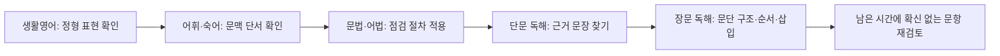

<Callout type="info">
  **이번 문서의 목표:** 이 문서를 다 읽으면 어휘·문법·독해·생활영어가 뒤섞인 한 회분 문제를 시간 안에 어떤 순서로 풀지 스스로 정할 수 있고, 실제로 그 순서대로 통합 문제를 풀어볼 수 있다.
</Callout>

## 왜 영역을 나눠서 연습하는 것만으로는 부족한가

지금까지 06편부터 23편까지는 문법·어휘·독해·생활영어·어법 오류를 **영역별로 하나씩 떼어** 연습했다. 하지만 실제 독학사 1단계 영어 시험지는 이 영역들이 순서대로 섞여서 한 번에 출제되고, 정해진 시험 시간(01편 참고) 안에 전부 풀어야 한다. 한 영역만 연습할 때는 "지금은 문법 문제구나"라는 마음의 준비가 되어 있지만, 실전에서는 그 준비 없이 문제 유형을 스스로 알아채고 전략을 바꿔야 한다. 이 편은 그 전환 능력을 기르기 위한 마지막 본론 편이다.

> **쉽게 말하면:** 영역별 연습이 각 종목의 개별 훈련이라면, 이 편은 실제 경기처럼 모든 종목을 이어서 뛰어보는 연습이다.

## 시간 관리 전략 — 영역별로 얼마를 쓸 것인가

독학사 1단계 영어의 회차별 문항 수·시험 시간은 공고마다 달라질 수 있으므로(01편 참고, 공고 확인 필요), 아래 배분은 절대적인 기준이 아니라 **영역 간 상대적인 시간 비중**을 감으로 익히기 위한 예시다.

| 영역 | 문항당 권장 시간 | 이유 |
|---|---|---|
| 생활영어 | 30초–40초 | 정형화된 표현을 아는지 확인하는 문제라 오래 고민할수록 오히려 불리하다 |
| 어휘·숙어 | 30초–50초 | 문맥 단서만 빠르게 확인하면 되는 문제가 많다 |
| 문법·어법 | 40초–60초 | 06–15편·23편의 점검 절차를 순서대로 적용해야 하므로 어휘보다 시간이 조금 더 필요하다 |
| 독해(단문) | 1분–1분 30초 | 짧은 지문이라도 문항마다 근거 문장을 찾아야 한다 |
| 독해(장문) | 2분–3분 | 지문 하나에 문항 여러 개가 딸려 있어 지문당 시간으로 계산해야 한다 |

이 표에서 가장 중요한 원칙은 **쉬운 영역에서 시간을 아껴, 어려운 장문 독해에 그 시간을 몰아준다**는 것이다. 생활영어나 어휘 문제에서 답이 바로 떠오르지 않는다고 오래 붙잡고 있으면, 뒤의 독해 지문을 읽을 시간이 부족해진다.

## 풀이 순서 전략

시험지에 인쇄된 순서(대개 어휘 → 문법 → 독해 → 생활영어, 또는 이와 유사한 순서)대로 반드시 풀어야 하는 것은 아니다. 아래 순서는 **정형화된 지식형 문제를 먼저 해치우고, 시간이 많이 드는 지문형 문제를 뒤에 남기는** 전략이다.

이 순서를 따르는 이유는 다음과 같다.

1. **생활영어·어휘**는 정답을 아는지 모르는지가 명확해서, 오래 고민해도 정답률이 크게 오르지 않는다. 먼저 빠르게 끝내 시간을 확보한다.
2. **문법·어법**은 23편에서 익힌 점검 절차(수 일치 → 시제·태 → 준동사 → 접속사·비교)를 순서대로 적용하면 되므로, 절차만 지키면 시간을 예측하기 쉽다.
3. **독해**는 지문을 읽는 데 시간이 걸리므로 뒤로 미루되, 단문을 먼저 처리해 장문에 쓸 시간을 최대한 확보한다.
4. 마지막으로 **확신 없는 문항**만 다시 본다. 이미 답을 표시해 둔 문항을 처음부터 다시 푸는 것은 시간 낭비다.

> **자주 틀리는 점**: 지문이 길어 보인다고 장문 독해부터 푸는 학생들이 있는데, 그러면 쉬운 문법·어휘 문제까지 시간에 쫓겨 실수하게 된다. 어려운 영역일수록 뒤에 배치해 충분한 시간을 확보하는 것이 총점을 높이는 데 유리하다.

## 통합 연습 세트

아래 7문항은 어휘·문법·독해·생활영어를 실제 시험처럼 섞어 놓은 것이다(이 문서를 위해 새로 작성한 문항이며, 실제 기출을 그대로 옮긴 것이 아니다). 위에서 정리한 순서(생활영어 → 어휘 → 문법 → 독해)를 떠올리며 풀어보자.

### 생활영어

<Quiz
  questionNumber={1}
  question="다음 대화의 빈칸에 들어갈 말로 가장 적절한 것은? A: I am so sorry I broke your mug. B: _____ It was just an old one anyway."
  options={['Never mind.', 'I beg your pardon.', 'You are welcome.', 'Congratulations.']}
  correctAnswer={1}
  explanation="상대방의 사과에 대해 괜찮다는 뜻으로 흔히 쓰는 표현은 Never mind(신경 쓰지 마)이다. 뒤 문장에서 오래된 머그컵이라 상관없다는 말이 이어지므로 문맥과 자연스럽게 연결된다."
  optionExplanations={['정답. 사과에 대해 괜찮다는 뜻으로 자연스럽게 쓰이는 표현이다.', 'I beg your pardon은 상대방 말을 다시 말해달라고 요청하거나 자신이 사과할 때 쓰는 표현으로 이 상황과 맞지 않는다.', 'You are welcome은 감사 인사에 대한 응답이지 사과에 대한 응답이 아니다.', 'Congratulations는 축하 표현으로 사과 상황과 전혀 관련이 없다.']}
/>

### 어휘·숙어

<Quiz
  questionNumber={2}
  question="다음 밑줄 친 부분과 의미가 가장 가까운 것은? The negotiations came to a standstill after both sides refused to make further concessions."
  options={['stopped completely', 'became more active', 'ended successfully', 'started again']}
  correctAnswer={1}
  explanation="come to a standstill은 완전히 멈춘 상태를 뜻하는 관용 표현이다. 양쪽 모두 더 이상 양보하지 않겠다고 거부했다는 뒤 문맥이 협상이 멈췄다는 의미와 자연스럽게 이어진다."
  optionExplanations={['정답. standstill은 완전히 정지한 상태를 뜻하며 stopped completely와 의미가 같다.', 'standstill은 활발해지는 것이 아니라 멈춘 상태를 뜻하므로 반대에 가깝다.', '양보를 거부했다는 문맥은 협상이 성공적으로 끝났다는 의미와 맞지 않는다.', 'standstill은 다시 시작하는 것이 아니라 멈춘 상태를 가리킨다.']}
/>

### 문법·어법

<Quiz
  questionNumber={3}
  question="다음 문장에서 어법상 어색한 부분은? Each of the applicants ①who submitted the form ②were required ③to attend ④an interview the following week."
  options={['①', '②', '③', '④']}
  correctAnswer={2}
  explanation="문장의 진짜 주어는 Each(단수)이며, of the applicants는 수식어구, who submitted the form은 applicants를 꾸미는 관계절일 뿐이다. Each가 주어이므로 동사는 was required가 되어야 하는데 were required로 복수형을 썼다. 따라서 오류는 ②다."
  optionExplanations={['who는 applicants를 받는 관계대명사로 형태에 문제가 없다.', '정답. 주어 Each는 단수이므로 was required가 되어야 한다.', 'to attend는 require의 목적격보어 자리에 오는 to부정사로 형태가 올바르다.', 'an interview는 attend의 목적어로 자연스럽게 쓰였다.']}
/>

### 문법·어법

<Quiz
  questionNumber={4}
  question="다음 중 어법상 올바른 문장은?"
  options={['If she had studied harder, she would pass the exam.', 'If she had studied harder, she would have passed the exam.', 'If she studied harder, she would have passed the exam.', 'If she has studied harder, she would have passed the exam.']}
  correctAnswer={2}
  explanation="과거 사실과 반대되는 가정을 나타내는 가정법 과거완료는 if절에 had + 과거분사, 주절에 would have + 과거분사를 쓴다. 이 형태를 정확히 지킨 것은 두 번째 문장이다."
  optionExplanations={['if절은 과거완료(had studied)인데 주절이 단순 would pass로 시제가 어긋난다.', '정답. if절 had studied, 주절 would have passed로 가정법 과거완료 형태를 정확히 지켰다.', 'if절이 studied(단순 과거)로 되어 있어 가정법 과거(현재 사실 반대)와 형태가 맞지 않는데, 주절은 과거완료 형태를 쓰고 있어 시제가 어긋난다.', 'if절에 has studied라는 현재완료를 써서 가정법의 기본 형태 자체가 성립하지 않는다.']}
/>

### 독해(단문)

새 지문(이 문서를 위해 작성)을 읽고 물음에 답해보자.

> Many companies now allow employees to choose their own working hours, as long as they complete a fixed number of hours each week. Supporters argue that this flexibility increases productivity, since employees can work when they feel most alert. Critics, however, point out that flexible schedules can make it harder for teams to coordinate meetings and collaborate in real time.

**해석**: 이제 많은 회사가 직원들에게 매주 정해진 근무 시간을 채우는 한, 자신의 근무 시간을 스스로 선택하도록 허용한다. 지지자들은 이러한 유연성이 생산성을 높인다고 주장하는데, 직원들이 가장 집중이 잘 될 때 일할 수 있기 때문이다. 그러나 비판자들은 유연 근무제가 팀이 회의를 조율하고 실시간으로 협업하는 것을 더 어렵게 만들 수 있다고 지적한다.

<Quiz
  questionNumber={5}
  question="위 지문에서 지지자와 비판자의 입장을 가장 정확하게 짝지은 것은?"
  options={['지지자는 생산성 향상을, 비판자는 팀 협업의 어려움을 근거로 든다.', '지지자와 비판자 모두 팀 협업이 어려워진다고 본다.', '지지자는 근무 시간 단축을, 비판자는 임금 삭감을 근거로 든다.', '지지자는 팀 협업 강화를, 비판자는 생산성 저하를 근거로 든다.']}
  correctAnswer={1}
  explanation="지문에서 지지자(supporters)는 유연 근무가 생산성을 높인다고 주장하고, 비판자(critics)는 팀의 회의 조율과 실시간 협업이 어려워진다고 지적한다. 이 두 입장을 정확히 짝지은 것은 첫 번째 보기다."
  optionExplanations={['정답. 지문에 제시된 지지자(생산성 향상)와 비판자(협업 어려움)의 근거를 정확히 짝지었다.', '지문은 지지자와 비판자의 입장이 서로 다르다고 설명하며, 둘 다 협업이 어려워진다고 보지 않는다.', '근무 시간 단축이나 임금 삭감은 지문에 언급되지 않았다.', '지지자의 근거는 팀 협업 강화가 아니라 생산성 향상이며, 비판자의 근거는 생산성 저하가 아니라 협업의 어려움이다.']}
/>

### 독해(단문)

<Quiz
  questionNumber={6}
  question="위 지문에서 밑줄 친 표현이 가리키는 대상으로 가장 적절한 것은? Critics, however, point out that this flexibility can make it harder for teams to coordinate meetings."
  options={['직원들이 근무 시간을 스스로 선택할 수 있는 것', '회사가 고정된 근무 시간을 요구하는 것', '팀이 실시간으로 협업하는 것', '생산성이 높아지는 것']}
  correctAnswer={1}
  explanation="this flexibility는 앞 문장에서 언급된 직원들이 자신의 근무 시간을 스스로 선택할 수 있는 유연성을 가리킨다. 비판자들은 바로 이 유연성이 팀의 협업을 어렵게 만든다고 지적한다."
  optionExplanations={['정답. this flexibility는 직원이 근무 시간을 스스로 선택하는 유연성을 가리킨다.', '지문은 고정된 근무 시간을 요구하는 것이 아니라 그 반대인 유연성에 대해 말하고 있다.', '실시간 협업은 flexibility로 인해 어려워지는 결과이지 flexibility 자체가 아니다.', '생산성 향상은 지지자 측 주장의 결과이지 this flexibility가 가리키는 대상이 아니다.']}
/>

### 생활영어

<Quiz
  questionNumber={7}
  question="다음 대화의 빈칸에 들어갈 말로 가장 적절한 것은? A: Would you like to join us for dinner tonight? B: _____ I already have plans with my family."
  options={['I would love to, but I cannot make it.', 'Yes, I would love that.', 'Never mind about it.', 'You are welcome to come.']}
  correctAnswer={1}
  explanation="B는 뒤 문장에서 이미 가족과 약속이 있다고 말하므로 제안을 정중히 거절하는 표현이 와야 한다. I would love to, but I cannot make it은 마음은 있지만 갈 수 없다는 정중한 거절 표현으로 문맥과 정확히 맞는다."
  optionExplanations={['정답. 정중하게 거절하는 표현으로 뒤에 이어지는 거절 이유와 자연스럽게 연결된다.', '수락하는 표현이므로 뒤에 이미 다른 약속이 있다는 문장과 모순된다.', 'Never mind about it은 상대방의 말을 신경 쓰지 말라는 뜻으로 저녁 초대에 대한 응답으로 어색하다.', 'You are welcome to come은 화자가 상대방을 초대할 때 쓰는 표현으로, 초대를 받은 B의 응답으로는 맞지 않는다.']}
/>

## 핵심 정리

- 영역별 개별 연습과 별개로, 어휘·문법·독해·생활영어가 뒤섞인 통합 세트를 실제 시험처럼 풀어보는 연습이 반드시 필요하다.
- 시간 배분은 쉬운 영역(생활영어·어휘)에서 아끼고, 시간이 많이 드는 장문 독해에 몰아주는 방향으로 짠다(회차별 정확한 문항 수·시간은 공고 확인 필요).
- 권장 풀이 순서는 생활영어 → 어휘·숙어 → 문법·어법 → 단문 독해 → 장문 독해 → 확신 없는 문항 재검토다.
- 문법·어법 문항은 23편의 점검 절차(수 일치 → 시제·태 → 준동사 → 접속사·비교)를 그대로 적용하면 시간을 예측하기 쉽다.
- 독해 문항은 지시어·연결어(21편 참고)로 근거 문장을 빠르게 찾아, 지문 전체를 다시 읽지 않고도 답을 좁힌다.

## 참고 자료

- 독학사 1단계 공략집 영어(국가평생교육진흥원 독학학위제 공식 사이트): https://bdes.nile.or.kr
- 국가평생교육진흥원 독학학위제 시험안내 페이지: https://bdes.nile.or.kr
