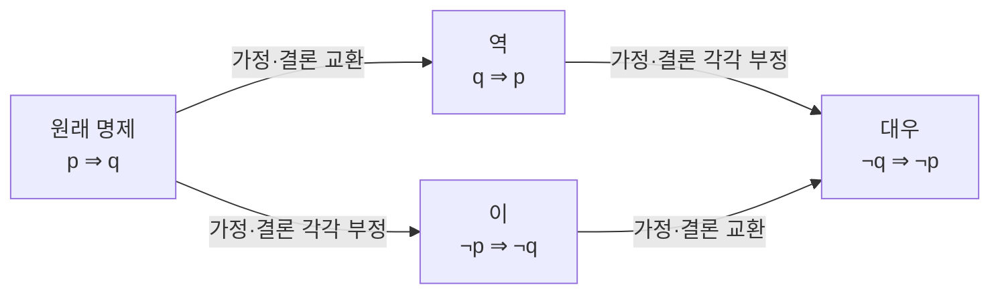

<Callout type="info">
  **이번 문서의 목표:** 이 파일을 다 읽으면 집합·논리 기호를 소리 내어 읽을 수 있고, "만약 ~라면 ~다" 형태의 수학 문장에서 역·이·대우를 만들고 참·거짓을 판단할 수 있다.
</Callout>

## 왜 기호부터 다시 잡아야 하나

독학사(독학학위제) 일반수학 시험 문제는 문장이 아니라 기호로 쓰인다. 예를 들어 "$A \subset B$이고 $x \in A$이면 $x \in B$이다"라는 한 줄에는 기호가 세 종류나 들어 있다. 이 기호들의 뜻을 하나라도 놓치면, 정작 계산은 쉬운데 **문제를 읽지 못해서** 틀리는 일이 생긴다.

> **쉽게 말하면:** 수학 기호는 특정 문장을 짧게 줄인 약속이다. 기호 하나하나를 우리말 문장으로 바꿔 말할 수 있으면 절반은 끝난 것이다.

이 편은 계산을 다루지 않는다. 대신 05편(집합과 명제)부터 본격적으로 등장할 기호·문장 구조를 미리 익혀, 뒤에서는 "이 기호가 뭐였더라"에 멈추지 않고 바로 개념과 계산에 집중할 수 있게 하는 것이 목적이다.

## 집합을 나타내는 기호

집합(set)은 "범위가 분명한 대상들의 모임"이다. 예를 들어 "1부터 5까지의 자연수"는 모임의 조건이 분명하므로 집합이지만, "키가 큰 사람들의 모임"은 "큰"의 기준이 사람마다 달라 수학적 집합이 아니다.

집합을 표기하는 방법은 두 가지다.

- **원소나열법**: 원소를 중괄호 안에 직접 쓴다. 예: $\{1, 2, 3, 4, 5\}$
- **조건제시법**: 원소가 만족할 조건을 써서 나타낸다. 예: $\{x \mid x\text{는 5 이하의 자연수}\}$ (세로줄 `|`은 "다음 조건을 만족하는"으로 읽는다)

집합을 다룰 때 가장 자주 쓰는 기호를 표로 정리한다.

| 기호 | 읽는 법 | 뜻 | 예시 |
|------|---------|----|----|
| $\in$ | "원소이다", "속한다" | 왼쪽 대상이 오른쪽 집합의 원소임 | $3 \in \{1,2,3\}$ (3은 이 집합의 원소다) |
| $\notin$ | "원소가 아니다" | 왼쪽 대상이 오른쪽 집합의 원소가 아님 | $4 \notin \{1,2,3\}$ |
| $\subset$ | "부분집합이다", "포함된다" | 왼쪽 집합의 모든 원소가 오른쪽 집합에도 있음 | $\{1,2\} \subset \{1,2,3\}$ |
| $\cup$ | "합집합", "또는" | 두 집합의 원소를 모두 합친 집합 | $\{1,2\} \cup \{2,3\} = \{1,2,3\}$ |
| $\cap$ | "교집합", "그리고" | 두 집합에 공통으로 들어 있는 원소만 모은 집합 | $\{1,2\} \cap \{2,3\} = \{2\}$ |
| $\varnothing$ | "공집합" | 원소가 하나도 없는 집합 | $\{x \mid x^2 = -1,\ x\text{는 실수}\} = \varnothing$ |
| $A^c$ | "A의 여집합" | 전체집합에서 A를 뺀 나머지 | 전체가 $\{1,2,3,4\}$이고 $A=\{1,2\}$이면 $A^c=\{3,4\}$ |

이 기호들의 계산 규칙(포함관계 판정, 합집합·교집합 문제 풀이)은 05편(집합과 명제)에서 예제와 함께 다룬다. 여기서는 **기호를 보면 바로 읽을 수 있는 것**까지만 목표로 한다.

> **비유:** 집합 기호는 벤 다이어그램을 말로 옮긴 것과 같다. $\cup$은 두 원(동그라미)을 합쳐 칠한 영역, $\cap$은 두 원이 겹치는 부분만 칠한 영역을 가리킨다고 생각하면 기호와 그림이 바로 연결된다.

## 논리 기호: 그리고·또는·아니다·그러면

명제(proposition)는 참(true) 또는 거짓(false)이 명확하게 정해지는 문장이다. "3은 홀수이다"는 참이 명확한 명제이지만, "3은 큰 수이다"는 참·거짓을 정할 기준이 없어 명제가 아니다.

여러 명제를 묶어서 더 복잡한 명제를 만들 때 아래 기호를 쓴다.

| 기호 | 이름 | 읽는 법 | 뜻 |
|------|------|---------|----|
| $\land$ | 논리곱(conjunction) | "그리고", "이고" | 앞뒤 명제가 **둘 다** 참일 때만 전체가 참 |
| $\lor$ | 논리합(disjunction) | "또는" | 앞뒤 명제 중 **하나라도** 참이면 전체가 참 |
| $\lnot$ (또는 $\sim$) | 부정(negation) | "아니다" | 명제의 참·거짓을 뒤집음 |
| $\Rightarrow$ | 조건문(implication) | "이면", "그러면" | 앞 명제가 참일 때 뒤 명제도 반드시 참 |
| $\Leftrightarrow$ | 쌍조건문(biconditional) | "일 때만", "필요충분조건" | 양쪽 명제의 참·거짓이 항상 같음 |

$\land$와 $\lor$가 참·거짓을 어떻게 정하는지는 표로 명확히 눈에 익혀 두어야 한다. 아래는 명제 $p$, $q$가 각각 참(T) 또는 거짓(F)일 때 $p \land q$와 $p \lor q$의 값이다.

| $p$ | $q$ | $p \land q$ | $p \lor q$ |
|-----|-----|-------------|------------|
| T | T | T | T |
| T | F | F | T |
| F | T | F | T |
| F | F | F | F |

> **자주 틀리는 점:** 일상 언어의 "또는"은 흔히 "둘 중 하나만"의 뜻으로 쓰인다(예: "짜장면 또는 짬뽕" — 둘 다 시키지 않는다는 뜻으로 흔히 쓴다). 그러나 수학의 $\lor$는 **둘 다 참인 경우도 참으로 포함**한다(표에서 T, T일 때도 결과가 T). 이 차이 때문에 "$p \lor q$가 거짓이려면 $p$, $q$가 모두 거짓이어야 한다"는 조건을 놓치는 실수가 많다.

## 조건문 $p \Rightarrow q$와 참·거짓

시험에서 가장 많이 나오는 문장 구조는 "$p$이면 $q$이다", 기호로 $p \Rightarrow q$다. 이때 $p$를 **가정**, $q$를 **결론**이라 부른다.

$p \Rightarrow q$가 거짓이 되는 경우는 딱 하나뿐이다. **가정 $p$가 참인데 결론 $q$가 거짓인 경우**다. 그 외의 모든 경우(가정이 거짓인 경우 포함)는 조건문 전체를 참으로 본다.

| $p$ | $q$ | $p \Rightarrow q$ |
|-----|-----|--------------------|
| T | T | T |
| T | F | F |
| F | T | T |
| F | F | T |

> **자주 틀리는 점:** "가정이 거짓이면 조건문 전체도 거짓 아닌가?"라고 잘못 생각하기 쉽다. 그러나 수학적 정의상 가정이 거짓이면 결론과 무관하게 조건문은 항상 참으로 처리한다. 예를 들어 "어떤 실수 $x$에 대해 $x^2 < 0$이면 $x = 100$이다"라는 문장은 가정 $x^2<0$을 만족하는 실수가 아예 없으므로(가정이 항상 거짓), 이 조건문 자체는 참인 문장으로 취급된다. 실제 시험에서는 이런 극단적 사례보다 "가정을 만족하는 대상이 있을 때 결론이 실제로 성립하는가"를 묻는 문제가 대부분이지만, 참·거짓 정의 자체를 묻는 문항이 나오면 이 규칙을 기준으로 판단해야 한다.

## 역·이·대우: 같은 재료로 만드는 세 가지 문장

원래 조건문 $p \Rightarrow q$가 있을 때, 이를 재료로 세 가지 새로운 문장을 만들 수 있다.

| 이름 | 기호 | 문장 형태 |
|------|------|-----------|
| 역(converse) | $q \Rightarrow p$ | 가정과 결론을 서로 바꾼다 |
| 이(inverse) | $\lnot p \Rightarrow \lnot q$ | 가정과 결론을 각각 부정한다 |
| 대우(contrapositive) | $\lnot q \Rightarrow \lnot p$ | 역을 만들고, 그 가정과 결론을 각각 부정한다 |

이 네 문장의 관계를 흐름으로 보면 다음과 같다.

여기서 시험에 가장 자주 나오는 핵심 성질은 다음 하나다.

> **원래 명제와 대우는 참·거짓이 항상 일치한다.** 반면 원래 명제와 역(또는 이)의 참·거짓은 서로 무관하다 — 하나가 참이어도 다른 하나는 참일 수도, 거짓일 수도 있다.

### 예시로 직접 확인하기

명제: "$x = 2$이면 $x^2 = 4$이다." ($p$: $x=2$, $q$: $x^2=4$)

- **원래 명제** ($p \Rightarrow q$): $x=2$이면 $x^2 = 2^2 = 4$이므로 **참**이다.
- **역** ($q \Rightarrow p$): "$x^2=4$이면 $x=2$이다." 그런데 $x=-2$일 때도 $x^2 = (-2)^2 = 4$이지만 $x=2$는 아니다. 반례가 존재하므로 **거짓**이다.
- **이** ($\lnot p \Rightarrow \lnot q$): "$x \ne 2$이면 $x^2 \ne 4$이다." $x=-2$는 $2$가 아니지만 $x^2=4$이므로 이 문장도 반례가 있어 **거짓**이다. (이는 역의 대우이므로 역과 참·거짓이 항상 같다.)
- **대우** ($\lnot q \Rightarrow \lnot p$): "$x^2 \ne 4$이면 $x \ne 2$이다." $x^2 \ne 4$라는 것은 $x$가 $2$도 $-2$도 아니라는 뜻이므로, 당연히 $x \ne 2$다. **참**이다. (원래 명제가 참이므로 대우도 참 — 규칙과 일치한다.)

이 예시에서 원래 명제(참)와 대우(참)는 결과가 일치했고, 역(거짓)과 이(거짓)도 서로 일치했다(역과 이는 서로 대우 관계이기 때문이다). 이 성질은 이후 05편에서 "필요조건·충분조건"을 판단할 때, 그리고 12편 이후 "정의역 조건"을 뒤집어 확인할 때 그대로 재사용된다.

## 필요조건과 충분조건, 그리고 $\Leftrightarrow$

$p \Rightarrow q$가 참일 때, 이 관계를 다음과 같이도 부른다.

- $p$는 $q$이기 위한 **충분조건**이다 (p 하나만 있으면 q가 성립하기에 충분하다)
- $q$는 $p$이기 위한 **필요조건**이다 (p가 성립하려면 최소한 q는 반드시 필요하다)

만약 $p \Rightarrow q$와 그 역 $q \Rightarrow p$가 **모두** 참이면, $p$와 $q$는 서로 **필요충분조건**이며 이를 $p \Leftrightarrow q$로 쓴다. "$p$일 때만 $q$이고, $q$일 때만 $p$이다"로 읽는다.

> **쉽게 말하면:** 화살표가 한쪽으로만 성립하면 "충분·필요" 중 하나, 양쪽 다 성립하면 "필요충분(동치)"이다.

## 핵심 정리

- 집합 기호 $\in, \subset, \cup, \cap, \varnothing$은 벤 다이어그램의 "포함", "합침", "겹침", "빈 영역"과 바로 대응한다.
- $\land$(그리고)는 둘 다 참일 때만, $\lor$(또는)는 하나라도 참이면 전체가 참이 된다. 특히 $\lor$는 둘 다 참인 경우도 참에 포함한다.
- $p \Rightarrow q$는 "가정이 참인데 결론이 거짓"인 경우에만 거짓이고, 나머지 경우는 모두 참이다.
- 원래 명제와 **대우**는 참·거짓이 항상 일치한다. 역과 이는 서로 대우 관계이므로 참·거짓이 항상 일치하지만, 원래 명제와는 무관하다.
- $p \Rightarrow q$가 참이면 $p$는 충분조건, $q$는 필요조건이며, 역도 참이면 필요충분조건(동치)이다.

## 마무리 복습

<Quiz
  questionNumber={1}
  question="집합 A = {1, 2, 3}, B = {2, 3, 4}일 때 A ∩ B를 구하면?"
  options={['{1,2,3,4}', '{2,3}', '{1}', '공집합']}
  correctAnswer={2}
  explanation="교집합(∩)은 두 집합에 공통으로 들어 있는 원소만 모은 것이다. A와 B에 공통으로 있는 원소는 2와 3이므로 A ∩ B = {2,3}이다."
  optionExplanations={['이것은 합집합(∪)의 결과다. 교집합은 공통 원소만 모으므로 이 값은 아니다', '정답. 2와 3이 A, B 양쪽에 모두 있으므로 교집합은 {2,3}이다', '1은 A에만 있고 B에는 없으므로 교집합의 원소가 아니다', 'A와 B에 공통 원소 2, 3이 존재하므로 공집합이 아니다']}
/>

<Quiz
  questionNumber={2}
  question="명제 p가 거짓이고 q가 참일 때, p ⇒ q의 참·거짓은?"
  options={['참이다', '거짓이다', '항상 정할 수 없다', 'p와 q가 같은 값일 때만 참이다']}
  correctAnswer={1}
  explanation="p ⇒ q가 거짓이 되는 유일한 경우는 가정 p가 참이고 결론 q가 거짓인 경우뿐이다. 여기서는 p가 거짓이므로 이 경우에 해당하지 않아 조건문은 참으로 처리된다."
  optionExplanations={['정답. 가정이 거짓이면 결론과 무관하게 조건문 전체는 참으로 정의된다', 'p ⇒ q가 거짓이려면 p가 참이고 q가 거짓이어야 하는데, 여기서는 p가 거짓이므로 이 조건에 해당하지 않는다', '조건문의 참·거짓은 p, q의 참·거짓 조합으로 항상 정할 수 있다', 'p와 q의 값이 같아야 참이 되는 것은 쌍조건문(⇔)의 이야기이며 단순 조건문(⇒)의 정의와는 다르다']}
/>

<Quiz
  questionNumber={3}
  question="명제 '비가 오면 우산을 쓴다'의 대우로 옳은 것은?"
  options={['우산을 쓰면 비가 온다', '비가 오지 않으면 우산을 쓰지 않는다', '우산을 쓰지 않으면 비가 오지 않는다', '우산을 쓰지 않으면 비가 온다']}
  correctAnswer={3}
  explanation="원래 명제가 p ⇒ q(비가 온다 ⇒ 우산을 쓴다)일 때, 대우는 ¬q ⇒ ¬p, 즉 결론을 부정한 것이 가정이 되고 가정을 부정한 것이 결론이 된다. '우산을 쓰지 않으면(¬q) 비가 오지 않는다(¬p)'가 대우다."
  optionExplanations={['이것은 가정과 결론을 그대로 바꾼 역(q ⇒ p)이다. 대우가 아니다', '이것은 가정과 결론을 각각 부정만 한 이(¬p ⇒ ¬q)다. 대우는 부정과 교환을 함께 해야 한다', '정답. 대우는 결론의 부정(우산을 쓰지 않으면)이 새 가정이 되고, 가정의 부정(비가 오지 않는다)이 새 결론이 된다', '이는 원래 명제나 역, 이 어디에도 해당하지 않는 문장이며 대우의 형태와도 다르다']}
/>

<Quiz
  questionNumber={4}
  question="'또는(∨)'에 대한 설명으로 옳지 않은 것은?"
  options={['p, q가 모두 거짓일 때만 p ∨ q가 거짓이다', 'p, q 중 하나만 참이어도 p ∨ q는 참이다', 'p, q가 모두 참이면 p ∨ q는 거짓이다', 'p, q가 모두 참이어도 p ∨ q는 참이다']}
  correctAnswer={3}
  explanation="수학의 논리합(∨)은 두 명제 중 적어도 하나가 참이면 참이 되며, 둘 다 참인 경우도 참에 포함한다. 따라서 '모두 참이면 거짓이다'는 옳지 않은 설명이다."
  optionExplanations={['옳은 설명이다. 진리표에서 F, F일 때만 결과가 F다', '옳은 설명이다. 하나라도 참이면 전체가 참이 되는 것이 논리합의 정의다', '정답(옳지 않은 설명). 모두 참이면 오히려 참이 되므로 이 설명은 틀렸다', '옳은 설명이다. T, T인 경우도 논리합에서는 참으로 포함된다']}
/>

<Quiz
  questionNumber={5}
  question="p ⇒ q가 참이고 그 역 q ⇒ p도 참일 때, p와 q의 관계를 부르는 이름은?"
  options={['충분조건 관계', '필요조건 관계', '필요충분조건(동치) 관계', '아무 관계도 아니다']}
  correctAnswer={3}
  explanation="p ⇒ q와 q ⇒ p가 모두 참이면 p와 q는 서로 필요충분조건이며, 이를 p ⇔ q로 표기하고 동치라고 부른다."
  optionExplanations={['충분조건은 p ⇒ q만 참일 때 p를 부르는 이름이며, 역까지 참인 경우를 포괄하지 못한다', '필요조건은 q를 부르는 이름 중 하나일 뿐, 양방향이 모두 성립하는 관계 전체를 가리키지 않는다', '정답. 양방향 조건문이 모두 참이면 필요충분조건, 기호로 p ⇔ q라 한다', '양방향 조건문이 모두 참이라는 것은 매우 강한 논리적 관계이므로 아무 관계도 아니라는 설명은 틀렸다']}
/>

<Quiz
  questionNumber={6}
  question="집합 A = {x | x는 10 이하의 짝수인 자연수}를 원소나열법으로 옳게 나타낸 것은?"
  options={['{2,4,6,8,10}', '{1,3,5,7,9}', '{2,4,6,8}', '{0,2,4,6,8,10}']}
  correctAnswer={1}
  explanation="10 이하의 자연수 중 짝수를 모두 나열하면 2, 4, 6, 8, 10이다. 자연수는 1부터 시작하므로 0은 포함하지 않는다."
  optionExplanations={['정답. 10 이하의 짝수인 자연수를 빠짐없이 나열하면 2,4,6,8,10이다', '이 목록은 홀수 목록이며 조건(짝수)을 만족하지 않는다', '10을 빠뜨렸다. 10도 10 이하의 짝수인 자연수이므로 포함해야 한다', '자연수는 1부터 시작하므로 0은 자연수가 아니다. 0을 포함하면 틀린 나열이다']}
/>

## 참고 자료

- [국가평생교육진흥원 독학학위제](https://bdes.nile.or.kr)
- [Wolfram MathWorld — Logic](https://mathworld.wolfram.com)
