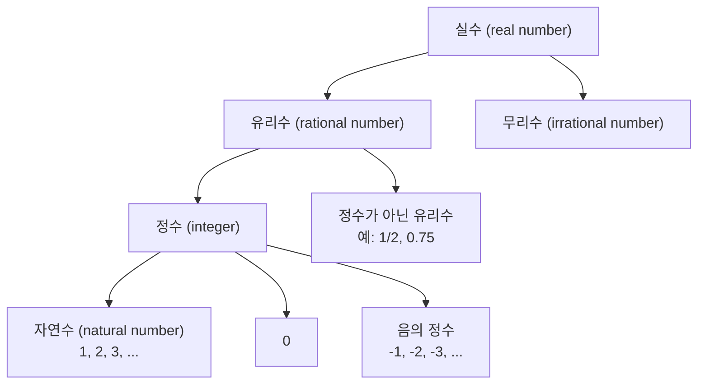

<Callout type="info">
  **이번 문서의 목표:** 이 파일을 다 읽으면 실수의 종류를 구분하고, 좌표평면 위 그래프를 함수의 언어로 해석하며, 정의역·치역·일대일함수 같은 용어를 뜻 그대로 설명할 수 있다.
</Callout>

## 왜 실수부터 다시 정리하나

06편부터 다항함수·유리함수·지수함수·로그함수를 다루려면, 그 함수들이 "어떤 수 위에서" 정의되는지부터 정확히 알아야 한다. 예를 들어 $\sqrt{x}$는 $x$가 음수이면 실수 범위에서 정의되지 않고, $\log x$도 $x \le 0$이면 정의되지 않는다. 이런 조건을 판단하려면 먼저 **수의 종류**와 **정의역**이라는 개념이 몸에 배어 있어야 한다.

> **쉽게 말하면:** 함수는 "입력을 넣으면 출력이 하나 나오는 규칙"이고, 정의역은 "그 규칙에 넣어도 되는 입력들의 범위"다.

## 실수의 종류: 자연수부터 무리수까지

실수(real number)는 수직선 위에 점으로 나타낼 수 있는 모든 수를 말한다. 실수는 다음과 같이 갈래를 나눌 수 있다.

- **자연수(natural number)**: 물건을 셀 때 쓰는 가장 기본적인 수. $1, 2, 3, \dots$
- **정수(integer)**: 자연수에 $0$과 음수를 더한 것. $\dots, -2, -1, 0, 1, 2, \dots$
- **유리수(rational number)**: 두 정수의 비율(분수)로 나타낼 수 있는 수. 정의는 $\dfrac{p}{q}$ 꼴(단, $p, q$는 정수이고 $q \ne 0$)로 쓸 수 있는 모든 수다. $0.75 = \dfrac{3}{4}$처럼 유한소수도, $0.333\dots = \dfrac{1}{3}$처럼 같은 숫자가 반복되는 무한소수(순환소수)도 유리수에 포함된다.
- **무리수(irrational number)**: 두 정수의 비율로 나타낼 수 **없는** 수. 소수로 쓰면 순환하지 않고 끝없이 이어진다. 대표적으로 $\sqrt{2} = 1.41421356\dots$, 원주율 $\pi = 3.14159265\dots$가 있다.

> **자주 틀리는 점:** "소수는 다 무리수"라고 착각하기 쉽지만, $0.5$나 $0.333\dots$처럼 유한하거나 순환하는 소수는 모두 유리수다. 무리수인지 판단하는 기준은 "순환하지 않고 끝없이 이어지는가"이다.

이 분류가 왜 중요한가 하면, 04편의 지수·로그함수와 06편의 무리함수에서 "정의역이 실수 전체인가, 특정 구간으로 제한되는가"를 판단할 때 이 개념이 그대로 쓰이기 때문이다.

## 좌표축과 그래프 읽는 법

좌표평면(coordinate plane)은 가로축(x축)과 세로축(y축)이 직각으로 만나는 평면이다. 평면 위의 한 점은 순서쌍 $(x, y)$로 나타낸다. 여기서 $x$는 그 점이 가로로 얼마나 이동했는지, $y$는 세로로 얼마나 이동했는지를 뜻한다.

좌표평면은 두 축에 의해 네 구역(사분면, quadrant)으로 나뉜다.

| 사분면 | $x$의 부호 | $y$의 부호 | 예시 점 |
|--------|-----------|-----------|---------|
| 제1사분면 | 양수 | 양수 | $(2, 3)$ |
| 제2사분면 | 음수 | 양수 | $(-2, 3)$ |
| 제3사분면 | 음수 | 음수 | $(-2, -3)$ |
| 제4사분면 | 양수 | 음수 | $(2, -3)$ |

> **비유:** 좌표평면은 건물 안 위치를 "몇 동, 몇 층"으로 나타내는 것과 비슷하다. $x$는 "몇 동"(가로 위치), $y$는 "몇 층"(세로 위치)에 해당한다.

**그래프**(graph)란 어떤 규칙을 만족하는 점 $(x, y)$를 좌표평면 위에 모두 찍어 놓은 그림이다. 예를 들어 $y = x$의 그래프는 $x$와 $y$ 값이 항상 같은 점들, 즉 $(0,0), (1,1), (2,2), (-1,-1)$ 등을 이은 직선이다.

그래프를 읽을 때 가장 먼저 확인해야 할 세 가지는 다음과 같다.

1. **어느 $x$ 값에서 그래프가 존재하는가** (정의역과 연결됨)
2. **그래프가 $x$축을 지나는 지점**(x절편)과 **$y$축을 지나는 지점**(y절편)은 어디인가
3. **$x$가 커질 때 그래프가 올라가는가(증가), 내려가는가(감소)**

## 함수란 무엇인가

**함수**(function)는 집합 $X$의 각 원소에 집합 $Y$의 원소를 **정확히 하나씩** 대응시키는 규칙이다. 기호로는 $f: X \to Y$ 또는 $y = f(x)$로 쓴다.

- **정의역(domain)**: 함수에 넣을 수 있는 입력값 전체의 집합. 위 정의에서 $X$에 해당한다.
- **공역(codomain)**: 출력이 나올 수 있는 후보 집합 전체. 위 정의에서 $Y$에 해당한다.
- **치역(range)**: 실제로 출력으로 나오는 값들만 모은 집합. 공역의 부분집합이다.

> **쉽게 말하면:** 정의역은 "넣을 수 있는 재료 목록", 공역은 "나올 수 있다고 미리 정해 둔 그릇 크기", 치역은 "실제로 그릇에 담긴 결과물"이라고 생각하면 된다.

### 함수가 되려면: "정확히 하나씩"이 핵심

함수의 정의에서 가장 중요한 조건은 "정의역의 각 원소에 **오직 하나의** 출력만 대응한다"는 것이다. 하나의 입력에 출력이 둘 이상 나오면 함수가 아니다.

**예시:** $X = \{1, 2, 3\}$에서 $Y = \{4, 5, 6, 7\}$로 가는 대응을 생각해 보자.

- 대응 A: $1 \to 4$, $2 \to 5$, $3 \to 6$ — 각 입력에 출력이 정확히 하나씩이므로 **함수다**.
- 대응 B: $1 \to 4$, $1 \to 5$, $2 \to 6$, $3 \to 7$ — 입력 $1$에 출력이 $4$와 $5$ 두 개 대응하므로 **함수가 아니다**.

이를 그래프로 확인하는 방법이 **수직선 판정법**(vertical line test)이다. 그래프 위 어떤 $x$ 값에서 수직으로 선을 그었을 때, 그 선이 그래프와 두 점 이상에서 만나면 그 $x$에 출력이 둘 이상 있다는 뜻이므로 함수가 아니다. 예를 들어 원 $x^2 + y^2 = 1$의 그래프는 $x=0$에서 수직선을 그으면 $y=1$과 $y=-1$ 두 점을 지나므로, 이 원은 $y$를 $x$의 함수로 나타낸 것이 아니다.

## 일대일함수와 전단사: 대응의 성질 구분하기

함수 중에서도 대응 방식에 따라 몇 가지 이름이 붙는다. 이 개념은 06편의 역함수, 17–18편의 역행렬 존재 조건과 바로 연결되므로 직관을 잘 잡아 두어야 한다.

- **일대일함수(injective, 단사함수)**: 서로 다른 입력은 항상 서로 다른 출력으로 간다. 즉 $x_1 \ne x_2$이면 반드시 $f(x_1) \ne f(x_2)$다. 바꿔 말하면, 하나의 출력값에 대응하는 입력이 최대 하나뿐이다.
- **전사함수(surjective, 위로의 함수)**: 공역의 모든 원소가 빠짐없이 치역에 포함된다. 즉 치역과 공역이 완전히 같다.
- **전단사함수(bijective, 일대일대응)**: 일대일함수이면서 동시에 전사함수인 경우. 입력과 출력이 정확히 짝을 이루어, 출력에서 입력으로 거꾸로 되짚어 갈 수 있다.

| 용어 | 조건 | 직관 |
|------|------|------|
| 일대일함수 | 다른 입력 → 다른 출력 | 출력이 겹치지 않는다 |
| 전사함수 | 치역 = 공역 | 공역에 남는 자리가 없다 |
| 전단사함수 | 일대일 + 전사 | 입력과 출력이 완전히 1:1로 짝지어진다 |

> **비유:** 반 학생들에게 사물함을 배정하는 상황을 생각해 보자. 일대일함수는 "한 사물함에 학생이 두 명 배정되는 일이 없다"는 뜻이고, 전사함수는 "빈 사물함이 하나도 남지 않는다"는 뜻이다. 두 조건을 모두 만족하면(전단사) 학생 수와 사물함 수가 정확히 같고, 학생과 사물함이 완벽하게 하나씩 짝지어진다.

**예시로 확인하기:** $f: \{1,2,3\} \to \{4,5,6\}$, $f(1)=4, f(2)=5, f(3)=6$일 때, 서로 다른 입력이 서로 다른 출력으로 가고(일대일), 공역 $\{4,5,6\}$의 원소가 빠짐없이 치역에 나타나므로(전사) 이 함수는 전단사함수다.

반면 $g: \{1,2,3\} \to \{4,5\}$, $g(1)=4, g(2)=4, g(3)=5$는 입력 $1$과 $2$가 같은 출력 $4$로 가므로 일대일함수가 아니다.

> **자주 틀리는 점:** "치역과 공역이 다르면 함수가 아니다"라고 오해하기 쉽지만, 치역이 공역의 부분집합이기만 하면 함수의 정의 자체는 만족한다. 치역과 공역이 다르면 단지 **전사함수가 아닐 뿐**이지, 함수가 아닌 것은 아니다.

이 세 가지 성질은 06편에서 역함수가 존재하기 위한 조건("전단사함수여야 역함수가 존재한다")으로, 그리고 18편에서 역행렬이 존재하기 위한 직관("행렬이 나타내는 대응이 전단사인가")으로 다시 등장한다. 여기서는 계산 없이 "대응 방식을 구분하는 눈"만 만들어 둔다.

## 핵심 정리

- 실수는 유리수(정수 포함)와 무리수로 나뉜다. 순환소수는 유리수, 순환하지 않는 무한소수는 무리수다.
- 좌표평면의 점은 $(x, y)$로 나타내고, 그래프는 규칙을 만족하는 점들의 모임이다.
- 함수는 정의역의 각 원소에 출력을 정확히 하나씩 대응시키는 규칙이며, 수직선 판정법으로 함수 여부를 확인할 수 있다.
- 정의역은 입력 전체, 공역은 출력 후보 전체, 치역은 실제 출력값 전체를 뜻한다.
- 일대일함수는 "다른 입력 → 다른 출력", 전사함수는 "치역 = 공역", 전단사함수는 둘 다 만족하는 경우다.

## 마무리 복습

<Quiz
  questionNumber={1}
  question="다음 중 무리수인 것은?"
  options={['0.333...(3이 무한히 반복)', '0.75', '루트2', '1/2']}
  correctAnswer={3}
  explanation="루트2(제곱근 2)는 소수로 나타내면 1.41421356...으로 순환하지 않고 끝없이 이어지므로 무리수다. 나머지는 모두 두 정수의 비율(분수)로 나타낼 수 있는 유리수다."
  optionExplanations={['0.333...은 1/3로 나타낼 수 있는 순환소수이므로 유리수다', '0.75는 3/4로 나타낼 수 있는 유한소수이므로 유리수다', '정답. 루트2는 순환하지 않는 무한소수이므로 무리수다', '1/2은 정의 그대로 두 정수의 비율이므로 유리수다']}
/>

<Quiz
  questionNumber={2}
  question="점 (-3, 5)가 속한 사분면은?"
  options={['제1사분면', '제2사분면', '제3사분면', '제4사분면']}
  correctAnswer={2}
  explanation="x좌표가 음수(-3)이고 y좌표가 양수(5)인 경우는 제2사분면이다. 사분면은 x축의 왼쪽/오른쪽, y축의 위/아래 조합으로 정해진다."
  optionExplanations={['제1사분면은 x, y가 모두 양수인 경우다', '정답. x가 음수, y가 양수이면 제2사분면이다', '제3사분면은 x, y가 모두 음수인 경우다', '제4사분면은 x가 양수, y가 음수인 경우다']}
/>

<Quiz
  questionNumber={3}
  question="원 x² + y² = 4의 그래프가 y를 x의 함수로 나타내지 못하는 이유는?"
  options={['정의역이 존재하지 않아서', '어떤 x 값에 y 출력이 두 개 대응해서', '치역이 공역보다 커서', '그래프가 직선이 아니라서']}
  correctAnswer={2}
  explanation="예를 들어 x=0일 때 y² = 4이므로 y = 2 또는 y = -2가 되어 하나의 입력 x=0에 출력이 두 개 대응한다. 함수는 하나의 입력에 출력이 정확히 하나여야 하므로 이 원은 함수가 아니다(수직선 판정법으로 확인할 수 있다)."
  optionExplanations={['정의역 자체는 -2에서 2까지 존재한다. 문제는 정의역의 존재 여부가 아니다', '정답. x=0에서 y=2와 y=-2 두 값이 나오므로 함수의 정의(출력이 하나)를 위반한다', '치역이 공역보다 커지는 것은 애초에 불가능하다(치역은 공역의 부분집합이다), 이는 함수가 아닌 이유가 될 수 없다', '그래프의 모양(직선인지 곡선인지)은 함수 여부와 직접 관련이 없다']}
/>

<Quiz
  questionNumber={4}
  question="함수 f(x) = x²을 정의역이 실수 전체일 때 생각하면, 이 함수가 일대일함수가 아닌 이유는?"
  options={['치역이 존재하지 않아서', 'f(2) = f(-2) = 4처럼 다른 입력이 같은 출력을 내서', '정의역이 무한집합이라서', '공역이 실수 전체라서']}
  correctAnswer={2}
  explanation="일대일함수는 서로 다른 입력이 항상 서로 다른 출력으로 가야 한다. 그런데 f(2)=4, f(-2)=4로 입력 2와 -2가 같은 출력 4로 가므로 이 조건을 위반해 일대일함수가 아니다."
  optionExplanations={['치역은 0 이상의 실수 전체로 명확히 존재한다', '정답. 서로 다른 입력 2와 -2가 같은 출력 4를 내므로 일대일 조건을 위반한다', '정의역이 무한집합이라는 사실 자체는 일대일 여부와 무관하다', '공역의 크기 자체는 일대일 여부를 결정하지 않는다. 문제는 대응 방식이다']}
/>

<Quiz
  questionNumber={5}
  question="함수 f: X → Y가 전사함수라는 것은 무엇을 뜻하는가?"
  options={['정의역과 공역의 원소 개수가 같다', '치역과 공역이 일치한다', '서로 다른 입력이 서로 다른 출력을 낸다', '정의역의 원소가 하나뿐이다']}
  correctAnswer={2}
  explanation="전사함수는 공역의 모든 원소가 빠짐없이 실제 출력(치역)에 나타나는 경우, 즉 치역과 공역이 완전히 같은 경우를 말한다."
  optionExplanations={['원소 개수가 같은 것은 전사의 결과로 나타날 수는 있지만 전사의 정의 자체는 아니다', '정답. 전사함수는 치역이 공역 전체를 빠짐없이 채우는 경우다', '이것은 전사함수가 아니라 일대일함수(단사함수)의 정의다', '정의역 원소 개수와 전사 여부는 직접 관련이 없다']}
/>

## 참고 자료

- [국가평생교육진흥원 독학학위제](https://bdes.nile.or.kr)
- [Wolfram MathWorld — Function](https://mathworld.wolfram.com)
