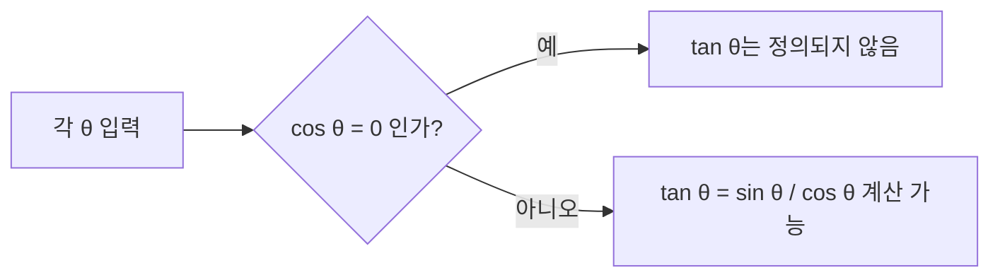

<Callout type="info">
  **이번 문서의 목표:** 이 파일을 다 읽으면 sin·cos·tan의 정의와 대략적인 그래프 모양을 설명하고, 지수함수와 로그함수가 서로 어떤 관계인지, 기본 성질이 왜 성립하는지 말할 수 있다.
</Callout>

## 왜 이 세 함수를 미리 묶어서 보나

06편(함수의 종류와 그래프)에서는 다항함수·유리함수·무리함수와 함께 지수함수·로그함수의 그래프와 성질을 더 깊이 다루고, 13편 이후 미분·적분에서는 삼각함수·지수함수·로그함수의 미분·적분 공식이 반복해서 등장한다. 이 편은 그 모든 계산에 앞서, **"이 함수가 무엇을 뜻하는가"** 라는 가장 기초적인 그림을 그려 두는 자리다. 식 변형이나 미분·적분 공식은 다루지 않는다.

> **쉽게 말하면:** 삼각함수는 "각도를 넣으면 비율이 나오는 함수", 지수함수는 "지수 자리에 변수를 넣는 함수", 로그함수는 "지수함수를 거꾸로 뒤집은 함수"다.

## 삼각함수: 각과 비율을 잇는 함수

**삼각함수**(trigonometric function)는 각의 크기를 입력하면, 직각삼각형 세 변의 비율을 출력하는 함수다.

각 $\theta$(세타, 각의 크기를 나타낼 때 흔히 쓰는 그리스 문자)를 갖는 직각삼각형에서, 각 $\theta$에 마주보는 변을 **높이**, 각 $\theta$를 낀 변 중 직각이 아닌 변을 **밑변**, 직각의 대변(가장 긴 변)을 **빗변**이라 하면 세 가지 기본 삼각함수는 다음과 같이 정의된다.

| 기호 | 이름 | 읽는 법 | 정의(직각삼각형 비율) |
|------|------|---------|------------------------|
| $\sin\theta$ | 사인 | "사인 세타" | $\dfrac{\text{높이}}{\text{빗변}}$ |
| $\cos\theta$ | 코사인 | "코사인 세타" | $\dfrac{\text{밑변}}{\text{빗변}}$ |
| $\tan\theta$ | 탄젠트 | "탄젠트 세타" | $\dfrac{\text{높이}}{\text{밑변}} = \dfrac{\sin\theta}{\cos\theta}$ |

> **비유:** 산을 오르는 경사로를 생각해 보자. 경사각이 커질수록 같은 거리를 가도 더 높이 올라간다. $\sin\theta$는 "이동한 거리(빗변) 중에서 실제로 높아진 비율", $\cos\theta$는 "실제로 앞으로 나아간 비율"이라고 보면 된다.

### 대표적인 각의 값

시험에서 자주 쓰는 특수각의 값을 직접 확인해 보자. 한 변의 길이가 $1$인 정삼각형을 반으로 잘라 만든 직각삼각형(빗변 $1$, 밑변 $\dfrac{1}{2}$, 높이 $\dfrac{\sqrt{3}}{2}$)을 이용하면 $30°$와 $60°$의 값을, 직각이등변삼각형을 이용하면 $45°$의 값을 구할 수 있다.

| $\theta$ | $\sin\theta$ | $\cos\theta$ | $\tan\theta$ |
|----------|--------------|--------------|--------------|
| $0°$ | $0$ | $1$ | $0$ |
| $30°$ | $\dfrac{1}{2}$ | $\dfrac{\sqrt{3}}{2}$ | $\dfrac{\sqrt{3}}{3}$ |
| $45°$ | $\dfrac{\sqrt{2}}{2}$ | $\dfrac{\sqrt{2}}{2}$ | $1$ |
| $60°$ | $\dfrac{\sqrt{3}}{2}$ | $\dfrac{1}{2}$ | $\sqrt{3}$ |
| $90°$ | $1$ | $0$ | 정의되지 않음 |

$\theta=45°$의 경우를 직접 검산해 보면, $\tan 45° = \dfrac{\sin 45°}{\cos 45°} = \dfrac{\sqrt{2}/2}{\sqrt{2}/2} = 1$로 표의 값과 일치한다.

> **자주 틀리는 점:** $\theta = 90°$에서 $\tan\theta$는 정의되지 않는다. $\tan\theta = \dfrac{\sin\theta}{\cos\theta}$인데 $\cos 90° = 0$이라 분모가 $0$이 되기 때문이다. "0으로 나누기는 정의되지 않는다"는 원칙이 삼각함수에도 그대로 적용된다.

### 삼각함수를 각도가 아닌 함수로 보기: 그래프

각 $\theta$를 가로축(radian 단위, 즉 각도를 호의 길이 비율로 나타낸 단위를 흔히 씀)에, 함수 값을 세로축에 놓고 그래프를 그리면 다음과 같은 특징이 나타난다.

| 함수 | 정의역 | 치역 | 주기 | 그래프 모양 |
|------|--------|------|------|-------------|
| $y=\sin\theta$ | 실수 전체 | $[-1, 1]$ | $360°$ (라디안 $2\pi$) | $0$에서 시작해 물결치듯 오르내림 |
| $y=\cos\theta$ | 실수 전체 | $[-1, 1]$ | $360°$ (라디안 $2\pi$) | $1$에서 시작해 물결치듯 오르내림 |
| $y=\tan\theta$ | $90°+180°\times n$을 제외한 실수 전체 | 실수 전체 | $180°$ (라디안 $\pi$) | 일정 구간마다 급격히 치솟았다가 끊기고 다시 시작 |

- **주기(period)**: 그래프가 똑같은 모양을 반복하는 데 걸리는 간격. $\sin$과 $\cos$은 $360°$마다, $\tan$은 $180°$마다 같은 모양이 반복된다.
- $\tan\theta$의 정의역에서 제외되는 지점은 $\cos\theta = 0$이 되는 지점, 즉 $90°, 270°, \dots$처럼 $90°$에 $180°$의 배수를 더한 각들이다.

이 그래프의 정확한 개형을 이용해 방정식·부등식을 푸는 방법, 그리고 미분·적분 공식은 06편과 13–16편에서 다룬다. 이 편에서는 "sin·cos는 $-1$과 $1$ 사이를 오간다", "tan은 특정 각에서 정의되지 않는다"는 그림만 확실히 잡아 둔다.

## 지수함수: 지수 자리에 변수를 놓은 함수

**지수함수**(exponential function)는 밑(base)이 고정된 양수이고, 지수(exponent) 자리에 변수 $x$가 들어가는 함수다.

$$
y = a^x \quad (a>0,\ a \ne 1)
$$

- $a$: **밑**이라 부르며, $0$보다 크고 $1$이 아닌 고정된 수여야 한다.
- $x$: 지수 자리에 오는 변수. 정의역은 실수 전체다.

밑에 조건이 붙는 이유가 있다. $a=1$이면 $1^x$은 $x$가 어떤 값이어도 항상 $1$이 되어 버려 의미 있는 함수가 되지 못한다. $a \le 0$이면 $a^{1/2}$처럼 지수가 분수일 때 실수 범위에서 값이 정의되지 않는 경우가 생긴다(예: $(-4)^{1/2} = \sqrt{-4}$는 실수가 아니다). 그래서 밑은 항상 $a>0, a\ne1$으로 제한한다.

**예시:** $y = 2^x$에서 $x$에 값을 넣어 확인해 보자.

$$
2^0 = 1,\quad 2^1 = 2,\quad 2^2 = 4,\quad 2^3 = 8,\quad 2^{-1} = \frac{1}{2},\quad 2^{-2} = \frac{1}{4}
$$

$x$가 커질수록 값이 빠르게 커지고, $x$가 음수 쪽으로 갈수록 $0$에 가까워지지만 결코 $0$이 되지는 않는다.

| 밑 $a$의 범위 | 그래프 방향 | 예시 |
|---------------|-------------|------|
| $a > 1$ | $x$가 커질수록 $y$도 커짐(증가) | $y = 2^x$ |
| $0 < a < 1$ | $x$가 커질수록 $y$는 작아짐(감소) | $y = \left(\dfrac{1}{2}\right)^x$ |

지수함수의 그래프는 항상 $x$축(즉 $y=0$)에 한없이 가까워지지만 절대 닿지 않는다. 이런 선을 **점근선**(asymptote)이라 부른다. 또한 $x=0$을 넣으면 $a^0=1$이므로, 밑이 무엇이든 지수함수의 그래프는 항상 점 $(0,1)$을 지난다.

> **쉽게 말하면:** 지수함수는 "매 단계마다 같은 배율로 곱해지는 변화"를 나타낸다. 03편에서 다룬 등비수열이 정수 단계에서 이런 변화를 보여주는 예라면, 지수함수는 그 변화를 모든 실수 $x$로 매끄럽게 확장한 것이다.

## 로그함수: 지수함수를 거꾸로 뒤집은 함수

**로그**(logarithm)는 "밑을 몇 제곱해야 특정 값이 되는가"를 답으로 내놓는 연산이다.

$$
\log_a N = x \iff a^x = N \quad (a>0,\ a\ne1,\ N>0)
$$

- $\log_a N$: "로그 에이 엔" 또는 "$a$를 밑으로 하는 $N$의 로그"라고 읽는다.
- $a$: **밑**. 지수함수와 마찬가지로 $0$보다 크고 $1$이 아니어야 한다.
- $N$: **진수**(眞數)라 부르며, 로그를 취하는 대상. 반드시 양수여야 한다.
- $x$: "$a$를 몇 제곱해야 $N$이 되는가"에 대한 답.

이 정의에서 로그와 지수는 **서로 뒤집힌 관계**임을 알 수 있다. $\log_a N = x$라는 말은 "$a^x = N$"이라는 말을 다르게 쓴 것일 뿐이다. 실제로 로그함수 $y=\log_a x$는 지수함수 $y=a^x$의 **역함수**다(역함수의 정확한 뜻과 성질은 02편의 전단사 개념, 06편의 역함수를 참고).

**예시로 직접 확인하기:** $\log_2 8$을 구해 보자. 이는 "$2$를 몇 제곱해야 $8$이 되는가"를 묻는 것이다.

$$
2^3 = 8 \implies \log_2 8 = 3
$$

$\log_{10} 100$도 마찬가지로 확인한다.

$$
10^2 = 100 \implies \log_{10} 100 = 2
$$

> **자주 틀리는 점:** 진수 조건($N>0$)을 빠뜨리는 실수가 매우 흔하다. $\log_2(-4)$나 $\log_2 0$은 애초에 정의되지 않는다 — "$2$를 몇 제곱해도 $-4$나 $0$이 나올 수 없기" 때문이다. 로그가 들어간 방정식·부등식을 풀 때는 답을 구한 뒤에도 반드시 **진수가 양수인지 다시 확인**해야 하며, 이 부분은 07편(방정식·부등식)과 12편(극한 계산 기법)에서 실수를 줄이는 핵심 검산 단계로 다시 강조된다.

### 로그의 기본 성질

로그는 정의상 지수를 거꾸로 뒤집은 것이므로, 지수법칙에서 곱셈이던 것이 로그에서는 덧셈으로 바뀐다. 아래 세 성질은 이후 편들에서 계산의 기본 도구로 계속 쓰인다.

$$
\log_a (MN) = \log_a M + \log_a N
$$

- 곱셈의 로그는 각각의 로그의 합이다.

$$
\log_a \left(\frac{M}{N}\right) = \log_a M - \log_a N
$$

- 나눗셈의 로그는 각각의 로그의 차다.

$$
\log_a (M^k) = k \log_a M
$$

- 거듭제곱의 로그는 지수를 로그 앞으로 끌어낼 수 있다.

**예시로 첫 번째 성질 검산하기:** $\log_2(4 \times 8)$을 두 가지 방법으로 계산해 같은 값이 나오는지 확인해 보자.

$$
\log_2(4 \times 8) = \log_2 32
$$

$2^5 = 32$이므로 $\log_2 32 = 5$다. 이번에는 성질을 이용해 계산해 보자.

$$
\log_2 4 + \log_2 8 = 2 + 3 = 5
$$

($2^2=4$이므로 $\log_2 4=2$, $2^3=8$이므로 $\log_2 8=3$이다.) 두 방법의 결과가 $5$로 정확히 일치한다.

## 핵심 정리

- $\sin\theta, \cos\theta$는 항상 $-1$과 $1$ 사이의 값을 가지며 $360°$마다 반복되고, $\tan\theta$는 $\cos\theta=0$이 되는 각에서 정의되지 않고 $180°$마다 반복된다.
- 지수함수 $y=a^x$은 밑 $a$가 $1$보다 크면 증가, $0$과 $1$ 사이이면 감소하며, 항상 점 $(0,1)$을 지나고 $x$축을 점근선으로 갖는다.
- 로그 $\log_a N$은 "$a$를 몇 제곱해야 $N$이 되는가"를 뜻하며, 로그함수는 지수함수의 역함수다.
- 로그가 정의되려면 밑은 양수이면서 $1$이 아니어야 하고, 진수는 반드시 양수여야 한다.
- $\log_a(MN)=\log_a M+\log_a N$, $\log_a(M/N)=\log_a M-\log_a N$, $\log_a(M^k)=k\log_a M$은 이후 계산 전반의 기본 도구다.

## 마무리 복습

<Quiz
  questionNumber={1}
  question="직각삼각형에서 각 θ에 대해 빗변이 2, 높이가 1일 때 sin θ의 값은?"
  options={['2', '1', '1/2', '2배']}
  correctAnswer={3}
  explanation="sin θ의 정의는 높이를 빗변으로 나눈 값이다. 높이가 1, 빗변이 2이므로 sin θ = 1/2이다."
  optionExplanations={['sin θ는 빗변 자체의 값이 아니라 높이와 빗변의 비율이다', 'sin θ는 높이 자체의 값이 아니라 빗변으로 나눈 비율이다', '정답. 높이(1)를 빗변(2)으로 나누면 1/2이다', '2배라는 표현은 비율 값으로 옳지 않다']}
/>

<Quiz
  questionNumber={2}
  question="tan 90°가 정의되지 않는 이유로 옳은 것은?"
  options={['sin 90°가 0이라서', 'cos 90°가 0이 되어 분모가 0이 되기 때문에', '90°는 삼각형의 각이 될 수 없어서', 'tan은 원래 정의되지 않는 함수라서']}
  correctAnswer={2}
  explanation="tan θ = sin θ / cos θ 이고, cos 90° = 0이므로 분모가 0이 되어 정의되지 않는다. 0으로 나누는 연산은 정의되지 않는다는 원칙이 그대로 적용된다."
  optionExplanations={['sin 90°는 0이 아니라 1이다', '정답. cos 90°=0이 되어 분모가 0이 되므로 tan 90°은 정의될 수 없다', '90°는 직각을 나타내는 유효한 각이며 삼각함수 정의 자체에서 문제되지 않는다', 'tan은 cos θ가 0이 아닌 대부분의 각에서 정상적으로 정의되는 함수다']}
/>

<Quiz
  questionNumber={3}
  question="지수함수 y = (1/3)^x에 대한 설명으로 옳은 것은?"
  options={['x가 커질수록 y도 커진다', 'x가 커질수록 y는 작아진다', '이 함수의 그래프는 점 (0,1)을 지나지 않는다', '밑이 1보다 작으므로 정의되지 않는 함수다']}
  correctAnswer={2}
  explanation="밑 1/3은 0과 1 사이의 값이므로 x가 커질수록 y는 작아지는 감소함수다. 예를 들어 x=0일 때 y=1, x=1일 때 y=1/3, x=2일 때 y=1/9로 계속 작아진다."
  optionExplanations={['밑이 0과 1 사이이면 x가 커질수록 오히려 값이 작아진다', '정답. 0 < 1/3 < 1이므로 이 지수함수는 감소함수다', '밑이 무엇이든 x=0을 대입하면 (밑)^0=1이 되므로 항상 점 (0,1)을 지난다', '밑의 조건은 0보다 크고 1이 아니면 되므로 1/3은 유효한 밑이다']}
/>

<Quiz
  questionNumber={4}
  question="log_3 9의 값은?"
  options={['1', '2', '3', '9']}
  correctAnswer={2}
  explanation="log_3 9는 3을 몇 제곱해야 9가 되는가를 묻는 것이다. 3의 2제곱이 9이므로 log_3 9 = 2이다."
  optionExplanations={['3의 1제곱은 3이지 9가 아니다', '정답. 3의 2제곱이 9이므로 답은 2다', '3의 3제곱은 27이지 9가 아니다', '9는 진수 값이지 로그의 답이 아니다']}
/>

<Quiz
  questionNumber={5}
  question="log_2 5 + log_2 4를 하나의 로그로 합친 값으로 옳은 것은?"
  options={['log_2 9', 'log_2 20', 'log_2 1.25', 'log_2 45']}
  correctAnswer={2}
  explanation="로그의 곱셈 성질 log_a M + log_a N = log_a(MN)에 따라 log_2 5 + log_2 4 = log_2(5×4) = log_2 20이다."
  optionExplanations={['로그의 덧셈은 진수끼리 더하는 것이 아니라 곱하는 것이다. 5+4=9는 잘못된 계산이다', '정답. 로그의 합은 진수의 곱으로 바뀐다. 5×4=20이므로 log_2 20이 맞다', '진수는 5÷4가 아니라 5×4로 계산해야 한다', '5×4=20이며 45는 이와 다른 값이다']}
/>

<Quiz
  questionNumber={6}
  question="로그 log_a N이 정의되기 위한 조건으로 옳지 않은 것은?"
  options={['a > 0', 'a ≠ 1', 'N > 0', 'N ≠ 1']}
  correctAnswer={4}
  explanation="로그의 정의 조건은 밑 a가 양수이고 1이 아니며, 진수 N이 양수여야 한다는 것이다. 진수가 1이 되는 것 자체는 아무 문제가 없다(예: log_a 1 = 0). 따라서 'N ≠ 1'은 정의 조건이 아니다."
  optionExplanations={['옳은 조건이다. 밑은 반드시 0보다 커야 한다', '옳은 조건이다. 밑이 1이면 지수함수 자체가 항상 1이 되어 의미가 없어진다', '옳은 조건이다. 진수가 0 이하이면 로그가 정의되지 않는다', '정답(옳지 않은 조건). 진수가 1인 경우는 log_a 1 = 0으로 정상적으로 정의되므로 이 조건은 불필요하다']}
/>

## 참고 자료

- [국가평생교육진흥원 독학학위제](https://bdes.nile.or.kr)
- [Wolfram MathWorld — Trigonometric Functions](https://mathworld.wolfram.com)
- [Wolfram MathWorld — Logarithm](https://mathworld.wolfram.com)
