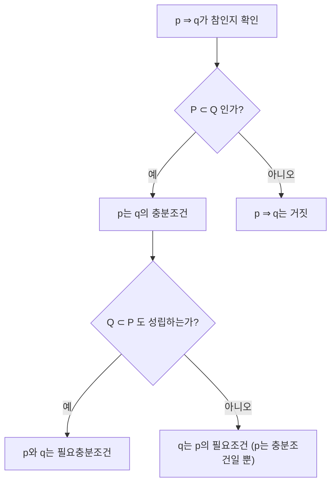

<Callout type="info">
  **이번 문서의 목표:** 이 문서를 다 읽으면 집합의 포함관계와 연산을 정확히 계산하고, 명제의 참·거짓과 역·대우·필요충분조건 판정을 시험에서 실수 없이 풀 수 있다.
</Callout>

01편에서 집합 기호($\in$, $\subset$, $\cap$, $\cup$ 등)와 논리 기호($\land$, $\lor$, $\lnot$, $\Rightarrow$)를 이미 한 번 정리했다. 이 편에서는 그 기호들을 실제로 손으로 계산하는 단계로 넘어간다. 독학사 일반수학 시험에서 집합·명제 단원은 계산량이 많지 않은 대신, **정의를 정확히 아는지**를 확인하는 문제가 많다. 그래서 이 편은 "계산"보다 "정의를 조건에 정확히 적용하는 연습"에 무게를 둔다.

## 집합의 포함관계

> **쉽게 말하면:** 집합 A의 원소가 전부 집합 B 안에 있으면 "A는 B에 포함된다"고 한다.

**집합**(set, 집)은 어떤 조건을 만족하는 대상들을 하나로 묶은 것이다. 예를 들어 $A = \{1, 2, 3\}$은 1, 2, 3이라는 세 개의 **원소**(element, 집합을 이루는 개별 대상)를 가진 집합이다. $x \in A$는 "$x$가 집합 $A$의 원소다"라는 뜻이고, $x \notin A$는 그 반대다.

두 집합 $A$, $B$가 있을 때, $A$의 모든 원소가 $B$에도 속하면 $A$를 $B$의 **부분집합**(subset, 일부 집합)이라 하고 $A \subset B$로 쓴다. 기호 $\subset$은 "서브셋" 또는 "포함된다"로 읽는다.

$$
A \subset B \iff (\forall x)(x \in A \Rightarrow x \in B)
$$

- $\forall x$: "모든 $x$에 대하여" (전칭 기호, forall)
- $\Rightarrow$: "이면" (조건 기호, implies)
- $\iff$: "필요충분조건이다", "동치다" (양방향 화살표, if and only if)

즉 "$A$에 속하는 것은 무엇이든 $B$에도 속한다"는 문장을 기호로 옮긴 것뿐이다. 여기서 주의할 점은 $A \subset B$라고 해서 $A = B$가 아니어도 된다는 것이다. $A$와 $B$가 완전히 같은 집합일 때도 $A \subset B$이면서 $B \subset A$가 성립한다(서로 부분집합이면 두 집합은 같다는 뜻이다). 만약 $A \subset B$이면서 $A \neq B$이면 $A$를 $B$의 **진부분집합**(proper subset, 진짜 부분집합)이라 하고 $A \subsetneq B$로 표시하기도 한다.

**예시.** $A = \{1, 2\}$, $B = \{1, 2, 3\}$일 때, $A$의 원소 1과 2가 모두 $B$에 있으므로 $A \subset B$이다. 반대로 $B \subset A$는 성립하지 않는다 — $B$의 원소인 3이 $A$에는 없기 때문이다.

**공집합**(empty set, 원소가 하나도 없는 집합)은 기호 $\varnothing$로 쓰며, 어떤 집합 $A$에 대해서도 $\varnothing \subset A$가 항상 성립한다. "원소가 하나도 없으니 A에 속하지 않는 원소도 하나도 없다"는 논리로, 조건문 $x \in \varnothing \Rightarrow x \in A$가 **거짓이 될 수 있는 경우 자체가 없어서** 참으로 취급되기 때문이다(공허하게 참, vacuously true).

### 부분집합의 개수와 멱집합

원소가 $n$개인 집합의 부분집합 개수는 $2^n$개다. 왜 그런지 하나씩 따져 보자. 부분집합을 만들 때 각 원소는 "포함한다" 또는 "포함하지 않는다" 두 가지 선택지 중 하나를 갖는다. 원소가 $n$개이므로 선택의 경우의 수는

$$
2 \times 2 \times \cdots \times 2 \, (n\text{개}) = 2^n
$$

- $n$: 원소의 개수
- $2^n$: 부분집합의 총 개수(공집합과 자기 자신 포함)

이렇게 한 집합의 모든 부분집합을 원소로 갖는 집합을 **멱집합**(power set, 힘 집합 — 원소 개수가 지수적으로 늘어난다는 뜻에서 "power")이라 하고 $P(A)$ 또는 $2^A$로 쓴다.

**예시.** $A = \{1, 2, 3\}$이면 $n = 3$이므로 부분집합 개수는 $2^3 = 8$개다. 실제로 나열하면 다음과 같다.

$$
P(A) = \{\varnothing, \{1\}, \{2\}, \{3\}, \{1,2\}, \{1,3\}, \{2,3\}, \{1,2,3\}\}
$$

세어 보면 원소가 정확히 8개다(검산 완료).

**진부분집합의 개수**를 물으면 자기 자신 $A$를 빼야 하므로 $2^n - 1$개다. 시험에서 "부분집합의 개수"와 "진부분집합의 개수"를 구분하지 않고 헷갈리는 경우가 많으니 문제에서 "진"이라는 글자가 있는지 항상 확인해야 한다.

## 집합의 연산

> **쉽게 말하면:** 두 집합을 합치거나(합집합), 겹치는 부분만 뽑거나(교집합), 빼는(여집합·차집합) 연산이다.

전체 집합을 $U$(universal set, 전체집합)라 하고, 그 안의 두 집합을 $A$, $B$라 하자.

| 연산 | 기호 | 읽는 법 | 정의 |
|------|------|---------|------|
| 합집합 | $A \cup B$ | 에이 합 비, union | $A$에 속하거나 $B$에 속하는 원소 전체 |
| 교집합 | $A \cap B$ | 에이 교 비, intersection | $A$와 $B$ 둘 다에 속하는 원소 |
| 여집합 | $A^c$ | 에이 여, complement | 전체집합 $U$에서 $A$에 속하지 않는 원소 |
| 차집합 | $A - B$ | 에이 차 비 | $A$에는 속하지만 $B$에는 속하지 않는 원소 |

**예시.** 전체집합 $U = \{1,2,3,4,5,6,7,8\}$, $A = \{1,2,3,4\}$, $B = \{3,4,5,6\}$이라 하자.

$$
A \cup B = \{1,2,3,4,5,6\}
$$

$A$와 $B$의 원소를 전부 모으되 3, 4는 중복이므로 한 번씩만 적는다.

$$
A \cap B = \{3,4\}
$$

$A$와 $B$에 공통으로 들어있는 원소만 남긴다.

$$
A^c = \{5,6,7,8\}
$$

전체집합 $U$에서 $A$의 원소(1, 2, 3, 4)를 빼고 남은 것이다.

$$
A - B = \{1,2\}
$$

$A$의 원소 중 $B$에도 속하는 3, 4를 빼면 1, 2만 남는다.

**검산.** $A - B = A \cap B^c$가 항상 성립해야 한다. $B^c = U - B = \{1,2,7,8\}$이므로 $A \cap B^c = \{1,2,3,4\} \cap \{1,2,7,8\} = \{1,2\}$. 위에서 구한 $A-B=\{1,2\}$와 일치한다(검산 완료).

### 드모르간의 법칙

**드모르간의 법칙**(De Morgan's law, 여집합을 분배하는 법칙)은 집합 연산과 명제 연산 양쪽에서 시험에 자주 나온다.

$$
(A \cup B)^c = A^c \cap B^c
$$

$$
(A \cap B)^c = A^c \cup B^c
$$

- $(A \cup B)^c$: "$A$ 또는 $B$에 속하지 않는다" $\to$ "$A$에도 속하지 않고 $B$에도 속하지 않는다"($\cap$으로 바뀜)
- $(A \cap B)^c$: "$A$와 $B$ 둘 다에 속하지는 않는다" $\to$ "$A$에 속하지 않거나 $B$에 속하지 않는다"($\cup$으로 바뀜)

여집합을 씌우면 $\cup$과 $\cap$이 서로 뒤바뀐다고 외우면 편하다.

**검산.** 위 예시 숫자로 확인하자. $(A \cup B)^c = \{1,2,3,4,5,6\}^c = \{7,8\}$. 한편 $A^c \cap B^c = \{5,6,7,8\} \cap \{1,2,7,8\} = \{7,8\}$. 두 결과가 일치한다(검산 완료).

## 명제와 논리 연산

> **쉽게 말하면:** 참·거짓이 명확히 정해지는 문장을 명제라 하고, 그 명제들을 "그리고", "또는", "아니다"로 묶는 규칙을 논리 연산이라 한다.

**명제**(proposition, 진위를 판단할 수 있는 문장)는 참(True) 또는 거짓(False) 중 하나로 딱 떨어지는 문장이다. "3은 소수다"는 참인 명제이고, "3은 짝수다"는 거짓인 명제다. 반면 "이 수는 크다"는 기준이 없어 참·거짓을 판정할 수 없으므로 명제가 아니다.

두 명제 $p$, $q$를 논리 연산으로 묶을 수 있다.

| 연산 | 기호 | 읽는 법 | 뜻 |
|------|------|---------|-----|
| 논리곱 | $p \land q$ | 피 그리고 큐, and | $p$와 $q$가 둘 다 참일 때만 참 |
| 논리합 | $p \lor q$ | 피 또는 큐, or | $p$, $q$ 중 하나라도 참이면 참 |
| 부정 | $\lnot p$ | 피가 아니다, not | $p$가 참이면 거짓, 거짓이면 참 |

**진리표**(truth table, 참·거짓 조합을 전부 나열한 표)로 정리하면 다음과 같다. $T$는 참(True), $F$는 거짓(False)이다.

| $p$ | $q$ | $p \land q$ | $p \lor q$ |
|-----|-----|-------------|------------|
| T | T | T | T |
| T | F | F | T |
| F | T | F | T |
| F | F | F | F |

집합의 연산과 명제의 연산은 사실 같은 구조다. $\cap$은 $\land$(그리고)에, $\cup$은 $\lor$(또는)에, 여집합은 $\lnot$(아니다)에 대응한다. 그래서 드모르간의 법칙도 명제에서 똑같이 성립한다.

$$
\lnot(p \land q) \iff (\lnot p) \lor (\lnot q)
$$

$$
\lnot(p \lor q) \iff (\lnot p) \land (\lnot q)
$$

## 조건명제와 역·대우

> **쉽게 말하면:** "$p$이면 $q$이다"라는 문장에서, $p$와 $q$의 자리를 바꾸거나 부정해서 새로운 문장 세 가지를 만들 수 있다.

$p \Rightarrow q$ 형태의 명제를 **조건명제**(conditional proposition) 또는 가정·결론 명제라 한다. $p$를 **가정**(hypothesis), $q$를 **결론**(conclusion)이라 부른다.

원래 명제 $p \Rightarrow q$에서 다음 세 가지 파생 명제를 만들 수 있다.

| 이름 | 형태 | 관계 |
|------|------|------|
| 역 | $q \Rightarrow p$ | 가정과 결론을 바꾼다 |
| 이 | $\lnot p \Rightarrow \lnot q$ | 가정과 결론을 각각 부정한다 |
| 대우 | $\lnot q \Rightarrow \lnot p$ | 역을 만들고 다시 각각 부정한다 |

**시험에서 가장 중요한 사실**은 원래 명제와 그 **대우**(contrapositive)는 항상 참·거짓이 같다는 것이다(논리적으로 동치). 반면 원래 명제가 참이라고 해서 역이나 이도 반드시 참인 것은 아니다.

**예시.** $p$: "$x = 2$이다", $q$: "$x^2 = 4$이다"라 하자.

- 원명제 $p \Rightarrow q$: "$x=2$이면 $x^2=4$이다" — 참이다. $x=2$를 대입하면 $2^2=4$이므로 성립한다.
- 역 $q \Rightarrow p$: "$x^2=4$이면 $x=2$이다" — 거짓이다. $x=-2$도 $x^2=4$를 만족하지만 $x=2$는 아니기 때문이다. 반례: $x=-2$일 때 $(-2)^2=4$는 참이지만 $x=2$는 거짓.
- 대우 $\lnot q \Rightarrow \lnot p$: "$x^2 \neq 4$이면 $x \neq 2$이다" — 원명제와 참·거짓이 같으므로 참이다. 실제로 확인하면, $x=2$이면 반드시 $x^2=4$이므로 그 부정인 "$x^2\neq4$이면 $x\neq2$"도 항상 성립한다(검산 완료).

이 예시가 보여주듯, 역이 거짓이어도 대우는 원명제와 함께 항상 참이다. 이 성질 때문에 어떤 명제를 직접 증명하기 어려울 때 **대우를 증명**하는 전략을 쓰기도 한다.

## 필요조건과 충분조건

> **쉽게 말하면:** $p \Rightarrow q$가 참이면, $p$는 $q$이기 위한 "충분"한 조건이고, $q$는 $p$이기 위해 "필요"한 조건이다.

$p \Rightarrow q$가 참일 때:

- $p$는 $q$이기 위한 **충분조건**(sufficient condition) — $p$만 있으면 $q$가 보장된다는 뜻에서 "충분하다."
- $q$는 $p$이기 위한 **필요조건**(necessary condition) — $q$가 성립하지 않으면 $p$도 성립할 수 없다는 뜻에서 "꼭 필요하다."

만약 $p \Rightarrow q$와 $q \Rightarrow p$가 **둘 다** 참이면, $p$와 $q$는 서로 **필요충분조건**(necessary and sufficient condition)이라 하고 $p \iff q$로 쓴다. 이때 $p$와 $q$는 논리적으로 완전히 같은 뜻이 된다.

**예시.** $p$: "삼각형 $ABC$가 정삼각형이다", $q$: "삼각형 $ABC$의 세 각이 모두 $60\degree$다."

$p \Rightarrow q$는 참이다(정삼각형이면 세 각이 항상 $60\degree$). $q \Rightarrow p$도 참이다(세 각이 모두 $60\degree$면 정삼각형이다). 양방향이 모두 참이므로 $p \iff q$, 즉 두 조건은 필요충분조건이다.

**집합으로 판정하는 방법.** 조건 $p$를 만족하는 원소들의 집합을 $P$, 조건 $q$를 만족하는 원소들의 집합을 $Q$라 하면, $p \Rightarrow q$가 참인 것은 $P \subset Q$인 것과 정확히 같다. 즉 벤 다이어그램에서 $P$가 $Q$ 안에 완전히 들어가면 $p \Rightarrow q$가 참이다. 이 대응 관계를 알면 복잡한 조건명제도 집합 그림으로 바꿔서 눈으로 판정할 수 있다.

## 자주 틀리는 점

- **역과 원명제를 혼동한다.** $p \Rightarrow q$가 참이어도 $q \Rightarrow p$는 별도로 확인해야 한다. 반례를 하나 찾으면 거짓임을 증명할 수 있다.
- **공집합의 포함관계를 빠뜨린다.** $\varnothing \subset A$는 모든 집합 $A$에 대해 항상 참이다. 이를 깜빡하고 부분집합 개수를 $2^n - 1$로 잘못 세는 실수가 흔하다(진부분집합이 아닌데 공집합을 빼버리는 경우).
- **부분집합 개수와 진부분집합 개수를 헷갈린다.** 부분집합은 $2^n$개, 진부분집합(자기 자신 제외)은 $2^n - 1$개다.
- **필요조건과 충분조건의 방향을 반대로 외운다.** "$p$는 $q$이기 위한 충분조건" ↔ "$p \Rightarrow q$"로 항상 화살표 방향과 짝지어 확인해야 한다.
- **드모르간 적용 시 $\cup$과 $\cap$을 안 바꾼다.** 여집합을 씌우면 반드시 교집합과 합집합이 서로 뒤바뀐다.

## 핵심 정리

- 원소 $n$개인 집합의 부분집합 개수는 $2^n$개, 진부분집합 개수는 $2^n-1$개다.
- 드모르간 법칙: 여집합을 씌우면 $\cup \leftrightarrow \cap$이 서로 바뀐다.
- 원명제와 대우는 항상 참·거짓이 같다. 역과 이는 원명제와 별개로 참·거짓을 확인해야 한다.
- $p \Rightarrow q$가 참이면 $p$는 충분조건, $q$는 필요조건이다. 양방향이 참이면 필요충분조건이다.
- 조건명제의 참·거짓은 대응하는 집합의 포함관계($P \subset Q$)로 바꿔 판정할 수 있다.

## 마무리 복습

<Quiz
  questionNumber={1}
  question="원소가 5개인 집합 A의 진부분집합 개수는?"
  options={['16개', '31개', '32개', '10개']}
  correctAnswer={2}
  explanation="부분집합 개수는 2의 5제곱인 32개다. 진부분집합은 자기 자신을 제외하므로 32에서 1을 빼서 31개다."
  optionExplanations={['2의 4제곱인 16으로 잘못 계산한 경우다.', '32에서 자기 자신 1개를 뺀 31개가 정답이다.', '이것은 진부분집합이 아니라 전체 부분집합의 개수다.', '2의 5제곱을 잘못 절반으로 나눈 값으로 정답이 아니다.']}
/>

<Quiz
  questionNumber={2}
  question="전체집합 U={1,2,3,4,5,6}, A={1,2,3}, B={2,3,4}일 때 (A∪B)의 여집합은?"
  options={['{5,6}', '{1,4}', '{2,3}', '{1,2,3,4}']}
  correctAnswer={1}
  explanation="A∪B는 1,2,3,4를 모은 집합이다. 전체집합 U에서 A∪B를 빼면 5와 6만 남으므로 (A∪B)의 여집합은 {5,6}이다. 드모르간 법칙으로도 검산할 수 있다: A의 여집합은 {4,5,6}, B의 여집합은 {1,5,6}이고 둘의 교집합은 {5,6}으로 같은 결과가 나온다."
  optionExplanations={['정답이다. U에서 A∪B={1,2,3,4}를 빼면 {5,6}이 남는다.', 'A와 B에 공통이 아닌 원소를 잘못 골라낸 오답이다.', '이것은 A와 B의 교집합이지 여집합이 아니다.', '이것은 A∪B 자체이지 그 여집합이 아니다.']}
/>

<Quiz
  questionNumber={3}
  question="명제 p⇒q가 참일 때 항상 참인 것은?"
  options={['q⇒p (역)', '￢p⇒￢q (이)', '￢q⇒￢p (대우)', 'p와 q는 필요충분조건이다']}
  correctAnswer={3}
  explanation="원명제와 대우는 논리적으로 항상 동치이므로, p⇒q가 참이면 대우인 ￢q⇒￢p도 반드시 참이다. 역과 이는 원명제가 참이어도 별도로 확인해야 하며, 필요충분조건이 되려면 역인 q⇒p도 참이어야 하는데 그것은 주어지지 않았다."
  optionExplanations={['역은 원명제와 독립적으로 참·거짓이 정해지므로 항상 참이라 할 수 없다.', '이(inverse)도 역과 마찬가지로 별도 확인이 필요해 항상 참은 아니다.', '정답이다. 대우는 원명제와 항상 논리적으로 동치다.', '역까지 참이어야 필요충분조건이 되는데, 그 정보는 문제에 없다.']}
/>

<Quiz
  questionNumber={4}
  question="'x=3이면 x²=9이다'라는 명제의 역은 어느 것인가?"
  options={['x²=9이면 x=3이다', 'x≠3이면 x²≠9이다', 'x²≠9이면 x≠3이다', 'x=3이 아니면 x²=9가 아니다']}
  correctAnswer={1}
  explanation="역은 가정 p와 결론 q의 자리를 바꾼 것이다. 원명제가 'x=3이면 x²=9'이므로 역은 'x²=9이면 x=3'이다. 참고로 이 역은 실제로는 거짓인데, x=-3일 때도 x²=9가 성립하지만 x=3은 아니기 때문이다(반례 확인)."
  optionExplanations={['정답이다. 가정과 결론의 자리를 바꾼 것이 역이다.', '이것은 이(각각을 부정한 것)에 해당한다.', '이것은 대우(역을 만들고 각각 부정한 것)에 해당한다.', '이것은 이와 같은 형태로 결론과 가정을 부정만 한 것이지 자리를 바꾼 것이 아니다.']}
/>

<Quiz
  questionNumber={5}
  question="A={1,2,3,4}, B={3,4,5}일 때 A-B는?"
  options={['{1,2}', '{3,4}', '{5}', '{1,2,3,4,5}']}
  correctAnswer={1}
  explanation="A-B는 A에는 속하지만 B에는 속하지 않는 원소들이다. A의 원소 1,2,3,4 중에서 B에도 속하는 3,4를 빼면 1,2만 남는다. 검산: A-B는 A∩(B의 여집합)과 같아야 한다. B의 여집합 계산 없이도, 정의대로 A의 원소 각각이 B에 있는지 확인하면 1과 2만 B에 없으므로 결과가 일치한다."
  optionExplanations={['정답이다. A의 원소 중 B에 속하지 않는 것은 1과 2뿐이다.', '이것은 A와 B의 교집합이다.', 'B에만 있고 A에는 없는 원소이므로 B-A에 해당한다.', '이것은 A와 B를 합친 합집합이다.']}
/>

<Quiz
  questionNumber={6}
  question="'삼각형이 정삼각형이다'(p)와 '삼각형의 세 변의 길이가 모두 같다'(q)의 관계로 옳은 것은?"
  options={['p는 q의 충분조건이지만 필요조건은 아니다', 'p와 q는 필요충분조건이다', 'q는 p의 충분조건이지만 필요조건은 아니다', 'p와 q는 아무 관계가 없다']}
  correctAnswer={2}
  explanation="정삼각형이면 세 변의 길이가 모두 같으므로 p⇒q가 참이고, 세 변의 길이가 모두 같으면 정삼각형이므로 q⇒p도 참이다. 양방향이 모두 참이므로 p와 q는 필요충분조건이다."
  optionExplanations={['q⇒p도 참이므로 필요조건이기도 하다. 충분조건이라고만 하면 불완전하다.', '정답이다. 양쪽 화살표가 모두 참이므로 필요충분조건이다.', 'p⇒q도 참이므로 q가 p의 필요조건이자 충분조건 양쪽 다에 해당한다.', '두 조건은 논리적으로 완전히 동치이므로 관계가 없다는 설명은 틀렸다.']}
/>

## 참고 자료

- [국가평생교육진흥원 독학학위제 시험안내](https://bdes.nile.or.kr)
- [MathWorld - Set Theory](https://mathworld.wolfram.com/SetTheory.html)
