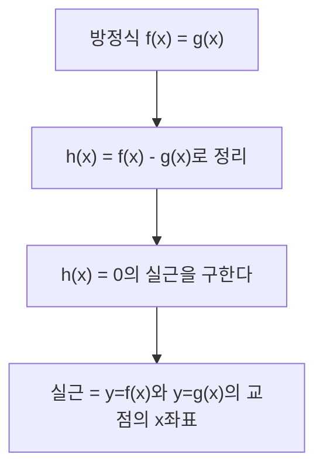
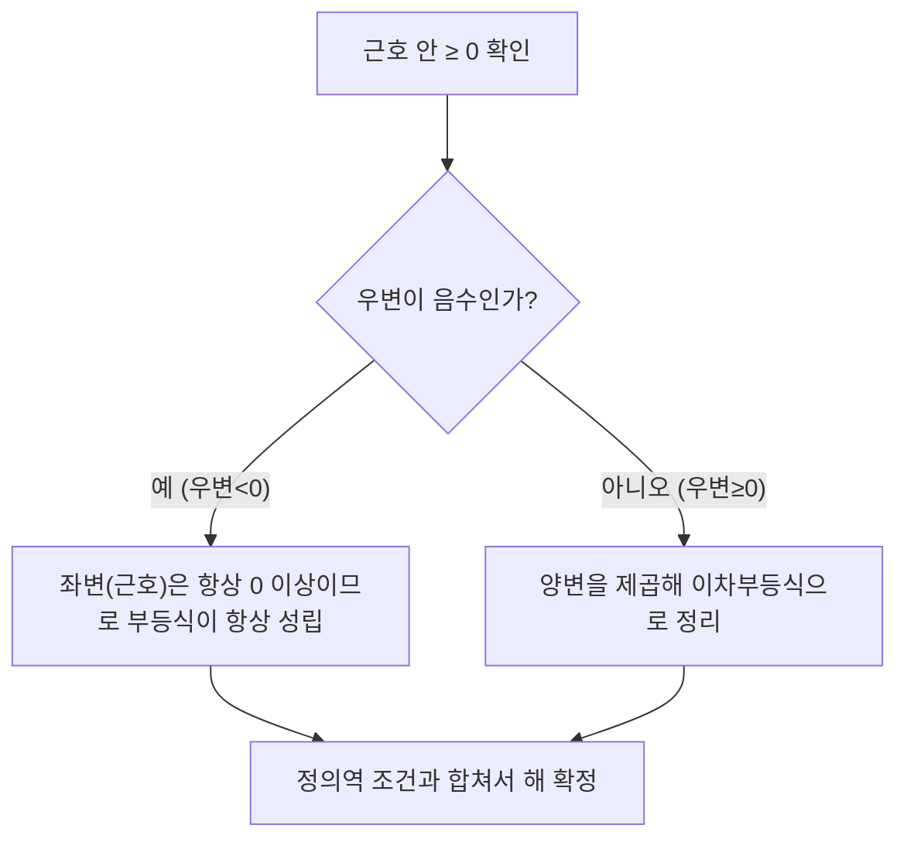

<Callout type="info">
  **이번 문서의 목표:** 이 문서를 다 읽으면 방정식의 해를 그래프의 교점으로 해석하고, 절댓값·무리부등식을 정의역 조건까지 빠뜨리지 않고 풀 수 있다.
</Callout>

05편에서 명제와 조건을, 06편에서 다항·유리·무리·지수·로그함수의 그래프를 정리했다. 이 편은 그 함수 그래프를 **방정식·부등식의 해를 찾는 도구**로 사용하는 방법을 다룬다. 독학사 시험에서는 "이 방정식의 해가 몇 개인가", "이 부등식을 만족하는 $x$의 범위는" 같은 문제가 많이 나오는데, 계산만으로 풀 수도 있지만 그래프로 해석하면 검산이 훨씬 쉬워진다.

## 함수와 방정식의 관계

> **쉽게 말하면:** 방정식 $f(x)=0$의 해는 함수 $y=f(x)$의 그래프가 $x$축과 만나는 점의 $x$좌표다.

함수 $y=f(x)$가 있을 때, 방정식 $f(x)=0$의 실근(실수인 근)은 그래프가 $x$축과 교차하는 점의 $x$좌표와 정확히 일치한다. 이 대응 관계 덕분에 "방정식을 계산으로 풀기 어려운 경우"에도 그래프의 개형만으로 근의 개수를 판단할 수 있다.

**예시.** 이차방정식 $x^2 - 5x + 6 = 0$을 인수분해로 풀어 보자.

$$
x^2 - 5x + 6 = (x-2)(x-3)
$$

- 곱해서 6, 더해서 $-5$가 되는 두 수를 찾으면 $-2$와 $-3$이다.

$$
(x-2)(x-3) = 0 \implies x = 2 \text{ 또는 } x = 3
$$

**검산**: $x=2$를 원식에 대입하면 $4-10+6=0$, $x=3$을 대입하면 $9-15+6=0$으로 둘 다 성립한다(검산 완료). 그래프로 보면 $y=x^2-5x+6$은 아래로 볼록한 포물선이며 $x=2$와 $x=3$에서 $x$축과 만난다 — 근이 정확히 2개라는 뜻이다.

## 이차방정식의 근의 개수: 판별식

> **쉽게 말하면:** 판별식의 부호만 보면 그래프를 직접 그리지 않아도 근이 몇 개인지 알 수 있다.

이차방정식 $ax^2+bx+c=0$($a\neq0$)의 근은 **근의 공식**으로 구한다.

$$
x = \frac{-b \pm \sqrt{b^2-4ac}}{2a}
$$

- $a$, $b$, $c$: 이차방정식의 계수
- $\pm$: "플러스마이너스" — $+$를 쓴 경우와 $-$를 쓴 경우 두 개의 해가 나온다는 뜻
- $b^2-4ac$: **판별식**(discriminant, 근의 개수를 가려내는 식)이라 하며 기호 $D$로 쓴다

판별식 $D=b^2-4ac$의 부호에 따라 근의 개수(=그래프와 $x$축의 교점 개수)가 정해진다.

| $D$의 부호 | 근의 개수 | 그래프와 $x$축의 관계 |
|-----------|-----------|------------------------|
| $D>0$ | 서로 다른 두 실근 | 두 점에서 만난다 |
| $D=0$ | 중근(실근 1개, 중복도 2) | 한 점에서 접한다 |
| $D<0$ | 실근 없음(허근 2개) | 만나지 않는다 |

**예시.** $x^2 - 4x + 4 = 0$의 판별식을 구해 보자. $a=1$, $b=-4$, $c=4$이므로

$$
D = (-4)^2 - 4(1)(4) = 16 - 16 = 0
$$

$D=0$이므로 중근을 갖는다. 근의 공식에 대입하면

$$
x = \frac{-(-4) \pm \sqrt{0}}{2(1)} = \frac{4}{2} = 2
$$

**검산**: $x=2$를 원식에 대입하면 $4-8+4=0$으로 성립한다. 또한 $x^2-4x+4=(x-2)^2$으로 완전제곱식이 되므로, 그래프는 $x=2$에서 $x$축에 접하는 포물선이다(검산 완료).

## 그래프를 이용한 근의 해석

두 함수의 교점으로 방정식을 해석할 수도 있다. 방정식 $f(x) = g(x)$의 해는 $y=f(x)$ 그래프와 $y=g(x)$ 그래프의 **교점의 $x$좌표**와 같다. 이는 $f(x)=g(x)$를 $f(x)-g(x)=0$으로 옮겨 앞 절의 논리를 그대로 적용한 것이다.

**예시.** $x^2 = x+2$의 해를 그래프 관점에서 확인해 보자. 먼저 식을 정리한다.

$$
x^2 - x - 2 = 0
$$

$$
(x-2)(x+1) = 0
$$

- 곱해서 $-2$, 더해서 $-1$이 되는 두 수는 $-2$와 $1$이다.

$$
x = 2 \text{ 또는 } x = -1
$$

**검산**: $x=2$일 때 좌변 $2^2=4$, 우변 $2+2=4$로 일치. $x=-1$일 때 좌변 $(-1)^2=1$, 우변 $-1+2=1$로 일치한다(검산 완료). 그래프로는 포물선 $y=x^2$과 직선 $y=x+2$가 두 점 $(2,4)$와 $(-1,1)$에서 만난다는 뜻이다.

## 절댓값이 포함된 부등식

> **쉽게 말하면:** 절댓값 기호를 없애려면, 안의 식이 양수인 경우와 음수인 경우로 나눠서 풀어야 한다.

**절댓값**(absolute value) $|x|$는 $x$가 원점으로부터 떨어진 거리를 뜻하며, 다음과 같이 경우를 나눠 정의한다.

$$
|x| = \begin{cases} x & (x \geq 0) \\ -x & (x < 0) \end{cases}
$$

절댓값 부등식은 아래 두 가지 표준 변환을 알아두면 대부분 풀린다($a>0$일 때).

$$
|x| < a \iff -a < x < a
$$

$$
|x| > a \iff x < -a \text{ 또는 } x > a
$$

**예시.** $|2x - 3| < 5$를 풀어 보자. 위 첫 번째 변환을 적용한다.

$$
-5 < 2x - 3 < 5
$$

- 절댓값 안의 식 전체가 $-5$와 $5$ 사이에 있어야 한다.

$$
-5 + 3 < 2x < 5 + 3
$$

- 세 변에 모두 3을 더한다.

$$
-2 < 2x < 8
$$

$$
-1 < x < 4
$$

- 세 변을 모두 2로 나눈다.

**검산**: 경계값 근처를 확인한다. $x=0$(범위 안)을 대입하면 $|2(0)-3|=|-3|=3<5$로 성립. $x=4$(경계, 범위 밖)를 대입하면 $|2(4)-3|=|5|=5$로 부등식이 등호가 되어 "< 5"를 만족하지 못한다 — 경계가 정확히 4임을 확인했다(검산 완료).

**예시.** $|x+1| \geq 3$을 풀어 보자. 두 번째 변환(등호 포함)을 적용한다.

$$
x+1 \leq -3 \text{ 또는 } x+1 \geq 3
$$

$$
x \leq -4 \text{ 또는 } x \geq 2
$$

**검산**: $x=-4$를 대입하면 $|-4+1|=|-3|=3 \geq 3$으로 등호가 성립해 경계값이 포함되는 것이 맞다. $x=0$(범위 밖)을 대입하면 $|0+1|=1$로 $3$보다 작으므로 해에서 제외되는 것이 맞다(검산 완료).

## 무리부등식: 정의역부터 확인

> **쉽게 말하면:** 근호가 있는 부등식은 계산 전에 근호 안이 0 이상인지부터 확인해야 한다. 이 확인을 빠뜨리면 답이 틀린다.

무리부등식은 06편에서 다룬 무리함수의 정의역 조건이 그대로 적용된다. 근호를 없애기 위해 양변을 제곱하기 전에, 반드시 다음 두 조건을 먼저 챙겨야 한다.

<Steps>
1. 근호 안의 식이 0 이상인지 확인한다(근호가 정의되는 범위).
2. 부등식 양변을 제곱하기 전에, 제곱해도 부등호 방향이 유지되려면 양변이 모두 0 이상이어야 한다는 점을 확인한다.
3. 위 두 조건과 제곱해서 얻은 해를 모두 교집합으로 묶는다.
</Steps>

**예시.** $\sqrt{x-2} < 3$을 풀어 보자.

먼저 근호가 정의되는 범위를 구한다.

$$
x - 2 \geq 0 \implies x \geq 2
$$

우변 $3$은 이미 양수이므로 양변을 제곱해도 부등호 방향이 바뀌지 않는다. 양변을 제곱한다.

$$
x - 2 < 9
$$

$$
x < 11
$$

두 조건 $x \geq 2$와 $x < 11$을 교집합으로 묶으면 최종 해는 다음과 같다.

$$
2 \leq x < 11
$$

**검산**: 경계값을 확인한다. $x=2$(포함)를 대입하면 $\sqrt{2-2}=\sqrt{0}=0<3$으로 성립. $x=11$(제외)을 대입하면 $\sqrt{11-2}=\sqrt{9}=3$이 되어 "< 3"을 만족하지 못한다 — 경계가 정확하다. $x=1$(정의역 밖)을 대입하면 $\sqrt{1-2}=\sqrt{-1}$로 애초에 실수 범위에서 정의되지 않아 해에서 제외되는 것이 맞다(검산 완료).

**예시.** $\sqrt{2x+1} \geq x-1$처럼 우변에 변수가 있는 경우는 우변의 부호에 따라 경우를 나눠야 한다. 이런 유형은 다음 흐름으로 접근한다.

우변이 음수인 구간에서는 좌변인 근호값이 항상 0 이상이므로 부등식이 자동으로 성립하고, 우변이 0 이상인 구간에서만 제곱해서 풀면 된다. 두 구간에서 나온 해를 합집합으로 묶는 것이 최종 해다.

## 정의역·해집합에서 자주 생기는 함정

> **쉽게 말하면:** 계산으로 얻은 해가 애초에 정의역 안에 있는지 마지막에 반드시 다시 확인해야 한다.

방정식·부등식을 풀 때 양변을 제곱하거나 분모를 없애는 과정에서 원래 식에는 없던 **해**(증가근, extraneous root)가 끼어들 수 있다. 계산이 끝나면 반드시 원래 식(제곱하기 전, 분수 형태 그대로)에 답을 대입해 검산해야 한다.

**예시.** $\sqrt{x+3} = x-3$을 풀어 보자. 양변을 제곱한다.

$$
x+3 = (x-3)^2 = x^2 - 6x + 9
$$

$$
0 = x^2 - 7x + 6
$$

$$
0 = (x-1)(x-6)
$$

$$
x = 1 \text{ 또는 } x = 6
$$

여기서 멈추면 안 된다. 원래 식에 각 값을 직접 대입해서 확인해야 한다.

- $x=1$: 좌변 $\sqrt{1+3}=\sqrt4=2$, 우변 $1-3=-2$. $2 \neq -2$이므로 **성립하지 않는다.** 제곱하는 과정에서 생긴 가짜 해다.
- $x=6$: 좌변 $\sqrt{6+3}=\sqrt9=3$, 우변 $6-3=3$. $3=3$으로 **성립한다.**

따라서 최종 해는 $x=6$ 하나뿐이다(검산 완료). $x=1$이 왜 걸러졌는지 설명하면, 제곱하는 과정은 좌변과 우변의 **부호가 서로 달라도** 제곱하면 같아질 수 있기 때문이다. $\sqrt{x+3}$은 항상 0 이상인데 $x=1$일 때 우변 $x-3=-2$는 음수라서, 애초에 "0 이상 = 음수"라는 모순이 제곱 과정에서 가려졌던 것이다.

## 자주 틀리는 점

- **무리방정식·무리부등식에서 양변을 제곱한 뒤 검산을 생략한다.** 제곱하는 순간 원래 없던 해가 생길 수 있으므로, 반드시 원래 식에 대입해 확인해야 한다.
- **절댓값 부등식에서 부호 조건을 빠뜨린다.** $|x| > a$는 "또는"(합집합), $|x| < a$는 "그리고"(교집합, 즉 범위)로 완전히 다른 구조라는 점을 혼동하지 않아야 한다.
- **판별식 부호와 근의 개수를 반대로 기억한다.** $D>0$이면 근이 2개, $D=0$이면 중근 1개(그래프는 접함), $D<0$이면 실근이 없다(그래프는 만나지 않음).
- **무리부등식에서 근호 안의 정의역 조건을 최종 해에 교집합으로 포함시키지 않는다.** 제곱해서 푼 해가 정의역보다 넓게 나올 수 있으므로, 처음 구한 정의역과 반드시 교집합을 취해야 한다.
- **부등식 양변에 음수를 곱하거나 나눌 때 부등호 방향을 바꾸지 않는다.** 절댓값·무리부등식이 아니어도 이 실수는 매우 흔하다.

## 핵심 정리

- 방정식 $f(x)=0$의 실근은 그래프 $y=f(x)$와 $x$축의 교점, $f(x)=g(x)$의 실근은 두 그래프의 교점이다.
- 이차방정식은 판별식 $D=b^2-4ac$의 부호로 근의 개수를 바로 판단할 수 있다($D>0$: 2개, $D=0$: 중근, $D<0$: 없음).
- $|x|<a$는 $-a<x<a$(교집합), $|x|>a$는 $x<-a$ 또는 $x>a$(합집합)로 변환한다.
- 무리부등식은 근호 안의 정의역 조건을 먼저 확정하고, 제곱해서 얻은 해와 교집합으로 묶어야 한다.
- 제곱·양변 곱셈 등으로 방정식을 변형했다면, 계산이 끝난 뒤 반드시 원래 식에 대입해 가짜 해를 걸러내야 한다.

## 마무리 복습

<Quiz
  questionNumber={1}
  question="이차방정식 x²-6x+9=0의 판별식 D의 값과 근의 개수로 옳은 것은?"
  options={['D=0, 중근 1개', 'D=36, 서로 다른 두 실근', 'D=-36, 실근 없음', 'D=9, 서로 다른 두 실근']}
  correctAnswer={1}
  explanation="a=1, b=-6, c=9이므로 D=(-6)²-4(1)(9)=36-36=0이다. D=0이므로 중근을 갖는다. 실제로 x²-6x+9=(x-3)²이므로 x=3에서 중근을 가지며, 대입하면 9-18+9=0으로 검산이 성립한다."
  optionExplanations={['정답이다. D=36-36=0으로 중근을 가진다.', 'b²을 36으로 옳게 계산했지만 4ac=36을 빼지 않아 D를 잘못 구한 값이다.', '부호를 반대로 계산한 오답이다.', '4ac 계산에서 4×1×9=36이어야 하는데 9로 잘못 계산한 오답이다.']}
/>

<Quiz
  questionNumber={2}
  question="부등식 |3x-6|가 9보다 작을 때(|3x-6|&lt;9)의 해는?"
  options={['-1<x<5', '-3<x<3', 'x<-1 또는 x>5', '0<x<5']}
  correctAnswer={1}
  explanation="|3x-6|&lt;9는 -9&lt;3x-6&lt;9로 바꿀 수 있다. 세 변에 6을 더하면 -3&lt;3x&lt;15, 세 변을 3으로 나누면 -1&lt;x&lt;5다. 검산: 경계값 x=5를 대입하면 |15-6|=9로 등호가 되어 9보다 작다는 조건을 만족하지 못하므로 경계가 정확하다."
  optionExplanations={['정답이다. -9<3x-6<9를 풀면 -1<x<5가 나온다.', '6을 더하는 단계에서 3으로 나누는 것을 먼저 해버린 계산 순서 오류로 보이는 값이다.', '이것은 |3x-6|>9를 풀었을 때 나오는 합집합 형태의 해다.', '상수항 처리에서 실수가 있어 구간이 어긋난 오답이다.']}
/>

<Quiz
  questionNumber={3}
  question="무리방정식 √(x+3)=x-3의 해를 검산까지 마쳤을 때 옳은 것은?"
  options={['x=1, x=6 모두 해다', 'x=1만 해다', 'x=6만 해다', '해가 없다']}
  correctAnswer={3}
  explanation="양변을 제곱하면 x²-7x+6=0이 되어 x=1 또는 x=6이 나온다. 그런데 x=1을 원래 식에 대입하면 좌변은 2, 우변은 -2로 서로 다르므로 성립하지 않는다. x=6을 대입하면 좌변 √9=3, 우변 6-3=3으로 일치한다. 따라서 최종 해는 x=6뿐이다."
  optionExplanations={['x=1은 원래 식에 대입하면 좌변과 우변이 다르므로 해가 아니다.', 'x=1은 제곱 과정에서 생긴 가짜 해로, 원래 식을 만족하지 않는다.', '정답이다. 검산까지 마치면 x=6만 원래 식을 만족한다.', 'x=6은 원래 식을 실제로 만족하므로 해가 존재한다.']}
/>

<Quiz
  questionNumber={4}
  question="무리부등식 √(x-1)이 4보다 작을 때(√(x-1)&lt;4)의 해를 구할 때 반드시 먼저 확인해야 하는 조건은?"
  options={['x-1≥0', 'x-1≤0', 'x≥4', '조건 없이 바로 제곱하면 된다']}
  correctAnswer={1}
  explanation="근호가 실수로 정의되려면 근호 안의 식이 0 이상이어야 한다. 이 조건을 먼저 확인한 뒤 양변을 제곱해서 얻은 해와 교집합으로 묶어야 정확한 해가 나온다."
  optionExplanations={['정답이다. 근호 안 x-1이 0 이상이어야 실수로 정의된다.', '부등호 방향이 반대로 되어 있어 근호가 정의되지 않는 범위를 가리킨다.', '이것은 제곱해서 얻은 결과와 혼동한 것으로, 정의역 조건과는 다르다.', '정의역 조건을 확인하지 않으면 정의되지 않는 값이 해에 섞여 들어갈 수 있다.']}
/>

<Quiz
  questionNumber={5}
  question="방정식 x²=2x+3의 해와 관련된 설명으로 옳은 것은?"
  options={['x=3, x=-1이며 그래프 y=x²과 y=2x+3의 교점의 x좌표다', 'x=1, x=-3이며 해가 존재하지 않는다', 'x=3, x=1이며 판별식 D<0이다', '해가 없다']}
  correctAnswer={1}
  explanation="x²-2x-3=0으로 정리하면 (x-3)(x+1)=0이므로 x=3 또는 x=-1이다. 검산: x=3일 때 좌변 9, 우변 2(3)+3=9로 일치. x=-1일 때 좌변 1, 우변 2(-1)+3=1로 일치한다. 이 두 값은 포물선 y=x²과 직선 y=2x+3이 만나는 교점의 x좌표와 같다."
  optionExplanations={['정답이다. 인수분해와 대입 검산 모두 x=3, x=-1이 해임을 확인해 준다.', '계산한 근이 실제로 원식을 만족하므로 해가 존재한다는 설명이 맞다.', '인수분해 결과가 (x-3)(x+1)이지 (x-3)(x-1)이 아니므로 근이 다르다.', '인수분해를 하면 실근 두 개가 정확히 나오므로 해가 없다는 설명은 틀렸다.']}
/>

<Quiz
  questionNumber={6}
  question="부등식 |x+2|≥4의 해로 옳은 것은?"
  options={['x≤-6 또는 x≥2', '-6≤x≤2', 'x≥2', 'x≤-6']}
  correctAnswer={1}
  explanation="|x|≥a(a는 0보다 큰 수) 꼴은 x≤-a 또는 x≥a로 바꾼다. |x+2|≥4는 x+2≤-4 또는 x+2≥4로 바뀌고, 각각 정리하면 x≤-6 또는 x≥2다. 검산: x=-6을 대입하면 |-6+2|=|-4|=4≥4로 등호 성립, x=2를 대입하면 |2+2|=4≥4로 역시 성립한다."
  optionExplanations={['정답이다. x≤-6 또는 x≥2가 합집합 형태의 해다.', '이것은 |x+2|≤4를 풀었을 때 나오는 교집합 형태의 해다.', '해의 절반만 나타낸 것으로, x≤-6인 경우를 빠뜨렸다.', '해의 절반만 나타낸 것으로, x≥2인 경우를 빠뜨렸다.']}
/>

## 참고 자료

- [국가평생교육진흥원 독학학위제 시험안내](https://bdes.nile.or.kr)
- [MathWorld - Quadratic Equation](https://mathworld.wolfram.com/QuadraticEquation.html)
