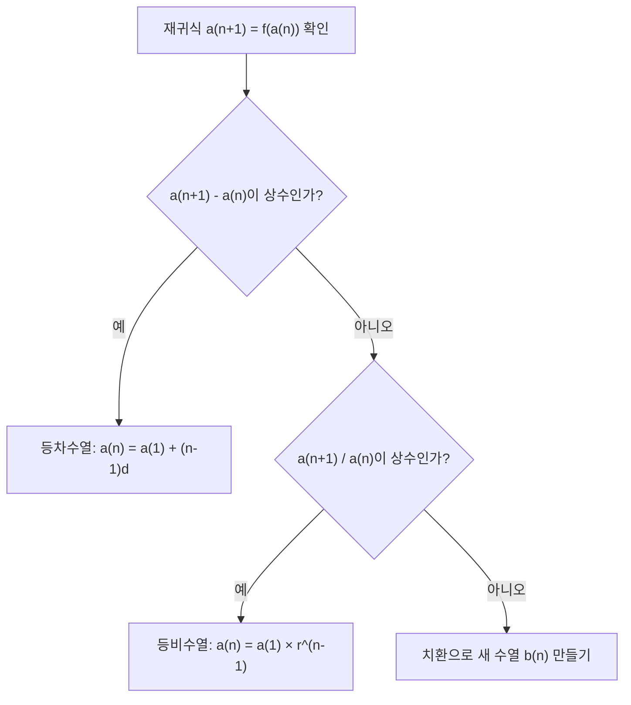

<Callout type="info">
  **이번 문서의 목표:** 이 문서를 다 읽으면 등차수열·등비수열의 일반항과 합을 공식으로 정확히 계산하고, 재귀식으로 주어진 수열에서도 일반항을 유도할 수 있다.
</Callout>

03편에서 **수열**(sequence, 순서를 가지고 나열된 수들의 모임)과 **일반항**(general term, $n$번째 항을 $n$의 식으로 나타낸 것), **부분합**(partial sum, 앞에서부터 몇 개 항을 더한 값)의 용어를 이미 정리했다. 이 편에서는 그 용어를 바탕으로 실제 시험에서 나오는 두 종류의 수열 — **등차수열**(arithmetic sequence)과 **등비수열**(geometric sequence) — 의 공식을 유도하고, 직접 대입해서 검산하는 과정까지 전부 다룬다. 독학사 일반수열 문제는 공식을 아는지보다 "공식을 정확히 대입해서 실수 없이 계산하는지"를 확인하는 문제가 많으므로, 이 편의 모든 예제는 계산 과정을 한 줄도 생략하지 않는다.

## 등차수열의 일반항

> **쉽게 말하면:** 이웃한 항끼리 항상 같은 수만큼 차이나는 수열이 등차수열이다.

**등차수열**(arithmetic sequence, 이웃한 두 항의 차가 일정한 수열)은 어떤 항에서 그다음 항으로 넘어갈 때 항상 같은 수를 더해서 만들어지는 수열이다. 이때 더해지는 일정한 수를 **공차**(common difference, 공통으로 더해지는 차이)라 하고 보통 $d$로 쓴다. 첫 번째 항은 **첫째항**(first term)이라 하고 $a_1$ 또는 $a$로 쓴다.

수열을 $a_1, a_2, a_3, \ldots, a_n, \ldots$으로 쓸 때, 등차수열이라는 것은 다음 관계가 항상 성립한다는 뜻이다.

$$
a_{n+1} - a_n = d \quad (\text{모든 } n \text{에 대해 일정})
$$

- $a_n$: 수열의 $n$번째 항 ($n$은 자연수, 1, 2, 3, ...)
- $a_{n+1}$: $a_n$ 바로 다음 항
- $d$: 공차, 이웃한 항끼리의 차이(양수면 증가, 음수면 감소)

**일반항 공식을 유도해 보자.** 첫째항 $a_1$에서 시작해 공차 $d$를 계속 더해 나가는 과정을 직접 써보면 규칙이 보인다.

$$
a_2 = a_1 + d
$$

$$
a_3 = a_2 + d = a_1 + 2d
$$

$$
a_4 = a_3 + d = a_1 + 3d
$$

이 패턴을 보면 $a_n$을 구할 때는 첫째항에 공차를 $(n-1)$번 더한 것임을 알 수 있다. $n=2$일 때 1번, $n=3$일 때 2번, $n=4$일 때 3번 더했으니 $n$번째 항에서는 $(n-1)$번 더한다.

$$
a_n = a_1 + (n-1)d
$$

- $a_n$: 구하려는 $n$번째 항
- $a_1$: 첫째항
- $n-1$: 첫째항에서 $n$번째 항까지 건너간 칸 수(공차를 더한 횟수)
- $d$: 공차

**예시.** 첫째항이 3이고 공차가 4인 등차수열의 일반항을 구하고, $n=1,2,3$을 대입해 검산해 보자.

$$
a_n = 3 + (n-1) \times 4
$$

괄호를 풀어서 정리하면 다음과 같다.

$$
a_n = 3 + 4n - 4 = 4n - 1
$$

**검산.** $n=1$이면 $a_1 = 4(1)-1 = 3$으로 첫째항과 일치한다. $n=2$이면 $a_2 = 4(2)-1 = 7$이고, 직접 더해 보면 $3+4=7$로 일치한다. $n=3$이면 $a_3 = 4(3)-1=11$이고, $7+4=11$로 역시 일치한다(검산 완료).

## 등차수열의 부분합

> **쉽게 말하면:** 처음부터 $n$번째 항까지 다 더한 값을 구하는 공식이다.

등차수열의 첫 $n$개 항을 더한 값을 **부분합** $S_n$이라 한다. 이 값을 하나하나 더하지 않고 공식으로 구하는 방법이 있다. **가우스의 짝짓기 방법**(Gauss's pairing method)으로 유도해 보자.

$$
S_n = a_1 + a_2 + \cdots + a_n
$$

같은 합을 거꾸로도 써 보면 다음과 같다.

$$
S_n = a_n + a_{n-1} + \cdots + a_1
$$

이 두 식을 위아래로 더하면, 각 쌍 $(a_1+a_n)$, $(a_2+a_{n-1})$, ... 은 등차수열의 성질 때문에 전부 같은 값 $a_1+a_n$이 된다(한쪽이 $d$만큼 늘면 다른 쪽이 $d$만큼 줄어서 합이 일정하다). 이런 쌍이 $n$개 생기므로

$$
2S_n = n(a_1+a_n)
$$

- $2S_n$: 원래 합을 두 번 더한 것(순서를 뒤집어서 한 번 더 더했으므로)
- $n$: 쌍의 개수(항의 총 개수와 같다)
- $a_1+a_n$: 각 쌍의 합(항상 일정)

양변을 2로 나누면 부분합 공식이 나온다.

$$
S_n = \frac{n(a_1+a_n)}{2}
$$

여기에 $a_n = a_1+(n-1)d$를 대입하면 첫째항과 공차만으로 표현한 공식도 얻을 수 있다.

$$
S_n = \frac{n\{2a_1+(n-1)d\}}{2}
$$

- $S_n$: 첫째항부터 $n$번째 항까지의 합
- $a_1$: 첫째항
- $a_n$: 마지막(끝) 항, $n$번째 항
- $n$: 더하는 항의 개수
- $d$: 공차

**예시.** 위에서 구한 수열 $a_n=4n-1$(첫째항 3, 공차 4)의 첫 5개 항의 합을 구해 보자. 먼저 $a_5$를 구한다.

$$
a_5 = 4(5)-1 = 19
$$

공식에 $n=5$, $a_1=3$, $a_5=19$를 대입한다.

$$
S_5 = \frac{5(3+19)}{2} = \frac{5 \times 22}{2} = \frac{110}{2} = 55
$$

**검산.** 실제로 $n=1$부터 $5$까지 항을 직접 나열하면 $3, 7, 11, 15, 19$이다. 이를 직접 더하면 $3+7=10$, $10+11=21$, $21+15=36$, $36+19=55$로 공식으로 구한 값 55와 정확히 일치한다(검산 완료).

## 등비수열의 일반항

> **쉽게 말하면:** 이웃한 항끼리 항상 같은 수를 곱해서 만들어지는 수열이 등비수열이다.

**등비수열**(geometric sequence, 이웃한 두 항의 비가 일정한 수열)은 어떤 항에서 그다음 항으로 넘어갈 때 항상 같은 수를 곱해서 만들어진다. 이 일정한 수를 **공비**(common ratio, 공통으로 곱해지는 비율)라 하고 $r$로 쓴다.

$$
\frac{a_{n+1}}{a_n} = r \quad (\text{모든 } n \text{에 대해 일정})
$$

- $a_n$: 수열의 $n$번째 항
- $r$: 공비, 이웃한 항끼리의 비율($|r|>1$이면 항의 크기가 점점 커지고, $0<|r|<1$이면 점점 작아진다)

등차수열과 같은 방식으로 첫째항에서 공비를 곱해 나가는 과정을 써 보자.

$$
a_2 = a_1 r
$$

$$
a_3 = a_2 r = a_1 r^2
$$

$$
a_4 = a_3 r = a_1 r^3
$$

$n$번째 항에서는 공비를 $(n-1)$번 곱한 것이므로 일반항 공식은 다음과 같다.

$$
a_n = a_1 r^{n-1}
$$

- $a_n$: 구하려는 $n$번째 항
- $a_1$: 첫째항
- $r$: 공비
- $n-1$: 공비를 곱한 횟수

**예시.** 첫째항이 2이고 공비가 3인 등비수열의 일반항을 구하고 검산해 보자.

$$
a_n = 2 \times 3^{n-1}
$$

**검산.** $n=1$이면 $a_1 = 2 \times 3^0 = 2 \times 1 = 2$로 첫째항과 일치한다. $n=2$이면 $a_2 = 2\times 3^1 = 6$이고, 직접 곱해 보면 $2\times3=6$으로 일치한다. $n=3$이면 $a_3 = 2\times3^2=2\times9=18$이고, $6\times3=18$로 역시 일치한다(검산 완료).

## 등비수열의 부분합

> **쉽게 말하면:** 등비수열도 첫 $n$개 항의 합을 곱셈 구조를 이용해 한 번에 구하는 공식이 있다.

등비수열의 부분합 $S_n = a_1 + a_1 r + a_1 r^2 + \cdots + a_1 r^{n-1}$을 유도해 보자. 이번에는 **양변에 공비를 곱해서 빼는 방법**을 쓴다.

$$
S_n = a_1 + a_1 r + a_1 r^2 + \cdots + a_1 r^{n-1}
$$

양변에 $r$을 곱한다.

$$
rS_n = a_1 r + a_1 r^2 + \cdots + a_1 r^{n-1} + a_1 r^n
$$

위 식에서 아래 식을 빼면, 중간 항들($a_1r, a_1r^2, \ldots, a_1r^{n-1}$)이 전부 상쇄되고 양 끝만 남는다.

$$
S_n - rS_n = a_1 - a_1 r^n
$$

좌변을 $S_n$으로 묶는다.

$$
S_n(1-r) = a_1(1-r^n)
$$

$r \neq 1$일 때 양변을 $(1-r)$로 나누면 등비수열의 부분합 공식이 나온다.

$$
S_n = \frac{a_1(1-r^n)}{1-r} \quad (r \neq 1)
$$

- $S_n$: 첫째항부터 $n$번째 항까지의 합
- $a_1$: 첫째항
- $r$: 공비($r \neq 1$이어야 이 공식을 쓸 수 있다)
- $n$: 더하는 항의 개수

**$r=1$인 경우는 별도로 처리한다.** 공비가 1이면 모든 항이 $a_1$로 똑같으므로, $n$개 항을 더하면 단순히 $S_n = na_1$이다. 분모 $(1-r)$가 0이 되어 공식을 쓸 수 없으니, 이 경우를 빠뜨리지 않도록 주의해야 한다.

**예시.** 위에서 구한 수열 $a_n=2\times3^{n-1}$(첫째항 2, 공비 3)의 첫 4개 항의 합을 구해 보자.

$$
S_4 = \frac{2(1-3^4)}{1-3}
$$

$3^4$을 먼저 계산한다.

$$
3^4 = 81
$$

대입해서 정리한다.

$$
S_4 = \frac{2(1-81)}{1-3} = \frac{2 \times (-80)}{-2} = \frac{-160}{-2} = 80
$$

**검산.** 첫 4개 항을 직접 나열하면 $2, 6, 18, 54$이다. 직접 더하면 $2+6=8$, $8+18=26$, $26+54=80$으로 공식으로 구한 값 80과 정확히 일치한다(검산 완료).

## 재귀식에서 일반항 찾기

> **쉽게 말하면:** "다음 항 = 이전 항으로 계산하는 규칙"만 주어졌을 때, 그 규칙을 등차·등비 형태로 바꿔서 일반항을 구하는 방법이다.

시험에는 처음부터 "등차수열이다"라고 말해 주지 않고, **재귀식**(recurrence relation, 이전 항으로 다음 항을 정의하는 식)만 던져 주는 문제도 나온다. 이런 문제는 재귀식을 등차 또는 등비 형태로 바꿔서 앞의 공식을 그대로 적용하면 된다.

**유형 1 — 차가 일정한 재귀식.** $a_1=5$, $a_{n+1}=a_n+3$으로 주어졌다고 하자. $a_{n+1}-a_n=3$이므로 이는 정의 그대로 공차 $d=3$인 등차수열이다. 첫째항 $a_1=5$이므로

$$
a_n = 5+(n-1)\times3
$$

정리하면

$$
a_n = 5+3n-3 = 3n+2
$$

**검산.** $n=1$이면 $a_1=3(1)+2=5$로 일치한다. $n=2$이면 $a_2=3(2)+2=8$이고, 재귀식으로 직접 계산하면 $a_2=a_1+3=5+3=8$로 일치한다. $n=3$이면 $a_3=3(3)+2=11$이고, $a_3=a_2+3=8+3=11$로 일치한다(검산 완료).

**유형 2 — 비가 일정한 재귀식.** $a_1=4$, $a_{n+1}=2a_n$으로 주어졌다고 하자. $\dfrac{a_{n+1}}{a_n}=2$이므로 공비 $r=2$인 등비수열이다.

$$
a_n = 4 \times 2^{n-1}
$$

**검산.** $n=1$이면 $a_1=4\times2^0=4$로 일치한다. $n=2$이면 $a_2=4\times2^1=8$이고, 재귀식으로 계산하면 $a_2=2a_1=2\times4=8$로 일치한다. $n=3$이면 $a_3=4\times2^2=16$이고, $a_3=2a_2=2\times8=16$으로 일치한다(검산 완료).

**유형 3 — 상수를 더한 뒤 곱하는 재귀식.** 조금 더 복잡한 형태로, $a_1=1$, $a_{n+1}=2a_n+1$처럼 곱셈과 덧셈이 섞인 재귀식도 있다. 이런 경우는 양변에 같은 상수 $c$를 더해서 $(a_{n+1}+c) = 2(a_n+c)$ 형태로 만드는 **치환**(substitution) 기법을 쓴다. $a_{n+1}+c=2a_n+2c$가 되려면 $1=2c-c=c$이어야 하므로 $c=1$로 놓는다. 그러면 $b_n=a_n+1$이라는 새 수열은 $b_{n+1}=2b_n$인 등비수열이 된다. $b_1=a_1+1=1+1=2$이므로

$$
b_n = 2\times2^{n-1}=2^n
$$

원래 수열로 되돌리면 $a_n=b_n-1$이므로

$$
a_n = 2^n-1
$$

**검산.** $n=1$이면 $a_1=2^1-1=1$로 일치한다. $n=2$이면 $a_2=2^2-1=3$이고, 재귀식으로 계산하면 $a_2=2a_1+1=2\times1+1=3$으로 일치한다. $n=3$이면 $a_3=2^3-1=7$이고, $a_3=2a_2+1=2\times3+1=7$로 일치한다(검산 완료). 독학사 시험에서는 유형 1, 2가 주로 나오고 유형 3은 심화 문제로 드물게 나오므로, 유형 1과 2를 재귀식만 보고 바로 알아채는 연습이 가장 중요하다.

## 자주 틀리는 점

- **공차·공비의 지수 자리를 헷갈린다.** 등차수열은 $(n-1)d$를 더하고, 등비수열은 지수가 $(n-1)$이다. $n$번째 항에서는 첫째항에서 딱 $(n-1)$번만 이동했다는 사실을 항상 확인해야 한다.
- **등비수열 부분합에서 $r=1$을 빠뜨린다.** 공비가 1이면 분모가 0이 되어 공식을 쓸 수 없으므로 $S_n=na_1$로 따로 계산해야 한다.
- **부분합 공식의 두 형태를 혼동한다.** $S_n=\dfrac{n(a_1+a_n)}{2}$은 마지막 항 $a_n$을 알 때 쓰고, $S_n=\dfrac{n\{2a_1+(n-1)d\}}{2}$은 공차만 알 때 쓴다. 둘 다 같은 값을 주지만 대입 실수가 나오기 쉽다.
- **재귀식만 보고 등차·등비를 성급히 판단한다.** $a_{n+1}-a_n$이 상수인지, $\dfrac{a_{n+1}}{a_n}$이 상수인지 반드시 직접 계산해서 확인한 뒤 공식을 적용해야 한다.
- **첫째항 대입을 빠뜨리고 검산 없이 넘어간다.** 일반항 공식을 구한 뒤 $n=1$을 대입했을 때 첫째항과 일치하는지 확인하지 않으면, 부호나 지수 실수를 놓치기 쉽다.

## 핵심 정리

- 등차수열 일반항: $a_n=a_1+(n-1)d$, 부분합: $S_n=\dfrac{n(a_1+a_n)}{2}=\dfrac{n\{2a_1+(n-1)d\}}{2}$
- 등비수열 일반항: $a_n=a_1r^{n-1}$, 부분합: $S_n=\dfrac{a_1(1-r^n)}{1-r}$ ($r\neq1$일 때), $r=1$이면 $S_n=na_1$
- 재귀식은 $a_{n+1}-a_n$이 상수면 등차, $\dfrac{a_{n+1}}{a_n}$이 상수면 등비로 판단한다.
- 곱셈·덧셈이 섞인 재귀식은 상수를 더해 새 수열을 만드는 치환으로 등비수열 형태로 바꿀 수 있다.
- 일반항·합 공식을 구했으면 항상 작은 $n$ 값을 대입해 원래 수열·직접 합과 비교하는 검산을 거쳐야 한다.

## 마무리 복습

<Quiz
  questionNumber={1}
  question="첫째항이 5이고 공차가 -2인 등차수열의 일반항은?"
  options={['a(n) = -2n+7', 'a(n) = 5n-2', 'a(n) = -2n+5', 'a(n) = 2n+3']}
  correctAnswer={1}
  explanation="공식 a(n)=a(1)+(n-1)d에 a(1)=5, d=-2를 대입하면 a(n)=5+(n-1)(-2)=5-2n+2=-2n+7이다. 검산: n=1이면 -2(1)+7=5로 첫째항과 일치하고, n=2이면 -2(2)+7=3이며 직접 계산해도 5+(-2)=3으로 일치한다."
  optionExplanations={['정답이다. 5+(n-1)(-2)를 전개하면 -2n+7이 나온다.', '공차와 첫째항의 위치를 반대로 대입한 오답이다.', '부호 전개 과정에서 상수항 계산을 잘못한 경우다(5+2=7이어야 하는데 5로 둔 경우).', '공차의 부호를 양수로 잘못 넣은 오답이다.']}
/>

<Quiz
  questionNumber={2}
  question="첫째항이 2, 마지막 항이 20인 등차수열 10개 항의 합은?"
  options={['110', '100', '120', '90']}
  correctAnswer={1}
  explanation="S(n)=n(a(1)+a(n))/2 공식에 n=10, a(1)=2, a(n)=20을 대입하면 S(10)=10(2+20)/2=10×22/2=220/2=110이다."
  optionExplanations={['정답이다. 10×22를 2로 나누면 110이다.', '분자 계산에서 10×22=220을 2로 나누지 않고 절반만 뺀 값과 혼동한 오답이다.', '10×22=220을 잘못 2로 나눠 120으로 계산한 오답이다.', '항의 개수를 9개로 잘못 센 경우에 가까운 오답이다.']}
/>

<Quiz
  questionNumber={3}
  question="첫째항이 3, 공비가 2인 등비수열의 다섯 번째 항은?"
  options={['48', '96', '24', '32']}
  correctAnswer={1}
  explanation="공식 a(n)=a(1)r^(n-1)에 a(1)=3, r=2, n=5를 대입하면 a(5)=3×2^4=3×16=48이다. 검산: 3, 6, 12, 24, 48로 직접 두 배씩 곱해 나가도 다섯 번째 항이 48로 일치한다."
  optionExplanations={['정답이다. 2의 4제곱은 16이고 3을 곱하면 48이다.', '지수를 한 번 더 곱해 2^5=32를 쓴 것에 3을 곱한 값에 가까운 오답이다(96=3×32).', '2^3=8에 3을 곱한 값으로 지수 계산을 한 번 덜 한 오답이다.', '2^5을 그대로 쓴 오답으로 첫째항 곱셈을 빠뜨렸다.']}
/>

<Quiz
  questionNumber={4}
  question="첫째항 1, 공비 3인 등비수열의 첫 4개 항의 합은?"
  options={['40', '81', '39', '121']}
  correctAnswer={1}
  explanation="공식 S(n)=a(1)(1-r^n)/(1-r)에 a(1)=1, r=3, n=4를 대입하면 S(4)=1×(1-81)/(1-3)=(-80)/(-2)=40이다. 검산: 첫 4개 항은 1,3,9,27이고 직접 더하면 1+3+9+27=40으로 일치한다."
  optionExplanations={['정답이다. (1-81)을 (1-3)으로 나누면 40이다.', '3의 4제곱 값 81을 그대로 답으로 착각한 오답이다.', '분자 계산에서 부호를 하나만 바꿔 39로 잘못 뺀 오답이다.', '3의 4제곱에서 1을 뺀 80을 그대로 2로 나누지 않은 값에 가까운 오답이다.']}
/>

<Quiz
  questionNumber={5}
  question="a(1)=2, a(n+1)=a(n)+5로 정의된 수열의 일반항은?"
  options={['a(n) = 5n-3', 'a(n) = 2n+5', 'a(n) = 5n+2', 'a(n) = 5n-5']}
  correctAnswer={1}
  explanation="a(n+1)-a(n)=5로 차가 일정하므로 공차 5인 등차수열이다. a(n)=a(1)+(n-1)d=2+(n-1)(5)=2+5n-5=5n-3이다. 검산: n=1이면 5(1)-3=2로 일치하고, n=2이면 5(2)-3=7이며 재귀식으로 계산해도 2+5=7로 일치한다."
  optionExplanations={['정답이다. 2+(n-1)(5)를 전개하면 5n-3이 나온다.', '공차와 첫째항의 위치를 반대로 대입한 오답이다.', '상수항 전개에서 부호 계산을 잘못한 오답이다(2-5=-3이어야 하는데 +2로 둔 경우).', '첫째항을 더하지 않고 공차만으로 상수항을 계산한 오답이다.']}
/>

<Quiz
  questionNumber={6}
  question="a(1)=3, a(n+1)=3a(n)으로 정의된 수열에서 a(4)의 값은?"
  options={['81', '27', '243', '9']}
  correctAnswer={1}
  explanation="a(n+1)/a(n)=3으로 비가 일정하므로 공비 3인 등비수열이다. a(n)=a(1)r^(n-1)=3×3^(n-1)=3^n이다. n=4를 대입하면 a(4)=3^4=81이다. 검산: 3, 9, 27, 81로 직접 3배씩 곱해도 네 번째 항이 81로 일치한다."
  optionExplanations={['정답이다. 3의 4제곱은 81이다.', '3의 3제곱인 27은 세 번째 항이지 네 번째 항이 아니다.', '3의 5제곱인 243으로 한 단계 더 계산한 오답이다.', '3의 2제곱인 9는 두 번째 항이지 네 번째 항이 아니다.']}
/>

## 참고 자료

- [국가평생교육진흥원 독학학위제 시험안내](https://bdes.nile.or.kr)
- [MathWorld - Arithmetic Series](https://mathworld.wolfram.com/ArithmeticSeries.html)
- [MathWorld - Geometric Series](https://mathworld.wolfram.com/GeometricSeries.html)
