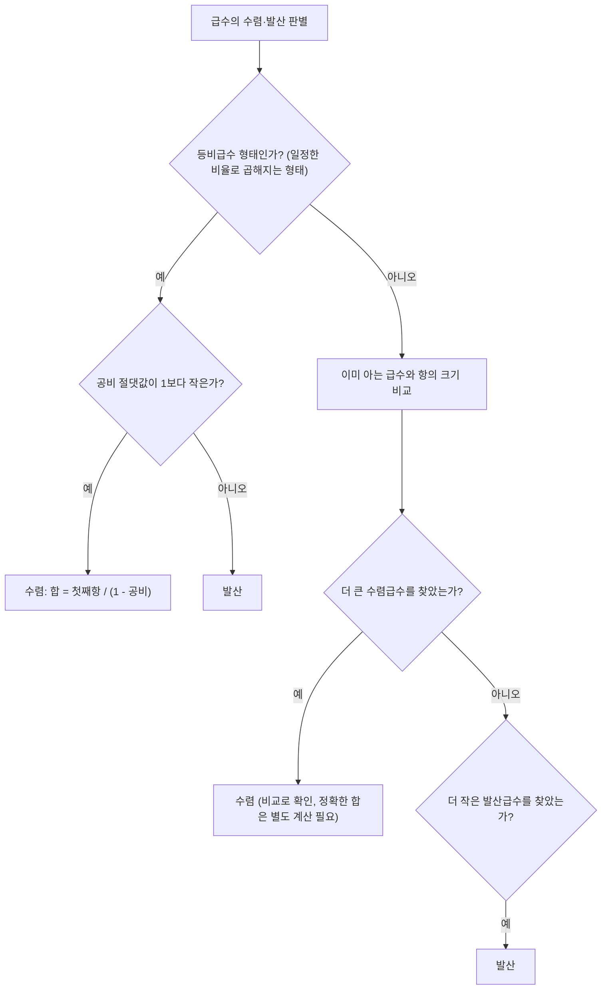

<Callout type="info">
  **이번 문서의 목표:** 이 문서를 다 읽으면 무한히 많은 항을 더하는 급수가 언제 하나의 유한한 값으로 정리되는지 판단하고, 등비급수의 합을 정확히 계산할 수 있다.
</Callout>

08편에서 등차수열·등비수열의 **부분합**(partial sum, 앞에서부터 몇 개 항만 더한 값) 공식을 다뤘다. 그런데 항이 유한 개가 아니라 **끝없이** 이어진다면 어떻게 될까? 이 편에서는 항을 무한히 더하는 **급수**(series, 수열의 항들을 계속 더한 것)를 다룬다. 언뜻 보면 무한히 더하면 무조건 무한대로 커질 것 같지만, 실제로는 특정 조건 아래에서 급수가 하나의 유한한 숫자로 "정리"되는 경우가 있다. 독학사 시험에서는 이 판별 조건과 등비급수의 합 계산이 핵심으로 나온다.

## 무한급수란 무엇인가

> **쉽게 말하면:** 수열의 항을 끝없이 계속 더한 것을 무한급수라 하고, 그 합이 하나의 숫자로 정해지면 "수렴한다"고 한다.

수열 $a_1, a_2, a_3, \ldots$의 모든 항을 차례로 더한 식을 **무한급수**(infinite series)라 하고 다음과 같이 쓴다.

$$
\sum_{n=1}^{\infty} a_n = a_1+a_2+a_3+\cdots
$$

- $\sum$: 시그마(sigma), "다음에 오는 것을 모두 더하라"는 뜻의 기호
- $n=1$: 더하기 시작하는 항의 번호(아래 첨자)
- $\infty$: 무한대(infinity), 항을 끝없이 더한다는 뜻(위 첨자)
- $a_n$: 더해지는 수열의 $n$번째 항

이 무한한 덧셈을 직접 다룰 수는 없으므로, **부분합**을 이용해 우회한다. 첫 $n$개 항까지의 부분합을 $S_n = a_1+a_2+\cdots+a_n$이라 하자. $n$을 1, 2, 3, ...으로 점점 키워 가면서 $S_n$이라는 수열 자체가 어떤 값에 점점 가까워지는지를 관찰한다.

> **쉽게 말하면:** 무한급수의 합은 "부분합들의 수열"이 어디로 다가가는지를 보고 정한다.

만약 $n$이 한없이 커질 때 $S_n$이 어떤 고정된 숫자 $S$에 한없이 가까워지면, 그 무한급수는 $S$로 **수렴**(converge, 한 값으로 모여든다)한다고 하고 다음처럼 쓴다.

$$
\sum_{n=1}^{\infty} a_n = S
$$

반대로 $S_n$이 특정 값에 다가가지 않고 한없이 커지거나, 값이 이리저리 진동해서 하나로 정해지지 않으면 그 급수는 **발산**(diverge, 한 값으로 모이지 않는다)한다고 한다.

**예시로 감을 잡아 보자.** $a_n = \dfrac{1}{2^n}$인 수열, 즉 $\dfrac{1}{2}, \dfrac{1}{4}, \dfrac{1}{8}, \dfrac{1}{16}, \ldots$을 계속 더해 보자.

$$
S_1 = \frac{1}{2} = 0.5
$$

$$
S_2 = \frac{1}{2}+\frac{1}{4} = 0.75
$$

$$
S_3 = \frac{1}{2}+\frac{1}{4}+\frac{1}{8} = 0.875
$$

$$
S_4 = 0.875+\frac{1}{16} = 0.9375
$$

부분합이 $0.5, 0.75, 0.875, 0.9375, \ldots$로 점점 1에 가까워지는 것이 보인다. 실제로 이 급수는 정확히 1로 수렴한다(뒤에서 등비급수 공식으로 다시 확인한다). 반면 $a_n=1$(항상 1을 더하는 수열)의 경우 $S_n=n$이 되어 $n$이 커질수록 한없이 커지므로 발산한다.

## 등비급수의 수렴·발산 판별

> **쉽게 말하면:** 등비수열을 무한히 더한 것이 등비급수이고, 공비의 절댓값이 1보다 작을 때만 수렴한다.

**등비급수**(geometric series)는 등비수열 $a_1, a_1r, a_1r^2, \ldots$을 무한히 더한 것이다.

$$
\sum_{n=1}^{\infty} a_1 r^{n-1} = a_1+a_1r+a_1r^2+\cdots
$$

08편에서 구한 등비수열의 부분합 공식을 다시 가져오면 다음과 같다($r\neq1$일 때).

$$
S_n = \frac{a_1(1-r^n)}{1-r}
$$

이 식에서 $n$을 한없이 키울 때 무슨 일이 일어나는지는 전적으로 $r^n$이 어떻게 되는지에 달려 있다. 공비의 크기(절댓값)에 따라 세 가지 경우로 나뉜다.

| 공비 $r$의 범위 | $n\to\infty$일 때 $r^n$ | 급수 결과 |
|---|---|---|
| $-1 < r < 1$ (즉 $\lvert r\rvert<1$) | 0에 한없이 가까워짐 | 수렴 |
| $r=1$ | 항상 1 (변화 없음) | 발산(각 항이 $a_1$로 고정, 무한히 더하면 무한대) |
| $\lvert r\rvert \geq 1$이고 $r\neq1$ | 0에 가까워지지 않음(진동하거나 무한히 커짐) | 발산 |

$-1<r<1$일 때는 $r^n$이 0에 한없이 가까워지므로, 부분합 공식에서 $r^n$ 자리에 0을 대입한 것과 같은 값으로 정리된다.

$$
S = \lim_{n\to\infty} \frac{a_1(1-r^n)}{1-r} = \frac{a_1(1-0)}{1-r} = \frac{a_1}{1-r}
$$

- $\lim_{n\to\infty}$: "리미트, $n$이 한없이 커질 때의 극한값"(10편에서 극한의 정의를 더 자세히 다룬다)
- $a_1$: 첫째항
- $r$: 공비, $-1<r<1$이어야 이 공식을 쓸 수 있다

이렇게 정리한 **등비급수의 합 공식**은 다음과 같다.

$$
\sum_{n=1}^{\infty} a_1 r^{n-1} = \frac{a_1}{1-r} \quad (-1<r<1)
$$

**앞에서 본 예시로 검산하자.** $a_n=\dfrac{1}{2^n}$은 첫째항 $a_1=\dfrac12$, 공비 $r=\dfrac12$인 등비급수다($-1<\dfrac12<1$이므로 수렴 조건을 만족한다).

$$
S = \frac{\frac{1}{2}}{1-\frac{1}{2}} = \frac{\frac{1}{2}}{\frac{1}{2}} = 1
$$

앞서 부분합을 직접 더했을 때 $0.9375$까지 1에 점점 가까워지던 관찰과 정확히 일치한다(검산 완료).

**예시 — 공비가 음수인 경우.** 첫째항 4, 공비 $-\dfrac{1}{3}$인 등비급수의 합을 구해 보자. 공비의 절댓값 $\left|-\dfrac13\right|=\dfrac13$이 1보다 작으므로 수렴한다.

$$
S = \frac{4}{1-\left(-\frac{1}{3}\right)}
$$

분모를 먼저 정리한다.

$$
1-\left(-\frac{1}{3}\right) = 1+\frac{1}{3} = \frac{4}{3}
$$

대입해서 나눗셈을 완료한다.

$$
S = \frac{4}{\frac{4}{3}} = 4 \times \frac{3}{4} = 3
$$

**검산.** 첫 몇 개 항을 직접 나열하면 $4, -\dfrac43, \dfrac49, -\dfrac{4}{27}, \ldots$이다. 부분합을 계산하면 $S_1=4$, $S_2=4-\dfrac43=\dfrac83\approx2.667$, $S_3=\dfrac83+\dfrac49=\dfrac{24}{9}+\dfrac{4}{9}=\dfrac{28}{9}\approx3.111$, $S_4\approx3.111-0.148\approx2.963$으로 3을 사이에 두고 점점 좁혀 들어가는 모습을 보인다. 공식으로 구한 3과 방향이 일치한다(검산 완료).

**발산하는 경우도 확인해 보자.** 공비 $r=2$인 등비급수 $1+2+4+8+\cdots$는 $\lvert r\rvert=2\geq1$이므로 발산한다. 실제로 부분합은 $1, 3, 7, 15, 31, \ldots$로 끝없이 커지기만 하고 어떤 값에도 가까워지지 않는다. 이런 경우 등비급수 합 공식 $\dfrac{a_1}{1-r}$을 억지로 대입하면 안 된다 — 공식 자체가 $-1<r<1$일 때만 성립하기 때문이다.

## 비교를 통한 수렴 직관

> **쉽게 말하면:** 항의 크기가 이미 아는 수렴하는(또는 발산하는) 급수보다 작은지 큰지를 비교해서 수렴 여부를 짐작할 수 있다.

독학사 수준에서는 복잡한 수렴 판정법(비율판정법, 적분판정법 등)까지 요구하지 않지만, **항의 크기를 비교하는 직관**은 알아 두는 것이 좋다. 기본 아이디어는 다음과 같다.

- 어떤 급수 $\sum a_n$의 각 항이, 이미 **수렴한다고 알고 있는** 급수 $\sum b_n$의 각 항보다 항상 작거나 같다면($0\leq a_n\leq b_n$), $\sum a_n$도 수렴한다. "더 작은 것들의 합이 유한하면, 그보다 큰 것도 유한하니 작은 쪽은 당연히 유한하다"는 상식적인 방향이다.
- 반대로 $\sum a_n$의 각 항이 **발산한다고 알고 있는** 급수 $\sum c_n$의 각 항보다 항상 크거나 같다면($a_n\geq c_n\geq0$), $\sum a_n$도 발산한다.

**예시.** $\displaystyle\sum_{n=1}^{\infty}\frac{1}{2^n+n}$이 수렴하는지 직관적으로 판단해 보자. 이 급수의 각 항을 이미 수렴을 알고 있는 등비급수 $\displaystyle\sum\frac{1}{2^n}$과 비교한다. 분모에 $n$이 더해졌으므로 분모가 더 커지고, 분모가 커지면 분수 값은 더 작아진다.

$$
\frac{1}{2^n+n} < \frac{1}{2^n} \quad (n\geq1)
$$

$\displaystyle\sum\frac{1}{2^n}$이 위에서 1로 수렴함을 이미 확인했고, $\displaystyle\sum\frac{1}{2^n+n}$의 각 항이 그보다 항상 작으므로, 비교 원리에 의해 $\displaystyle\sum\frac{1}{2^n+n}$도 수렴한다(구체적인 합의 값까지는 이 방법으로 구할 수 없고, "수렴한다"는 사실만 알 수 있다).

## 독학사 수준의 계산 예제

**예제 1.** $\displaystyle\sum_{n=1}^{\infty}\left(\frac{3}{4}\right)^{n-1}$의 값을 구하라.

이 급수는 $n=1$일 때 $\left(\dfrac34\right)^0=1$이 첫째항이 되는 등비급수로, 첫째항 $a_1=1$, 공비 $r=\dfrac34$이다. $\left|\dfrac34\right|<1$이므로 수렴한다.

$$
S = \frac{1}{1-\frac{3}{4}} = \frac{1}{\frac{1}{4}} = 4
$$

**검산.** 첫 4개 항을 직접 더하면 $1+0.75+0.5625+0.421875=2.734375$로 아직 4에는 못 미치지만, 항이 계속 작아지는 양수를 더하는 중이므로 값이 점점 4로 다가가는 추세와 방향이 일치한다(부분합이 항상 증가하면서 4를 넘지 않는다는 성질도 성립한다).

**예제 2.** 첫째항이 $-2$이고 공비가 $\dfrac12$인 등비급수의 합을 구하라.

$$
S = \frac{-2}{1-\frac{1}{2}} = \frac{-2}{\frac{1}{2}} = -2\times2 = -4
$$

**검산.** 첫 3개 항을 나열하면 $-2, -1, -0.5$이고 부분합은 $S_1=-2$, $S_2=-3$, $S_3=-3.5$로 점점 $-4$에 가까워지는 방향이 맞다(검산 완료).

**예제 3(순환소수를 분수로).** 등비급수는 순환소수를 분수로 바꾸는 데도 쓰인다. $0.777\ldots = 0.\overline{7}$을 분수로 바꿔 보자. 이 수는 $\dfrac{7}{10}+\dfrac{7}{100}+\dfrac{7}{1000}+\cdots$로 쓸 수 있으므로, 첫째항 $a_1=\dfrac{7}{10}$, 공비 $r=\dfrac{1}{10}$인 등비급수다.

$$
S = \frac{\frac{7}{10}}{1-\frac{1}{10}} = \frac{\frac{7}{10}}{\frac{9}{10}} = \frac{7}{10}\times\frac{10}{9} = \frac{7}{9}
$$

**검산.** $\dfrac{7}{9}$를 실제로 나눗셈하면 $7\div9=0.777\ldots$로 순환소수 $0.\overline{7}$과 정확히 일치한다(검산 완료).

## 자주 틀리는 점

- **공비의 범위를 확인하지 않고 등비급수 합 공식을 쓴다.** $\dfrac{a_1}{1-r}$은 $-1<r<1$일 때만 성립한다. $\lvert r\rvert\geq1$이면 급수 자체가 발산하므로 공식을 적용할 수 없다.
- **공비를 잘못 읽는다.** $\displaystyle\sum\left(\dfrac34\right)^{n-1}$처럼 지수가 $n-1$인 형태에서 첫째항은 $n=1$을 대입한 값이지, 괄호 안의 수 자체가 아니다. $n=1$일 때 지수가 0이 되어 첫째항이 1이 된다는 점을 놓치기 쉽다.
- **부분합의 수렴과 급수의 수렴을 다른 개념으로 착각한다.** 급수의 수렴은 정의 자체가 "부분합의 수열이 어떤 값에 가까워지는가"이므로 둘은 같은 것을 다르게 부르는 말이다.
- **비교 판정의 부등호 방향을 반대로 쓴다.** 더 큰 수렴급수와 비교해야 수렴을, 더 작은 발산급수와 비교해야 발산을 결론지을 수 있다. 방향이 반대면 아무것도 증명할 수 없다.
- **공비가 $-1$과 $1$을 포함하는 경계값일 때를 빠뜨린다.** $r=1$과 $r=-1$은 모두 발산하는 경우이며(단, $r=-1$은 값이 진동만 하고 무한대로 커지지는 않는다는 차이가 있다), $-1<r<1$처럼 등호가 없는 부등식이라는 점을 확인해야 한다.

## 핵심 정리

- 무한급수는 부분합 $S_n$의 수열이 어떤 값에 가까워지면 수렴, 그렇지 않으면 발산한다.
- 등비급수 $\displaystyle\sum_{n=1}^{\infty} a_1r^{n-1}$은 $-1<r<1$일 때만 수렴하며, 그 합은 $\dfrac{a_1}{1-r}$이다.
- $r=1$이면 항이 고정된 채 무한히 더해져 발산하고, $\lvert r\rvert\geq1$이면 항의 크기가 0으로 줄지 않아 발산한다.
- 이미 수렴·발산을 아는 급수와 항의 크기를 비교하면, 정확한 합을 몰라도 수렴·발산 여부는 판단할 수 있다.
- 순환소수는 등비급수로 표현해 정확한 분수 값으로 변환할 수 있다.

## 마무리 복습

<Quiz
  questionNumber={1}
  question="등비급수가 수렴하기 위한 공비 r의 조건은?"
  options={['-1 < r < 1', 'r > 0', 'r ≥ 1', 'r은 정수여야 한다']}
  correctAnswer={1}
  explanation="등비급수는 공비의 절댓값이 1보다 작을 때, 즉 공비가 -1보다 크고 1보다 작을 때만 부분합이 유한한 값으로 수렴한다. r=1이면 항이 고정되어 발산하고 r의 절댓값이 1 이상이면 항의 크기가 0으로 줄어들지 않아 발산한다."
  optionExplanations={['정답이다. 공비의 절댓값이 1보다 작아야 등비급수가 수렴한다.', '공비가 양수라고 해서 항상 수렴하는 것은 아니다. r=2처럼 1보다 큰 양수는 발산한다.', 'r이 1 이상이면 오히려 발산하는 경우다.', '공비는 정수가 아닌 분수나 소수여도 조건만 맞으면 수렴할 수 있다.']}
/>

<Quiz
  questionNumber={2}
  question="첫째항이 6이고 공비가 1/3인 등비급수의 합은?"
  options={['9', '8', '18', '6.5']}
  correctAnswer={1}
  explanation="공식 S=a(1)/(1-r)에 a(1)=6, r=1/3을 대입하면 S=6/(1-1/3)=6/(2/3)=6×3/2=9이다. 검산: 첫 항들은 6, 2, 2/3, 2/9로 부분합이 6, 8, 8.667, 8.889로 점점 9에 가까워지는 방향과 일치한다."
  optionExplanations={['정답이다. 6을 2/3으로 나누면 9가 된다.', '분모 계산에서 1-1/3을 2/3이 아닌 1/3으로 잘못 계산한 오답에 가깝다.', '분모를 나누지 않고 3을 곱한 값에 가까운 오답이다.', '첫째항의 절반만 더한 값에 해당하는 오답이다.']}
/>

<Quiz
  questionNumber={3}
  question="급수 1 + 3 + 9 + 27 + ⋯ 에 대한 설명으로 옳은 것은?"
  options={['공비가 3으로 1보다 크므로 발산한다', '공비가 3이지만 첫째항이 1이라 수렴한다', '등차급수이므로 합 공식이 다르다', '공비가 1/3이므로 수렴한다']}
  correctAnswer={1}
  explanation="이 급수는 첫째항 1, 공비 3인 등비급수다. 공비의 절댓값 3이 1보다 크므로 등비급수 수렴 조건(공비가 -1보다 크고 1보다 작아야 함)을 만족하지 못해 발산한다. 실제로 부분합이 1, 4, 13, 40, ...으로 한없이 커진다."
  optionExplanations={['정답이다. 공비 3은 1보다 크므로 수렴 조건을 벗어나 발산한다.', '수렴 여부는 첫째항이 아니라 공비의 절댓값으로만 결정되므로 틀린 설명이다.', '이 급수는 이웃한 항의 비율이 일정한 등비급수이지 등차급수가 아니다.', '이 급수의 공비는 3이지 1/3이 아니다. 이웃한 항을 나눠 보면 3/1=3, 9/3=3으로 확인된다.']}
/>

<Quiz
  questionNumber={4}
  question="순환소수 0.333...(=0.3̄)을 분수로 나타내면?"
  options={['1/3', '3/10', '1/9', '3/100']}
  correctAnswer={1}
  explanation="0.333...은 3/10 + 3/100 + 3/1000 + ⋯로, 첫째항 3/10, 공비 1/10인 등비급수다. 공식 S=a(1)/(1-r)에 대입하면 S=(3/10)/(1-1/10)=(3/10)/(9/10)=3/9=1/3이다. 검산: 1을 3으로 나누면 0.333...이 나와 일치한다."
  optionExplanations={['정답이다. 계산을 끝까지 하면 3/9가 약분되어 1/3이 된다.', '이것은 첫째항 자체이지 최종 약분된 분수가 아니다.', '0.111...에 해당하는 분수로, 이 문제와는 다른 순환소수의 값이다.', '이것은 첫째항을 100으로 나눈 값으로, 등비급수의 두 번째 항에 해당한다.']}
/>

<Quiz
  questionNumber={5}
  question="급수 Σ(1/(3^n + 1))의 수렴 여부를 비교 판정으로 설명할 때 가장 적절한 것은?"
  options={['각 항이 1/3^n보다 작고, Σ(1/3^n)이 수렴하므로 이 급수도 수렴한다', '각 항이 1/3^n보다 크므로 발산한다', '등비급수가 아니므로 판정이 불가능하다', '공비가 존재하지 않아 항상 발산한다']}
  correctAnswer={1}
  explanation="분모에 1이 더해져 1/(3^n+1)은 항상 1/3^n보다 작다. Σ(1/3^n)은 공비 1/3인 등비급수로 수렴이 이미 확인되었으므로, 그보다 작은 항을 갖는 이 급수도 비교 판정에 의해 수렴한다."
  optionExplanations={['정답이다. 더 작은 항의 합은 더 큰 수렴급수보다 클 수 없으므로 함께 수렴한다.', '분모가 더 크므로 분수 값은 더 작아지는 것이 맞다. 크다고 한 것은 방향이 반대다.', '등비급수가 아니어도 이미 아는 등비급수와 크기를 비교하는 방법으로 판정할 수 있다.', '공비가 없는 형태라고 해서 항상 발산하는 것은 아니며, 비교 판정으로 수렴을 보일 수 있다.']}
/>

<Quiz
  questionNumber={6}
  question="공비가 -1/2, 첫째항이 8인 등비급수의 합은?"
  options={['16/3', '4', '8/3', '-16']}
  correctAnswer={1}
  explanation="공식 S=a(1)/(1-r)에 a(1)=8, r=-1/2를 대입하면 S=8/(1-(-1/2))=8/(3/2)=8×2/3=16/3이다. 절댓값이 1/2로 1보다 작으므로 수렴 조건도 만족한다."
  optionExplanations={['정답이다. 분모 3/2로 8을 나누면 16/3이 된다.', '공비의 부호를 반대로 처리해 분모를 1/2로 계산한 오답에 가깝다.', '분자·분모 계산 과정에서 약분을 잘못한 오답이다.', '공비가 음수라서 합도 음수여야 한다고 착각한 오답이다. 첫째항이 양수이고 분모도 양수이므로 합은 양수다.']}
/>

## 참고 자료

- [국가평생교육진흥원 독학학위제 시험안내](https://bdes.nile.or.kr)
- [MathWorld - Geometric Series](https://mathworld.wolfram.com/GeometricSeries.html)
- [NIST/SEMATECH e-Handbook of Statistical Methods](https://www.itl.nist.gov/div898/handbook/)
