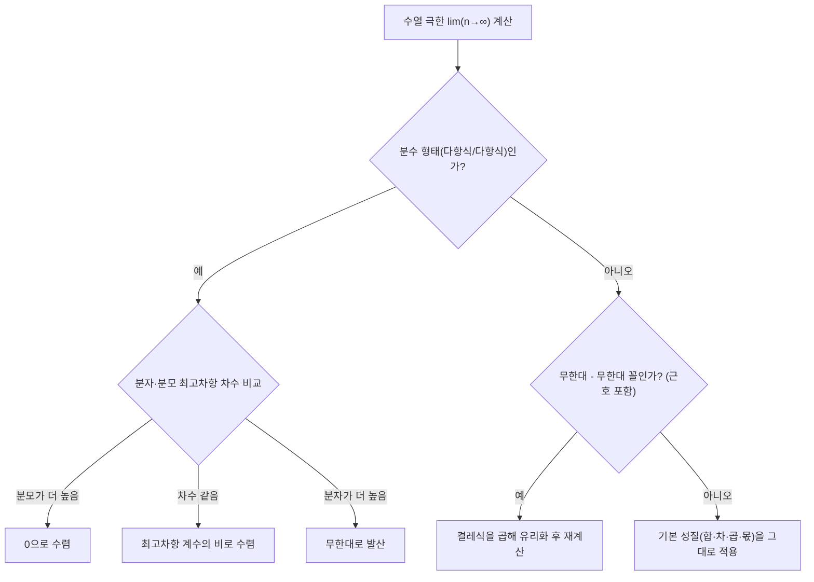

<Callout type="info">
  **이번 문서의 목표:** 이 문서를 다 읽으면 수열이 무한히 진행될 때 어디로 다가가는지를 판단하고, 분수·다항식 형태의 수열 극한을 표준 절차로 계산할 수 있다.
</Callout>

09편에서 무한급수를 다룰 때 이미 "$n$이 한없이 커질 때 부분합이 어떤 값에 가까워진다"는 표현을 여러 번 썼다. 이 편에서는 그 "가까워진다"는 개념 자체 — **수열의 극한**(limit of a sequence) — 을 정식으로 정의하고, 극한을 계산하는 표준 절차를 익힌다. 이 편의 내용은 11편(함수의 극한)과 12편(극한 계산 기술), 13편(미분)까지 그대로 이어지는 기초이므로, 여기서 계산 절차를 확실히 잡아 두어야 한다.

## 수열의 극한: 직관적 정의

> **쉽게 말하면:** $n$을 한없이 크게 만들었을 때 수열의 항이 어떤 고정된 값에 한없이 가까워지면, 그 값이 수열의 극한이다.

수열 $a_n$에서 $n$을 1, 2, 3, ...으로 계속 키워 나갈 때, $a_n$의 값이 어떤 특정한 숫자 $L$에 한없이 가까워지고 그 차이가 얼마든지 작아질 수 있다면, 수열 $\{a_n\}$은 $L$로 **수렴**(converge)한다고 하고 다음과 같이 쓴다.

$$
\lim_{n\to\infty} a_n = L
$$

- $\lim$: 리미트(limit), "극한값을 구하라"는 뜻의 기호
- $n\to\infty$: "$n$이 무한대로 간다", 즉 $n$을 한없이 크게 만든다는 뜻
- $a_n$: 극한을 구하려는 수열의 $n$번째 항
- $L$: 수열이 다가가는 목표값(극한값)

이 정의는 엄밀한 수학적 정의(입실론-엔 논법)를 간단히 줄인 **직관적 정의**다. 독학사 시험 수준에서는 엄밀한 정의를 증명하는 문제는 나오지 않고, "이 수열이 어디로 다가가는가"를 계산으로 찾는 문제가 나온다.

**예시로 감을 잡아 보자.** $a_n = \dfrac{1}{n}$이라는 수열을 생각하자. $n=1,2,3,10,100,1000$을 차례로 대입해 보면 다음과 같다.

$$
a_1=1,\ a_2=0.5,\ a_3\approx0.333,\ a_{10}=0.1,\ a_{100}=0.01,\ a_{1000}=0.001
$$

$n$이 커질수록 $a_n$의 값이 점점 0에 가까워지는 것이 뚜렷하게 보인다. 아무리 작은 목표 오차를 잡아도 $n$을 충분히 크게 하면 $a_n$을 그보다 더 0에 가깝게 만들 수 있다. 따라서 이 수열은 0으로 수렴한다.

$$
\lim_{n\to\infty}\frac{1}{n} = 0
$$

이 결과는 앞으로 나올 모든 극한 계산의 **기본 재료**가 된다. 일반화하면, $k>0$인 상수에 대해 다음이 항상 성립한다.

$$
\lim_{n\to\infty}\frac{1}{n^k} = 0
$$

- $k$: 양의 상수(지수). $k$가 커질수록 분모가 더 빨리 커져서 분수는 더 빨리 0에 가까워진다.

## 수렴과 발산

> **쉽게 말하면:** 극한값이 하나로 정해지면 수렴, 무한대로 커지거나 값이 계속 흔들리면 발산이다.

수열의 극한이 존재하지 않는 경우는 크게 두 가지로 나뉜다.

**첫째, 양의 무한대 또는 음의 무한대로 발산하는 경우.** $a_n=n$이라는 수열은 $n$이 커질수록 값 자체가 한없이 커지므로, 어떤 고정된 수 $L$에도 가까워지지 않는다. 이런 경우는 편의상 다음처럼 표기하지만, 이는 "수렴한다"는 뜻이 아니라 "한없이 커지는 방식으로 발산한다"는 뜻이다.

$$
\lim_{n\to\infty} n = \infty
$$

**둘째, 진동으로 발산하는 경우.** $a_n=(-1)^n$이라는 수열은 $n$이 홀수면 $-1$, 짝수면 $1$을 번갈아 갖는다. 즉 $-1, 1, -1, 1, \ldots$로 두 값 사이를 영원히 왔다 갔다 하므로, 어떤 하나의 값으로도 다가가지 않는다. 이런 경우를 **진동**(oscillation)이라 하고, 극한값 자체가 존재하지 않는다.

| 수열 예시 | $n$이 커질 때의 모습 | 결과 |
|---|---|---|
| $a_n=\dfrac1n$ | 0에 한없이 가까워짐 | 0으로 수렴 |
| $a_n=n$ | 한없이 커짐 | 양의 무한대로 발산 |
| $a_n=-n$ | 한없이 작아짐(음수 방향으로) | 음의 무한대로 발산 |
| $a_n=(-1)^n$ | $-1$과 $1$을 번갈아 반복 | 진동(극한 없음) |

## 극한의 기본 성질

> **쉽게 말하면:** 각 수열의 극한값을 먼저 따로 구한 뒤, 사칙연산은 그 극한값끼리 그대로 적용해도 된다.

두 수열 $\{a_n\}$, $\{b_n\}$이 각각 극한값 $\lim_{n\to\infty}a_n=A$, $\lim_{n\to\infty}b_n=B$로 수렴한다고 하자(단, $A$, $B$는 유한한 값이다). 이때 다음 성질들이 성립한다.

$$
\lim_{n\to\infty}(a_n+b_n) = A+B
$$

$$
\lim_{n\to\infty}(a_n-b_n) = A-B
$$

$$
\lim_{n\to\infty}(c \cdot a_n) = c A \quad (c\text{는 상수})
$$

$$
\lim_{n\to\infty}(a_n \cdot b_n) = A B
$$

$$
\lim_{n\to\infty}\frac{a_n}{b_n} = \frac{A}{B} \quad (B\neq0)
$$

- $A$, $B$: 각 수열이 수렴하는 극한값
- $c$: 수열과 무관한 고정된 상수
- 나눗셈 성질은 분모의 극한값 $B$가 0이 아닐 때만 성립한다(0이면 별도로 처리해야 하며, 이는 12편에서 자세히 다룬다).

**이 성질들의 핵심은 "먼저 각자 극한을 구하고, 그다음 사칙연산을 한다"는 순서다.** 이 순서를 거꾸로 해서 극한 기호가 붙은 채로 계산하려 하면 안 된다.

**예시.** $\displaystyle\lim_{n\to\infty}\left(\frac{1}{n}+3\right)$을 계산해 보자. $\dfrac1n$의 극한은 0이고, 상수 3은 그대로 상수이므로 3의 극한도 3이다.

$$
\lim_{n\to\infty}\left(\frac{1}{n}+3\right) = \lim_{n\to\infty}\frac{1}{n} + \lim_{n\to\infty}3 = 0+3 = 3
$$

**검산.** $n=10$이면 $\dfrac1{10}+3=3.1$, $n=1000$이면 $\dfrac1{1000}+3=3.001$로 $n$이 커질수록 3에 점점 가까워지는 흐름이 계산 결과와 일치한다(검산 완료).

## 단순 극한 계산 유형

> **쉽게 말하면:** 분수 형태의 수열은 분모의 최고차항으로 분자·분모를 동시에 나눠서 극한을 구한다.

시험에 가장 많이 나오는 유형은 분자와 분모가 모두 $n$에 대한 다항식인 분수 수열의 극한이다. 이런 경우는 **분모의 최고차항**(가장 차수가 높은 항)으로 분자와 분모를 동시에 나누는 표준 절차를 쓴다.

**예제 1.** $\displaystyle\lim_{n\to\infty}\frac{2n+3}{5n-1}$을 계산해 보자.

분모의 최고차항은 $n$(1차항)이므로 분자와 분모를 모두 $n$으로 나눈다.

$$
\frac{2n+3}{5n-1} = \frac{\frac{2n}{n}+\frac{3}{n}}{\frac{5n}{n}-\frac{1}{n}} = \frac{2+\frac{3}{n}}{5-\frac{1}{n}}
$$

이제 $n\to\infty$일 때 $\dfrac3n\to0$, $\dfrac1n\to0$이므로 극한을 대입한다.

$$
\lim_{n\to\infty}\frac{2+\frac{3}{n}}{5-\frac{1}{n}} = \frac{2+0}{5-0} = \frac{2}{5}
$$

**검산.** $n=1000$을 직접 대입하면 $\dfrac{2(1000)+3}{5(1000)-1}=\dfrac{2003}{4999}\approx0.4007$이고, $\dfrac25=0.4$와 거의 일치한다(차이는 $n$이 유한하기 때문에 생기는 오차이며 $n$이 커질수록 더 좁혀진다).

**예제 2 — 분모의 차수가 더 높은 경우.** $\displaystyle\lim_{n\to\infty}\frac{3n+1}{n^2+2}$를 계산해 보자. 분모의 최고차항은 $n^2$이므로 분자·분모를 $n^2$으로 나눈다.

$$
\frac{3n+1}{n^2+2} = \frac{\frac{3n}{n^2}+\frac{1}{n^2}}{\frac{n^2}{n^2}+\frac{2}{n^2}} = \frac{\frac{3}{n}+\frac{1}{n^2}}{1+\frac{2}{n^2}}
$$

$n\to\infty$일 때 $\dfrac3n, \dfrac1{n^2}, \dfrac2{n^2}$ 모두 0으로 가므로

$$
\lim_{n\to\infty}\frac{\frac{3}{n}+\frac{1}{n^2}}{1+\frac{2}{n^2}} = \frac{0+0}{1+0} = 0
$$

**검산.** $n=100$을 대입하면 $\dfrac{301}{10002}\approx0.0301$로 0에 가까운 작은 값이 나와 결과와 일치하는 흐름을 보인다.

**예제 3 — 분자의 차수가 더 높은 경우.** $\displaystyle\lim_{n\to\infty}\frac{n^2+1}{3n+2}$을 계산해 보자. 분모의 최고차항 $n$으로 나눈다.

$$
\frac{n^2+1}{3n+2} = \frac{\frac{n^2}{n}+\frac{1}{n}}{\frac{3n}{n}+\frac{2}{n}} = \frac{n+\frac{1}{n}}{3+\frac{2}{n}}
$$

분자에 $n$이 그대로 남아 $n\to\infty$일 때 분자는 한없이 커지고 분모는 3에 가까워지므로, 전체 값은 한없이 커진다.

$$
\lim_{n\to\infty}\frac{n+\frac{1}{n}}{3+\frac{2}{n}} = \infty
$$

**정리하면**, 분수 수열의 극한은 분자·분모의 최고차항 차수를 비교해서 다음 세 가지로 요약된다.

| 분자·분모의 최고차항 차수 비교 | 극한 결과 |
|---|---|
| 분모의 차수 > 분자의 차수 | 0으로 수렴 |
| 분모의 차수 = 분자의 차수 | 최고차항 계수의 비로 수렴 |
| 분모의 차수 < 분자의 차수 | 무한대로 발산 |

**예제 4 — 근호가 있는 경우.** $\displaystyle\lim_{n\to\infty}\left(\sqrt{n+1}-\sqrt{n}\right)$을 계산해 보자. 이대로는 $\infty-\infty$ 꼴로 바로 판단할 수 없으므로, **분자를 유리화**하는 기법을 쓴다(12편에서 이 기법을 더 자세히 다룬다). 켤레식 $\sqrt{n+1}+\sqrt{n}$을 분자·분모에 곱한다.

$$
\sqrt{n+1}-\sqrt{n} = \frac{(\sqrt{n+1}-\sqrt{n})(\sqrt{n+1}+\sqrt{n})}{\sqrt{n+1}+\sqrt{n}}
$$

분자는 $(\sqrt{n+1})^2-(\sqrt{n})^2=(n+1)-n=1$로 정리된다.

$$
= \frac{1}{\sqrt{n+1}+\sqrt{n}}
$$

$n\to\infty$일 때 분모 $\sqrt{n+1}+\sqrt{n}$은 한없이 커지므로, 분수 전체는 0으로 수렴한다.

$$
\lim_{n\to\infty}\frac{1}{\sqrt{n+1}+\sqrt{n}} = 0
$$

**검산.** $n=100$일 때 $\sqrt{101}-\sqrt{100}\approx10.0499-10=0.0499$로 0에 가까운 작은 값이 나와 결과와 일치한다.

## 수열과 함수의 연속성 연결

> **쉽게 말하면:** 수열의 극한은 "$n$이 자연수를 따라 점점 커지는" 특수한 경우이고, 함수의 극한·연속은 이를 실수 전체로 확장한 것이다.

지금까지 다룬 수열의 극한은 $n$이 1, 2, 3, ...처럼 **자연수만** 따라가며 커지는 특수한 상황이다. 반면 11편에서 다룰 **함수의 극한**은 $x$가 실수 전체(정수 사이의 모든 값 포함)를 연속적으로 움직이며 어떤 값에 다가가는 상황을 다룬다. 두 개념은 다음과 같이 연결된다.

- 수열 $a_n$을 함수처럼 보면, $a_n=f(n)$이라는 함수 $f$에 자연수 $n$만 대입한 것과 같다. 예를 들어 $a_n=\dfrac1n$은 함수 $f(x)=\dfrac1x$에 $x=n$(자연수)을 대입한 값들의 나열이다.
- 함수 $f(x)$가 $x\to\infty$일 때 $L$로 수렴한다면($\lim_{x\to\infty}f(x)=L$), 그 함수에 자연수만 대입한 수열 $a_n=f(n)$도 같은 값 $L$로 수렴한다. 즉 함수의 극한이 존재하면, 거기서 자연수만 뽑아 만든 수열의 극한도 자동으로 같은 값을 갖는다.
- 함수의 **연속**(continuity, 그래프가 끊어지지 않고 이어지는 성질)은 "$x$가 특정 점 $a$에 가까워질 때 함숫값 $f(x)$도 $f(a)$에 가까워진다"는 개념인데, 이는 곧 $x_n\to a$인 임의의 수열 $x_n$에 대해 $f(x_n)\to f(a)$가 성립한다는 뜻과 같다. 즉 함수의 연속성은 "그 함수에 어떤 방식으로 다가가는 수열을 넣어도 함숫값이 목표점에서의 값으로 수렴한다"는 수열 극한의 언어로도 표현할 수 있다.

이 연결 관계 덕분에, 수열의 극한 계산에서 익힌 "최고차항으로 나누기", "유리화" 같은 기법은 11편·12편의 함수 극한 계산에서도 형태만 살짝 바뀐 채 그대로 재사용된다.

## 자주 틀리는 점

- **극한 기호를 붙인 채로 사칙연산 순서를 뒤바꾼다.** $\lim(a_n \cdot b_n)$을 계산할 때는 반드시 $a_n$과 $b_n$의 극한을 각각 따로 구한 뒤 곱해야 한다. 극한이 존재하지 않는 수열끼리는 이 성질을 함부로 적용할 수 없다.
- **분모의 최고차항이 아니라 분자의 최고차항으로 나눈다.** 표준 절차는 항상 **분모**의 최고차항 기준으로 나누는 것이다. 어느 쪽으로 나눠도 결과는 같지만, 분모 기준으로 나누는 습관을 들이면 실수를 줄일 수 있다.
- **분자·분모 차수가 같을 때 계수의 비를 놓친다.** 차수가 같으면 극한값은 0도 무한대도 아니고, 최고차항의 계수끼리 나눈 값이라는 점을 기억해야 한다.
- **$\infty-\infty$ 꼴을 그대로 0이라고 잘못 판단한다.** 무한대에서 무한대를 빼는 형태는 겉보기와 달리 0, 유한한 값, 또는 무한대 등 다양한 결과가 나올 수 있으므로 반드시 유리화나 식 정리를 거쳐야 한다.
- **진동하는 수열에 억지로 극한값을 부여한다.** $(-1)^n$처럼 값이 계속 바뀌는 수열은 극한이 아예 존재하지 않는다는 것이 정답이며, 두 값의 평균 등을 임의로 답하면 오답이다.

## 핵심 정리

- 수열의 극한은 $n$을 한없이 키울 때 $a_n$이 다가가는 값으로, $\lim_{n\to\infty}a_n=L$로 표기한다.
- 수렴하지 않는 경우는 무한대로 발산하거나, 여러 값 사이를 오가는 진동으로 나뉜다.
- 각 수열이 유한한 값으로 수렴할 때만 합·차·곱·몫의 극한을 각 극한값의 사칙연산으로 바꿀 수 있다(나눗셈은 분모 극한이 0이 아닐 때).
- 분수 형태의 수열은 분모의 최고차항으로 분자·분모를 나눠 차수를 비교해 극한을 구하고, 근호가 섞인 $\infty-\infty$ 꼴은 유리화로 처리한다.
- 수열의 극한은 함수의 극한에서 $n$이 자연수만 취하는 특수한 경우이며, 함수의 연속성도 수열의 극한 언어로 표현할 수 있다.

## 마무리 복습

<Quiz
  questionNumber={1}
  question="수열 a(n) = 1/n²의 n이 무한대로 갈 때 극한값은?"
  options={['0', '1', '무한대로 발산', '극한이 존재하지 않는다']}
  correctAnswer={1}
  explanation="1/n^k 형태는 k가 양수이면 n이 커질수록 분모가 한없이 커져 전체 값이 0에 한없이 가까워진다. n=10이면 0.01, n=100이면 0.0001로 실제로 0에 빠르게 다가간다."
  optionExplanations={['정답이다. 분모가 제곱으로 커지므로 0으로 더 빠르게 수렴한다.', '1은 n=1일 때의 값일 뿐 극한값이 아니다.', '분모가 커지므로 오히려 값은 작아진다. 발산이 아니라 수렴한다.', '이 수열은 하나의 값(0)에 명확히 다가가므로 극한이 존재한다.']}
/>

<Quiz
  questionNumber={2}
  question="극한 lim(n→∞) (4n-1)/(2n+3)의 값은?"
  options={['2', '4', '0', '1/2']}
  correctAnswer={1}
  explanation="분모의 최고차항 n으로 분자·분모를 나누면 (4-1/n)/(2+3/n)이 되고, n이 무한대로 갈 때 1/n과 3/n은 0으로 가므로 (4-0)/(2+0)=4/2=2이다. 분자·분모의 차수가 같으므로 최고차항 계수의 비인 4/2=2로 바로 확인할 수도 있다."
  optionExplanations={['정답이다. 최고차항 계수의 비 4/2를 계산하면 2다.', '분자의 계수 4를 그대로 답으로 쓴 오답이다.', '분모의 차수가 더 높을 때 나오는 결과를 이 문제에 잘못 적용한 오답이다.', '분자와 분모의 계수 위치를 반대로 나눈 오답이다(2/4).']}
/>

<Quiz
  questionNumber={3}
  question="극한 lim(n→∞) (2n+5)/(n²-3)의 값은?"
  options={['0', '2', '무한대로 발산', '5/3']}
  correctAnswer={1}
  explanation="분모의 최고차항 n²으로 나누면 (2/n+5/n²)/(1-3/n²)이 되고, n이 무한대로 갈 때 분자 항들은 모두 0으로 가지만 분모는 1로 남는다. 따라서 극한값은 0/1=0이다. 분모의 차수(2차)가 분자의 차수(1차)보다 높은 전형적인 경우다."
  optionExplanations={['정답이다. 분모의 차수가 분자보다 높으면 극한값은 0이다.', '차수가 같을 때 나오는 계수 비를 이 문제에 잘못 적용한 오답이다.', '분자의 차수가 분모보다 높을 때 나오는 결과이며 이 문제와는 반대 상황이다.', '분자·분모의 상수항만 가지고 계산한 오답으로, 최고차항 기준 계산이 아니다.']}
/>

<Quiz
  questionNumber={4}
  question="수열 a(n) = (-1)^n × 2 에 대한 설명으로 옳은 것은?"
  options={['극한이 존재하지 않는다(진동)', '0으로 수렴한다', '2로 수렴한다', '무한대로 발산한다']}
  correctAnswer={1}
  explanation="이 수열은 n이 홀수면 -2, 짝수면 2를 번갈아 갖는다. 즉 -2, 2, -2, 2, ...로 두 값을 영원히 오가므로 하나의 값으로 다가가지 않는 진동이며, 극한 자체가 존재하지 않는다."
  optionExplanations={['정답이다. 두 값을 번갈아 반복하는 진동이므로 극한이 존재하지 않는다.', '이 수열은 0에 가까워지는 것이 아니라 -2와 2 사이를 오간다.', '짝수 번째 항만 보면 2에 가깝지만 홀수 번째 항은 -2이므로 전체 수열은 2로 수렴하지 않는다.', '값의 크기가 2로 고정되어 있으므로 한없이 커지는 발산이 아니다.']}
/>

<Quiz
  questionNumber={5}
  question="극한 lim(n→∞) (√(n+2) - √n)의 값은?"
  options={['0', '2', '1', '무한대로 발산']}
  correctAnswer={1}
  explanation="켤레식 √(n+2)+√n을 분자·분모에 곱해 유리화하면 분자가 (n+2)-n=2로 정리되어 2/(√(n+2)+√n)이 된다. n이 무한대로 갈 때 분모가 한없이 커지므로 전체 값은 0으로 수렴한다."
  optionExplanations={['정답이다. 유리화 후 분모가 무한히 커지므로 0으로 수렴한다.', '유리화 후 분자에 남는 값 2를 그대로 최종 답으로 착각한 오답이다.', '분자를 절반으로 잘못 나눈 값에 가까운 오답이다.', '∞-∞ 꼴을 유리화하지 않고 겉모습만 보고 발산이라 판단한 오답이다.']}
/>

<Quiz
  questionNumber={6}
  question="함수 f(x)에서 lim(x→∞) f(x) = 3일 때, 수열 a(n) = f(n)에 대해 항상 참인 것은?"
  options={['lim(n→∞) a(n) = 3이다', 'a(n)은 항상 3이다', 'a(n)은 진동한다', 'a(n)의 극한은 알 수 없다']}
  correctAnswer={1}
  explanation="함수 f(x)가 x가 무한대로 갈 때 3으로 수렴한다면, 그 함수에 자연수 n만 대입해 만든 수열 a(n)=f(n)도 같은 값 3으로 수렴한다. 이는 수열의 극한이 함수의 극한에서 정의역을 자연수로 제한한 특수한 경우이기 때문이다."
  optionExplanations={['정답이다. 함수의 극한이 존재하면 그 값으로 만든 수열의 극한도 같은 값으로 수렴한다.', '극한값이 3이라는 것은 3에 가까워진다는 뜻이지 항상 정확히 3이라는 뜻이 아니다.', '함수의 극한이 존재하는 상황이므로 수열이 진동할 근거가 없다.', '함수와 수열의 극한 관계에 따라 수열의 극한값은 3으로 명확히 결정된다.']}
/>

## 참고 자료

- [국가평생교육진흥원 독학학위제 시험안내](https://bdes.nile.or.kr)
- [수학 공식 – 고등학교 미적분 (수열의 극한, 급수)](https://mathworld.wolfram.com/Limit.html)
- [MathWorld - Sequence](https://mathworld.wolfram.com/Sequence.html)
