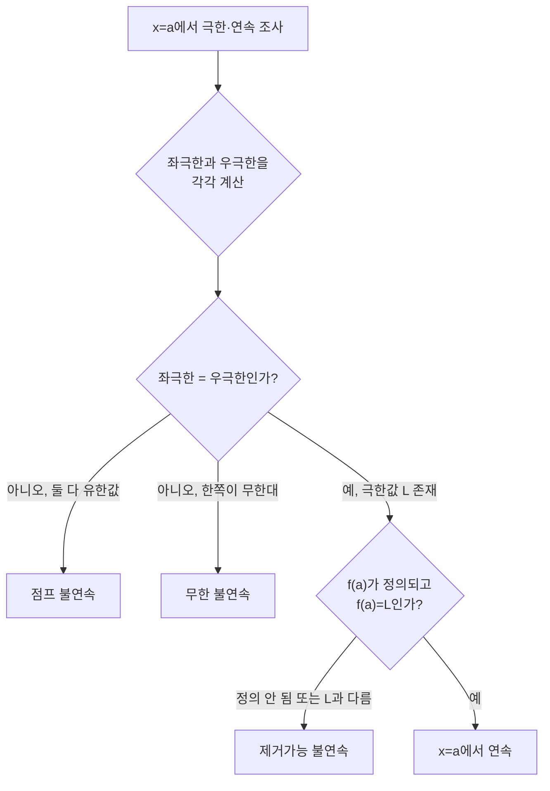

## 지난 편 복습: 수열의 극한에서 함수의 극한으로

10편에서 수열(數列, sequence)의 극한을 배웠다. 수열 $a_n$은 $n=1, 2, 3, \ldots$처럼 정수 번호를 매겨 나열한 값들이고, $n$이 한없이 커질 때 $a_n$이 어떤 값 $L$에 한없이 가까워지면 그 수열은 $L$로 수렴(收斂, converge)한다고 했다.

이 편에서 세우는 "좌극한·우극한·연속·불연속"이라는 언어는 12편의 극한 계산 기법, 13편 이후의 미분·적분 전체에서 계속 쓰이는 기초 문법이다.

## 함수의 극한이란 무엇인가

### 정의

$x$가 $a$가 아니면서 $a$에 한없이 가까워질 때 $f(x)$의 값이 어떤 실수 $L$에 한없이 가까워지면, 다음과 같이 쓴다.

$$
\lim_{x \to a} f(x) = L
$$

- $\lim$: 리밋(limit), "극한"이라고 읽는다
- $x \to a$: "$x$가 $a$로 간다", $x$가 $a$에 한없이 가까워진다는 뜻이지 $x=a$가 된다는 뜻이 아니다
- $L$: 극한값. $f(a)$ 자체가 정의되어 있는지, 정의되어 있다면 $L$과 같은지는 별개의 문제다

앞의 예시를 정리하면 $\displaystyle\lim_{x\to 1}\dfrac{x^2-1}{x-1}=2$다. 인수분해로 확인하면 $x\neq 1$일 때 $\dfrac{x^2-1}{x-1}=\dfrac{(x-1)(x+1)}{x-1}=x+1$이므로, $x$가 $1$에 가까워지면 $x+1$은 $2$에 가까워진다.

## 좌극한과 우극한

### 왜 나누어 보는가

수열은 $n$이 항상 커지는 방향(오른쪽)으로만 움직였지만, 함수의 $x$는 $a$보다 작은 쪽(왼쪽)에서 다가갈 수도, $a$보다 큰 쪽(오른쪽)에서 다가갈 수도 있다. 두 방향에서 다가간 결과가 항상 같다는 보장은 없다.

### 정의

$$
\lim_{x \to a^{-}} f(x)
$$

- $a^{-}$: "$a$ 마이너스", $a$보다 작은 값에서 $a$로 다가간다는 뜻. 이 극한을 **좌극한**(左極限, left-hand limit)이라 부른다

$$
\lim_{x \to a^{+}} f(x)
$$

- $a^{+}$: "$a$ 플러스", $a$보다 큰 값에서 $a$로 다가간다는 뜻. 이 극한을 **우극한**(右極限, right-hand limit)이라 부른다

**함수의 극한이 존재하기 위한 조건**은 다음과 같다.

$$
\lim_{x \to a} f(x) = L \iff \lim_{x \to a^{-}} f(x) = \lim_{x \to a^{+}} f(x) = L
$$

- $\iff$: "필요충분조건"을 나타내는 기호, 양쪽이 서로 동치(둘 다 참이거나 둘 다 거짓)라는 뜻(01편 조건명제 참고)

즉 좌극한과 우극한이 **둘 다 존재하고 서로 같을 때만** 그 공통값이 함수의 극한이 된다. 둘 중 하나라도 존재하지 않거나, 둘이 존재해도 값이 다르면 $\displaystyle\lim_{x\to a}f(x)$ 자체는 존재하지 않는다.

### 계산 예시: 절댓값 함수

$f(x) = \dfrac{|x|}{x}$ ($x \neq 0$)에서 $x=0$에서의 극한을 조사하자.

$x>0$일 때는 $|x|=x$이므로 $f(x) = \dfrac{x}{x} = 1$이다. 따라서

$$
\lim_{x \to 0^{+}} f(x) = 1
$$

$x<0$일 때는 $|x|=-x$이므로 $f(x) = \dfrac{-x}{x} = -1$이다. 따라서

$$
\lim_{x \to 0^{-}} f(x) = -1
$$

좌극한($-1$)과 우극한($1$)이 서로 다르므로, $\displaystyle\lim_{x\to 0}\dfrac{|x|}{x}$는 **존재하지 않는다**.

**검산.** $x=0.01$을 대입하면 $f(0.01) = 0.01/0.01 = 1$로 우극한 $1$에 가깝고, $x=-0.01$을 대입하면 $f(-0.01) = -0.01/0.01 = -1$로 좌극한 $-1$에 가깝다. 방향에 따라 실제로 다른 값에 다가가는 것이 수치로도 확인된다.

## 조각함수에서 좌극한·우극한 판단하기

조각함수는 구간에 따라 다른 식이 적용되므로, 경계값에서는 반드시 좌극한과 우극한을 따로 계산해야 한다.

다음 조각함수를 보자.

$$
f(x) = \begin{cases} x+1 & (x < 2) \\ 3x-3 & (x \geq 2) \end{cases}
$$

- 첫 번째 줄: $x$가 $2$보다 작을 때 적용되는 식
- 두 번째 줄: $x$가 $2$ 이상일 때 적용되는 식(등호가 이 식에 포함되어 있으므로 $f(2)$의 실제 값은 이 식으로 계산한다)

$x=2$에서의 좌극한은 $x<2$ 쪽 식을 쓴다.

$$
\lim_{x \to 2^{-}} f(x) = \lim_{x \to 2^{-}} (x+1) = 2+1 = 3
$$

$x=2$에서의 우극한은 $x \geq 2$ 쪽 식을 쓴다.

$$
\lim_{x \to 2^{+}} f(x) = \lim_{x \to 2^{+}} (3x-3) = 3(2)-3 = 3
$$

좌극한과 우극한이 모두 $3$으로 같으므로 $\displaystyle\lim_{x\to 2}f(x)=3$이다. 게다가 실제 함수값 $f(2) = 3(2)-3=3$도 $3$이므로, 이 함수는 $x=2$에서 극한값과 함수값이 일치한다(뒤에서 다룰 "연속"의 조건이다).

**검산.** $x=1.99$(왼쪽에서 접근)를 대입하면 $f(1.99) = 1.99+1 = 2.99$로 $3$에 근접한다. $x=2.01$(오른쪽에서 접근)을 대입하면 $f(2.01) = 3(2.01)-3 = 6.03-3=3.03$으로 역시 $3$에 근접한다. 양쪽에서 실제로 $3$을 향해 다가가는 것이 확인된다.

## 무한대로 가는 극한

무한대(無限大, infinity, 기호 $\infty$)로 가는 극한은 두 가지 상황으로 나뉜다.

### 상황 1: $x$가 무한대로 갈 때 함수값의 극한

$x$ 자체가 한없이 커지거나($x \to \infty$) 한없이 작아질 때($x \to -\infty$) $f(x)$가 다가가는 값을 본다.

$$
\lim_{x \to \infty} \frac{2x+1}{x}
$$

분자·분모를 $x$로 나눠 정리한다.

$$
\lim_{x \to \infty} \frac{2x+1}{x} = \lim_{x \to \infty} \left(2 + \frac{1}{x}\right)
$$

- $x \to \infty$일 때 $\dfrac{1}{x}$는 $0$에 한없이 가까워진다($x$가 커질수록 분수는 작아지므로)

$$
\lim_{x \to \infty} \left(2 + \frac{1}{x}\right) = 2 + 0 = 2
$$

**검산.** $x=1000$을 대입하면 $\dfrac{2(1000)+1}{1000} = \dfrac{2001}{1000} = 2.001$로 $2$에 매우 가깝다. $x=1{,}000{,}000$을 대입하면 $2.000001$로 더욱 가까워진다.

### 상황 2: $x$가 특정 값에 갈 때 함수값이 무한대로 갈 때

$$
\lim_{x \to 0^{+}} \frac{1}{x}
$$

$x$가 $0$보다 큰 쪽에서 $0$에 가까워지면, $\dfrac{1}{x}$의 분모가 한없이 작은 양수가 되어 전체 값은 한없이 커진다. 이때는 다음과 같이 쓴다.

$$
\lim_{x \to 0^{+}} \frac{1}{x} = \infty
$$

여기서 주의할 점이 있다. 따라서 $\lim_{x\to 0^+}\frac1x=\infty$는 극한이 **존재한다**는 뜻이 아니라 **존재하지 않는다**는 뜻이며, 다만 발산하는 방식(양의 무한대로 발산)을 구체적으로 알려주는 표기다.

반대로 $x$가 $0$보다 작은 쪽에서 $0$에 가까워지면 $\dfrac{1}{x}$는 한없이 작은(음의 방향으로 큰) 값이 되어 $\displaystyle\lim_{x\to 0^{-}}\dfrac1x = -\infty$가 된다. 좌극한과 우극한이 서로 다른 무한대로 가므로, $\displaystyle\lim_{x\to 0}\dfrac1x$ 자체는 존재하지 않는다.

**검산.** $x=0.001$을 대입하면 $\dfrac{1}{0.001}=1000$, $x=0.0001$을 대입하면 $10000$으로 값이 계속 커진다. $x=-0.001$을 대입하면 $-1000$으로 반대 방향으로 커진다.

## 연속의 정의

### 정의

함수 $f(x)$가 $x=a$에서 **연속**(連續, continuous)이려면 다음 세 조건을 **모두** 만족해야 한다.

$$
\text{① } f(a) \text{가 정의됨} \quad \text{② } \lim_{x\to a} f(x) \text{가 존재함} \quad \text{③ } \lim_{x\to a} f(x) = f(a)
$$

- 조건 ①: 그 지점에서 함수값 자체가 있어야 한다(정의역에 $a$가 포함되어야 한다)
- 조건 ②: 좌극한과 우극한이 존재하고 서로 같아야 한다
- 조건 ③: 극한값과 실제 함수값이 정확히 일치해야 한다

세 조건 중 하나라도 어긋나면 그 지점에서 **불연속**(不連續, discontinuous)이다. 앞서 조각함수 예시에서 $x=2$의 좌극한·우극한·함수값이 모두 $3$으로 일치했으므로, 그 함수는 $x=2$에서 연속이다.

## 불연속의 세 가지 유형

| 유형 | 깨지는 조건 | 그래프 모양 | 대표 예 |
|------|-------------|-------------|---------|
| 제거가능 불연속(removable discontinuity) | 조건 ①이나 ③ (극한은 존재하지만 함수값이 없거나 다름) | 한 점만 뻥 뚫린 구멍 | $f(x)=\dfrac{x^2-1}{x-1}$ ($x=1$에서) |
| 점프 불연속(jump discontinuity) | 조건 ② (좌극한 ≠ 우극한) | 그래프가 위아래로 뚝 끊김 | $f(x)=\dfrac{\lvert x \rvert}{x}$ ($x=0$에서) |
| 무한 불연속(infinite discontinuity) | 조건 ② (좌극한 또는 우극한이 무한대로 발산) | 점근선을 향해 치솟거나 곤두박질 | $f(x)=\dfrac{1}{x}$ ($x=0$에서) |

### 제거가능 불연속 자세히 보기

$f(x) = \dfrac{x^2-1}{x-1}$은 $x=1$에서 정의되지 않는다(분모가 $0$). 그런데 앞서 확인했듯 $\displaystyle\lim_{x\to1}f(x)=2$는 존재한다.

이 경우 "구멍"은 $f(1)=2$라고 **하나의 값만 새로 정의**해주면 메울 수 있다. 그래서 이 불연속을 "제거할 수 있다(removable)"고 부른다. 실제로 $g(x)=x+1$이라는 함수는 $f(x)$와 $x=1$을 뺀 모든 점에서 완전히 같은 그래프를 그리면서 $x=1$에서도 매끄럽게 이어진다.

### 점프 불연속과 무한 불연속 구분하기

점프 불연속은 좌극한과 우극한이 **둘 다 유한한 값으로 존재**하지만 서로 다른 경우다(앞의 절댓값 예시: $-1$과 $1$). 무한 불연속은 좌극한이나 우극한 중 **적어도 하나가 무한대로 발산**하는 경우다(앞의 $1/x$ 예시).

## 극한·연속 판단 흐름

```mermaid
flowchart TD
    A["x=a에서 극한·연속 조사"] --> B{"좌극한과 우극한을\n각각 계산"}
    B --> C{"좌극한 = 우극한인가?"}
    C -->|아니오, 둘 다 유한값| D["점프 불연속"]
    C -->|아니오, 한쪽이 무한대| E["무한 불연속"]
    C -->|예, 극한값 L 존재| F{"f(a)가 정의되고\nf(a)=L인가?"}
    F -->|정의 안 됨 또는 L과 다름| G["제거가능 불연속"]
    F -->|예| H["x=a에서 연속"]
```

## 자주 틀리는 점

- **좌극한·우극한을 확인하지 않고 극한이 존재한다고 단정한다.** 조각함수나 절댓값이 포함된 함수는 경계값에서 반드시 양쪽을 따로 계산해야 한다.
- **극한이 존재하면 그 지점에서 연속이라고 착각한다.** 극한이 존재해도 함수값이 없거나(정의역 제외) 함수값과 다르면 불연속이다(제거가능 불연속이 이 경우다).
- **$\lim_{x\to a}f(x)=\infty$를 "극한이 존재한다"고 오해한다.** $\infty$는 발산하는 모양을 알려주는 표기일 뿐, 실수 값으로 수렴한다는 뜻이 아니다.
- **조각함수의 경계값 $x=a$ 자체에서 어느 식을 써야 하는지 헷갈린다.** 등호가 어느 구간에 붙어 있는지($x\geq a$인지 $x>a$인지)를 정확히 확인하고, 그 등호가 붙은 식으로 $f(a)$를 계산해야 한다.

## 핵심 정리

- 함수의 극한은 좌극한과 우극한이 모두 존재하고 서로 같을 때만 존재하며, 그 공통값이 극한값이다.
- 무한대 극한은 "$x$가 무한대로 갈 때"와 "$x$가 특정 값으로 갈 때 함수값이 무한대로 발산할 때"의 두 상황을 구분해서 다룬다.
- 연속은 (1) $f(a)$가 정의됨, (2) 극한이 존재함, (3) 극한값과 $f(a)$가 같음, 이 세 조건을 모두 만족해야 한다.
- 불연속은 어느 조건이 깨졌는지에 따라 제거가능·점프·무한의 세 유형으로 나뉜다.
- 계산한 극한값은 목표 지점에 아주 가까운 수를 대입해 근사값이 맞는지 검산하는 습관을 들인다.

## 마무리 복습

<Quiz
  questionNumber={1}
  question={"f(x) = |x|/x에서 x=0의 좌극한과 우극한을 순서대로 짝지은 것은?"}
  options={["좌극한 -1, 우극한 1","좌극한 1, 우극한 -1","좌극한 0, 우극한 0","좌극한과 우극한 모두 존재하지 않는다"]}
  correctAnswer={1}
  explanation={"x가 음수일 때 |x|=-x이므로 f(x)=-x/x=-1이고 x가 0에 왼쪽에서 다가가면 좌극한은 -1이다. x가 양수일 때 |x|=x이므로 f(x)=1이고 우극한은 1이다."}
/>

<Quiz
  questionNumber={2}
  question={"lim(x to infinity) (2x+1)/x의 값은?"}
  options={["1","2","무한대로 발산한다","0"]}
  correctAnswer={2}
  explanation={"분자와 분모를 x로 나누면 2 + 1/x이 되고, x가 무한대로 갈 때 1/x은 0에 가까워지므로 극한값은 2 + 0 = 2이다."}
/>

<Quiz
  questionNumber={3}
  question={"f(x) = (x^2-1)/(x-1)이 x=1에서 갖는 불연속의 유형은?"}
  options={["점프 불연속","무한 불연속","제거가능 불연속","이 함수는 x=1에서 연속이다"]}
  correctAnswer={3}
  explanation={"x=1에서 f(x)는 정의되지 않지만 극한값은 lim f(x)=2로 존재한다. 극한은 있는데 함수값이 없어 조건이 깨지는 경우이므로 제거가능 불연속이다."}
/>

## 참고 자료

- [고등학교 미적분 공식·개념 정리 자료](https://mathworld.wolfram.com) — 함수의 극한, 좌극한·우극한, 연속의 정의와 불연속 유형을 체계적으로 재구성하는 데 참고
- [미적분 I 교재 요약: 극한과 연속의 기본 개념](https://www.itl.nist.gov/div898/handbook/) — 극한의 엄밀한 정의와 연속 조건을 확인하는 데 참고
